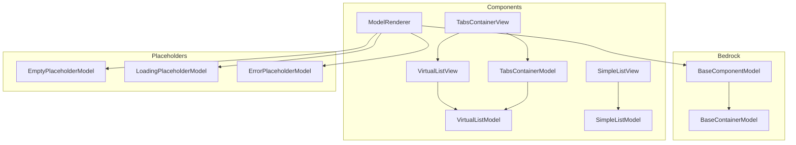
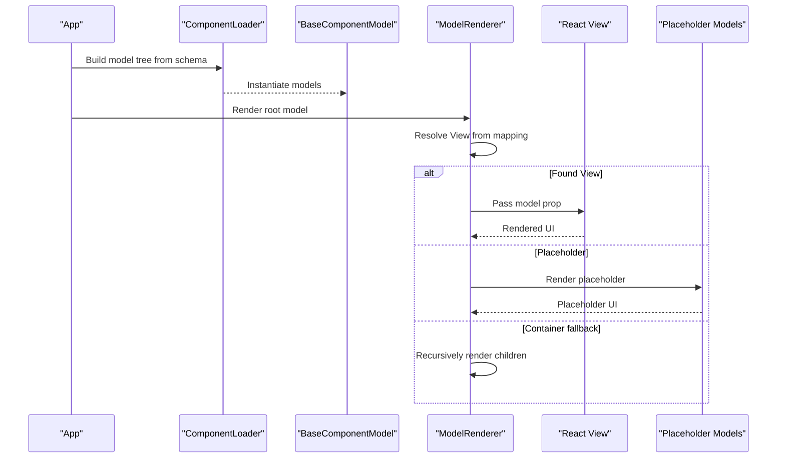
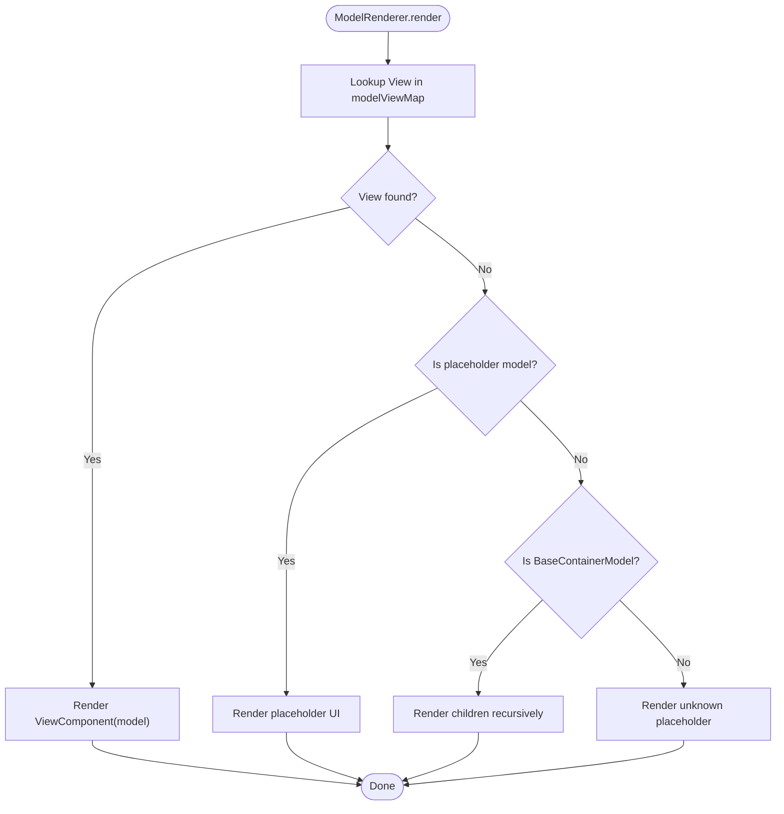
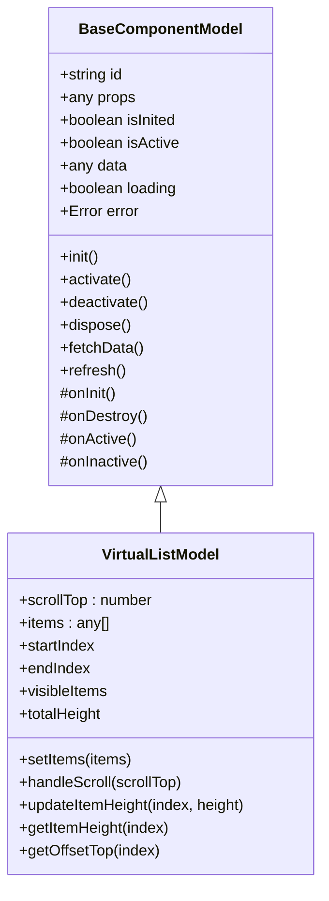
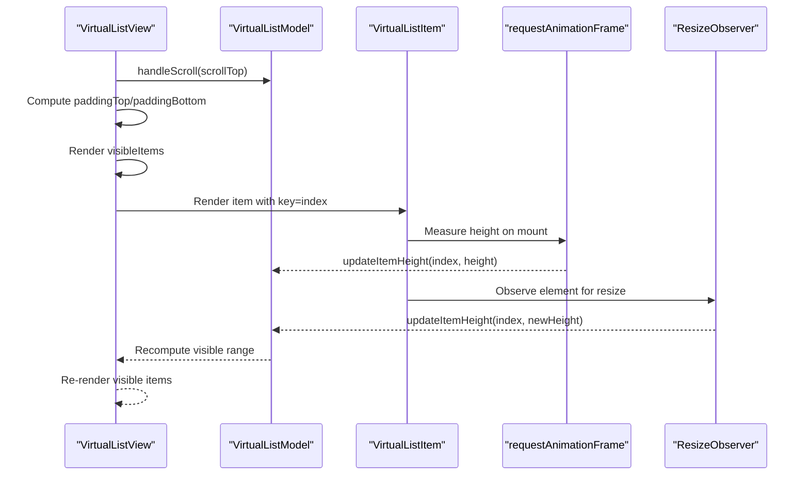
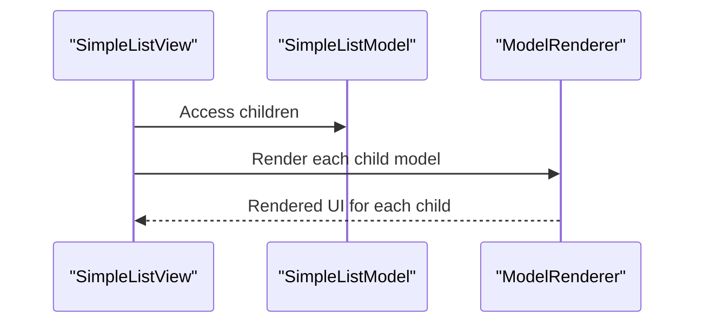
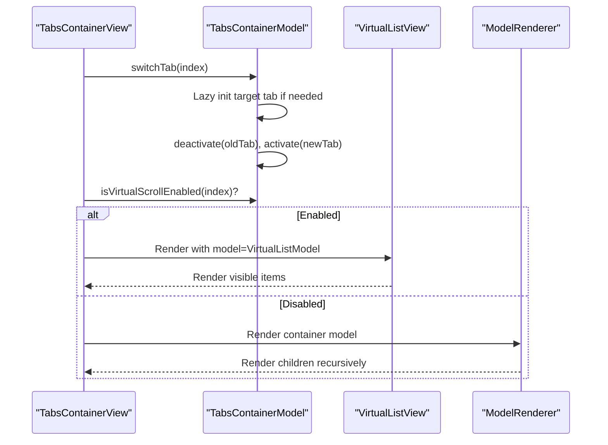
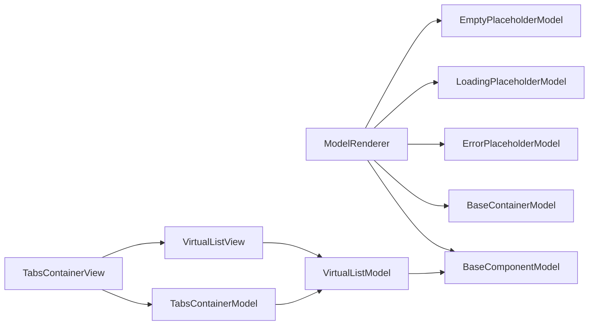

# Components

<cite>
**Referenced Files in This Document**
- [model-renderer.tsx](file://packages/h5-builder/src/components/model-renderer.tsx)
- [virtual-list.view.tsx](file://packages/h5-builder/src/components/virtual-list/virtual-list.view.tsx)
- [virtual-list.model.ts](file://packages/h5-builder/src/components/virtual-list/virtual-list.model.ts)
- [simple-list.view.tsx](file://packages/h5-builder/src/components/simple-list/simple-list.view.tsx)
- [simple-list.model.ts](file://packages/h5-builder/src/components/simple-list/simple-list.model.ts)
- [tabs-container.model.ts](file://packages/h5-builder/src/components/tabs-container/tabs-container.model.ts)
- [tabs-container.view.tsx](file://packages/h5-builder/src/components/tabs-container/tabs-container.view.tsx)
- [model.ts](file://packages/h5-builder/src/bedrock/model.ts)
- [index.ts](file://packages/h5-builder/src/placeholder/index.ts)
- [api_reference.md](file://packages/h5-builder/docs/api_reference.md)
- [auto-virtual-scroll.md](file://packages/h5-builder/docs/auto-virtual-scroll.md)
- [component_development_guide.md](file://packages/h5-builder/docs/component_development_guide.md)
</cite>

## Table of Contents
1. [Introduction](#introduction)
2. [Project Structure](#project-structure)
3. [Core Components](#core-components)
4. [Architecture Overview](#architecture-overview)
5. [Detailed Component Analysis](#detailed-component-analysis)
6. [Dependency Analysis](#dependency-analysis)
7. [Performance Considerations](#performance-considerations)
8. [Troubleshooting Guide](#troubleshooting-guide)
9. [Conclusion](#conclusion)
10. [Appendices](#appendices)

## Introduction
This document provides comprehensive API documentation for the Components layer of the H5 Builder Framework. It focuses on two key components:
- ModelRenderer: a recursive renderer that maps models to views and handles placeholders and containers.
- VirtualList: a performance-optimized list renderer with fixed and dynamic height modes, overscan, and virtualization mechanics.

It also covers the model-view mapping system, virtualization internals, and practical usage patterns, including schema-driven composition, automatic virtual scrolling in TabsContainer, and best practices for state synchronization and integration with the model system.

## Project Structure
The Components layer is organized around reusable building blocks:
- Model base classes define lifecycle, state, and container semantics.
- Renderer components map models to views and handle placeholders and container fallbacks.
- Virtual list components encapsulate virtualization logic for large lists.
- Example containers demonstrate composition and advanced features like automatic virtual scrolling.

**Diagram sources**
- [model-renderer.tsx](file://packages/h5-builder/src/components/model-renderer.tsx#L1-L105)
- [virtual-list.view.tsx](file://packages/h5-builder/src/components/virtual-list/virtual-list.view.tsx#L1-L129)
- [virtual-list.model.ts](file://packages/h5-builder/src/components/virtual-list/virtual-list.model.ts#L1-L217)
- [simple-list.view.tsx](file://packages/h5-builder/src/components/simple-list/simple-list.view.tsx#L1-L30)
- [simple-list.model.ts](file://packages/h5-builder/src/components/simple-list/simple-list.model.ts#L1-L16)
- [tabs-container.model.ts](file://packages/h5-builder/src/components/tabs-container/tabs-container.model.ts#L1-L273)
- [tabs-container.view.tsx](file://packages/h5-builder/src/components/tabs-container/tabs-container.view.tsx#L1-L85)
- [model.ts](file://packages/h5-builder/src/bedrock/model.ts#L1-L243)
- [index.ts](file://packages/h5-builder/src/placeholder/index.ts#L1-L30)

**Section sources**
- [model-renderer.tsx](file://packages/h5-builder/src/components/model-renderer.tsx#L1-L105)
- [virtual-list.view.tsx](file://packages/h5-builder/src/components/virtual-list/virtual-list.view.tsx#L1-L129)
- [virtual-list.model.ts](file://packages/h5-builder/src/components/virtual-list/virtual-list.model.ts#L1-L217)
- [simple-list.view.tsx](file://packages/h5-builder/src/components/simple-list/simple-list.view.tsx#L1-L30)
- [simple-list.model.ts](file://packages/h5-builder/src/components/simple-list/simple-list.model.ts#L1-L16)
- [tabs-container.model.ts](file://packages/h5-builder/src/components/tabs-container/tabs-container.model.ts#L1-L273)
- [tabs-container.view.tsx](file://packages/h5-builder/src/components/tabs-container/tabs-container.view.tsx#L1-L85)
- [model.ts](file://packages/h5-builder/src/bedrock/model.ts#L1-L243)
- [index.ts](file://packages/h5-builder/src/placeholder/index.ts#L1-L30)

## Core Components
- ModelRenderer
  - Purpose: Recursively renders a model tree by mapping model classes to view components. Handles placeholders and container fallbacks.
  - Key APIs:
    - registerModelView(ModelClass, ViewComponent)
    - registerModelViews(mappings)
    - Props: { model: BaseComponentModel }
  - Behavior:
    - Uses an internal Map to store Model-View mappings.
    - Renders placeholders for ErrorPlaceholderModel, LoadingPlaceholderModel, EmptyPlaceholderModel.
    - For BaseContainerModel, renders children recursively.
    - Falls back to a default container layout for unregistered container models.
- VirtualList
  - Purpose: Renders large lists efficiently by virtualizing visible items and computing offsets.
  - Model (VirtualListModel):
    - Props: { itemHeight?, estimatedItemHeight?, containerHeight, overscan? }
    - Methods: setItems(items), handleScroll(scrollTop), updateItemHeight(index, height)
    - Computed properties: startIndex, endIndex, visibleItems, totalHeight
    - Modes:
      - Fixed height mode: uses itemHeight for calculations.
      - Dynamic height mode: uses estimatedItemHeight and measures item heights via observers.
  - View (VirtualListView):
    - Props: { model: VirtualListModel, renderItem(item, index) }
    - Computes paddingTop/paddingBottom based on visible range and renders only visible items.
    - Uses requestAnimationFrame and ResizeObserver to measure item heights and update model.

**Section sources**
- [model-renderer.tsx](file://packages/h5-builder/src/components/model-renderer.tsx#L1-L105)
- [virtual-list.model.ts](file://packages/h5-builder/src/components/virtual-list/virtual-list.model.ts#L1-L217)
- [virtual-list.view.tsx](file://packages/h5-builder/src/components/virtual-list/virtual-list.view.tsx#L1-L129)

## Architecture Overview
The Components layer follows a strict Model-View separation:
- Models manage state, lifecycle, and data fetching.
- Views render UI and delegate interactions to models.
- Renderer components orchestrate model-to-view mapping and container rendering.
- VirtualList integrates with models to compute visibility and offsets.

**Diagram sources**
- [model-renderer.tsx](file://packages/h5-builder/src/components/model-renderer.tsx#L1-L105)
- [model.ts](file://packages/h5-builder/src/bedrock/model.ts#L1-L243)
- [index.ts](file://packages/h5-builder/src/placeholder/index.ts#L1-L30)

## Detailed Component Analysis

### ModelRenderer
- Responsibilities:
  - Maintain and use a global model-view mapping registry.
  - Render placeholders for special model types.
  - Render containers recursively when no view is registered.
- Public APIs:
  - registerModelView(ModelClass, ViewComponent)
  - registerModelViews(mappings)
- Props:
  - model: BaseComponentModel
- Rendering patterns:
  - If a view is registered for the model’s constructor, render it.
  - Otherwise, render placeholders for error/loading/empty states.
  - For BaseContainerModel, render children recursively.
  - Unknown model types render a generic unknown placeholder.

**Diagram sources**
- [model-renderer.tsx](file://packages/h5-builder/src/components/model-renderer.tsx#L1-L105)
- [index.ts](file://packages/h5-builder/src/placeholder/index.ts#L1-L30)
- [model.ts](file://packages/h5-builder/src/bedrock/model.ts#L158-L243)

**Section sources**
- [model-renderer.tsx](file://packages/h5-builder/src/components/model-renderer.tsx#L1-L105)
- [index.ts](file://packages/h5-builder/src/placeholder/index.ts#L1-L30)
- [model.ts](file://packages/h5-builder/src/bedrock/model.ts#L1-L243)

### VirtualList (Model and View)
- VirtualListModel
  - Props:
    - itemHeight?: number (fixed height mode)
    - estimatedItemHeight?: number (dynamic height mode)
    - containerHeight: number
    - overscan?: number
  - Methods:
    - setItems(items: any[]): void
    - handleScroll(scrollTop: number): void
    - updateItemHeight(index: number, height: number): void
  - Computed properties:
    - startIndex: visible start index (binary search for dynamic height, simple math for fixed height)
    - endIndex: visible end index (iterative for dynamic height)
    - visibleItems: array of { item, index, top, height }
    - totalHeight: sum of heights (cached via offset cache)
  - Height caching and offset caching minimize recomputation.
- VirtualListView
  - Props:
    - model: VirtualListModel
    - renderItem(item, index): ReactNode
  - Rendering:
    - Calculates paddingTop/paddingBottom based on visible range.
    - Renders only visible items with keys derived from indices.
    - Uses requestAnimationFrame and ResizeObserver to measure item heights and notify model updates.

**Diagram sources**
- [virtual-list.model.ts](file://packages/h5-builder/src/components/virtual-list/virtual-list.model.ts#L1-L217)
- [model.ts](file://packages/h5-builder/src/bedrock/model.ts#L1-L157)

**Diagram sources**
- [virtual-list.view.tsx](file://packages/h5-builder/src/components/virtual-list/virtual-list.view.tsx#L1-L129)
- [virtual-list.model.ts](file://packages/h5-builder/src/components/virtual-list/virtual-list.model.ts#L1-L217)

**Section sources**
- [virtual-list.model.ts](file://packages/h5-builder/src/components/virtual-list/virtual-list.model.ts#L1-L217)
- [virtual-list.view.tsx](file://packages/h5-builder/src/components/virtual-list/virtual-list.view.tsx#L1-L129)
- [model.ts](file://packages/h5-builder/src/bedrock/model.ts#L1-L157)

### SimpleList (Container Example)
- SimpleListModel extends BaseContainerModel and inherits automatic initialization, activation, and deactivation of children.
- SimpleListView renders children via ModelRenderer.

**Diagram sources**
- [simple-list.view.tsx](file://packages/h5-builder/src/components/simple-list/simple-list.view.tsx#L1-L30)
- [simple-list.model.ts](file://packages/h5-builder/src/components/simple-list/simple-list.model.ts#L1-L16)
- [model.ts](file://packages/h5-builder/src/bedrock/model.ts#L158-L243)

**Section sources**
- [simple-list.view.tsx](file://packages/h5-builder/src/components/simple-list/simple-list.view.tsx#L1-L30)
- [simple-list.model.ts](file://packages/h5-builder/src/components/simple-list/simple-list.model.ts#L1-L16)
- [model.ts](file://packages/h5-builder/src/bedrock/model.ts#L158-L243)

### TabsContainer (Automatic Virtual Scroll)
- TabsContainerModel:
  - Detects whether to enable virtual scrolling for each tab based on child count and thresholds.
  - Creates VirtualListModel instances for eligible tabs and caches them.
  - Manages tab switching with lazy initialization and pre-warming strategies.
- TabsContainerView:
  - Renders tab headers and content panels.
  - Switches between VirtualListView and ModelRenderer depending on whether virtual scroll is enabled.

**Diagram sources**
- [tabs-container.model.ts](file://packages/h5-builder/src/components/tabs-container/tabs-container.model.ts#L1-L273)
- [tabs-container.view.tsx](file://packages/h5-builder/src/components/tabs-container/tabs-container.view.tsx#L1-L85)
- [virtual-list.view.tsx](file://packages/h5-builder/src/components/virtual-list/virtual-list.view.tsx#L1-L129)
- [model-renderer.tsx](file://packages/h5-builder/src/components/model-renderer.tsx#L1-L105)

**Section sources**
- [tabs-container.model.ts](file://packages/h5-builder/src/components/tabs-container/tabs-container.model.ts#L1-L273)
- [tabs-container.view.tsx](file://packages/h5-builder/src/components/tabs-container/tabs-container.view.tsx#L1-L85)
- [auto-virtual-scroll.md](file://packages/h5-builder/docs/auto-virtual-scroll.md#L1-L216)

## Dependency Analysis
- ModelRenderer depends on:
  - BaseComponentModel and BaseContainerModel for runtime checks.
  - Placeholder models for fallback rendering.
  - A global model-view registry for mapping.
- VirtualList depends on:
  - VirtualListModel for state and computations.
  - MobX observer for reactive rendering.
  - requestAnimationFrame and ResizeObserver for measurement.
- TabsContainer integrates:
  - VirtualListModel creation and caching.
  - Lifecycle management for tabs (lazy init, pre-warm, switch).

**Diagram sources**
- [model-renderer.tsx](file://packages/h5-builder/src/components/model-renderer.tsx#L1-L105)
- [virtual-list.view.tsx](file://packages/h5-builder/src/components/virtual-list/virtual-list.view.tsx#L1-L129)
- [virtual-list.model.ts](file://packages/h5-builder/src/components/virtual-list/virtual-list.model.ts#L1-L217)
- [tabs-container.view.tsx](file://packages/h5-builder/src/components/tabs-container/tabs-container.view.tsx#L1-L85)
- [tabs-container.model.ts](file://packages/h5-builder/src/components/tabs-container/tabs-container.model.ts#L1-L273)
- [model.ts](file://packages/h5-builder/src/bedrock/model.ts#L1-L243)
- [index.ts](file://packages/h5-builder/src/placeholder/index.ts#L1-L30)

**Section sources**
- [model-renderer.tsx](file://packages/h5-builder/src/components/model-renderer.tsx#L1-L105)
- [virtual-list.view.tsx](file://packages/h5-builder/src/components/virtual-list/virtual-list.view.tsx#L1-L129)
- [virtual-list.model.ts](file://packages/h5-builder/src/components/virtual-list/virtual-list.model.ts#L1-L217)
- [tabs-container.model.ts](file://packages/h5-builder/src/components/tabs-container/tabs-container.model.ts#L1-L273)
- [tabs-container.view.tsx](file://packages/h5-builder/src/components/tabs-container/tabs-container.view.tsx#L1-L85)
- [model.ts](file://packages/h5-builder/src/bedrock/model.ts#L1-L243)
- [index.ts](file://packages/h5-builder/src/placeholder/index.ts#L1-L30)

## Performance Considerations
- Virtualization mechanics:
  - Visible range computed via startIndex/endIndex.
  - Fixed-height mode uses arithmetic; dynamic-height mode uses binary search and cumulative offsets.
  - Overscan reduces white screen during scroll by rendering extra items.
- Measurement and caching:
  - requestAnimationFrame ensures accurate measurements after layout.
  - ResizeObserver tracks dynamic height changes and invalidates downstream caches.
  - Height and offset caches prevent repeated computation.
- Container optimization:
  - BaseContainerModel initializes children in parallel by default.
  - TabsContainer pre-warms neighboring tabs and applies timeouts to ensure readiness.
- Best practices:
  - Prefer dynamic height mode when items have varying heights; otherwise use fixed height for simplicity.
  - Tune overscan to balance memory and smoothness.
  - Monitor totalHeight and visibleItems to diagnose performance regressions.

[No sources needed since this section provides general guidance]

## Troubleshooting Guide
- Rendering performance issues:
  - Verify overscan is set appropriately.
  - Ensure dynamic height mode is used when item heights vary; otherwise, set itemHeight for fixed-height mode.
  - Confirm height cache is being populated (check updateItemHeight calls).
- State synchronization:
  - Ensure models are observable (inherited from BaseComponentModel) and attributes are declared as class fields.
  - Use refresh() to re-fetch data and reset loading/error states.
- Integration with model system:
  - Register model-view mappings using registerModelView/registerModelViews.
  - For containers, ensure children are added via addChild and lifecycle hooks are respected.
  - For TabsContainer, confirm virtual scroll thresholds and container heights are configured as expected.

**Section sources**
- [model.ts](file://packages/h5-builder/src/bedrock/model.ts#L1-L243)
- [model-renderer.tsx](file://packages/h5-builder/src/components/model-renderer.tsx#L1-L105)
- [virtual-list.model.ts](file://packages/h5-builder/src/components/virtual-list/virtual-list.model.ts#L1-L217)
- [tabs-container.model.ts](file://packages/h5-builder/src/components/tabs-container/tabs-container.model.ts#L1-L273)

## Conclusion
The Components layer provides a robust, scalable foundation for building H5 pages:
- ModelRenderer enables flexible model-view mapping and graceful fallbacks.
- VirtualList delivers high-performance rendering for large datasets with both fixed and dynamic height support.
- TabsContainer demonstrates advanced composition patterns, including automatic virtual scrolling and lifecycle optimization.
By adhering to the Model-View separation and leveraging the provided APIs and patterns, developers can build responsive, maintainable, and performant UIs.

[No sources needed since this section summarizes without analyzing specific files]

## Appendices

### API Reference Highlights
- ModelRenderer
  - Props: { model: BaseComponentModel }
  - Registration: registerModelView(ModelClass, ViewComponent), registerModelViews(mappings)
- VirtualList
  - Model: VirtualListModel
    - Props: { itemHeight?, estimatedItemHeight?, containerHeight, overscan? }
    - Methods: setItems(items), handleScroll(scrollTop), updateItemHeight(index, height)
    - Computed: startIndex, endIndex, visibleItems, totalHeight
  - View: VirtualListView
    - Props: { model: VirtualListModel, renderItem(item, index) }

**Section sources**
- [api_reference.md](file://packages/h5-builder/docs/api_reference.md#L607-L680)
- [model-renderer.tsx](file://packages/h5-builder/src/components/model-renderer.tsx#L1-L105)
- [virtual-list.model.ts](file://packages/h5-builder/src/components/virtual-list/virtual-list.model.ts#L1-L217)
- [virtual-list.view.tsx](file://packages/h5-builder/src/components/virtual-list/virtual-list.view.tsx#L1-L129)

### Usage Examples and Patterns
- Model-View registration and rendering:
  - Register mappings globally, then render the root model with ModelRenderer.
- VirtualList usage:
  - Create VirtualListModel with appropriate props, pass to VirtualListView, and implement renderItem.
- Automatic virtual scrolling:
  - Configure TabsContainer with virtualScroll props; the framework detects and enables virtual scrolling automatically.

**Section sources**
- [component_development_guide.md](file://packages/h5-builder/docs/component_development_guide.md#L1-L510)
- [auto-virtual-scroll.md](file://packages/h5-builder/docs/auto-virtual-scroll.md#L1-L216)
- [tabs-container.model.ts](file://packages/h5-builder/src/components/tabs-container/tabs-container.model.ts#L1-L273)
- [tabs-container.view.tsx](file://packages/h5-builder/src/components/tabs-container/tabs-container.view.tsx#L1-L85)