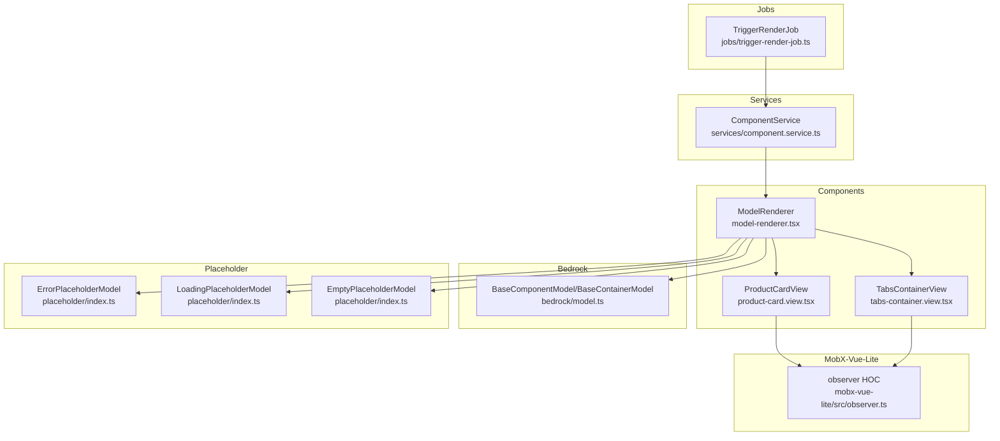
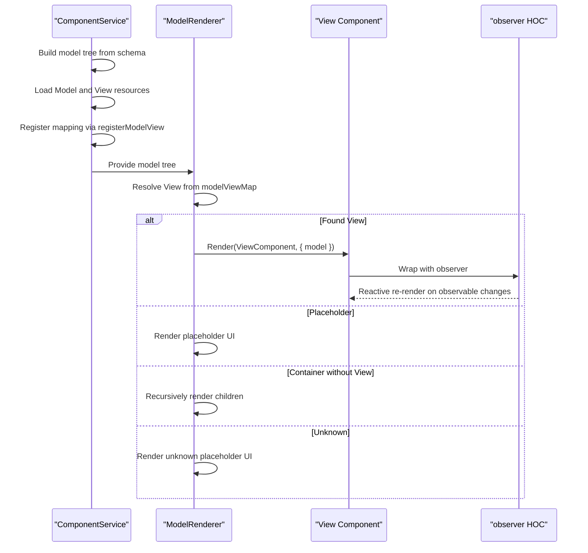
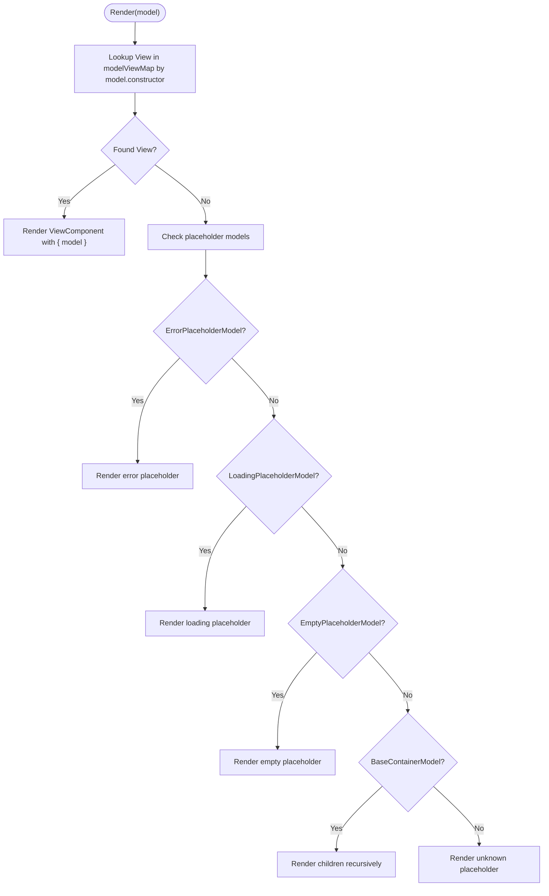
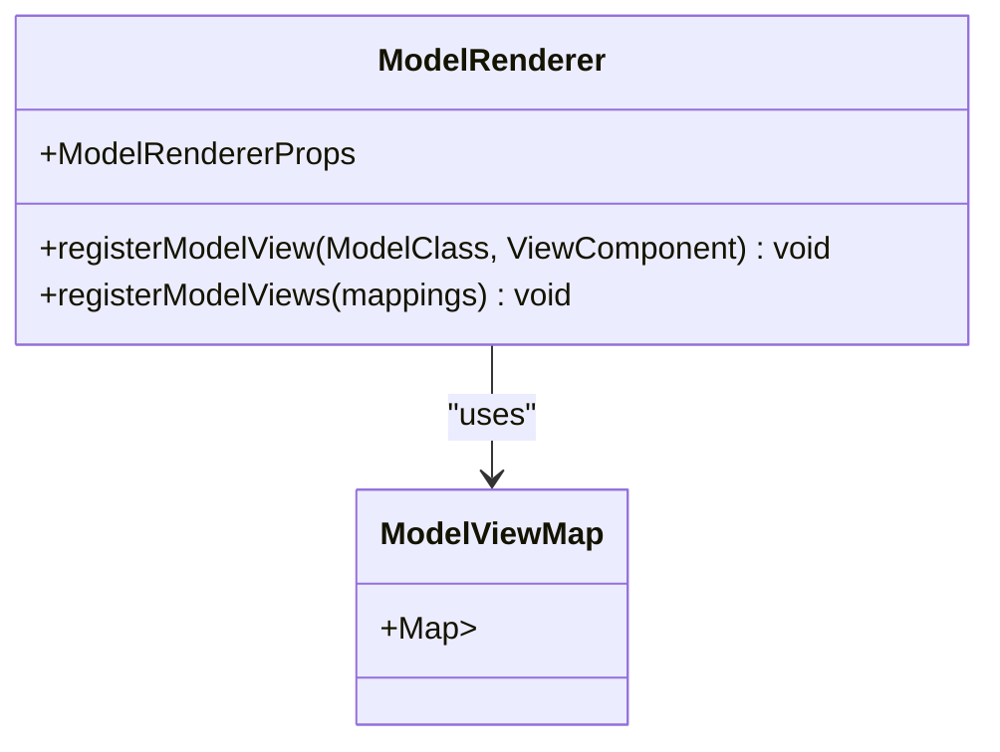
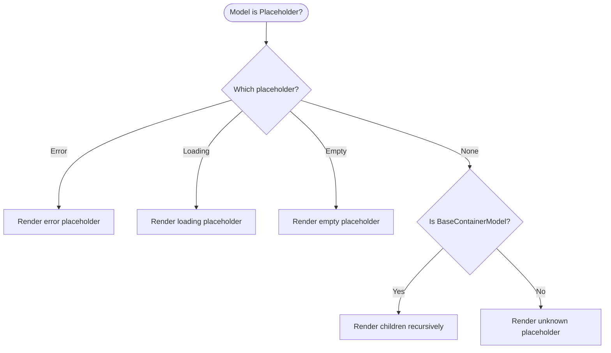
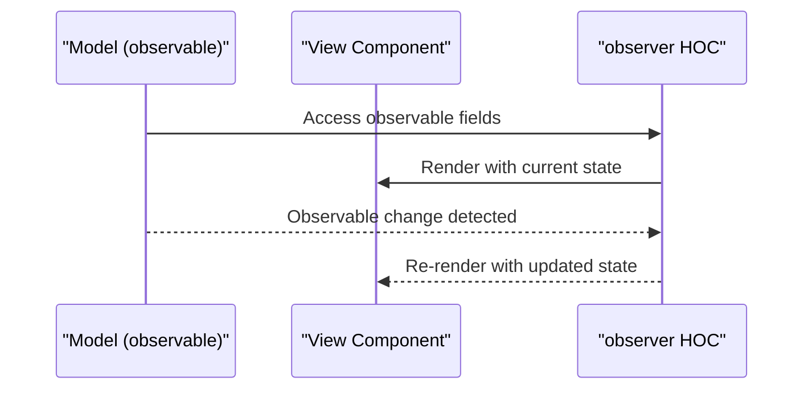
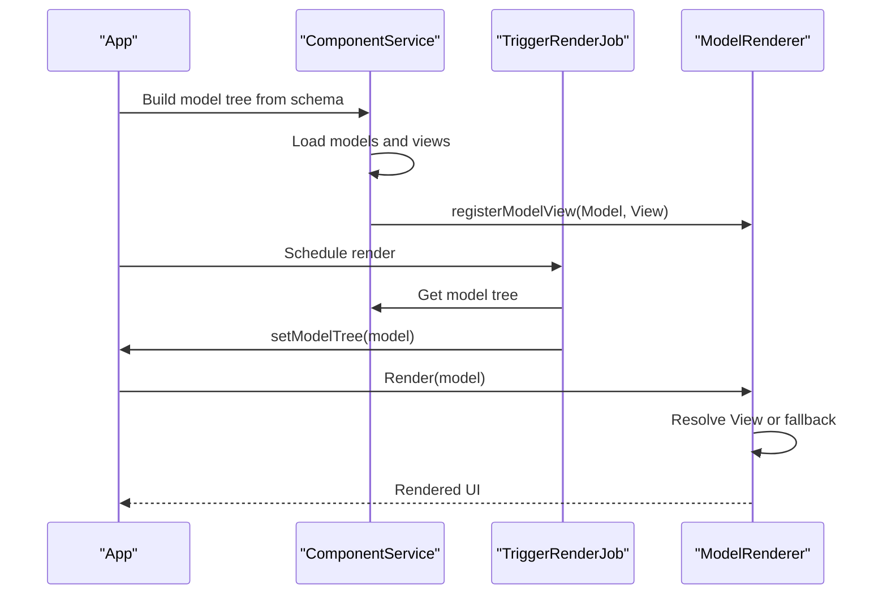
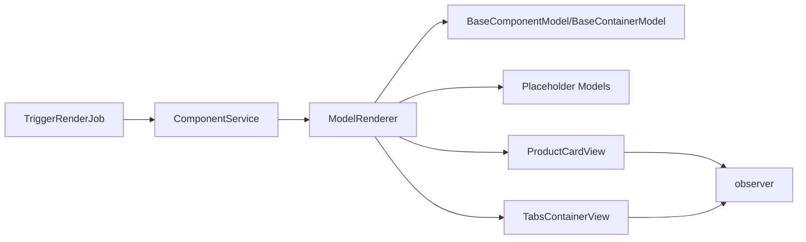

# ModelRenderer

<cite>
**Referenced Files in This Document**
- [model-renderer.tsx](file://packages/h5-builder/src/components/model-renderer.tsx)
- [index.ts](file://packages/h5-builder/src/components/index.ts)
- [model.ts](file://packages/h5-builder/src/bedrock/model.ts)
- [index.ts](file://packages/h5-builder/src/placeholder/index.ts)
- [product-card.model.ts](file://packages/h5-builder/src/components/product-card/product-card.model.ts)
- [product-card.view.tsx](file://packages/h5-builder/src/components/product-card/product-card.view.tsx)
- [tabs-container.model.ts](file://packages/h5-builder/src/components/tabs-container/tabs-container.model.ts)
- [tabs-container.view.tsx](file://packages/h5-builder/src/components/tabs-container/tabs-container.view.tsx)
- [virtual-list.model.ts](file://packages/h5-builder/src/components/virtual-list/virtual-list.model.ts)
- [trigger-render-job.ts](file://packages/h5-builder/src/jobs/trigger-render-job.ts)
- [observer.ts](file://packages/mobx-vue-lite/src/observer.ts)
</cite>

## Table of Contents
1. [Introduction](#introduction)
2. [Project Structure](#project-structure)
3. [Core Components](#core-components)
4. [Architecture Overview](#architecture-overview)
5. [Detailed Component Analysis](#detailed-component-analysis)
6. [Dependency Analysis](#dependency-analysis)
7. [Performance Considerations](#performance-considerations)
8. [Troubleshooting Guide](#troubleshooting-guide)
9. [Conclusion](#conclusion)
10. [Appendices](#appendices)

## Introduction
ModelRenderer is the central recursive rendering engine in the H5 Builder Framework. It maps model instances to their corresponding view components using a registration-based mapping system. The renderer:
- Uses a global Map to associate Model classes with View components
- Provides registration APIs to add or batch-add mappings
- Handles built-in placeholder models for error/loading/empty states
- Implements fallback rendering for container components and unknown types
- Integrates with mobx-vue-lite’s observer to ensure reactive updates

This document explains the modelViewMap, registerModelView/registerModelViews, fallback behaviors, and how the renderer composes with other parts of the framework to render complex trees efficiently.

## Project Structure
The ModelRenderer lives under the components folder and integrates with the bedrock model layer, placeholder models, and example components.

**Diagram sources**
- [model-renderer.tsx](file://packages/h5-builder/src/components/model-renderer.tsx#L1-L105)
- [model.ts](file://packages/h5-builder/src/bedrock/model.ts#L1-L200)
- [index.ts](file://packages/h5-builder/src/placeholder/index.ts#L1-L30)
- [product-card.view.tsx](file://packages/h5-builder/src/components/product-card/product-card.view.tsx#L1-L81)
- [tabs-container.view.tsx](file://packages/h5-builder/src/components/tabs-container/tabs-container.view.tsx#L1-L85)
- [trigger-render-job.ts](file://packages/h5-builder/src/jobs/trigger-render-job.ts#L1-L44)
- [observer.ts](file://packages/mobx-vue-lite/src/observer.ts#L1-L52)

**Section sources**
- [model-renderer.tsx](file://packages/h5-builder/src/components/model-renderer.tsx#L1-L105)
- [index.ts](file://packages/h5-builder/src/components/index.ts#L1-L14)

## Core Components
- modelViewMap: A global Map that stores Model class keys mapped to View component types.
- registerModelView(ModelClass, ViewComponent): Registers a single mapping.
- registerModelViews(mappings): Registers multiple mappings in bulk.
- ModelRenderer: The main renderer that selects the appropriate View based on model type, handles placeholders, and falls back to container rendering.

Key behaviors:
- If a View is registered for the model’s constructor, it renders that View with the model passed as props.
- If the model is a placeholder type, it renders a dedicated placeholder UI.
- If the model is a container without a registered View, it recursively renders its children.
- If no mapping exists and the model is not a container, it renders an “unknown” placeholder.

**Section sources**
- [model-renderer.tsx](file://packages/h5-builder/src/components/model-renderer.tsx#L1-L105)

## Architecture Overview
ModelRenderer sits at the boundary between models and views. It relies on:
- Bedrock models for lifecycle and container composition
- Placeholder models for robust error/empty/loading states
- ComponentService to build model trees and establish Model-View mappings
- Jobs to trigger React rendering when the model tree is ready
- MobX-Vue-Lite observer to keep views reactive

**Diagram sources**
- [model-renderer.tsx](file://packages/h5-builder/src/components/model-renderer.tsx#L1-L105)
- [product-card.view.tsx](file://packages/h5-builder/src/components/product-card/product-card.view.tsx#L1-L81)
- [tabs-container.view.tsx](file://packages/h5-builder/src/components/tabs-container/tabs-container.view.tsx#L1-L85)
- [observer.ts](file://packages/mobx-vue-lite/src/observer.ts#L1-L52)

## Detailed Component Analysis

### ModelRenderer Implementation
- Data structure: modelViewMap is a Map keyed by Model class constructors and valued by React component types.
- Registration: registerModelView and registerModelViews populate modelViewMap. The component registers defaults for ProductCard and TabsContainer during initialization.
- Rendering logic:
  - Lookup View by model.constructor in modelViewMap
  - If found, render the View with model as props
  - If not found, check placeholder models and render appropriate placeholder UI
  - If still not found and model is a container, render children recursively
  - Otherwise, render an “unknown” placeholder UI

**Diagram sources**
- [model-renderer.tsx](file://packages/h5-builder/src/components/model-renderer.tsx#L1-L105)

**Section sources**
- [model-renderer.tsx](file://packages/h5-builder/src/components/model-renderer.tsx#L1-L105)

### Model-View Registration System
- Global registry: modelViewMap holds Model class to View component mappings.
- Single registration: registerModelView sets the mapping.
- Batch registration: registerModelViews iterates over pairs and calls registerModelView.
- Defaults: The component registers ProductCard and TabsContainer mappings upon import.

**Diagram sources**
- [model-renderer.tsx](file://packages/h5-builder/src/components/model-renderer.tsx#L1-L105)

**Section sources**
- [model-renderer.tsx](file://packages/h5-builder/src/components/model-renderer.tsx#L1-L105)

### Placeholder Models and Fallback Behavior
- ErrorPlaceholderModel, LoadingPlaceholderModel, EmptyPlaceholderModel are special models used to represent error/loading/empty states.
- When a model instance is one of these types, ModelRenderer renders a dedicated placeholder UI instead of attempting to find a View.
- If a container model lacks a registered View, ModelRenderer falls back to rendering its children recursively.

**Diagram sources**
- [model-renderer.tsx](file://packages/h5-builder/src/components/model-renderer.tsx#L1-L105)
- [index.ts](file://packages/h5-builder/src/placeholder/index.ts#L1-L30)

**Section sources**
- [model-renderer.tsx](file://packages/h5-builder/src/components/model-renderer.tsx#L1-L105)
- [index.ts](file://packages/h5-builder/src/placeholder/index.ts#L1-L30)

### Integration with MobX-Vue-Lite Observer
- Views wrap their render functions with observer to automatically subscribe to observable changes in the model and re-render only when needed.
- This ensures that ModelRenderer’s children also benefit from fine-grained reactivity.

**Diagram sources**
- [observer.ts](file://packages/mobx-vue-lite/src/observer.ts#L1-L52)
- [product-card.view.tsx](file://packages/h5-builder/src/components/product-card/product-card.view.tsx#L1-L81)
- [tabs-container.view.tsx](file://packages/h5-builder/src/components/tabs-container/tabs-container.view.tsx#L1-L85)

**Section sources**
- [observer.ts](file://packages/mobx-vue-lite/src/observer.ts#L1-L52)
- [product-card.view.tsx](file://packages/h5-builder/src/components/product-card/product-card.view.tsx#L1-L81)
- [tabs-container.view.tsx](file://packages/h5-builder/src/components/tabs-container/tabs-container.view.tsx#L1-L85)

### Practical Examples

- Registering a custom model-view pair:
  - Import registerModelView from the components index export.
  - Call registerModelView(MyModelClass, MyViewComponent) to bind them.
  - Alternatively, pass an array of pairs to registerModelViews for batch registration.

- Rendering a complex component tree:
  - Build a model tree using ComponentService (which loads models/views and registers mappings).
  - Trigger rendering via TriggerRenderJob, which reads the model tree from ComponentService and sets it to the UI.
  - ModelRenderer recursively renders the tree, falling back to container rendering when no View is registered.

**Diagram sources**
- [index.ts](file://packages/h5-builder/src/components/index.ts#L1-L14)
- [trigger-render-job.ts](file://packages/h5-builder/src/jobs/trigger-render-job.ts#L1-L44)
- [model-renderer.tsx](file://packages/h5-builder/src/components/model-renderer.tsx#L1-L105)

**Section sources**
- [index.ts](file://packages/h5-builder/src/components/index.ts#L1-L14)
- [trigger-render-job.ts](file://packages/h5-builder/src/jobs/trigger-render-job.ts#L1-L44)
- [model-renderer.tsx](file://packages/h5-builder/src/components/model-renderer.tsx#L1-L105)

## Dependency Analysis
- ModelRenderer depends on:
  - Bedrock models for BaseComponentModel and BaseContainerModel
  - Placeholder models for error/loading/empty states
  - Example components (ProductCard, TabsContainer) to demonstrate registration and rendering
- ComponentService orchestrates loading and mapping, then provides the model tree to the renderer
- MobX-Vue-Lite observer ensures reactive updates in views

**Diagram sources**
- [model-renderer.tsx](file://packages/h5-builder/src/components/model-renderer.tsx#L1-L105)
- [model.ts](file://packages/h5-builder/src/bedrock/model.ts#L1-L200)
- [index.ts](file://packages/h5-builder/src/placeholder/index.ts#L1-L30)
- [product-card.view.tsx](file://packages/h5-builder/src/components/product-card/product-card.view.tsx#L1-L81)
- [tabs-container.view.tsx](file://packages/h5-builder/src/components/tabs-container/tabs-container.view.tsx#L1-L85)
- [trigger-render-job.ts](file://packages/h5-builder/src/jobs/trigger-render-job.ts#L1-L44)
- [observer.ts](file://packages/mobx-vue-lite/src/observer.ts#L1-L52)

**Section sources**
- [model-renderer.tsx](file://packages/h5-builder/src/components/model-renderer.tsx#L1-L105)
- [model.ts](file://packages/h5-builder/src/bedrock/model.ts#L1-L200)
- [index.ts](file://packages/h5-builder/src/placeholder/index.ts#L1-L30)
- [product-card.view.tsx](file://packages/h5-builder/src/components/product-card/product-card.view.tsx#L1-L81)
- [tabs-container.view.tsx](file://packages/h5-builder/src/components/tabs-container/tabs-container.view.tsx#L1-L85)
- [trigger-render-job.ts](file://packages/h5-builder/src/jobs/trigger-render-job.ts#L1-L44)
- [observer.ts](file://packages/mobx-vue-lite/src/observer.ts#L1-L52)

## Performance Considerations
- Recursive rendering: ModelRenderer traverses container children recursively. For deeply nested trees, consider:
  - Using virtualization (e.g., VirtualListModel) for long lists inside containers
  - Lazy initialization of containers (as demonstrated by TabsContainerModel) to defer heavy work until needed
  - Minimizing unnecessary re-renders by keeping models observable and views wrapped with observer
- Placeholder rendering: Placeholder models short-circuit expensive View rendering and provide fast feedback for error/loading/empty states.
- Registration overhead: Prefer batch registration via registerModelViews to reduce repeated Map operations.

[No sources needed since this section provides general guidance]

## Troubleshooting Guide
Common issues and resolutions:
- Missing view registration:
  - Symptom: Unknown placeholder UI appears for a registered model type.
  - Cause: The Model class was not mapped to a View via registerModelView/registerModelViews.
  - Resolution: Ensure the mapping is established before rendering. Use registerModelViews with the correct Model/View pairs.

- Incorrect model-view mappings:
  - Symptom: Wrong View renders for a given model.
  - Cause: A different Model class was registered for the View, or the wrong View was registered.
  - Resolution: Verify the exact Model class constructor used by the model instance and ensure it matches the key in modelViewMap.

- Performance problems in deep trees:
  - Symptom: Slow rendering or jank in complex nested structures.
  - Causes: Excessive recursion, lack of virtualization, or heavy computations in views.
  - Resolutions:
    - Use VirtualListModel for long lists
    - Initialize containers lazily (see TabsContainerModel)
    - Keep views small and reactive with observer
    - Avoid heavy synchronous work in render paths

- Placeholder UI not appearing:
  - Symptom: Unexpected rendering instead of placeholder.
  - Causes: The model instance is not an instance of the expected placeholder classes.
  - Resolution: Confirm the model type and ensure ComponentService creates the correct placeholder models when errors occur.

**Section sources**
- [model-renderer.tsx](file://packages/h5-builder/src/components/model-renderer.tsx#L1-L105)
- [tabs-container.model.ts](file://packages/h5-builder/src/components/tabs-container/tabs-container.model.ts#L1-L273)
- [virtual-list.model.ts](file://packages/h5-builder/src/components/virtual-list/virtual-list.model.ts#L1-L217)

## Conclusion
ModelRenderer is the backbone of the H5 Builder’s rendering pipeline. It provides a clean, extensible mapping from models to views, robust fallbacks for containers and unknown types, and seamless integration with MobX-Vue-Lite for reactivity. By registering model-view pairs thoughtfully and leveraging container-level optimizations, teams can build scalable, responsive UI trees that remain maintainable and performant.

[No sources needed since this section summarizes without analyzing specific files]

## Appendices

### API Reference
- registerModelView(ModelClass, ViewComponent): Adds a single mapping to modelViewMap.
- registerModelViews(mappings): Adds multiple mappings to modelViewMap.
- ModelRenderer(model): Renders the appropriate View or fallback based on the model type.

**Section sources**
- [model-renderer.tsx](file://packages/h5-builder/src/components/model-renderer.tsx#L1-L105)
- [index.ts](file://packages/h5-builder/src/components/index.ts#L1-L14)