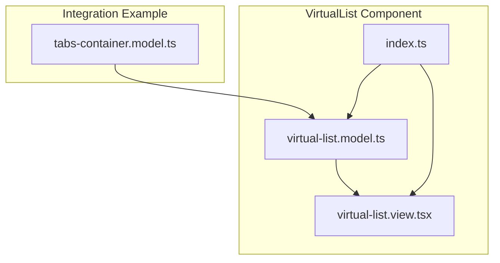
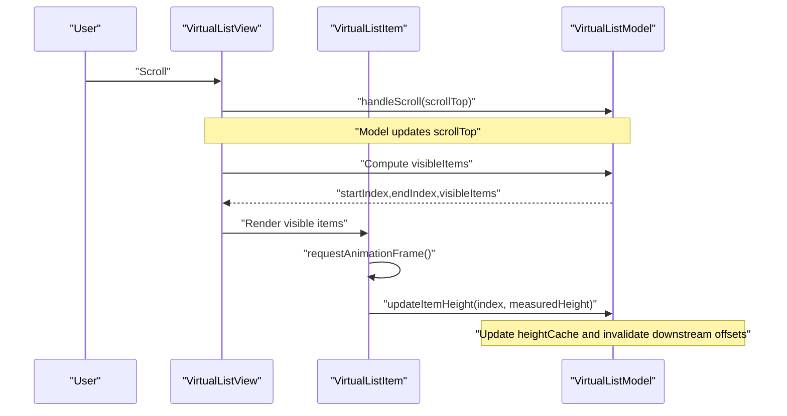
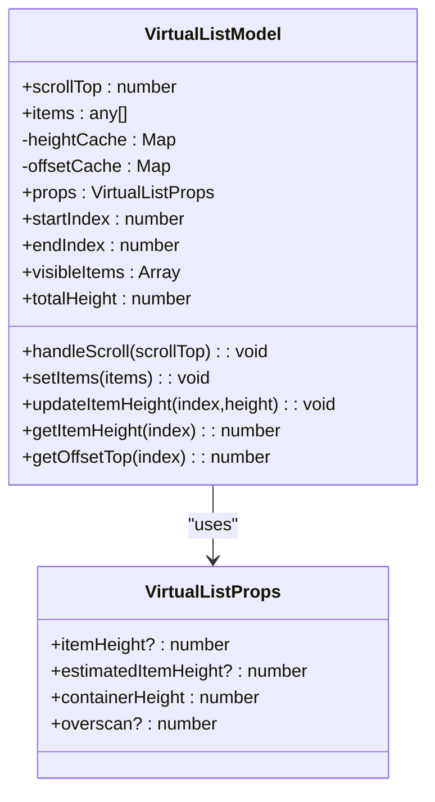
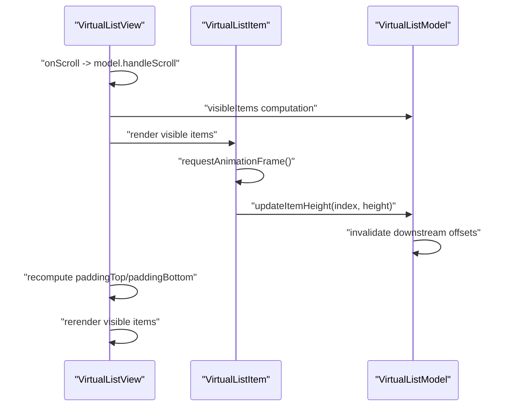
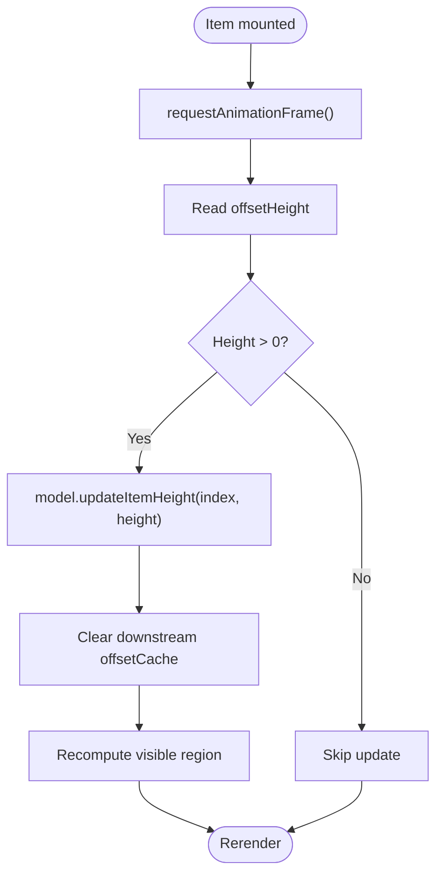
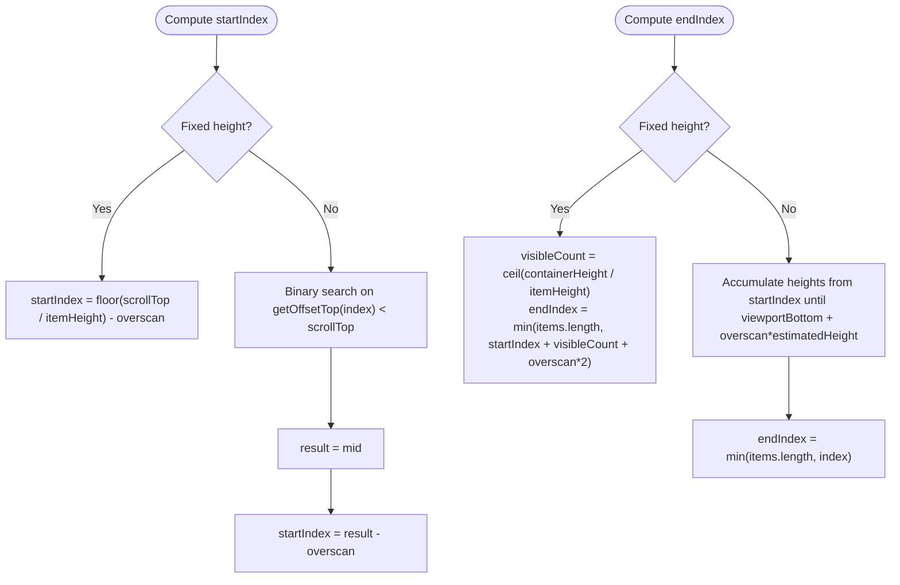
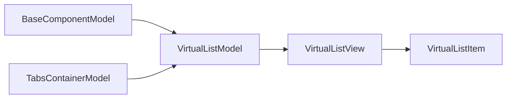

# VirtualList

<cite>
**Referenced Files in This Document**
- [virtual-list.model.ts](file://packages/h5-builder/src/components/virtual-list/virtual-list.model.ts)
- [virtual-list.view.tsx](file://packages/h5-builder/src/components/virtual-list/virtual-list.view.tsx)
- [index.ts](file://packages/h5-builder/src/components/virtual-list/index.ts)
- [tabs-container.model.ts](file://packages/h5-builder/src/components/tabs-container/tabs-container.model.ts)
- [auto-virtual-scroll.md](file://packages/h5-builder/docs/auto-virtual-scroll.md)
- [api_reference.md](file://packages/h5-builder/docs/api_reference.md)
</cite>

## Table of Contents
1. [Introduction](#introduction)
2. [Project Structure](#project-structure)
3. [Core Components](#core-components)
4. [Architecture Overview](#architecture-overview)
5. [Detailed Component Analysis](#detailed-component-analysis)
6. [Dependency Analysis](#dependency-analysis)
7. [Performance Considerations](#performance-considerations)
8. [Troubleshooting Guide](#troubleshooting-guide)
9. [Conclusion](#conclusion)
10. [Appendices](#appendices)

## Introduction
This document explains the VirtualList component, a performance-optimized list rendering solution that supports both fixed-height and dynamic-height modes. It covers the architecture of VirtualListModel and VirtualListView, the height caching mechanism, scroll position tracking, and visible item calculation. It also documents the props interface, the dynamic height measurement system using requestAnimationFrame and ResizeObserver, and the rendering mechanics involving paddingTop/paddingBottom and absolute positioning. Usage examples and best practices are included, along with performance tips and troubleshooting guidance.

## Project Structure
VirtualList is implemented as a pair of files under the virtual-list component folder, plus an index export for convenience. The model and view are separated to follow the model-view separation principle.

**Diagram sources**
- [virtual-list.model.ts](file://packages/h5-builder/src/components/virtual-list/virtual-list.model.ts#L1-L217)
- [virtual-list.view.tsx](file://packages/h5-builder/src/components/virtual-list/virtual-list.view.tsx#L1-L129)
- [index.ts](file://packages/h5-builder/src/components/virtual-list/index.ts#L1-L3)
- [tabs-container.model.ts](file://packages/h5-builder/src/components/tabs-container/tabs-container.model.ts#L1-L273)

**Section sources**
- [virtual-list.model.ts](file://packages/h5-builder/src/components/virtual-list/virtual-list.model.ts#L1-L217)
- [virtual-list.view.tsx](file://packages/h5-builder/src/components/virtual-list/virtual-list.view.tsx#L1-L129)
- [index.ts](file://packages/h5-builder/src/components/virtual-list/index.ts#L1-L3)

## Core Components
- VirtualListModel: Manages props, items, scroll position, height cache, offset cache, and computes visible items and total height. Supports fixed-height and dynamic-height modes.
- VirtualListView: Renders the container, calculates paddingTop/paddingBottom, and renders only visible items. It measures item heights dynamically and reports them back to the model.

Key responsibilities:
- VirtualListModel
  - Props: itemHeight, estimatedItemHeight, containerHeight, overscan
  - Scroll tracking: scrollTop
  - Height caching: Map from index to height
  - Offset caching: Map from index to cumulative offset
  - Visible region computation: startIndex, endIndex, visibleItems
  - Total height computation
- VirtualListView
  - Container scroll handler
  - Padding buffer calculation (paddingTop/paddingBottom)
  - Dynamic measurement via requestAnimationFrame and ResizeObserver
  - Rendering visible items

**Section sources**
- [virtual-list.model.ts](file://packages/h5-builder/src/components/virtual-list/virtual-list.model.ts#L6-L11)
- [virtual-list.model.ts](file://packages/h5-builder/src/components/virtual-list/virtual-list.model.ts#L21-L36)
- [virtual-list.model.ts](file://packages/h5-builder/src/components/virtual-list/virtual-list.model.ts#L27-L31)
- [virtual-list.model.ts](file://packages/h5-builder/src/components/virtual-list/virtual-list.model.ts#L115-L178)
- [virtual-list.model.ts](file://packages/h5-builder/src/components/virtual-list/virtual-list.model.ts#L180-L216)
- [virtual-list.view.tsx](file://packages/h5-builder/src/components/virtual-list/virtual-list.view.tsx#L8-L12)
- [virtual-list.view.tsx](file://packages/h5-builder/src/components/virtual-list/virtual-list.view.tsx#L17-L24)
- [virtual-list.view.tsx](file://packages/h5-builder/src/components/virtual-list/virtual-list.view.tsx#L26-L69)
- [virtual-list.view.tsx](file://packages/h5-builder/src/components/virtual-list/virtual-list.view.tsx#L78-L129)

## Architecture Overview
VirtualList follows a model-view separation pattern:
- Model holds state and performs calculations.
- View observes model changes and renders only visible items.
- Dynamic height measurement is performed inside the item view and reported to the model.

**Diagram sources**
- [virtual-list.view.tsx](file://packages/h5-builder/src/components/virtual-list/virtual-list.view.tsx#L83-L104)
- [virtual-list.view.tsx](file://packages/h5-builder/src/components/virtual-list/virtual-list.view.tsx#L30-L59)
- [virtual-list.model.ts](file://packages/h5-builder/src/components/virtual-list/virtual-list.model.ts#L54-L66)
- [virtual-list.model.ts](file://packages/h5-builder/src/components/virtual-list/virtual-list.model.ts#L68-L83)

## Detailed Component Analysis

### VirtualListModel
VirtualListModel encapsulates the core virtualization logic:
- Fixed-height mode: Uses itemHeight prop for all computations.
- Dynamic-height mode: Uses estimatedItemHeight as fallback and caches measured heights.
- Height cache: index -> height
- Offset cache: index -> cumulative offsetTop
- Visible region: Binary search for fixed-height; linear accumulation for dynamic-height
- Total height: Sum of heights or itemCount * itemHeight

**Diagram sources**
- [virtual-list.model.ts](file://packages/h5-builder/src/components/virtual-list/virtual-list.model.ts#L6-L11)
- [virtual-list.model.ts](file://packages/h5-builder/src/components/virtual-list/virtual-list.model.ts#L20-L216)

**Section sources**
- [virtual-list.model.ts](file://packages/h5-builder/src/components/virtual-list/virtual-list.model.ts#L6-L11)
- [virtual-list.model.ts](file://packages/h5-builder/src/components/virtual-list/virtual-list.model.ts#L21-L36)
- [virtual-list.model.ts](file://packages/h5-builder/src/components/virtual-list/virtual-list.model.ts#L38-L41)
- [virtual-list.model.ts](file://packages/h5-builder/src/components/virtual-list/virtual-list.model.ts#L54-L66)
- [virtual-list.model.ts](file://packages/h5-builder/src/components/virtual-list/virtual-list.model.ts#L68-L83)
- [virtual-list.model.ts](file://packages/h5-builder/src/components/virtual-list/virtual-list.model.ts#L85-L93)
- [virtual-list.model.ts](file://packages/h5-builder/src/components/virtual-list/virtual-list.model.ts#L95-L113)
- [virtual-list.model.ts](file://packages/h5-builder/src/components/virtual-list/virtual-list.model.ts#L115-L178)
- [virtual-list.model.ts](file://packages/h5-builder/src/components/virtual-list/virtual-list.model.ts#L180-L216)

### VirtualListView and VirtualListItem
VirtualListView:
- Handles scroll events and forwards scrollTop to the model.
- Computes paddingTop and paddingBottom based on visible region and total height.
- Renders only visible items.

VirtualListItem:
- Measures its own height using requestAnimationFrame after render.
- Observes future size changes with ResizeObserver.
- Reports measured height to the model via updateItemHeight.

**Diagram sources**
- [virtual-list.view.tsx](file://packages/h5-builder/src/components/virtual-list/virtual-list.view.tsx#L83-L104)
- [virtual-list.view.tsx](file://packages/h5-builder/src/components/virtual-list/virtual-list.view.tsx#L89-L93)
- [virtual-list.view.tsx](file://packages/h5-builder/src/components/virtual-list/virtual-list.view.tsx#L109-L123)
- [virtual-list.view.tsx](file://packages/h5-builder/src/components/virtual-list/virtual-list.view.tsx#L30-L59)
- [virtual-list.model.ts](file://packages/h5-builder/src/components/virtual-list/virtual-list.model.ts#L68-L83)

**Section sources**
- [virtual-list.view.tsx](file://packages/h5-builder/src/components/virtual-list/virtual-list.view.tsx#L8-L12)
- [virtual-list.view.tsx](file://packages/h5-builder/src/components/virtual-list/virtual-list.view.tsx#L17-L24)
- [virtual-list.view.tsx](file://packages/h5-builder/src/components/virtual-list/virtual-list.view.tsx#L26-L69)
- [virtual-list.view.tsx](file://packages/h5-builder/src/components/virtual-list/virtual-list.view.tsx#L78-L129)

### Dynamic Height Measurement Flow
Dynamic height measurement uses two mechanisms:
- requestAnimationFrame ensures measurement happens after layout.
- ResizeObserver detects subsequent size changes.

**Diagram sources**
- [virtual-list.view.tsx](file://packages/h5-builder/src/components/virtual-list/virtual-list.view.tsx#L30-L59)
- [virtual-list.model.ts](file://packages/h5-builder/src/components/virtual-list/virtual-list.model.ts#L68-L83)

**Section sources**
- [virtual-list.view.tsx](file://packages/h5-builder/src/components/virtual-list/virtual-list.view.tsx#L30-L59)
- [virtual-list.model.ts](file://packages/h5-builder/src/components/virtual-list/virtual-list.model.ts#L68-L83)

### Visible Item Calculation
- Fixed-height mode: startIndex/endIndex computed via division and overscan.
- Dynamic-height mode: startIndex via binary search on cumulative offsets; endIndex via linear accumulation until viewport bottom.

**Diagram sources**
- [virtual-list.model.ts](file://packages/h5-builder/src/components/virtual-list/virtual-list.model.ts#L115-L178)

**Section sources**
- [virtual-list.model.ts](file://packages/h5-builder/src/components/virtual-list/virtual-list.model.ts#L115-L178)

## Dependency Analysis
VirtualList depends on:
- BaseComponentModel for lifecycle and reactive state.
- mobx-vue-lite observer for reactivity.
- Browser APIs: requestAnimationFrame, ResizeObserver, DOM measurements.

Integration example:
- TabsContainer creates VirtualListModel instances for tabs exceeding a threshold and passes them to VirtualListView.

**Diagram sources**
- [virtual-list.model.ts](file://packages/h5-builder/src/components/virtual-list/virtual-list.model.ts#L1-L20)
- [virtual-list.view.tsx](file://packages/h5-builder/src/components/virtual-list/virtual-list.view.tsx#L1-L6)
- [tabs-container.model.ts](file://packages/h5-builder/src/components/tabs-container/tabs-container.model.ts#L1-L273)

**Section sources**
- [virtual-list.model.ts](file://packages/h5-builder/src/components/virtual-list/virtual-list.model.ts#L1-L20)
- [virtual-list.view.tsx](file://packages/h5-builder/src/components/virtual-list/virtual-list.view.tsx#L1-L6)
- [tabs-container.model.ts](file://packages/h5-builder/src/components/tabs-container/tabs-container.model.ts#L1-L273)

## Performance Considerations
- Overscan: Increase overscan to reduce white flash during fast scrolls. Tune based on containerHeight and estimatedItemHeight.
- Fixed vs dynamic height:
  - Fixed height: Faster calculations; use when item heights are uniform.
  - Dynamic height: More accurate; use when items vary (e.g., images, variable text).
- Height cache invalidation: When an item’s height changes, downstream offsets are invalidated to keep cumulative positions correct.
- Measurement timing: requestAnimationFrame ensures accurate measurements after layout; ResizeObserver handles subsequent changes.
- Rendering: Only visible items are rendered; paddingTop/paddingBottom simulate full height.

[No sources needed since this section provides general guidance]

## Troubleshooting Guide
Common issues and resolutions:
- Incorrect scrolling behavior
  - Ensure containerHeight matches the actual scrollable height.
  - Verify scrollTop is passed from the container’s onScroll to the model.
  - Check that startIndex/endIndex are recalculated after data changes.
  - Section sources
    - [virtual-list.view.tsx](file://packages/h5-builder/src/components/virtual-list/virtual-list.view.tsx#L83-L104)
    - [virtual-list.model.ts](file://packages/h5-builder/src/components/virtual-list/virtual-list.model.ts#L115-L178)

- Height miscalculations
  - Dynamic height relies on accurate measurements; ensure items are fully rendered before measuring.
  - requestAnimationFrame is used to measure after layout; if content is still changing, rely on ResizeObserver to update.
  - Section sources
    - [virtual-list.view.tsx](file://packages/h5-builder/src/components/virtual-list/virtual-list.view.tsx#L30-L59)
    - [virtual-list.model.ts](file://packages/h5-builder/src/components/virtual-list/virtual-list.model.ts#L68-L83)

- White flash during scroll
  - Increase overscan to render more items outside the viewport.
  - Section sources
    - [virtual-list.model.ts](file://packages/h5-builder/src/components/virtual-list/virtual-list.model.ts#L122-L128)
    - [virtual-list.model.ts](file://packages/h5-builder/src/components/virtual-list/virtual-list.model.ts#L156-L177)

- Variable content causing layout shifts
  - Use estimatedItemHeight to stabilize initial layout; allow dynamic measurement to refine later.
  - Section sources
    - [virtual-list.model.ts](file://packages/h5-builder/src/components/virtual-list/virtual-list.model.ts#L38-L41)
    - [virtual-list.view.tsx](file://packages/h5-builder/src/components/virtual-list/virtual-list.view.tsx#L30-L59)

- Integration with model-view system
  - Ensure model is passed to VirtualListView and items are set via model.setItems.
  - Section sources
    - [virtual-list.view.tsx](file://packages/h5-builder/src/components/virtual-list/virtual-list.view.tsx#L109-L123)
    - [tabs-container.model.ts](file://packages/h5-builder/src/components/tabs-container/tabs-container.model.ts#L133-L145)

## Conclusion
VirtualList delivers efficient list rendering by computing a small, visible subset of items and buffering the rest with padding. Its dual-mode support for fixed and dynamic heights allows flexibility across content types. Proper configuration of containerHeight, itemHeight/estimatedItemHeight, and overscan yields smooth scrolling and optimal performance. The dynamic measurement system ensures accurate layouts even with variable content.

[No sources needed since this section summarizes without analyzing specific files]

## Appendices

### Props Reference
- itemHeight: number (fixed-height mode)
- estimatedItemHeight: number (dynamic-height mode)
- containerHeight: number (viewport height)
- overscan: number (extra items rendered above/below viewport)

**Section sources**
- [virtual-list.model.ts](file://packages/h5-builder/src/components/virtual-list/virtual-list.model.ts#L6-L11)
- [api_reference.md](file://packages/h5-builder/docs/api_reference.md#L650-L677)

### Usage Examples
- Programmatic usage with VirtualListView
  - Pass a VirtualListModel instance and a renderItem function to VirtualListView.
  - Section sources
    - [api_reference.md](file://packages/h5-builder/docs/api_reference.md#L668-L677)

- Automatic virtual scroll in TabsContainer
  - TabsContainer automatically enables VirtualList for tabs exceeding a threshold.
  - Section sources
    - [tabs-container.model.ts](file://packages/h5-builder/src/components/tabs-container/tabs-container.model.ts#L101-L128)
    - [auto-virtual-scroll.md](file://packages/h5-builder/docs/auto-virtual-scroll.md#L1-L216)

### Integration Notes
- Export entry
  - index.ts re-exports model and view for convenient imports.
  - Section sources
    - [index.ts](file://packages/h5-builder/src/components/virtual-list/index.ts#L1-L3)