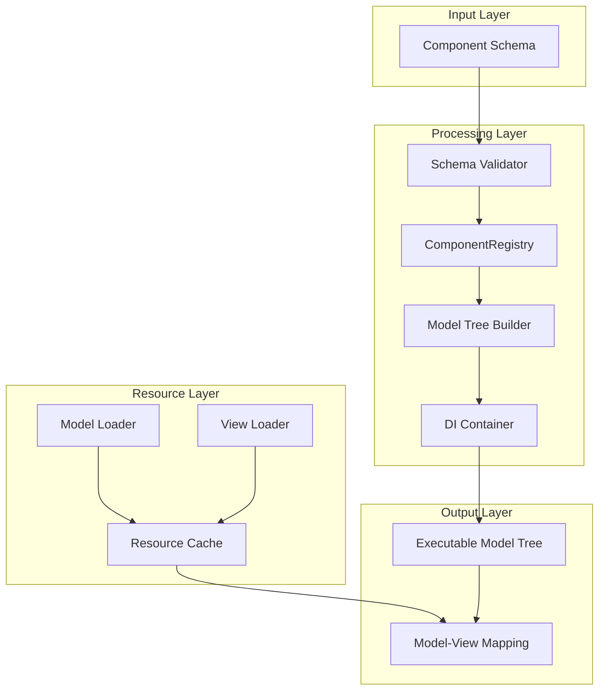
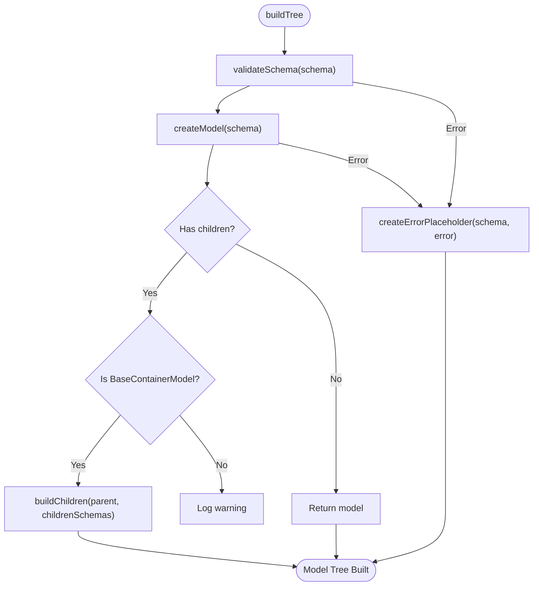
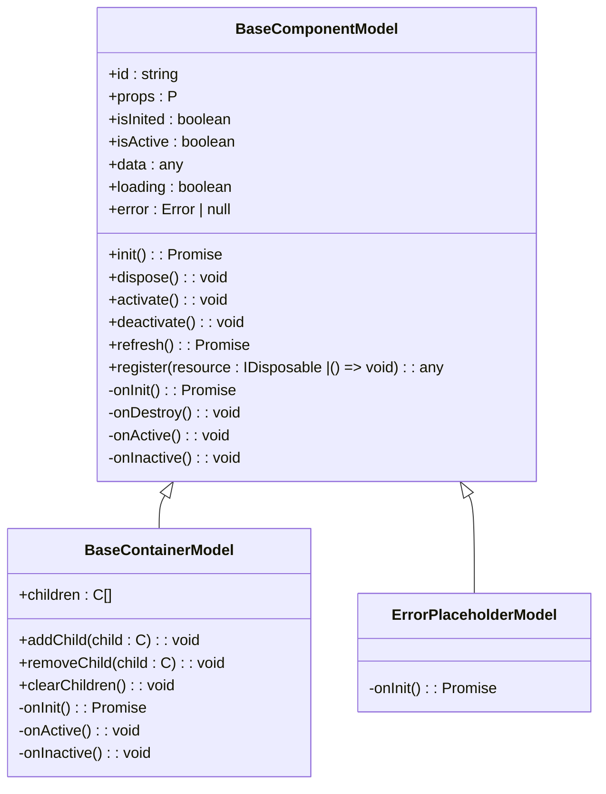
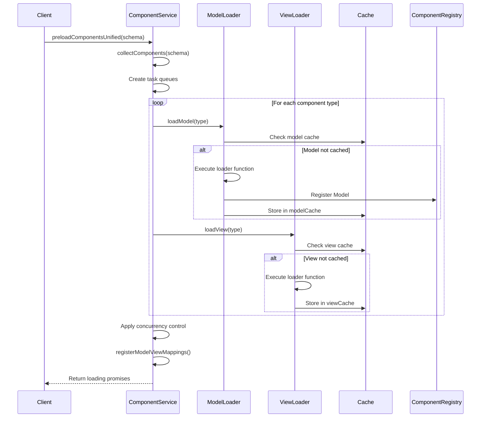
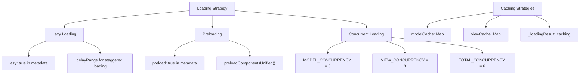
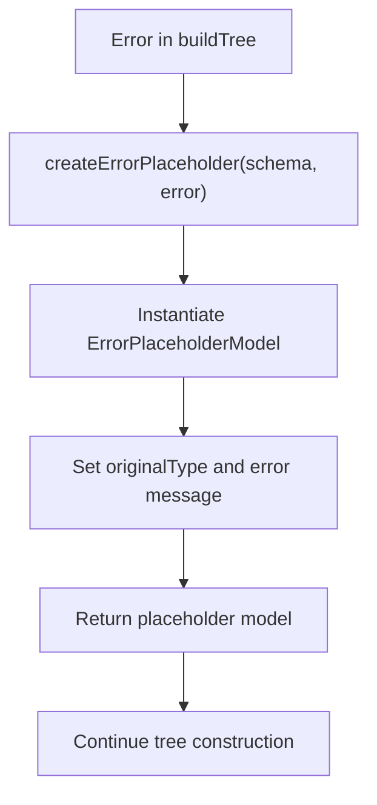

# Component Loader

<cite>
**Referenced Files in This Document**   
- [component.service.ts](file://packages/h5-builder/src/services/component.service.ts)
- [model.ts](file://packages/h5-builder/src/bedrock/model.ts)
- [placeholder/index.ts](file://packages/h5-builder/src/placeholder/index.ts)
- [tracker.service.ts](file://packages/h5-builder/src/services/tracker.service.ts)
</cite>

## Table of Contents
1. [Introduction](#introduction)
2. [Core Components](#core-components)
3. [Architecture Overview](#architecture-overview)
4. [Detailed Component Analysis](#detailed-component-analysis)
5. [Dependency Analysis](#dependency-analysis)
6. [Performance Considerations](#performance-considerations)
7. [Troubleshooting Guide](#troubleshooting-guide)
8. [Conclusion](#conclusion)

## Introduction
The ComponentService (also known as ComponentLoader) is a core service responsible for transforming component schemas into executable model trees within the H5 Builder framework. This documentation provides a comprehensive analysis of its functionality, covering the full lifecycle from schema validation to model instantiation using the Dependency Injection (DI) container. The service enables dynamic UI construction by mapping declarative schema definitions to executable component models while providing robust error handling, asynchronous loading capabilities, and integration with tracking services.

**Section sources**
- [component.service.ts](file://packages/h5-builder/src/services/component.service.ts#L96-L734)

## Core Components
The ComponentService relies on several key components to achieve its functionality:
- **ComponentRegistry**: Maintains a mapping between component types and their corresponding Model classes
- **BaseComponentModel**: Base class for all component models, providing lifecycle management and state tracking
- **BaseContainerModel**: Specialized model for container components that can hold child models
- **ErrorPlaceholderModel**: Fallback model used when component creation fails
- **IInstantiationService**: DI container responsible for model instantiation with dependency injection
- **TrackerService**: Service for tracking component creation and loading events

These components work together to enable the transformation of schema definitions into fully functional model trees.

**Section sources**
- [component.service.ts](file://packages/h5-builder/src/services/component.service.ts#L52-L94)
- [model.ts](file://packages/h5-builder/src/bedrock/model.ts#L10-L242)
- [placeholder/index.ts](file://packages/h5-builder/src/placeholder/index.ts#L6-L11)

## Architecture Overview
The ComponentService follows a layered architecture that separates concerns between schema processing, model instantiation, and resource loading. The system is designed to handle both synchronous and asynchronous component loading while maintaining a clear separation between model and view responsibilities.



**Diagram sources**
- [component.service.ts](file://packages/h5-builder/src/services/component.service.ts#L100-L734)
- [model.ts](file://packages/h5-builder/src/bedrock/model.ts#L10-L242)

## Detailed Component Analysis

### Component Registry and Registration
The ComponentRegistry maintains a central mapping between component types and their corresponding Model classes. The ComponentService provides both synchronous and asynchronous registration methods to support different loading scenarios.

```mermaid
classDiagram
class ComponentRegistry {
+register(type : string, ModelClass : any) : void
+registerAll(components : Record<string, any>) : void
+get(type : string) : any | undefined
+has(type : string) : boolean
+getRegisteredTypes() : string[]
}
class ComponentService {
+register(type : string, ModelClass : any) : void
+registerAll(components : Record<string, any>) : void
+registerAsync(componentName : string, config : {model? : () => Promise<any>, view? : () => Promise<any>}, metadata? : ComponentMetadata) : void
+registerAsyncBatch(components : Record<string, {loader : {model? : () => Promise<any>, view? : () => Promise<any>}, metadata? : ComponentMetadata}>) : void
}
ComponentService --> ComponentRegistry : "uses"
```

**Diagram sources**
- [component.service.ts](file://packages/h5-builder/src/services/component.service.ts#L52-L94)

**Section sources**
- [component.service.ts](file://packages/h5-builder/src/services/component.service.ts#L119-L128)
- [component.service.ts](file://packages/h5-builder/src/services/component.service.ts#L286-L338)

### Model Tree Construction Process
The buildTree method orchestrates the transformation of a component schema into an executable model tree through a recursive process that includes schema validation, model instantiation, and child model integration.



**Diagram sources**
- [component.service.ts](file://packages/h5-builder/src/services/component.service.ts#L135-L208)

**Section sources**
- [component.service.ts](file://packages/h5-builder/src/services/component.service.ts#L135-L208)

### Base Component Model Hierarchy
The model system is built on a hierarchical class structure that provides consistent lifecycle management and state tracking across all components.



**Diagram sources**
- [model.ts](file://packages/h5-builder/src/bedrock/model.ts#L10-L242)
- [placeholder/index.ts](file://packages/h5-builder/src/placeholder/index.ts#L6-L11)

**Section sources**
- [model.ts](file://packages/h5-builder/src/bedrock/model.ts#L10-L242)

### Asynchronous Loading and Caching
The ComponentService provides sophisticated asynchronous loading capabilities with concurrency control and caching strategies to optimize performance and resource utilization.



**Diagram sources**
- [component.service.ts](file://packages/h5-builder/src/services/component.service.ts#L260-L696)

**Section sources**
- [component.service.ts](file://packages/h5-builder/src/services/component.service.ts#L260-L696)

## Dependency Analysis
The ComponentService has well-defined dependencies that enable its core functionality while maintaining separation of concerns.

```mermaid
graph TD
ComponentService --> IInstantiationService : "DI container for model instantiation"
ComponentService --> ITrackerService : "Event tracking and monitoring"
ComponentService --> ComponentRegistry : "Component type mapping"
ComponentService --> BaseComponentModel : "Base model functionality"
ComponentService --> ErrorPlaceholderModel : "Error recovery"
IInstantiationService --> ServiceCollection : "Service registry"
ITrackerService --> BridgeService : "Native bridge communication"
ComponentService --> Promise : "Asynchronous operations"
ComponentService --> Map : "Caching mechanisms"
```

**Diagram sources**
- [component.service.ts](file://packages/h5-builder/src/services/component.service.ts#L1-L734)
- [service-identifiers.ts](file://packages/h5-builder/src/services/service-identifiers.ts#L1-L20)

**Section sources**
- [component.service.ts](file://packages/h5-builder/src/services/component.service.ts#L1-L734)
- [service-identifiers.ts](file://packages/h5-builder/src/services/service-identifiers.ts#L1-L20)

## Performance Considerations
The ComponentService implements several optimization strategies to handle performance challenges in large-scale applications.

### Schema Validation Overhead
Schema validation is performed synchronously during model tree construction, which can impact performance with complex schemas. The validation process includes:
- Type field presence check
- ID field presence check
- Registry membership verification

### Memory Usage in Large Trees
Large model trees can consume significant memory due to:
- Model instance storage
- Child model references in containers
- Event listener registrations
- Disposable resource tracking

### Optimization Techniques
The service implements several optimization techniques:



**Diagram sources**
- [component.service.ts](file://packages/h5-builder/src/services/component.service.ts#L279-L696)

**Section sources**
- [component.service.ts](file://packages/h5-builder/src/services/component.service.ts#L279-L696)

## Troubleshooting Guide
The ComponentService includes comprehensive error handling and recovery mechanisms to ensure application stability.

### Error Recovery with ErrorPlaceholderModel
When component creation fails, the service creates an ErrorPlaceholderModel instance to maintain tree integrity:



**Diagram sources**
- [component.service.ts](file://packages/h5-builder/src/services/component.service.ts#L231-L243)
- [placeholder/index.ts](file://packages/h5-builder/src/placeholder/index.ts#L6-L11)

**Section sources**
- [component.service.ts](file://packages/h5-builder/src/services/component.service.ts#L231-L243)
- [component-loader.test.ts](file://packages/h5-builder/src/__tests__/component-loader.test.ts#L166-L202)

### Common Issues and Solutions
| Issue | Cause | Solution |
|-------|-------|----------|
| Unknown component type | Component not registered | Ensure component is registered before building tree |
| Missing ID field | Schema validation failure | Always provide ID in component schema |
| Model loading failure | Network error or module not found | Check loader function and network connectivity |
| View loading failure | View module not found | Verify view loader configuration |
| Memory leaks | Unreleased resources | Ensure proper disposal of models |

**Section sources**
- [component.service.ts](file://packages/h5-builder/src/services/component.service.ts#L214-L226)
- [component.service.ts](file://packages/h5-builder/src/services/component.service.ts#L404-L419)
- [component.service.ts](file://packages/h5-builder/src/services/component.service.ts#L456-L469)

## Conclusion
The ComponentService (ComponentLoader) provides a robust framework for transforming component schemas into executable model trees. Its architecture separates concerns between model loading (with dependency injection) and view loading (with model-view mapping registration), enabling flexible and efficient component management. The service supports both synchronous and asynchronous loading patterns with sophisticated caching and concurrency control mechanisms. Error recovery through the ErrorPlaceholderModel ensures application stability even when individual components fail to load. Integration with the tracking service provides valuable insights into component lifecycle events, while the DI container enables proper dependency management. This comprehensive approach makes the ComponentService a critical component in the H5 Builder framework's dynamic UI construction capabilities.