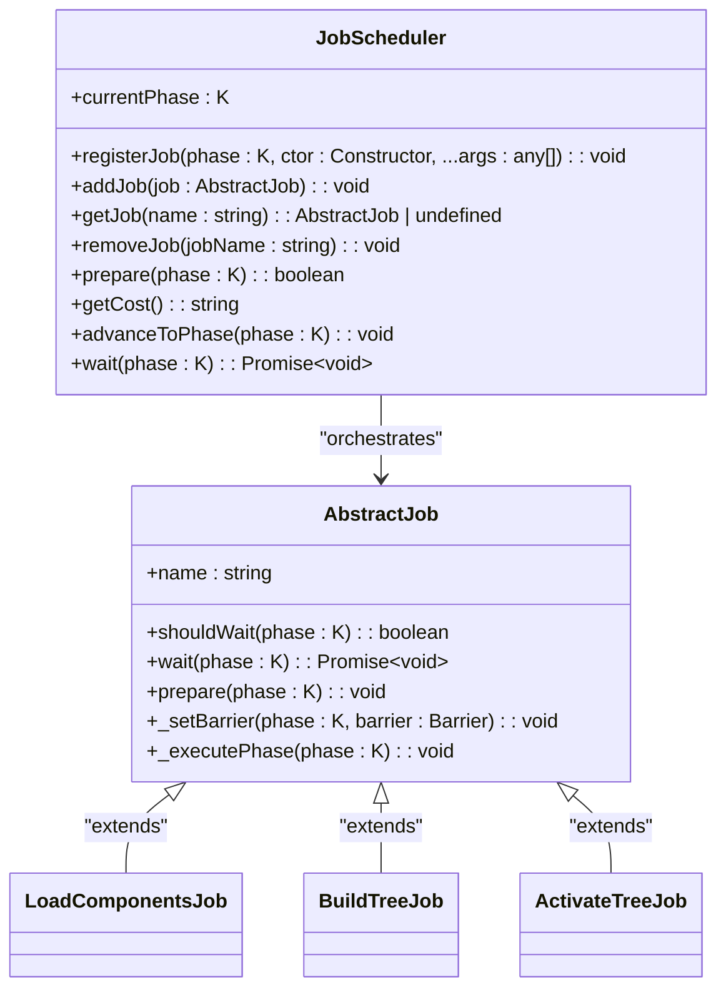
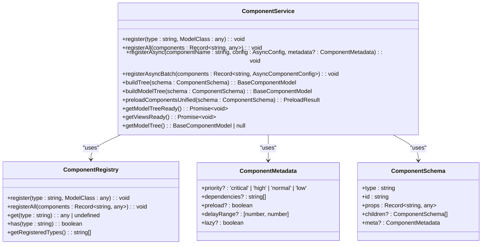
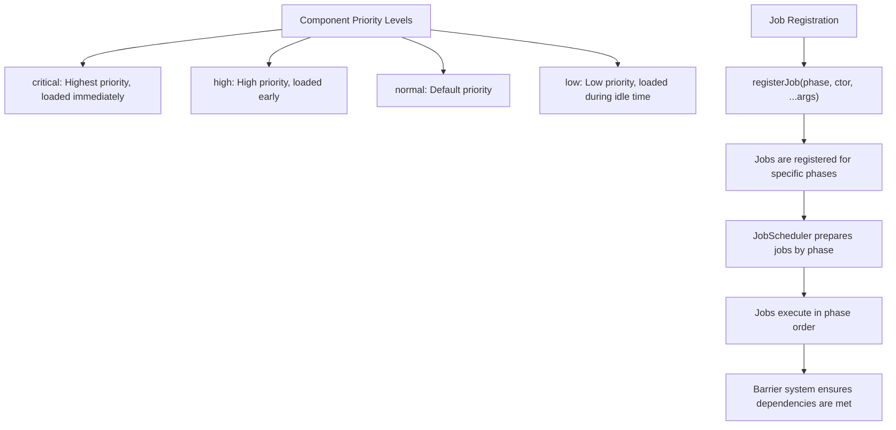
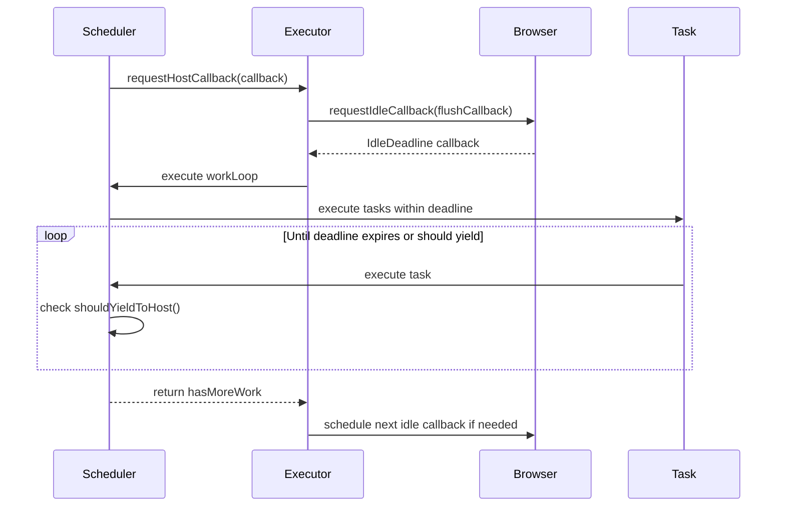
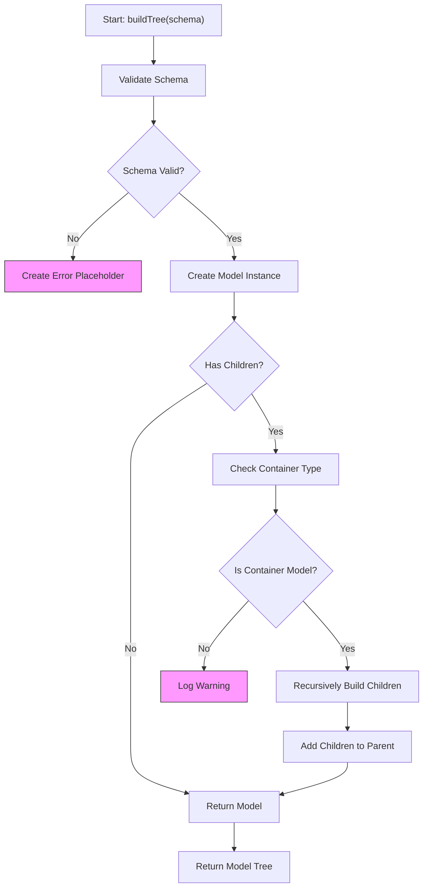
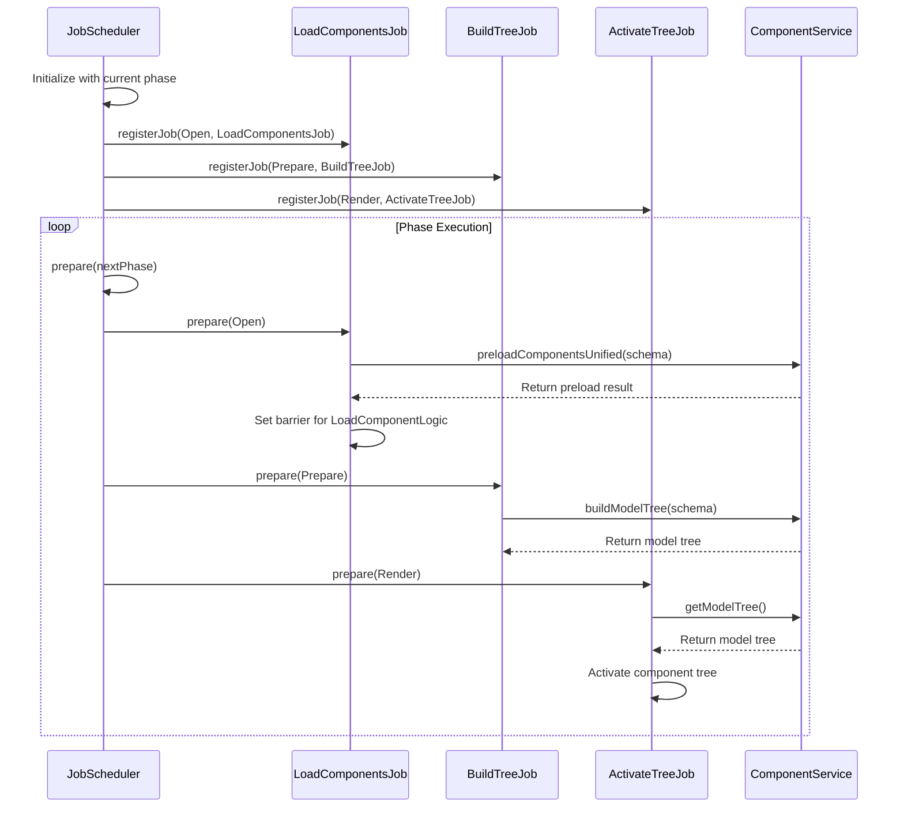
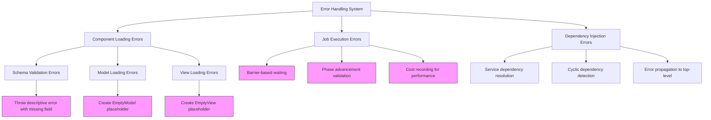
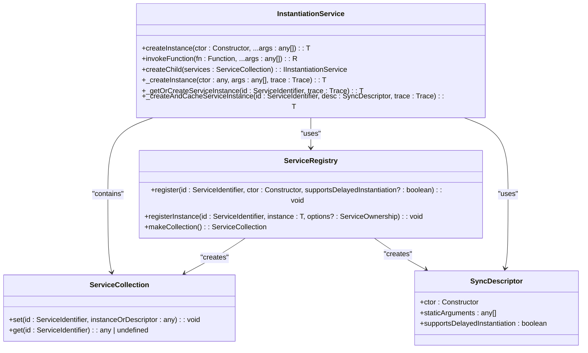

# Flow Layer

<cite>
**Referenced Files in This Document**   
- [job-scheduler.ts](file://packages/h5-builder/src/bedrock/launch/job-scheduler.ts)
- [component.service.ts](file://packages/h5-builder/src/services/component.service.ts)
- [task.ts](file://packages/h5-builder/src/bedrock/scheduler/core/task.ts)
- [task-queue.ts](file://packages/h5-builder/src/bedrock/scheduler/core/task-queue.ts)
- [scheduler.ts](file://packages/h5-builder/src/bedrock/scheduler/core/scheduler.ts)
- [load-components-job.ts](file://packages/h5-builder/src/jobs/load-components-job.ts)
- [build-tree-job.ts](file://packages/h5-builder/src/jobs/build-tree-job.ts)
- [activate-tree-job.ts](file://packages/h5-builder/src/jobs/activate-tree-job.ts)
- [lifecycle.ts](file://packages/h5-builder/src/jobs/lifecycle.ts)
- [instantiation-service.ts](file://packages/h5-builder/src/bedrock/di/instantiation-service.ts)
- [service-registry.ts](file://packages/h5-builder/src/bedrock/di/service-registry.ts)
- [idle-callback-executor.ts](file://packages/h5-builder/src/bedrock/scheduler/executor/idle-callback-executor.ts)
</cite>

## Table of Contents
1. [Introduction](#introduction)
2. [JobScheduler API](#jobscheduler-api)
3. [ComponentLoader API](#componentloader-api)
4. [Task Prioritization System](#task-prioritization-system)
5. [Idle-Time Processing](#idle-time-processing)
6. [Model Tree Construction](#model-tree-construction)
7. [Execution Flow](#execution-flow)
8. [Error Handling](#error-handling)
9. [Dependency Injection Integration](#dependency-injection-integration)
10. [Performance Considerations](#performance-considerations)

## Introduction
The Flow Layer of the H5 Builder Framework provides a sophisticated orchestration system for managing application initialization and component lifecycle. This layer consists of two core components: JobScheduler for task orchestration and ComponentLoader for component instantiation and model tree construction. The system implements a phase-based execution model with support for asynchronous operations, idle-time processing, and dependency injection. This documentation provides comprehensive API details, execution patterns, and integration points for developers working with the framework.

## JobScheduler API

The JobScheduler class provides a phase-based task orchestration system that manages the execution of various jobs throughout the application lifecycle. It coordinates the execution of jobs based on predefined phases and handles dependencies between tasks.

**Diagram sources**
- [job-scheduler.ts](file://packages/h5-builder/src/bedrock/launch/job-scheduler.ts#L16-L123)
- [abstract-job.ts](file://packages/h5-builder/src/bedrock/launch/abstract-job.ts#L3-L46)

**Section sources**
- [job-scheduler.ts](file://packages/h5-builder/src/bedrock/launch/job-scheduler.ts#L16-L123)
- [abstract-job.ts](file://packages/h5-builder/src/bedrock/launch/abstract-job.ts#L3-L46)

## ComponentLoader API

The ComponentLoader system, implemented through the ComponentService class, handles component registration, loading, and model tree construction. It manages both synchronous and asynchronous component loading with support for separation of Model and View resources.

**Diagram sources**
- [component.service.ts](file://packages/h5-builder/src/services/component.service.ts#L100-L734)
- [component.service.ts](file://packages/h5-builder/src/services/component.service.ts#L52-L94)

**Section sources**
- [component.service.ts](file://packages/h5-builder/src/services/component.service.ts#L100-L734)

## Task Prioritization System

The framework implements a sophisticated task prioritization system through component metadata and job scheduling. Components can be assigned different priority levels that influence their loading order and execution timing.

The JobScheduler uses a phase-based approach where tasks are registered for specific lifecycle phases. The system ensures that higher priority tasks are executed first within each phase, and critical components are processed before lower priority ones. The framework also supports delayed loading with configurable delay ranges, allowing components to be loaded with randomized delays within specified time windows.

**Section sources**
- [component.service.ts](file://packages/h5-builder/src/services/component.service.ts#L11-L26)
- [lifecycle.ts](file://packages/h5-builder/src/jobs/lifecycle.ts#L1-L18)

## Idle-Time Processing

The framework implements idle-time processing through the Scheduler and IdleCallbackExecutor classes, which leverage the browser's requestIdleCallback API to execute non-critical tasks during idle periods.

The idle-time processing system works by:
1. Using requestIdleCallback to schedule work during browser idle periods
2. Monitoring execution time against the provided deadline
3. Yielding control back to the browser when the deadline is exceeded or input is pending
4. Resuming work in the next idle period if additional tasks remain

The system includes a fallback mechanism for browsers that don't support requestIdleCallback, using setTimeout with a 15ms timeout (approximately one frame at 64fps) to simulate idle callback behavior.

**Diagram sources**
- [scheduler.ts](file://packages/h5-builder/src/bedrock/scheduler/core/scheduler.ts#L24-L174)
- [idle-callback-executor.ts](file://packages/h5-builder/src/bedrock/scheduler/executor/idle-callback-executor.ts#L12-L99)

**Section sources**
- [scheduler.ts](file://packages/h5-builder/src/bedrock/scheduler/core/scheduler.ts#L24-L174)
- [idle-callback-executor.ts](file://packages/h5-builder/src/bedrock/scheduler/executor/idle-callback-executor.ts#L12-L99)

## Model Tree Construction

The model tree construction process transforms a component schema definition into a hierarchical model tree that represents the application structure. This process involves schema validation, component instantiation, and tree assembly.

The construction process follows these steps:
1. Validate the component schema for required fields (type, id) and registered component types
2. Create a model instance using the dependency injection system
3. If the component has children and is a container model, recursively build child models
4. Add child models to the parent container
5. Return the constructed model tree

The system handles errors gracefully by creating error placeholder components when schema validation fails or component instantiation encounters issues, ensuring that the application can continue rendering even with partial failures.

**Section sources**
- [component.service.ts](file://packages/h5-builder/src/services/component.service.ts#L135-L158)
- [component.service.ts](file://packages/h5-builder/src/services/component.service.ts#L164-L185)

## Execution Flow

The execution flow of the Flow Layer follows a well-defined sequence of phases, with specific jobs registered for each phase. The system orchestrates the execution of these jobs in a coordinated manner.

The execution flow follows the PageLifecycle enum, progressing through phases in sequence:
1. Open: Register components and initiate loading
2. LoadComponentLogic: Load component Model and View resources
3. Prepare: Build the model tree from schema
4. RenderReady: All resources are ready for rendering
5. Render: Begin rendering process
6. Completed: Fill view with data
7. Idle: Process background tasks during idle time

Each job is responsible for specific tasks within its designated phase, and the JobScheduler ensures proper sequencing and dependency management between phases.

**Diagram sources**
- [job-scheduler.ts](file://packages/h5-builder/src/bedrock/launch/job-scheduler.ts#L65-L82)
- [lifecycle.ts](file://packages/h5-builder/src/jobs/lifecycle.ts#L1-L18)
- [load-components-job.ts](file://packages/h5-builder/src/jobs/load-components-job.ts#L11-L61)
- [build-tree-job.ts](file://packages/h5-builder/src/jobs/build-tree-job.ts#L12-L59)
- [activate-tree-job.ts](file://packages/h5-builder/src/jobs/activate-tree-job.ts#L15-L56)

**Section sources**
- [job-scheduler.ts](file://packages/h5-builder/src/bedrock/launch/job-scheduler.ts#L65-L82)
- [lifecycle.ts](file://packages/h5-builder/src/jobs/lifecycle.ts#L1-L18)

## Error Handling

The Flow Layer implements comprehensive error handling strategies for both task scheduling and component loading operations. The system is designed to be resilient and provide meaningful feedback when issues occur.

For component loading, the system handles errors by:
- Validating schemas and throwing descriptive errors for missing required fields
- Creating EmptyModel placeholders when model loading fails, allowing the application to continue
- Creating EmptyView placeholders when view loading fails, preventing rendering blocks
- Reporting errors through the tracking service for monitoring and debugging

For job execution, the system implements:
- Barrier-based waiting to ensure dependencies are met before phase advancement
- Validation to prevent advancing to phases with pending jobs
- Cost recording to monitor performance and identify bottlenecks
- Comprehensive error propagation through the dependency injection system

**Section sources**
- [component.service.ts](file://packages/h5-builder/src/services/component.service.ts#L156-L158)
- [component.service.ts](file://packages/h5-builder/src/services/component.service.ts#L404-L419)
- [component.service.ts](file://packages/h5-builder/src/services/component.service.ts#L456-L469)
- [job-scheduler.ts](file://packages/h5-builder/src/bedrock/launch/job-scheduler.ts#L93-L98)

## Dependency Injection Integration

The Flow Layer integrates tightly with the framework's dependency injection system, leveraging the InstantiationService to create and manage component instances with their dependencies.

The integration works as follows:
1. Components are registered with the ServiceRegistry using their service identifiers and constructors
2. The InstantiationService resolves dependencies by analyzing constructor parameters with @decorated service identifiers
3. When creating instances, the service first resolves all dependencies before instantiating the component
4. The system supports both eager and delayed instantiation through the supportsDelayedInstantiation flag
5. For delayed instantiation, the system uses IdleValue wrappers and proxies to instantiate services only when first accessed

The dependency injection system also includes features for:
- Cyclic dependency detection using graph analysis
- Service ownership management for proper disposal
- Error handling and propagation for missing dependencies
- Tracing and performance monitoring for instantiation operations

**Diagram sources**
- [instantiation-service.ts](file://packages/h5-builder/src/bedrock/di/instantiation-service.ts#L61-L468)
- [service-registry.ts](file://packages/h5-builder/src/bedrock/di/service-registry.ts#L16-L100)

**Section sources**
- [instantiation-service.ts](file://packages/h5-builder/src/bedrock/di/instantiation-service.ts#L61-L468)
- [service-registry.ts](file://packages/h5-builder/src/bedrock/di/service-registry.ts#L16-L100)

## Performance Considerations

The Flow Layer incorporates several performance optimizations to ensure smooth application startup and runtime behavior. These optimizations address task scheduling, resource loading, and execution efficiency.

```mermaid
flowchart TD
A["Performance Optimizations"] --> B["Concurrent Loading"]
A --> C["Idle-Time Scheduling"]
A --> D["Task Prioritization"]
A --> E["Resource Caching"]
A --> F["Efficient Data Structures"]
B --> G["MODEL_CONCURRENCY = 5"]
B --> H["VIEW_CONCURRENCY = 3"]
B --> I["TOTAL_CONCURRENCY = 6"]
B --> J["processQueue with Promise.race"]
C --> K["requestIdleCallback usage"]
C --> L["shouldYieldToHost logic"]
C --> M["isInputPending detection"]
D --> N["Priority-based loading order"]
D --> O["Phase-based execution"]
D --> P["Barrier synchronization"]
E --> Q["Model cache (modelCache)"]
E --> R["View cache (viewCache)"]
E --> S["Loading result cache (_loadingResult)"]
F --> T["MinHeap for task sorting"]
F --> U["Map for O(1) lookups"]
F --> V["Set for deduplication"]
```

Key performance features include:
- **Concurrent Loading**: The system uses configurable concurrency limits for model and view loading, with a processQueue method that uses Promise.race to maintain the specified concurrency level
- **Idle-Time Scheduling**: Non-critical tasks are scheduled during browser idle periods using requestIdleCallback, with a fallback mechanism for older browsers
- **Task Prioritization**: Components can be assigned priority levels that influence their loading order, ensuring critical components are loaded first
- **Resource Caching**: The system caches loaded models, views, and loading results to prevent redundant operations
- **Efficient Data Structures**: The implementation uses optimized data structures like MinHeap for task scheduling and Map/Set for fast lookups and deduplication

The framework also includes performance monitoring through the CostRecorder class, which tracks execution time for each job and phase, allowing developers to identify and address performance bottlenecks.

**Section sources**
- [component.service.ts](file://packages/h5-builder/src/services/component.service.ts#L279-L282)
- [component.service.ts](file://packages/h5-builder/src/services/component.service.ts#L519-L548)
- [scheduler.ts](file://packages/h5-builder/src/bedrock/scheduler/core/scheduler.ts#L45-L65)
- [task-queue.ts](file://packages/h5-builder/src/bedrock/scheduler/core/task-queue.ts#L12-L45)
- [job-scheduler.ts](file://packages/h5-builder/src/bedrock/launch/job-scheduler.ts#L18-L19)