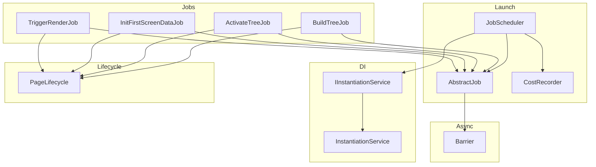
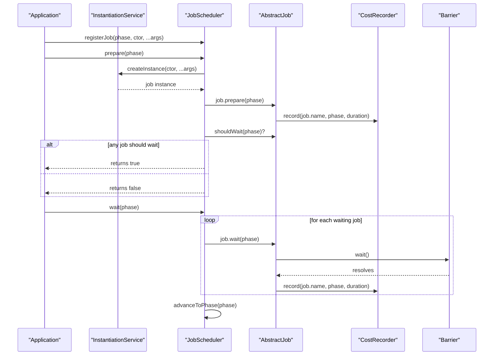
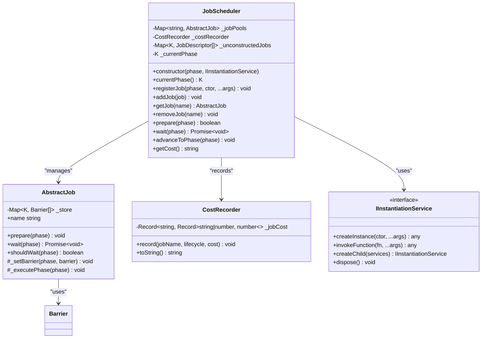
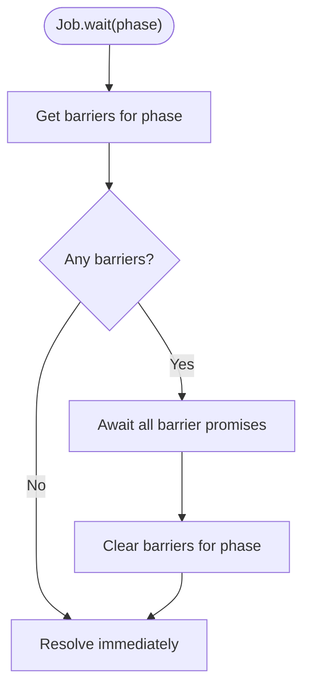
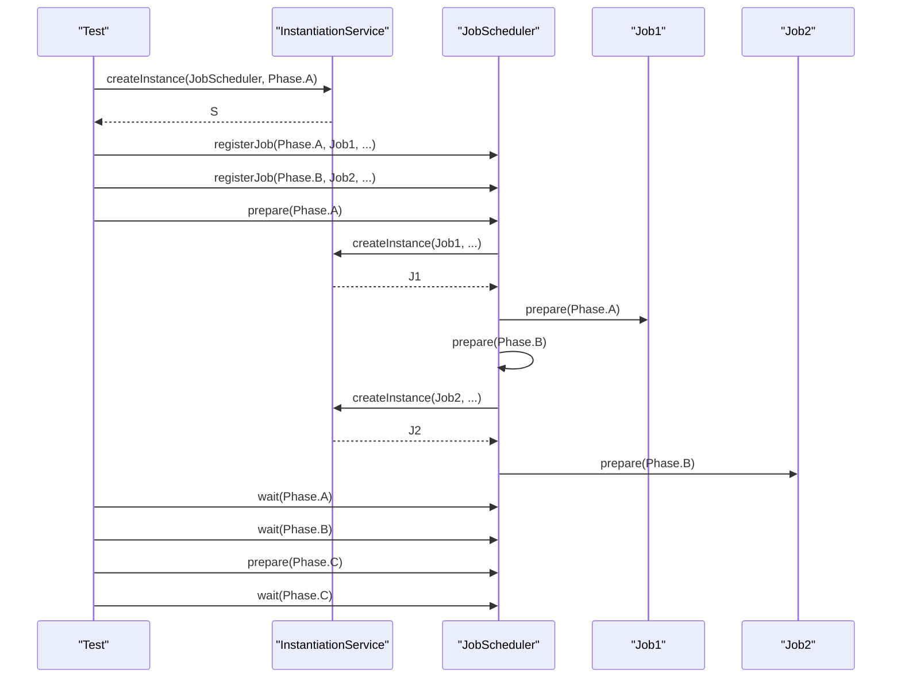
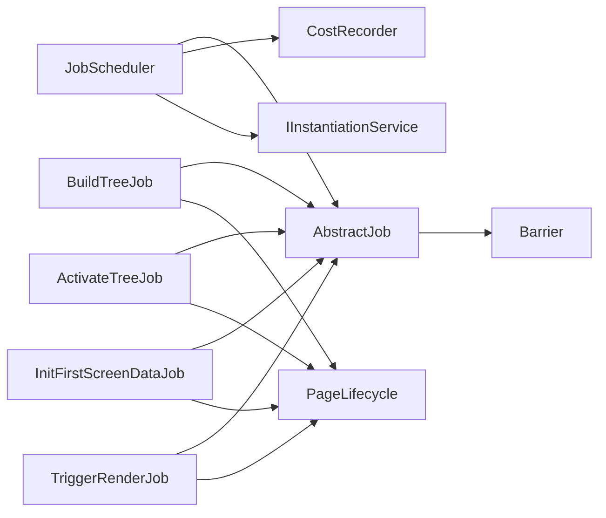

# Job Scheduler

<cite>
**Referenced Files in This Document**
- [job-scheduler.ts](file://packages/h5-builder/src/bedrock/launch/job-scheduler.ts)
- [abstract-job.ts](file://packages/h5-builder/src/bedrock/launch/abstract-job.ts)
- [cost-recorder.ts](file://packages/h5-builder/src/bedrock/launch/cost-recorder.ts)
- [instantiation-service.interface.ts](file://packages/h5-builder/src/bedrock/di/instantiation-service.interface.ts)
- [instantiation-service.ts](file://packages/h5-builder/src/bedrock/di/instantiation-service.ts)
- [barrier.ts](file://packages/h5-builder/src/bedrock/async/barrier.ts)
- [lifecycle.ts](file://packages/h5-builder/src/jobs/lifecycle.ts)
- [build-tree-job.ts](file://packages/h5-builder/src/jobs/build-tree-job.ts)
- [activate-tree-job.ts](file://packages/h5-builder/src/jobs/activate-tree-job.ts)
- [init-first-screen-data-job.ts](file://packages/h5-builder/src/jobs/init-first-screen-data-job.ts)
- [trigger-render-job.ts](file://packages/h5-builder/src/jobs/trigger-render-job.ts)
- [job-scheduler.test.ts](file://packages/h5-builder/src/bedrock/launch/job-scheduler.test.ts)
</cite>

## Table of Contents
1. [Introduction](#introduction)
2. [Project Structure](#project-structure)
3. [Core Components](#core-components)
4. [Architecture Overview](#architecture-overview)
5. [Detailed Component Analysis](#detailed-component-analysis)
6. [Dependency Analysis](#dependency-analysis)
7. [Performance Considerations](#performance-considerations)
8. [Troubleshooting Guide](#troubleshooting-guide)
9. [Conclusion](#conclusion)
10. [Appendices](#appendices)

## Introduction
This document provides comprehensive API documentation for the JobScheduler class in the H5 Builder Framework. It explains how JobScheduler orchestrates tasks across lifecycle phases, how jobs are registered and instantiated on demand, and how execution control is managed through prepare, wait, and advanceToPhase. It also covers the role of AbstractJob and JobDescriptor, the CostRecorder for performance metrics, integration with the DI system via IInstantiationService, and best practices for task prioritization and avoiding blocking operations in critical phases.

## Project Structure
The JobScheduler resides in the launch subsystem alongside related abstractions and utilities:
- Launch subsystem: JobScheduler, AbstractJob, CostRecorder
- DI subsystem: IInstantiationService interface and InstantiationService implementation
- Async primitives: Barrier for asynchronous waits
- Jobs: Example implementations demonstrating lifecycle-aware behavior
- Lifecycle: Enumerated phases used by jobs

**Diagram sources**
- [job-scheduler.ts](file://packages/h5-builder/src/bedrock/launch/job-scheduler.ts#L1-L123)
- [abstract-job.ts](file://packages/h5-builder/src/bedrock/launch/abstract-job.ts#L1-L46)
- [cost-recorder.ts](file://packages/h5-builder/src/bedrock/launch/cost-recorder.ts#L1-L23)
- [instantiation-service.interface.ts](file://packages/h5-builder/src/bedrock/di/instantiation-service.interface.ts#L1-L47)
- [instantiation-service.ts](file://packages/h5-builder/src/bedrock/di/instantiation-service.ts#L1-L468)
- [barrier.ts](file://packages/h5-builder/src/bedrock/async/barrier.ts#L1-L59)
- [build-tree-job.ts](file://packages/h5-builder/src/jobs/build-tree-job.ts#L1-L59)
- [activate-tree-job.ts](file://packages/h5-builder/src/jobs/activate-tree-job.ts#L1-L56)
- [init-first-screen-data-job.ts](file://packages/h5-builder/src/jobs/init-first-screen-data-job.ts#L1-L67)
- [trigger-render-job.ts](file://packages/h5-builder/src/jobs/trigger-render-job.ts#L1-L44)
- [lifecycle.ts](file://packages/h5-builder/src/jobs/lifecycle.ts#L1-L18)

**Section sources**
- [job-scheduler.ts](file://packages/h5-builder/src/bedrock/launch/job-scheduler.ts#L1-L123)
- [abstract-job.ts](file://packages/h5-builder/src/bedrock/launch/abstract-job.ts#L1-L46)
- [cost-recorder.ts](file://packages/h5-builder/src/bedrock/launch/cost-recorder.ts#L1-L23)
- [instantiation-service.interface.ts](file://packages/h5-builder/src/bedrock/di/instantiation-service.interface.ts#L1-L47)
- [instantiation-service.ts](file://packages/h5-builder/src/bedrock/di/instantiation-service.ts#L1-L468)
- [barrier.ts](file://packages/h5-builder/src/bedrock/async/barrier.ts#L1-L59)
- [lifecycle.ts](file://packages/h5-builder/src/jobs/lifecycle.ts#L1-L18)

## Core Components
- JobScheduler: Central orchestrator for lifecycle-driven jobs. Supports delayed construction, phase-based preparation, asynchronous waiting, and phase advancement.
- AbstractJob: Base class for all jobs. Provides lifecycle hooks, barrier-based waiting, and internal phase execution.
- JobDescriptor: Lightweight descriptor for deferred job construction.
- CostRecorder: Tracks per-job, per-phase execution durations.
- IInstantiationService: DI contract for constructing jobs with injected services.
- Barrier: Primitive for asynchronous synchronization across jobs.

Key APIs:
- JobScheduler.registerJob(phase, ctor, ...args)
- JobScheduler.addJob(job)
- JobScheduler.prepare(phase) -> boolean
- JobScheduler.wait(phase) -> Promise<void>
- JobScheduler.advanceToPhase(phase)
- JobScheduler.getJob(name)
- JobScheduler.removeJob(name)
- JobScheduler.getCost() -> string
- AbstractJob.prepare(phase), AbstractJob.wait(phase), AbstractJob.shouldWait(phase)
- Barrier.wait(), Barrier.open(), Barrier.reject()

**Section sources**
- [job-scheduler.ts](file://packages/h5-builder/src/bedrock/launch/job-scheduler.ts#L1-L123)
- [abstract-job.ts](file://packages/h5-builder/src/bedrock/launch/abstract-job.ts#L1-L46)
- [cost-recorder.ts](file://packages/h5-builder/src/bedrock/launch/cost-recorder.ts#L1-L23)
- [instantiation-service.interface.ts](file://packages/h5-builder/src/bedrock/di/instantiation-service.interface.ts#L1-L47)
- [barrier.ts](file://packages/h5-builder/src/bedrock/async/barrier.ts#L1-L59)

## Architecture Overview
JobScheduler coordinates job lifecycles around a typed phase enum. Jobs are either added directly or registered to be constructed on-demand at specific phases. During prepare, unconstructed jobs are instantiated via the DI system and prepared. Jobs can declare asynchronous waits using barriers. The scheduler records execution costs and exposes utilities to advance phases and await completion.

**Diagram sources**
- [job-scheduler.ts](file://packages/h5-builder/src/bedrock/launch/job-scheduler.ts#L65-L121)
- [abstract-job.ts](file://packages/h5-builder/src/bedrock/launch/abstract-job.ts#L11-L30)
- [cost-recorder.ts](file://packages/h5-builder/src/bedrock/launch/cost-recorder.ts#L9-L17)
- [instantiation-service.ts](file://packages/h5-builder/src/bedrock/di/instantiation-service.ts#L150-L176)
- [barrier.ts](file://packages/h5-builder/src/bedrock/async/barrier.ts#L38-L41)

## Detailed Component Analysis

### JobScheduler
Responsibilities:
- Delayed job construction keyed by phase.
- Phase-based preparation and cost recording.
- Asynchronous waiting for jobs that declare barriers.
- Phase advancement with safety checks.
- Job registry management (add/remove/get).

Key behaviors:
- registerJob: Stores a JobDescriptor for later instantiation at the specified phase.
- prepare: Instantiates all registered jobs for the target phase via DI, calls prepare on each job, records cost, and returns whether any job declared a wait.
- wait: Waits for all jobs that indicate shouldWait for the phase, records cost, then advances phase.
- advanceToPhase: Asserts no job should still wait for the target phase, then updates current phase.
- addJob/getJob/removeJob: Manage the in-memory job pool.

**Diagram sources**
- [job-scheduler.ts](file://packages/h5-builder/src/bedrock/launch/job-scheduler.ts#L16-L123)
- [abstract-job.ts](file://packages/h5-builder/src/bedrock/launch/abstract-job.ts#L1-L46)
- [cost-recorder.ts](file://packages/h5-builder/src/bedrock/launch/cost-recorder.ts#L1-L23)
- [instantiation-service.interface.ts](file://packages/h5-builder/src/bedrock/di/instantiation-service.interface.ts#L12-L47)
- [barrier.ts](file://packages/h5-builder/src/bedrock/async/barrier.ts#L1-L59)

**Section sources**
- [job-scheduler.ts](file://packages/h5-builder/src/bedrock/launch/job-scheduler.ts#L16-L123)

### AbstractJob
Responsibilities:
- Provide lifecycle hooks via prepare and internal _executePhase.
- Track barriers per phase and expose shouldWait and wait.
- Clear barriers after wait completes to allow re-use across phases.

Important methods:
- prepare(phase): Delegates to _executePhase.
- shouldWait(phase): True if there are barriers for the phase.
- wait(phase): Resolves when all barriers for the phase resolve; clears barriers afterward.
- _setBarrier(phase, barrier): Registers a barrier for a phase.

**Diagram sources**
- [abstract-job.ts](file://packages/h5-builder/src/bedrock/launch/abstract-job.ts#L11-L30)
- [barrier.ts](file://packages/h5-builder/src/bedrock/async/barrier.ts#L38-L41)

**Section sources**
- [abstract-job.ts](file://packages/h5-builder/src/bedrock/launch/abstract-job.ts#L1-L46)

### CostRecorder
Responsibilities:
- Accumulate per-job, per-phase execution durations.
- Expose a JSON string representation of collected metrics.

Key methods:
- record(jobName, lifecycle, cost): Adds to the running total for the given job and phase.
- toString(): Serializes metrics to a JSON string.

**Section sources**
- [cost-recorder.ts](file://packages/h5-builder/src/bedrock/launch/cost-recorder.ts#L1-L23)

### DI Integration via IInstantiationService
- JobScheduler constructor accepts IInstantiationService and uses it to construct jobs registered via registerJob.
- The interface defines createInstance overloads and service accessor semantics.
- The implementation constructs instances, resolves dependencies, and supports tracing and error propagation.

**Section sources**
- [job-scheduler.ts](file://packages/h5-builder/src/bedrock/launch/job-scheduler.ts#L1-L24)
- [instantiation-service.interface.ts](file://packages/h5-builder/src/bedrock/di/instantiation-service.interface.ts#L12-L47)
- [instantiation-service.ts](file://packages/h5-builder/src/bedrock/di/instantiation-service.ts#L150-L176)

### Lifecycle Phases and Jobs
- PageLifecycle defines the canonical phases used by jobs.
- Example jobs demonstrate how to implement lifecycle-aware behavior:
  - BuildTreeJob: Builds the model tree during Prepare.
  - ActivateTreeJob: Activates the component tree after Render.
  - InitFirstScreenDataJob: Sets a barrier at Completed to signal readiness.
  - TriggerRenderJob: Triggers external rendering at Render.

**Section sources**
- [lifecycle.ts](file://packages/h5-builder/src/jobs/lifecycle.ts#L1-L18)
- [build-tree-job.ts](file://packages/h5-builder/src/jobs/build-tree-job.ts#L1-L59)
- [activate-tree-job.ts](file://packages/h5-builder/src/jobs/activate-tree-job.ts#L1-L56)
- [init-first-screen-data-job.ts](file://packages/h5-builder/src/jobs/init-first-screen-data-job.ts#L1-L67)
- [trigger-render-job.ts](file://packages/h5-builder/src/jobs/trigger-render-job.ts#L1-L44)

## Architecture Overview
The scheduler orchestrates a deterministic, phase-driven pipeline:
- Jobs are registered to run at specific phases.
- prepare constructs and prepares jobs for the target phase, measuring cost.
- wait resolves asynchronous dependencies declared via barriers.
- advanceToPhase moves the scheduler to the next phase safely.

**Diagram sources**
- [job-scheduler.test.ts](file://packages/h5-builder/src/bedrock/launch/job-scheduler.test.ts#L61-L122)
- [job-scheduler.ts](file://packages/h5-builder/src/bedrock/launch/job-scheduler.ts#L65-L121)

## Detailed Component Analysis

### Job Registration and Deferred Construction
- registerJob stores a JobDescriptor for later instantiation.
- prepare iterates descriptors for the target phase, constructs instances via DI, and calls prepare on each job.
- addJob bypasses deferred construction and registers an already-created job.

Best practices:
- Prefer registerJob for jobs that should only run at specific phases.
- Use addJob for jobs that are ready immediately.

**Section sources**
- [job-scheduler.ts](file://packages/h5-builder/src/bedrock/launch/job-scheduler.ts#L36-L75)

### Phase-Based Execution Control
- prepare: Constructs and prepares jobs for the target phase, records cost, and determines if any job should wait.
- wait: Awaits all jobs that declared shouldWait for the phase, records cost, and advances phase.
- advanceToPhase: Asserts no job should still wait for the target phase, then updates current phase.

Error handling:
- advanceToPhase asserts if any job still declares shouldWait for the target phase.

**Section sources**
- [job-scheduler.ts](file://packages/h5-builder/src/bedrock/launch/job-scheduler.ts#L65-L101)

### Asynchronous Waits with Barriers
- Jobs can set barriers for a phase using _setBarrier.
- AbstractJob.wait aggregates all barriers for a phase and resolves when all are open.
- Barrier.open resolves wait; Barrier.reject propagates errors.

Practical example:
- InitFirstScreenDataJob sets a barrier at Completed and opens it after initial data is ready.

**Section sources**
- [abstract-job.ts](file://packages/h5-builder/src/bedrock/launch/abstract-job.ts#L11-L30)
- [barrier.ts](file://packages/h5-builder/src/bedrock/async/barrier.ts#L1-L59)
- [init-first-screen-data-job.ts](file://packages/h5-builder/src/jobs/init-first-screen-data-job.ts#L1-L67)

### Practical Examples

#### Registering Jobs for Different Lifecycle Phases
- Start/Open: Initialize services or fetch schema.
- Prepare: Build model tree.
- RenderReady: Finalize resources.
- Render: Trigger external rendering.
- Completed: Initialize first screen data.
- Idle: Perform background tasks.

Example patterns:
- BuildTreeJob executes during Prepare.
- TriggerRenderJob executes during Render.
- ActivateTreeJob executes during RenderReady.
- InitFirstScreenDataJob sets a barrier at Completed.

**Section sources**
- [build-tree-job.ts](file://packages/h5-builder/src/jobs/build-tree-job.ts#L1-L59)
- [trigger-render-job.ts](file://packages/h5-builder/src/jobs/trigger-render-job.ts#L1-L44)
- [activate-tree-job.ts](file://packages/h5-builder/src/jobs/activate-tree-job.ts#L1-L56)
- [init-first-screen-data-job.ts](file://packages/h5-builder/src/jobs/init-first-screen-data-job.ts#L1-L67)
- [lifecycle.ts](file://packages/h5-builder/src/jobs/lifecycle.ts#L1-L18)

#### Handling Asynchronous Waits
- Use AbstractJob._setBarrier to register a Barrier for a phase.
- Open the barrier when the asynchronous operation completes.
- Ensure barriers are cleared after wait to avoid stale state.

**Section sources**
- [abstract-job.ts](file://packages/h5-builder/src/bedrock/launch/abstract-job.ts#L11-L30)
- [barrier.ts](file://packages/h5-builder/src/bedrock/async/barrier.ts#L1-L59)
- [init-first-screen-data-job.ts](file://packages/h5-builder/src/jobs/init-first-screen-data-job.ts#L1-L67)

#### Monitoring Execution Costs
- CostRecorder accumulates per-job, per-phase durations.
- Access metrics via getCost() to inspect performance.

**Section sources**
- [cost-recorder.ts](file://packages/h5-builder/src/bedrock/launch/cost-recorder.ts#L1-L23)
- [job-scheduler.ts](file://packages/h5-builder/src/bedrock/launch/job-scheduler.ts#L85-L87)

## Dependency Analysis
- JobScheduler depends on:
  - AbstractJob for lifecycle hooks and barrier management.
  - IInstantiationService for constructing jobs with injected services.
  - CostRecorder for performance metrics.
- AbstractJob depends on Barrier for asynchronous synchronization.
- Jobs depend on PageLifecycle and services via DI.

**Diagram sources**
- [job-scheduler.ts](file://packages/h5-builder/src/bedrock/launch/job-scheduler.ts#L16-L123)
- [abstract-job.ts](file://packages/h5-builder/src/bedrock/launch/abstract-job.ts#L1-L46)
- [cost-recorder.ts](file://packages/h5-builder/src/bedrock/launch/cost-recorder.ts#L1-L23)
- [instantiation-service.interface.ts](file://packages/h5-builder/src/bedrock/di/instantiation-service.interface.ts#L12-L47)
- [barrier.ts](file://packages/h5-builder/src/bedrock/async/barrier.ts#L1-L59)
- [build-tree-job.ts](file://packages/h5-builder/src/jobs/build-tree-job.ts#L1-L59)
- [activate-tree-job.ts](file://packages/h5-builder/src/jobs/activate-tree-job.ts#L1-L56)
- [init-first-screen-data-job.ts](file://packages/h5-builder/src/jobs/init-first-screen-data-job.ts#L1-L67)
- [trigger-render-job.ts](file://packages/h5-builder/src/jobs/trigger-render-job.ts#L1-L44)
- [lifecycle.ts](file://packages/h5-builder/src/jobs/lifecycle.ts#L1-L18)

**Section sources**
- [job-scheduler.ts](file://packages/h5-builder/src/bedrock/launch/job-scheduler.ts#L16-L123)
- [abstract-job.ts](file://packages/h5-builder/src/bedrock/launch/abstract-job.ts#L1-L46)
- [barrier.ts](file://packages/h5-builder/src/bedrock/async/barrier.ts#L1-L59)

## Performance Considerations
- CostRecorder granularity: Per-job, per-phase timing enables targeted optimization.
- Asynchronous waits: Use barriers to avoid blocking critical phases; ensure barriers are opened promptly.
- Deferred construction: registerJob delays expensive construction until the appropriate phase.
- Phase transitions: advanceToPhase enforces that no job should still wait, preventing deadlocks and ensuring predictable progress.

[No sources needed since this section provides general guidance]

## Troubleshooting Guide
Common issues and resolutions:
- Duplicate job registration: Adding a job with an existing name triggers an assertion. Ensure unique job names.
- Forcing phase advancement: advanceToPhase asserts if any job still declares shouldWait for the target phase. Ensure all barriers are opened before advancing.
- Missing services: If a job constructor requires services, ensure they are registered in the DI container used by the scheduler.
- Stale barriers: AbstractJob.clears barriers after wait; ensure barriers are not reused across phases unintentionally.

**Section sources**
- [job-scheduler.ts](file://packages/h5-builder/src/bedrock/launch/job-scheduler.ts#L52-L55)
- [job-scheduler.ts](file://packages/h5-builder/src/bedrock/launch/job-scheduler.ts#L93-L101)
- [abstract-job.ts](file://packages/h5-builder/src/bedrock/launch/abstract-job.ts#L11-L30)

## Conclusion
JobScheduler provides a robust, phase-driven orchestration mechanism for lifecycle-aware tasks. By combining deferred construction, barrier-based asynchronous waits, and cost tracking, it enables efficient and observable task execution. Integration with the DI system ensures services are available when jobs run, while assertions and explicit phase controls help prevent common pitfalls.

[No sources needed since this section summarizes without analyzing specific files]

## Appendices

### API Reference Summary

- JobScheduler
  - registerJob(phase, ctor, ...args): Register a job to be constructed at phase.
  - addJob(job): Add an already-constructed job.
  - getJob(name): Retrieve a job by name.
  - removeJob(name): Remove a job by name.
  - prepare(phase): Instantiate and prepare jobs for phase; returns whether any job should wait.
  - wait(phase): Wait for all jobs that declared shouldWait for phase; advances phase.
  - advanceToPhase(phase): Advance to phase if no job should still wait.
  - getCost(): Return JSON string of recorded costs.
  - currentPhase: Getter for current phase.

- AbstractJob
  - prepare(phase): Lifecycle hook wrapper.
  - wait(phase): Wait for barriers of phase.
  - shouldWait(phase): Check if any barriers exist for phase.
  - _setBarrier(phase, barrier): Register a barrier for phase.

- Barrier
  - wait(): Promise that resolves when barrier is opened.
  - open(): Open the barrier.
  - reject(error): Reject the barrier.

- IInstantiationService
  - createInstance(ctor, ...args): Construct an instance with DI-resolved services.
  - invokeFunction(fn, ...args): Invoke function with service accessor.
  - createChild(services): Create a child container.
  - dispose(): Dispose container and owned services.

**Section sources**
- [job-scheduler.ts](file://packages/h5-builder/src/bedrock/launch/job-scheduler.ts#L36-L121)
- [abstract-job.ts](file://packages/h5-builder/src/bedrock/launch/abstract-job.ts#L11-L45)
- [barrier.ts](file://packages/h5-builder/src/bedrock/async/barrier.ts#L1-L59)
- [instantiation-service.interface.ts](file://packages/h5-builder/src/bedrock/di/instantiation-service.interface.ts#L12-L47)

### Best Practices
- Task prioritization: Use registerJob to defer heavy tasks to later phases; keep critical phases responsive.
- Avoid blocking: Do not perform long synchronous operations in prepare or wait; use barriers for asynchronous completion.
- Unique names: Ensure job names are unique to prevent assertion failures.
- Clear barriers: Allow AbstractJob to clear barriers after wait to support re-use across phases.
- Monitor costs: Use getCost() to identify hotspots and optimize accordingly.

[No sources needed since this section provides general guidance]