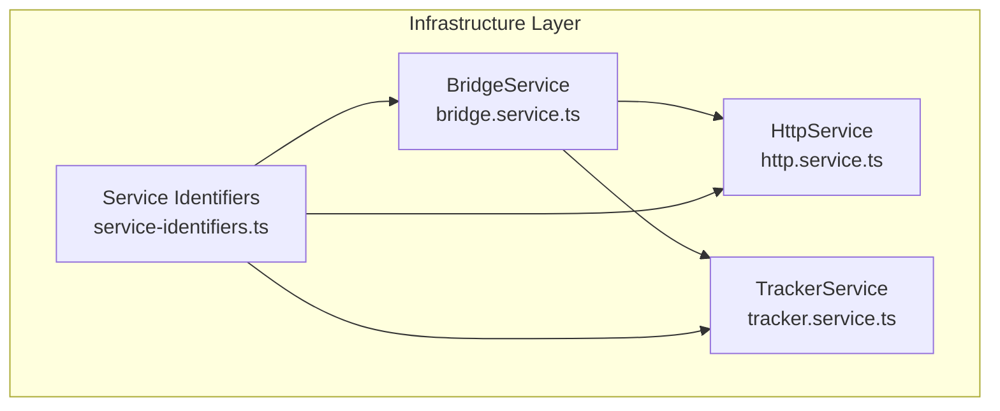
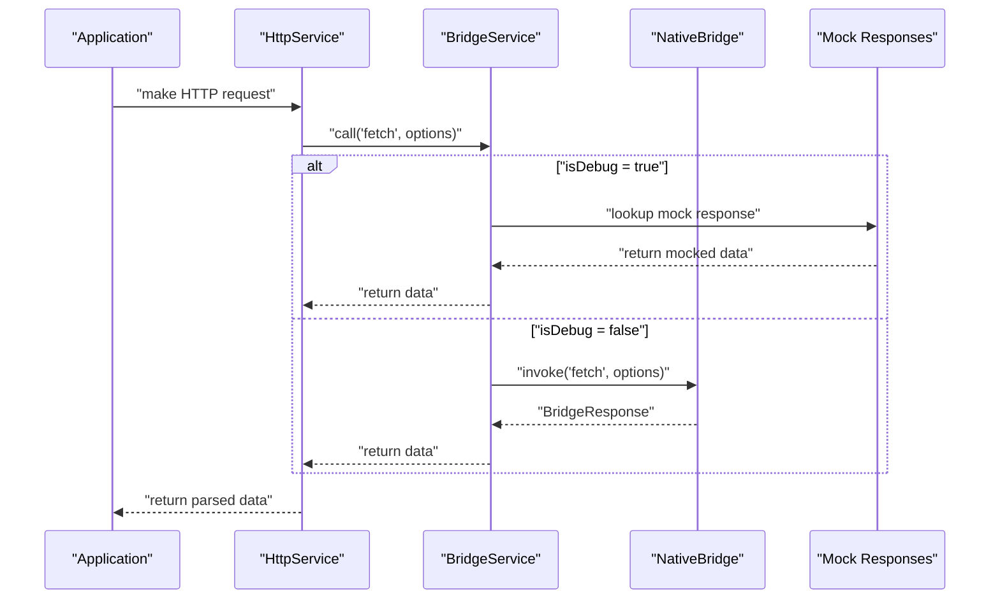
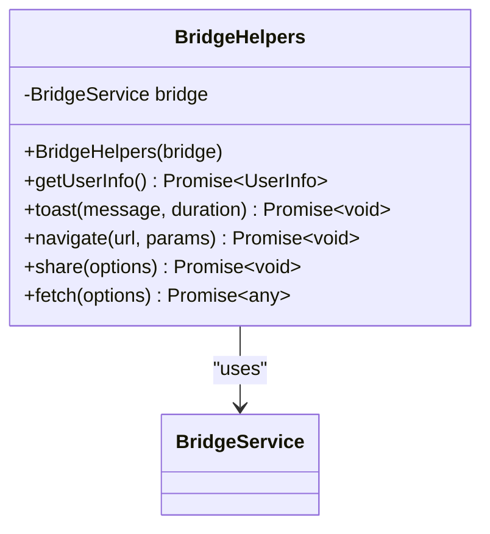
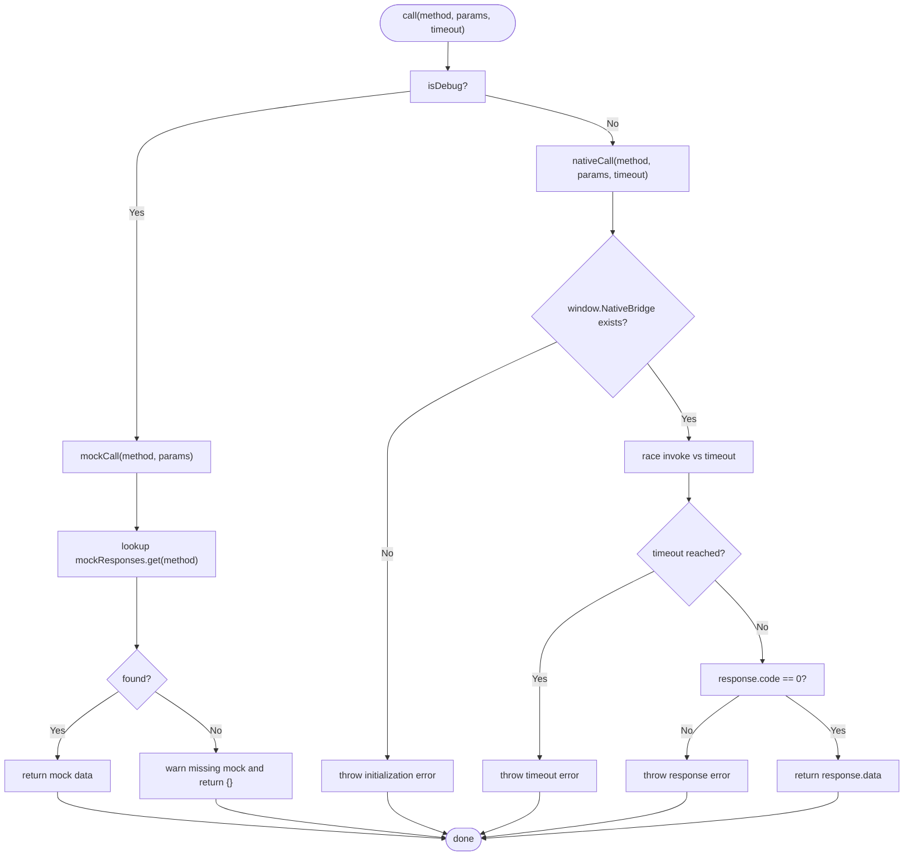
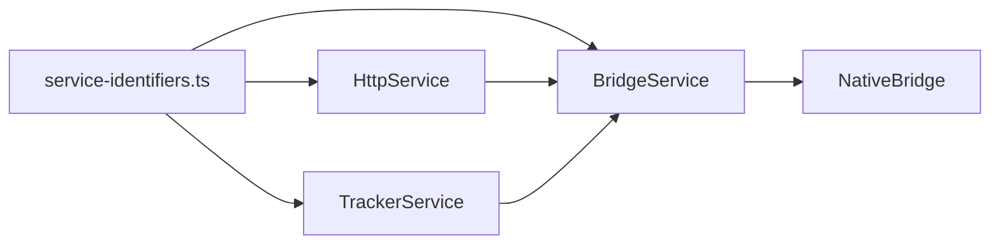

# Bridge Service

<cite>
**Referenced Files in This Document**
- [bridge.service.ts](file://packages/h5-builder/src/services/bridge.service.ts)
- [bridge.service.test.ts](file://packages/h5-builder/src/__tests__/bridge.service.test.ts)
- [http.service.ts](file://packages/h5-builder/src/services/http.service.ts)
- [tracker.service.ts](file://packages/h5-builder/src/services/tracker.service.ts)
- [service-identifiers.ts](file://packages/h5-builder/src/services/service-identifiers.ts)
- [api_reference.md](file://packages/h5-builder/docs/api_reference.md)
- [faq.md](file://packages/h5-builder/docs/faq.md)
</cite>

## Table of Contents
1. [Introduction](#introduction)
2. [Project Structure](#project-structure)
3. [Core Components](#core-components)
4. [Architecture Overview](#architecture-overview)
5. [Detailed Component Analysis](#detailed-component-analysis)
6. [Dependency Analysis](#dependency-analysis)
7. [Performance Considerations](#performance-considerations)
8. [Troubleshooting Guide](#troubleshooting-guide)
9. [Conclusion](#conclusion)
10. [Appendices](#appendices)

## Introduction
This document provides comprehensive API documentation for the BridgeService in the H5 Builder Framework. It explains how the BridgeService enables communication between JavaScript and native mobile applications via JSBridge, details the NativeBridge interface, BridgeCallParams, and BridgeResponse types, and describes the call method with timeout handling, error management, and response validation. It also covers the mock mode functionality for browser debugging, including setMockResponse and setupMockResponses methods, and documents the BridgeHelpers utility class that provides high-level wrappers for common native operations such as getUserInfo, toast, navigate, and share. Practical usage examples for both production and development environments, integration patterns with native apps, and troubleshooting guidance for common issues are included.

## Project Structure
The BridgeService resides in the infrastructure layer of the H5 Builder Framework alongside other foundational services like HttpService and TrackerService. It is designed to be injected into higher-level services and used throughout the application for cross-platform communication.



**Diagram sources**
- [bridge.service.ts](file://packages/h5-builder/src/services/bridge.service.ts#L1-L227)
- [http.service.ts](file://packages/h5-builder/src/services/http.service.ts#L1-L281)
- [tracker.service.ts](file://packages/h5-builder/src/services/tracker.service.ts#L1-L290)
- [service-identifiers.ts](file://packages/h5-builder/src/services/service-identifiers.ts#L1-L19)

**Section sources**
- [bridge.service.ts](file://packages/h5-builder/src/services/bridge.service.ts#L1-L227)
- [http.service.ts](file://packages/h5-builder/src/services/http.service.ts#L1-L281)
- [tracker.service.ts](file://packages/h5-builder/src/services/tracker.service.ts#L1-L290)
- [service-identifiers.ts](file://packages/h5-builder/src/services/service-identifiers.ts#L1-L19)

## Core Components
- BridgeService: Provides unified JSBridge invocation with support for mock mode for browser debugging. It exposes the call method, timeout handling, error management, and response validation. It also manages mock responses via setMockResponse, setMockResponses, and internal setup.
- NativeBridge interface: Defines the contract for invoking native methods from JavaScript, returning a standardized response shape.
- BridgeCallParams: Generic parameter type for JSBridge calls.
- BridgeResponse: Standardized response shape returned by native calls.
- BridgeHelpers: Utility class offering high-level wrappers around common native operations (getUserInfo, toast, navigate, share, fetch).

Key responsibilities:
- Unified invocation abstraction for native capabilities.
- Mock mode for local development and testing.
- Timeout protection and error propagation.
- Validation of response codes and messages.

**Section sources**
- [bridge.service.ts](file://packages/h5-builder/src/services/bridge.service.ts#L1-L227)
- [api_reference.md](file://packages/h5-builder/docs/api_reference.md#L276-L321)

## Architecture Overview
The BridgeService sits at the foundation of the infrastructure layer, consumed by HttpService and TrackerService. It abstracts platform differences behind a consistent API and supports both production native invocation and development-time mock responses.



**Diagram sources**
- [http.service.ts](file://packages/h5-builder/src/services/http.service.ts#L147-L203)
- [bridge.service.ts](file://packages/h5-builder/src/services/bridge.service.ts#L49-L118)

**Section sources**
- [http.service.ts](file://packages/h5-builder/src/services/http.service.ts#L147-L203)
- [bridge.service.ts](file://packages/h5-builder/src/services/bridge.service.ts#L49-L118)

## Detailed Component Analysis

### BridgeService
The BridgeService encapsulates JSBridge invocation with robust error handling, timeout protection, and mock mode support.

- Constructor
  - Accepts an optional isDebug flag. When true or when window.NativeBridge is unavailable, the service operates in mock mode and preloads default mock responses.
- call(method, params, timeout)
  - Determines whether to use native invocation or mock mode.
  - Native mode:
    - Validates presence of window.NativeBridge.
    - Races the native invoke against a timeout promise.
    - Validates response.code equals success; otherwise throws with message.
  - Mock mode:
    - Simulates network delay.
    - Returns predefined mock data for the given method or an empty object fallback.
- nativeCall(method, params, timeout)
  - Implements the timeout race and response validation logic described above.
- mockCall(method, params)
  - Implements mock mode logic described above.
- setMockResponse(method, data)
  - Registers a single mock response for a method.
- setMockResponses(map)
  - Registers multiple mock responses via an object map.
- setupMockResponses()
  - Preloads default mock responses for common methods (getUserInfo, toast, navigate, share, fetch).
- dispose()
  - Clears mock responses to prevent memory leaks.

```mermaid
classDiagram
class BridgeService {
-boolean isDebug
-Map~string, any~ mockResponses
+BridgeService(isDebug=false)
+call~T~(method, params={}, timeout=5000) Promise~T~
-nativeCall~T~(method, params, timeout) Promise~T~
-mockCall~T~(method, params) Promise~T~
+setMockResponse(method, data) void
+setMockResponses(map) void
-setupMockResponses() void
+dispose() void
}
class NativeBridge {
<<interface>>
+invoke~T~(method, params) Promise~BridgeResponse~T~~
}
class BridgeResponse {
+number code
+any data
+string message
}
class BridgeCallParams {
<<type>>
}
BridgeService --> NativeBridge : "invokes"
BridgeService --> BridgeResponse : "returns"
BridgeService --> BridgeCallParams : "consumes"
```

**Diagram sources**
- [bridge.service.ts](file://packages/h5-builder/src/services/bridge.service.ts#L1-L227)

**Section sources**
- [bridge.service.ts](file://packages/h5-builder/src/services/bridge.service.ts#L49-L169)
- [bridge.service.test.ts](file://packages/h5-builder/src/__tests__/bridge.service.test.ts#L1-L132)

### NativeBridge Interface
Defines the contract for native invocation:
- invoke(method, params) -> Promise<BridgeResponse<T>>
- Used by BridgeService.nativeCall to communicate with the native bridge.

**Section sources**
- [bridge.service.ts](file://packages/h5-builder/src/services/bridge.service.ts#L22-L24)

### BridgeCallParams and BridgeResponse Types
- BridgeCallParams: Arbitrary key-value payload passed to native methods.
- BridgeResponse<T>: Standardized response shape with code, data, and optional message.

These types ensure consistent behavior across all BridgeService invocations.

**Section sources**
- [bridge.service.ts](file://packages/h5-builder/src/services/bridge.service.ts#L6-L17)

### BridgeHelpers Utility Class
Provides convenient wrappers around common native operations:
- getUserInfo(): Returns user profile fields.
- toast(message, duration): Triggers a toast notification.
- navigate(url, params): Navigates to a target page.
- share(options): Initiates sharing with title, content, and optional media URLs.
- fetch(options): Delegates to BridgeService.call('fetch') for HTTP requests.



**Diagram sources**
- [bridge.service.ts](file://packages/h5-builder/src/services/bridge.service.ts#L171-L227)

**Section sources**
- [bridge.service.ts](file://packages/h5-builder/src/services/bridge.service.ts#L171-L227)

### Call Method Flow (Timeout, Error Handling, Validation)


**Diagram sources**
- [bridge.service.ts](file://packages/h5-builder/src/services/bridge.service.ts#L49-L118)

**Section sources**
- [bridge.service.ts](file://packages/h5-builder/src/services/bridge.service.ts#L49-L118)

### Mock Mode Functionality
- Behavior:
  - When isDebug is true or window.NativeBridge is absent, BridgeService operates in mock mode.
  - Mock responses are stored in an internal Map keyed by method name.
  - setupMockResponses preloads defaults for getUserInfo, toast, navigate, share, and fetch.
- Methods:
  - setMockResponse(method, data): Register a single mock response.
  - setMockResponses(map): Register multiple mock responses.
- Testing:
  - Unit tests demonstrate enabling mock mode, setting custom mocks, batching mock registrations, and verifying fallback behavior.

**Section sources**
- [bridge.service.ts](file://packages/h5-builder/src/services/bridge.service.ts#L120-L169)
- [bridge.service.test.ts](file://packages/h5-builder/src/__tests__/bridge.service.test.ts#L12-L45)

### Integration Patterns with Native Apps
- Production:
  - Ensure window.NativeBridge is available before constructing BridgeService.
  - Use BridgeService.call with appropriate timeout values for long-running operations.
  - Validate response.code and handle errors gracefully.
- Development:
  - Construct BridgeService with isDebug = true to enable mock mode.
  - Use setMockResponse or setMockResponses to simulate native behavior during local testing.
- Higher-level services:
  - HttpService uses BridgeService.call('fetch') under the hood for HTTP requests.
  - TrackerService uses BridgeService.call('toast', 'trackSync', 'trackBatch') for analytics.

**Section sources**
- [http.service.ts](file://packages/h5-builder/src/services/http.service.ts#L147-L203)
- [tracker.service.ts](file://packages/h5-builder/src/services/tracker.service.ts#L71-L105)
- [faq.md](file://packages/h5-builder/docs/faq.md#L341-L351)

## Dependency Analysis
- BridgeService depends on:
  - NativeBridge interface for invoking native methods.
  - BridgeCallParams and BridgeResponse for consistent parameter and response shapes.
- HttpService and TrackerService depend on BridgeService via dependency injection tokens.
- Service identifiers define injectable tokens for BridgeService, enabling DI registration and resolution.



**Diagram sources**
- [service-identifiers.ts](file://packages/h5-builder/src/services/service-identifiers.ts#L1-L19)
- [bridge.service.ts](file://packages/h5-builder/src/services/bridge.service.ts#L1-L227)
- [http.service.ts](file://packages/h5-builder/src/services/http.service.ts#L1-L281)
- [tracker.service.ts](file://packages/h5-builder/src/services/tracker.service.ts#L1-L290)

**Section sources**
- [service-identifiers.ts](file://packages/h5-builder/src/services/service-identifiers.ts#L1-L19)
- [bridge.service.ts](file://packages/h5-builder/src/services/bridge.service.ts#L1-L227)
- [http.service.ts](file://packages/h5-builder/src/services/http.service.ts#L1-L281)
- [tracker.service.ts](file://packages/h5-builder/src/services/tracker.service.ts#L1-L290)

## Performance Considerations
- Timeout handling prevents indefinite waits for slow native operations; tune timeout values according to expected latency.
- Mock mode introduces minimal overhead and simulates network delay for realistic testing.
- BridgeHelpers centralizes common operations, reducing duplication and potential performance regressions.
- For high-frequency analytics, consider batching and flushing strategies used by TrackerService to minimize native calls.

[No sources needed since this section provides general guidance]

## Troubleshooting Guide
Common issues and resolutions:
- Bridge initialization failures:
  - Symptom: Error indicating NativeBridge not available.
  - Cause: window.NativeBridge is undefined or not initialized.
  - Resolution: Ensure native bridge is ready before constructing BridgeService; alternatively, enable mock mode by passing isDebug = true.
- Method invocation errors:
  - Symptom: Response with non-zero code or thrown error.
  - Cause: Native method failure or invalid response shape.
  - Resolution: Inspect response.message and handle accordingly; validate method names and parameters.
- Timeouts:
  - Symptom: Timeout error for slow native operations.
  - Cause: Native invocation exceeding configured timeout.
  - Resolution: Increase timeout or optimize native implementation; consider breaking large operations into smaller chunks.
- Missing mock data:
  - Symptom: Warning about missing mock data; returns empty object fallback.
  - Cause: Method not registered in mock responses.
  - Resolution: Use setMockResponse or setMockResponses to register mock data for the method.

**Section sources**
- [bridge.service.ts](file://packages/h5-builder/src/services/bridge.service.ts#L75-L118)
- [bridge.service.test.ts](file://packages/h5-builder/src/__tests__/bridge.service.test.ts#L47-L85)

## Conclusion
The BridgeService provides a robust, testable abstraction for JSBridge communication in the H5 Builder Framework. Its mock mode simplifies development and testing, while its timeout and error handling mechanisms improve reliability in production. The BridgeHelpers utility class streamlines common native operations, and integration with HttpService and TrackerService demonstrates its role as a foundational service. By following the usage patterns and troubleshooting guidance outlined here, developers can confidently integrate native capabilities into their H5 applications.

[No sources needed since this section summarizes without analyzing specific files]

## Appendices

### API Reference Highlights
- BridgeService
  - Constructor: isDebug (boolean)
  - call: method, params (BridgeCallParams), timeout (number)
  - setMockResponse: method, data
  - setMockResponses: map of method -> data
  - dispose: clears mock responses
- BridgeHelpers
  - getUserInfo: returns user profile
  - toast: displays a toast notification
  - navigate: navigates to a URL
  - share: shares content
  - fetch: performs HTTP request via bridge

**Section sources**
- [api_reference.md](file://packages/h5-builder/docs/api_reference.md#L276-L321)
- [bridge.service.ts](file://packages/h5-builder/src/services/bridge.service.ts#L49-L227)

### Practical Usage Examples

- Production environment:
  - Initialize BridgeService without isDebug to use native bridge.
  - Use BridgeHelpers for common operations like toast and navigation.
  - For HTTP requests, construct HttpService with BridgeService injected; it will internally call BridgeService.call('fetch').
- Development environment:
  - Construct BridgeService with isDebug = true to enable mock mode.
  - Use setMockResponse to simulate native responses during local testing.
  - Refer to FAQ for enabling debug modes for BridgeService and TrackerService.

**Section sources**
- [faq.md](file://packages/h5-builder/docs/faq.md#L341-L351)
- [http.service.ts](file://packages/h5-builder/src/services/http.service.ts#L147-L203)
- [bridge.service.ts](file://packages/h5-builder/src/services/bridge.service.ts#L171-L227)