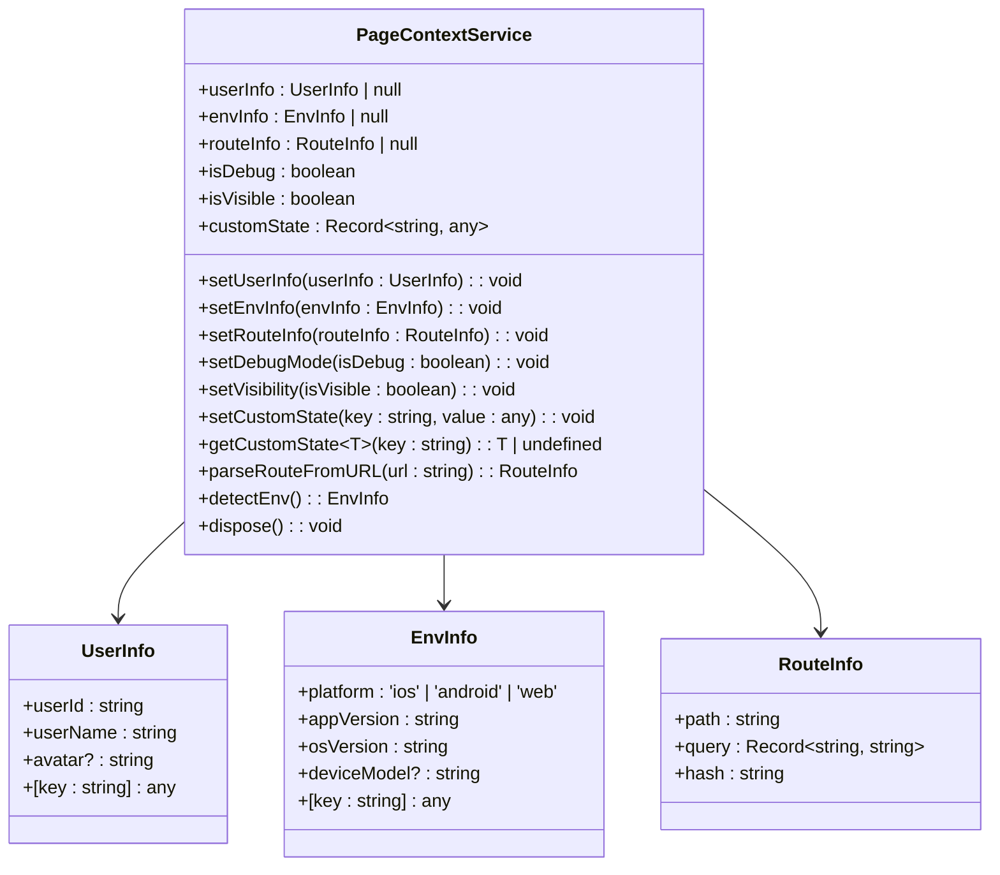
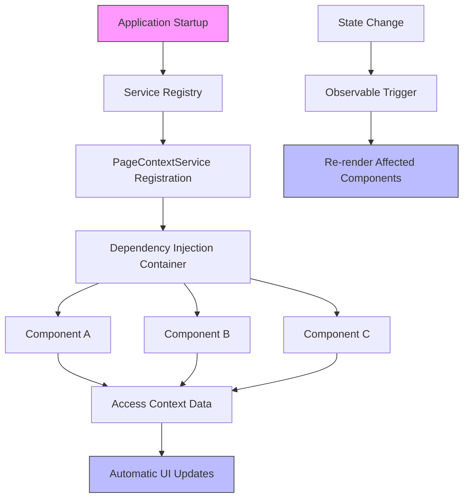
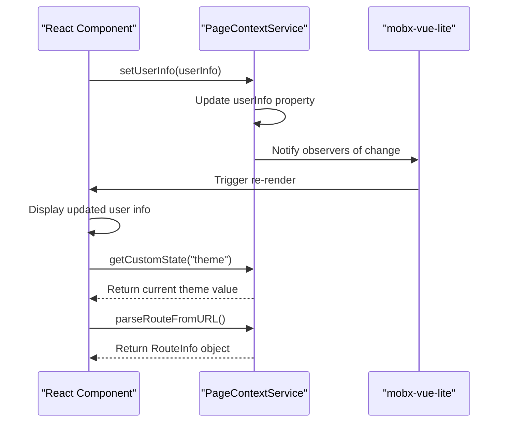
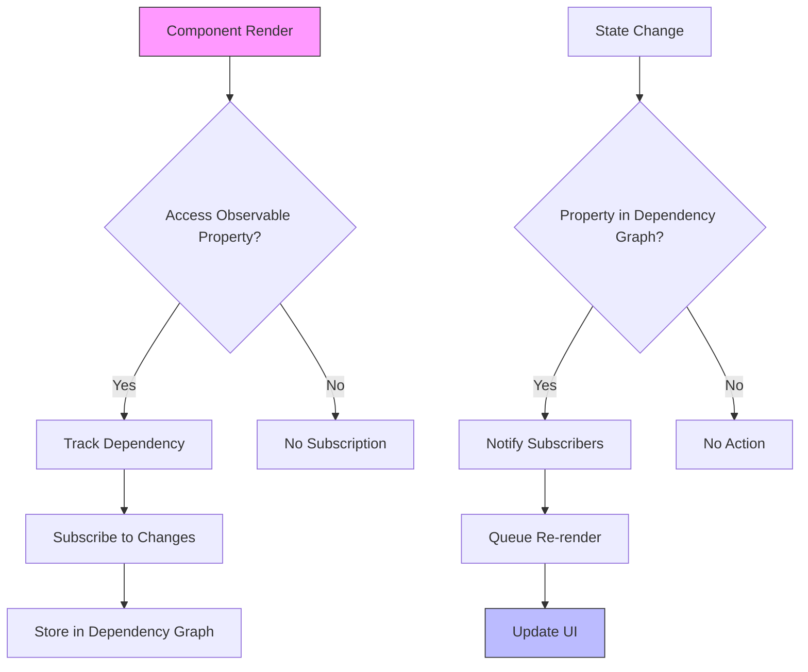
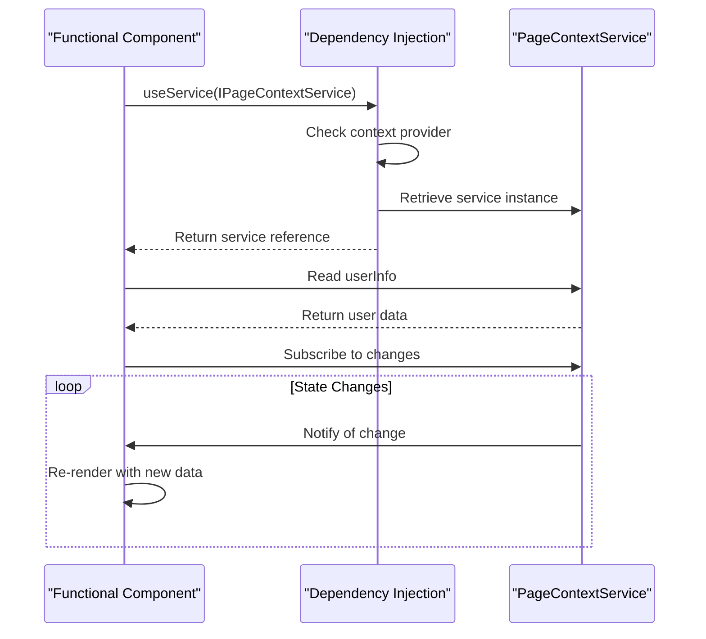
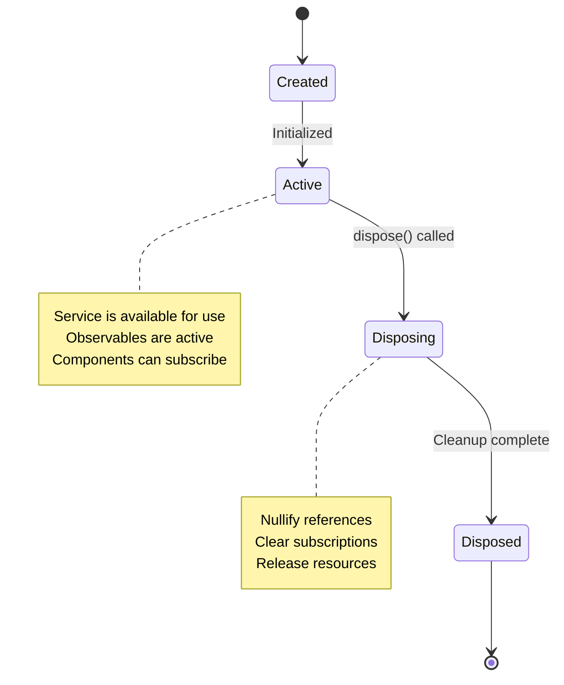

# Context Service

<cite>
**Referenced Files in This Document**   
- [context.service.ts](file://packages/h5-builder/src/services/context.service.ts)
- [demo-progressive.tsx](file://packages/h5-builder/src/demo-progressive.tsx)
- [useObserver.ts](file://packages/mobx-vue-lite/src/useObserver.ts)
- [observer.ts](file://packages/mobx-vue-lite/src/observer.ts)
- [context.web.tsx](file://packages/h5-builder/src/bedrock/di/context.web.tsx)
- [service-identifiers.ts](file://packages/h5-builder/src/services/service-identifiers.ts)
</cite>

## Table of Contents
1. [Introduction](#introduction)
2. [Core Components](#core-components)
3. [Architecture Overview](#architecture-overview)
4. [Detailed Component Analysis](#detailed-component-analysis)
5. [Integration Patterns](#integration-patterns)
6. [Best Practices](#best-practices)
7. [Lifecycle and Memory Management](#lifecycle-and-memory-management)

## Introduction
The PageContextService in the H5 Builder Framework provides a centralized store for application-level state management using mobx-vue-lite reactivity. This service enables components to share and react to global state changes including user information, environment details, routing data, and custom application state. The implementation leverages MobX's observable pattern to automatically trigger UI updates when context data changes, providing a seamless reactive programming model for developers.

**Section sources**
- [context.service.ts](file://packages/h5-builder/src/services/context.service.ts#L38-L187)

## Core Components
The PageContextService is implemented as a reactive class that manages several key state properties including userInfo, envInfo, routeInfo, and customState. These properties are made observable through the mobx-vue-lite library, enabling automatic UI updates when values change. The service provides setter methods for updating context data and utility functions for parsing URLs and detecting environment information from user agent strings.

**Diagram sources**
- [context.service.ts](file://packages/h5-builder/src/services/context.service.ts#L7-L32)
- [context.service.ts](file://packages/h5-builder/src/services/context.service.ts#L38-L136)

**Section sources**
- [context.service.ts](file://packages/h5-builder/src/services/context.service.ts#L1-L187)

## Architecture Overview
The PageContextService is integrated into the H5 Builder Framework's dependency injection system, allowing components to access the shared context through service injection. The architecture follows a reactive programming model where state changes automatically propagate to subscribed components. The service is initialized during application startup and registered with the dependency injection container, making it available throughout the application lifecycle.

**Diagram sources**
- [demo-progressive.tsx](file://packages/h5-builder/src/demo-progressive.tsx#L194-L204)
- [service-identifiers.ts](file://packages/h5-builder/src/services/service-identifiers.ts#L17)

## Detailed Component Analysis

### PageContextService Implementation
The PageContextService implements the IDisposable interface and uses mobx-vue-lite's observable function to make the entire instance reactive. In the constructor, the service returns an observable-wrapped version of itself, enabling reactivity across all properties. This approach ensures that any changes to userInfo, envInfo, routeInfo, or customState will automatically trigger updates in subscribed components.

The service provides several utility methods for managing context data:
- setUserInfo, setEnvInfo, and setRouteInfo for updating core context properties
- setCustomState and getCustomState for managing application-specific state
- parseRouteFromURL for extracting routing information from URLs
- detectEnv for identifying platform, app version, and OS version from user agent strings

**Diagram sources**
- [context.service.ts](file://packages/h5-builder/src/services/context.service.ts#L58-L61)
- [context.service.ts](file://packages/h5-builder/src/services/context.service.ts#L66-L127)

**Section sources**
- [context.service.ts](file://packages/h5-builder/src/services/context.service.ts#L1-L187)

### Reactive Property Implementation
The PageContextService leverages mobx-vue-lite's reactivity system to enable automatic UI updates when context changes. By wrapping the entire service instance with the observable function, all properties become tracked observables. Components that access these properties during rendering automatically subscribe to changes, creating a dependency relationship that ensures efficient updates.

The reactivity system works by:
1. Tracking which observables are accessed during component rendering
2. Establishing subscriptions to those observables
3. Automatically re-rendering components when subscribed observables change
4. Cleaning up subscriptions when components are unmounted

**Diagram sources**
- [useObserver.ts](file://packages/mobx-vue-lite/src/useObserver.ts#L19-L58)
- [observer.ts](file://packages/mobx-vue-lite/src/observer.ts#L16-L51)

**Section sources**
- [context.service.ts](file://packages/h5-builder/src/services/context.service.ts#L60)
- [useObserver.ts](file://packages/mobx-vue-lite/src/useObserver.ts#L1-L58)

## Integration Patterns
Components integrate with the PageContextService through the framework's dependency injection system using the useService hook. This pattern provides type-safe access to the shared context while maintaining loose coupling between components and the service implementation.

The integration workflow involves:
1. Importing the IPageContextService identifier from service-identifiers.ts
2. Using the useService hook to obtain a reference to the PageContextService
3. Accessing context properties and methods as needed
4. Relying on mobx-vue-lite's reactivity for automatic UI updates

**Diagram sources**
- [context.web.tsx](file://packages/h5-builder/src/bedrock/di/context.web.tsx#L29-L40)
- [demo-progressive.tsx](file://packages/h5-builder/src/demo-progressive.tsx#L3-L4)

**Section sources**
- [context.web.tsx](file://packages/h5-builder/src/bedrock/di/context.web.tsx#L1-L41)
- [service-identifiers.ts](file://packages/h5-builder/src/services/service-identifiers.ts#L17)

## Best Practices
When working with the PageContextService, developers should follow these best practices to ensure optimal performance and maintainability:

1. **Minimize direct property access**: Use computed properties or selectors when possible to reduce the number of direct observable accesses
2. **Avoid storing large objects in customState**: Keep customState lightweight to prevent performance issues during change detection
3. **Use specific state management for component-local state**: Reserve PageContextService for truly global application state
4. **Clean up subscriptions properly**: Ensure components properly unsubscribe from context changes when unmounted
5. **Leverage the reactivity system**: Design components to take advantage of automatic updates rather than manual state management

For accessing the service, always use the dependency injection pattern rather than creating direct references. This ensures proper lifecycle management and facilitates testing.

**Section sources**
- [context.service.ts](file://packages/h5-builder/src/services/context.service.ts#L1-L187)
- [demo-progressive.tsx](file://packages/h5-builder/src/demo-progressive.tsx#L1-L263)

## Lifecycle and Memory Management
The PageContextService implements the IDisposable interface to ensure proper cleanup of resources during application shutdown or service disposal. The dispose method resets key properties to null, breaking references that could otherwise cause memory leaks.

The service lifecycle is managed by the dependency injection container, which handles instantiation and cleanup. When the application shuts down or the service is no longer needed, the container calls the dispose method, which:
1. Nullifies userInfo and routeInfo references
2. Clears any remaining subscriptions
3. Releases references to prevent memory leaks

Components that subscribe to context changes rely on mobx-vue-lite's cleanup mechanisms, which automatically remove subscriptions when components are unmounted. The useObserver hook includes an effect cleanup function that stops the reactive effect when the component is destroyed.

**Diagram sources**
- [context.service.ts](file://packages/h5-builder/src/services/context.service.ts#L133-L136)
- [useObserver.ts](file://packages/mobx-vue-lite/src/useObserver.ts#L48-L55)

**Section sources**
- [context.service.ts](file://packages/h5-builder/src/services/context.service.ts#L130-L136)
- [useObserver.ts](file://packages/mobx-vue-lite/src/useObserver.ts#L48-L55)