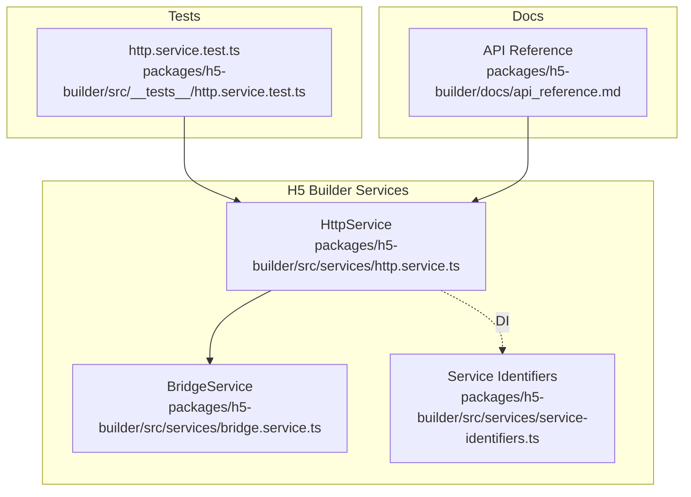
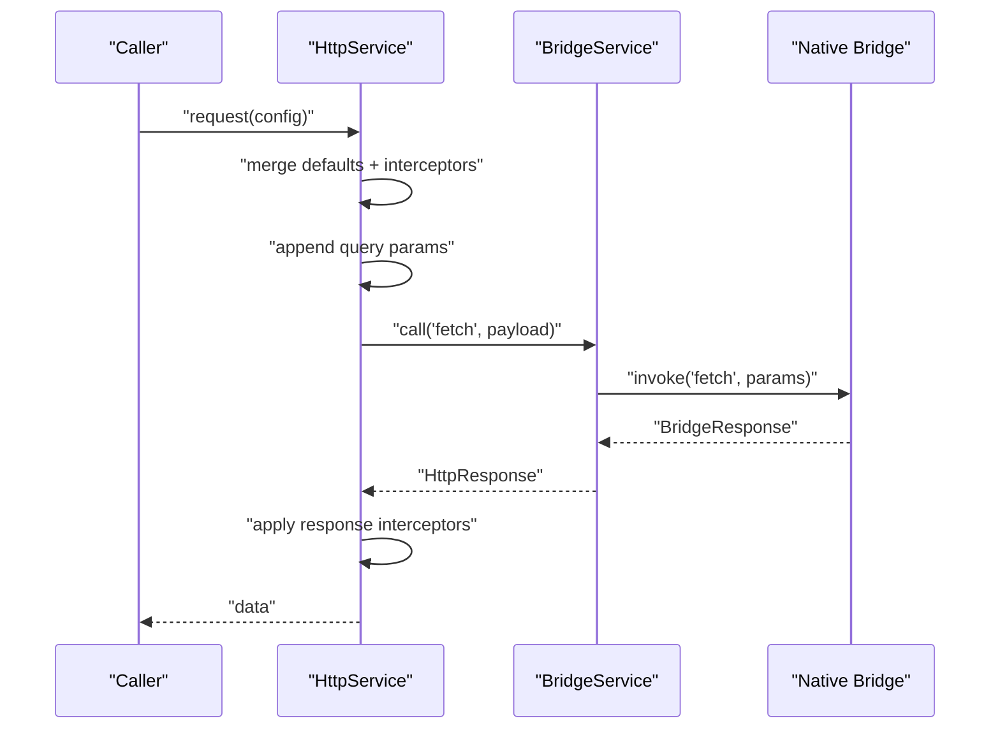
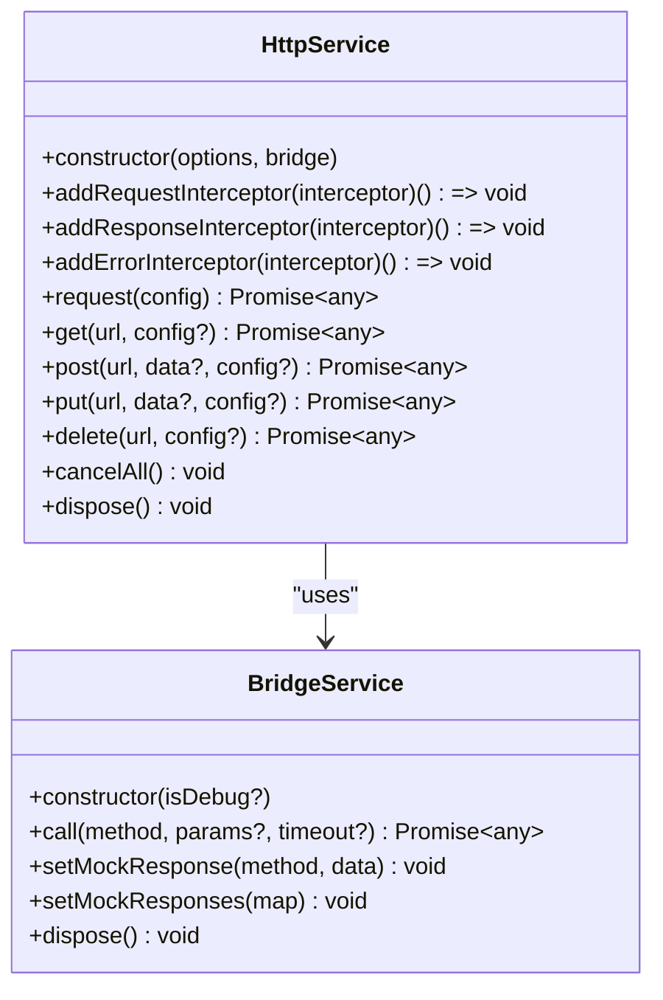
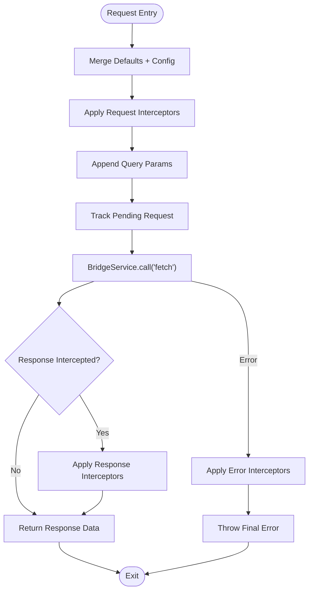
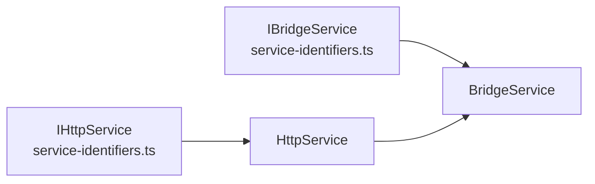

# HTTP Service

<cite>
**Referenced Files in This Document**
- [http.service.ts](file://packages/h5-builder/src/services/http.service.ts)
- [bridge.service.ts](file://packages/h5-builder/src/services/bridge.service.ts)
- [service-identifiers.ts](file://packages/h5-builder/src/services/service-identifiers.ts)
- [http.service.test.ts](file://packages/h5-builder/src/__tests__/http.service.test.ts)
- [api_reference.md](file://packages/h5-builder/docs/api_reference.md)
</cite>

## Table of Contents
1. [Introduction](#introduction)
2. [Project Structure](#project-structure)
3. [Core Components](#core-components)
4. [Architecture Overview](#architecture-overview)
5. [Detailed Component Analysis](#detailed-component-analysis)
6. [Dependency Analysis](#dependency-analysis)
7. [Performance Considerations](#performance-considerations)
8. [Troubleshooting Guide](#troubleshooting-guide)
9. [Conclusion](#conclusion)
10. [Appendices](#appendices)

## Introduction
This document provides comprehensive documentation for the HttpService in the H5 Builder Framework. It explains how HttpService leverages JSBridge for network requests while offering an axios-like interface. It covers HttpRequestConfig and HttpResponse, request method overloads (get, post, put, delete), timeout handling, the interceptor system (request, response, error), configuration options (baseURL and token), pending request tracking using AbortController, the cancelAll method, and the dispose lifecycle. Practical examples demonstrate common usage patterns, interceptor implementation for authentication and logging, and error handling strategies. Performance considerations and best practices for managing concurrent requests are also included.

## Project Structure
The HttpService resides in the services layer of the H5 Builder package. It integrates with BridgeService to communicate with native environments via JSBridge. The service exposes a familiar HTTP client API with interceptors and lifecycle management.

**Diagram sources**
- [http.service.ts](file://packages/h5-builder/src/services/http.service.ts#L1-L280)
- [bridge.service.ts](file://packages/h5-builder/src/services/bridge.service.ts#L1-L227)
- [service-identifiers.ts](file://packages/h5-builder/src/services/service-identifiers.ts#L1-L20)
- [http.service.test.ts](file://packages/h5-builder/src/__tests__/http.service.test.ts#L1-L251)
- [api_reference.md](file://packages/h5-builder/docs/api_reference.md#L323-L410)

**Section sources**
- [http.service.ts](file://packages/h5-builder/src/services/http.service.ts#L1-L280)
- [bridge.service.ts](file://packages/h5-builder/src/services/bridge.service.ts#L1-L227)
- [service-identifiers.ts](file://packages/h5-builder/src/services/service-identifiers.ts#L1-L20)
- [http.service.test.ts](file://packages/h5-builder/src/__tests__/http.service.test.ts#L1-L251)
- [api_reference.md](file://packages/h5-builder/docs/api_reference.md#L323-L410)

## Core Components
- HttpService: Provides an axios-like HTTP client built on top of JSBridge. It supports request/response/error interceptors, method overloads (get, post, put, delete), timeout handling, pending request tracking, cancellation, and lifecycle disposal.
- BridgeService: Encapsulates JSBridge invocation with native fallback and mock support for browser debugging. It manages timeouts and error propagation.
- Service Identifiers: Declares DI tokens for HttpService and BridgeService to enable dependency injection.
- Tests: Demonstrate basic requests, interceptors, query parameter handling, error interception, cancellation, and disposal.
- API Reference: Documents the HttpService API surface and usage examples.

**Section sources**
- [http.service.ts](file://packages/h5-builder/src/services/http.service.ts#L1-L280)
- [bridge.service.ts](file://packages/h5-builder/src/services/bridge.service.ts#L1-L227)
- [service-identifiers.ts](file://packages/h5-builder/src/services/service-identifiers.ts#L1-L20)
- [http.service.test.ts](file://packages/h5-builder/src/__tests__/http.service.test.ts#L1-L251)
- [api_reference.md](file://packages/h5-builder/docs/api_reference.md#L323-L410)

## Architecture Overview
HttpService composes a request pipeline:
- Merge defaults with user config
- Apply request interceptors
- Append query parameters to URL
- Track pending request with AbortController
- Delegate to BridgeService.fetch via JSBridge
- Apply response interceptors
- Return response data

**Diagram sources**
- [http.service.ts](file://packages/h5-builder/src/services/http.service.ts#L147-L203)
- [bridge.service.ts](file://packages/h5-builder/src/services/bridge.service.ts#L55-L101)

**Section sources**
- [http.service.ts](file://packages/h5-builder/src/services/http.service.ts#L147-L203)
- [bridge.service.ts](file://packages/h5-builder/src/services/bridge.service.ts#L55-L101)

## Detailed Component Analysis

### HttpService Class
HttpService implements an axios-like HTTP client with:
- Types: HttpRequestConfig, HttpResponse, HttpMethod, and interceptor types
- Options: baseURL and token for automatic request transformation
- Methods: request, get, post, put, delete
- Interceptors: addRequestInterceptor, addResponseInterceptor, addErrorInterceptor
- Lifecycle: cancelAll, dispose
- Pending request tracking: AbortController-based tracking

**Diagram sources**
- [http.service.ts](file://packages/h5-builder/src/services/http.service.ts#L56-L272)
- [bridge.service.ts](file://packages/h5-builder/src/services/bridge.service.ts#L39-L169)

**Section sources**
- [http.service.ts](file://packages/h5-builder/src/services/http.service.ts#L56-L272)

#### HttpRequestConfig and HttpResponse
- HttpRequestConfig defines the shape of outgoing requests: url, method, headers, params, data, timeout.
- HttpResponse defines incoming responses: data, status, statusText, headers.

These types enable a familiar axios-like interface while aligning with JSBridge payload expectations.

**Section sources**
- [http.service.ts](file://packages/h5-builder/src/services/http.service.ts#L13-L30)

#### Method Overloads (get, post, put, delete)
- Overloads provide convenience methods with typed parameters and automatic method selection.
- They delegate to the unified request method, which merges defaults and applies interceptors.

**Section sources**
- [http.service.ts](file://packages/h5-builder/src/services/http.service.ts#L205-L249)

#### Timeout Handling
- Default timeout is configured in HttpService defaults.
- Timeout is passed to BridgeService.call, which races the native invocation against a timeout promise.
- BridgeService throws on timeout or non-zero response code.

**Section sources**
- [http.service.ts](file://packages/h5-builder/src/services/http.service.ts#L65-L71)
- [bridge.service.ts](file://packages/h5-builder/src/services/bridge.service.ts#L55-L101)

#### Interceptor System
- Request Interceptors: transform HttpRequestConfig before sending (e.g., adding headers, base URL).
- Response Interceptors: transform HttpResponse before returning data.
- Error Interceptors: handle thrown errors during request processing.
- Removal: Each add*Interceptor returns a function to remove the interceptor.

**Diagram sources**
- [http.service.ts](file://packages/h5-builder/src/services/http.service.ts#L147-L203)
- [bridge.service.ts](file://packages/h5-builder/src/services/bridge.service.ts#L55-L101)

**Section sources**
- [http.service.ts](file://packages/h5-builder/src/services/http.service.ts#L105-L142)
- [http.service.test.ts](file://packages/h5-builder/src/__tests__/http.service.test.ts#L103-L163)

#### Configuration Options: baseURL and token
- baseURL: Automatically prepends a base URL to relative paths via a request interceptor.
- token: Automatically adds an Authorization header via a request interceptor.

These options enable centralized request transformation without manual header/header manipulation in every call.

**Section sources**
- [http.service.ts](file://packages/h5-builder/src/services/http.service.ts#L73-L103)
- [http.service.test.ts](file://packages/h5-builder/src/__tests__/http.service.test.ts#L200-L250)

#### Pending Request Tracking and CancelAll
- Pending requests are tracked using AbortController instances stored in a Set.
- cancelAll iterates the Set, calls abort on each controller, and clears the Set.
- This ensures cleanup of in-flight requests during navigation or component unmount.

**Section sources**
- [http.service.ts](file://packages/h5-builder/src/services/http.service.ts#L62-L63)
- [http.service.ts](file://packages/h5-builder/src/services/http.service.ts#L251-L259)

#### Dispose Lifecycle and Resource Management
- dispose cancels all pending requests, clears interceptors, and disposes internal DisposableStore resources.
- Ensures clean shutdown and prevents memory leaks.

**Section sources**
- [http.service.ts](file://packages/h5-builder/src/services/http.service.ts#L261-L271)

### BridgeService Integration
- BridgeService.call handles native invocation and timeout logic.
- In debug mode, it returns mock responses for development and testing.
- HttpService passes transformed config to BridgeService.call('fetch').

**Section sources**
- [bridge.service.ts](file://packages/h5-builder/src/services/bridge.service.ts#L55-L101)
- [http.service.ts](file://packages/h5-builder/src/services/http.service.ts#L176-L182)

### Practical Usage Patterns and Examples
- Basic GET/POST/PUT/DELETE requests are demonstrated in tests.
- Adding request interceptors to inject headers (e.g., Authorization) is shown.
- Adding response interceptors to normalize data is demonstrated.
- Adding error interceptors to log or transform errors is shown.
- Using baseURL and token options to centralize configuration is validated by tests.

Refer to the test suite and API reference for concrete examples.

**Section sources**
- [http.service.test.ts](file://packages/h5-builder/src/__tests__/http.service.test.ts#L29-L77)
- [http.service.test.ts](file://packages/h5-builder/src/__tests__/http.service.test.ts#L103-L163)
- [http.service.test.ts](file://packages/h5-builder/src/__tests__/http.service.test.ts#L200-L250)
- [api_reference.md](file://packages/h5-builder/docs/api_reference.md#L323-L410)

## Dependency Analysis
- HttpService depends on BridgeService for network transport.
- DI tokens are declared for HttpService and BridgeService to enable dependency injection.
- The service implements IDisposable to integrate with the framework’s resource management.

**Diagram sources**
- [service-identifiers.ts](file://packages/h5-builder/src/services/service-identifiers.ts#L14-L16)
- [http.service.ts](file://packages/h5-builder/src/services/http.service.ts#L56-L76)
- [bridge.service.ts](file://packages/h5-builder/src/services/bridge.service.ts#L39-L47)

**Section sources**
- [service-identifiers.ts](file://packages/h5-builder/src/services/service-identifiers.ts#L1-L20)
- [http.service.ts](file://packages/h5-builder/src/services/http.service.ts#L56-L76)
- [bridge.service.ts](file://packages/h5-builder/src/services/bridge.service.ts#L39-L47)

## Performance Considerations
- Concurrency: HttpService does not enforce concurrency limits; callers should manage concurrent requests appropriately to avoid overwhelming the native layer.
- Pending tracking: Using AbortController allows efficient cancellation of in-flight requests, reducing wasted work.
- Interceptors: Keep interceptors lightweight to minimize overhead on each request.
- Timeouts: Configure appropriate timeouts to prevent long-hanging requests from blocking UI or resources.
- Batch operations: Prefer batching requests where possible to reduce round-trips.

[No sources needed since this section provides general guidance]

## Troubleshooting Guide
Common issues and resolutions:
- Network errors: Verify BridgeService availability and ensure isDebug mode is configured correctly for development.
- Timeout failures: Increase timeout or investigate backend responsiveness.
- Missing Authorization: Confirm token option or interceptor is registered.
- Incorrect base URLs: Ensure baseURL option is set and relative URLs are used.
- Stuck requests: Call cancelAll or dispose to abort pending requests.

**Section sources**
- [bridge.service.ts](file://packages/h5-builder/src/services/bridge.service.ts#L55-L101)
- [http.service.ts](file://packages/h5-builder/src/services/http.service.ts#L251-L271)
- [http.service.test.ts](file://packages/h5-builder/src/__tests__/http.service.test.ts#L165-L177)

## Conclusion
HttpService provides a robust, axios-like HTTP client tailored for the H5 Builder environment. By leveraging JSBridge, it offers seamless integration with native capabilities while maintaining a familiar developer experience. Its interceptor system enables flexible request/response/error customization, and lifecycle methods ensure proper resource management. With baseURL and token options, configuration is centralized and consistent across the application.

[No sources needed since this section summarizes without analyzing specific files]

## Appendices

### API Surface Summary
- Constructor options: baseURL, token
- Methods: request, get, post, put, delete
- Interceptors: addRequestInterceptor, addResponseInterceptor, addErrorInterceptor
- Utilities: cancelAll, dispose

**Section sources**
- [http.service.ts](file://packages/h5-builder/src/services/http.service.ts#L47-L55)
- [http.service.ts](file://packages/h5-builder/src/services/http.service.ts#L105-L142)
- [http.service.ts](file://packages/h5-builder/src/services/http.service.ts#L147-L249)
- [http.service.ts](file://packages/h5-builder/src/services/http.service.ts#L251-L271)
- [api_reference.md](file://packages/h5-builder/docs/api_reference.md#L323-L410)