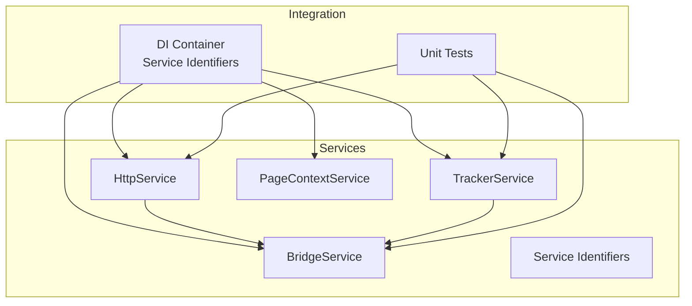
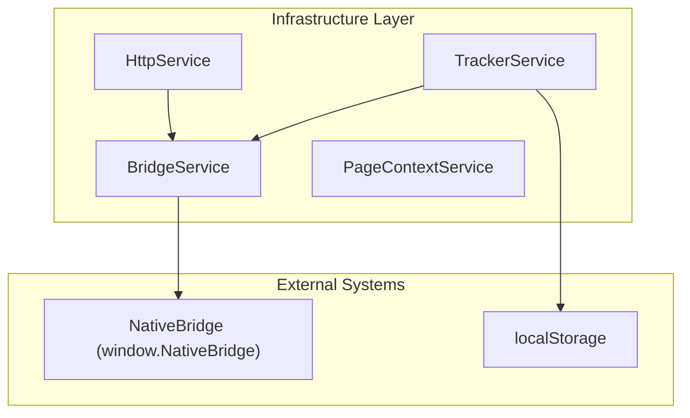
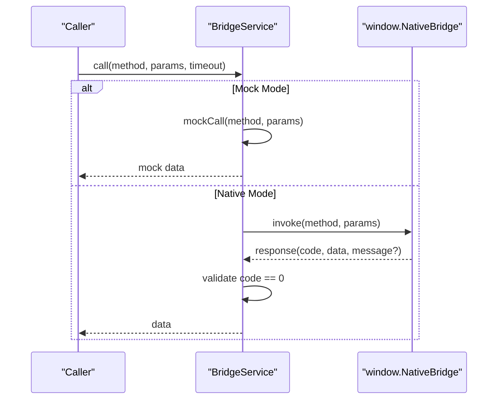
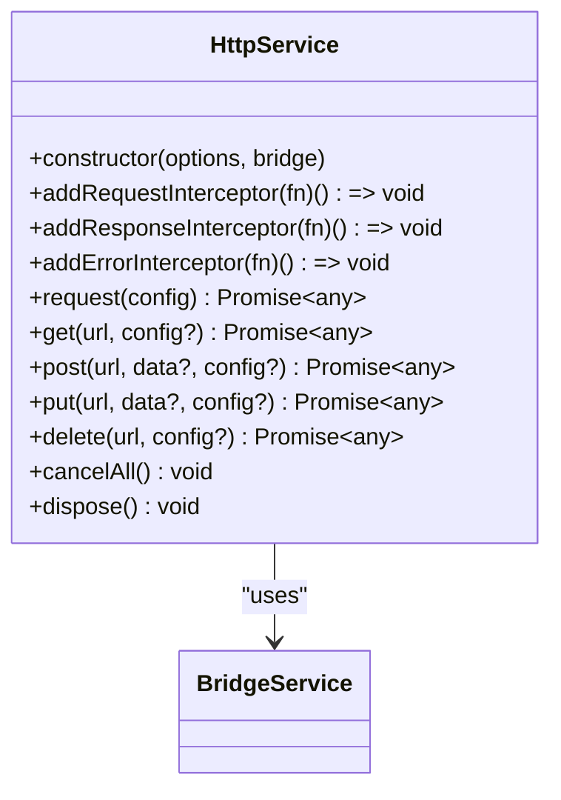
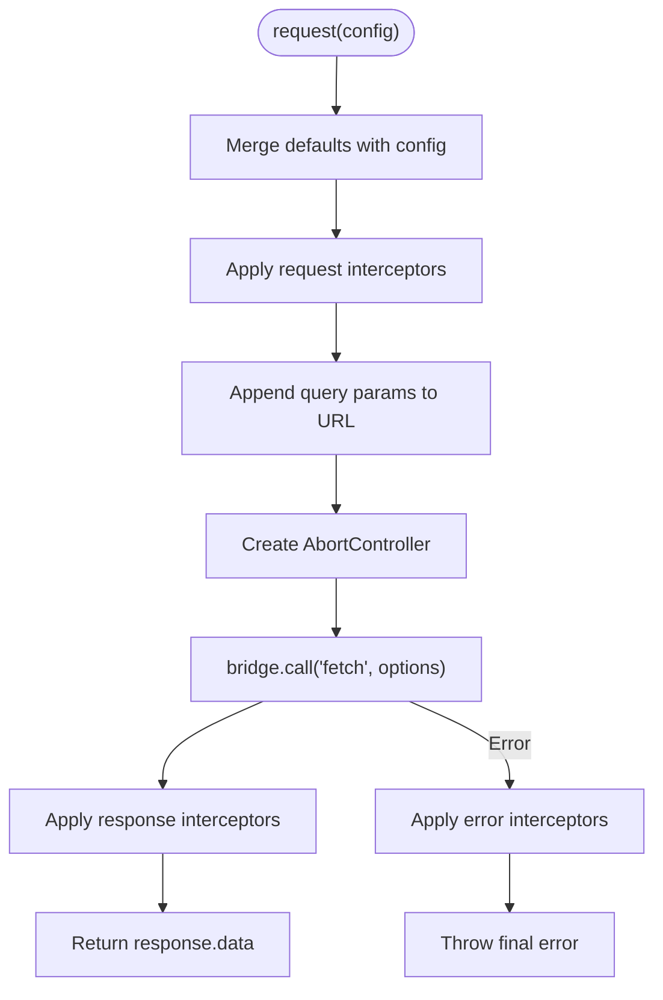
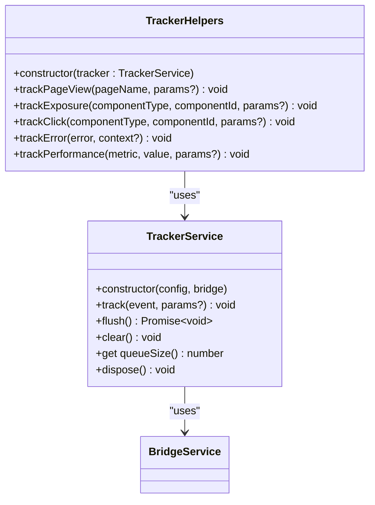
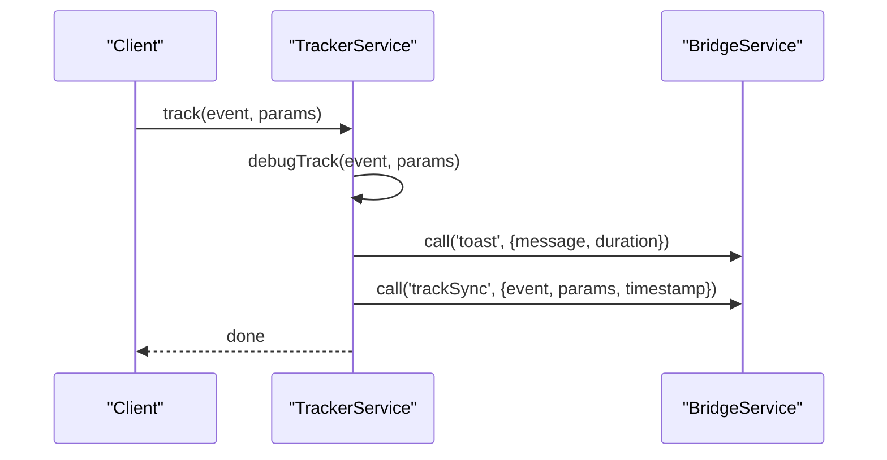
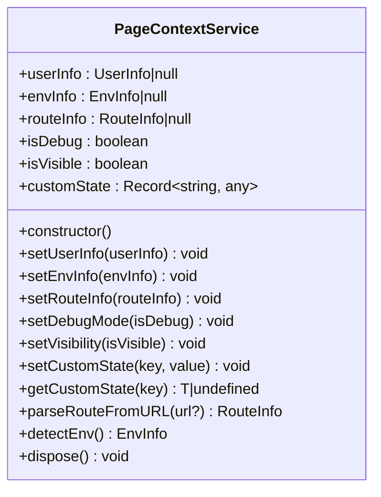
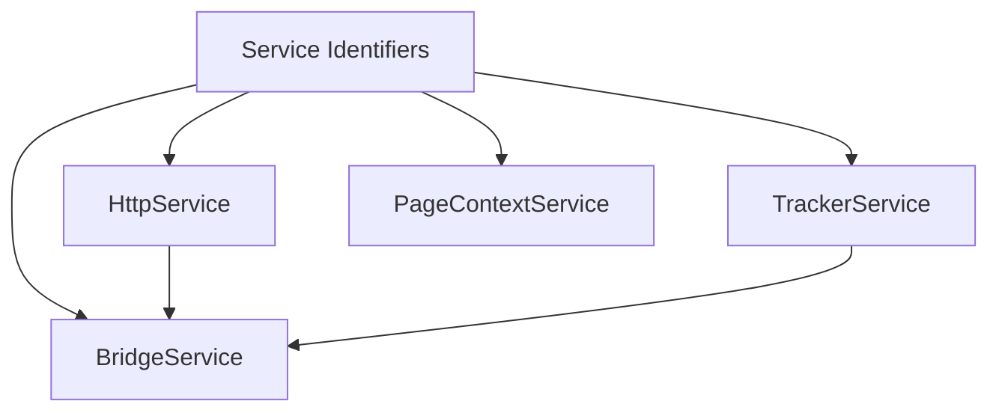

# Infrastructure Layer

<cite>
**Referenced Files in This Document**
- [bridge.service.ts](file://packages/h5-builder/src/services/bridge.service.ts)
- [http.service.ts](file://packages/h5-builder/src/services/http.service.ts)
- [tracker.service.ts](file://packages/h5-builder/src/services/tracker.service.ts)
- [context.service.ts](file://packages/h5-builder/src/services/context.service.ts)
- [service-identifiers.ts](file://packages/h5-builder/src/services/service-identifiers.ts)
- [index.ts](file://packages/h5-builder/src/services/index.ts)
- [bridge.service.test.ts](file://packages/h5-builder/src/__tests__/bridge.service.test.ts)
- [http.service.test.ts](file://packages/h5-builder/src/__tests__/http.service.test.ts)
- [tracker.service.test.ts](file://packages/h5-builder/src/__tests__/tracker.service.test.ts)
- [api_reference.md](file://packages/h5-builder/docs/api_reference.md)
- [README.md](file://packages/h5-builder/README.md)
</cite>

## Table of Contents
1. [Introduction](#introduction)
2. [Project Structure](#project-structure)
3. [Core Components](#core-components)
4. [Architecture Overview](#architecture-overview)
5. [Detailed Component Analysis](#detailed-component-analysis)
6. [Dependency Analysis](#dependency-analysis)
7. [Performance Considerations](#performance-considerations)
8. [Troubleshooting Guide](#troubleshooting-guide)
9. [Conclusion](#conclusion)
10. [Appendices](#appendices)

## Introduction
This document provides comprehensive API documentation for the Infrastructure Layer of the H5 Builder Framework. It covers four essential services:
- BridgeService: Unified JSBridge invocation with native and mock modes, timeouts, and helper methods.
- HttpService: Network abstraction built on BridgeService, offering interceptors, cancellation, and convenience methods.
- TrackerService: Analytics event batching, persistence, and helper methods for common events.
- PageContextService: Application-wide reactive context for user, environment, routing, visibility, and custom state.

The documentation explains APIs, configuration options, integration patterns with external systems, error handling, security considerations, initialization, testing approaches, and common issues such as timeouts, bridge failures, and tracking consistency.

## Project Structure
The Infrastructure Layer resides under the services module and integrates with the broader framework’s DI and lifecycle management.



**Diagram sources**
- [index.ts](file://packages/h5-builder/src/services/index.ts#L1-L8)
- [service-identifiers.ts](file://packages/h5-builder/src/services/service-identifiers.ts#L1-L20)

**Section sources**
- [README.md](file://packages/h5-builder/README.md#L158-L185)
- [api_reference.md](file://packages/h5-builder/docs/api_reference.md#L276-L501)
- [index.ts](file://packages/h5-builder/src/services/index.ts#L1-L8)

## Core Components
This section summarizes the primary services and their responsibilities.

- BridgeService
  - Provides unified JSBridge invocation with native and mock modes.
  - Supports timeouts, error propagation, and helper methods for common native actions.
  - Exposes setMockResponse and setMockResponses for browser-side development.

- HttpService
  - HTTP client abstraction over BridgeService.fetch.
  - Offers request/response/error interceptors, query parameter handling, cancellation, and convenience methods (GET/POST/PUT/DELETE).
  - Supports baseURL and token injection via interceptors.

- TrackerService
  - Event queueing with batching and periodic flushing.
  - Optional debug mode for immediate reporting and toast feedback.
  - Optional persistence to localStorage with restore/clear capabilities.
  - Helper methods for page views, exposures, clicks, errors, and performance metrics.

- PageContextService
  - Reactive application context: user info, environment info, route info, debug flag, visibility, and custom state.
  - Utility methods to parse routes from URLs and detect environment from UA.

**Section sources**
- [bridge.service.ts](file://packages/h5-builder/src/services/bridge.service.ts#L1-L227)
- [http.service.ts](file://packages/h5-builder/src/services/http.service.ts#L1-L281)
- [tracker.service.ts](file://packages/h5-builder/src/services/tracker.service.ts#L1-L290)
- [context.service.ts](file://packages/h5-builder/src/services/context.service.ts#L1-L187)

## Architecture Overview
The Infrastructure Layer forms the foundation for all integrations with native environments and analytics.



**Diagram sources**
- [bridge.service.ts](file://packages/h5-builder/src/services/bridge.service.ts#L1-L227)
- [http.service.ts](file://packages/h5-builder/src/services/http.service.ts#L1-L281)
- [tracker.service.ts](file://packages/h5-builder/src/services/tracker.service.ts#L1-L290)

## Detailed Component Analysis

### BridgeService
BridgeService encapsulates JSBridge invocation with two operational modes:
- Native mode: Uses window.NativeBridge.invoke with a configurable timeout and response code validation.
- Mock mode: Emulates responses for browser debugging and local development.

Key APIs and behaviors:
- Constructor
  - Parameters: isDebug (boolean)
  - Behavior: Enables mock mode when window.NativeBridge is unavailable or when isDebug is true; sets up default mock responses.

- Methods
  - call(method, params?, timeout?): Promise<T>
    - Invokes native or mock depending on mode.
    - Throws on timeout or non-zero response code.
  - setMockResponse(method, data): void
  - setMockResponses(map): void
  - dispose(): void
    - Clears mock responses.

- Helpers
  - BridgeHelpers: getUserInfo(), toast(), navigate(), share(), fetch()
    - Convenience wrappers delegating to BridgeService.call.

- Configuration and defaults
  - Timeout default: 5000 ms.
  - Mock responses include getUserInfo, toast, navigate, share, and fetch.

- Integration patterns
  - Used by HttpService for network requests via fetch().
  - Used by TrackerService for debug toast and sync tracking.

- Error handling
  - Timeout via Promise.race.
  - Non-zero response code throws with message.
  - Errors logged and rethrown.

- Security considerations
  - In native mode, ensure window.NativeBridge is present and trusted.
  - Avoid exposing sensitive data in mock responses.

- Testing approaches
  - Mock mode tests validate response shaping and interceptor behavior.
  - Native mode tests validate error propagation and timeout behavior.

**Section sources**
- [bridge.service.ts](file://packages/h5-builder/src/services/bridge.service.ts#L1-L227)
- [bridge.service.test.ts](file://packages/h5-builder/src/__tests__/bridge.service.test.ts#L1-L132)

#### BridgeService Class Diagram
```mermaid
classDiagram
class BridgeService {
+constructor(isDebug=false)
+call(method, params={}, timeout=5000) Promise~any~
+setMockResponse(method, data) void
+setMockResponses(map) void
+dispose() void
}
class BridgeHelpers {
+constructor(bridge : BridgeService)
+getUserInfo() Promise~UserInfo~
+toast(message, duration?) Promise~void~
+navigate(url, params?) Promise~void~
+share(options) Promise~void~
+fetch(options) Promise~any~
}
BridgeHelpers --> BridgeService : "uses"
```

**Diagram sources**
- [bridge.service.ts](file://packages/h5-builder/src/services/bridge.service.ts#L1-L227)

#### BridgeService Sequence: call() with timeout


**Diagram sources**
- [bridge.service.ts](file://packages/h5-builder/src/services/bridge.service.ts#L55-L118)

### HttpService
HttpService builds on BridgeService to provide a robust HTTP client with interceptors and cancellation.

Key APIs and behaviors:
- Constructor
  - Parameters: options (baseURL?, token?), bridge (IBridgeService)
  - Adds baseURL interceptor if configured.
  - Adds Authorization header interceptor if token provided.
  - Registers a default error interceptor logging failures.

- Methods
  - addRequestInterceptor(fn): () => void
  - addResponseInterceptor(fn): () => void
  - addErrorInterceptor(fn): () => void
  - request(config): Promise<T>
    - Merges defaults with provided config.
    - Applies request interceptors.
    - Appends query params to URL.
    - Creates AbortController for cancellation.
    - Calls bridge.call('fetch', ...) with serialized body.
    - Applies response interceptors.
    - Returns response.data.
  - get/post/put/delete(url, payload?, config?): Promise<T>
  - cancelAll(): void
  - dispose(): void
    - Cancels pending requests.
    - Clears interceptors.
    - Disposes internal resources.

- Configuration and defaults
  - Default method: GET.
  - Default timeout: 10000 ms.
  - Default Content-Type: application/json.

- Integration patterns
  - Delegates to BridgeService.call('fetch').
  - Works with TrackerService via DI (see Dependency Analysis).

- Error handling
  - Executes error interceptors on thrown errors.
  - Propagates final error after interceptor chain.

- Security considerations
  - Token injection via Authorization header interceptor.
  - Avoid leaking secrets; keep tokens secure.

- Testing approaches
  - Unit tests validate interceptors, query param appending, baseURL behavior, and cancellation.

**Section sources**
- [http.service.ts](file://packages/h5-builder/src/services/http.service.ts#L1-L281)
- [http.service.test.ts](file://packages/h5-builder/src/__tests__/http.service.test.ts#L1-L252)

#### HttpService Class Diagram


**Diagram sources**
- [http.service.ts](file://packages/h5-builder/src/services/http.service.ts#L1-L281)
- [bridge.service.ts](file://packages/h5-builder/src/services/bridge.service.ts#L1-L227)

#### HttpService Flowchart: request()


**Diagram sources**
- [http.service.ts](file://packages/h5-builder/src/services/http.service.ts#L147-L203)

### TrackerService
TrackerService manages analytics event reporting with batching, persistence, and helpers.

Key APIs and behaviors:
- Constructor
  - Parameters: config (TrackerConfig), bridge (IBridgeService)
  - Defaults: debug=false, maxBatchSize=20, flushInterval=5000, enablePersistence=false, storageKey='h5_builder_tracker_queue'
  - Restores queue from localStorage if enabled.
  - Registers beforeunload handler to flush remaining events.

- Methods
  - track(event, params?): void
    - In debug mode: sends toast and sync event immediately.
    - In production mode: enqueues event and schedules flush.
  - flush(): Promise<void>
    - Sends up to maxBatchSize queued events.
    - On success, persists queue; on failure, re-enqueues and persists.
  - clear(): void
    - Empties queue and removes persisted data.
  - queueSize: number (getter)
  - dispose(): void
    - Clears flush timer, flushes remaining events, disposes resources.

- Persistence
  - save/load via localStorage with storageKey.
  - Restore on construction; clear on demand.

- Helpers
  - TrackerHelpers: trackPageView(), trackExposure(), trackClick(), trackError(), trackPerformance()

- Integration patterns
  - Uses BridgeService.call('trackBatch', 'trackSync', 'toast').

- Error handling
  - Logs flush failures.
  - Retries by re-enqueuing failed batch.

- Security considerations
  - Avoid including PII in tracked params; sanitize before enqueue.

- Testing approaches
  - Unit tests validate batching, intervals, persistence, error handling, and helpers.

**Section sources**
- [tracker.service.ts](file://packages/h5-builder/src/services/tracker.service.ts#L1-L290)
- [tracker.service.test.ts](file://packages/h5-builder/src/__tests__/tracker.service.test.ts#L1-L226)

#### TrackerService Class Diagram


**Diagram sources**
- [tracker.service.ts](file://packages/h5-builder/src/services/tracker.service.ts#L1-L290)
- [bridge.service.ts](file://packages/h5-builder/src/services/bridge.service.ts#L1-L227)

#### TrackerService Sequence: track() in debug mode


**Diagram sources**
- [tracker.service.ts](file://packages/h5-builder/src/services/tracker.service.ts#L87-L110)
- [bridge.service.ts](file://packages/h5-builder/src/services/bridge.service.ts#L1-L227)

### PageContextService
PageContextService provides reactive application context for user, environment, routing, visibility, and custom state.

Key APIs and behaviors:
- Properties
  - userInfo: UserInfo | null
  - envInfo: EnvInfo | null
  - routeInfo: RouteInfo | null
  - isDebug: boolean
  - isVisible: boolean
  - customState: Record<string, any>

- Methods
  - setUserInfo(userInfo): void
  - setEnvInfo(envInfo): void
  - setRouteInfo(routeInfo): void
  - setDebugMode(isDebug): void
  - setVisibility(isVisible): void
  - setCustomState(key, value): void
  - getCustomState(key): T | undefined
  - parseRouteFromURL(url?): RouteInfo
  - detectEnv(): EnvInfo
  - dispose(): void
    - Clears userInfo and routeInfo.

- Integration patterns
  - Used across components for shared state and UI decisions.
  - Combined with TrackerService for context-aware analytics.

- Error handling
  - Minimal; relies on observable state updates.

- Security considerations
  - Avoid storing sensitive data in customState.
  - Ensure route parsing handles malformed URLs gracefully.

**Section sources**
- [context.service.ts](file://packages/h5-builder/src/services/context.service.ts#L1-L187)

#### PageContextService Class Diagram


**Diagram sources**
- [context.service.ts](file://packages/h5-builder/src/services/context.service.ts#L1-L187)

## Dependency Analysis
This section maps how services depend on each other and how DI identifiers are used.



- Service Identifiers
  - IBridgeService, IHttpService, ITrackerService, IPageContextService are created via decorators for DI resolution.

- Coupling and Cohesion
  - HttpService and TrackerService both depend on BridgeService, enabling centralized native communication.
  - PageContextService is independent and reactive, suitable for cross-cutting concerns.

- External Dependencies
  - window.NativeBridge for native integration.
  - localStorage for persistence in TrackerService.

**Diagram sources**
- [service-identifiers.ts](file://packages/h5-builder/src/services/service-identifiers.ts#L1-L20)
- [http.service.ts](file://packages/h5-builder/src/services/http.service.ts#L1-L281)
- [tracker.service.ts](file://packages/h5-builder/src/services/tracker.service.ts#L1-L290)
- [bridge.service.ts](file://packages/h5-builder/src/services/bridge.service.ts#L1-L227)

**Section sources**
- [service-identifiers.ts](file://packages/h5-builder/src/services/service-identifiers.ts#L1-L20)
- [index.ts](file://packages/h5-builder/src/services/index.ts#L1-L8)

## Performance Considerations
- BridgeService
  - Use appropriate timeout values to balance responsiveness and reliability.
  - Prefer mock mode during development to avoid real native latency.

- HttpService
  - Use request interceptors to attach tokens and headers efficiently.
  - Cancel long-running requests with cancelAll() to prevent resource waste.
  - Avoid excessive serialization of large bodies; consider streaming if needed.

- TrackerService
  - Tune maxBatchSize and flushInterval to balance latency and throughput.
  - Disable persistence in memory-constrained environments or when not needed.
  - Use helpers to minimize redundant event creation.

- PageContextService
  - Keep customState minimal; avoid heavy objects to reduce observable overhead.

[No sources needed since this section provides general guidance]

## Troubleshooting Guide
Common issues and resolutions:

- Network timeouts
  - Symptom: HttpService.request rejects with timeout.
  - Resolution: Increase timeout in request config or globally via defaultConfig; verify native bridge availability.

- Bridge communication failures
  - Symptom: BridgeService.throw error indicating missing NativeBridge or non-zero response code.
  - Resolution: Ensure window.NativeBridge is initialized; validate response codes; use mock mode for debugging.

- Tracking data consistency
  - Symptom: Lost events after reload.
  - Resolution: Enable persistence and storageKey; verify localStorage availability; use clear() to reset state when necessary.

- Unhandled errors
  - Symptom: Errors not surfaced.
  - Resolution: Add error interceptors to capture and log failures; ensure interceptors return or rethrow appropriately.

- Resource leaks
  - Symptom: Timers or pending requests remain after component unmount.
  - Resolution: Call HttpService.cancelAll() and TrackerService.dispose(); ensure PageContextService.dispose() clears state.

**Section sources**
- [http.service.ts](file://packages/h5-builder/src/services/http.service.ts#L147-L203)
- [bridge.service.ts](file://packages/h5-builder/src/services/bridge.service.ts#L55-L118)
- [tracker.service.ts](file://packages/h5-builder/src/services/tracker.service.ts#L144-L171)
- [context.service.ts](file://packages/h5-builder/src/services/context.service.ts#L130-L137)

## Conclusion
The Infrastructure Layer provides a cohesive set of services for native communication, HTTP networking, analytics, and application context. By leveraging DI, interceptors, batching, and persistence, these services enable scalable and maintainable H5 applications. Proper configuration, error handling, and testing practices ensure reliable operation across environments.

[No sources needed since this section summarizes without analyzing specific files]

## Appendices

### API Reference Highlights
- BridgeService
  - call(method, params?, timeout?): Promise<T>
  - setMockResponse(method, data): void
  - setMockResponses(map): void
  - Helpers: getUserInfo(), toast(), navigate(), share(), fetch()

- HttpService
  - request(config): Promise<T>
  - get/post/put/delete(url, payload?, config?): Promise<T>
  - addRequestInterceptor(fn): () => void
  - addResponseInterceptor(fn): () => void
  - addErrorInterceptor(fn): () => void
  - cancelAll(): void
  - dispose(): void

- TrackerService
  - track(event, params?): void
  - flush(): Promise<void>
  - clear(): void
  - queueSize: number
  - Helpers: trackPageView(), trackExposure(), trackClick(), trackError(), trackPerformance()

- PageContextService
  - setUserInfo(), setEnvInfo(), setRouteInfo(), setDebugMode(), setVisibility(), setCustomState(), getCustomState()
  - parseRouteFromURL(url?): RouteInfo
  - detectEnv(): EnvInfo
  - dispose(): void

**Section sources**
- [api_reference.md](file://packages/h5-builder/docs/api_reference.md#L276-L501)