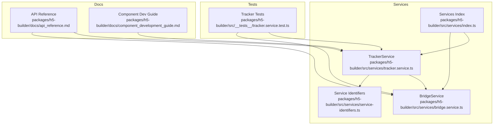
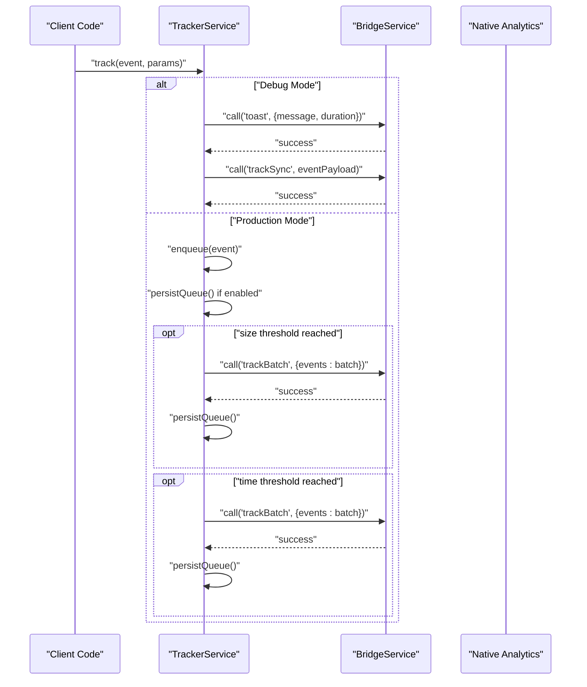
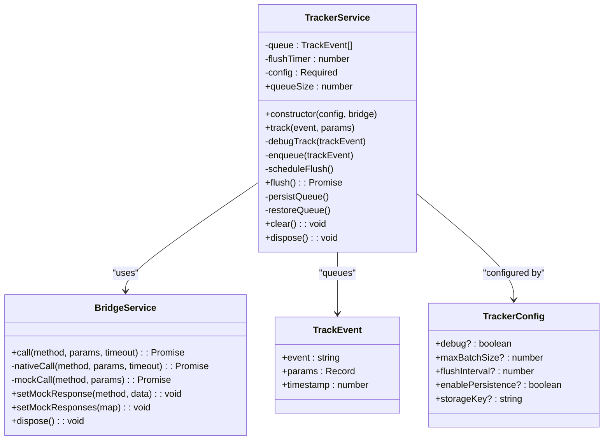
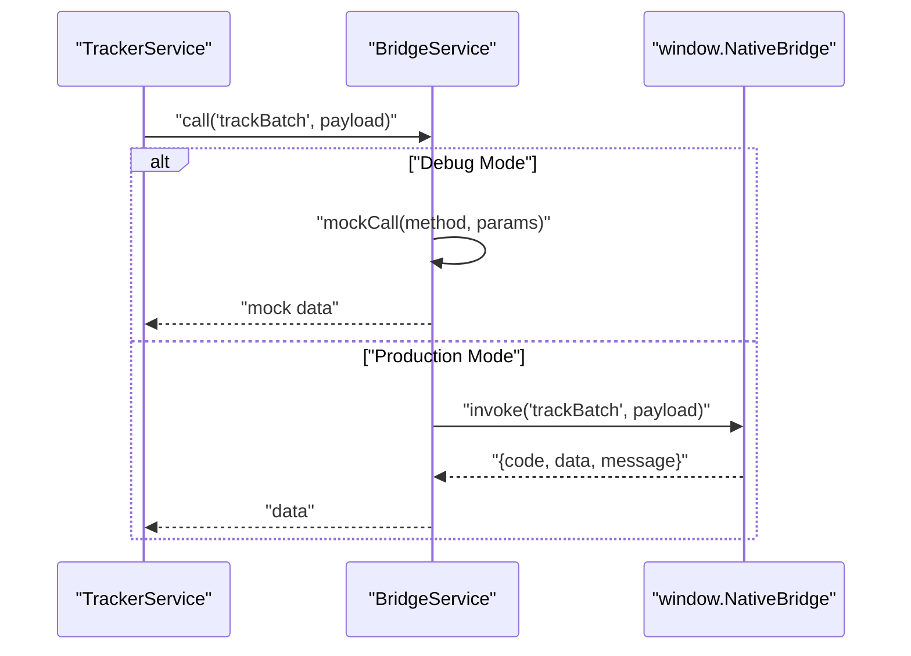
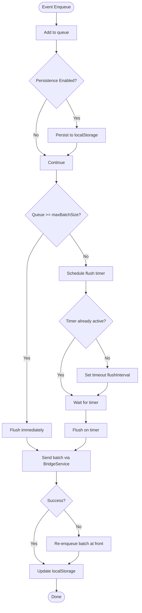
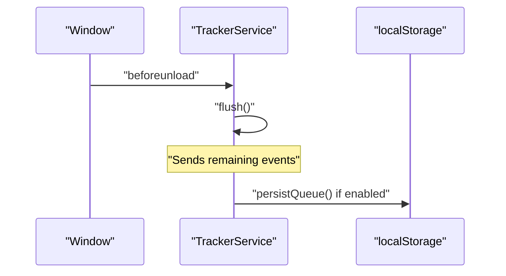
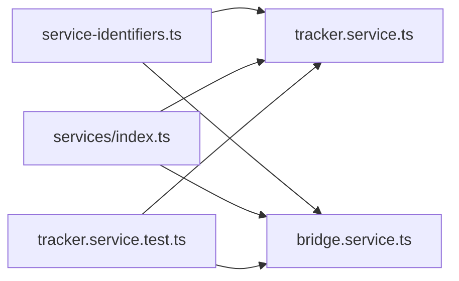

# Tracker Service

<cite>
**Referenced Files in This Document**
- [tracker.service.ts](file://packages/h5-builder/src/services/tracker.service.ts)
- [bridge.service.ts](file://packages/h5-builder/src/services/bridge.service.ts)
- [service-identifiers.ts](file://packages/h5-builder/src/services/service-identifiers.ts)
- [index.ts](file://packages/h5-builder/src/services/index.ts)
- [tracker.service.test.ts](file://packages/h5-builder/src/__tests__/tracker.service.test.ts)
- [api_reference.md](file://packages/h5-builder/docs/api_reference.md)
- [component_development_guide.md](file://packages/h5-builder/docs/component_development_guide.md)
- [product-card.model.ts](file://packages/h5-builder/src/components/product-card/product-card.model.ts)
</cite>

## Table of Contents
1. [Introduction](#introduction)
2. [Project Structure](#project-structure)
3. [Core Components](#core-components)
4. [Architecture Overview](#architecture-overview)
5. [Detailed Component Analysis](#detailed-component-analysis)
6. [Dependency Analysis](#dependency-analysis)
7. [Performance Considerations](#performance-considerations)
8. [Troubleshooting Guide](#troubleshooting-guide)
9. [Conclusion](#conclusion)
10. [Appendices](#appendices)

## Introduction
This document explains the TrackerService in the H5 Builder Framework, focusing on its event tracking system that supports both immediate and batched reporting. It covers the TrackEvent interface, configuration options (debug mode, batch size, flush interval, localStorage persistence), the track method, and its integration with BridgeService for native analytics. It also describes the queue-based architecture with automatic flushing based on size and time thresholds, the persistence mechanism that survives page reloads, and the beforeunload handler for final event submission. Finally, it documents the TrackerHelpers utility class with specialized methods for page views, component exposure, clicks, errors, and performance metrics, along with examples, debugging techniques, and considerations for data consistency, failure recovery, and privacy.

## Project Structure
The TrackerService resides in the services layer alongside BridgeService and is exported via the services index. It integrates with the dependency injection system via service identifiers.

**Diagram sources**
- [tracker.service.ts](file://packages/h5-builder/src/services/tracker.service.ts#L1-L290)
- [bridge.service.ts](file://packages/h5-builder/src/services/bridge.service.ts#L1-L227)
- [service-identifiers.ts](file://packages/h5-builder/src/services/service-identifiers.ts#L1-L20)
- [index.ts](file://packages/h5-builder/src/services/index.ts#L1-L6)
- [tracker.service.test.ts](file://packages/h5-builder/src/__tests__/tracker.service.test.ts#L1-L225)
- [api_reference.md](file://packages/h5-builder/docs/api_reference.md#L400-L460)
- [component_development_guide.md](file://packages/h5-builder/docs/component_development_guide.md#L30-L103)

**Section sources**
- [tracker.service.ts](file://packages/h5-builder/src/services/tracker.service.ts#L1-L290)
- [bridge.service.ts](file://packages/h5-builder/src/services/bridge.service.ts#L1-L227)
- [service-identifiers.ts](file://packages/h5-builder/src/services/service-identifiers.ts#L1-L20)
- [index.ts](file://packages/h5-builder/src/services/index.ts#L1-L6)
- [tracker.service.test.ts](file://packages/h5-builder/src/__tests__/tracker.service.test.ts#L1-L225)
- [api_reference.md](file://packages/h5-builder/docs/api_reference.md#L400-L460)
- [component_development_guide.md](file://packages/h5-builder/docs/component_development_guide.md#L30-L103)

## Core Components
- TrackEvent: Defines the shape of tracked events with event name, parameters, and timestamp.
- TrackerConfig: Configuration interface for TrackerService including debug mode, batch size, flush interval, persistence toggle, and storage key.
- TrackerService: Implements event queuing, batching, scheduling, persistence, and integration with BridgeService for native analytics.
- TrackerHelpers: Utility class providing convenience methods for common event types (page view, exposure, click, error, performance).

**Section sources**
- [tracker.service.ts](file://packages/h5-builder/src/services/tracker.service.ts#L8-L28)
- [tracker.service.ts](file://packages/h5-builder/src/services/tracker.service.ts#L17-L28)
- [tracker.service.ts](file://packages/h5-builder/src/services/tracker.service.ts#L34-L228)
- [tracker.service.ts](file://packages/h5-builder/src/services/tracker.service.ts#L233-L289)

## Architecture Overview
The TrackerService orchestrates event tracking with two modes:
- Immediate mode (debug): Events are sent synchronously via BridgeService and optionally surfaced via a toast notification.
- Batched mode (production): Events are enqueued and flushed either when the queue reaches maxBatchSize or when flushInterval elapses. Persistence is supported via localStorage.

**Diagram sources**
- [tracker.service.ts](file://packages/h5-builder/src/services/tracker.service.ts#L71-L171)
- [bridge.service.ts](file://packages/h5-builder/src/services/bridge.service.ts#L55-L101)

**Section sources**
- [tracker.service.ts](file://packages/h5-builder/src/services/tracker.service.ts#L71-L171)
- [bridge.service.ts](file://packages/h5-builder/src/services/bridge.service.ts#L55-L101)

## Detailed Component Analysis

### TrackerService
- Responsibilities:
  - Enforce configuration defaults for debug, batch size, flush interval, persistence, and storage key.
  - Queue events and persist them to localStorage when enabled.
  - Schedule flushes based on size or time thresholds.
  - Send batches to native analytics via BridgeService.
  - Handle failures by re-enqueuing and updating persistence.
  - Ensure final flush on page unload and resource disposal.

- Key behaviors:
  - Debug mode: Immediately sends via toast and sync track, then calls native trackSync.
  - Production mode: Adds to queue, persists if enabled, schedules flush, and flushes batches up to maxBatchSize.
  - Persistence: On enqueue and flush success/failure, updates localStorage; restores on initialization.
  - Lifecycle: beforeunload handler triggers flush; dispose clears timers and flushes remaining events.

**Diagram sources**
- [tracker.service.ts](file://packages/h5-builder/src/services/tracker.service.ts#L8-L28)
- [tracker.service.ts](file://packages/h5-builder/src/services/tracker.service.ts#L17-L28)
- [tracker.service.ts](file://packages/h5-builder/src/services/tracker.service.ts#L34-L228)
- [bridge.service.ts](file://packages/h5-builder/src/services/bridge.service.ts#L55-L101)

**Section sources**
- [tracker.service.ts](file://packages/h5-builder/src/services/tracker.service.ts#L34-L228)

### BridgeService Integration
- Provides unified invocation to native analytics via window.NativeBridge in production or mock responses in debug mode.
- Implements timeouts and response validation to surface errors consistently.
- Used by TrackerService to send batched events and debug actions.

**Diagram sources**
- [bridge.service.ts](file://packages/h5-builder/src/services/bridge.service.ts#L55-L101)
- [tracker.service.ts](file://packages/h5-builder/src/services/tracker.service.ts#L144-L155)

**Section sources**
- [bridge.service.ts](file://packages/h5-builder/src/services/bridge.service.ts#L55-L101)
- [tracker.service.ts](file://packages/h5-builder/src/services/tracker.service.ts#L144-L155)

### Queue-Based Architecture and Automatic Flushing
- Size-based flush: When queue length reaches maxBatchSize, flush is triggered immediately.
- Time-based flush: A single flush timer is scheduled; subsequent enqueues do not reschedule if a timer is already active.
- Failure recovery: On flush failure, the batch is re-enqueued at the front of the queue; persistence is updated accordingly.

**Diagram sources**
- [tracker.service.ts](file://packages/h5-builder/src/services/tracker.service.ts#L110-L171)

**Section sources**
- [tracker.service.ts](file://packages/h5-builder/src/services/tracker.service.ts#L110-L171)

### Persistence Mechanism and Beforeunload Handler
- Persistence: Queue is serialized to and restored from localStorage using the configured storageKey. Restoration occurs during construction when persistence is enabled.
- Beforeunload: A listener ensures remaining events are flushed before the page unloads.
- Disposal: Clears timers and performs a final flush to release resources cleanly.

**Diagram sources**
- [tracker.service.ts](file://packages/h5-builder/src/services/tracker.service.ts#L58-L66)
- [tracker.service.ts](file://packages/h5-builder/src/services/tracker.service.ts#L173-L182)
- [tracker.service.ts](file://packages/h5-builder/src/services/tracker.service.ts#L184-L197)
- [tracker.service.ts](file://packages/h5-builder/src/services/tracker.service.ts#L216-L228)

**Section sources**
- [tracker.service.ts](file://packages/h5-builder/src/services/tracker.service.ts#L58-L66)
- [tracker.service.ts](file://packages/h5-builder/src/services/tracker.service.ts#L173-L197)
- [tracker.service.ts](file://packages/h5-builder/src/services/tracker.service.ts#L216-L228)

### TrackerHelpers Utility Class
Provides convenience methods that wrap TrackerService.track with standardized event names and parameter shapes:
- trackPageView: Standardized PAGE_VIEW event with pageName and optional params.
- trackExposure: Standardized COMPONENT_EXPOSURE event with componentType and componentId.
- trackClick: Standardized CLICK event with componentType and componentId.
- trackError: Standardized ERROR event with message and stack, plus optional context.
- trackPerformance: Standardized PERFORMANCE event with metric and value.

These methods simplify consistent event tracking across components.

**Section sources**
- [tracker.service.ts](file://packages/h5-builder/src/services/tracker.service.ts#L233-L289)

## Dependency Analysis
- TrackerService depends on BridgeService for native analytics calls and on service identifiers for DI registration.
- Service exports expose TrackerService and BridgeService for consumption by other modules.
- Tests validate behavior for batching, persistence, error handling, and disposal.

**Diagram sources**
- [service-identifiers.ts](file://packages/h5-builder/src/services/service-identifiers.ts#L1-L20)
- [index.ts](file://packages/h5-builder/src/services/index.ts#L1-L6)
- [tracker.service.test.ts](file://packages/h5-builder/src/__tests__/tracker.service.test.ts#L1-L225)

**Section sources**
- [service-identifiers.ts](file://packages/h5-builder/src/services/service-identifiers.ts#L1-L20)
- [index.ts](file://packages/h5-builder/src/services/index.ts#L1-L6)
- [tracker.service.test.ts](file://packages/h5-builder/src/__tests__/tracker.service.test.ts#L1-L225)

## Performance Considerations
- Batch size and flush interval: Tune maxBatchSize and flushInterval to balance latency and throughput. Larger batches reduce network overhead but increase client-side memory and potential loss risk.
- Debug mode: Avoid enabling debug mode in production; it increases overhead and blocks UI briefly due to toast and synchronous calls.
- Persistence: Frequent localStorage writes can impact performance. Consider disabling persistence for high-frequency telemetry or using larger batch sizes.
- Timeout handling: BridgeService enforces timeouts; ensure native analytics can handle batch sizes efficiently to prevent repeated failures.

[No sources needed since this section provides general guidance]

## Troubleshooting Guide
- Debugging:
  - Enable debug mode to observe immediate synchronous sends and toast notifications.
  - Use BridgeService mock responses for local testing without native bridge availability.
- Common issues:
  - Network failures during flush cause re-enqueue and retry; verify native analytics availability and response codes.
  - Excessive queue growth indicates slow flush or frequent events; adjust batch size and interval.
  - Persistence failures: Inspect localStorage quota and parsing errors; ensure storageKey uniqueness if sharing storage across pages.
- Verifying behavior:
  - Use tests as references for expected behavior around batching, persistence, and disposal.

**Section sources**
- [tracker.service.test.ts](file://packages/h5-builder/src/__tests__/tracker.service.test.ts#L1-L225)
- [bridge.service.ts](file://packages/h5-builder/src/services/bridge.service.ts#L55-L101)

## Conclusion
The TrackerService provides a robust, configurable event tracking system tailored for H5 Builder. It supports immediate and batched reporting, integrates seamlessly with BridgeService, and offers persistence and lifecycle safeguards. The TrackerHelpers class simplifies common event patterns. By tuning configuration and leveraging tests and debugging techniques, teams can achieve reliable, privacy-conscious analytics with strong failure recovery.

[No sources needed since this section summarizes without analyzing specific files]

## Appendices

### Configuration Options
- debug: Enables immediate synchronous sending and toast notifications.
- maxBatchSize: Maximum number of events to flush in a single batch.
- flushInterval: Milliseconds to wait before flushing queued events.
- enablePersistence: Whether to persist the queue to localStorage.
- storageKey: localStorage key used for persistence.

**Section sources**
- [tracker.service.ts](file://packages/h5-builder/src/services/tracker.service.ts#L17-L28)
- [api_reference.md](file://packages/h5-builder/docs/api_reference.md#L412-L419)

### Example Usage
- Basic tracking:
  - See API reference example for track usage.
- Component integration:
  - Product card model demonstrates exposure and click tracking in component lifecycle hooks.
- Helpers usage:
  - TrackerHelpers methods provide standardized event names and parameters.

**Section sources**
- [api_reference.md](file://packages/h5-builder/docs/api_reference.md#L424-L438)
- [product-card.model.ts](file://packages/h5-builder/src/components/product-card/product-card.model.ts#L49-L59)
- [tracker.service.ts](file://packages/h5-builder/src/services/tracker.service.ts#L233-L289)

### Privacy and Data Consistency Notes
- Privacy:
  - Avoid logging sensitive personal data; sanitize parameters before tracking.
  - Respect user preferences and platform policies; consider opt-out mechanisms.
- Data consistency:
  - Batch failures trigger re-enqueue; ensure downstream systems tolerate duplicates.
  - Persistence helps survive reloads; validate queue restoration and handle malformed entries gracefully.

[No sources needed since this section provides general guidance]