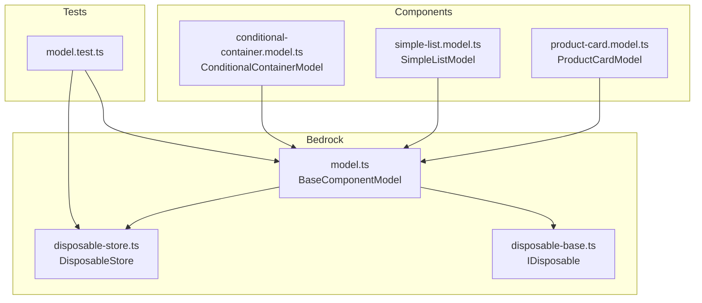
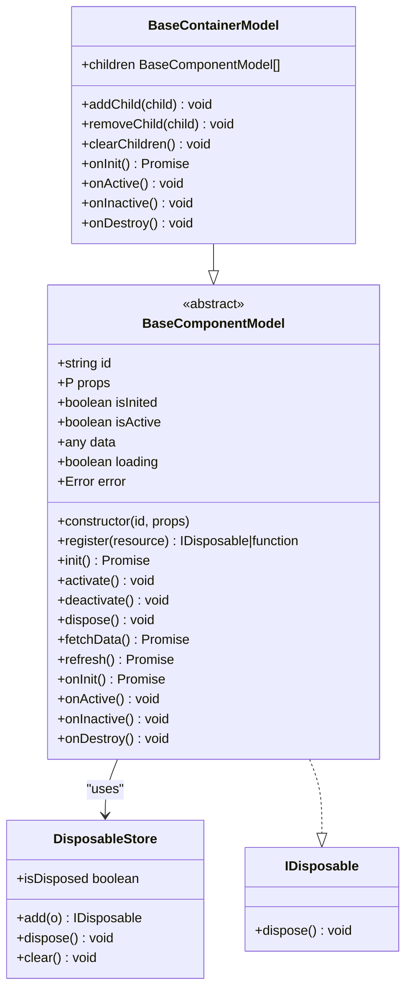
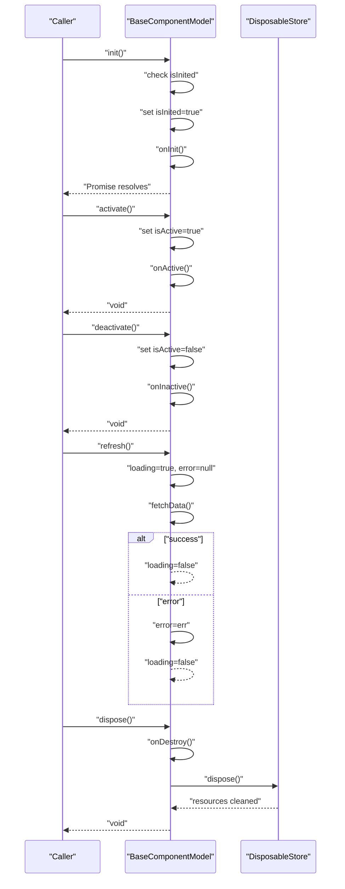
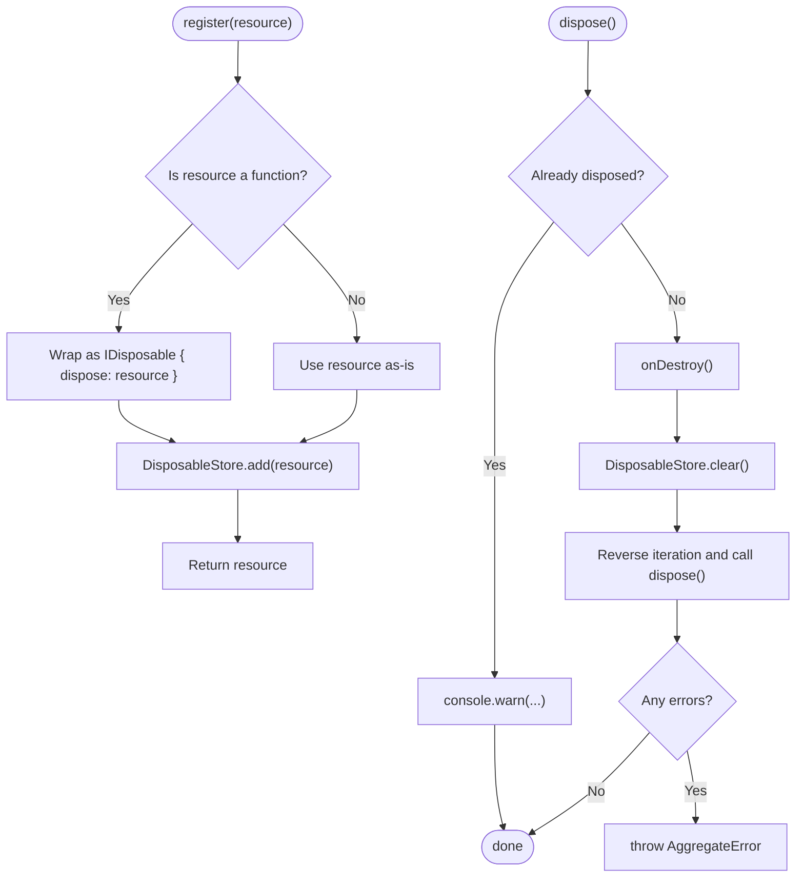
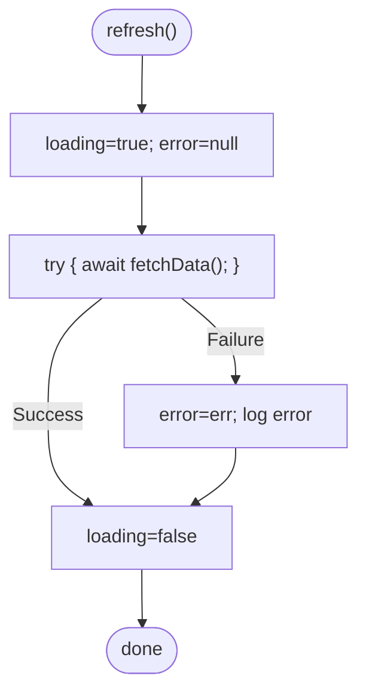
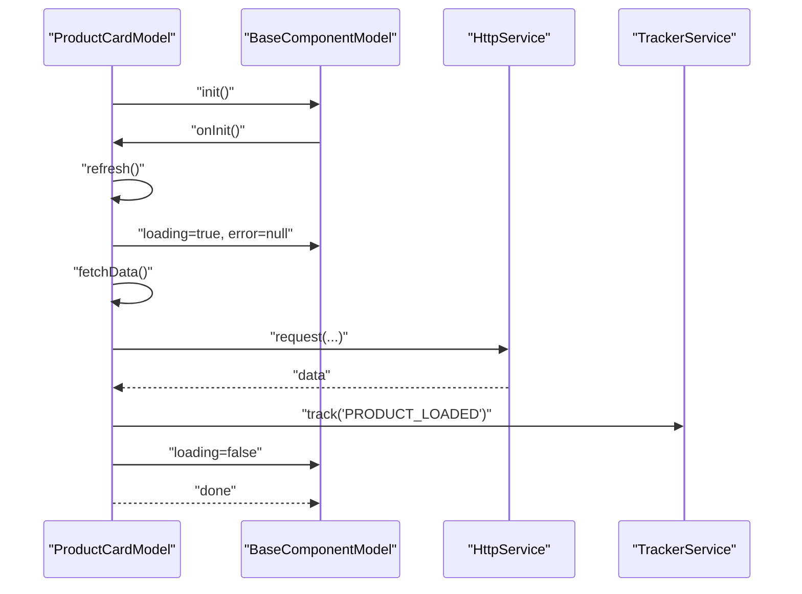
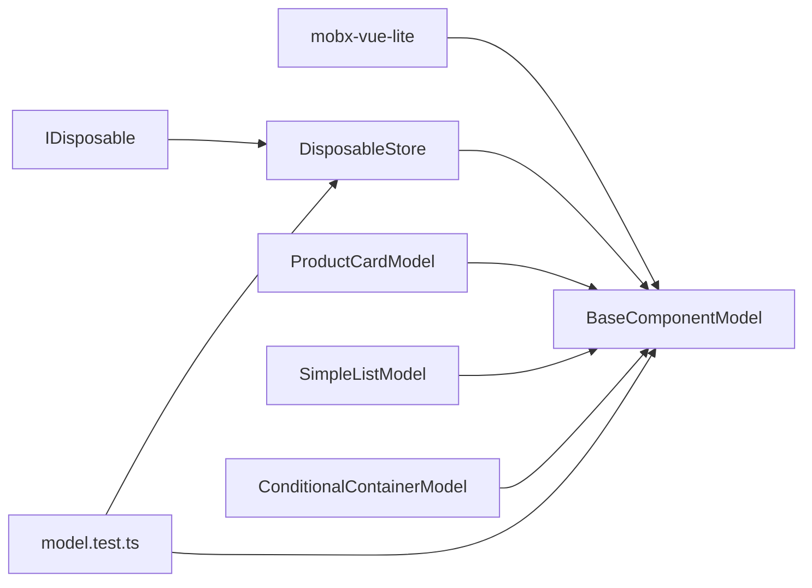

# BaseComponentModel

<cite>
**Referenced Files in This Document**
- [model.ts](file://packages/h5-builder/src/bedrock/model.ts)
- [disposable-store.ts](file://packages/h5-builder/src/bedrock/dispose/disposable-store.ts)
- [disposable-base.ts](file://packages/h5-builder/src/bedrock/dispose/dispose-base.ts)
- [product-card.model.ts](file://packages/h5-builder/src/components/product-card/product-card.model.ts)
- [simple-list.model.ts](file://packages/h5-builder/src/components/simple-list/simple-list.model.ts)
- [conditional-container.model.ts](file://packages/h5-builder/src/components/conditional-container/conditional-container.model.ts)
- [model.test.ts](file://packages/h5-builder/src/__tests__/model.test.ts)
- [api_reference.md](file://packages/h5-builder/docs/api_reference.md)
</cite>

## Table of Contents
1. [Introduction](#introduction)
2. [Project Structure](#project-structure)
3. [Core Components](#core-components)
4. [Architecture Overview](#architecture-overview)
5. [Detailed Component Analysis](#detailed-component-analysis)
6. [Dependency Analysis](#dependency-analysis)
7. [Performance Considerations](#performance-considerations)
8. [Troubleshooting Guide](#troubleshooting-guide)
9. [Conclusion](#conclusion)
10. [Appendices](#appendices)

## Introduction
BaseComponentModel is the foundational class for all component models in the H5 Builder Framework. It enforces a strict Model-View separation by encapsulating business logic, state management, and lifecycle handling independently from UI concerns. It provides:
- A reactive state surface (isInited, isActive, data, loading, error) powered by mobx-vue-lite.
- Lifecycle orchestration: init, activate, deactivate, dispose.
- An abstract onInit hook for subclass initialization and optional onActive/onInactive/onDestroy hooks for activation/deactivation/cleanup.
- Automatic resource management via register and DisposableStore.
- Data fetching primitives (fetchData and refresh) with built-in error handling and loading state.

This document explains how BaseComponentModel fits into the framework’s architecture, how to implement it correctly, and how to avoid common pitfalls.

## Project Structure
BaseComponentModel resides in the kernel layer of the H5 Builder Framework under the bedrock module. It is complemented by:
- DisposableStore and IDisposable for robust resource lifecycle management.
- Example implementations in components such as ProductCardModel and ConditionalContainerModel.
- Tests validating lifecycle correctness and resource disposal ordering.

**Diagram sources**
- [model.ts](file://packages/h5-builder/src/bedrock/model.ts#L1-L154)
- [disposable-store.ts](file://packages/h5-builder/src/bedrock/dispose/disposable-store.ts#L1-L84)
- [disposable-base.ts](file://packages/h5-builder/src/bedrock/dispose/disposable-base.ts#L1-L10)
- [product-card.model.ts](file://packages/h5-builder/src/components/product-card/product-card.model.ts#L1-L133)
- [simple-list.model.ts](file://packages/h5-builder/src/components/simple-list/simple-list.model.ts#L1-L16)
- [conditional-container.model.ts](file://packages/h5-builder/src/components/conditional-container/conditional-container.model.ts#L1-L86)
- [model.test.ts](file://packages/h5-builder/src/__tests__/model.test.ts#L1-L231)

**Section sources**
- [model.ts](file://packages/h5-builder/src/bedrock/model.ts#L1-L154)
- [disposable-store.ts](file://packages/h5-builder/src/bedrock/dispose/disposable-store.ts#L1-L84)
- [disposable-base.ts](file://packages/h5-builder/src/bedrock/dispose/disposable-base.ts#L1-L10)
- [product-card.model.ts](file://packages/h5-builder/src/components/product-card/product-card.model.ts#L1-L133)
- [simple-list.model.ts](file://packages/h5-builder/src/components/simple-list/simple-list.model.ts#L1-L16)
- [conditional-container.model.ts](file://packages/h5-builder/src/components/conditional-container/conditional-container.model.ts#L1-L86)
- [model.test.ts](file://packages/h5-builder/src/__tests__/model.test.ts#L1-L231)

## Core Components
- BaseComponentModel: The base class for all component models. Provides reactive state, lifecycle methods, and resource registration.
- BaseContainerModel: Extends BaseComponentModel to manage collections of child models with automatic lifecycle propagation.
- DisposableStore: Centralized resource registry with LIFO disposal semantics.
- IDisposable: Contract for disposable resources.

Key responsibilities:
- Reactive state: isInited, isActive, data, loading, error.
- Lifecycle: init -> onInit, activate -> onActive, deactivate -> onInactive, dispose -> onDestroy + resource cleanup.
- Resource management: register(resource) and automatic disposal via DisposableStore.
- Data management: fetchData (subclass hook) and refresh (wraps loading/error handling).

**Section sources**
- [model.ts](file://packages/h5-builder/src/bedrock/model.ts#L1-L154)
- [disposable-store.ts](file://packages/h5-builder/src/bedrock/dispose/disposable-store.ts#L1-L84)
- [disposable-base.ts](file://packages/h5-builder/src/bedrock/dispose/disposable-base.ts#L1-L10)

## Architecture Overview
BaseComponentModel sits at the kernel layer, enabling a clean separation between models and views. Subclasses implement business logic while the base class handles lifecycle and resource management. Container models coordinate child lifecycles automatically.

**Diagram sources**
- [model.ts](file://packages/h5-builder/src/bedrock/model.ts#L1-L154)
- [model.ts](file://packages/h5-builder/src/bedrock/model.ts#L157-L243)
- [disposable-store.ts](file://packages/h5-builder/src/bedrock/dispose/disposable-store.ts#L1-L84)
- [disposable-base.ts](file://packages/h5-builder/src/bedrock/dispose/disposable-base.ts#L1-L10)

## Detailed Component Analysis

### BaseComponentModel Lifecycle and Hooks
- Constructor: Accepts id and props; makes the instance reactive via mobx-vue-lite.
- init: Ensures onInit runs once and sets isInited. Calls onInit().
- activate: Sets isActive and calls onActive().
- deactivate: Clears isActive and calls onInactive().
- dispose: Calls onDestroy() and disposes all registered resources via DisposableStore.
- onInit: Abstract hook for subclass initialization (must return Promise).
- onActive/onInactive/onDestroy: Optional hooks for activation/deactivation/cleanup.
- register: Registers IDisposable instances or cleanup functions into DisposableStore.
- fetchData/refresh: Subclass hook for data loading; refresh manages loading/error states.

**Diagram sources**
- [model.ts](file://packages/h5-builder/src/bedrock/model.ts#L63-L121)
- [model.ts](file://packages/h5-builder/src/bedrock/model.ts#L123-L154)
- [disposable-store.ts](file://packages/h5-builder/src/bedrock/dispose/disposable-store.ts#L20-L58)

**Section sources**
- [model.ts](file://packages/h5-builder/src/bedrock/model.ts#L22-L154)
- [model.test.ts](file://packages/h5-builder/src/__tests__/model.test.ts#L44-L111)

### Resource Registration and Cleanup
- register accepts either an IDisposable object or a cleanup function and adds it to DisposableStore.
- DisposableStore disposes resources in LIFO order and throws an AggregateError if any disposal fails.
- Tests demonstrate that register ensures cleanup occurs during dispose and that order is preserved.

**Diagram sources**
- [model.ts](file://packages/h5-builder/src/bedrock/model.ts#L36-L58)
- [disposable-store.ts](file://packages/h5-builder/src/bedrock/dispose/disposable-store.ts#L20-L82)
- [disposable-base.ts](file://packages/h5-builder/src/bedrock/dispose/disposable-base.ts#L1-L10)

**Section sources**
- [model.ts](file://packages/h5-builder/src/bedrock/model.ts#L36-L58)
- [disposable-store.ts](file://packages/h5-builder/src/bedrock/dispose/disposable-store.ts#L20-L82)
- [model.test.ts](file://packages/h5-builder/src/__tests__/model.test.ts#L113-L164)

### Reactive State and Data Management
- Reactive state: isInited, isActive, data, loading, error are exposed as public properties.
- refresh toggles loading and clears error before calling fetchData; on error, error is captured and logged.
- Subclasses commonly override fetchData to implement network requests or data preparation.

**Diagram sources**
- [model.ts](file://packages/h5-builder/src/bedrock/model.ts#L109-L121)

**Section sources**
- [model.ts](file://packages/h5-builder/src/bedrock/model.ts#L18-L21)
- [model.ts](file://packages/h5-builder/src/bedrock/model.ts#L102-L121)

### Example Implementations
- ProductCardModel: Demonstrates onInit delegating to refresh, onActive reporting exposure events, and fetchData simulating asynchronous data loading and error handling.
- SimpleListModel: Extends BaseContainerModel without overriding lifecycle methods; relies on automatic propagation to children.
- ConditionalContainerModel: Extends BaseContainerModel to conditionally initialize/activate/deactivate children based on props.

**Diagram sources**
- [product-card.model.ts](file://packages/h5-builder/src/components/product-card/product-card.model.ts#L42-L101)
- [model.ts](file://packages/h5-builder/src/bedrock/model.ts#L102-L121)

**Section sources**
- [product-card.model.ts](file://packages/h5-builder/src/components/product-card/product-card.model.ts#L29-L133)
- [simple-list.model.ts](file://packages/h5-builder/src/components/simple-list/simple-list.model.ts#L1-L16)
- [conditional-container.model.ts](file://packages/h5-builder/src/components/conditional-container/conditional-container.model.ts#L21-L86)

## Dependency Analysis
- BaseComponentModel depends on:
  - mobx-vue-lite for reactivity.
  - DisposableStore for resource lifecycle management.
  - IDisposable contract for typed disposal.
- Subclasses depend on infrastructure services (e.g., HttpService, TrackerService) injected via dependency injection.
- Tests validate lifecycle correctness and resource disposal order.

**Diagram sources**
- [model.ts](file://packages/h5-builder/src/bedrock/model.ts#L1-L154)
- [disposable-store.ts](file://packages/h5-builder/src/bedrock/dispose/disposable-store.ts#L1-L84)
- [disposable-base.ts](file://packages/h5-builder/src/bedrock/dispose/disposable-base.ts#L1-L10)
- [product-card.model.ts](file://packages/h5-builder/src/components/product-card/product-card.model.ts#L1-L133)
- [simple-list.model.ts](file://packages/h5-builder/src/components/simple-list/simple-list.model.ts#L1-L16)
- [conditional-container.model.ts](file://packages/h5-builder/src/components/conditional-container/conditional-container.model.ts#L1-L86)
- [model.test.ts](file://packages/h5-builder/src/__tests__/model.test.ts#L1-L231)

**Section sources**
- [model.ts](file://packages/h5-builder/src/bedrock/model.ts#L1-L154)
- [disposable-store.ts](file://packages/h5-builder/src/bedrock/dispose/disposable-store.ts#L1-L84)
- [disposable-base.ts](file://packages/h5-builder/src/bedrock/dispose/disposable-base.ts#L1-L10)
- [model.test.ts](file://packages/h5-builder/src/__tests__/model.test.ts#L1-L231)

## Performance Considerations
- Use refresh for data operations to leverage built-in loading/error state management.
- Prefer lightweight cleanup functions in register to minimize disposal overhead.
- Avoid heavy synchronous work in onInit; delegate to asynchronous tasks to keep UI responsive.
- For containers, consider lazy initialization of children to reduce startup cost.

## Troubleshooting Guide
Common issues and resolutions:
- Duplicate initialization: BaseComponentModel prevents repeated init by checking isInited. If you see warnings, ensure you do not call init multiple times unintentionally.
- Memory leaks from unregistered resources: Always wrap timers, subscriptions, and external listeners with register to ensure cleanup.
- Proper error handling in asynchronous operations: Use refresh to centralize error capture and logging; handle exceptions inside fetchData and set error state accordingly.
- Activation/deactivation mismatches: Verify isActive transitions and ensure onActive/onInactive are idempotent.

Evidence from tests:
- Initialization guard and warning on repeated init.
- Activation/deactivation toggling and idempotency.
- Resource registration and LIFO disposal order.
- Timer cleanup verification.

**Section sources**
- [model.ts](file://packages/h5-builder/src/bedrock/model.ts#L63-L97)
- [model.test.ts](file://packages/h5-builder/src/__tests__/model.test.ts#L51-L111)
- [model.test.ts](file://packages/h5-builder/src/__tests__/model.test.ts#L113-L164)

## Conclusion
BaseComponentModel provides a robust, reactive foundation for component models in the H5 Builder Framework. By separating business logic and lifecycle from UI concerns, it enables predictable state management, safe resource handling, and scalable component composition. Following the guidelines here ensures correct implementation of lifecycle hooks, proper resource registration, and resilient data operations.

## Appendices

### API Reference Highlights
- Constructor: id and props define the model identity and configuration.
- Lifecycle: init, activate, deactivate, dispose.
- Hooks: onInit (required), onActive, onInactive, onDestroy (optional).
- Utilities: register for resource management.
- Data: fetchData (subclass hook), refresh (with loading/error handling).

**Section sources**
- [api_reference.md](file://packages/h5-builder/docs/api_reference.md#L156-L238)