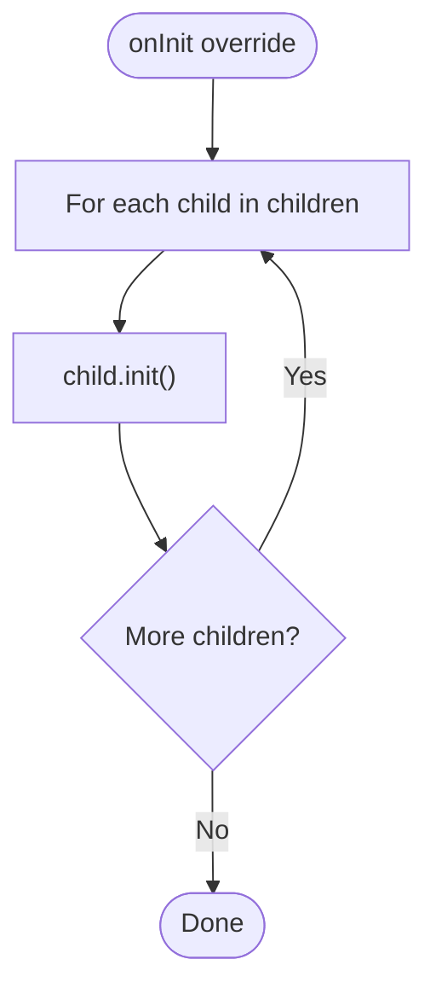

# BaseContainerModel

<cite>
**Referenced Files in This Document**
- [model.ts](file://packages/h5-builder/src/bedrock/model.ts)
- [disposable-store.ts](file://packages/h5-builder/src/bedrock/dispose/disposable-store.ts)
- [disposable-utils.ts](file://packages/h5-builder/src/bedrock/dispose/disposable-utils.ts)
- [disposable-base.ts](file://packages/h5-builder/src/bedrock/dispose/dispose-base.ts)
- [tabs-container.model.ts](file://packages/h5-builder/src/components/tabs-container/tabs-container.model.ts)
- [grid-layout-container.model.ts](file://packages/h5-builder/src/components/grid-layout-container/grid-layout-container.model.ts)
- [conditional-container.model.ts](file://packages/h5-builder/src/components/conditional-container/conditional-container.model.ts)
- [virtual-list.model.ts](file://packages/h5-builder/src/components/virtual-list/virtual-list.model.ts)
- [README.md](file://packages/h5-builder/README.md)
</cite>

## Table of Contents
1. [Introduction](#introduction)
2. [Project Structure](#project-structure)
3. [Core Components](#core-components)
4. [Architecture Overview](#architecture-overview)
5. [Detailed Component Analysis](#detailed-component-analysis)
6. [Dependency Analysis](#dependency-analysis)
7. [Performance Considerations](#performance-considerations)
8. [Troubleshooting Guide](#troubleshooting-guide)
9. [Conclusion](#conclusion)
10. [Appendices](#appendices)

## Introduction
This document explains the BaseContainerModel class, which extends BaseComponentModel to provide container functionality for managing child components in the H5 Builder Framework. It focuses on how BaseContainerModel implements the composite pattern to serve as a parent for other component models, coordinates their lifecycle, and ensures automatic cleanup. It also documents the children property, child management methods, and overridden lifecycle hooks, with concrete examples from TabsContainerModel and GridLayoutContainerModel.

## Project Structure
The BaseContainerModel resides in the kernel layer alongside the BaseComponentModel and the disposable resource management system. Container components such as TabsContainerModel and GridLayoutContainerModel inherit from it to gain standardized child lifecycle orchestration.

**Diagram sources**
- [model.ts](file://packages/h5-builder/src/bedrock/model.ts#L158-L243)
- [tabs-container.model.ts](file://packages/h5-builder/src/components/tabs-container/tabs-container.model.ts#L1-L273)
- [grid-layout-container.model.ts](file://packages/h5-builder/src/components/grid-layout-container/grid-layout-container.model.ts#L1-L44)
- [conditional-container.model.ts](file://packages/h5-builder/src/components/conditional-container/conditional-container.model.ts#L1-L86)
- [virtual-list.model.ts](file://packages/h5-builder/src/components/virtual-list/virtual-list.model.ts#L1-L217)

**Section sources**
- [model.ts](file://packages/h5-builder/src/bedrock/model.ts#L158-L243)
- [README.md](file://packages/h5-builder/README.md#L188-L202)

## Core Components
- BaseComponentModel: Provides the foundational lifecycle (init, activate, deactivate, dispose) and resource registration via a DisposableStore.
- BaseContainerModel: Extends BaseComponentModel to manage a collection of child BaseComponentModel instances, coordinating their lifecycle and ensuring automatic cleanup.
- Container subclasses: Examples include TabsContainerModel, GridLayoutContainerModel, and ConditionalContainerModel, which customize lifecycle behavior while leveraging BaseContainerModel’s defaults.

Key responsibilities:
- Maintain a children array of child component models.
- Add/remove/clear children with automatic resource registration and disposal.
- Override lifecycle hooks to coordinate child initialization, activation, and deactivation.
- Delegate destruction to the parent implementation, relying on the DisposableStore to dispose registered children.

**Section sources**
- [model.ts](file://packages/h5-builder/src/bedrock/model.ts#L158-L243)

## Architecture Overview
BaseContainerModel participates in a composite pattern where it aggregates child models and forwards lifecycle events. The parent class’s register method ensures that when the container is destroyed, all children are automatically disposed.

**Diagram sources**
- [model.ts](file://packages/h5-builder/src/bedrock/model.ts#L1-L157)
- [model.ts](file://packages/h5-builder/src/bedrock/model.ts#L158-L243)
- [tabs-container.model.ts](file://packages/h5-builder/src/components/tabs-container/tabs-container.model.ts#L1-L273)
- [grid-layout-container.model.ts](file://packages/h5-builder/src/components/grid-layout-container/grid-layout-container.model.ts#L1-L44)
- [conditional-container.model.ts](file://packages/h5-builder/src/components/conditional-container/conditional-container.model.ts#L1-L86)
- [virtual-list.model.ts](file://packages/h5-builder/src/components/virtual-list/virtual-list.model.ts#L1-L217)

## Detailed Component Analysis

### BaseContainerModel: Composite Pattern and Lifecycle Coordination
- Composite pattern role:
  - Acts as a parent for child BaseComponentModel instances.
  - Coordinates lifecycle across all children consistently.
- Children property:
  - An array of child models managed by the container.
- Child management methods:
  - addChild(child): Adds a child and registers it for automatic disposal via the parent’s register mechanism.
  - removeChild(child): Removes a child from the array and calls child.dispose().
  - clearChildren(): Disposes all children and resets the array.
- Overridden lifecycle hooks:
  - onInit: Initializes all children in parallel using Promise.all.
  - onActive: Activates all children.
  - onInactive: Deactivates all children.
  - onDestroy: Delegates to the parent implementation; children are automatically disposed because they were registered during addChild.

**Diagram sources**
- [model.ts](file://packages/h5-builder/src/bedrock/model.ts#L158-L243)
- [disposable-store.ts](file://packages/h5-builder/src/bedrock/dispose/disposable-store.ts#L1-L84)

**Section sources**
- [model.ts](file://packages/h5-builder/src/bedrock/model.ts#L158-L243)

### Example: TabsContainerModel
- Purpose: Manages multiple tabs, enabling lazy loading and optional virtual scrolling optimization.
- Customization:
  - Overrides onInit to initialize only the active tab initially and schedules pre-warming for others.
  - Uses register to clean up virtual lists created for tabs.
  - Switches tabs by deactivating the old tab and activating the new one.
- Demonstrates:
  - How to override lifecycle methods while still calling super when appropriate.
  - How to selectively initialize children to avoid unnecessary work.

**Diagram sources**
- [tabs-container.model.ts](file://packages/h5-builder/src/components/tabs-container/tabs-container.model.ts#L58-L96)
- [tabs-container.model.ts](file://packages/h5-builder/src/components/tabs-container/tabs-container.model.ts#L169-L203)
- [virtual-list.model.ts](file://packages/h5-builder/src/components/virtual-list/virtual-list.model.ts#L1-L217)

**Section sources**
- [tabs-container.model.ts](file://packages/h5-builder/src/components/tabs-container/tabs-container.model.ts#L1-L273)

### Example: GridLayoutContainerModel
- Purpose: Arranges child components in a grid layout.
- Behavior:
  - Overrides onInit/onActive/onInactive to initialize/activate/deactivate all children sequentially.
  - Demonstrates customization of lifecycle behavior while keeping the same children array.

**Diagram sources**
- [grid-layout-container.model.ts](file://packages/h5-builder/src/components/grid-layout-container/grid-layout-container.model.ts#L25-L30)

**Section sources**
- [grid-layout-container.model.ts](file://packages/h5-builder/src/components/grid-layout-container/grid-layout-container.model.ts#L1-L44)

### Example: ConditionalContainerModel
- Purpose: Conditionally renders children based on props.
- Behavior:
  - Evaluates a condition in onInit and initializes children only if the condition is met.
  - Activates/deactivates children only when shouldRender is true.

**Diagram sources**
- [conditional-container.model.ts](file://packages/h5-builder/src/components/conditional-container/conditional-container.model.ts#L29-L39)

**Section sources**
- [conditional-container.model.ts](file://packages/h5-builder/src/components/conditional-container/conditional-container.model.ts#L1-L86)

## Dependency Analysis
- BaseContainerModel depends on BaseComponentModel for lifecycle and resource management.
- The register mechanism relies on DisposableStore to track and dispose resources.
- Container subclasses depend on BaseContainerModel’s lifecycle orchestration and may introduce additional dependencies (e.g., VirtualListModel in TabsContainerModel).

**Diagram sources**
- [model.ts](file://packages/h5-builder/src/bedrock/model.ts#L1-L157)
- [disposable-store.ts](file://packages/h5-builder/src/bedrock/dispose/disposable-store.ts#L1-L84)
- [disposable-utils.ts](file://packages/h5-builder/src/bedrock/dispose/disposable-utils.ts#L1-L29)
- [disposable-base.ts](file://packages/h5-builder/src/bedrock/dispose/dispose-base.ts#L1-L10)

**Section sources**
- [model.ts](file://packages/h5-builder/src/bedrock/model.ts#L1-L157)
- [disposable-store.ts](file://packages/h5-builder/src/bedrock/dispose/disposable-store.ts#L1-L84)
- [disposable-utils.ts](file://packages/h5-builder/src/bedrock/dispose/disposable-utils.ts#L1-L29)
- [disposable-base.ts](file://packages/h5-builder/src/bedrock/dispose/dispose-base.ts#L1-L10)

## Performance Considerations
- Parallel initialization: BaseContainerModel’s onInit uses Promise.all to initialize all children concurrently, reducing startup latency when children are independent.
- Selective activation: Containers like ConditionalContainerModel only activate children when needed, saving resources.
- Lazy loading: TabsContainerModel avoids initializing inactive tabs until switched to, improving perceived performance.
- Virtual scrolling: TabsContainerModel can wrap child containers with VirtualListModel to optimize rendering for large child sets.

[No sources needed since this section provides general guidance]

## Troubleshooting Guide
Common issues and resolutions:
- Maintaining proper parent-child disposal relationships:
  - Ensure addChild is used to add children so they are registered for disposal. Removing a child via removeChild triggers child.dispose(), preventing leaks.
- Avoiding memory leaks in dynamic child management:
  - Always call clearChildren when removing all children to dispose them and reset the array.
  - Use register to attach cleanup for any additional resources created by the container (e.g., virtual lists).
- Customizing lifecycle behavior:
  - Override onInit/onActive/onInactive in subclasses to implement custom logic (e.g., lazy loading, selective activation).
  - When overriding, call super methods appropriately to preserve default coordination across children.
- Error isolation:
  - BaseComponentModel’s refresh and lifecycle methods isolate errors and prevent cascading failures across siblings.

**Section sources**
- [model.ts](file://packages/h5-builder/src/bedrock/model.ts#L158-L243)
- [disposable-store.ts](file://packages/h5-builder/src/bedrock/dispose/disposable-store.ts#L1-L84)
- [tabs-container.model.ts](file://packages/h5-builder/src/components/tabs-container/tabs-container.model.ts#L130-L152)

## Conclusion
BaseContainerModel provides a robust foundation for container components in the H5 Builder Framework. By centralizing child lifecycle management and leveraging the DisposableStore for automatic cleanup, it enables safe, scalable composition of component hierarchies. Subclasses demonstrate how to override lifecycle hooks to tailor behavior—such as lazy loading, conditional rendering, and virtual scrolling—while preserving the composite pattern guarantees.

[No sources needed since this section summarizes without analyzing specific files]

## Appendices

### API Reference: BaseContainerModel
- Properties
  - children: Array of child BaseComponentModel instances.
- Methods
  - addChild(child): Adds a child and registers it for disposal.
  - removeChild(child): Removes a child and disposes it.
  - clearChildren(): Disposes all children and clears the array.
  - onInit(): Initializes all children in parallel.
  - onActive(): Activates all children.
  - onInactive(): Deactivates all children.
  - onDestroy(): Delegates to parent; children are disposed automatically.

**Section sources**
- [model.ts](file://packages/h5-builder/src/bedrock/model.ts#L158-L243)