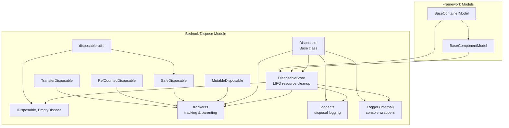
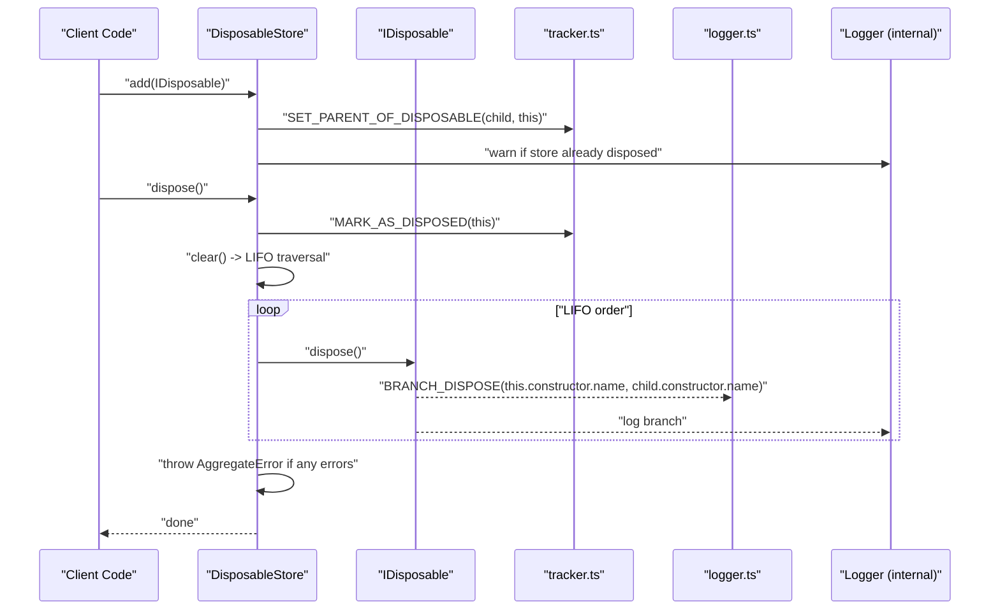
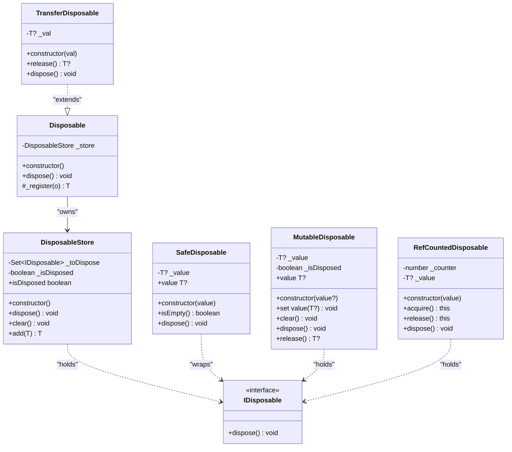
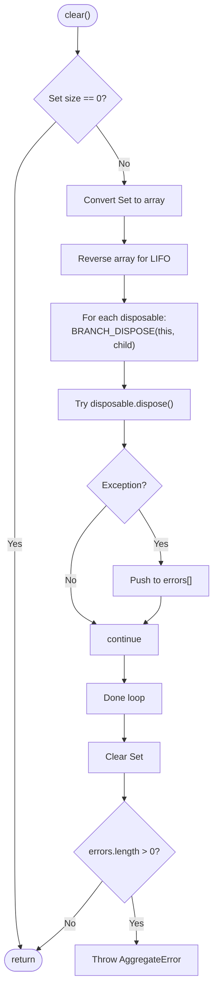
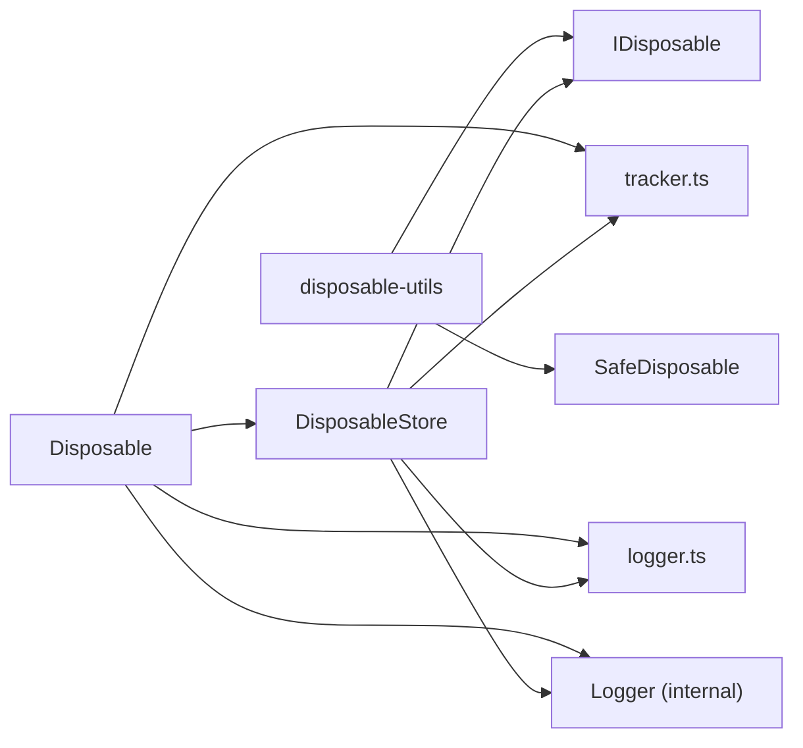

# DisposableStore

<cite>
**Referenced Files in This Document**
- [disposable-store.ts](file://packages/h5-builder/src/bedrock/dispose/disposable-store.ts)
- [disposable-t.ts](file://packages/h5-builder/src/bedrock/dispose/disposable-t.ts)
- [disposable-utils.ts](file://packages/h5-builder/src/bedrock/dispose/disposable-utils.ts)
- [dispose-base.ts](file://packages/h5-builder/src/bedrock/dispose/dispose-base.ts)
- [tracker.ts](file://packages/h5-builder/src/bedrock/dispose/tracker.ts)
- [logger.ts](file://packages/h5-builder/src/bedrock/dispose/logger.ts)
- [logger.ts](file://packages/h5-builder/src/bedrock/_internal/logger.ts)
- [model.ts](file://packages/h5-builder/src/bedrock/model.ts)
- [timer.ts](file://packages/h5-builder/src/bedrock/dispose/timer.ts)
- [disposable-store.test.ts](file://packages/h5-builder/src/bedrock/dispose/disposable-store.test.ts)
- [model.test.ts](file://packages/h5-builder/src/__tests__/model.test.ts)
</cite>

## Table of Contents
1. [Introduction](#introduction)
2. [Project Structure](#project-structure)
3. [Core Components](#core-components)
4. [Architecture Overview](#architecture-overview)
5. [Detailed Component Analysis](#detailed-component-analysis)
6. [Dependency Analysis](#dependency-analysis)
7. [Performance Considerations](#performance-considerations)
8. [Troubleshooting Guide](#troubleshooting-guide)
9. [Conclusion](#conclusion)
10. [Appendices](#appendices)

## Introduction
This document provides comprehensive documentation for the DisposableStore class, the foundational resource management mechanism in the H5 Builder Framework. DisposableStore implements a Last-In-First-Out (LIFO) disposal system that ensures proper cleanup of event listeners, timers, subscriptions, and other resources. It prevents memory leaks by enforcing deterministic disposal ordering and aggregating errors encountered during cleanup into a single AggregateError.

Key goals:
- Explain the LIFO disposal semantics and error aggregation strategy.
- Detail the add method’s protections against self-registration and warnings for adding to disposed stores.
- Clarify the dispose method’s idempotency checks, LIFO traversal, and error collection behavior.
- Describe the clear method’s role and the internal Set-based storage of disposables.
- Demonstrate practical usage within BaseComponentModel and BaseContainerModel.
- Address common issues such as attempting to add disposables to disposed stores, handling disposal errors, and ensuring proper disposal chaining in component hierarchies.

## Project Structure
The DisposableStore resides in the bedrock/dispose module alongside related disposable utilities and base interfaces. It integrates with the broader framework through BaseComponentModel and BaseContainerModel, which orchestrate resource registration and disposal across component lifecycles.

**Diagram sources**
- [disposable-store.ts](file://packages/h5-builder/src/bedrock/dispose/disposable-store.ts#L1-L84)
- [disposable-t.ts](file://packages/h5-builder/src/bedrock/dispose/disposable-t.ts#L1-L239)
- [disposable-utils.ts](file://packages/h5-builder/src/bedrock/dispose/disposable-utils.ts#L1-L29)
- [dispose-base.ts](file://packages/h5-builder/src/bedrock/dispose/dispose-base.ts#L1-L10)
- [tracker.ts](file://packages/h5-builder/src/bedrock/dispose/tracker.ts#L1-L106)
- [logger.ts](file://packages/h5-builder/src/bedrock/dispose/logger.ts#L1-L40)
- [logger.ts](file://packages/h5-builder/src/bedrock/_internal/logger.ts#L1-L60)
- [model.ts](file://packages/h5-builder/src/bedrock/model.ts#L1-L243)

**Section sources**
- [disposable-store.ts](file://packages/h5-builder/src/bedrock/dispose/disposable-store.ts#L1-L84)
- [model.ts](file://packages/h5-builder/src/bedrock/model.ts#L1-L243)

## Core Components
- DisposableStore: Central LIFO resource registry and disposal engine.
- IDisposable: Minimal interface requiring a dispose method.
- Disposable: Base class that owns a DisposableStore and forwards disposal to it.
- Utility disposables: SafeDisposable, MutableDisposable, RefCountedDisposable, TransferDisposable.
- Tracking and logging: Parent-child relationship tracking and disposal branch logging.

**Section sources**
- [disposable-store.ts](file://packages/h5-builder/src/bedrock/dispose/disposable-store.ts#L1-L84)
- [disposable-t.ts](file://packages/h5-builder/src/bedrock/dispose/disposable-t.ts#L1-L239)
- [disposable-utils.ts](file://packages/h5-builder/src/bedrock/dispose/disposable-utils.ts#L1-L29)
- [dispose-base.ts](file://packages/h5-builder/src/bedrock/dispose/dispose-base.ts#L1-L10)
- [tracker.ts](file://packages/h5-builder/src/bedrock/dispose/tracker.ts#L1-L106)
- [logger.ts](file://packages/h5-builder/src/bedrock/dispose/logger.ts#L1-L40)

## Architecture Overview
DisposableStore coordinates resource lifecycle within the H5 Builder Framework. It maintains a Set of IDisposable instances, enforces LIFO disposal order, and aggregates errors into an AggregateError. It integrates with tracking and logging utilities to record disposal branches and detect potential leaks.

**Diagram sources**
- [disposable-store.ts](file://packages/h5-builder/src/bedrock/dispose/disposable-store.ts#L1-L84)
- [tracker.ts](file://packages/h5-builder/src/bedrock/dispose/tracker.ts#L82-L106)
- [logger.ts](file://packages/h5-builder/src/bedrock/dispose/logger.ts#L1-L40)
- [logger.ts](file://packages/h5-builder/src/bedrock/_internal/logger.ts#L1-L60)

## Detailed Component Analysis

### DisposableStore Implementation
DisposableStore is a minimal yet robust resource manager with the following characteristics:
- Internal Set storage: Maintains a Set of IDisposable instances to ensure uniqueness and efficient lookups.
- LIFO disposal: Converts the Set to an array, reverses it, and disposes in reverse order to enforce LIFO semantics.
- Idempotent dispose: Guards against repeated disposal and logs a warning stack trace when attempted.
- Error aggregation: Collects thrown exceptions during disposal and throws a single AggregateError containing all errors.
- Parent-child tracking: Uses SET_PARENT_OF_DISPOSABLE to establish ownership relationships.
- Warning on late addition: Warns when adding a disposable to an already-disposed store, indicating a risk of leaking resources.

Key behaviors and guarantees:
- add(o): Validates non-null, rejects self-registration, sets parent, warns if store is disposed, otherwise adds to Set.
- clear(): Traverses disposables in LIFO order, logs disposal branches, collects errors, clears Set, and throws AggregateError if any errors occurred.
- dispose(): Marks as disposed, delegates to clear(), and ensures idempotency by warning on subsequent calls.

**Diagram sources**
- [disposable-store.ts](file://packages/h5-builder/src/bedrock/dispose/disposable-store.ts#L1-L84)
- [disposable-t.ts](file://packages/h5-builder/src/bedrock/dispose/disposable-t.ts#L1-L239)
- [disposable-utils.ts](file://packages/h5-builder/src/bedrock/dispose/disposable-utils.ts#L1-L29)
- [dispose-base.ts](file://packages/h5-builder/src/bedrock/dispose/dispose-base.ts#L1-L10)

**Section sources**
- [disposable-store.ts](file://packages/h5-builder/src/bedrock/dispose/disposable-store.ts#L1-L84)
- [disposable-utils.ts](file://packages/h5-builder/src/bedrock/dispose/disposable-utils.ts#L1-L29)
- [disposable-t.ts](file://packages/h5-builder/src/bedrock/dispose/disposable-t.ts#L1-L239)
- [dispose-base.ts](file://packages/h5-builder/src/bedrock/dispose/dispose-base.ts#L1-L10)
- [tracker.ts](file://packages/h5-builder/src/bedrock/dispose/tracker.ts#L82-L106)
- [logger.ts](file://packages/h5-builder/src/bedrock/dispose/logger.ts#L1-L40)
- [logger.ts](file://packages/h5-builder/src/bedrock/_internal/logger.ts#L1-L60)

### Add Method Behavior
- Protection against self-registration: Throws an error if attempting to add the store to itself.
- Parent-child relationship: Calls SET_PARENT_OF_DISPOSABLE to establish ownership.
- Late addition to disposed stores: Emits a warning stack trace unless disabled via a static flag. The added disposable is not registered and risks leaking.
- Normal registration: Adds the disposable to the internal Set when the store is not disposed.

Common pitfalls and remedies:
- Attempting to add a store to itself: Fix by avoiding self-registration.
- Adding to a disposed store: Either dispose the store earlier or avoid reusing disposed stores; consider disabling warnings only in controlled scenarios.

**Section sources**
- [disposable-store.ts](file://packages/h5-builder/src/bedrock/dispose/disposable-store.ts#L60-L82)
- [tracker.ts](file://packages/h5-builder/src/bedrock/dispose/tracker.ts#L92-L101)
- [logger.ts](file://packages/h5-builder/src/bedrock/_internal/logger.ts#L1-L60)

### Dispose Method Behavior
- Idempotency: If already disposed, logs a warning stack trace and returns without re-disposing.
- Marking as disposed: Uses MARK_AS_DISPOSED to signal completion.
- Delegation to clear(): Ensures all pending disposables are processed in LIFO order.

Error handling:
- Aggregates all thrown exceptions into an AggregateError and throws it, preventing partial cleanup from masking failures.

**Section sources**
- [disposable-store.ts](file://packages/h5-builder/src/bedrock/dispose/disposable-store.ts#L20-L30)
- [tracker.ts](file://packages/h5-builder/src/bedrock/dispose/tracker.ts#L92-L95)
- [logger.ts](file://packages/h5-builder/src/bedrock/_internal/logger.ts#L1-L60)

### Clear Method Behavior
- Early exit: No-op if the Set is empty.
- LIFO traversal: Converts the Set to an array and reverses it to ensure last-in-first-out disposal order.
- Logging: Calls BRANCH_DISPOSE for each disposal to record the relationship.
- Error collection: Catches exceptions during disposal, accumulates them, clears the Set, and throws an AggregateError if any errors occurred.

**Diagram sources**
- [disposable-store.ts](file://packages/h5-builder/src/bedrock/dispose/disposable-store.ts#L32-L58)
- [logger.ts](file://packages/h5-builder/src/bedrock/dispose/logger.ts#L29-L33)

**Section sources**
- [disposable-store.ts](file://packages/h5-builder/src/bedrock/dispose/disposable-store.ts#L32-L58)
- [logger.ts](file://packages/h5-builder/src/bedrock/dispose/logger.ts#L1-L40)

### Internal Storage and Complexity
- Storage: Set<IDisposable> ensures O(1) average-time insertion and lookup.
- LIFO traversal: O(n) conversion to array and reversal, followed by O(n) disposal passes.
- Memory footprint: Minimal overhead; Set holds references to disposables until cleared.

**Section sources**
- [disposable-store.ts](file://packages/h5-builder/src/bedrock/dispose/disposable-store.ts#L9-L14)

### Integration with BaseComponentModel and BaseContainerModel
- BaseComponentModel:
  - Holds a DisposableStore instance and exposes a protected register method to add disposables or cleanup functions.
  - Implements dispose to call onDestroy and then dispose the store.
- BaseContainerModel:
  - Manages a list of child models and registers each child with the parent’s store, ensuring hierarchical disposal.
  - Provides addChild/removeChild/clearChildren helpers that coordinate initialization, activation, deactivation, and disposal.

Practical usage patterns:
- Register timers, intervals, event listeners, and subscriptions via register.
- Chain disposal by registering child models so that disposing the parent disposes all children in LIFO order.

**Section sources**
- [model.ts](file://packages/h5-builder/src/bedrock/model.ts#L1-L243)
- [disposable-store.test.ts](file://packages/h5-builder/src/bedrock/dispose/disposable-store.test.ts#L1-L58)
- [model.test.ts](file://packages/h5-builder/src/__tests__/model.test.ts#L113-L151)

### Practical Examples from the Codebase
- Timer-based cleanup:
  - Use setDisposableTimeout/setDisposableInterval to create disposables for timeouts and intervals, then register them with the model’s store.
  - Example reference: [timer.ts](file://packages/h5-builder/src/bedrock/dispose/timer.ts#L1-L17)
- Component lifecycle:
  - BaseComponentModel demonstrates registering cleanup functions and verifying LIFO disposal order in tests.
  - Example reference: [model.test.ts](file://packages/h5-builder/src/__tests__/model.test.ts#L113-L151)
- Store behavior verification:
  - Tests confirm LIFO disposal order and error aggregation.
  - Example reference: [disposable-store.test.ts](file://packages/h5-builder/src/bedrock/dispose/disposable-store.test.ts#L1-L58)

**Section sources**
- [timer.ts](file://packages/h5-builder/src/bedrock/dispose/timer.ts#L1-L17)
- [model.test.ts](file://packages/h5-builder/src/__tests__/model.test.ts#L113-L151)
- [disposable-store.test.ts](file://packages/h5-builder/src/bedrock/dispose/disposable-store.test.ts#L1-L58)

## Dependency Analysis
DisposableStore depends on:
- IDisposable contract for resource shape.
- Tracker utilities for parent-child relationship and leak marking.
- Logger utilities for disposal branch logging and console warnings.
- Internal Logger for console output.

**Diagram sources**
- [disposable-store.ts](file://packages/h5-builder/src/bedrock/dispose/disposable-store.ts#L1-L84)
- [disposable-t.ts](file://packages/h5-builder/src/bedrock/dispose/disposable-t.ts#L1-L239)
- [disposable-utils.ts](file://packages/h5-builder/src/bedrock/dispose/disposable-utils.ts#L1-L29)
- [dispose-base.ts](file://packages/h5-builder/src/bedrock/dispose/dispose-base.ts#L1-L10)
- [tracker.ts](file://packages/h5-builder/src/bedrock/dispose/tracker.ts#L1-L106)
- [logger.ts](file://packages/h5-builder/src/bedrock/dispose/logger.ts#L1-L40)
- [logger.ts](file://packages/h5-builder/src/bedrock/_internal/logger.ts#L1-L60)

**Section sources**
- [disposable-store.ts](file://packages/h5-builder/src/bedrock/dispose/disposable-store.ts#L1-L84)
- [disposable-t.ts](file://packages/h5-builder/src/bedrock/dispose/disposable-t.ts#L1-L239)
- [disposable-utils.ts](file://packages/h5-builder/src/bedrock/dispose/disposable-utils.ts#L1-L29)
- [dispose-base.ts](file://packages/h5-builder/src/bedrock/dispose/dispose-base.ts#L1-L10)
- [tracker.ts](file://packages/h5-builder/src/bedrock/dispose/tracker.ts#L1-L106)
- [logger.ts](file://packages/h5-builder/src/bedrock/dispose/logger.ts#L1-L40)
- [logger.ts](file://packages/h5-builder/src/bedrock/_internal/logger.ts#L1-L60)

## Performance Considerations
- LIFO traversal cost: Converting the Set to an array and reversing it is O(n). For large numbers of disposables, consider batching or minimizing registrations.
- Error aggregation: Single AggregateError throw is preferable to partial failures; however, catching and logging individual errors is O(n).
- Parent-child tracking: Minimal overhead; ensure not to excessively nest disposables to keep tracking manageable.
- Console logging: Logger calls are synchronous; in hot paths, consider reducing verbosity or disabling warnings in production builds.

[No sources needed since this section provides general guidance]

## Troubleshooting Guide
Common issues and resolutions:
- Duplicate dispose attempts:
  - Symptom: Warning stack trace logged.
  - Cause: Calling dispose on an already-disposed store.
  - Resolution: Guard calls with isDisposed or ensure single disposal.
  - Reference: [disposable-store.ts](file://packages/h5-builder/src/bedrock/dispose/disposable-store.ts#L20-L30)
- Self-registration:
  - Symptom: Error thrown when adding store to itself.
  - Cause: add(o) rejects o === this.
  - Resolution: Do not register the store on itself.
  - Reference: [disposable-store.ts](file://packages/h5-builder/src/bedrock/dispose/disposable-store.ts#L60-L82)
- Adding to disposed stores:
  - Symptom: Warning stack trace indicating potential leak.
  - Cause: Adding after store.dispose().
  - Resolution: Reinitialize or avoid reusing disposed stores; temporarily disable warnings only if necessary.
  - Reference: [disposable-store.ts](file://packages/h5-builder/src/bedrock/dispose/disposable-store.ts#L68-L79)
- Disposal errors:
  - Symptom: AggregateError thrown after disposal.
  - Cause: One or more disposables threw during disposal.
  - Resolution: Fix underlying disposal logic; wrap risky operations in safe disposables.
  - Reference: [disposable-store.ts](file://packages/h5-builder/src/bedrock/dispose/disposable-store.ts#L44-L58)
- LIFO ordering confusion:
  - Symptom: Unexpected teardown order.
  - Cause: Expecting FIFO instead of LIFO.
  - Resolution: Understand and rely on LIFO semantics; register resources in reverse desired teardown order.
  - Reference: [disposable-store.ts](file://packages/h5-builder/src/bedrock/dispose/disposable-store.ts#L32-L58)
- Component hierarchy disposal:
  - Symptom: Children not cleaned up.
  - Cause: Not registering children with the parent store.
  - Resolution: Use BaseContainerModel.addChild to register children automatically.
  - Reference: [model.ts](file://packages/h5-builder/src/bedrock/model.ts#L168-L177)

**Section sources**
- [disposable-store.ts](file://packages/h5-builder/src/bedrock/dispose/disposable-store.ts#L20-L82)
- [model.ts](file://packages/h5-builder/src/bedrock/model.ts#L168-L177)

## Conclusion
DisposableStore provides a reliable, deterministic, and safe mechanism for managing component resources in the H5 Builder Framework. Its LIFO disposal order, idempotent dispose behavior, and error aggregation ensure predictable cleanup while preventing memory leaks. By integrating with BaseComponentModel and BaseContainerModel, it enables robust disposal chains across component hierarchies. Proper usage—avoiding self-registration, guarding against disposed stores, and leveraging safe disposables—ensures smooth operation and easier debugging.

[No sources needed since this section summarizes without analyzing specific files]

## Appendices

### API Summary
- DisposableStore
  - Properties: isDisposed (boolean)
  - Methods: add(o), clear(), dispose()
- IDisposable
  - Contract: dispose() => void
- Utility disposables
  - SafeDisposable, MutableDisposable, RefCountedDisposable, TransferDisposable
- Helpers
  - makeSafeDisposable(fn), makeEmptyDisposable(), ignoreDispose(x), isDisposable(thing), makeTransferDisposable(val)

**Section sources**
- [disposable-store.ts](file://packages/h5-builder/src/bedrock/dispose/disposable-store.ts#L1-L84)
- [disposable-utils.ts](file://packages/h5-builder/src/bedrock/dispose/disposable-utils.ts#L1-L29)
- [disposable-t.ts](file://packages/h5-builder/src/bedrock/dispose/disposable-t.ts#L1-L239)
- [dispose-base.ts](file://packages/h5-builder/src/bedrock/dispose/dispose-base.ts#L1-L10)