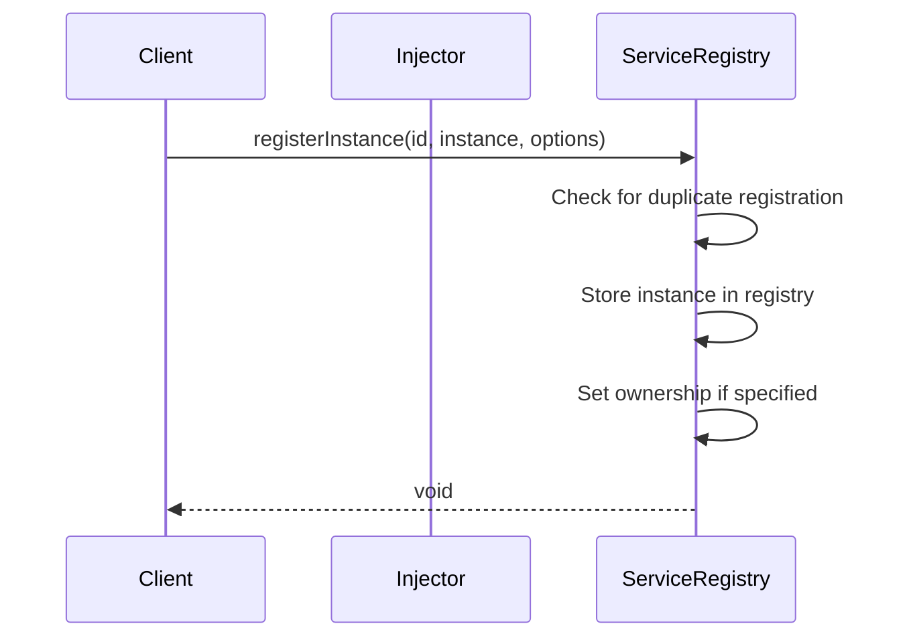
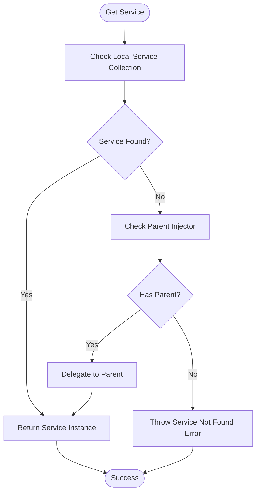
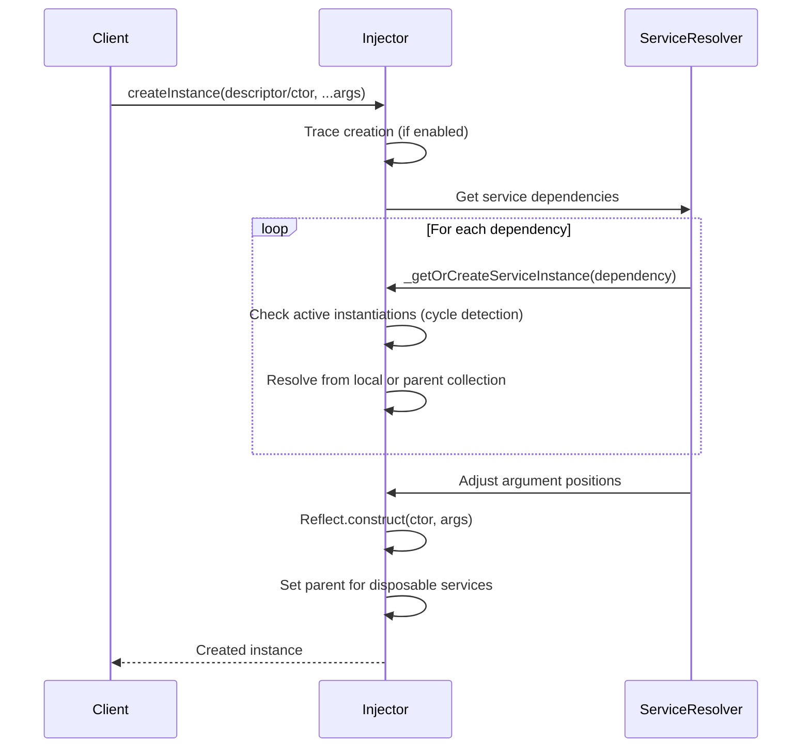
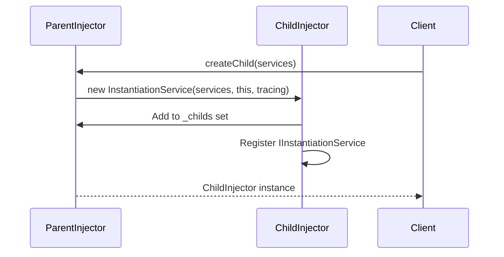
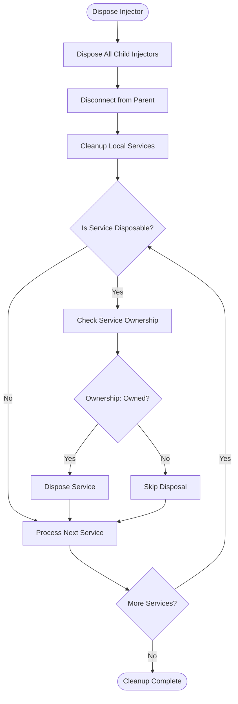
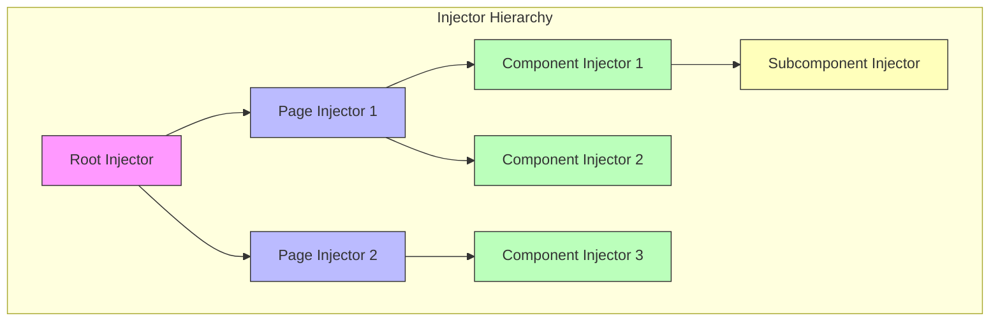
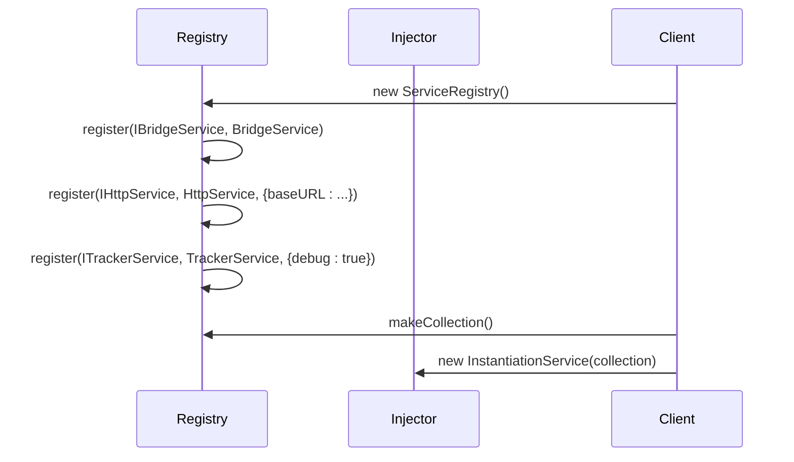
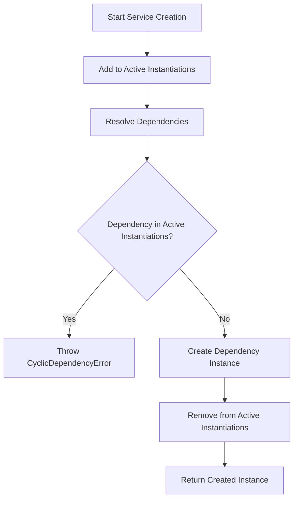
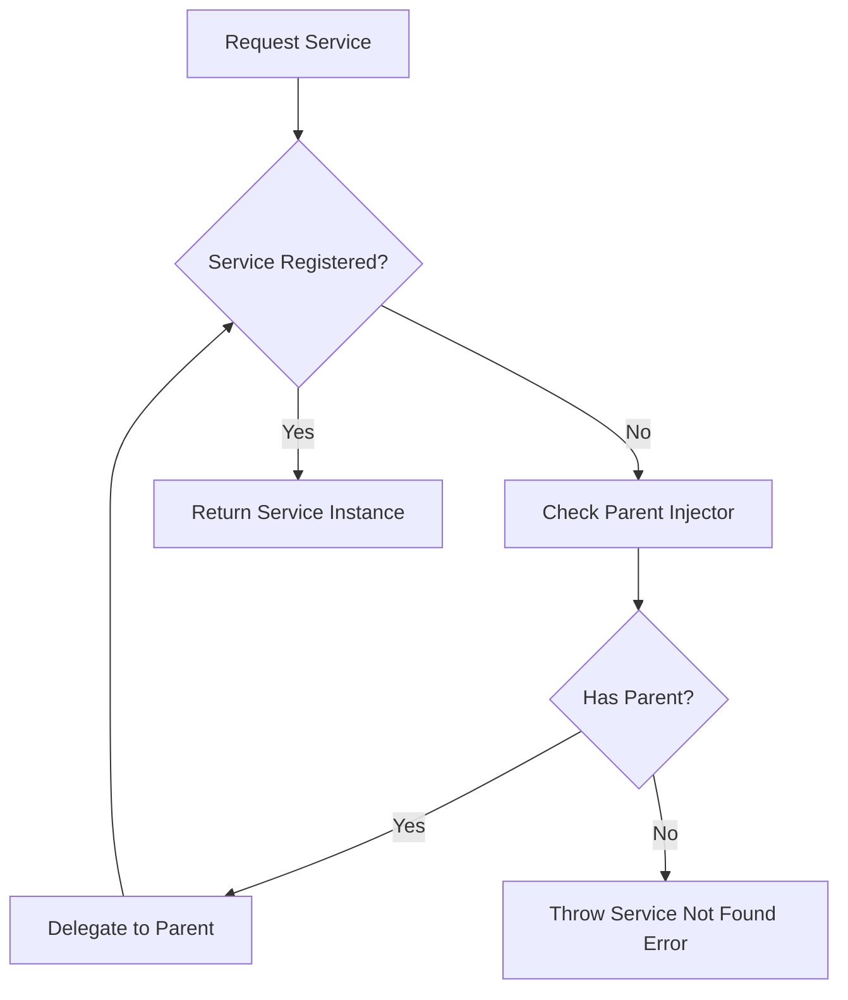

# Injector

<cite>
**Referenced Files in This Document**   
- [instantiation-service.ts](file://packages/h5-builder/src/bedrock/di/instantiation-service.ts)
- [base.ts](file://packages/h5-builder/src/bedrock/di/base.ts)
- [service-collection.ts](file://packages/h5-builder/src/bedrock/di/service-collection.ts)
- [service-registry.ts](file://packages/h5-builder/src/bedrock/di/service-registry.ts)
- [descriptor.ts](file://packages/h5-builder/src/bedrock/di/descriptor.ts)
- [http.service.ts](file://packages/h5-builder/src/services/http.service.ts)
- [service-identifiers.ts](file://packages/h5-builder/src/services/service-identifiers.ts)
- [context.web.tsx](file://packages/h5-builder/src/bedrock/di/context.web.tsx)
- [lazy-service.ts](file://packages/h5-builder/src/bedrock/di/lazy/lazy-service.ts)
- [idle-value.ts](file://packages/h5-builder/src/bedrock/di/idle-value.ts)
- [demo-progressive.tsx](file://packages/h5-builder/src/demo-progressive.tsx)
</cite>

## Table of Contents
1. [Introduction](#introduction)
2. [Core Architecture](#core-architecture)
3. [Constructor Parameters](#constructor-parameters)
4. [Key Methods](#key-methods)
5. [Service Registration and Resolution](#service-registration-and-resolution)
6. [Hierarchical Injector Structure](#hierarchical-injector-structure)
7. [Practical Usage Examples](#practical-usage-examples)
8. [Common Issues and Error Handling](#common-issues-and-error-handling)
9. [Performance Considerations](#performance-considerations)
10. [Lifecycle Management](#lifecycle-management)

## Introduction

The Injector class, implemented as `InstantiationService` in the H5 Builder Framework, serves as the core dependency injection container that manages service registration, resolution, and lifecycle. It provides a hierarchical structure for dependency resolution, enabling scoped service management across different levels of the application (global, page-level, component-level). The injector implements a robust dependency injection system that supports both eager and lazy service instantiation, cyclic dependency detection, and proper disposal of services.

**Section sources**
- [instantiation-service.ts](file://packages/h5-builder/src/bedrock/di/instantiation-service.ts#L61-L467)

## Core Architecture

The Injector follows a hierarchical dependency injection pattern where each injector can have a parent injector for cascading dependency resolution. Services are registered with unique identifiers created using the `createDecorator` function, which generates type-safe service identifiers. The architecture supports both immediate and delayed instantiation of services through the use of descriptors and proxy patterns.

```mermaid
classDiagram
class InstantiationService {
+_serviceBrand : undefined
+_services : ServiceCollection
+_parent : InstantiationService
+_childs : Set~IInstantiationService~
+_enableTracing : boolean
+_activeInstantiations : Set~ServiceIdentifier~
+constructor(services : ServiceCollection, parent? : InstantiationService, enableTracing? : boolean)
+createChild(services : ServiceCollection) : IInstantiationService
+invokeFunction(fn : Function, ...args) : any
+createInstance(ctorOrDescriptor : any, ...rest) : any
+dispose() : void
}
class ServiceCollection {
+_entries : Map~ServiceIdentifier, any~
+_ownership : ServiceOwnershipCollection
+set(id : ServiceIdentifier, instanceOrDescriptor : any) : void
+get(id : ServiceIdentifier) : any
+has(id : ServiceIdentifier) : boolean
}
class ServiceRegistry {
+_registry : [ServiceIdentifier, SyncDescriptor | BrandedService][]
+_serviceOwnership : ServiceOwnershipCollection
+register(id : ServiceIdentifier, ctorOrDescriptor : any, supportsDelayedInstantiation? : boolean) : void
+registerInstance(id : ServiceIdentifier, instance : any, options? : {ownership : ServiceOwnership}) : void
+makeCollection() : ServiceCollection
}
class SyncDescriptor {
+ctor : new (...args : any[]) => T
+staticArguments : any[]
+supportsDelayedInstantiation : boolean
+constructor(ctor : any, staticArguments : any[], supportsDelayedInstantiation : boolean)
}
InstantiationService --> ServiceCollection : "owns"
InstantiationService --> InstantiationService : "parent-child"
ServiceRegistry --> ServiceCollection : "creates"
ServiceRegistry --> SyncDescriptor : "creates"
InstantiationService --> SyncDescriptor : "resolves"
```

**Diagram sources**
- [instantiation-service.ts](file://packages/h5-builder/src/bedrock/di/instantiation-service.ts#L61-L467)
- [service-collection.ts](file://packages/h5-builder/src/bedrock/di/service-collection.ts#L14-L47)
- [service-registry.ts](file://packages/h5-builder/src/bedrock/di/service-registry.ts#L16-L100)
- [descriptor.ts](file://packages/h5-builder/src/bedrock/di/descriptor.ts#L8-L22)

**Section sources**
- [instantiation-service.ts](file://packages/h5-builder/src/bedrock/di/instantiation-service.ts#L61-L467)
- [service-collection.ts](file://packages/h5-builder/src/bedrock/di/service-collection.ts#L14-L47)

## Constructor Parameters

The Injector class accepts three parameters in its constructor, enabling flexible configuration of the dependency injection container:

1. **services**: A `ServiceCollection` instance that contains the initial set of registered services. This collection maps service identifiers to their constructors or instances.
2. **parent**: An optional parent `InstantiationService` that enables hierarchical dependency resolution. When a service is not found in the current injector, the request is delegated to the parent injector.
3. **enableTracing**: A boolean flag that enables dependency graph tracing for debugging purposes. When enabled, the injector tracks service dependencies and can detect cyclic dependencies.

The constructor establishes the parent-child relationship between injectors and sets up the service collection with the current injector instance registered as `IInstantiationService`.

**Section sources**
- [instantiation-service.ts](file://packages/h5-builder/src/bedrock/di/instantiation-service.ts#L79-L97)

## Key Methods

### registerInstance

Registers a pre-created service instance with the injector. This method is typically used for services that need to be instantiated before the DI container is created or for singleton instances that should be shared across the application.



**Diagram sources**
- [service-registry.ts](file://packages/h5-builder/src/bedrock/di/service-registry.ts#L73-L88)

### get

Retrieves a service instance from the injector. This method is typically accessed through the `ServicesAccessor` interface within the `invokeFunction` context. The injector first checks its local service collection, and if the service is not found, delegates to the parent injector in the hierarchy.



**Diagram sources**
- [instantiation-service.ts](file://packages/h5-builder/src/bedrock/di/instantiation-service.ts#L126-L141)

### resolveAndInstantiate

Creates an instance of a service with automatic dependency injection. This method resolves all dependencies declared in the service constructor and injects them when creating the instance. It supports both constructor injection and static arguments.



**Diagram sources**
- [instantiation-service.ts](file://packages/h5-builder/src/bedrock/di/instantiation-service.ts#L150-L176)

### createChild

Creates a child injector with isolated service scope. The child injector inherits all services from its parent but can override or add new services. This enables scoped dependency injection for specific application contexts like pages or components.



**Diagram sources**
- [instantiation-service.ts](file://packages/h5-builder/src/bedrock/di/instantiation-service.ts#L112-L114)

### dispose

Cleans up the injector and its children, disposing of all owned services. This method ensures proper resource cleanup and prevents memory leaks by disposing of services that implement the `IDisposable` interface.



**Diagram sources**
- [instantiation-service.ts](file://packages/h5-builder/src/bedrock/di/instantiation-service.ts#L178-L213)

## Service Registration and Resolution

Services are registered with the injector using service identifiers created with the `createDecorator` function. These identifiers are type-safe and prevent naming conflicts. The registration process involves creating a `ServiceRegistry` that collects all service definitions and then converting it to a `ServiceCollection` for use by the injector.

When resolving services, the injector follows a hierarchical lookup pattern:
1. Check the local service collection for the service
2. If not found and a parent injector exists, delegate to the parent
3. If the service is registered as a constructor (via `SyncDescriptor`), instantiate it with dependency injection
4. Return the service instance

The resolution process includes cyclic dependency detection by tracking active instantiations and building a dependency graph when tracing is enabled.

**Section sources**
- [instantiation-service.ts](file://packages/h5-builder/src/bedrock/di/instantiation-service.ts#L268-L288)
- [service-registry.ts](file://packages/h5-builder/src/bedrock/di/service-registry.ts#L35-L65)

## Hierarchical Injector Structure

The injector implements a hierarchical structure that enables scoped service management. This hierarchy supports different levels of service scoping:

1. **Global Level**: Services registered at the root injector level are available application-wide
2. **Page Level**: Child injectors created for specific pages can override global services or add page-specific services
3. **Component Level**: Components can create their own child injectors for isolated service scopes

This hierarchical approach allows for service overriding and isolation while maintaining access to parent services. For example, a page might override the `HttpService` with a page-specific configuration while still accessing global services like `TrackerService`.



**Diagram sources**
- [instantiation-service.ts](file://packages/h5-builder/src/bedrock/di/instantiation-service.ts#L68-L70)
- [instantiation-service.ts](file://packages/h5-builder/src/bedrock/di/instantiation-service.ts#L112-L114)

## Practical Usage Examples

### Service Registration Example

The following example demonstrates how services are registered in the application setup:



**Section sources**
- [demo-progressive.tsx](file://packages/h5-builder/src/demo-progressive.tsx#L194-L206)

### Service Retrieval Example

Services can be retrieved using different patterns:

1. **Direct retrieval via invokeFunction**:
```typescript
instantiationService.invokeFunction(accessor => {
    const httpService = accessor.get(IHttpService);
    // Use httpService
});
```

2. **React hook usage**:
```typescript
function MyComponent() {
    const httpService = useService(IHttpService);
    // Use httpService
}
```

3. **Constructor injection**:
```typescript
class MyService {
    constructor(@IHttpService private httpService: HttpService) {}
}
```

**Section sources**
- [instantiation-service.ts](file://packages/h5-builder/src/bedrock/di/instantiation-service.ts#L118-L148)
- [context.web.tsx](file://packages/h5-builder/src/bedrock/di/context.web.tsx#L29-L41)
- [http.service.ts](file://packages/h5-builder/src/services/http.service.ts#L75)

## Common Issues and Error Handling

### Cyclic Dependencies

The injector detects cyclic dependencies during service instantiation by tracking active instantiations and building a dependency graph when tracing is enabled. If a cyclic dependency is detected, a `CyclicDependencyError` is thrown with details about the cycle.



**Section sources**
- [instantiation-service.ts](file://packages/h5-builder/src/bedrock/di/instantiation-service.ts#L297-L305)

### Service Not Found Errors

When a requested service is not registered, the injector throws an error with detailed information about the missing dependency. The error includes the service identifier and the context (issuer) that requested the service.



**Section sources**
- [instantiation-service.ts](file://packages/h5-builder/src/bedrock/di/instantiation-service.ts#L133-L139)

### Memory Leaks from Improper Disposal

Memory leaks can occur if disposable services are not properly disposed of. The injector automatically disposes of owned services when `dispose()` is called, but services with `ServiceOwnership.Reference` are not disposed of by the injector.

**Section sources**
- [instantiation-service.ts](file://packages/h5-builder/src/bedrock/di/instantiation-service.ts#L198-L211)

## Performance Considerations

### Service Instantiation

The injector supports both eager and lazy service creation. Services can be configured for delayed instantiation using the `supportsDelayedInstantiation` parameter, which wraps the service in an `IdleValue` proxy that instantiates the service only when first accessed.

```mermaid
classDiagram
class IdleValue {
+_value : T
+_isInitialized : boolean
+getValue() : T
}
class Proxy {
+handler : ProxyHandler
}
IdleValue --> Proxy : "wrapped by"
Proxy --> Service : "proxies"
note right of IdleValue
Only creates the actual service
instance when getValue() is called
end note
```

**Diagram sources**
- [idle-value.ts](file://packages/h5-builder/src/bedrock/di/idle-value.ts)
- [proxy-builder.ts](file://packages/h5-builder/src/bedrock/di/proxy-builder.ts)

### Trade-offs Between Eager and Lazy Creation

**Eager Creation**:
- Pros: Predictable initialization, immediate error detection
- Cons: Higher startup cost, potential memory usage for unused services

**Lazy Creation**:
- Pros: Reduced startup time, memory efficiency for rarely used services
- Cons: Delayed error detection, potential performance impact on first access

The choice between eager and lazy creation should be based on service usage patterns and performance requirements.

**Section sources**
- [instantiation-service.ts](file://packages/h5-builder/src/bedrock/di/instantiation-service.ts#L435-L439)
- [descriptor.ts](file://packages/h5-builder/src/bedrock/di/descriptor.ts#L11)

## Lifecycle Management

The injector manages the complete lifecycle of services, from registration to disposal. When a service implements the `IDisposable` interface, the injector automatically manages its disposal based on the service ownership:

1. **ServiceOwnership.Owned**: The injector owns the service and will dispose of it when the injector is disposed
2. **ServiceOwnership.Reference**: The injector does not own the service and will not dispose of it

The disposal process is hierarchical, with child injectors being disposed of before their parent, ensuring proper cleanup order.

**Section sources**
- [instantiation-service.ts](file://packages/h5-builder/src/bedrock/di/instantiation-service.ts#L178-L213)
- [service-ownership-collection.ts](file://packages/h5-builder/src/bedrock/di/service-ownership-collection.ts)