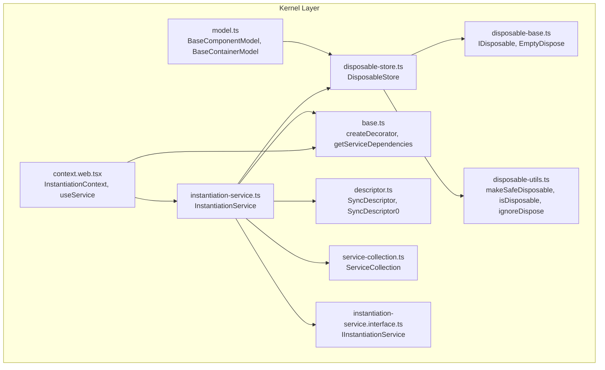
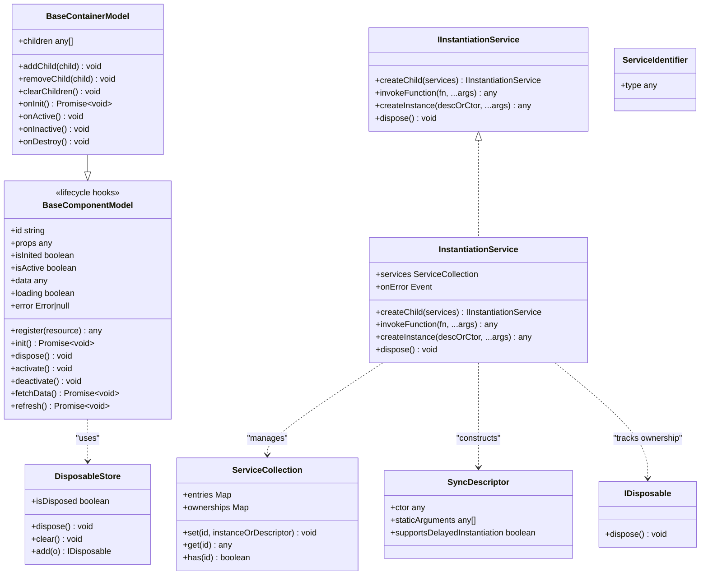
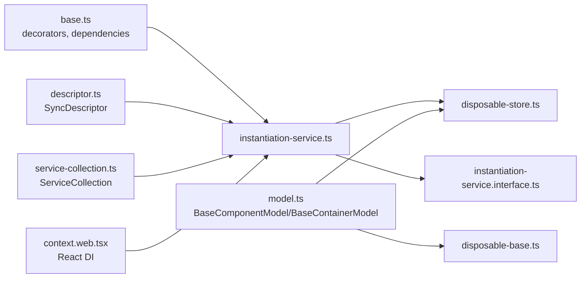

# Kernel Layer

<cite>
**Referenced Files in This Document**
- [model.ts](file://packages/h5-builder/src/bedrock/model.ts)
- [disposable-store.ts](file://packages/h5-builder/src/bedrock/dispose/disposable-store.ts)
- [disposable-base.ts](file://packages/h5-builder/src/bedrock/dispose/dispose-base.ts)
- [disposable-utils.ts](file://packages/h5-builder/src/bedrock/dispose/disposable-utils.ts)
- [instantiation-service.ts](file://packages/h5-builder/src/bedrock/di/instantiation-service.ts)
- [instantiation-service.interface.ts](file://packages/h5-builder/src/bedrock/di/instantiation-service.interface.ts)
- [base.ts](file://packages/h5-builder/src/bedrock/di/base.ts)
- [descriptor.ts](file://packages/h5-builder/src/bedrock/di/descriptor.ts)
- [service-collection.ts](file://packages/h5-builder/src/bedrock/di/service-collection.ts)
- [context.web.tsx](file://packages/h5-builder/src/bedrock/di/context.web.tsx)
- [product-card.model.ts](file://packages/h5-builder/src/components/product-card/product-card.model.ts)
- [tabs-container.model.ts](file://packages/h5-builder/src/components/tabs-container/tabs-container.model.ts)
</cite>

## Table of Contents
1. [Introduction](#introduction)
2. [Project Structure](#project-structure)
3. [Core Components](#core-components)
4. [Architecture Overview](#architecture-overview)
5. [Detailed Component Analysis](#detailed-component-analysis)
6. [Dependency Analysis](#dependency-analysis)
7. [Performance Considerations](#performance-considerations)
8. [Troubleshooting Guide](#troubleshooting-guide)
9. [Conclusion](#conclusion)

## Introduction
This document provides comprehensive API documentation for the Kernel Layer of the H5 Builder Framework. The Kernel Layer encompasses the foundational infrastructure that powers component models, lifecycle management, and dependency injection. It includes:
- Injector: The dependency injection system that resolves and instantiates services with support for cyclic dependency detection, delayed instantiation, and hierarchical contexts.
- DisposableStore: A resource management utility that ensures deterministic cleanup of resources and prevents memory leaks.
- BaseComponentModel: The base class for all component models, offering lifecycle hooks, reactive state, and automatic resource registration.
- BaseContainerModel: A specialized container model that orchestrates child models, enabling composition, activation, and lifecycle propagation.

These components work together to provide a robust, predictable, and efficient runtime for building interactive H5 pages.

## Project Structure
The Kernel Layer resides under the bedrock module and integrates with the broader framework through services and models. The following diagram shows the primary files and their roles:

**Diagram sources**
- [model.ts](file://packages/h5-builder/src/bedrock/model.ts#L1-L243)
- [disposable-store.ts](file://packages/h5-builder/src/bedrock/dispose/disposable-store.ts#L1-L84)
- [disposable-base.ts](file://packages/h5-builder/src/bedrock/dispose/dispose-base.ts#L1-L10)
- [disposable-utils.ts](file://packages/h5-builder/src/bedrock/dispose/disposable-utils.ts#L1-L29)
- [instantiation-service.ts](file://packages/h5-builder/src/bedrock/di/instantiation-service.ts#L1-L468)
- [instantiation-service.interface.ts](file://packages/h5-builder/src/bedrock/di/instantiation-service.interface.ts#L1-L47)
- [base.ts](file://packages/h5-builder/src/bedrock/di/base.ts#L1-L74)
- [descriptor.ts](file://packages/h5-builder/src/bedrock/di/descriptor.ts#L1-L32)
- [service-collection.ts](file://packages/h5-builder/src/bedrock/di/service-collection.ts#L1-L47)
- [context.web.tsx](file://packages/h5-builder/src/bedrock/di/context.web.tsx#L1-L42)

**Section sources**
- [model.ts](file://packages/h5-builder/src/bedrock/model.ts#L1-L243)
- [disposable-store.ts](file://packages/h5-builder/src/bedrock/dispose/disposable-store.ts#L1-L84)
- [instantiation-service.ts](file://packages/h5-builder/src/bedrock/di/instantiation-service.ts#L1-L468)
- [base.ts](file://packages/h5-builder/src/bedrock/di/base.ts#L1-L74)
- [descriptor.ts](file://packages/h5-builder/src/bedrock/di/descriptor.ts#L1-L32)
- [service-collection.ts](file://packages/h5-builder/src/bedrock/di/service-collection.ts#L1-L47)
- [context.web.tsx](file://packages/h5-builder/src/bedrock/di/context.web.tsx#L1-L42)

## Core Components
This section documents the APIs of the Kernel Layer components, focusing on methods, properties, parameters, return types, and exceptions. References to implementation details are provided via file paths.

### BaseComponentModel
- Purpose: Foundation for all component models. Provides lifecycle management, reactive state, and automatic resource registration.
- Implements: IDisposable
- Key properties:
  - id: string
  - props: P
  - isInited: boolean
  - isActive: boolean
  - data: any
  - loading: boolean
  - error: Error | null
- Key methods:
  - constructor(id: string, props: P)
  - register<T extends IDisposable | (() => void)>(resource: T): T
  - init(): Promise<void>
  - dispose(): void
  - activate(): void
  - deactivate(): void
  - fetchData(): Promise<void>
  - refresh(): Promise<void>
  - onInit(): Promise<void> (abstract)
  - onDestroy(): void
  - onActive(): void
  - onInactive(): void
- Exceptions:
  - Throws if lifecycle methods are invoked out-of-order (e.g., re-initialization).
  - Throws if refresh fails; error is captured and stored.
- Notes:
  - Uses MobX observability for reactive state.
  - Automatically registers resources via DisposableStore.

**Section sources**
- [model.ts](file://packages/h5-builder/src/bedrock/model.ts#L10-L155)

### BaseContainerModel
- Purpose: Container model that manages child models and propagates lifecycle events.
- Extends: BaseComponentModel
- Key properties:
  - children: C[]
- Key methods:
  - addChild(child: C): void
  - removeChild(child: C): void
  - clearChildren(): void
  - onInit(): Promise<void> (default: initializes all children concurrently)
  - onActive(): void (default: activates all children)
  - onInactive(): void (default: deactivates all children)
  - onDestroy(): void (default: calls super)
- Exceptions:
  - Throws if lifecycle methods are invoked out-of-order.
- Notes:
  - Child models are automatically registered for cleanup.
  - Override lifecycle methods to customize behavior (e.g., lazy loading, selective activation).

**Section sources**
- [model.ts](file://packages/h5-builder/src/bedrock/model.ts#L158-L243)

### DisposableStore
- Purpose: Centralized resource management to prevent leaks and ensure deterministic cleanup.
- Implements: IDisposable
- Key properties:
  - isDisposed: boolean
- Key methods:
  - dispose(): void
  - clear(): void
  - add<T extends IDisposable>(o: T): T
- Exceptions:
  - Throws AggregateError if any child throws during disposal.
  - Logs warnings if attempting to add a disposable to a disposed store.
  - Throws if registering a disposable against itself.
- Notes:
  - Disposes children in last-in, first-out order.
  - Tracks disposables for leak detection.

**Section sources**
- [disposable-store.ts](file://packages/h5-builder/src/bedrock/dispose/disposable-store.ts#L1-L84)
- [disposable-base.ts](file://packages/h5-builder/src/bedrock/dispose/dispose-base.ts#L1-L10)
- [disposable-utils.ts](file://packages/h5-builder/src/bedrock/dispose/disposable-utils.ts#L1-L29)

### InstantiationService
- Purpose: Dependency injection container that resolves services, constructs instances, and manages lifetimes.
- Implements: IInstantiationService
- Key properties:
  - services: ServiceCollection
  - onError: Event<[ErrorDataType]>
- Key methods:
  - createChild(services: ServiceCollection): IInstantiationService
  - invokeFunction<R, TS extends any[] = []>(fn: (accessor: ServicesAccessor, ...args: TS) => R, ...args: TS): R
  - createInstance(descriptor: SyncDescriptor0<T>): T
  - createInstance(ctor: new (...args: any[]) => any, ...args: GetLeadingNonServiceArgs<ConstructorParameters<Ctor>>): R
  - dispose(): void
- Exceptions:
  - Throws when unknown dependencies are encountered.
  - Throws when recursive instantiation is detected.
  - Throws when cyclic dependencies are detected.
- Notes:
  - Supports delayed instantiation via SyncDescriptor with supportsDelayedInstantiation.
  - Maintains a global dependency graph when tracing is enabled.
  - Propagates errors to the top-level container.

**Section sources**
- [instantiation-service.ts](file://packages/h5-builder/src/bedrock/di/instantiation-service.ts#L1-L468)
- [instantiation-service.interface.ts](file://packages/h5-builder/src/bedrock/di/instantiation-service.interface.ts#L1-L47)
- [descriptor.ts](file://packages/h5-builder/src/bedrock/di/descriptor.ts#L1-L32)
- [service-collection.ts](file://packages/h5-builder/src/bedrock/di/service-collection.ts#L1-L47)
- [base.ts](file://packages/h5-builder/src/bedrock/di/base.ts#L1-L74)

### DI Utilities and Decorators
- createDecorator<T>(serviceId: string): ServiceIdentifier<T>
- getServiceDependencies(ctor: any): { id: ServiceIdentifier<any>; index: number }[]
- SyncDescriptor<T>
  - ctor: new (...args: any[]) => T
  - staticArguments: any[]
  - supportsDelayedInstantiation: boolean
- ServiceCollection
  - set(id: ServiceIdentifier<T>, instanceOrDescriptor: T | SyncDescriptor<T>): void
  - get(id: ServiceIdentifier<T>): T | SyncDescriptor<T>
  - has(id: ServiceIdentifier<any>): boolean
  - entries: Map<ServiceIdentifier<any>, any>
  - ownerships: Map<ServiceIdentifier<any>, any>

**Section sources**
- [base.ts](file://packages/h5-builder/src/bedrock/di/base.ts#L1-L74)
- [descriptor.ts](file://packages/h5-builder/src/bedrock/di/descriptor.ts#L1-L32)
- [service-collection.ts](file://packages/h5-builder/src/bedrock/di/service-collection.ts#L1-L47)

### React DI Context
- InstantiationContext(props: { instantiationService: IInstantiationService; children?: React.ReactNode }): ReactElement
- useService<T>(identifier: ServiceIdentifier<T>): T
- Notes:
  - Provides a React context for DI-aware components.
  - Ensures services are acquired through the instantiation service’s accessor.

**Section sources**
- [context.web.tsx](file://packages/h5-builder/src/bedrock/di/context.web.tsx#L1-L42)

## Architecture Overview
The Kernel Layer forms the backbone of the H5 Builder runtime:
- BaseComponentModel and BaseContainerModel define the model layer with lifecycle hooks and reactive state.
- DisposableStore centralizes resource cleanup and prevents leaks.
- InstantiationService resolves dependencies, constructs instances, and manages lifetimes.
- DI decorators and descriptors describe service contracts and instantiation behavior.
- React context bridges DI into UI components.

**Diagram sources**
- [model.ts](file://packages/h5-builder/src/bedrock/model.ts#L10-L243)
- [disposable-store.ts](file://packages/h5-builder/src/bedrock/dispose/disposable-store.ts#L1-L84)
- [instantiation-service.ts](file://packages/h5-builder/src/bedrock/di/instantiation-service.ts#L1-L468)
- [instantiation-service.interface.ts](file://packages/h5-builder/src/bedrock/di/instantiation-service.interface.ts#L1-L47)
- [descriptor.ts](file://packages/h5-builder/src/bedrock/di/descriptor.ts#L1-L32)
- [service-collection.ts](file://packages/h5-builder/src/bedrock/di/service-collection.ts#L1-L47)

## Detailed Component Analysis

### BaseComponentModel API Reference
- Constructor
  - Parameters: id: string, props: P
  - Returns: Observable instance of the model
  - Exceptions: None
- Lifecycle
  - init(): Promise<void>
    - Ensures onInit runs once
    - Returns a Promise that resolves when initialization completes
  - activate(): void
    - Marks model active and triggers onActive
  - deactivate(): void
    - Marks model inactive and triggers onInactive
  - dispose(): void
    - Invokes onDestroy and disposes registered resources
- Data fetching
  - fetchData(): Promise<void>
  - refresh(): Promise<void>
    - Sets loading, clears error, invokes fetchData, updates loading/error
- Resource registration
  - register<T extends IDisposable | (() => void)>(resource: T): T
    - Registers a disposable or a function returning a disposable
- Lifecycle hooks (override in subclasses)
  - onInit(): Promise<void>
  - onDestroy(): void
  - onActive(): void
  - onInactive(): void

Usage patterns:
- Initialize resources in onInit and register them with register.
- Use refresh to reload data and handle errors gracefully.
- Override lifecycle hooks to integrate timers, subscriptions, or network requests.

Common pitfalls:
- Calling dispose twice leads to warnings; ensure single disposal.
- Not registering long-lived resources can cause leaks.

**Section sources**
- [model.ts](file://packages/h5-builder/src/bedrock/model.ts#L10-L155)

### BaseContainerModel API Reference
- Children management
  - addChild(child: C): void
  - removeChild(child: C): void
  - clearChildren(): void
- Lifecycle
  - onInit(): Promise<void>
    - Initializes all children concurrently by default
  - onActive(): void
    - Activates all children by default
  - onInactive(): void
    - Deactivates all children by default
  - onDestroy(): void
    - Calls super; child disposal is handled by DisposableStore

Usage patterns:
- Override onInit/onActive/onInactive to implement lazy loading, selective activation, or virtual scrolling.
- Use clearChildren to reset container state.

Common pitfalls:
- Forgetting to await child initialization can lead to inconsistent state.
- Overriding lifecycle methods without calling super can break child cleanup.

**Section sources**
- [model.ts](file://packages/h5-builder/src/bedrock/model.ts#L158-L243)

### DisposableStore API Reference
- Properties
  - isDisposed: boolean
- Methods
  - add<T extends IDisposable>(o: T): T
    - Registers a disposable; throws if adding self or if store is disposed
  - clear(): void
    - Disposes all registered disposables in LIFO order; collects errors into AggregateError
  - dispose(): void
    - Marks store disposed and clears; logs warnings for repeated disposal

Memory leak prevention:
- Always register resources with register or add.
- Ensure containers dispose children via DisposableStore.
- Avoid ignoring disposables with ignoreDispose unless intentionally leaking.

**Section sources**
- [disposable-store.ts](file://packages/h5-builder/src/bedrock/dispose/disposable-store.ts#L1-L84)
- [disposable-base.ts](file://packages/h5-builder/src/bedrock/dispose/dispose-base.ts#L1-L10)
- [disposable-utils.ts](file://packages/h5-builder/src/bedrock/dispose/disposable-utils.ts#L1-L29)

### InstantiationService API Reference
- Interfaces and types
  - IInstantiationService
  - GetLeadingNonServiceArgs<TArgs>
- Methods
  - createChild(services: ServiceCollection): IInstantiationService
  - invokeFunction<R, TS extends any[] = []>(fn: (accessor: ServicesAccessor, ...args: TS) => R, ...args: TS): R
  - createInstance(descriptor: SyncDescriptor0<T>): T
  - createInstance(ctor: new (...args: any[]) => any, ...args: GetLeadingNonServiceArgs<ConstructorParameters<Ctor>>): R
  - dispose(): void
- Error handling
  - UnknownDependency: thrown when a dependency is not registered
  - Recursive instantiation: thrown when a service tries to instantiate itself
  - CyclicDependencyError: thrown when cycles are detected
- Tracing and ownership
  - Optional global dependency graph when tracing is enabled
  - Tracks disposable ownership to decide whether to dispose owned services

Dependency resolution mechanics:
- getServiceDependencies reads constructor metadata to resolve service parameters.
- ServiceCollection stores either descriptors or instances.
- SyncDescriptor supports delayed instantiation; InstantiationService wraps with proxies when supported.

**Section sources**
- [instantiation-service.ts](file://packages/h5-builder/src/bedrock/di/instantiation-service.ts#L1-L468)
- [instantiation-service.interface.ts](file://packages/h5-builder/src/bedrock/di/instantiation-service.interface.ts#L1-L47)
- [base.ts](file://packages/h5-builder/src/bedrock/di/base.ts#L1-L74)
- [descriptor.ts](file://packages/h5-builder/src/bedrock/di/descriptor.ts#L1-L32)
- [service-collection.ts](file://packages/h5-builder/src/bedrock/di/service-collection.ts#L1-L47)

### DI Decorators and Utilities
- createDecorator<T>(serviceId: string): ServiceIdentifier<T>
  - Decorator that records dependency metadata on constructors
- getServiceDependencies(ctor: any): { id: ServiceIdentifier<any>; index: number }[]
  - Reads recorded dependencies from constructor metadata
- SyncDescriptor<T>
  - Wraps constructor with optional static arguments and delayed instantiation flag
- ServiceCollection
  - Stores service entries and ownerships

**Section sources**
- [base.ts](file://packages/h5-builder/src/bedrock/di/base.ts#L1-L74)
- [descriptor.ts](file://packages/h5-builder/src/bedrock/di/descriptor.ts#L1-L32)
- [service-collection.ts](file://packages/h5-builder/src/bedrock/di/service-collection.ts#L1-L47)

### React DI Context
- InstantiationContext(props: { instantiationService: IInstantiationService; children?: React.ReactNode }): ReactElement
  - Provider for DI context
- useService<T>(identifier: ServiceIdentifier<T>): T
  - Hook to obtain a service via the instantiation service accessor

**Section sources**
- [context.web.tsx](file://packages/h5-builder/src/bedrock/di/context.web.tsx#L1-L42)

## Dependency Analysis
This section maps the relationships among Kernel Layer components and highlights coupling and cohesion.

**Diagram sources**
- [base.ts](file://packages/h5-builder/src/bedrock/di/base.ts#L1-L74)
- [descriptor.ts](file://packages/h5-builder/src/bedrock/di/descriptor.ts#L1-L32)
- [service-collection.ts](file://packages/h5-builder/src/bedrock/di/service-collection.ts#L1-L47)
- [instantiation-service.ts](file://packages/h5-builder/src/bedrock/di/instantiation-service.ts#L1-L468)
- [instantiation-service.interface.ts](file://packages/h5-builder/src/bedrock/di/instantiation-service.interface.ts#L1-L47)
- [model.ts](file://packages/h5-builder/src/bedrock/model.ts#L10-L243)
- [disposable-store.ts](file://packages/h5-builder/src/bedrock/dispose/disposable-store.ts#L1-L84)
- [disposable-base.ts](file://packages/h5-builder/src/bedrock/dispose/dispose-base.ts#L1-L10)
- [context.web.tsx](file://packages/h5-builder/src/bedrock/di/context.web.tsx#L1-L42)

Key observations:
- Cohesion: DI utilities and instantiation logic are cohesive within instantiation-service.ts.
- Coupling: Models depend on DisposableStore; InstantiationService depends on decorators, descriptors, and collections.
- Ownership: DisposableStore tracks disposables; InstantiationService sets parent ownership for disposables.

Potential circular dependencies:
- Avoid circular dependencies between services; InstantiationService detects cycles and throws.

## Performance Considerations
- BaseContainerModel
  - Default onInit initializes all children concurrently; override for lazy loading or virtual scrolling to reduce initial load.
  - Prefer selective activation/deactivation to minimize active work.
- DisposableStore
  - LIFO disposal order reduces contention; keep the number of tracked disposables reasonable.
  - Use clear to batch cleanup; avoid frequent add/remove churn.
- InstantiationService
  - Delayed instantiation via SyncDescriptor reduces startup costs for heavy services.
  - Tracing enables diagnostics but adds overhead; disable in production.
  - Use createChild to scope services and limit global graph growth.
- Reactive state
  - BaseComponentModel uses MobX observability; keep state granular to minimize recomputation.

## Troubleshooting Guide
Common issues and resolutions:
- Duplicate disposal of DisposableStore
  - Symptom: Warning logs about repeated disposal.
  - Resolution: Ensure dispose is called once; avoid manual disposal of already disposed stores.
- Attempting to add a disposable to a disposed store
  - Symptom: Warning logs indicating potential leak.
  - Resolution: Reinitialize the store or avoid adding to disposed stores.
- Cannot register a disposable on itself
  - Symptom: Error thrown when adding a store to itself.
  - Resolution: Register child disposables via register or add to a different store.
- Unknown dependency during instantiation
  - Symptom: Error indicating an unregistered service.
  - Resolution: Register the service in ServiceCollection or ensure correct decorator usage.
- Recursive instantiation
  - Symptom: Error indicating self-dependency.
  - Resolution: Remove circular dependencies; refactor constructors to avoid self-instantiation.
- Cyclic dependencies
  - Symptom: CyclicDependencyError thrown.
  - Resolution: Break cycles; restructure dependencies; use lazy initialization where appropriate.
- React DI context not provided
  - Symptom: Assertion failure when using useService.
  - Resolution: Wrap components with InstantiationContext and pass an IInstantiationService.

**Section sources**
- [disposable-store.ts](file://packages/h5-builder/src/bedrock/dispose/disposable-store.ts#L1-L84)
- [instantiation-service.ts](file://packages/h5-builder/src/bedrock/di/instantiation-service.ts#L1-L468)
- [context.web.tsx](file://packages/h5-builder/src/bedrock/di/context.web.tsx#L1-L42)

## Conclusion
The Kernel Layer provides a solid foundation for building scalable and maintainable H5 applications:
- BaseComponentModel and BaseContainerModel offer clear lifecycle semantics and reactive state.
- DisposableStore ensures deterministic cleanup and leak prevention.
- InstantiationService delivers robust dependency resolution with safety mechanisms for cycles and ownership.
- React DI context integrates DI seamlessly into UI components.

By following the documented APIs, lifecycle patterns, and troubleshooting guidance, developers can implement reliable models, containers, and services while avoiding common pitfalls and performance bottlenecks.