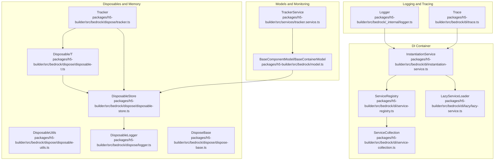
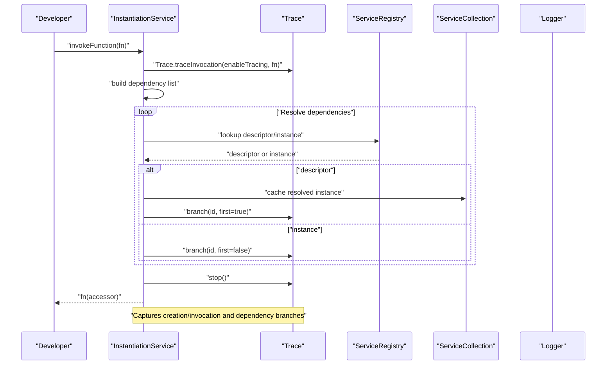
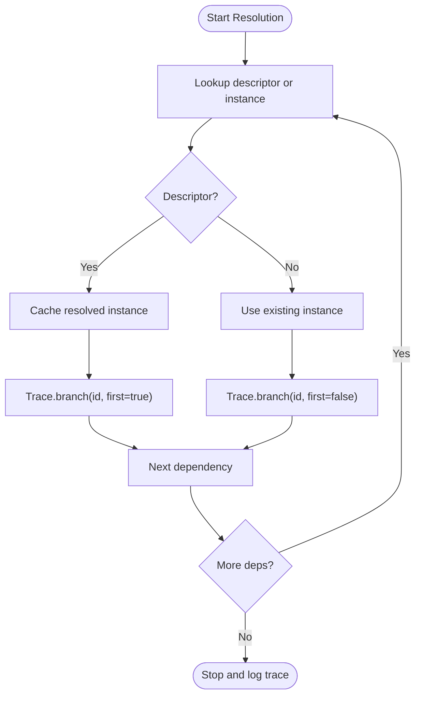
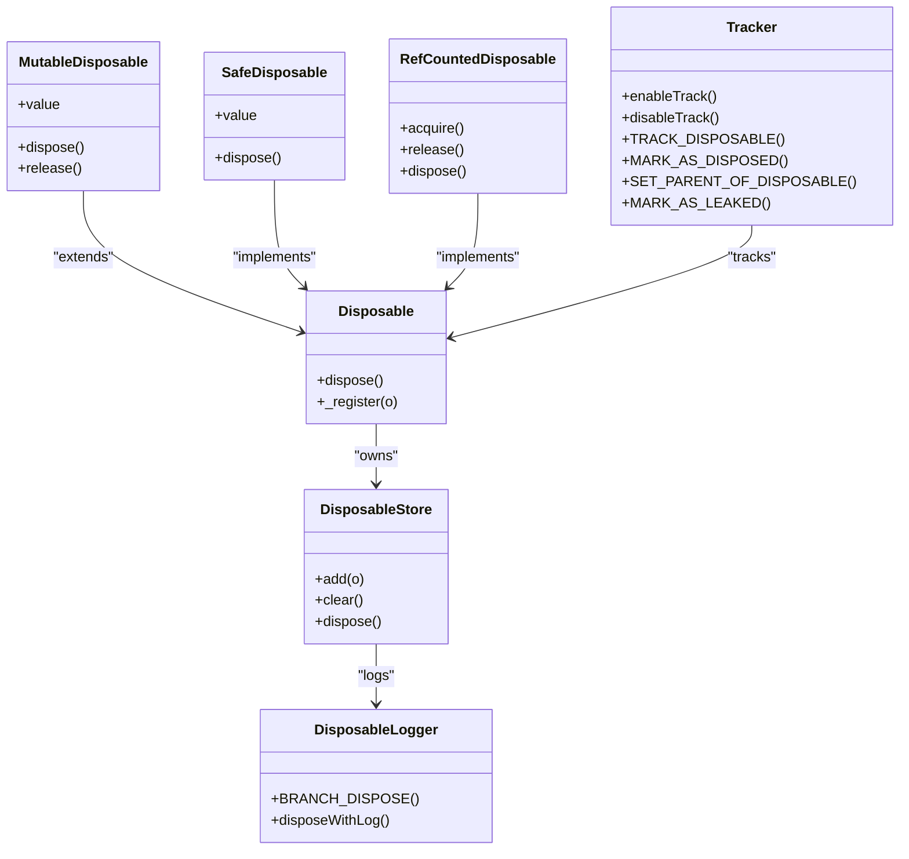
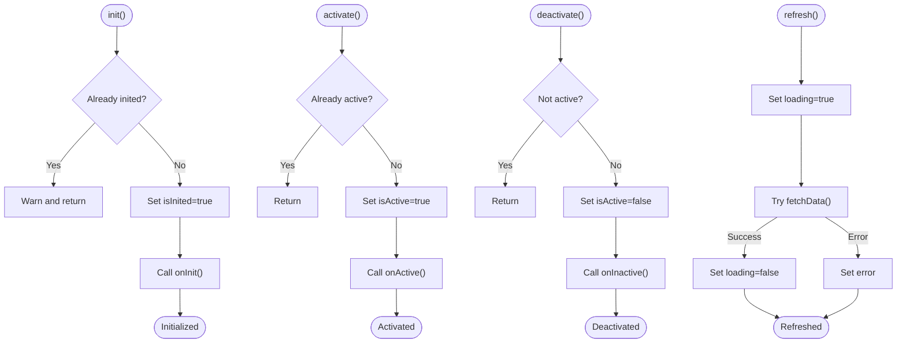
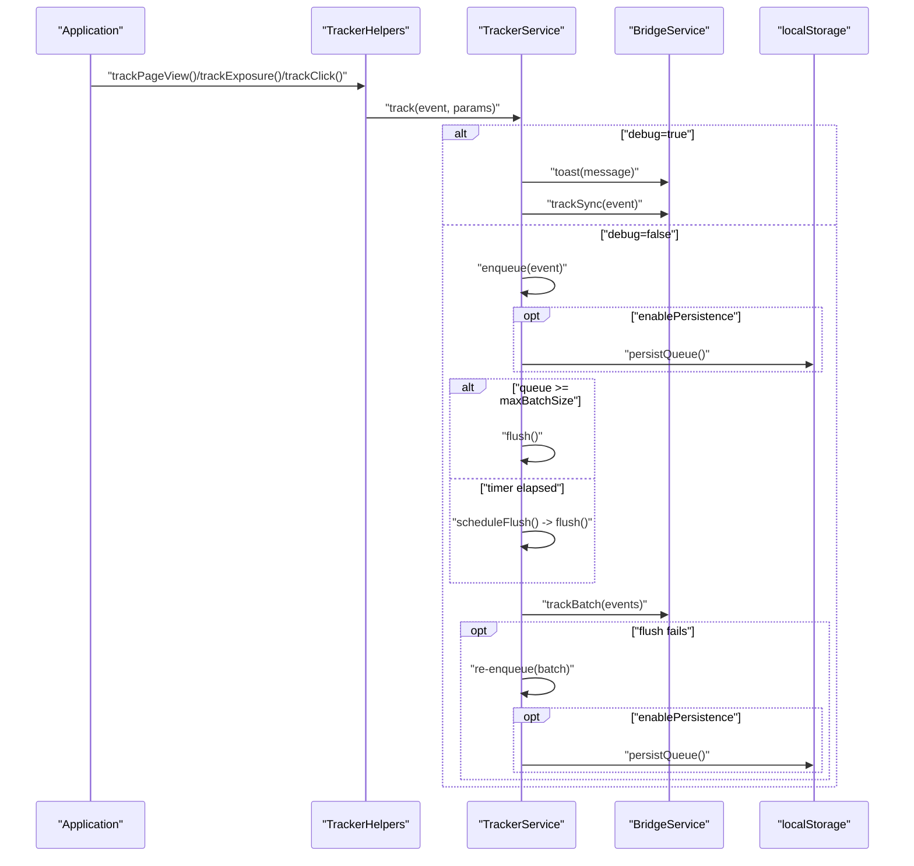
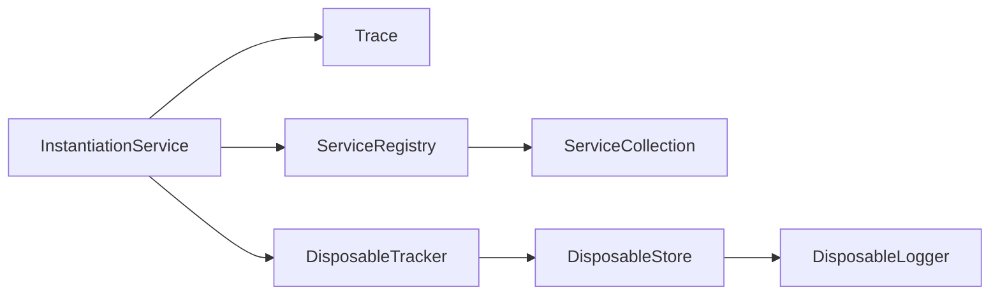

# Advanced Debugging and Monitoring

<cite>
**Referenced Files in This Document**
- [logger.ts](file://packages/h5-builder/src/bedrock/_internal/logger.ts)
- [trace.ts](file://packages/h5-builder/src/bedrock/di/trace.ts)
- [instantiation-service.ts](file://packages/h5-builder/src/bedrock/di/instantiation-service.ts)
- [service-registry.ts](file://packages/h5-builder/src/bedrock/di/service-registry.ts)
- [service-collection.ts](file://packages/h5-builder/src/bedrock/di/service-collection.ts)
- [lazy-service.ts](file://packages/h5-builder/src/bedrock/di/lazy/lazy-service.ts)
- [tracker.ts](file://packages/h5-builder/src/bedrock/dispose/tracker.ts)
- [disposable-store.ts](file://packages/h5-builder/src/bedrock/dispose/disposable-store.ts)
- [disposable-t.ts](file://packages/h5-builder/src/bedrock/dispose/disposable-t.ts)
- [disposable-utils.ts](file://packages/h5-builder/src/bedrock/dispose/disposable-utils.ts)
- [dispose-base.ts](file://packages/h5-builder/src/bedrock/dispose/dispose-base.ts)
- [disposable-logger.ts](file://packages/h5-builder/src/bedrock/dispose/logger.ts)
- [model.ts](file://packages/h5-builder/src/bedrock/model.ts)
- [tracker.service.ts](file://packages/h5-builder/src/services/tracker.service.ts)
- [tracker.service.test.ts](file://packages/h5-builder/src/__tests__/tracker.service.test.ts)
- [component-loader.test.ts](file://packages/h5-builder/src/__tests__/component-loader.test.ts)
</cite>

## Table of Contents
1. [Introduction](#introduction)
2. [Project Structure](#project-structure)
3. [Core Components](#core-components)
4. [Architecture Overview](#architecture-overview)
5. [Detailed Component Analysis](#detailed-component-analysis)
6. [Dependency Analysis](#dependency-analysis)
7. [Performance Considerations](#performance-considerations)
8. [Troubleshooting Guide](#troubleshooting-guide)
9. [Conclusion](#conclusion)
10. [Appendices](#appendices)

## Introduction
This document provides advanced debugging and monitoring strategies for production H5 Builder applications. It focuses on leveraging the internal logger and trace system to diagnose DI container issues and service resolution problems, monitoring component lifecycle events and performance metrics via TrackerService, debugging complex reactive state issues in models, and identifying memory leaks through disposable tracking. It also covers production logging configuration, filters, and building custom diagnostic tools to inspect the Model Tree and component hierarchy. Finally, it demonstrates how to use the trace utilities to visualize dependency graphs and execution flows.

## Project Structure
The H5 Builder project organizes debugging and monitoring capabilities across several subsystems:
- Internal logging and timing utilities
- DI tracing and instantiation service
- Service registry and collection
- Lazy service loading
- Disposable lifecycle tracking and disposal utilities
- Reactive model base classes
- TrackerService for lifecycle and performance monitoring
- Tests validating TrackerService behavior

**Diagram sources**
- [logger.ts](file://packages/h5-builder/src/bedrock/_internal/logger.ts#L1-L60)
- [trace.ts](file://packages/h5-builder/src/bedrock/di/trace.ts#L1-L86)
- [instantiation-service.ts](file://packages/h5-builder/src/bedrock/di/instantiation-service.ts#L1-L468)
- [service-registry.ts](file://packages/h5-builder/src/bedrock/di/service-registry.ts#L1-L100)
- [service-collection.ts](file://packages/h5-builder/src/bedrock/di/service-collection.ts#L1-L47)
- [lazy-service.ts](file://packages/h5-builder/src/bedrock/di/lazy/lazy-service.ts#L1-L72)
- [disposable-t.ts](file://packages/h5-builder/src/bedrock/dispose/disposable-t.ts#L1-L239)
- [disposable-store.ts](file://packages/h5-builder/src/bedrock/dispose/disposable-store.ts#L1-L84)
- [disposable-utils.ts](file://packages/h5-builder/src/bedrock/dispose/disposable-utils.ts#L1-L29)
- [disposable-logger.ts](file://packages/h5-builder/src/bedrock/dispose/logger.ts#L1-L40)
- [tracker.ts](file://packages/h5-builder/src/bedrock/dispose/tracker.ts#L1-L106)
- [dispose-base.ts](file://packages/h5-builder/src/bedrock/dispose/dispose-base.ts#L1-L10)
- [model.ts](file://packages/h5-builder/src/bedrock/model.ts#L1-L243)
- [tracker.service.ts](file://packages/h5-builder/src/services/tracker.service.ts#L1-L290)

**Section sources**
- [logger.ts](file://packages/h5-builder/src/bedrock/_internal/logger.ts#L1-L60)
- [trace.ts](file://packages/h5-builder/src/bedrock/di/trace.ts#L1-L86)
- [instantiation-service.ts](file://packages/h5-builder/src/bedrock/di/instantiation-service.ts#L1-L468)
- [service-registry.ts](file://packages/h5-builder/src/bedrock/di/service-registry.ts#L1-L100)
- [service-collection.ts](file://packages/h5-builder/src/bedrock/di/service-collection.ts#L1-L47)
- [lazy-service.ts](file://packages/h5-builder/src/bedrock/di/lazy/lazy-service.ts#L1-L72)
- [disposable-t.ts](file://packages/h5-builder/src/bedrock/dispose/disposable-t.ts#L1-L239)
- [disposable-store.ts](file://packages/h5-builder/src/bedrock/dispose/disposable-store.ts#L1-L84)
- [disposable-utils.ts](file://packages/h5-builder/src/bedrock/dispose/disposable-utils.ts#L1-L29)
- [disposable-logger.ts](file://packages/h5-builder/src/bedrock/dispose/logger.ts#L1-L40)
- [tracker.ts](file://packages/h5-builder/src/bedrock/dispose/tracker.ts#L1-L106)
- [dispose-base.ts](file://packages/h5-builder/src/bedrock/dispose/dispose-base.ts#L1-L10)
- [model.ts](file://packages/h5-builder/src/bedrock/model.ts#L1-L243)
- [tracker.service.ts](file://packages/h5-builder/src/services/tracker.service.ts#L1-L290)

## Core Components
- Internal Logger: Provides unified logging APIs for error, info, log, time, timeEnd, timeLog, timeStamp, trace, warn, profile, and profileEnd. These are used throughout the DI tracing and disposal systems for diagnostics.
- Trace: Captures creation and invocation traces of services, builds hierarchical dependency logs, and aggregates durations. It helps visualize who creates what and how long it takes.
- InstantiationService: Central DI container that resolves services, tracks dependencies, detects cycles, and emits errors. Integrates with Trace to capture detailed instantiation flows.
- ServiceRegistry and ServiceCollection: Manage service registration, ownership, and collection of descriptors or instances.
- LazyServiceLoader: Loads services on demand with concurrency control, enabling deferred instantiation and improved startup performance.
- Disposable System: Provides Disposable base class, DisposableStore, and utilities to track and dispose resources safely. Includes a tracker and logger for leak detection and disposal branches.
- TrackerService: Production-grade telemetry pipeline with batching, persistence, and debug mode. Emits lifecycle events, performance metrics, and errors.
- Reactive Models: BaseComponentModel and BaseContainerModel encapsulate lifecycle hooks and reactive state, aiding in debugging state transitions and data fetching.

**Section sources**
- [logger.ts](file://packages/h5-builder/src/bedrock/_internal/logger.ts#L1-L60)
- [trace.ts](file://packages/h5-builder/src/bedrock/di/trace.ts#L1-L86)
- [instantiation-service.ts](file://packages/h5-builder/src/bedrock/di/instantiation-service.ts#L1-L468)
- [service-registry.ts](file://packages/h5-builder/src/bedrock/di/service-registry.ts#L1-L100)
- [service-collection.ts](file://packages/h5-builder/src/bedrock/di/service-collection.ts#L1-L47)
- [lazy-service.ts](file://packages/h5-builder/src/bedrock/di/lazy/lazy-service.ts#L1-L72)
- [disposable-t.ts](file://packages/h5-builder/src/bedrock/dispose/disposable-t.ts#L1-L239)
- [disposable-store.ts](file://packages/h5-builder/src/bedrock/dispose/disposable-store.ts#L1-L84)
- [disposable-utils.ts](file://packages/h5-builder/src/bedrock/dispose/disposable-utils.ts#L1-L29)
- [disposable-logger.ts](file://packages/h5-builder/src/bedrock/dispose/logger.ts#L1-L40)
- [tracker.ts](file://packages/h5-builder/src/bedrock/dispose/tracker.ts#L1-L106)
- [model.ts](file://packages/h5-builder/src/bedrock/model.ts#L1-L243)
- [tracker.service.ts](file://packages/h5-builder/src/services/tracker.service.ts#L1-L290)

## Architecture Overview
The debugging and monitoring architecture integrates logging, tracing, DI resolution, and lifecycle tracking:

**Diagram sources**
- [instantiation-service.ts](file://packages/h5-builder/src/bedrock/di/instantiation-service.ts#L116-L176)
- [trace.ts](file://packages/h5-builder/src/bedrock/di/trace.ts#L24-L86)
- [service-registry.ts](file://packages/h5-builder/src/bedrock/di/service-registry.ts#L28-L99)
- [service-collection.ts](file://packages/h5-builder/src/bedrock/di/service-collection.ts#L14-L47)
- [logger.ts](file://packages/h5-builder/src/bedrock/_internal/logger.ts#L1-L60)

## Detailed Component Analysis

### DI Container Tracing and Service Resolution Diagnostics
- Enable tracing globally in the DI container to capture creation and invocation flows.
- Use Trace to record dependency branches and durations. Long durations or unexpected creations indicate heavy initialization or problematic dependencies.
- Detect unknown dependencies and cyclic dependencies via error emissions and cycle detection in the instantiation service.
- Leverage service ownership to control disposal behavior and avoid dangling references.

**Diagram sources**
- [instantiation-service.ts](file://packages/h5-builder/src/bedrock/di/instantiation-service.ts#L277-L396)
- [trace.ts](file://packages/h5-builder/src/bedrock/di/trace.ts#L45-L85)

**Section sources**
- [instantiation-service.ts](file://packages/h5-builder/src/bedrock/di/instantiation-service.ts#L1-L468)
- [trace.ts](file://packages/h5-builder/src/bedrock/di/trace.ts#L1-L86)
- [service-registry.ts](file://packages/h5-builder/src/bedrock/di/service-registry.ts#L1-L100)
- [service-collection.ts](file://packages/h5-builder/src/bedrock/di/service-collection.ts#L1-L47)

### Disposable Lifecycle Tracking and Memory Leak Detection
- Enable the disposable tracker to monitor potential leaks with delayed warnings and mark-as-leaked markers.
- Use DisposableStore to collect disposables and ensure deterministic cleanup with LIFO disposal order.
- Utilize Disposable base class and containers (MutableDisposable, SafeDisposable, RefCountedDisposable) to manage complex lifecycles.
- Log disposal branches to visualize parent-child relationships and identify orphaned nodes.

**Diagram sources**
- [disposable-t.ts](file://packages/h5-builder/src/bedrock/dispose/disposable-t.ts#L1-L239)
- [disposable-store.ts](file://packages/h5-builder/src/bedrock/dispose/disposable-store.ts#L1-L84)
- [tracker.ts](file://packages/h5-builder/src/bedrock/dispose/tracker.ts#L1-L106)
- [disposable-logger.ts](file://packages/h5-builder/src/bedrock/dispose/logger.ts#L1-L40)

**Section sources**
- [tracker.ts](file://packages/h5-builder/src/bedrock/dispose/tracker.ts#L1-L106)
- [disposable-store.ts](file://packages/h5-builder/src/bedrock/dispose/disposable-store.ts#L1-L84)
- [disposable-t.ts](file://packages/h5-builder/src/bedrock/dispose/disposable-t.ts#L1-L239)
- [disposable-utils.ts](file://packages/h5-builder/src/bedrock/dispose/disposable-utils.ts#L1-L29)
- [disposable-logger.ts](file://packages/h5-builder/src/bedrock/dispose/logger.ts#L1-L40)
- [dispose-base.ts](file://packages/h5-builder/src/bedrock/dispose/dispose-base.ts#L1-L10)

### Reactive Model State Debugging
- BaseComponentModel and BaseContainerModel expose lifecycle hooks and reactive state fields (isInited, isActive, data, loading, error).
- Use lifecycle logs and error handling to pinpoint issues during init, activate/deactivate, and data refresh.
- Container models automatically initialize and propagate lifecycle to children, simplifying debugging of nested component hierarchies.

**Diagram sources**
- [model.ts](file://packages/h5-builder/src/bedrock/model.ts#L60-L155)

**Section sources**
- [model.ts](file://packages/h5-builder/src/bedrock/model.ts#L1-L243)

### TrackerService for Lifecycle, Performance, and Error Reporting
- Configure TrackerService with debug mode, batch size, flush interval, persistence, and storage key.
- Use TrackerHelpers to emit PAGE_VIEW, COMPONENT_EXPOSURE, CLICK, ERROR, and PERFORMANCE events.
- In debug mode, events are sent synchronously with toast notifications; in production, events are queued and flushed periodically or when reaching batch size.
- Persistence ensures events survive reloads; beforeunload handler flushes remaining events.

**Diagram sources**
- [tracker.service.ts](file://packages/h5-builder/src/services/tracker.service.ts#L1-L290)

**Section sources**
- [tracker.service.ts](file://packages/h5-builder/src/services/tracker.service.ts#L1-L290)
- [tracker.service.test.ts](file://packages/h5-builder/src/__tests__/tracker.service.test.ts#L1-L226)

### Lazy Service Loading for Deferred Initialization
- LazyServiceLoader defers instantiation until getInstance is called, using a SharedMutex to ensure thread-safe creation.
- Preload can warm up modules to reduce latency on first use.
- Integrates with InstantiationService to create instances with DI-awareness.

**Section sources**
- [lazy-service.ts](file://packages/h5-builder/src/bedrock/di/lazy/lazy-service.ts#L1-L72)
- [instantiation-service.ts](file://packages/h5-builder/src/bedrock/di/instantiation-service.ts#L1-L468)

## Dependency Analysis
The DI tracing and disposal systems are tightly coupled:
- InstantiationService uses Trace to capture dependency graphs and durations.
- ServiceRegistry and ServiceCollection provide the registry and ownership metadata used during resolution.
- Disposable tracking is integrated into the DI container to mark parents and children, and to log disposal branches.

**Diagram sources**
- [instantiation-service.ts](file://packages/h5-builder/src/bedrock/di/instantiation-service.ts#L1-L468)
- [trace.ts](file://packages/h5-builder/src/bedrock/di/trace.ts#L1-L86)
- [service-registry.ts](file://packages/h5-builder/src/bedrock/di/service-registry.ts#L1-L100)
- [service-collection.ts](file://packages/h5-builder/src/bedrock/di/service-collection.ts#L1-L47)
- [tracker.ts](file://packages/h5-builder/src/bedrock/dispose/tracker.ts#L1-L106)
- [disposable-store.ts](file://packages/h5-builder/src/bedrock/dispose/disposable-store.ts#L1-L84)
- [disposable-logger.ts](file://packages/h5-builder/src/bedrock/dispose/logger.ts#L1-L40)

**Section sources**
- [instantiation-service.ts](file://packages/h5-builder/src/bedrock/di/instantiation-service.ts#L1-L468)
- [service-registry.ts](file://packages/h5-builder/src/bedrock/di/service-registry.ts#L1-L100)
- [service-collection.ts](file://packages/h5-builder/src/bedrock/di/service-collection.ts#L1-L47)
- [tracker.ts](file://packages/h5-builder/src/bedrock/dispose/tracker.ts#L1-L106)
- [disposable-store.ts](file://packages/h5-builder/src/bedrock/dispose/disposable-store.ts#L1-L84)
- [disposable-logger.ts](file://packages/h5-builder/src/bedrock/dispose/logger.ts#L1-L40)

## Performance Considerations
- Enable DI tracing selectively in development to capture dependency graphs and long-running resolutions.
- Use LazyServiceLoader to defer heavy services and improve startup performance.
- Tune TrackerService batch size and flush interval to balance responsiveness and network overhead.
- Monitor disposal costs via DisposableLogger to identify expensive teardown sequences.
- Use Logger.time/timeEnd/timeLog to measure critical sections in models and services.

[No sources needed since this section provides general guidance]

## Troubleshooting Guide
- DI Resolution Failures:
  - Unknown dependencies: Inspect error emissions from the instantiation service and verify service registration.
  - Cyclic dependencies: Review dependency graphs captured by Trace and refactor circular dependencies.
  - Parameter mismatches: Check argument positions and adjust static arguments to align with service dependency indices.
- Memory Leaks:
  - Enable disposable tracking and review delayed warnings for undisposed disposables.
  - Use MARK_AS_LEAKED for known exceptions and ignore patterns for framework-managed disposables.
  - Verify DisposableStore disposal order and ensure no references remain after disposal.
- TrackerService Issues:
  - Debug mode: Confirm synchronous toast and sync track calls.
  - Batch failures: Re-enqueue failed batches and verify persistence updates.
  - Persistence: Validate storage keys and restoration logic.
- Model State Problems:
  - Use lifecycle logs to confirm init/activate/deactivate sequences.
  - Inspect loading/error flags during refresh to isolate data fetching issues.

**Section sources**
- [instantiation-service.ts](file://packages/h5-builder/src/bedrock/di/instantiation-service.ts#L1-L468)
- [tracker.service.ts](file://packages/h5-builder/src/services/tracker.service.ts#L1-L290)
- [tracker.service.test.ts](file://packages/h5-builder/src/__tests__/tracker.service.test.ts#L1-L226)
- [disposable-store.ts](file://packages/h5-builder/src/bedrock/dispose/disposable-store.ts#L1-L84)
- [tracker.ts](file://packages/h5-builder/src/bedrock/dispose/tracker.ts#L1-L106)
- [model.ts](file://packages/h5-builder/src/bedrock/model.ts#L1-L243)

## Conclusion
By combining the internal logger, DI tracing, disposable tracking, and TrackerService, H5 Builder applications can achieve robust production diagnostics. Use Trace to visualize dependency graphs and execution flows, leverage TrackerService for lifecycle and performance insights, and apply disposable tracking to prevent memory leaks. Configure production logging levels and filters appropriately, and build custom diagnostic tools to inspect the Model Tree and component hierarchy for deep debugging.

[No sources needed since this section summarizes without analyzing specific files]

## Appendices

### Production Logging Setup and Filters
- Use Logger methods for structured logging across components and services.
- Filter logs by severity in production environments to reduce noise.
- Time critical sections using Logger.time/timeEnd/timeLog for performance profiling.

**Section sources**
- [logger.ts](file://packages/h5-builder/src/bedrock/_internal/logger.ts#L1-L60)

### Custom Diagnostic Tools
- Build a Model Tree inspector to traverse BaseContainerModel children and log their lifecycle states.
- Integrate with TrackerService to emit component exposure and lifecycle events for visibility.
- Use LazyServiceLoader preloading to warm up critical services and reduce first-use latency.

**Section sources**
- [model.ts](file://packages/h5-builder/src/bedrock/model.ts#L156-L243)
- [lazy-service.ts](file://packages/h5-builder/src/bedrock/di/lazy/lazy-service.ts#L1-L72)
- [tracker.service.ts](file://packages/h5-builder/src/services/tracker.service.ts#L1-L290)
- [component-loader.test.ts](file://packages/h5-builder/src/__tests__/component-loader.test.ts#L41-L270)