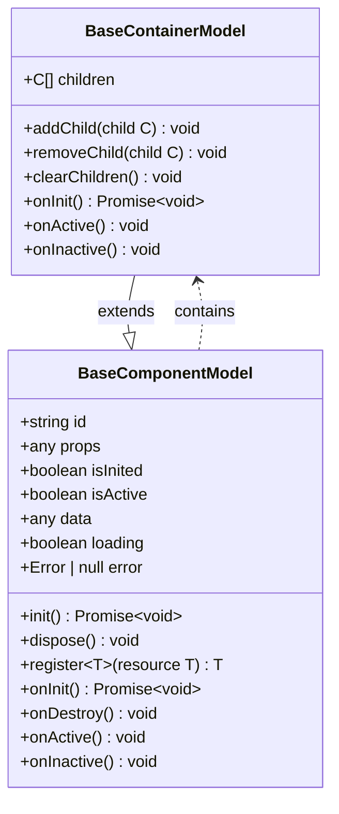
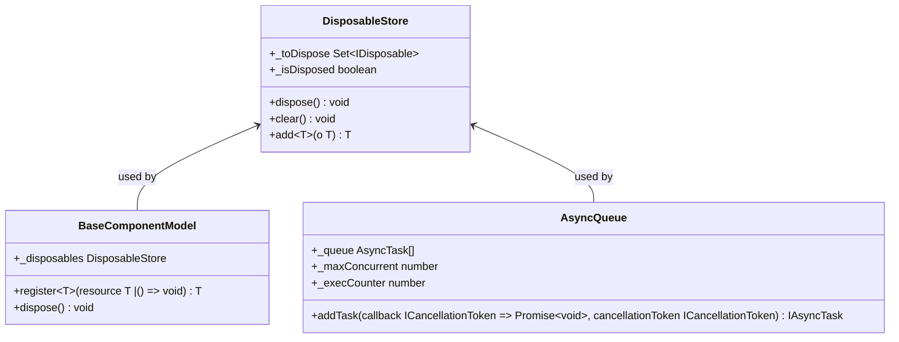

# Advanced Topics

<cite>
**Referenced Files in This Document**   
- [README.md](file://packages/h5-builder/README.md)
- [component_development_guide.md](file://packages/h5-builder/docs/component_development_guide.md)
- [model.ts](file://packages/h5-builder/src/bedrock/model.ts)
- [scheduler.ts](file://packages/h5-builder/src/bedrock/scheduler/core/scheduler.ts)
- [job-scheduler.ts](file://packages/h5-builder/src/bedrock/launch/job-scheduler.ts)
- [instantiation-service.ts](file://packages/h5-builder/src/bedrock/di/instantiation-service.ts)
- [service-registry.ts](file://packages/h5-builder/src/bedrock/di/service-registry.ts)
- [lazy-service.ts](file://packages/h5-builder/src/bedrock/di/lazy/lazy-service.ts)
- [bridge.service.ts](file://packages/h5-builder/src/services/bridge.service.ts)
- [http.service.ts](file://packages/h5-builder/src/services/http.service.ts)
- [di/index.ts](file://packages/h5-builder/src/bedrock/di/index.ts)
- [async/queue/queue.ts](file://packages/h5-builder/src/bedrock/async/queue/queue.ts)
- [dispose/disposable-store.ts](file://packages/h5-builder/src/bedrock/dispose/disposable-store.ts)
</cite>

## Table of Contents
1. [Introduction](#introduction)
2. [Complex Container Components and Dynamic Child Management](#complex-container-components-and-dynamic-child-management)
3. [Advanced State Synchronization](#advanced-state-synchronization)
4. [Framework Extension Points](#framework-extension-points)
5. [Performance Tuning Techniques](#performance-tuning-techniques)
6. [External System Integration](#external-system-integration)
7. [Advanced Debugging and Monitoring](#advanced-debugging-and-monitoring)
8. [Expert-Level Usage Patterns](#expert-level-usage-patterns)
9. [Conclusion](#conclusion)

## Introduction
The H5 Builder Framework is a sophisticated H5 e-commerce construction framework built on dependency injection (DI) and reactive state management using mobx-vue-lite. This document explores advanced topics beyond basic patterns, focusing on complex container components, framework extensibility, performance optimization, external integrations, and advanced debugging strategies. The framework's architecture emphasizes Model-View separation, automated resource management, and a tree-based component structure that enables efficient rendering and lifecycle management.

**Section sources**
- [README.md](file://packages/h5-builder/README.md)

## Complex Container Components and Dynamic Child Management

The H5 Builder Framework provides a robust foundation for creating complex container components through its `BaseContainerModel` class. This base class implements default behaviors for initializing, activating, and deactivating child components, while allowing for extensive customization through inheritance and lifecycle hook overrides.

Container components inherit from `BaseContainerModel`, which extends `BaseComponentModel` and provides built-in management of child models. The framework automatically handles the lifecycle of child components, ensuring proper initialization and cleanup. The `addChild`, `removeChild`, and `clearChildren` methods provide a clean API for dynamic child management, with automatic registration of child components for disposal to prevent memory leaks.

Advanced container patterns include lazy loading of child components, where only the currently active tab or visible items are initialized, while others are preloaded during idle periods using the framework's idle-time scheduling capabilities. This approach significantly improves startup performance for complex layouts with many child components.



**Diagram sources**
- [model.ts](file://packages/h5-builder/src/bedrock/model.ts#L10-L243)

**Section sources**
- [model.ts](file://packages/h5-builder/src/bedrock/model.ts#L157-L243)
- [component_development_guide.md](file://packages/h5-builder/docs/component_development_guide.md#L270-L305)

## Advanced State Synchronization

The framework's state synchronization is built on mobx-vue-lite, providing automatic reactive updates between models and views. The `BaseComponentModel` constructor wraps the instance with `observable`, making all properties reactive by default. This eliminates the need for manual state management and ensures that UI updates are automatically triggered when model properties change.

State synchronization extends beyond simple property changes to include complex scenarios such as computed properties, asynchronous data loading, and error states. The framework provides built-in support for loading states through the `loading` property and error handling through the `error` property, enabling consistent UI patterns across components.

For advanced state synchronization patterns, the framework supports computed properties through getter methods decorated with MobX's `computed` annotation. These computed properties automatically update when their dependencies change, providing an efficient way to derive state without manual subscription management.

The framework also handles state synchronization across component hierarchies through its DI system, allowing parent components to share state with children while maintaining encapsulation. This is particularly useful for container components that need to coordinate state across multiple child components.

**Section sources**
- [model.ts](file://packages/h5-builder/src/bedrock/model.ts#L10-L243)
- [component_development_guide.md](file://packages/h5-builder/docs/component_development_guide.md#L208-L223)

## Framework Extension Points

The H5 Builder Framework provides several extension points that allow developers to customize and extend its functionality. These extension points are designed to maintain the framework's core principles while enabling advanced use cases.

### Custom Services and DI System Extension

The framework's DI system is highly extensible, allowing developers to register custom services and extend the dependency injection container. Services are registered using the `ServiceRegistry` class, which supports both eager and delayed instantiation. The `register` method allows for the registration of service constructors or descriptors, while `registerInstance` enables the direct registration of service instances.

The DI container supports hierarchical containers with parent-child relationships, enabling scoped service resolution. This is particularly useful for creating isolated component trees with their own service instances. The `createChild` method on `InstantiationService` creates a new child container that inherits services from its parent while allowing for overrides.

```mermaid
classDiagram
class InstantiationService {
+_services ServiceCollection
+_parent InstantiationService
+_childs Set~IInstantiationService~
+createChild(services ServiceCollection) IInstantiationService
+invokeFunction~R, TS~(fn (accessor ServicesAccessor, ...args TS) R, ...args TS) R
+createInstance~T~(descriptor SyncDescriptor0~T~) T
+dispose() void
}
class ServiceRegistry {
+_registry [ServiceIdentifier[]any~, SyncDescriptor~any~ | BrandedService]~
+_serviceOwnership ServiceOwnershipCollection
+register~T, Services~(id ServiceIdentifier~T~, ctor new ...Services) => T, supportsDelayedInstantiation boolean | InstantiationType) void
+registerInstance~T~(id ServiceIdentifier~T~, instance T, options {ownership ServiceOwnership}) void
+makeCollection() ServiceCollection
}
class ServiceCollection {
+_entries Map~ServiceIdentifier~any~, any~
+_ownerships ServiceOwnershipCollection
+set~T~(id ServiceIdentifier~T~, instanceOrDescriptor T | SyncDescriptor~T~) void
+get~T~(id ServiceIdentifier~T~) T | SyncDescriptor~T~ | undefined
}
InstantiationService --> ServiceCollection : uses
ServiceRegistry --> ServiceCollection : creates
```

**Diagram sources**
- [instantiation-service.ts](file://packages/h5-builder/src/bedrock/di/instantiation-service.ts#L61-L468)
- [service-registry.ts](file://packages/h5-builder/src/bedrock/di/service-registry.ts#L16-L100)

### Custom Job Types in the Scheduler

The framework's job scheduling system allows for the creation of custom job types through the `JobScheduler` class. Jobs are registered with specific phases and can be prepared, executed, and waited upon in a controlled sequence. The `registerJob` method allows for the registration of job constructors with static arguments, enabling dependency injection into job instances.

Custom jobs extend the `AbstractJob` class and implement phase-specific behavior through the `prepare` and `wait` methods. This enables complex initialization sequences where certain operations must complete before others can begin. The job scheduler also provides cost recording through the `CostRecorder` class, allowing for performance monitoring of job execution.

**Section sources**
- [instantiation-service.ts](file://packages/h5-builder/src/bedrock/di/instantiation-service.ts#L61-L468)
- [service-registry.ts](file://packages/h5-builder/src/bedrock/di/service-registry.ts#L16-L100)
- [job-scheduler.ts](file://packages/h5-builder/src/bedrock/launch/job-scheduler.ts#L1-L123)

## Performance Tuning Techniques

The H5 Builder Framework incorporates several performance optimization techniques for large-scale applications, focusing on memory optimization, startup time reduction, and rendering performance improvements.

### Memory Optimization

The framework employs an automated resource management system based on the Disposable pattern to prevent memory leaks. The `DisposableStore` class acts as a container for disposable resources, automatically cleaning up all registered disposables when the store is disposed. This is integrated into the `BaseComponentModel` through the `_disposables` property, ensuring that all components automatically clean up their resources when destroyed.

The framework also uses weak references and proper event listener management to prevent common memory leak patterns. The `register` method on `BaseComponentModel` provides a convenient way to register cleanup functions or disposable objects, which are automatically executed during component disposal.



**Diagram sources**
- [dispose/disposable-store.ts](file://packages/h5-builder/src/bedrock/dispose/disposable-store.ts#L6-L84)
- [model.ts](file://packages/h5-builder/src/bedrock/model.ts#L10-L243)
- [async/queue/queue.ts](file://packages/h5-builder/src/bedrock/async/queue/queue.ts#L13-L57)

### Startup Time Reduction

The framework reduces startup time through lazy loading and idle-time preheating. The `LazyServiceLoader` class enables the deferred loading of services until they are actually needed, reducing the initial bundle size and initialization time. This is particularly useful for services that are only used in specific scenarios or after user interaction.

The scheduler system also supports idle-time task scheduling, allowing non-critical initialization tasks to be performed during browser idle periods. This prevents these tasks from blocking the main thread during critical rendering phases, improving perceived performance.

### Rendering Performance Improvements

Rendering performance is optimized through the use of reactive state management with mobx-vue-lite, which minimizes unnecessary re-renders by only updating components when their observed state changes. The framework's Model-View separation ensures that rendering logic is isolated from business logic, enabling efficient rendering optimizations.

The job scheduler also contributes to rendering performance by coordinating the timing of component activation and data loading. By deferring non-essential work until after the initial render, the framework ensures that the user interface becomes interactive as quickly as possible.

**Section sources**
- [dispose/disposable-store.ts](file://packages/h5-builder/src/bedrock/dispose/disposable-store.ts#L6-L84)
- [model.ts](file://packages/h5-builder/src/bedrock/model.ts#L10-L243)
- [async/queue/queue.ts](file://packages/h5-builder/src/bedrock/async/queue/queue.ts#L13-L57)
- [scheduler.ts](file://packages/h5-builder/src/bedrock/scheduler/core/scheduler.ts#L24-L174)
- [lazy-service.ts](file://packages/h5-builder/src/bedrock/di/lazy/lazy-service.ts#L19-L72)

## External System Integration

The H5 Builder Framework provides robust mechanisms for integrating with external systems beyond its built-in services. These integrations are designed to be modular and maintainable, following the framework's core principles of separation of concerns and dependency injection.

### Custom Analytics Providers

The framework's tracking service can be extended to support custom analytics providers by implementing the `TrackerService` interface. This allows for the integration of third-party analytics platforms while maintaining a consistent API for event tracking across the application.

### Native App Features

Integration with native app features is achieved through the `BridgeService`, which provides a unified interface for JSBridge communication. The service supports both native calls in a mobile environment and mock responses in a browser environment, enabling seamless development and testing.

The `BridgeService` implements a request-response pattern with timeout handling and error recovery, ensuring reliable communication with native code. It also provides helper methods for common native operations such as showing toasts, navigation, and sharing, abstracting away the underlying platform-specific implementations.

```mermaid
classDiagram
class BridgeService {
+isDebug boolean
+mockResponses Map~string, any~
+call~T~(method string, params BridgeCallParams, timeout number) Promise~T~
+setMockResponse(method string, data any) void
+setMockResponses(responses Record~string, any~) void
+dispose() void
}
class BridgeHelpers {
+bridge BridgeService
+getUserInfo() Promise~{userId string, userName string, avatar string}~
+toast(message string, duration number) Promise~void~
+navigate(url string, params Record~string, any~) Promise~void~
+share(options {title string, content string, url string, imageUrl string}) Promise~void~
+fetch~T~(options {url string, method HttpMethod, headers Record~string, string~, body any, timeout number}) Promise~T~
}
class HttpService {
+requestInterceptors RequestInterceptor[]
+responseInterceptors ResponseInterceptor[]
+errorInterceptors ErrorInterceptor[]
+pendingRequests Set~AbortController~
+request~T~(config HttpRequestConfig) Promise~T~
+get~T~(url string, config HttpRequestConfig) Promise~T~
+post~T~(url string, data any, config HttpRequestConfig) Promise~T~
+put~T~(url string, data any, config HttpRequestConfig) Promise~T~
+delete~T~(url string, config HttpRequestConfig) Promise~T~
+cancelAll() void
+dispose() void
}
BridgeService <-- HttpService : used by
BridgeService <-- BridgeHelpers : used by
```

**Diagram sources**
- [bridge.service.ts](file://packages/h5-builder/src/services/bridge.service.ts#L39-L227)
- [http.service.ts](file://packages/h5-builder/src/services/http.service.ts#L56-L281)

**Section sources**
- [bridge.service.ts](file://packages/h5-builder/src/services/bridge.service.ts#L39-L227)
- [http.service.ts](file://packages/h5-builder/src/services/http.service.ts#L56-L281)

## Advanced Debugging and Monitoring

The framework provides comprehensive debugging and monitoring capabilities for production applications. These features are designed to help developers identify and resolve issues quickly while minimizing the impact on application performance.

### Error Handling and Isolation

The framework implements error isolation to prevent component-level errors from affecting the entire application. Each component is responsible for handling its own errors, with built-in support for error states in the `BaseComponentModel`. This allows components to gracefully handle failures and provide meaningful feedback to users.

The DI system also includes error handling for service resolution, with detailed error messages that help identify missing dependencies or circular dependencies. The `InstantiationService` provides an `onError` event that can be used to monitor and log service instantiation errors.

### Performance Monitoring

The job scheduler includes built-in performance monitoring through the `CostRecorder` class, which tracks the execution time of jobs and phases. This information can be retrieved using the `getCost` method and used to identify performance bottlenecks in the application's initialization sequence.

The framework also supports tracing of service instantiation and method invocation when enabled, providing detailed insights into the application's execution flow. This can be particularly useful for optimizing startup performance and identifying unnecessary work.

### Debugging Tools

The framework includes several debugging tools, such as the ability to register mock responses for bridge calls, enabling development and testing in a browser environment. The `BridgeService` supports debug mode, which automatically uses mock responses when the native bridge is not available.

The component development guide also provides guidance on testing components using Vitest, with examples of how to mock services and test component behavior in isolation.

**Section sources**
- [job-scheduler.ts](file://packages/h5-builder/src/bedrock/launch/job-scheduler.ts#L1-L123)
- [instantiation-service.ts](file://packages/h5-builder/src/bedrock/di/instantiation-service.ts#L61-L468)
- [bridge.service.ts](file://packages/h5-builder/src/services/bridge.service.ts#L39-L227)
- [component_development_guide.md](file://packages/h5-builder/docs/component_development_guide.md#L406-L449)

## Expert-Level Usage Patterns

The H5 Builder Framework supports several expert-level usage patterns that enable sophisticated component behavior and application architecture.

### Container Component Patterns

Advanced container components can override the default lifecycle behavior to implement custom initialization sequences. For example, a tabs container might only initialize the first tab immediately while preloading others during idle periods. This pattern balances startup performance with user experience, ensuring that the most likely content is available immediately while preparing other content in the background.

### Service Extension Patterns

Custom services can extend the framework's built-in services to add domain-specific functionality. For example, a custom HTTP service might add request batching, caching, or specialized error handling for a particular API. These extensions can be registered with the DI container to replace or augment the default implementations.

### Job Orchestration

Complex initialization sequences can be orchestrated using custom job types that coordinate the loading of data, components, and services. This allows for fine-grained control over the application startup process, ensuring that critical resources are loaded first while deferring non-essential work.

**Section sources**
- [component_development_guide.md](file://packages/h5-builder/docs/component_development_guide.md#L270-L305)
- [model.ts](file://packages/h5-builder/src/bedrock/model.ts#L157-L243)
- [job-scheduler.ts](file://packages/h5-builder/src/bedrock/launch/job-scheduler.ts#L1-L123)

## Conclusion
The H5 Builder Framework provides a comprehensive set of advanced features for building sophisticated H5 applications. Its extensible architecture, performance optimizations, and robust integration capabilities make it well-suited for complex e-commerce applications. By leveraging the framework's advanced patterns and extension points, developers can create highly performant, maintainable, and scalable applications that deliver excellent user experiences.

The framework's emphasis on separation of concerns, automated resource management, and reactive state synchronization reduces the cognitive load on developers while ensuring consistent application behavior. Its comprehensive debugging and monitoring tools enable rapid development and reliable production deployments.