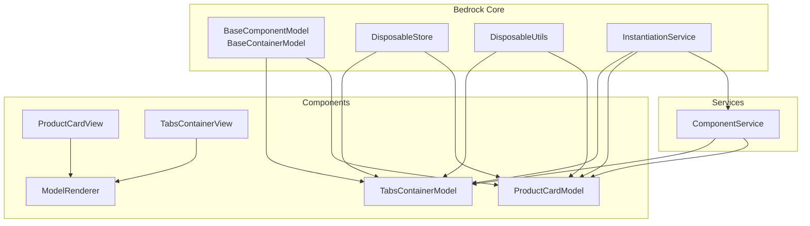
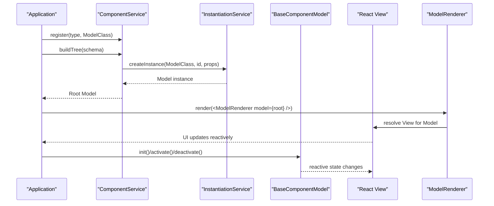
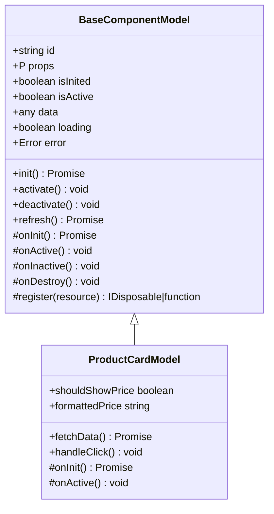
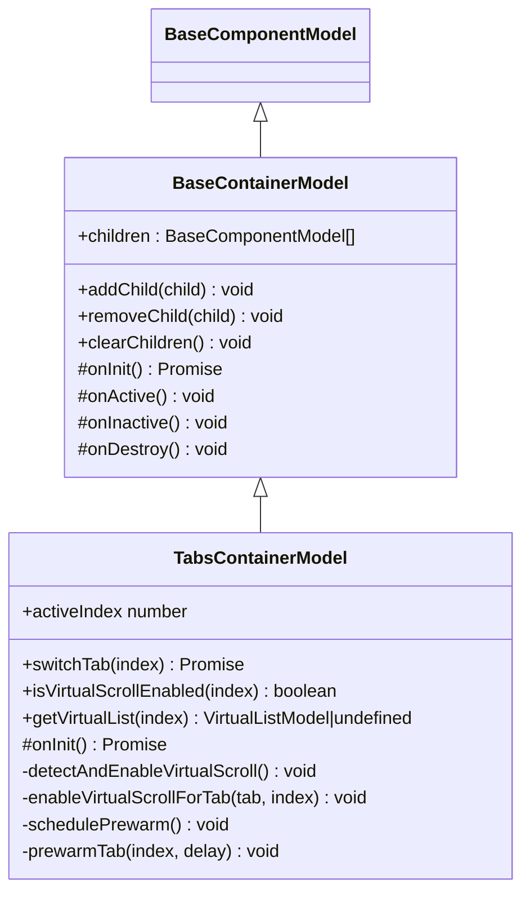
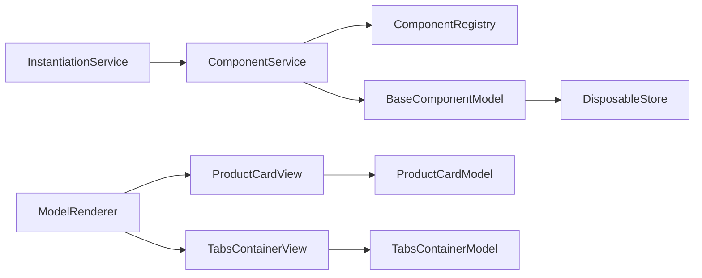

# Custom Component Development

<cite>
**Referenced Files in This Document**
- [model.ts](file://packages/h5-builder/src/bedrock/model.ts)
- [product-card.model.ts](file://packages/h5-builder/src/components/product-card/product-card.model.ts)
- [product-card.view.tsx](file://packages/h5-builder/src/components/product-card/product-card.view.tsx)
- [tabs-container.model.ts](file://packages/h5-builder/src/components/tabs-container/tabs-container.model.ts)
- [tabs-container.view.tsx](file://packages/h5-builder/src/components/tabs-container/tabs-container.view.tsx)
- [model-renderer.tsx](file://packages/h5-builder/src/components/model-renderer.tsx)
- [component.service.ts](file://packages/h5-builder/src/services/component.service.ts)
- [lifecycle.ts](file://packages/h5-builder/src/jobs/lifecycle.ts)
- [disposable-store.ts](file://packages/h5-builder/src/bedrock/dispose/disposable-store.ts)
- [disposable-utils.ts](file://packages/h5-builder/src/bedrock/dispose/disposable-utils.ts)
- [instantiation-service.ts](file://packages/h5-builder/src/bedrock/di/instantiation-service.ts)
- [component_development_guide.md](file://packages/h5-builder/docs/component_development_guide.md)
</cite>

## Table of Contents
1. [Introduction](#introduction)
2. [Project Structure](#project-structure)
3. [Core Components](#core-components)
4. [Architecture Overview](#architecture-overview)
5. [Detailed Component Analysis](#detailed-component-analysis)
6. [Dependency Analysis](#dependency-analysis)
7. [Performance Considerations](#performance-considerations)
8. [Troubleshooting Guide](#troubleshooting-guide)
9. [Conclusion](#conclusion)
10. [Appendices](#appendices)

## Introduction
This document explains how to develop custom components in the H5 Builder Framework. It focuses on creating new component models by extending BaseComponentModel or BaseContainerModel, implementing lifecycle hooks (onInit, onActive, onDestroy), defining TypeScript props interfaces, injecting dependencies via the DI system, building React View components with the observer pattern from mobx-vue-lite, and managing state, error handling, and resource cleanup using the Disposable pattern. It also demonstrates how to register components with ComponentService and ModelRenderer so they can be used in schemas.

## Project Structure
H5 Builder organizes components into logical folders under src/components, each containing a model and a view. The framework’s core abstractions live under src/bedrock, including BaseComponentModel/BaseContainerModel, DI infrastructure, and disposal utilities. ComponentService handles schema-to-model conversion and asynchronous loading. ModelRenderer maps models to views.

**Diagram sources**
- [model.ts](file://packages/h5-builder/src/bedrock/model.ts#L1-L243)
- [product-card.model.ts](file://packages/h5-builder/src/components/product-card/product-card.model.ts#L1-L133)
- [product-card.view.tsx](file://packages/h5-builder/src/components/product-card/product-card.view.tsx#L1-L81)
- [tabs-container.model.ts](file://packages/h5-builder/src/components/tabs-container/tabs-container.model.ts#L1-L273)
- [tabs-container.view.tsx](file://packages/h5-builder/src/components/tabs-container/tabs-container.view.tsx#L1-L85)
- [model-renderer.tsx](file://packages/h5-builder/src/components/model-renderer.tsx#L1-L105)
- [component.service.ts](file://packages/h5-builder/src/services/component.service.ts#L1-L735)
- [disposable-store.ts](file://packages/h5-builder/src/bedrock/dispose/disposable-store.ts#L1-L84)
- [disposable-utils.ts](file://packages/h5-builder/src/bedrock/dispose/disposable-utils.ts#L1-L29)
- [instantiation-service.ts](file://packages/h5-builder/src/bedrock/di/instantiation-service.ts#L1-L468)

**Section sources**
- [model.ts](file://packages/h5-builder/src/bedrock/model.ts#L1-L243)
- [component.service.ts](file://packages/h5-builder/src/services/component.service.ts#L1-L735)
- [model-renderer.tsx](file://packages/h5-builder/src/components/model-renderer.tsx#L1-L105)

## Core Components
- BaseComponentModel: Provides reactive state (loading, error, data), lifecycle hooks (onInit, onActive, onInactive, onDestroy), and a resource disposal mechanism via register and DisposableStore.
- BaseContainerModel: Extends BaseComponentModel to manage child models, with default behaviors for initializing, activating, and deactivating all children.
- ProductCardModel: Demonstrates fetching data, exposing computed properties, and emitting analytics events.
- TabsContainerModel: Demonstrates container lifecycle customization, lazy initialization, virtual scrolling integration, and pre-warming strategies.
- ModelRenderer: Maps model constructors to view components and renders placeholders for unknown or special models.
- ComponentService: Builds model trees from schemas, registers components, and supports asynchronous loading with concurrent scheduling and error fallbacks.
- DI (InstantiationService): Creates instances with injected dependencies and tracks disposables.

**Section sources**
- [model.ts](file://packages/h5-builder/src/bedrock/model.ts#L1-L243)
- [product-card.model.ts](file://packages/h5-builder/src/components/product-card/product-card.model.ts#L1-L133)
- [tabs-container.model.ts](file://packages/h5-builder/src/components/tabs-container/tabs-container.model.ts#L1-L273)
- [model-renderer.tsx](file://packages/h5-builder/src/components/model-renderer.tsx#L1-L105)
- [component.service.ts](file://packages/h5-builder/src/services/component.service.ts#L1-L735)
- [instantiation-service.ts](file://packages/h5-builder/src/bedrock/di/instantiation-service.ts#L1-L468)

## Architecture Overview
The framework follows a Model-View separation with DI-driven instantiation and lifecycle orchestration.

**Diagram sources**
- [component.service.ts](file://packages/h5-builder/src/services/component.service.ts#L130-L209)
- [instantiation-service.ts](file://packages/h5-builder/src/bedrock/di/instantiation-service.ts#L150-L209)
- [model-renderer.tsx](file://packages/h5-builder/src/components/model-renderer.tsx#L46-L105)
- [model.ts](file://packages/h5-builder/src/bedrock/model.ts#L60-L155)

## Detailed Component Analysis

### Creating a New Component Model
Steps:
1. Define a TypeScript interface for props.
2. Extend BaseComponentModel or BaseContainerModel depending on whether the component hosts children.
3. Implement lifecycle hooks:
   - onInit: initialize resources and data fetching.
   - onActive/onInactive: resume/pause timers or subscriptions.
   - onDestroy: clean up via register or explicit disposal.
4. Inject dependencies using the DI system (constructor injection).
5. Expose computed properties for derived UI state.
6. Register the model with ComponentService and map it to a View in ModelRenderer.

Example references:
- ProductCardModel defines props and data fetching, exposes computed properties, and emits analytics.
- TabsContainerModel customizes container lifecycle to support lazy loading, virtual scrolling, and pre-warming.

**Section sources**
- [product-card.model.ts](file://packages/h5-builder/src/components/product-card/product-card.model.ts#L1-L133)
- [tabs-container.model.ts](file://packages/h5-builder/src/components/tabs-container/tabs-container.model.ts#L1-L273)
- [model.ts](file://packages/h5-builder/src/bedrock/model.ts#L1-L243)

### Defining Props with TypeScript Interfaces
- ProductCardProps: declares required and optional props for the component.
- TabsContainerProps: includes nested configuration for virtual scrolling behavior.

Best practices:
- Keep props minimal and typed.
- Use optional fields where appropriate.
- Avoid embedding complex logic in props; pass primitives or small DTOs.

**Section sources**
- [product-card.model.ts](file://packages/h5-builder/src/components/product-card/product-card.model.ts#L17-L24)
- [tabs-container.model.ts](file://packages/h5-builder/src/components/tabs-container/tabs-container.model.ts#L7-L18)

### Dependency Injection with DI Container
- Constructor injection is supported by the DI system. Services are resolved and passed to the model.
- ComponentService uses the instantiation service to create model instances with injected dependencies.

Key points:
- Ensure services are registered in the DI container before resolving models.
- Use the instantiation service to create instances with proper dependency resolution.

**Section sources**
- [instantiation-service.ts](file://packages/h5-builder/src/bedrock/di/instantiation-service.ts#L150-L209)
- [component.service.ts](file://packages/h5-builder/src/services/component.service.ts#L164-L185)

### Creating Associated View Components with React and observer
- Views receive a model via props and render based on reactive state.
- Use observer from mobx-vue-lite to automatically subscribe to model changes.
- Keep View logic free of business logic; delegate actions to model methods.

Examples:
- ProductCardView renders loading/error/success states and triggers model actions.
- TabsContainerView conditionally renders either a virtual list or a plain renderer based on container configuration.

**Section sources**
- [product-card.view.tsx](file://packages/h5-builder/src/components/product-card/product-card.view.tsx#L1-L81)
- [tabs-container.view.tsx](file://packages/h5-builder/src/components/tabs-container/tabs-container.view.tsx#L1-L85)

### Lifecycle Implementation
- onInit: Initialize resources and data fetching. Must return a Promise.
- onActive/onInactive: Resume or pause timers/subscriptions.
- onDestroy: Perform cleanup; the base class disposes registered resources.

Patterns:
- ProductCardModel: onInit delegates to refresh; onActive emits exposure analytics.
- TabsContainerModel: overrides onInit to lazily initialize the active tab and schedule pre-warming.

**Section sources**
- [model.ts](file://packages/h5-builder/src/bedrock/model.ts#L60-L155)
- [product-card.model.ts](file://packages/h5-builder/src/components/product-card/product-card.model.ts#L42-L60)
- [tabs-container.model.ts](file://packages/h5-builder/src/components/tabs-container/tabs-container.model.ts#L68-L96)

### State Management, Computed Properties, and Error Handling
- Reactive state: loading, error, data are provided by the base class and updated in refresh.
- Computed properties: derived UI state (e.g., shouldShowPrice, formattedPrice).
- Error handling: refresh sets error on failure; views render error state and offer retry.

**Section sources**
- [model.ts](file://packages/h5-builder/src/bedrock/model.ts#L107-L122)
- [product-card.model.ts](file://packages/h5-builder/src/components/product-card/product-card.model.ts#L118-L132)
- [product-card.view.tsx](file://packages/h5-builder/src/components/product-card/product-card.view.tsx#L28-L46)

### Resource Cleanup Using the Disposable Pattern
- register: Register cleanup functions or IDisposable objects; they are invoked when the model is disposed.
- DisposableStore: Centralized disposal collection with LIFO order and error aggregation.
- Disposal utilities: Helpers to safely wrap and transfer disposables.

Common patterns:
- Register timers, event unsubscribers, or child model disposables.
- Dispose containers to cascade cleanup to children.

**Section sources**
- [model.ts](file://packages/h5-builder/src/bedrock/model.ts#L28-L59)
- [disposable-store.ts](file://packages/h5-builder/src/bedrock/dispose/disposable-store.ts#L1-L84)
- [disposable-utils.ts](file://packages/h5-builder/src/bedrock/dispose/disposable-utils.ts#L1-L29)
- [tabs-container.model.ts](file://packages/h5-builder/src/components/tabs-container/tabs-container.model.ts#L141-L152)

### Registering Components with ComponentService and ModelRenderer
- ComponentService.register/registerAll: Registers component types to model classes.
- ComponentService.buildTree: Validates schema and constructs a model tree with children.
- ModelRenderer.registerModelView/registerModelViews: Maps model classes to view components.
- Asynchronous loading: ComponentService supports separate model/view loaders with concurrency control and error fallbacks.

Registration flow:
- Register component types with ComponentService.
- Register model-view mappings with ModelRenderer.
- Optionally preload resources and build the model tree.

**Section sources**
- [component.service.ts](file://packages/h5-builder/src/services/component.service.ts#L116-L185)
- [model-renderer.tsx](file://packages/h5-builder/src/components/model-renderer.tsx#L12-L31)
- [model-renderer.tsx](file://packages/h5-builder/src/components/model-renderer.tsx#L33-L60)
- [component.service.ts](file://packages/h5-builder/src/services/component.service.ts#L283-L317)
- [component.service.ts](file://packages/h5-builder/src/services/component.service.ts#L370-L420)
- [component.service.ts](file://packages/h5-builder/src/services/component.service.ts#L422-L471)
- [component.service.ts](file://packages/h5-builder/src/services/component.service.ts#L496-L513)

### Concrete Examples: ProductCard and TabsContainer

#### ProductCard
- Props: productId, showPrice.
- Lifecycle: onInit calls refresh; onActive emits exposure analytics.
- Data fetching: refresh updates data and error/loading states.
- Computed: shouldShowPrice, formattedPrice.
- View: observer-based rendering with loading/error/success branches.

**Diagram sources**
- [model.ts](file://packages/h5-builder/src/bedrock/model.ts#L1-L243)
- [product-card.model.ts](file://packages/h5-builder/src/components/product-card/product-card.model.ts#L1-L133)

**Section sources**
- [product-card.model.ts](file://packages/h5-builder/src/components/product-card/product-card.model.ts#L1-L133)
- [product-card.view.tsx](file://packages/h5-builder/src/components/product-card/product-card.view.tsx#L1-L81)

#### TabsContainer
- Props: defaultIndex, virtualScroll configuration.
- Lifecycle: Overrides onInit to detect virtual scrolling thresholds, initialize the active tab, and schedule pre-warming.
- Virtual scrolling: Detects eligible tabs and wraps children with a virtual list.
- Switching: Lazy initializes inactive tabs and manages activation/deactivation.

**Diagram sources**
- [model.ts](file://packages/h5-builder/src/bedrock/model.ts#L158-L243)
- [tabs-container.model.ts](file://packages/h5-builder/src/components/tabs-container/tabs-container.model.ts#L1-L273)

**Section sources**
- [tabs-container.model.ts](file://packages/h5-builder/src/components/tabs-container/tabs-container.model.ts#L1-L273)
- [tabs-container.view.tsx](file://packages/h5-builder/src/components/tabs-container/tabs-container.view.tsx#L1-L85)

### Step-by-Step: Building a New Component
1. Define props interface.
2. Create model class extending BaseComponentModel or BaseContainerModel.
3. Implement onInit/onActive/onDestroy and expose computed properties.
4. Inject services via constructor injection.
5. Create a React view component using observer and render based on model state.
6. Register the model with ComponentService and map it to the view with ModelRenderer.
7. Use the component in a schema and build the model tree.

**Section sources**
- [component_development_guide.md](file://packages/h5-builder/docs/component_development_guide.md#L37-L170)
- [component.service.ts](file://packages/h5-builder/src/services/component.service.ts#L116-L185)
- [model-renderer.tsx](file://packages/h5-builder/src/components/model-renderer.tsx#L12-L31)

## Dependency Analysis
- ComponentService depends on InstantiationService for creating model instances and on ComponentRegistry for type-to-class mapping.
- BaseComponentModel integrates with DisposableStore for resource management.
- ModelRenderer depends on a global model-view map populated by ComponentService or manual registration.

**Diagram sources**
- [component.service.ts](file://packages/h5-builder/src/services/component.service.ts#L1-L735)
- [instantiation-service.ts](file://packages/h5-builder/src/bedrock/di/instantiation-service.ts#L1-L468)
- [model.ts](file://packages/h5-builder/src/bedrock/model.ts#L1-L243)
- [model-renderer.tsx](file://packages/h5-builder/src/components/model-renderer.tsx#L1-L105)

**Section sources**
- [component.service.ts](file://packages/h5-builder/src/services/component.service.ts#L1-L735)
- [model.ts](file://packages/h5-builder/src/bedrock/model.ts#L1-L243)

## Performance Considerations
- Lazy initialization and pre-warming: TabsContainer demonstrates selective initialization and scheduled warmup to improve perceived performance.
- Virtual scrolling: Automatically enable virtual lists for large child collections to reduce DOM and memory footprint.
- Concurrency control: ComponentService supports configurable concurrency for model and view loading.
- Gradual rendering: Use lifecycle stages to progressively reveal content.

**Section sources**
- [tabs-container.model.ts](file://packages/h5-builder/src/components/tabs-container/tabs-container.model.ts#L181-L248)
- [component.service.ts](file://packages/h5-builder/src/services/component.service.ts#L278-L282)
- [lifecycle.ts](file://packages/h5-builder/src/jobs/lifecycle.ts#L1-L18)

## Troubleshooting Guide
Common pitfalls and remedies:
- Non-responsive state: Ensure reactive properties are declared on the model class and updated synchronously; avoid mutating private fields without reactivity.
- Memory leaks: Always register cleanup functions for timers, event listeners, and child models; rely on DisposableStore to dispose them.
- Dependency injection failures: Verify services are registered and the DI container is configured; ensure constructor parameters match service identifiers.
- Unknown component type: Confirm the component is registered with ComponentService and the schema type matches.

**Section sources**
- [disposable-store.ts](file://packages/h5-builder/src/bedrock/dispose/disposable-store.ts#L1-L84)
- [disposable-utils.ts](file://packages/h5-builder/src/bedrock/dispose/disposable-utils.ts#L1-L29)
- [component.service.ts](file://packages/h5-builder/src/services/component.service.ts#L211-L227)
- [component_development_guide.md](file://packages/h5-builder/docs/component_development_guide.md#L453-L496)

## Conclusion
By following the Model-View separation, leveraging BaseComponentModel/BaseContainerModel, implementing lifecycle hooks, using DI for dependency injection, and applying the Disposable pattern for cleanup, you can build robust, scalable components in H5 Builder. Register components with ComponentService and ModelRenderer to integrate them seamlessly into schemas and progressive rendering workflows.

## Appendices

### Best Practices Checklist
- Keep props minimal and strongly typed.
- Implement onInit/onActive/onDestroy consistently.
- Use computed properties for derived UI state.
- Register cleanup via register and DisposableStore.
- Prefer lazy initialization and virtualization for large lists.
- Use observer in views to react to model changes.
- Register components with ComponentService and ModelRenderer.

[No sources needed since this section provides general guidance]