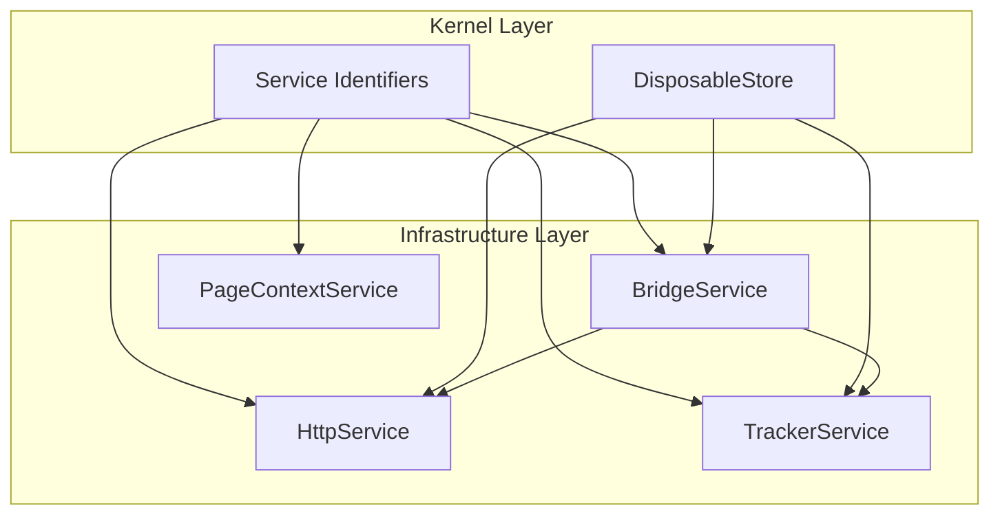
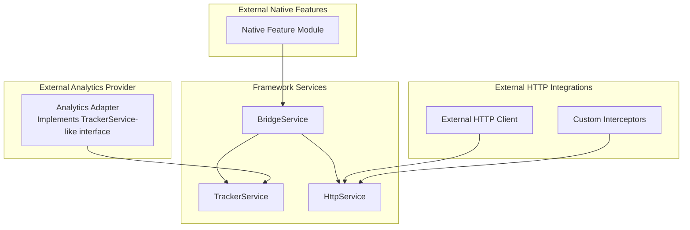
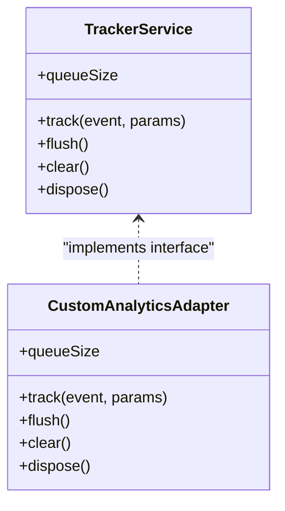
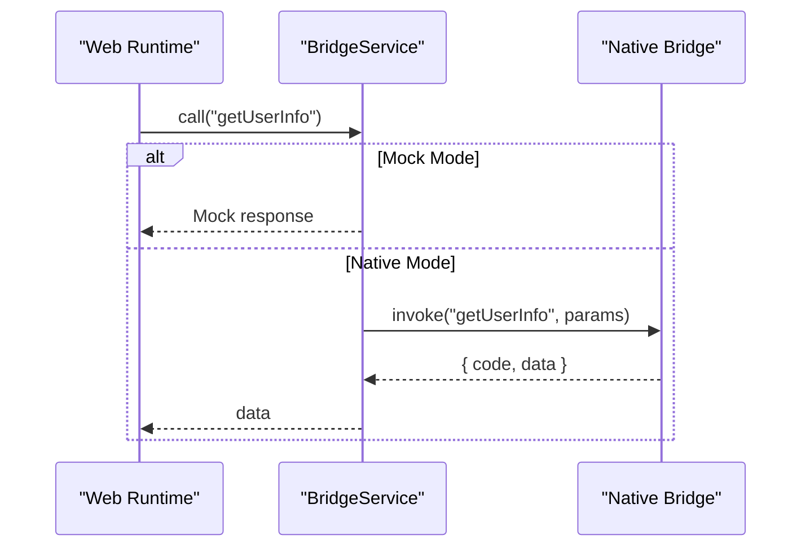
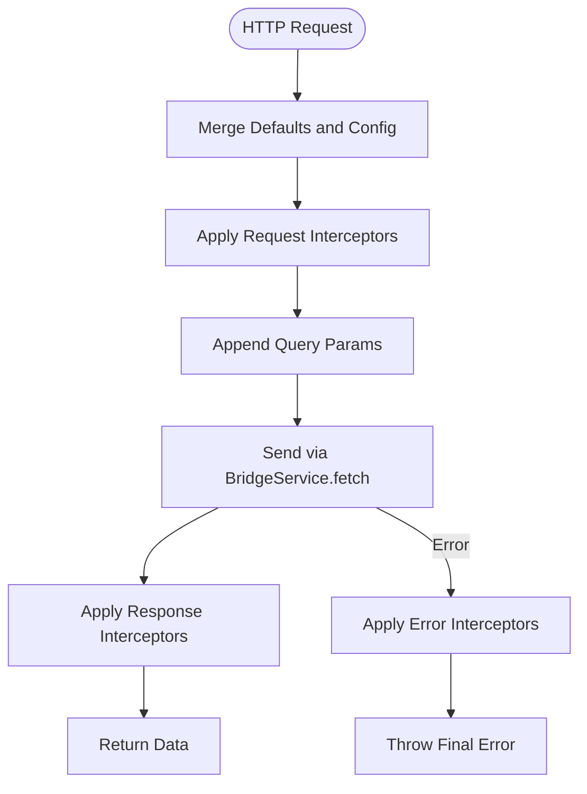
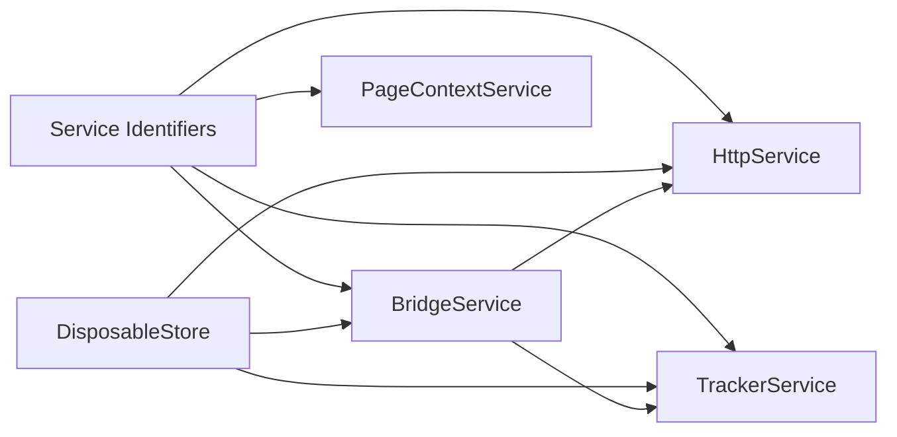

# External System Integration

<cite>
**Referenced Files in This Document**
- [README.md](file://packages/h5-builder/README.md)
- [api_reference.md](file://packages/h5-builder/docs/api_reference.md)
- [tracker.service.ts](file://packages/h5-builder/src/services/tracker.service.ts)
- [bridge.service.ts](file://packages/h5-builder/src/services/bridge.service.ts)
- [http.service.ts](file://packages/h5-builder/src/services/http.service.ts)
- [service-identifiers.ts](file://packages/h5-builder/src/services/service-identifiers.ts)
- [disposable-store.ts](file://packages/h5-builder/src/bedrock/dispose/disposable-store.ts)
- [context.service.ts](file://packages/h5-builder/src/services/context.service.ts)
- [tracker.service.test.ts](file://packages/h5-builder/src/__tests__/tracker.service.test.ts)
- [bridge.service.test.ts](file://packages/h5-builder/src/__tests__/bridge.service.test.ts)
- [http.service.test.ts](file://packages/h5-builder/src/__tests__/http.service.test.ts)
</cite>

## Table of Contents
1. [Introduction](#introduction)
2. [Project Structure](#project-structure)
3. [Core Components](#core-components)
4. [Architecture Overview](#architecture-overview)
5. [Detailed Component Analysis](#detailed-component-analysis)
6. [Dependency Analysis](#dependency-analysis)
7. [Performance Considerations](#performance-considerations)
8. [Troubleshooting Guide](#troubleshooting-guide)
9. [Conclusion](#conclusion)
10. [Appendices](#appendices)

## Introduction
This document explains how to integrate the H5 Builder Framework with external systems beyond the built-in services. It focuses on:
- Creating custom analytics providers by extending the TrackerService interface and implementing new tracking adapters
- Integrating with native app features through the BridgeService, including bidirectional communication and platform-specific implementations
- Extending the HttpService with custom interceptors, authentication handlers, and response transformers
- Patterns for integrating with external state management systems or event buses while maintaining Model-View separation
- Security considerations, error handling, and testing strategies for external integrations

## Project Structure
The H5 Builder Framework organizes infrastructure services under the services layer. The relevant modules for external integration are:
- BridgeService: Unified JSBridge adapter for native app features
- HttpService: HTTP client built on BridgeService with interceptors
- TrackerService: Analytics batching and persistence layer
- Service identifiers: DI tokens for dependency injection
- DisposableStore: Resource cleanup for safe lifecycle management
- PageContextService: Shared page-level state for cross-cutting concerns

**Diagram sources**
- [bridge.service.ts](file://packages/h5-builder/src/services/bridge.service.ts#L1-L227)
- [http.service.ts](file://packages/h5-builder/src/services/http.service.ts#L1-L281)
- [tracker.service.ts](file://packages/h5-builder/src/services/tracker.service.ts#L1-L290)
- [service-identifiers.ts](file://packages/h5-builder/src/services/service-identifiers.ts#L1-L20)
- [disposable-store.ts](file://packages/h5-builder/src/bedrock/dispose/disposable-store.ts#L1-L84)
- [context.service.ts](file://packages/h5-builder/src/services/context.service.ts#L1-L187)

**Section sources**
- [README.md](file://packages/h5-builder/README.md#L1-L232)
- [api_reference.md](file://packages/h5-builder/docs/api_reference.md#L276-L680)

## Core Components
- BridgeService: Provides unified invocation of native features via a method name and parameters. Supports mock mode for browser debugging and timeout handling.
- HttpService: Wraps BridgeService.fetch to provide request/response/error interceptors, query parameter handling, and request cancellation.
- TrackerService: Manages analytics events in a queue, supports batching, persistence, and debug mode. Relies on BridgeService for sending events.
- Service Identifiers: Decorators used for DI registration and resolution.
- DisposableStore: Ensures resources are cleaned up deterministically during disposal.
- PageContextService: Shared reactive state for user, environment, routing, and visibility.

**Section sources**
- [bridge.service.ts](file://packages/h5-builder/src/services/bridge.service.ts#L1-L227)
- [http.service.ts](file://packages/h5-builder/src/services/http.service.ts#L1-L281)
- [tracker.service.ts](file://packages/h5-builder/src/services/tracker.service.ts#L1-L290)
- [service-identifiers.ts](file://packages/h5-builder/src/services/service-identifiers.ts#L1-L20)
- [disposable-store.ts](file://packages/h5-builder/src/bedrock/dispose/disposable-store.ts#L1-L84)
- [context.service.ts](file://packages/h5-builder/src/services/context.service.ts#L1-L187)

## Architecture Overview
The framework’s infrastructure layer exposes services that external systems can extend or wrap. The following diagram shows how external analytics, HTTP integrations, and native features are layered.

**Diagram sources**
- [tracker.service.ts](file://packages/h5-builder/src/services/tracker.service.ts#L1-L290)
- [http.service.ts](file://packages/h5-builder/src/services/http.service.ts#L1-L281)
- [bridge.service.ts](file://packages/h5-builder/src/services/bridge.service.ts#L1-L227)

## Detailed Component Analysis

### Analytics Integration: Custom Providers and Adapters
This section explains how to create custom analytics providers by extending the TrackerService interface and implementing new tracking adapters.

- Extendable interface: TrackerService defines the core contract for analytics events and batching. You can implement a custom adapter that adheres to the same interface to integrate with third-party analytics platforms.
- Event batching and persistence: TrackerService batches events and persists them to localStorage when enabled. Your adapter can reuse or replace these mechanisms.
- Debug mode: TrackerService supports a debug mode that synchronously sends events and shows UI feedback via BridgeService. Your adapter can mirror this behavior for development.
- Lifecycle: TrackerService disposes timers and flushes remaining events on disposal. Ensure your adapter follows the same lifecycle semantics.

**Diagram sources**
- [tracker.service.ts](file://packages/h5-builder/src/services/tracker.service.ts#L1-L290)

**Section sources**
- [tracker.service.ts](file://packages/h5-builder/src/services/tracker.service.ts#L1-L290)
- [tracker.service.test.ts](file://packages/h5-builder/src/__tests__/tracker.service.test.ts#L1-L226)

### Native App Integration via BridgeService
BridgeService provides a unified interface to native app features. It supports:
- Mock mode for browser debugging with configurable responses
- Native mode with timeout protection and error handling
- Helpers for common operations (user info, toast, navigation, share, fetch)

Patterns for bidirectional communication and platform-specific implementations:
- Define a method contract for your native feature and register it in the native bridge. Use BridgeService.call to invoke it from the web runtime.
- For bidirectional communication, implement callbacks from native to web by invoking a registered handler in the web runtime. BridgeService can expose a registration mechanism for such callbacks if needed.
- Platform-specific implementations: Use environment detection or feature flags to branch behavior. PageContextService can help detect platform and app version.

**Diagram sources**
- [bridge.service.ts](file://packages/h5-builder/src/services/bridge.service.ts#L1-L227)
- [context.service.ts](file://packages/h5-builder/src/services/context.service.ts#L1-L187)

**Section sources**
- [bridge.service.ts](file://packages/h5-builder/src/services/bridge.service.ts#L1-L227)
- [bridge.service.test.ts](file://packages/h5-builder/src/__tests__/bridge.service.test.ts#L1-L132)
- [context.service.ts](file://packages/h5-builder/src/services/context.service.ts#L1-L187)

### Third-Party API Integration via HttpService
HttpService wraps BridgeService.fetch and adds:
- Request/response/error interceptors
- Query parameter serialization
- Request cancellation
- Default configuration and optional base URL and token injection

Patterns for custom interceptors, authentication, and response transformation:
- Authentication: Add a request interceptor to inject Authorization headers or tokens.
- Request transformation: Modify URLs, headers, or payload before sending.
- Response transformation: Normalize responses or map to domain models.
- Error handling: Centralize error logging and retry policies via error interceptors.
- Cancellation: Use cancelAll to abort pending requests on navigation or component unmount.

**Diagram sources**
- [http.service.ts](file://packages/h5-builder/src/services/http.service.ts#L1-L281)

**Section sources**
- [http.service.ts](file://packages/h5-builder/src/services/http.service.ts#L1-L281)
- [http.service.test.ts](file://packages/h5-builder/src/__tests__/http.service.test.ts#L1-L252)

### External State Management and Event Bus Integration
To integrate with external state management systems or event buses while preserving Model-View separation:
- Keep state in PageContextService or dedicated services. Expose read-only observables to views.
- Emit events via TrackerService or a dedicated event bus service. Views subscribe to events through MobX observables.
- Avoid coupling views to external stores; pass state and actions via props from models.
- Use DI to inject external services into models or services, not directly into views.

Patterns:
- Reactive state: Use PageContextService to centralize user, environment, and route info.
- Event-driven updates: Use event interceptors in HttpService to dispatch domain events.
- Analytics-driven state: Use TrackerService to emit events that external analytics stores can consume.

**Section sources**
- [context.service.ts](file://packages/h5-builder/src/services/context.service.ts#L1-L187)
- [http.service.ts](file://packages/h5-builder/src/services/http.service.ts#L1-L281)
- [tracker.service.ts](file://packages/h5-builder/src/services/tracker.service.ts#L1-L290)

## Dependency Analysis
The services rely on DI identifiers and DisposableStore for lifecycle management. The following diagram shows key dependencies.

**Diagram sources**
- [service-identifiers.ts](file://packages/h5-builder/src/services/service-identifiers.ts#L1-L20)
- [disposable-store.ts](file://packages/h5-builder/src/bedrock/dispose/disposable-store.ts#L1-L84)
- [bridge.service.ts](file://packages/h5-builder/src/services/bridge.service.ts#L1-L227)
- [http.service.ts](file://packages/h5-builder/src/services/http.service.ts#L1-L281)
- [tracker.service.ts](file://packages/h5-builder/src/services/tracker.service.ts#L1-L290)
- [context.service.ts](file://packages/h5-builder/src/services/context.service.ts#L1-L187)

**Section sources**
- [service-identifiers.ts](file://packages/h5-builder/src/services/service-identifiers.ts#L1-L20)
- [disposable-store.ts](file://packages/h5-builder/src/bedrock/dispose/disposable-store.ts#L1-L84)

## Performance Considerations
- Event batching: Adjust maxBatchSize and flushInterval in TrackerService to balance latency and throughput.
- Persistence: Enable localStorage persistence only when necessary; consider storage quotas and cleanup strategies.
- Network timeouts: Configure appropriate timeouts in BridgeService and HttpService to prevent hanging requests.
- Interceptor overhead: Keep interceptors lightweight; avoid heavy synchronous work inside interceptors.
- Request cancellation: Cancel pending requests on navigation or component unmount to free resources.

[No sources needed since this section provides general guidance]

## Troubleshooting Guide
Common issues and resolutions:
- BridgeService failures:
  - NativeBridge not available: Ensure the native bridge is initialized before calling BridgeService.call.
  - Timeout errors: Increase timeout or optimize native implementation.
  - Non-zero response codes: Validate native response format and error messages.
- HttpService errors:
  - Interceptor exceptions: Wrap interceptors with try/catch and log errors via error interceptors.
  - Query parameter encoding: Verify URL construction and query string encoding.
- TrackerService issues:
  - Queue not flushing: Confirm timers are scheduled and not prematurely cleared.
  - Persistence failures: Handle storage quota exceeded scenarios and clear stale entries.
- Lifecycle leaks:
  - Ensure DisposableStore is used and dispose is called to clean up timers and pending requests.

**Section sources**
- [bridge.service.ts](file://packages/h5-builder/src/services/bridge.service.ts#L1-L227)
- [http.service.ts](file://packages/h5-builder/src/services/http.service.ts#L1-L281)
- [tracker.service.ts](file://packages/h5-builder/src/services/tracker.service.ts#L1-L290)
- [disposable-store.ts](file://packages/h5-builder/src/bedrock/dispose/disposable-store.ts#L1-L84)
- [bridge.service.test.ts](file://packages/h5-builder/src/__tests__/bridge.service.test.ts#L1-L132)
- [http.service.test.ts](file://packages/h5-builder/src/__tests__/http.service.test.ts#L1-L252)
- [tracker.service.test.ts](file://packages/h5-builder/src/__tests__/tracker.service.test.ts#L1-L226)

## Conclusion
The H5 Builder Framework provides robust primitives for integrating with external systems:
- Use TrackerService as a blueprint for custom analytics providers
- Extend HttpService with interceptors for authentication, transformation, and error handling
- Integrate native features via BridgeService with mock mode for development
- Maintain Model-View separation by centralizing state and events in services
- Apply lifecycle-aware resource management with DisposableStore

[No sources needed since this section summarizes without analyzing specific files]

## Appendices

### Security Considerations
- Token management: Inject tokens via HttpService interceptors rather than hardcoding credentials.
- CORS and origin checks: Enforce platform-side origin validation for BridgeService calls.
- Input sanitization: Sanitize parameters passed to native features to prevent injection.
- Storage security: Avoid storing sensitive data in localStorage; prefer secure storage when available.

[No sources needed since this section provides general guidance]

### Testing Strategies
- Unit tests for interceptors: Verify request/response transformations and error handling.
- Mock BridgeService: Use setMockResponse to simulate native behavior in isolation.
- TrackerService scenarios: Test batching, persistence, and disposal behavior under various conditions.
- Integration tests: Validate end-to-end flows with real native bridges and external APIs.

**Section sources**
- [http.service.test.ts](file://packages/h5-builder/src/__tests__/http.service.test.ts#L1-L252)
- [bridge.service.test.ts](file://packages/h5-builder/src/__tests__/bridge.service.test.ts#L1-L132)
- [tracker.service.test.ts](file://packages/h5-builder/src/__tests__/tracker.service.test.ts#L1-L226)