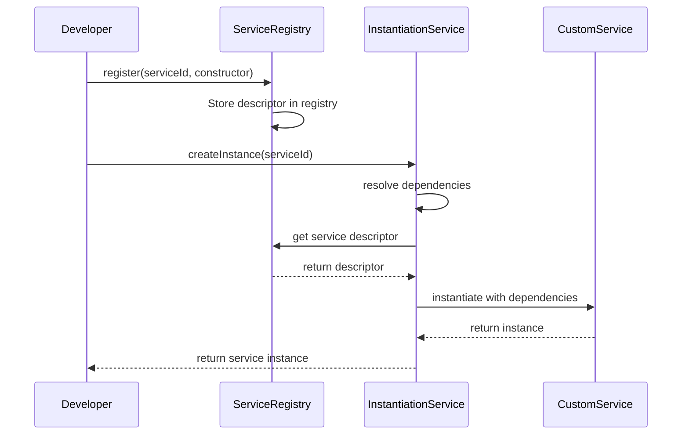
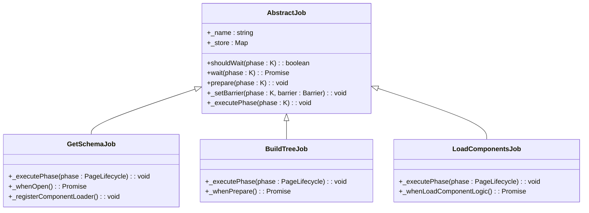
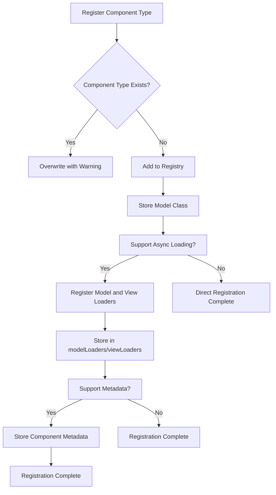

# Framework Extension Points

<cite>
**Referenced Files in This Document**   
- [service-registry.ts](file://packages/h5-builder/src/bedrock/di/service-registry.ts)
- [instantiation-service.ts](file://packages/h5-builder/src/bedrock/di/instantiation-service.ts)
- [base.ts](file://packages/h5-builder/src/bedrock/di/base.ts)
- [service-identifiers.ts](file://packages/h5-builder/src/services/service-identifiers.ts)
- [component.service.ts](file://packages/h5-builder/src/services/component.service.ts)
- [get-schema-job.ts](file://packages/h5-builder/src/jobs/get-schema-job.ts)
- [build-tree-job.ts](file://packages/h5-builder/src/jobs/build-tree-job.ts)
- [load-components-job.ts](file://packages/h5-builder/src/jobs/load-components-job.ts)
- [abstract-job.ts](file://packages/h5-builder/src/bedrock/launch/abstract-job.ts)
- [context.web.tsx](file://packages/h5-builder/src/bedrock/di/context.web.tsx)
</cite>

## Table of Contents
1. [Dependency Injection System](#dependency-injection-system)
2. [Service Registration and Child Injectors](#service-registration-and-child-injectors)
3. [Custom Infrastructure Services](#custom-infrastructure-services)
4. [Scheduler System and Job Types](#scheduler-system-and-job-types)
5. [Component Service Extension](#component-service-extension)
6. [Integration Patterns](#integration-patterns)
7. [Type Safety Guidelines](#type-safety-guidelines)

## Dependency Injection System

The H5 Builder framework implements a comprehensive dependency injection (DI) system that enables flexible service management and inversion of control. The system is built around service identifiers, instantiation services, and dependency resolution mechanisms that allow for both eager and delayed instantiation of services.

The DI system uses service identifiers created through the `createDecorator` function, which generates unique identifiers for services that can be used with parameter decorators in constructors. This approach provides type safety while avoiding direct dependencies on implementation classes. Services declare their dependencies using these identifiers, allowing the instantiation service to resolve and inject dependencies automatically.

**Section sources**
- [base.ts](file://packages/h5-builder/src/bedrock/di/base.ts#L1-L74)
- [instantiation-service.interface.ts](file://packages/h5-builder/src/bedrock/di/instantiation-service.interface.ts#L1-L47)

## Service Registration and Child Injectors

The framework provides a robust service registration mechanism through the `ServiceRegistry` class, which maintains a collection of service descriptors and instances. Services can be registered using either constructors or `SyncDescriptor` objects, with options for delayed instantiation. The registry supports duplicate detection through configuration options, ensuring service integrity during registration.

```mermaid
classDiagram
class ServiceRegistry {
+registry : [ServiceIdentifier<any>, SyncDescriptor<any> | BrandedService][]
+register(id : ServiceIdentifier<T>, ctor : Constructor, supportsDelayedInstantiation? : boolean | InstantiationType) : void
+registerInstance(id : ServiceIdentifier<T>, instance : T, options? : { ownership : ServiceOwnership }) : void
+makeCollection() : ServiceCollection
}
class InstantiationService {
+_services : ServiceCollection
+_parent? : InstantiationService
+_childs : Set<IInstantiationService>
+createChild(services : ServiceCollection) : IInstantiationService
+invokeFunction<R, TS extends any[]>(fn : (accessor : ServicesAccessor, ...args : TS) => R, ...args : TS) : R
+createInstance<T>(descriptor : SyncDescriptor0<T>) : T
}
class ServiceCollection {
+set(id : ServiceIdentifier<T>, instanceOrDescriptor : T | SyncDescriptor<T>) : void
+get(id : ServiceIdentifier<T>) : T | SyncDescriptor<T> | undefined
}
ServiceRegistry --> ServiceCollection : "creates"
InstantiationService --> ServiceCollection : "contains"
InstantiationService --> InstantiationService : "parent/child"
```

**Diagram sources**
- [service-registry.ts](file://packages/h5-builder/src/bedrock/di/service-registry.ts#L16-L100)
- [instantiation-service.ts](file://packages/h5-builder/src/bedrock/di/instantiation-service.ts#L61-L468)

**Section sources**
- [service-registry.ts](file://packages/h5-builder/src/bedrock/di/service-registry.ts#L1-L100)
- [instantiation-service.ts](file://packages/h5-builder/src/bedrock/di/instantiation-service.ts#L61-L468)

## Custom Infrastructure Services

To extend the framework with custom infrastructure services such as analytics or native bridge implementations, developers must follow a standardized registration process. First, define a service interface that extends the `BrandedService` type with a `_serviceBrand` property. Then, create a service identifier using the `createDecorator` function with a unique string identifier.

Custom services can be registered with the injector through the service registry, either as constructor functions or as instances. For services that need to be shared across components or have specific lifecycle management, use the `registerInstance` method to provide a pre-created instance. The framework supports both eager and delayed instantiation, allowing services to be created immediately or on-demand based on application requirements.



**Diagram sources**
- [base.ts](file://packages/h5-builder/src/bedrock/di/base.ts#L9-L66)
- [service-identifiers.ts](file://packages/h5-builder/src/services/service-identifiers.ts#L1-L20)
- [instantiation-service.ts](file://packages/h5-builder/src/bedrock/di/instantiation-service.ts#L111-L148)

**Section sources**
- [service-identifiers.ts](file://packages/h5-builder/src/services/service-identifiers.ts#L1-L20)
- [instantiation-service.ts](file://packages/h5-builder/src/bedrock/di/instantiation-service.ts#L111-L148)

## Scheduler System and Job Types

The framework's scheduler system is built around the `AbstractJob` class, which defines a common interface for job execution across different lifecycle phases. Jobs are executed in a specific order based on the page lifecycle, with barriers used to coordinate dependencies between jobs. The system supports creating custom job types by extending the `AbstractJob` class and implementing the `_executePhase` method.

Existing job implementations such as `GetSchemaJob` and `BuildTreeJob` demonstrate the pattern for handling different lifecycle phases. The `GetSchemaJob` retrieves the page schema during the Open phase, while the `BuildTreeJob` constructs the component model tree during the Prepare phase. Custom jobs can be created to handle specialized initialization or rendering logic by following this pattern and registering them with the job scheduler.



**Diagram sources**
- [abstract-job.ts](file://packages/h5-builder/src/bedrock/launch/abstract-job.ts#L3-L46)
- [get-schema-job.ts](file://packages/h5-builder/src/jobs/get-schema-job.ts#L13-L119)
- [build-tree-job.ts](file://packages/h5-builder/src/jobs/build-tree-job.ts#L12-L59)
- [load-components-job.ts](file://packages/h5-builder/src/jobs/load-components-job.ts#L11-L61)

**Section sources**
- [abstract-job.ts](file://packages/h5-builder/src/bedrock/launch/abstract-job.ts#L3-L46)
- [get-schema-job.ts](file://packages/h5-builder/src/jobs/get-schema-job.ts#L13-L119)
- [build-tree-job.ts](file://packages/h5-builder/src/jobs/build-tree-job.ts#L12-L59)

## Component Service Extension

The `ComponentService` class provides extension points for supporting new component types through its registration system. Developers can extend the framework by registering new component types with the service, either synchronously using the `register` method or asynchronously using the `registerAsync` method. The service maintains a registry that maps component types to their corresponding model classes, enabling dynamic component creation based on schema definitions.

For components with complex loading requirements, the async registration API supports separate model and view loaders, allowing for code splitting and lazy loading. The registration process also supports metadata that can influence loading priority, dependencies, and other behavioral aspects. This extensibility enables the framework to support a wide variety of component types while maintaining a consistent API for component management.



**Diagram sources**
- [component.service.ts](file://packages/h5-builder/src/services/component.service.ts#L52-L94)
- [component.service.ts](file://packages/h5-builder/src/services/component.service.ts#L119-L128)
- [component.service.ts](file://packages/h5-builder/src/services/component.service.ts#L286-L318)

**Section sources**
- [component.service.ts](file://packages/h5-builder/src/services/component.service.ts#L52-L94)
- [component.service.ts](file://packages/h5-builder/src/services/component.service.ts#L119-L128)

## Integration Patterns

The framework supports integration with external systems through well-defined patterns that maintain separation of concerns. Services that need to communicate with external systems should encapsulate the integration logic within their implementation while exposing a clean interface to the rest of the application. The dependency injection system facilitates testing by allowing mock implementations to be injected during development or testing phases.

For real-time integrations, services can leverage the framework's event system to publish and subscribe to events, enabling loose coupling between components. The use of service identifiers and dependency injection ensures that integrations can be easily replaced or modified without affecting other parts of the system. When integrating with external APIs, services should handle error conditions gracefully and provide appropriate fallback mechanisms to maintain application stability.

**Section sources**
- [instantiation-service.ts](file://packages/h5-builder/src/bedrock/di/instantiation-service.ts#L119-L148)
- [event](file://packages/h5-builder/src/bedrock/event)

## Type Safety Guidelines

Maintaining type safety when extending core interfaces requires adherence to specific patterns and practices. When creating new service interfaces, always extend the `BrandedService` type and include the `_serviceBrand` property to ensure type uniqueness. Service identifiers should be created using the `createDecorator` function with explicit type parameters to maintain type information throughout the dependency injection process.

When extending existing classes or interfaces, use TypeScript's interface merging capabilities judiciously and prefer composition over inheritance when possible. For services that accept configuration options, define specific interface types rather than using generic objects to ensure type safety and provide better developer experience through IntelliSense. The framework's use of generics in the `createInstance` and `invokeFunction` methods helps maintain type safety while providing flexibility in service creation and dependency resolution.

**Section sources**
- [base.ts](file://packages/h5-builder/src/bedrock/di/base.ts#L2-L3)
- [instantiation-service.interface.ts](file://packages/h5-builder/src/bedrock/di/instantiation-service.interface.ts#L12-L47)
- [context.web.tsx](file://packages/h5-builder/src/bedrock/di/context.web.tsx#L29-L41)