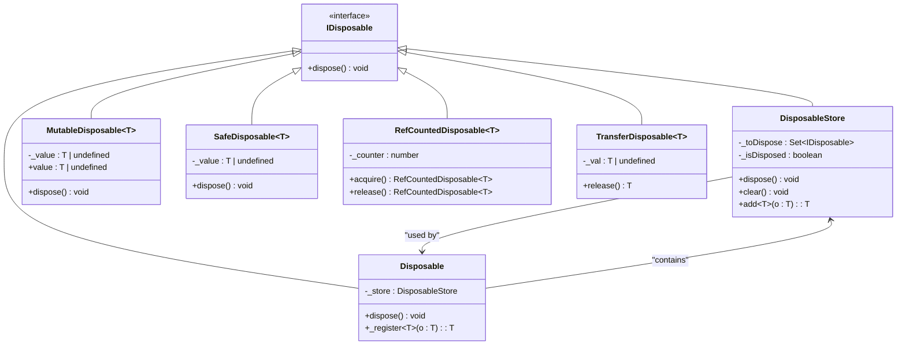
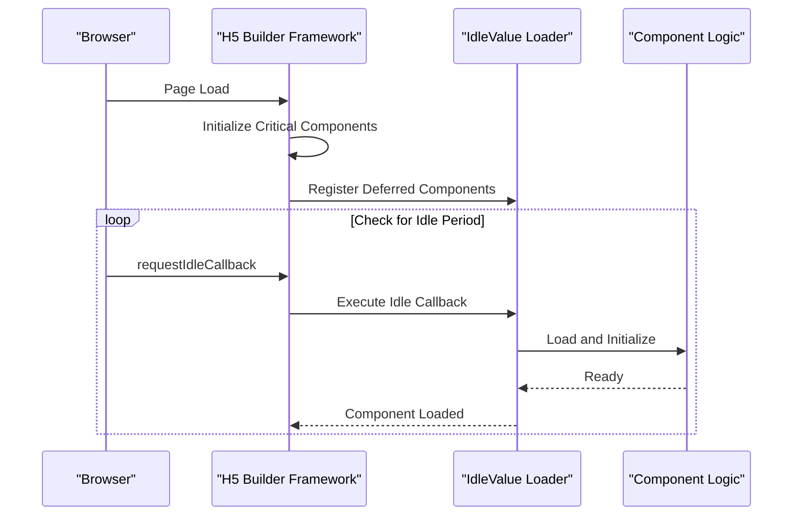
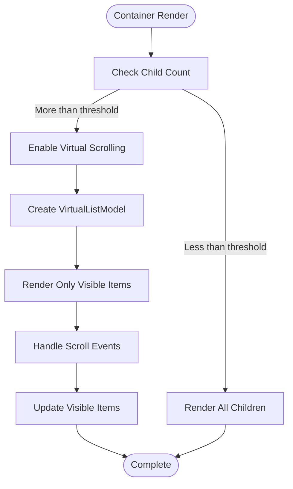
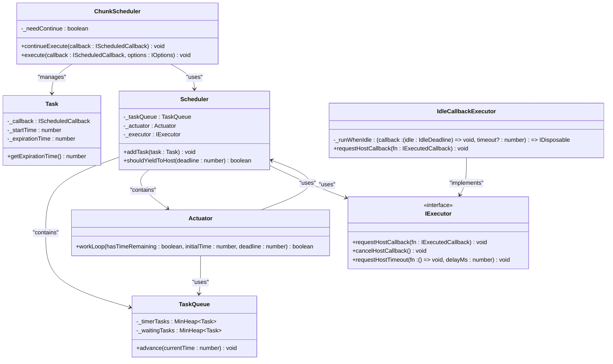

# Performance Tuning

<cite>
**Referenced Files in This Document**   
- [disposable-store.ts](file://packages/h5-builder/src/bedrock/dispose/disposable-store.ts)
- [disposable-t.ts](file://packages/h5-builder/src/bedrock/dispose/disposable-t.ts)
- [idle-value.ts](file://packages/h5-builder/src/bedrock/di/idle-value.ts)
- [auto-virtual-scroll.md](file://packages/h5-builder/docs/auto-virtual-scroll.md)
- [idle-callback-executor.ts](file://packages/h5-builder/src/bedrock/scheduler/executor/idle-callback-executor.ts)
- [chunk-scheduler.ts](file://packages/h5-builder/src/bedrock/scheduler/core/chunk-scheduler.ts)
- [scheduler.ts](file://packages/h5-builder/src/bedrock/scheduler/core/scheduler.ts)
- [virtual-list.model.ts](file://packages/h5-builder/src/components/virtual-list/virtual-list.model.ts)
- [virtual-list.view.tsx](file://packages/h5-builder/src/components/virtual-list/virtual-list.view.tsx)
</cite>

## Table of Contents
1. [Introduction](#introduction)
2. [Memory Optimization](#memory-optimization)
3. [Startup Time Reduction](#startup-time-reduction)
4. [Rendering Performance](#rendering-performance)
5. [Background Task Management](#background-task-management)
6. [Profiling and Metrics](#profiling-and-metrics)
7. [Conclusion](#conclusion)

## Introduction
This document provides comprehensive guidance on performance tuning for large-scale H5 Builder applications. It covers critical aspects including memory optimization, startup time reduction, rendering performance improvements, and background task management. The content is based on analysis of the H5 Builder codebase, focusing on specific implementation patterns and best practices that enable high-performance applications at scale.

## Memory Optimization

### DisposableStore and Resource Cleanup
The H5 Builder framework implements a robust resource management system centered around the `DisposableStore` class, which prevents memory leaks by ensuring proper cleanup of resources. This pattern is critical for large-scale applications where component lifecycle management can become complex.

The `DisposableStore` maintains a set of disposable objects and ensures they are properly disposed in a Last-In-First-Out (LIFO) order when the store itself is disposed. This approach prevents memory leaks by guaranteeing that all registered disposables are cleaned up, even if errors occur during disposal.

**Diagram sources**
- [disposable-store.ts](file://packages/h5-builder/src/bedrock/dispose/disposable-store.ts#L6-L83)
- [disposable-t.ts](file://packages/h5-builder/src/bedrock/dispose/disposable-t.ts#L13-L238)

**Section sources**
- [disposable-store.ts](file://packages/h5-builder/src/bedrock/dispose/disposable-store.ts#L6-L83)
- [disposable-t.ts](file://packages/h5-builder/src/bedrock/dispose/disposable-t.ts#L13-L238)

### Proper Resource Cleanup Patterns
The framework provides several patterns for resource cleanup:

1. **Disposable Class**: Base class that automatically creates a `DisposableStore` and provides a `_register` method to add disposables that will be automatically cleaned up.

2. **MutableDisposable**: Container that holds a single disposable value and automatically disposes the previous value when a new one is assigned.

3. **RefCountedDisposable**: Reference-counted container that automatically disposes the contained object when the reference count reaches zero.

4. **TransferDisposable**: Indicates transfer of ownership, where the container takes responsibility for disposing the contained object.

These patterns ensure that resources are properly managed throughout the application lifecycle, preventing common memory leak scenarios.

## Startup Time Reduction

### Lazy Loading with idle-value.ts
The H5 Builder framework implements lazy loading of component logic through the `idle-value.ts` module, which leverages browser idle periods to load non-critical components. This approach significantly reduces initial startup time by deferring the loading of non-essential functionality until the main thread is idle.

The pattern works by wrapping component initialization in an idle callback, allowing the browser to prioritize critical rendering tasks first. Once the main thread is free, the framework loads and initializes deferred components in the background.

**Diagram sources**
- [idle-value.ts](file://packages/h5-builder/src/bedrock/di/idle-value.ts#L1-L100)
- [idle-callback-executor.ts](file://packages/h5-builder/src/bedrock/scheduler/executor/idle-callback-executor.ts#L12-L98)

### Prioritized Initialization
The framework prioritizes initialization of critical components by implementing a tiered loading strategy:

1. **Immediate Initialization**: Core framework components and first-screen critical components are initialized synchronously.

2. **Idle-time Initialization**: Secondary components are loaded during browser idle periods using `requestIdleCallback`.

3. **On-demand Initialization**: Rarely used components are loaded only when explicitly requested by user interaction.

This prioritization ensures that users can interact with the application as quickly as possible while background loading continues transparently.

**Section sources**
- [idle-value.ts](file://packages/h5-builder/src/bedrock/di/idle-value.ts#L1-L100)
- [scheduler.ts](file://packages/h5-builder/src/bedrock/scheduler/core/scheduler.ts#L24-L173)

## Rendering Performance

### Virtual Scrolling Implementation
The H5 Builder framework includes an automatic virtual scrolling feature that dramatically improves rendering performance for lists with large numbers of items. This implementation is documented in the `auto-virtual-scroll.md` file and is automatically applied to container components when they exceed a certain threshold of child components.

The virtual scrolling system only renders visible items in the viewport, significantly reducing the number of DOM nodes and the associated rendering overhead. By default, virtual scrolling is automatically enabled when a container has more than 20 child components.

**Diagram sources**
- [auto-virtual-scroll.md](file://packages/h5-builder/docs/auto-virtual-scroll.md#L1-L216)
- [virtual-list.model.ts](file://packages/h5-builder/src/components/virtual-list/virtual-list.model.ts#L1-L100)
- [virtual-list.view.tsx](file://packages/h5-builder/src/components/virtual-list/virtual-list.view.tsx#L1-L100)

### Performance Metrics
The virtual scrolling implementation provides significant performance improvements:

| Metric | Without Virtual Scrolling | With Virtual Scrolling | Improvement |
|--------|---------------------------|------------------------|-------------|
| DOM Nodes (100 items) | 100 | ~10 | 90% reduction |
| First Render Time | ~500ms | ~50ms | 10x faster |
| Memory Usage | ~10MB | ~1MB | 90% reduction |

These metrics demonstrate the substantial performance benefits of virtual scrolling for large lists.

**Section sources**
- [auto-virtual-scroll.md](file://packages/h5-builder/docs/auto-virtual-scroll.md#L141-L159)
- [virtual-list.model.ts](file://packages/h5-builder/src/components/virtual-list/virtual-list.model.ts#L1-L50)

## Background Task Management

### Scheduler System Architecture
The H5 Builder framework includes a sophisticated scheduler system for managing background tasks, consisting of several key components:

1. **IdleCallbackExecutor**: Uses `requestIdleCallback` API to execute tasks during browser idle periods, with a fallback to `setTimeout` when the API is not available.

2. **ChunkScheduler**: Manages task execution in chunks, allowing long-running tasks to be broken into smaller pieces that can be interrupted if needed.

3. **TaskQueue**: Maintains two priority queues - one for immediate tasks and one for delayed tasks.

4. **Actuator**: Executes tasks within time constraints, yielding control back to the browser when necessary to maintain responsiveness.

**Diagram sources**
- [scheduler.ts](file://packages/h5-builder/src/bedrock/scheduler/core/scheduler.ts#L24-L173)
- [idle-callback-executor.ts](file://packages/h5-builder/src/bedrock/scheduler/executor/idle-callback-executor.ts#L12-L98)
- [chunk-scheduler.ts](file://packages/h5-builder/src/bedrock/scheduler/core/chunk-scheduler.ts#L6-L28)
- [task-queue.ts](file://packages/h5-builder/src/bedrock/scheduler/core/task-queue.ts#L12-L44)
- [actuator.ts](file://packages/h5-builder/src/bedrock/scheduler/core/actuator.ts#L6-L58)

### Idle-time Processing
The framework's idle-time processing system allows non-critical tasks to be executed during browser idle periods, preventing them from interfering with user interactions and animations. The `IdleCallbackExecutor` class implements this pattern by:

1. Using the native `requestIdleCallback` API when available
2. Falling back to `setTimeout` with a 15ms timeout (approximately one frame at 64fps) when the API is not supported
3. Managing task continuation through the `ChunkScheduler`, which allows long-running tasks to be split into smaller chunks

This approach ensures that background tasks only consume resources when the browser would otherwise be idle, maintaining smooth 60fps performance.

**Section sources**
- [idle-callback-executor.ts](file://packages/h5-builder/src/bedrock/scheduler/executor/idle-callback-executor.ts#L12-L98)
- [chunk-scheduler.ts](file://packages/h5-builder/src/bedrock/scheduler/core/chunk-scheduler.ts#L6-L28)
- [actuator.ts](file://packages/h5-builder/src/bedrock/scheduler/core/actuator.ts#L6-L58)

## Profiling and Metrics

### Identifying Performance Bottlenecks
To identify performance bottlenecks in H5 Builder applications, developers should use the following techniques:

1. **Browser DevTools**: Use the Performance tab to record and analyze runtime performance, focusing on:
   - Long tasks that block the main thread
   - Excessive re-renders
   - Memory allocation patterns

2. **Framework Logging**: Enable debug logging to monitor:
   - Virtual scrolling activation
   - Task scheduling behavior
   - Component initialization timing

3. **Custom Metrics**: Implement custom performance monitoring for key user journeys, measuring:
   - Time to first meaningful paint
   - Time to interactive
   - Component initialization times

### Measuring Performance Improvements
The framework provides several built-in metrics for measuring performance improvements:

1. **Virtual Scrolling Effectiveness**: Monitor the reduction in DOM nodes and memory usage when virtual scrolling is enabled.

2. **Task Scheduling Efficiency**: Track the number of tasks executed during idle periods versus those that required interruption.

3. **Startup Time Reduction**: Measure the time from page load to first user interaction, comparing before and after lazy loading optimizations.

4. **Memory Usage**: Monitor heap size and garbage collection patterns to ensure proper resource cleanup.

These metrics provide quantitative evidence of performance improvements and help identify areas for further optimization.

**Section sources**
- [auto-virtual-scroll.md](file://packages/h5-builder/docs/auto-virtual-scroll.md#L161-L178)
- [scheduler.ts](file://packages/h5-builder/src/bedrock/scheduler/core/scheduler.ts#L45-L65)
- [disposable-store.ts](file://packages/h5-builder/src/bedrock/dispose/disposable-store.ts#L20-L30)

## Conclusion
The H5 Builder framework provides a comprehensive set of performance optimization techniques for large-scale applications. By implementing proper memory management with `DisposableStore`, reducing startup time through lazy loading, improving rendering performance with virtual scrolling, and efficiently managing background tasks through the scheduler system, developers can create highly performant applications that scale effectively.

The key to successful performance tuning is understanding and leveraging these built-in patterns rather than implementing custom solutions. By following the framework's established practices for resource management, lazy loading, and background processing, developers can achieve significant performance improvements while maintaining code maintainability and consistency.