# Architectural Layers

<cite>
**Referenced Files in This Document**   
- [model.ts](file://packages/h5-builder/src/bedrock/model.ts)
- [di/index.ts](file://packages/h5-builder/src/bedrock/di/index.ts)
- [di/instantiation-service.ts](file://packages/h5-builder/src/bedrock/di/instantiation-service.ts)
- [dispose/index.ts](file://packages/h5-builder/src/bedrock/dispose/index.ts)
- [job-scheduler.ts](file://packages/h5-builder/src/bedrock/launch/job-scheduler.ts)
- [abstract-job.ts](file://packages/h5-builder/src/bedrock/launch/abstract-job.ts)
- [bridge.service.ts](file://packages/h5-builder/src/services/bridge.service.ts)
- [http.service.ts](file://packages/h5-builder/src/services/http.service.ts)
- [tracker.service.ts](file://packages/h5-builder/src/services/tracker.service.ts)
- [component.service.ts](file://packages/h5-builder/src/services/component.service.ts)
- [service-identifiers.ts](file://packages/h5-builder/src/services/service-identifiers.ts)
- [product-card.model.ts](file://packages/h5-builder/src/components/product-card/product-card.model.ts)
- [product-card.view.tsx](file://packages/h5-builder/src/components/product-card/product-card.view.tsx)
- [model-renderer.tsx](file://packages/h5-builder/src/components/model-renderer.tsx)
</cite>

## Table of Contents
1. [Introduction](#introduction)
2. [Kernel Layer](#kernel-layer)
3. [Infrastructure Layer](#infrastructure-layer)
4. [Flow Layer](#flow-layer)
5. [Components/View Layer](#componentsview-layer)
6. [Layer Interactions and Examples](#layer-interactions-and-examples)
7. [Cross-Cutting Concerns](#cross-cutting-concerns)
8. [Conclusion](#conclusion)

## Introduction
The H5 Builder Framework implements a four-layer architecture that enforces clear separation of concerns, dependency direction, and encapsulation boundaries. This architectural approach enhances performance, maintainability, and testability by organizing the codebase into distinct layers with well-defined responsibilities. The framework follows a strict dependency inversion principle where higher layers depend on abstractions provided by lower layers, but never directly on concrete implementations. This documentation provides a comprehensive analysis of each architectural layer, their interactions, and how they contribute to the overall system design.

## Kernel Layer
The Kernel Layer forms the foundation of the H5 Builder Framework, providing core abstractions and lifecycle management through three primary subsystems: Dependency Injection (DI), Model, and Disposable. This layer establishes the fundamental patterns that govern object creation, lifecycle management, and resource cleanup throughout the application.

### Dependency Injection System
The DI system in the Kernel Layer implements a sophisticated service container that manages object creation and dependency resolution. It provides a hierarchical instantiation service that supports both synchronous and lazy instantiation of services. The system uses service identifiers and descriptors to decouple service consumers from concrete implementations, enabling inversion of control. The instantiation service resolves dependencies through constructor injection, automatically providing required services based on type annotations. This approach eliminates the need for manual dependency management and promotes loose coupling between components.

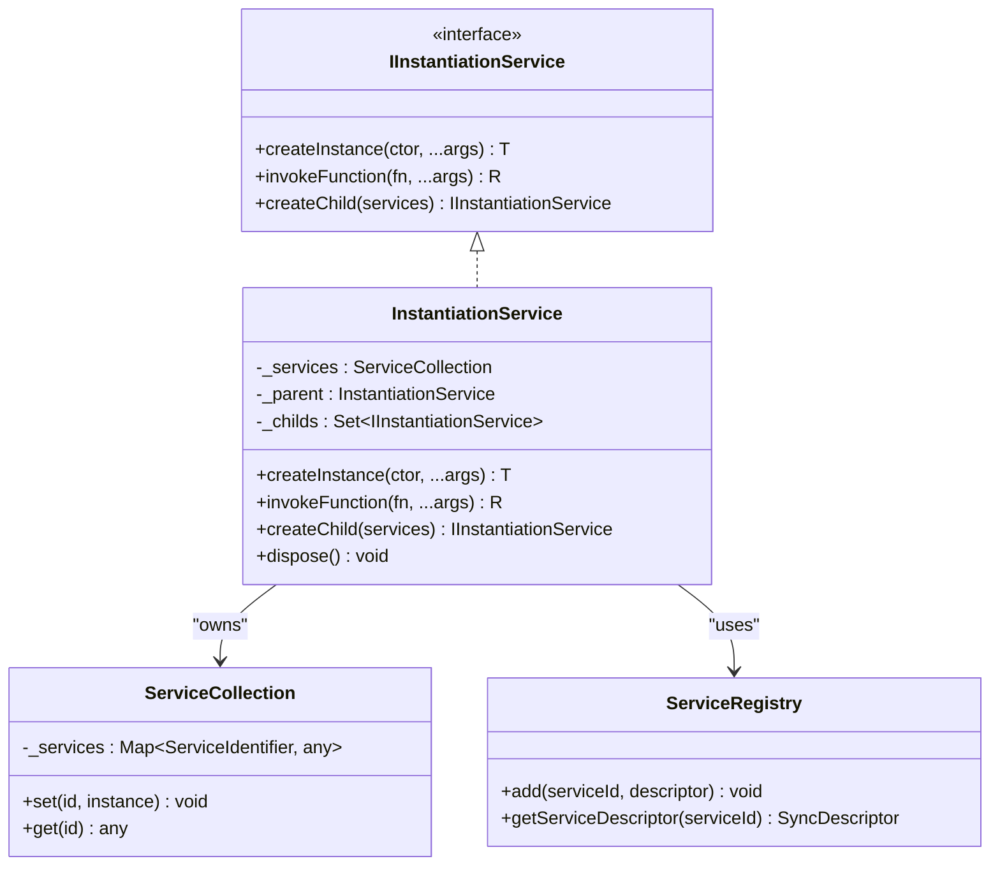

**Diagram sources**
- [di/instantiation-service.interface.ts](file://packages/h5-builder/src/bedrock/di/instantiation-service.interface.ts)
- [di/instantiation-service.ts](file://packages/h5-builder/src/bedrock/di/instantiation-service.ts)
- [di/service-collection.ts](file://packages/h5-builder/src/bedrock/di/service-collection.ts)
- [di/service-registry.ts](file://packages/h5-builder/src/bedrock/di/service-registry.ts)

**Section sources**
- [di/index.ts](file://packages/h5-builder/src/bedrock/di/index.ts)
- [di/instantiation-service.ts](file://packages/h5-builder/src/bedrock/di/instantiation-service.ts)

### Model System
The Model system in the Kernel Layer provides a base abstraction for component state management and lifecycle control. It implements a hierarchical model structure with `BaseComponentModel` as the root class and `BaseContainerModel` for composite components. These models integrate with MobX for reactive state management, making all properties observable. The model system enforces a standardized lifecycle with initialization, activation, deactivation, and disposal phases. Container models automatically manage the lifecycle of their child models, ensuring proper initialization and cleanup order.

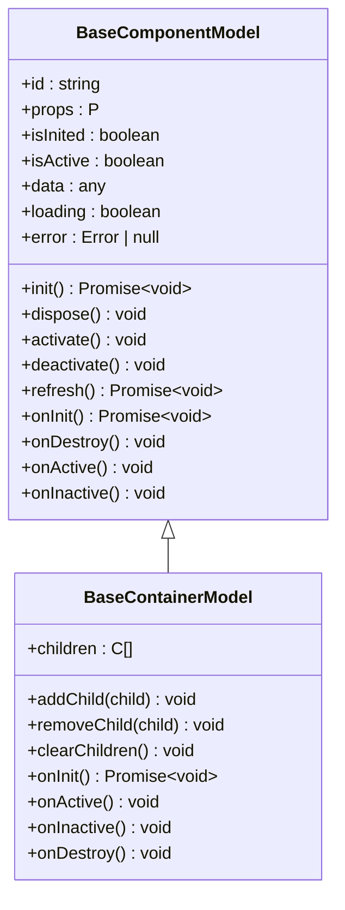

**Diagram sources**
- [model.ts](file://packages/h5-builder/src/bedrock/model.ts)

**Section sources**
- [model.ts](file://packages/h5-builder/src/bedrock/model.ts)

### Disposable System
The Disposable system provides a comprehensive resource management framework that ensures proper cleanup of allocated resources. It implements a hierarchical disposal pattern where parent disposables automatically dispose of their children. The system includes various disposable container types such as `DisposableStore`, `MutableDisposable`, and `SafeDisposable` to handle different cleanup scenarios. The tracker functionality enables detection of disposal leaks during development, promoting robust resource management practices. This system is integrated throughout the framework, ensuring that all allocated resources are properly cleaned up when no longer needed.

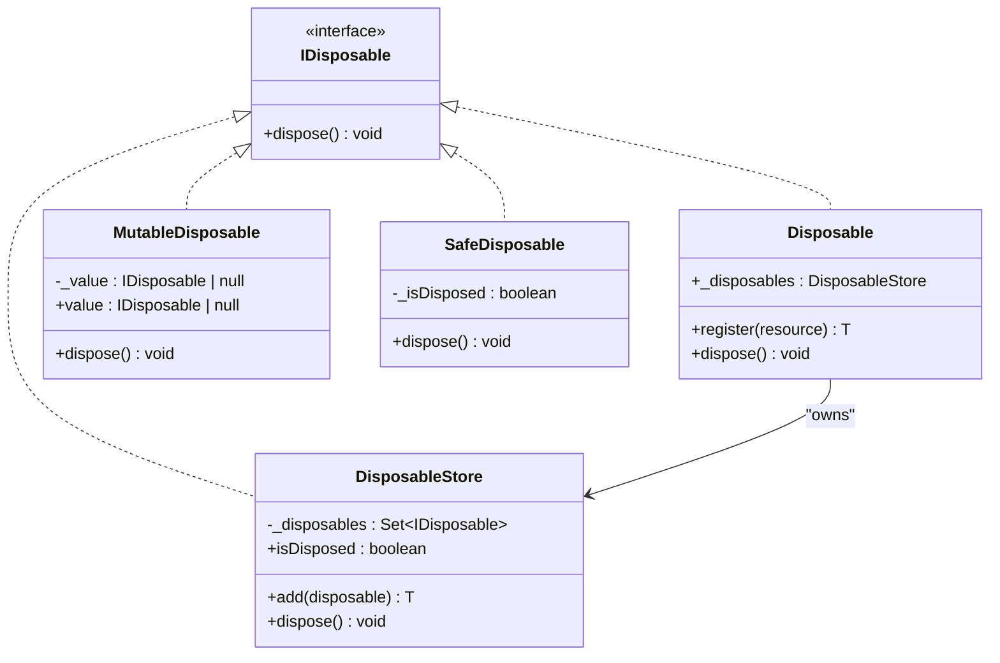

**Diagram sources**
- [dispose/index.ts](file://packages/h5-builder/src/bedrock/dispose/index.ts)
- [dispose/disposable-store.ts](file://packages/h5-builder/src/bedrock/dispose/disposable-store.ts)
- [dispose/disposable-t.ts](file://packages/h5-builder/src/bedrock/dispose/disposable-t.ts)

**Section sources**
- [dispose/index.ts](file://packages/h5-builder/src/bedrock/dispose/index.ts)

## Infrastructure Layer
The Infrastructure Layer provides cross-cutting services that support the entire application through the Bridge, HTTP, and Tracker subsystems. These services are designed to be consumed by higher layers through well-defined interfaces, ensuring loose coupling and testability.

### Bridge Service
The Bridge service acts as an abstraction layer for native platform communication, enabling the application to interact with native functionality through a consistent interface. It implements a dual-mode operation that supports both native execution and browser-based debugging. In native mode, it delegates to the `NativeBridge` interface for platform-specific functionality. In debug mode, it provides mock implementations that simulate native behavior, allowing developers to test functionality without a native environment. The service supports various native operations including user information retrieval, navigation, sharing, and toast notifications.

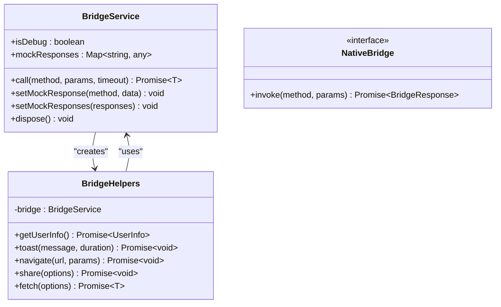

**Diagram sources**
- [bridge.service.ts](file://packages/h5-builder/src/services/bridge.service.ts)

**Section sources**
- [bridge.service.ts](file://packages/h5-builder/src/services/bridge.service.ts)

### HTTP Service
The HTTP service provides a robust networking layer built on top of the Bridge service, offering a familiar axios-like interface for making HTTP requests. It implements a modular interceptor system that allows for request preprocessing, response transformation, and error handling. The service supports request cancellation through AbortController and automatically handles common concerns such as base URL resolution, authentication token injection, and query parameter serialization. By leveraging the Bridge service, it maintains compatibility with both native and browser environments while providing a consistent API surface.

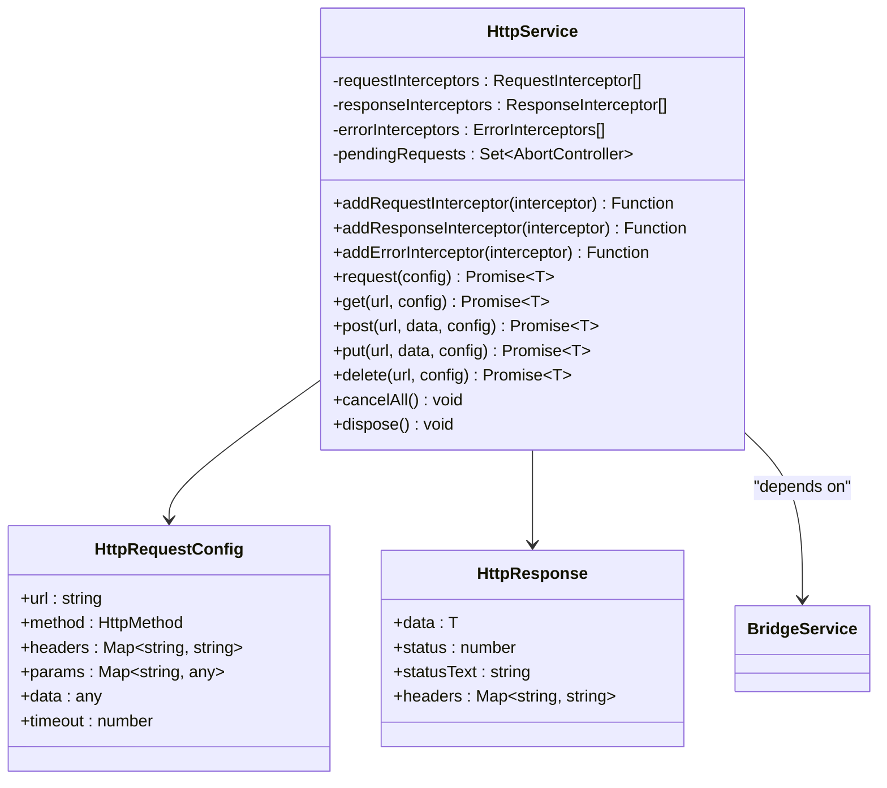

**Diagram sources**
- [http.service.ts](file://packages/h5-builder/src/services/http.service.ts)

**Section sources**
- [http.service.ts](file://packages/h5-builder/src/services/http.service.ts)

### Tracker Service
The Tracker service implements a comprehensive analytics and monitoring system that supports both real-time and batched event reporting. It provides a flexible tracking interface with support for various event types including page views, component exposures, clicks, errors, and performance metrics. The service implements intelligent batching and persistence strategies to optimize network usage and ensure data reliability. Events are queued and sent in batches based on size or time thresholds, with optional localStorage persistence to prevent data loss during connectivity issues. The debug mode provides immediate feedback through toast notifications, enhancing the development experience.

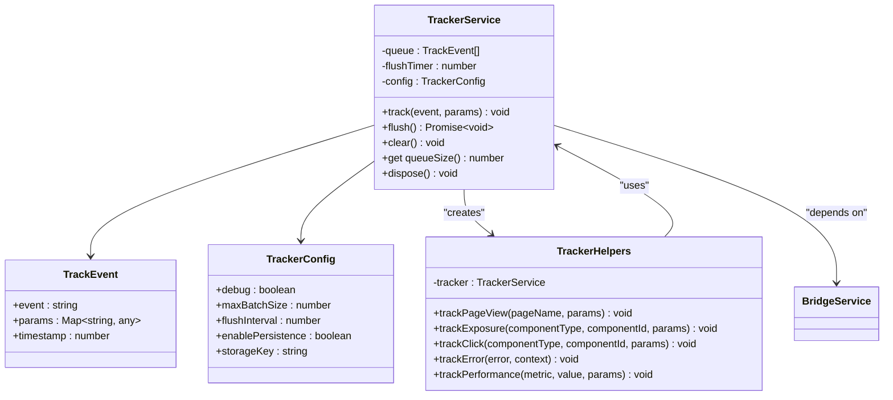

**Diagram sources**
- [tracker.service.ts](file://packages/h5-builder/src/services/tracker.service.ts)

**Section sources**
- [tracker.service.ts](file://packages/h5-builder/src/services/tracker.service.ts)

## Flow Layer
The Flow Layer orchestrates the application initialization and rendering flow through the JobScheduler and ComponentLoader subsystems. This layer coordinates the execution of various initialization tasks in a controlled sequence, ensuring proper dependency ordering and resource availability.

### Job Scheduler
The Job Scheduler implements a phase-based execution system that manages the application's initialization workflow. It uses a job registration model where tasks are associated with specific execution phases. The scheduler supports both immediate execution and deferred instantiation of jobs, allowing for optimal resource utilization. Each job can declare whether it should wait for a particular phase, enabling fine-grained control over the initialization sequence. The system records execution costs for performance monitoring and provides mechanisms for error handling and recovery.

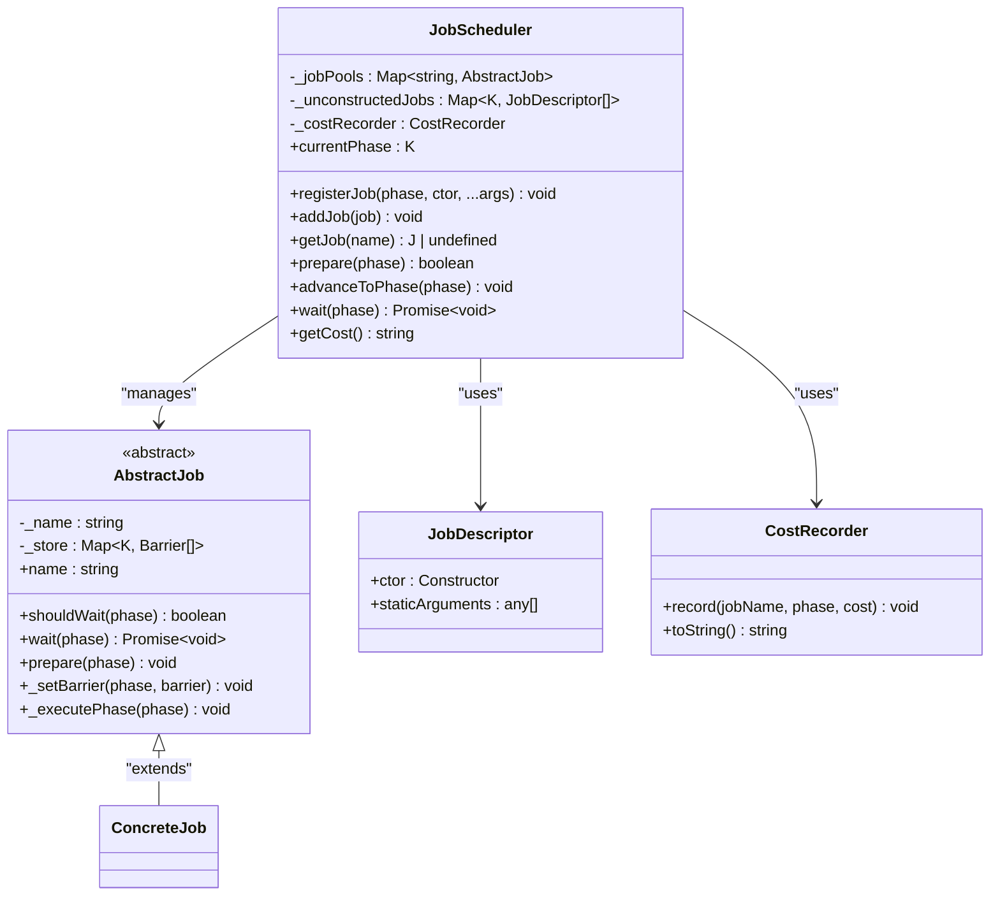

**Diagram sources**
- [job-scheduler.ts](file://packages/h5-builder/src/bedrock/launch/job-scheduler.ts)
- [abstract-job.ts](file://packages/h5-builder/src/bedrock/launch/abstract-job.ts)

**Section sources**
- [job-scheduler.ts](file://packages/h5-builder/src/bedrock/launch/job-scheduler.ts)
- [abstract-job.ts](file://packages/h5-builder/src/bedrock/launch/abstract-job.ts)

### Component Loader
The Component Loader manages the dynamic loading and instantiation of components based on schema definitions. It implements a sophisticated loading strategy that supports both synchronous and asynchronous component registration. The loader uses a dual-queue system for concurrent loading of model and view resources, with configurable concurrency limits to prevent resource exhaustion. It supports various loading patterns including immediate loading, lazy loading, and preloading with configurable delay ranges. The system integrates with the DI container to automatically inject dependencies during component instantiation.

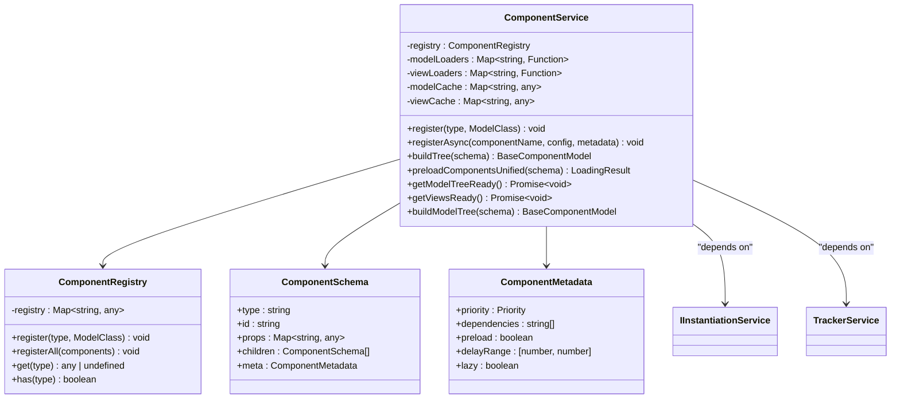

**Diagram sources**
- [component.service.ts](file://packages/h5-builder/src/services/component.service.ts)

**Section sources**
- [component.service.ts](file://packages/h5-builder/src/services/component.service.ts)

## Components/View Layer
The Components/View Layer implements the business logic and UI presentation through a collection of reusable components. Each component follows a consistent pattern with separate model and view implementations that are connected through the framework's rendering system.

### Component Structure
Components in the framework follow a standardized structure with a model class that manages state and business logic, and a view component that handles UI presentation. The model extends from `BaseComponentModel` or `BaseContainerModel` to inherit lifecycle management and reactive state capabilities. The view is typically implemented as a React component that subscribes to model changes through MobX observables. The framework's `ModelRenderer` system automatically connects models with their corresponding views based on type registration.

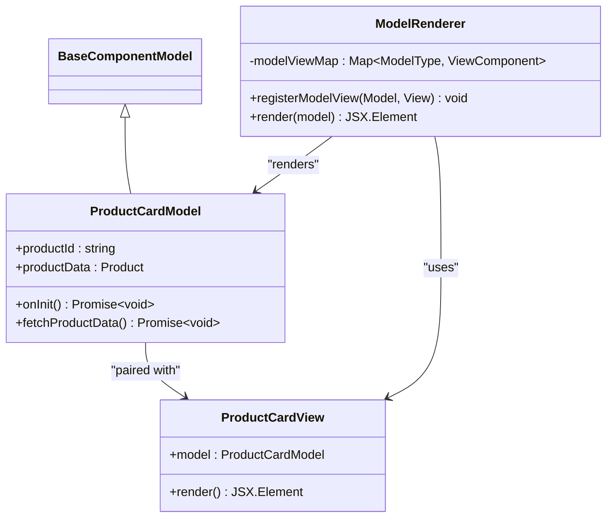

**Diagram sources**
- [product-card.model.ts](file://packages/h5-builder/src/components/product-card/product-card.model.ts)
- [product-card.view.tsx](file://packages/h5-builder/src/components/product-card/product-card.view.tsx)
- [model-renderer.tsx](file://packages/h5-builder/src/components/model-renderer.tsx)

**Section sources**
- [product-card.model.ts](file://packages/h5-builder/src/components/product-card/product-card.model.ts)
- [product-card.view.tsx](file://packages/h5-builder/src/components/product-card/product-card.view.tsx)
- [model-renderer.tsx](file://packages/h5-builder/src/components/model-renderer.tsx)

### Component Registration
Components are registered with the framework through the `ComponentService`, which maintains a registry of component types and their corresponding model classes. The registration system supports both synchronous and asynchronous component loading, allowing for code splitting and lazy loading of component bundles. The framework uses service identifiers to decouple component consumers from specific implementations, enabling dependency injection and testability. The registration process also supports metadata that defines loading priorities, dependencies, and other configuration options.

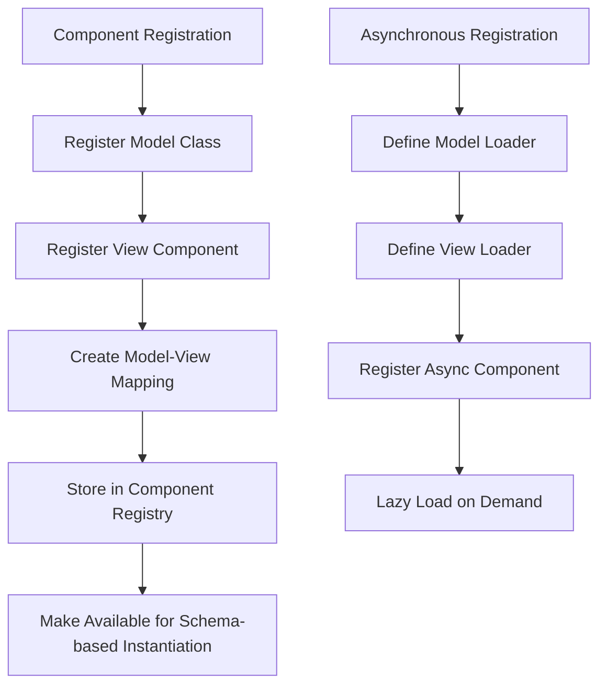

**Section sources**
- [component.service.ts](file://packages/h5-builder/src/services/component.service.ts)
- [model-renderer.tsx](file://packages/h5-builder/src/components/model-renderer.tsx)

## Layer Interactions and Examples
The four layers of the H5 Builder Framework interact in a well-defined manner that follows the dependency inversion principle. Higher layers depend on abstractions provided by lower layers, but never directly on concrete implementations. This section illustrates key interactions between layers with specific examples from the codebase.

### DI System Integration
The Flow Layer uses the Kernel Layer's DI system to instantiate components that depend on Infrastructure Layer services. When a component is created from a schema, the `ComponentService` uses the `IInstantiationService` to resolve dependencies and create the component instance. Services such as `HttpService` and `TrackerService` are injected into component constructors based on type annotations, eliminating the need for manual dependency management.

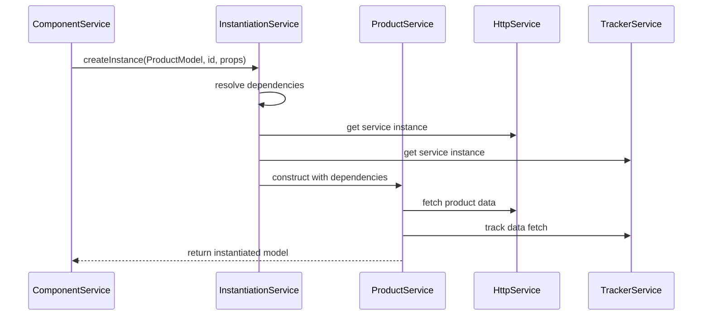

**Diagram sources**
- [component.service.ts](file://packages/h5-builder/src/services/component.service.ts)
- [di/instantiation-service.ts](file://packages/h5-builder/src/bedrock/di/instantiation-service.ts)
- [http.service.ts](file://packages/h5-builder/src/services/http.service.ts)
- [tracker.service.ts](file://packages/h5-builder/src/services/tracker.service.ts)

**Section sources**
- [component.service.ts](file://packages/h5-builder/src/services/component.service.ts)

### Initialization Flow
The application initialization flow demonstrates the coordinated interaction between all four layers. The Flow Layer's `JobScheduler` manages the execution of initialization jobs, including schema retrieval, component loading, and tree construction. These jobs use services from the Infrastructure Layer to fetch data and track progress, while creating component instances through the DI system. The Component Loader in the Flow Layer orchestrates the loading of model and view resources, ensuring that all dependencies are resolved before rendering begins.

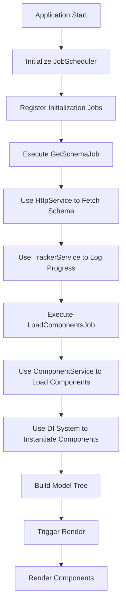

**Section sources**
- [jobs/index.ts](file://packages/h5-builder/src/jobs/index.ts)
- [job-scheduler.ts](file://packages/h5-builder/src/bedrock/launch/job-scheduler.ts)
- [component.service.ts](file://packages/h5-builder/src/services/component.service.ts)
- [di/instantiation-service.ts](file://packages/h5-builder/src/bedrock/di/instantiation-service.ts)

## Cross-Cutting Concerns
The H5 Builder Framework addresses several cross-cutting concerns through its layered architecture, enhancing performance, maintainability, and testability.

### Performance Optimization
The framework implements multiple performance optimizations across layers. The DI system supports lazy instantiation of services, reducing initial memory footprint. The Component Loader uses concurrent loading with configurable limits to maximize resource utilization without overwhelming the system. The Tracker service batches events to minimize network requests, while the HTTP service implements request cancellation to prevent unnecessary network activity. The Job Scheduler records execution costs, enabling performance monitoring and optimization.

### Maintainability
The clear separation of concerns and dependency inversion principle make the framework highly maintainable. Each layer has well-defined responsibilities and interfaces, making it easier to understand and modify individual components. The use of abstractions and dependency injection allows for easy replacement of implementations without affecting dependent code. The comprehensive logging and error tracking systems provide visibility into application behavior, facilitating debugging and issue resolution.

### Testability
The framework's architecture promotes testability through dependency injection and interface-based design. Services can be easily mocked or stubbed for unit testing, allowing components to be tested in isolation. The separation of model and view logic enables independent testing of business logic and UI presentation. The event-driven architecture and well-defined interfaces make it possible to write comprehensive integration tests that verify the interaction between components.

## Conclusion
The four-layer architecture of the H5 Builder Framework provides a robust foundation for building complex H5 applications. The clear separation of concerns between Kernel, Infrastructure, Flow, and Components/View layers enables scalable development while maintaining code quality and performance. The dependency inversion principle and extensive use of abstractions promote loose coupling and testability throughout the system. The framework's comprehensive support for lifecycle management, resource cleanup, and cross-cutting concerns makes it well-suited for production applications with demanding requirements. By following this architectural pattern, developers can create maintainable, performant, and reliable applications that are easy to extend and modify over time.