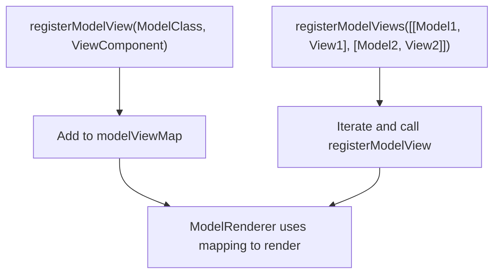
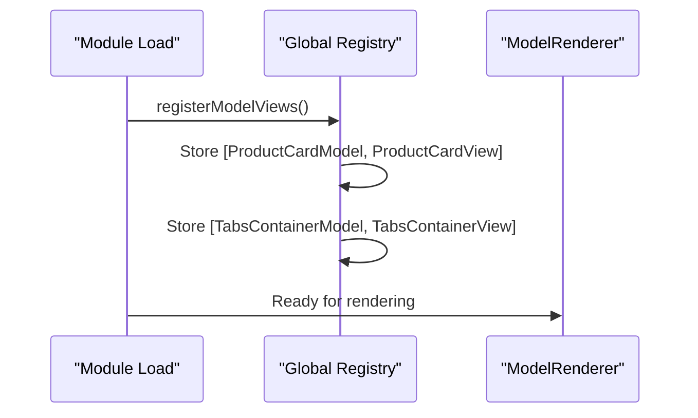
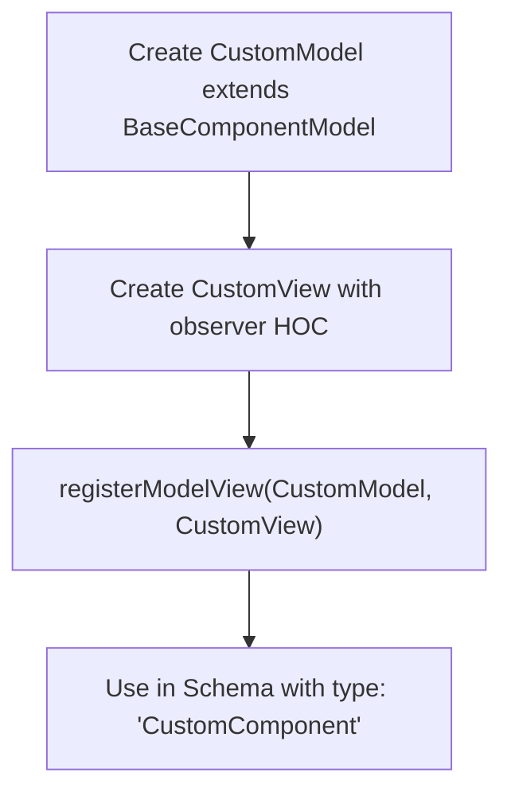
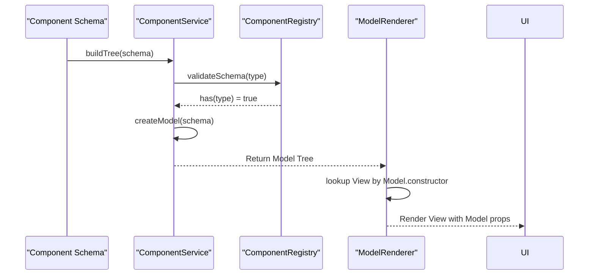
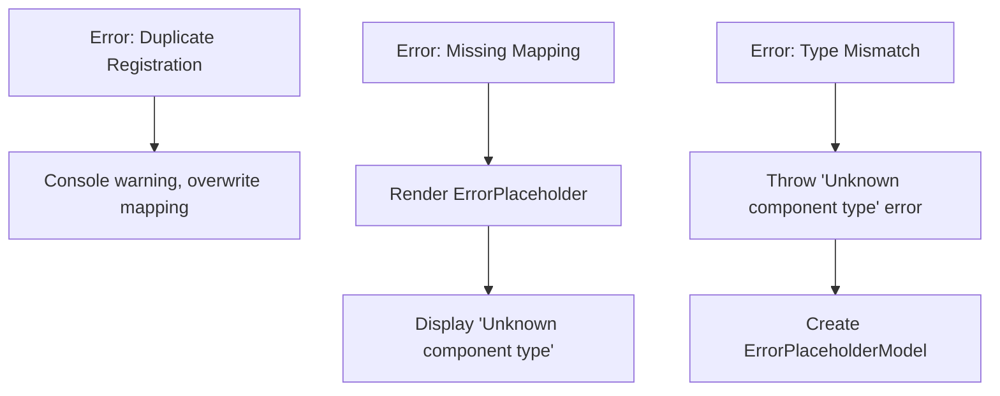
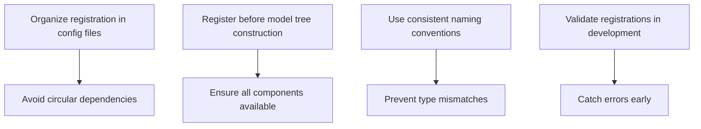
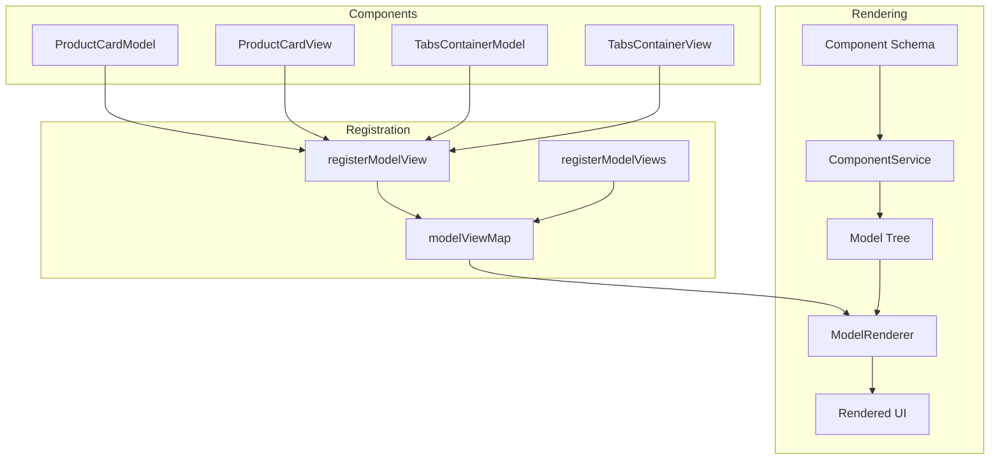

# Component Registration

<cite>
**Referenced Files in This Document**   
- [component.service.ts](file://packages/h5-builder/src/services/component.service.ts)
- [model-renderer.tsx](file://packages/h5-builder/src/components/model-renderer.tsx)
- [component_development_guide.md](file://packages/h5-builder/docs/component_development_guide.md)
- [product-card.model.ts](file://packages/h5-builder/src/components/product-card/product-card.model.ts)
- [product-card.view.tsx](file://packages/h5-builder/src/components/product-card/product-card.view.tsx)
- [tabs-container.model.ts](file://packages/h5-builder/src/components/tabs-container/tabs-container.model.ts)
- [tabs-container.view.tsx](file://packages/h5-builder/src/components/tabs-container/tabs-container.view.tsx)
</cite>

## Table of Contents
1. [Introduction](#introduction)
2. [Core Registration Mechanism](#core-registration-mechanism)
3. [Initialization Process](#initialization-process)
4. [Developer Extension Patterns](#developer-extension-patterns)
5. [Schema-Driven Rendering Integration](#schema-driven-rendering-integration)
6. [Error Scenarios and Troubleshooting](#error-scenarios-and-troubleshooting)
7. [Best Practices](#best-practices)
8. [Architecture Overview](#architecture-overview)

## Introduction
The H5 Builder Framework implements a robust component registration system that establishes Model-View mappings in a global registry. This system enables schema-driven rendering by mapping component types to their corresponding Model and View implementations. The registration process is fundamental to the framework's ability to dynamically construct UIs from declarative schemas while maintaining separation between business logic (Model) and presentation (View).

**Section sources**
- [component_development_guide.md](file://packages/h5-builder/docs/component_development_guide.md#L1-L510)

## Core Registration Mechanism

The component registration system revolves around two primary functions: `registerModelView` and `registerModelViews`. These functions establish the critical mapping between Model classes and their corresponding View components in a global registry.

The `registerModelView` function accepts a Model class and its corresponding View component as parameters, creating a direct mapping in the internal `modelViewMap`. This mapping is later used by the `ModelRenderer` to determine which View component should render a given Model instance.

The `registerModelViews` function provides batch registration capability, accepting an array of Model-View tuples. This allows for efficient registration of multiple component mappings at once, reducing boilerplate code and improving performance during initialization.

**Diagram sources**
- [model-renderer.tsx](file://packages/h5-builder/src/components/model-renderer.tsx#L15-L31)

**Section sources**
- [model-renderer.tsx](file://packages/h5-builder/src/components/model-renderer.tsx#L1-L105)

## Initialization Process

During module load, the framework automatically pre-registers default Model-View mappings for core components. This initialization occurs in the `model-renderer.tsx` file, where essential component pairs like `ProductCardModel → ProductCardView` and `TabsContainerModel → TabsContainerView` are registered using the `registerModelViews` function.

This pre-registration ensures that fundamental components are immediately available for rendering without requiring additional setup from developers. The initialization process is designed to be side-effect free and occurs exactly once when the module is first imported, establishing the baseline component registry that applications can extend.

**Diagram sources**
- [model-renderer.tsx](file://packages/h5-builder/src/components/model-renderer.tsx#L33-L37)

**Section sources**
- [model-renderer.tsx](file://packages/h5-builder/src/components/model-renderer.tsx#L33-L37)

## Developer Extension Patterns

Developers can extend the component registration system by registering custom components during application setup. This process involves creating custom Model and View implementations and registering their mapping using the provided registration functions.

The recommended pattern, as documented in the component development guide, involves three steps: creating a Model class that extends `BaseComponentModel`, creating a View component that receives the Model as a prop, and registering the Model-View mapping using `registerModelView`. This approach maintains the framework's principle of complete separation between business logic and presentation.

**Diagram sources**
- [component_development_guide.md](file://packages/h5-builder/docs/component_development_guide.md#L148-L156)

**Section sources**
- [component_development_guide.md](file://packages/h5-builder/docs/component_development_guide.md#L38-L172)

## Schema-Driven Rendering Integration

The component registration system is tightly integrated with the framework's schema resolution mechanism. When a component schema is processed, the `ComponentService` validates that the specified component type exists in the registry before attempting to instantiate the corresponding Model.

The `ModelRenderer` component uses the established Model-View mappings to dynamically render components based on their Model type. It looks up the View component in the `modelViewMap` using the Model's constructor, ensuring that the correct View is rendered for each Model instance. This integration enables the framework's core capability of rendering complex UIs from declarative schemas.

**Diagram sources**
- [component.service.ts](file://packages/h5-builder/src/services/component.service.ts#L135-L159)
- [model-renderer.tsx](file://packages/h5-builder/src/components/model-renderer.tsx#L50-L59)

**Section sources**
- [component.service.ts](file://packages/h5-builder/src/services/component.service.ts#L135-L226)
- [model-renderer.tsx](file://packages/h5-builder/src/components/model-renderer.tsx#L50-L59)

## Error Scenarios and Troubleshooting

The registration system handles several error scenarios to ensure robustness. Duplicate registrations are handled gracefully with a console warning, allowing the new registration to overwrite the existing one. This prevents application crashes while alerting developers to potential configuration issues.

Missing mappings result in the creation of error placeholder components, which display meaningful error messages instead of failing silently. Type mismatches are caught during schema validation, with descriptive error messages that help developers identify and fix incorrect component type references.

Common troubleshooting strategies include verifying that registration occurs before model tree construction, ensuring that Model and View imports are correct, and checking that the component type in the schema exactly matches the registered type.

**Diagram sources**
- [component.service.ts](file://packages/h5-builder/src/services/component.service.ts#L58-L62)
- [model-renderer.tsx](file://packages/h5-builder/src/components/model-renderer.tsx#L98-L103)

**Section sources**
- [component.service.ts](file://packages/h5-builder/src/services/component.service.ts#L58-L62)
- [model-renderer.tsx](file://packages/h5-builder/src/components/model-renderer.tsx#L98-L103)

## Best Practices

To ensure reliable component registration, developers should follow several best practices. Registration code should be organized in dedicated configuration files or initialization modules, making it easy to locate and maintain.

To avoid circular dependencies, registration should occur after all Model and View implementations are defined. This can be achieved by placing registration code in separate files or at the end of component index files.

Registration must occur before model tree construction, typically during application initialization. Delaying registration until after the model tree is built will result in missing component mappings and rendering errors.

**Diagram sources**
- [component_development_guide.md](file://packages/h5-builder/docs/component_development_guide.md#L308-L404)

**Section sources**
- [component_development_guide.md](file://packages/h5-builder/docs/component_development_guide.md#L308-L404)

## Architecture Overview

The component registration system forms a critical part of the H5 Builder Framework's architecture, enabling the separation of concerns between business logic and presentation. The system consists of a global registry that maps Model classes to View components, a registration API for establishing these mappings, and a rendering mechanism that uses the mappings to dynamically render UIs from schemas.

**Diagram sources**
- [model-renderer.tsx](file://packages/h5-builder/src/components/model-renderer.tsx#L10-L20)
- [component.service.ts](file://packages/h5-builder/src/services/component.service.ts#L100-L114)

**Section sources**
- [model-renderer.tsx](file://packages/h5-builder/src/components/model-renderer.tsx#L1-L105)
- [component.service.ts](file://packages/h5-builder/src/services/component.service.ts#L1-L735)