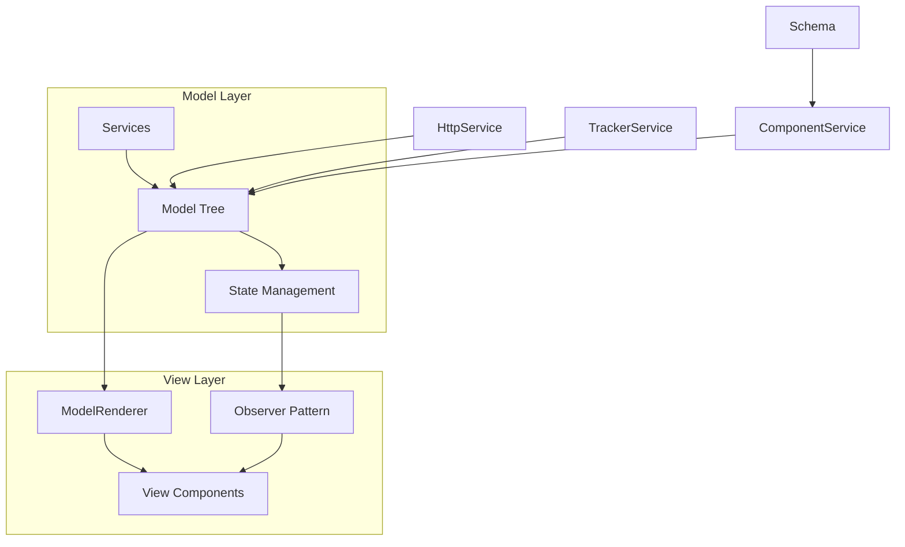
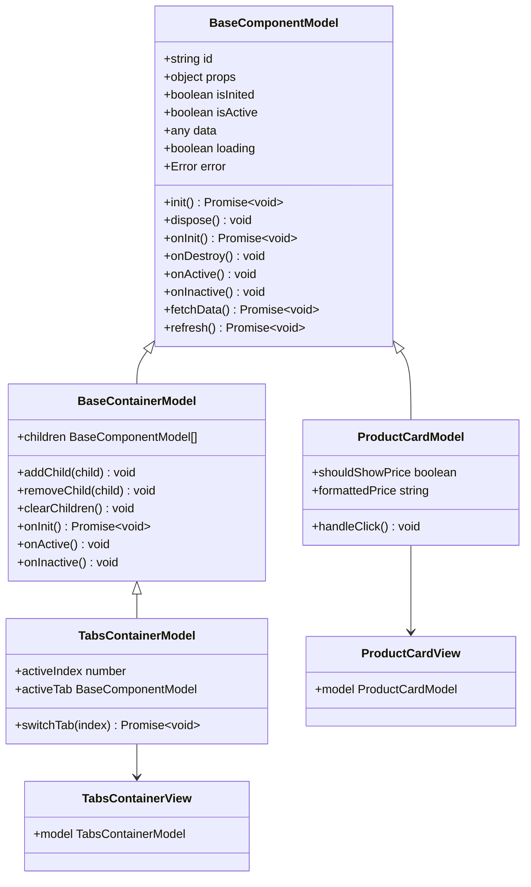
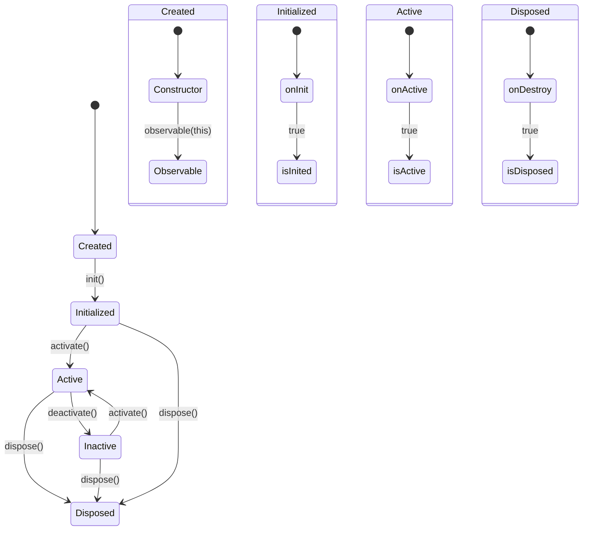
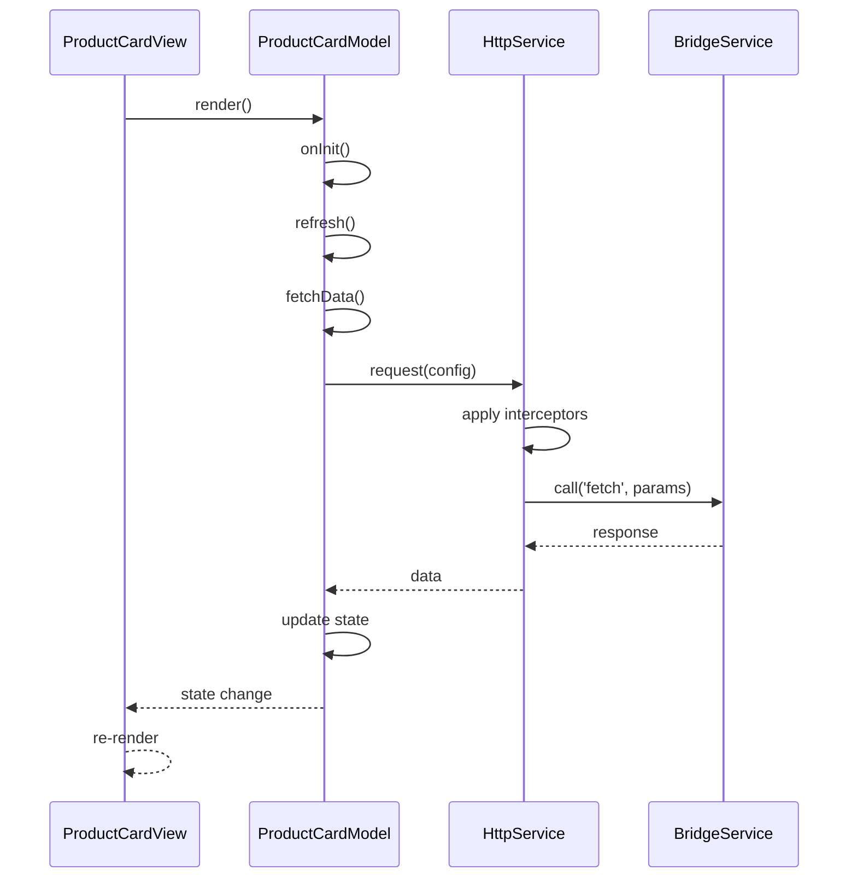
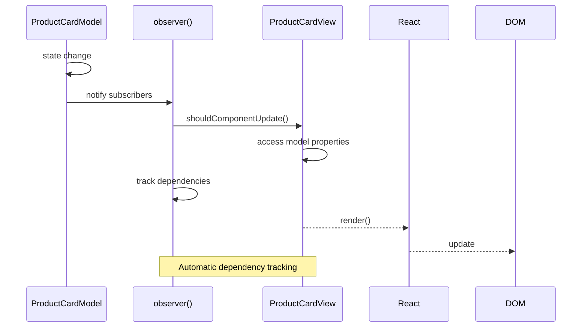

# Components/View Layer

<cite>
**Referenced Files in This Document**   
- [model-renderer.tsx](file://packages/h5-builder/src/components/model-renderer.tsx)
- [model.ts](file://packages/h5-builder/src/bedrock/model.ts)
- [product-card.model.ts](file://packages/h5-builder/src/components/product-card/product-card.model.ts)
- [product-card.view.tsx](file://packages/h5-builder/src/components/product-card/product-card.view.tsx)
- [tabs-container.model.ts](file://packages/h5-builder/src/components/tabs-container/tabs-container.model.ts)
- [tabs-container.view.tsx](file://packages/h5-builder/src/components/tabs-container/tabs-container.view.tsx)
- [http.service.ts](file://packages/h5-builder/src/services/http.service.ts)
- [observer.ts](file://packages/mobx-vue-lite/src/observer.ts)
- [component_development_guide.md](file://packages/h5-builder/docs/component_development_guide.md)
</cite>

## Table of Contents
1. [Introduction](#introduction)
2. [Architecture Overview](#architecture-overview)
3. [Core Components](#core-components)
4. [Model-View Separation Pattern](#model-view-separation-pattern)
5. [Component Lifecycle and State Management](#component-lifecycle-and-state-management)
6. [Data Fetching and Service Integration](#data-fetching-and-service-integration)
7. [Container Components and Child Management](#container-components-and-child-management)
8. [ModelRenderer and Component Registration](#modelrenderer-and-component-registration)
9. [Observer Pattern and Reactive Rendering](#observer-pattern-and-reactive-rendering)
10. [Best Practices and Development Guidelines](#best-practices-and-development-guidelines)

## Introduction
The H5 Builder Framework implements a strict Model-View separation pattern for component architecture, where business logic and UI presentation are completely decoupled. This documentation details the Components/View Layer architecture, focusing on how component models (extending BaseComponentModel) encapsulate business logic, state management, and lifecycle hooks, while view components (using the observer HOC) handle UI rendering and user interaction. The framework ensures separation of concerns through a well-defined contract between models and views, with the ModelRenderer responsible for traversing the model tree and rendering corresponding views based on registered mappings.

## Architecture Overview



**Diagram sources**
- [model-renderer.tsx](file://packages/h5-builder/src/components/model-renderer.tsx)
- [model.ts](file://packages/h5-builder/src/bedrock/model.ts)

## Core Components

The Components/View Layer consists of several key components that work together to implement the Model-View separation pattern. The BaseComponentModel serves as the foundation for all component models, providing essential functionality for state management, lifecycle hooks, and resource disposal. View components are pure UI components that receive models as props and use the observer HOC to automatically react to state changes. The ModelRenderer acts as the bridge between models and views, responsible for rendering the appropriate view component based on the model type.

**Section sources**
- [model.ts](file://packages/h5-builder/src/bedrock/model.ts)
- [model-renderer.tsx](file://packages/h5-builder/src/components/model-renderer.tsx)

## Model-View Separation Pattern

The H5 Builder Framework enforces a strict separation between business logic (Model) and UI presentation (View). Model classes extend BaseComponentModel and contain all business logic, state management, and lifecycle hooks, while View components are pure UI components that only handle rendering and user interaction. This separation ensures that models remain framework-agnostic and can be tested independently of the UI layer. View components receive the model as a prop and use the observer HOC to automatically re-render when the model's state changes.



**Diagram sources**
- [model.ts](file://packages/h5-builder/src/bedrock/model.ts)
- [product-card.model.ts](file://packages/h5-builder/src/components/product-card/product-card.model.ts)
- [product-card.view.tsx](file://packages/h5-builder/src/components/product-card/product-card.view.tsx)
- [tabs-container.model.ts](file://packages/h5-builder/src/components/tabs-container/tabs-container.model.ts)
- [tabs-container.view.tsx](file://packages/h5-builder/src/components/tabs-container/tabs-container.view.tsx)

## Component Lifecycle and State Management

Component models in the H5 Builder Framework follow a well-defined lifecycle with specific hooks for initialization, activation, deactivation, and destruction. The BaseComponentModel provides a standardized lifecycle interface with methods like onInit, onDestroy, onActive, and onInactive that can be overridden by subclasses to implement component-specific behavior. State management is handled through observable properties that automatically trigger UI updates when changed. The framework uses MobX for reactivity, making the entire model object observable and ensuring that views update automatically when model state changes.



**Diagram sources**
- [model.ts](file://packages/h5-builder/src/bedrock/model.ts)

**Section sources**
- [model.ts](file://packages/h5-builder/src/bedrock/model.ts)

## Data Fetching and Service Integration

Component models integrate with services like HttpService to fetch data and perform business operations. The ProductCardModel demonstrates this pattern by using dependency injection to receive an HttpService instance, which it uses to fetch product data in the fetchData method. The model manages the loading state, error handling, and data storage, providing a clean interface for the view component. This approach ensures that all data fetching logic remains in the model layer, maintaining the separation of concerns. The HttpService provides a robust interface for making HTTP requests with support for request/response interceptors, error handling, and cancellation.



**Diagram sources**
- [product-card.model.ts](file://packages/h5-builder/src/components/product-card/product-card.model.ts)
- [http.service.ts](file://packages/h5-builder/src/services/http.service.ts)

**Section sources**
- [product-card.model.ts](file://packages/h5-builder/src/components/product-card/product-card.model.ts)
- [http.service.ts](file://packages/h5-builder/src/services/http.service.ts)

## Container Components and Child Management

Container components like TabsContainerModel extend BaseContainerModel to manage collections of child models. These components handle the lifecycle of their children, including initialization, activation, and disposal. The TabsContainerModel demonstrates advanced patterns like lazy loading, where only the active tab is initialized initially, and idle-time prewarming, where other tabs are initialized in the background. The container also implements virtual scrolling optimization, automatically enabling virtual lists for tabs with many items to improve performance. This hierarchical management ensures that child components are properly managed while providing optimized user experiences.

```mermaid
flowchart TD
A[TabsContainerModel] --> B[onInit]
B --> C{Children Exist?}
C --> |Yes| D[Detect Virtual Scroll]
D --> E[Initialize Active Tab]
E --> F[Schedule Prewarm]
F --> G[Adjacent Tabs]
F --> H[Other Tabs]
F --> I[Timeout Fallback]
G --> J[Delay 500ms]
H --> K[Delay 2000ms]
I --> L[5s Timeout]
J --> M[init() Child]
K --> M
L --> M
M --> N[Child Initialized]
O[switchTab] --> P{Same Index?}
P --> |No| Q{Initialized?}
Q --> |No| R[Lazy Load]
R --> S[init() Child]
S --> T[activate() Child]
Q --> |Yes| T
T --> U[deactivate() Old]
U --> V[Update activeIndex]
```

**Diagram sources**
- [tabs-container.model.ts](file://packages/h5-builder/src/components/tabs-container/tabs-container.model.ts)

**Section sources**
- [tabs-container.model.ts](file://packages/h5-builder/src/components/tabs-container/tabs-container.model.ts)

## ModelRenderer and Component Registration

The ModelRenderer is responsible for rendering view components based on the model type. It uses a registration system where model-view mappings are defined, allowing the renderer to look up the appropriate view component for any given model. The registerModelView and registerModelViews functions enable explicit registration of these mappings. When rendering a model, the ModelRenderer first checks the mapping table for a registered view component. If found, it renders the view with the model as a prop. For unregistered container models, it recursively renders child models. This system provides flexibility in component registration while ensuring consistent rendering behavior across the application.

```mermaid
flowchart TD
A[ModelRenderer] --> B{Find View Component}
B --> C[modelViewMap.get()]
C --> D{View Found?}
D --> |Yes| E[Render ViewComponent]
D --> |No| F{Placeholder Type?}
F --> |Error| G[Render Error Placeholder]
F --> |Loading| H[Render Loading Placeholder]
F --> |Empty| I[Render Empty Placeholder]
F --> |Container| J[Render Children]
F --> |Unknown| K[Render Unknown Placeholder]
E --> L[Pass model as prop]
J --> M[Loop children]
M --> N[ModelRenderer child]
N --> O[Recursive render]
```

**Diagram sources**
- [model-renderer.tsx](file://packages/h5-builder/src/components/model-renderer.tsx)

**Section sources**
- [model-renderer.tsx](file://packages/h5-builder/src/components/model-renderer.tsx)

## Observer Pattern and Reactive Rendering

View components use the observer HOC from mobx-vue-lite to automatically react to changes in the model's state. This implementation of the observer pattern ensures that views re-render whenever any observable property accessed during rendering is modified. The observer HOC wraps the component function, tracking which observables are accessed during rendering and establishing subscriptions to trigger re-renders when those observables change. This approach eliminates the need for manual state management in views and ensures that the UI stays in sync with the model state. The pattern also includes optimizations like automatic memoization to prevent unnecessary re-renders when props haven't changed.



**Diagram sources**
- [observer.ts](file://packages/mobx-vue-lite/src/observer.ts)
- [product-card.view.tsx](file://packages/h5-builder/src/components/product-card/product-card.view.tsx)

**Section sources**
- [observer.ts](file://packages/mobx-vue-lite/src/observer.ts)
- [product-card.view.tsx](file://packages/h5-builder/src/components/product-card/product-card.view.tsx)

## Best Practices and Development Guidelines

Developing components in the H5 Builder Framework requires adherence to specific best practices to maintain the separation of concerns and ensure optimal performance. Models should contain all business logic and state management, while views should remain pure UI components that only handle rendering and event forwarding to the model. Resource management is critical, with all disposable resources (timers, event listeners, etc.) registered through the model's register method to ensure proper cleanup. Dependency injection should be used to provide services to models, enabling better testability and decoupling. Component registration should follow the established patterns, with model-view mappings explicitly defined to ensure proper rendering.

**Section sources**
- [component_development_guide.md](file://packages/h5-builder/docs/component_development_guide.md)