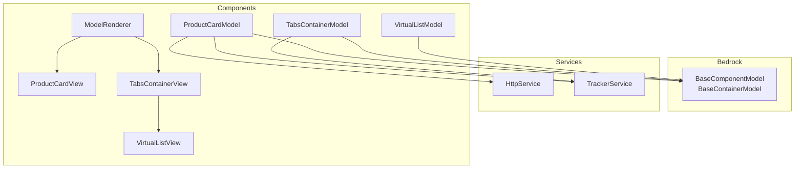
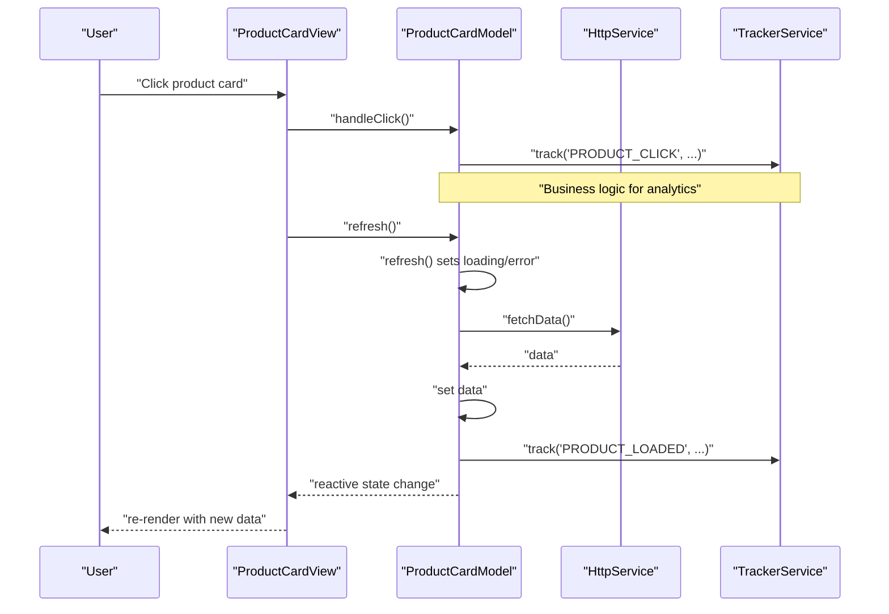
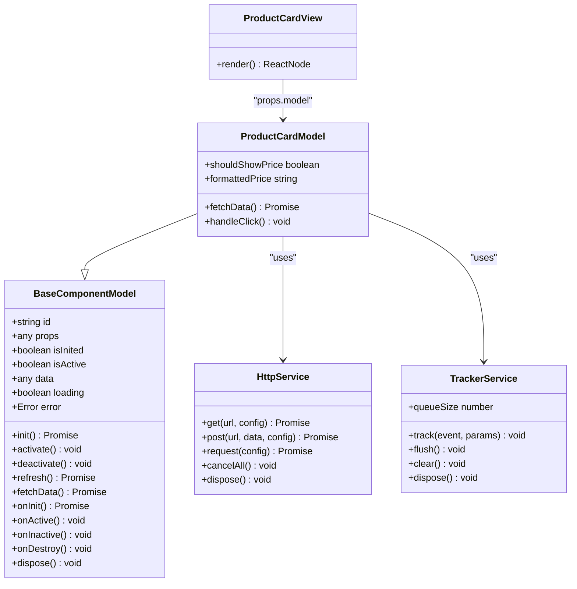
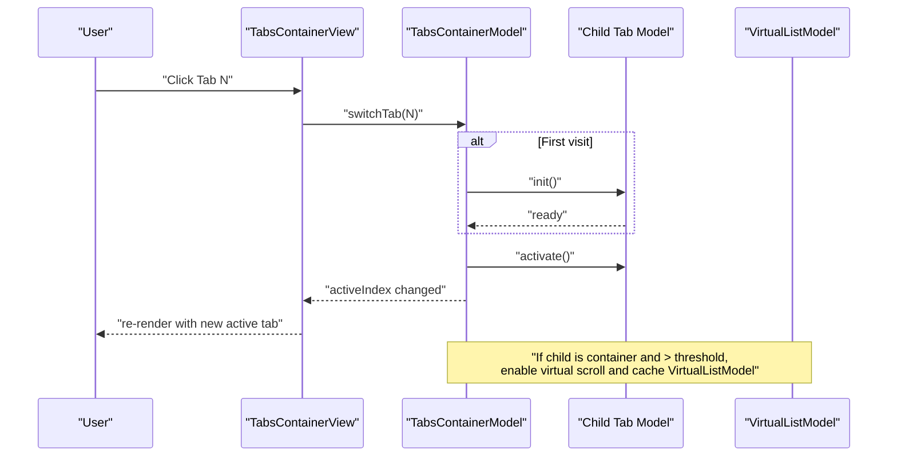
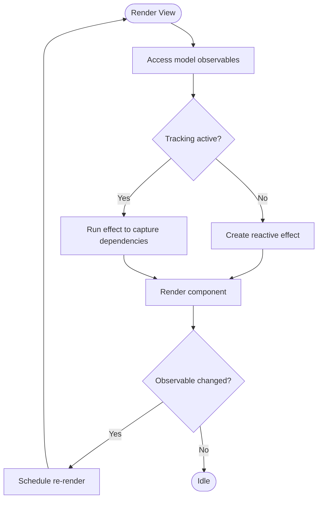
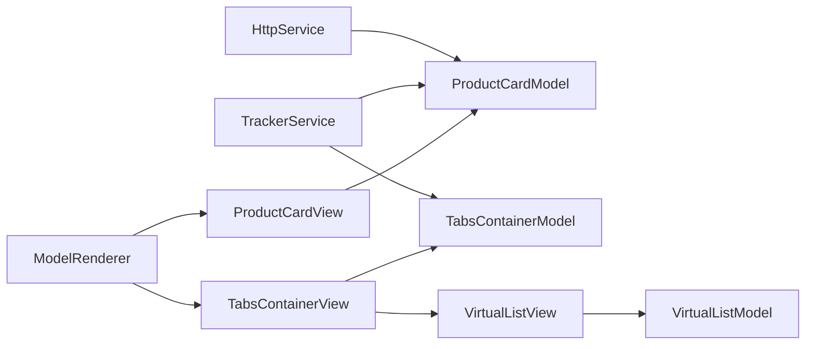

# Model-View Separation

<cite>
**Referenced Files in This Document**
- [model.ts](file://packages/h5-builder/src/bedrock/model.ts)
- [observer.ts](file://packages/mobx-vue-lite/src/observer.ts)
- [useObserver.ts](file://packages/mobx-vue-lite/src/useObserver.ts)
- [product-card.model.ts](file://packages/h5-builder/src/components/product-card/product-card.model.ts)
- [product-card.view.tsx](file://packages/h5-builder/src/components/product-card/product-card.view.tsx)
- [tabs-container.model.ts](file://packages/h5-builder/src/components/tabs-container/tabs-container.model.ts)
- [tabs-container.view.tsx](file://packages/h5-builder/src/components/tabs-container/tabs-container.view.tsx)
- [virtual-list.model.ts](file://packages/h5-builder/src/components/virtual-list/virtual-list.model.ts)
- [virtual-list.view.tsx](file://packages/h5-builder/src/components/virtual-list/virtual-list.view.tsx)
- [model-renderer.tsx](file://packages/h5-builder/src/components/model-renderer.tsx)
- [http.service.ts](file://packages/h5-builder/src/services/http.service.ts)
- [tracker.service.ts](file://packages/h5-builder/src/services/tracker.service.ts)
- [model.test.ts](file://packages/h5-builder/src/__tests__/model.test.ts)
- [http.service.test.ts](file://packages/h5-builder/src/__tests__/http.service.test.ts)
</cite>

## Table of Contents
1. [Introduction](#introduction)
2. [Project Structure](#project-structure)
3. [Core Components](#core-components)
4. [Architecture Overview](#architecture-overview)
5. [Detailed Component Analysis](#detailed-component-analysis)
6. [Dependency Analysis](#dependency-analysis)
7. [Performance Considerations](#performance-considerations)
8. [Troubleshooting Guide](#troubleshooting-guide)
9. [Conclusion](#conclusion)
10. [Appendices](#appendices)

## Introduction
This document explains the Model-View separation pattern in the H5 Builder Framework. It focuses on how business logic is encapsulated within models (extending BaseComponentModel or BaseContainerModel) while views are pure UI components that rely on the observer HOC from mobx-vue-lite to reactively re-render when model state changes. The document also outlines strict separation principles, demonstrates concrete examples (ProductCardModel using HttpService and TabsContainerView rendering tabbed interfaces), and provides guidance on structuring new components, avoiding anti-patterns, and troubleshooting common issues.

## Project Structure
The H5 Builder Framework organizes components into models and views, with a shared bedrock layer that defines lifecycle and reactivity. Services (e.g., HttpService, TrackerService) are injected into models to keep views free of business logic.

**Diagram sources**
- [model.ts](file://packages/h5-builder/src/bedrock/model.ts#L1-L243)
- [product-card.model.ts](file://packages/h5-builder/src/components/product-card/product-card.model.ts#L1-L133)
- [product-card.view.tsx](file://packages/h5-builder/src/components/product-card/product-card.view.tsx#L1-L81)
- [tabs-container.model.ts](file://packages/h5-builder/src/components/tabs-container/tabs-container.model.ts#L1-L273)
- [tabs-container.view.tsx](file://packages/h5-builder/src/components/tabs-container/tabs-container.view.tsx#L1-L85)
- [virtual-list.model.ts](file://packages/h5-builder/src/components/virtual-list/virtual-list.model.ts#L1-L217)
- [virtual-list.view.tsx](file://packages/h5-builder/src/components/virtual-list/virtual-list.view.tsx#L1-L129)
- [model-renderer.tsx](file://packages/h5-builder/src/components/model-renderer.tsx#L1-L105)
- [http.service.ts](file://packages/h5-builder/src/services/http.service.ts#L1-L281)
- [tracker.service.ts](file://packages/h5-builder/src/services/tracker.service.ts#L1-L290)

**Section sources**
- [model.ts](file://packages/h5-builder/src/bedrock/model.ts#L1-L243)
- [product-card.model.ts](file://packages/h5-builder/src/components/product-card/product-card.model.ts#L1-L133)
- [product-card.view.tsx](file://packages/h5-builder/src/components/product-card/product-card.view.tsx#L1-L81)
- [tabs-container.model.ts](file://packages/h5-builder/src/components/tabs-container/tabs-container.model.ts#L1-L273)
- [tabs-container.view.tsx](file://packages/h5-builder/src/components/tabs-container/tabs-container.view.tsx#L1-L85)
- [virtual-list.model.ts](file://packages/h5-builder/src/components/virtual-list/virtual-list.model.ts#L1-L217)
- [virtual-list.view.tsx](file://packages/h5-builder/src/components/virtual-list/virtual-list.view.tsx#L1-L129)
- [model-renderer.tsx](file://packages/h5-builder/src/components/model-renderer.tsx#L1-L105)
- [http.service.ts](file://packages/h5-builder/src/services/http.service.ts#L1-L281)
- [tracker.service.ts](file://packages/h5-builder/src/services/tracker.service.ts#L1-L290)

## Core Components
- BaseComponentModel: Provides lifecycle hooks (init, activate, deactivate, dispose), reactive state (data, loading, error), and a resource registration mechanism for safe cleanup.
- BaseContainerModel: Extends BaseComponentModel to manage collections of child models, with default initialization/activation/deactivation behaviors that can be overridden.
- observer HOC: Wraps function components to re-render when accessed observables change, enabling automatic UI updates from model state.
- ModelRenderer: A registry-driven renderer that maps model classes to view components and handles placeholders and container rendering.

Key separation principles:
- Models handle data loading, state management, lifecycle hooks, and service interactions.
- Views are pure UI components that render based on model state and forward user events to model methods.
- Business logic belongs in models; views should not call services directly nor contain async logic.

**Section sources**
- [model.ts](file://packages/h5-builder/src/bedrock/model.ts#L1-L243)
- [observer.ts](file://packages/mobx-vue-lite/src/observer.ts#L1-L52)
- [useObserver.ts](file://packages/mobx-vue-lite/src/useObserver.ts#L1-L59)
- [model-renderer.tsx](file://packages/h5-builder/src/components/model-renderer.tsx#L1-L105)

## Architecture Overview
The framework enforces a clean separation by injecting services into models and exposing models to views via props. Changes in model observables trigger re-renders through the observer HOC.

**Diagram sources**
- [product-card.view.tsx](file://packages/h5-builder/src/components/product-card/product-card.view.tsx#L1-L81)
- [product-card.model.ts](file://packages/h5-builder/src/components/product-card/product-card.model.ts#L1-L133)
- [http.service.ts](file://packages/h5-builder/src/services/http.service.ts#L1-L281)
- [tracker.service.ts](file://packages/h5-builder/src/services/tracker.service.ts#L1-L290)

## Detailed Component Analysis

### Product Card: Model-View Example
- ProductCardModel extends BaseComponentModel and encapsulates:
  - Data loading via a dedicated fetchData method.
  - Lifecycle hooks (onInit, onActive) for initialization and exposure tracking.
  - Event handlers (handleClick) that trigger analytics.
  - Computed properties (shouldShowPrice, formattedPrice) derived from props and data.
- ProductCardView is a pure UI component that:
  - Receives a model via props.
  - Uses observer HOC to re-render when model state changes.
  - Renders loading/error states and delegates user interactions to model methods.

**Diagram sources**
- [model.ts](file://packages/h5-builder/src/bedrock/model.ts#L1-L243)
- [product-card.model.ts](file://packages/h5-builder/src/components/product-card/product-card.model.ts#L1-L133)
- [product-card.view.tsx](file://packages/h5-builder/src/components/product-card/product-card.view.tsx#L1-L81)
- [http.service.ts](file://packages/h5-builder/src/services/http.service.ts#L1-L281)
- [tracker.service.ts](file://packages/h5-builder/src/services/tracker.service.ts#L1-L290)

**Section sources**
- [product-card.model.ts](file://packages/h5-builder/src/components/product-card/product-card.model.ts#L1-L133)
- [product-card.view.tsx](file://packages/h5-builder/src/components/product-card/product-card.view.tsx#L1-L81)
- [http.service.ts](file://packages/h5-builder/src/services/http.service.ts#L1-L281)
- [tracker.service.ts](file://packages/h5-builder/src/services/tracker.service.ts#L1-L290)

### Tabs Container: Container Model with Virtual Scroll
- TabsContainerModel extends BaseContainerModel and manages:
  - Active tab index and lifecycle transitions.
  - Lazy initialization and activation of tabs.
  - Automatic detection and enabling of virtual scrolling for tabs with many children.
  - Scheduled pre-warming of neighboring tabs and a timeout fallback.
- TabsContainerView is a pure UI component that:
  - Renders tab headers and content panels.
  - Switches tabs by invoking model.switchTab.
  - Renders either a ModelRenderer for regular tabs or a VirtualListView for tabs with virtual lists.

**Diagram sources**
- [tabs-container.view.tsx](file://packages/h5-builder/src/components/tabs-container/tabs-container.view.tsx#L1-L85)
- [tabs-container.model.ts](file://packages/h5-builder/src/components/tabs-container/tabs-container.model.ts#L1-L273)
- [virtual-list.model.ts](file://packages/h5-builder/src/components/virtual-list/virtual-list.model.ts#L1-L217)
- [virtual-list.view.tsx](file://packages/h5-builder/src/components/virtual-list/virtual-list.view.tsx#L1-L129)

**Section sources**
- [tabs-container.model.ts](file://packages/h5-builder/src/components/tabs-container/tabs-container.model.ts#L1-L273)
- [tabs-container.view.tsx](file://packages/h5-builder/src/components/tabs-container/tabs-container.view.tsx#L1-L85)
- [virtual-list.model.ts](file://packages/h5-builder/src/components/virtual-list/virtual-list.model.ts#L1-L217)
- [virtual-list.view.tsx](file://packages/h5-builder/src/components/virtual-list/virtual-list.view.tsx#L1-L129)

### Reactivity and Observer HOC
- observer HOC wraps function components to subscribe to observable changes and re-render automatically.
- useObserver hook provides the underlying mechanism for tracking observables during render and scheduling updates.
- In practice, views are wrapped with observer to ensure they respond to model state changes without manual subscriptions.

**Diagram sources**
- [observer.ts](file://packages/mobx-vue-lite/src/observer.ts#L1-L52)
- [useObserver.ts](file://packages/mobx-vue-lite/src/useObserver.ts#L1-L59)

**Section sources**
- [observer.ts](file://packages/mobx-vue-lite/src/observer.ts#L1-L52)
- [useObserver.ts](file://packages/mobx-vue-lite/src/useObserver.ts#L1-L59)

## Dependency Analysis
- Models depend on services (e.g., HttpService, TrackerService) via dependency injection.
- Views depend on models via props and are wrapped with observer HOC.
- Container models coordinate child lifecycle and can inject specialized models (e.g., VirtualListModel) for performance.

**Diagram sources**
- [http.service.ts](file://packages/h5-builder/src/services/http.service.ts#L1-L281)
- [tracker.service.ts](file://packages/h5-builder/src/services/tracker.service.ts#L1-L290)
- [product-card.model.ts](file://packages/h5-builder/src/components/product-card/product-card.model.ts#L1-L133)
- [tabs-container.model.ts](file://packages/h5-builder/src/components/tabs-container/tabs-container.model.ts#L1-L273)
- [virtual-list.model.ts](file://packages/h5-builder/src/components/virtual-list/virtual-list.model.ts#L1-L217)
- [virtual-list.view.tsx](file://packages/h5-builder/src/components/virtual-list/virtual-list.view.tsx#L1-L129)
- [model-renderer.tsx](file://packages/h5-builder/src/components/model-renderer.tsx#L1-L105)

**Section sources**
- [http.service.ts](file://packages/h5-builder/src/services/http.service.ts#L1-L281)
- [tracker.service.ts](file://packages/h5-builder/src/services/tracker.service.ts#L1-L290)
- [model-renderer.tsx](file://packages/h5-builder/src/components/model-renderer.tsx#L1-L105)

## Performance Considerations
- Virtual scrolling: TabsContainerModel can automatically enable VirtualListModel for tabs with many children, reducing DOM nodes and improving scroll performance.
- Lazy initialization and pre-warming: TabsContainerModel initializes only the active tab and pre-warms neighbors to minimize perceived latency.
- Resource cleanup: BaseComponentModel’s register/disposable-store ensures timers, observers, and pending requests are cleaned up deterministically.
- Batched analytics: TrackerService batches and persists events to reduce overhead and improve reliability.

[No sources needed since this section provides general guidance]

## Troubleshooting Guide
Common issues and resolutions:
- Unresponsive UI updates
  - Cause: Not using observer HOC around views or accessing model observables inside callbacks without re-rendering.
  - Resolution: Wrap views with observer and ensure model state changes are observable properties.
  - Evidence: observer HOC and useObserver hook behavior are defined in the mobx-vue-lite package.
  
- Memory leaks or lingering timers
  - Cause: Creating intervals or observers without registering cleanup.
  - Resolution: Use BaseComponentModel.register to register cleanup functions; dispose models to trigger onDestroy and cleanup.
  - Evidence: Resource management and lifecycle tests demonstrate correct disposal patterns.

- Improper service usage in views
  - Cause: Calling HttpService or TrackerService directly from views.
  - Resolution: Move service calls to model methods and expose public actions on the model for views to invoke.
  - Evidence: ProductCardModel uses HttpService and TrackerService internally; ProductCardView forwards clicks to model.handleClick.

- Excessive re-renders
  - Cause: Passing new object instances as props or mutating observables outside of model boundaries.
  - Resolution: Keep props immutable and mutate model state via model methods; leverage computed properties to derive UI state.

**Section sources**
- [observer.ts](file://packages/mobx-vue-lite/src/observer.ts#L1-L52)
- [useObserver.ts](file://packages/mobx-vue-lite/src/useObserver.ts#L1-L59)
- [model.test.ts](file://packages/h5-builder/src/__tests__/model.test.ts#L1-L231)
- [http.service.test.ts](file://packages/h5-builder/src/__tests__/http.service.test.ts#L1-L252)
- [product-card.model.ts](file://packages/h5-builder/src/components/product-card/product-card.model.ts#L1-L133)
- [product-card.view.tsx](file://packages/h5-builder/src/components/product-card/product-card.view.tsx#L1-L81)

## Conclusion
The H5 Builder Framework enforces a robust Model-View separation by centralizing business logic in models and keeping views pure and reactive. Models manage lifecycle, data, and service interactions, while views render UI and delegate user interactions to model methods. The observer HOC ensures automatic reactivity, and the bedrock layer provides lifecycle hooks and resource management. Following the patterns demonstrated by ProductCardModel and TabsContainerModel helps maintain clean, testable, and performant components.

[No sources needed since this section summarizes without analyzing specific files]

## Appendices

### How to Structure New Components
- Define a model extending BaseComponentModel or BaseContainerModel depending on whether it hosts children.
- Inject services via constructor parameters and use them in model methods (e.g., fetchData, lifecycle hooks).
- Expose public actions on the model for user interactions.
- Create a view component that receives the model via props and uses observer HOC to render based on model state.
- Register the model-view pair in ModelRenderer if it should be rendered generically.

**Section sources**
- [model.ts](file://packages/h5-builder/src/bedrock/model.ts#L1-L243)
- [model-renderer.tsx](file://packages/h5-builder/src/components/model-renderer.tsx#L1-L105)

### Anti-Patterns to Avoid
- Placing business logic in views (e.g., fetching data, managing timers).
- Calling services directly from views instead of delegating to model methods.
- Mutating model state outside of model methods or lifecycle hooks.
- Forgetting to register cleanup resources, leading to memory leaks.

**Section sources**
- [model.test.ts](file://packages/h5-builder/src/__tests__/model.test.ts#L1-L231)
- [http.service.test.ts](file://packages/h5-builder/src/__tests__/http.service.test.ts#L1-L252)