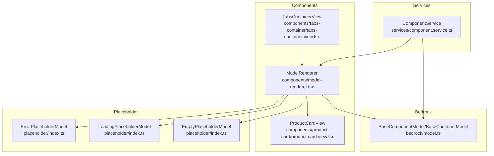
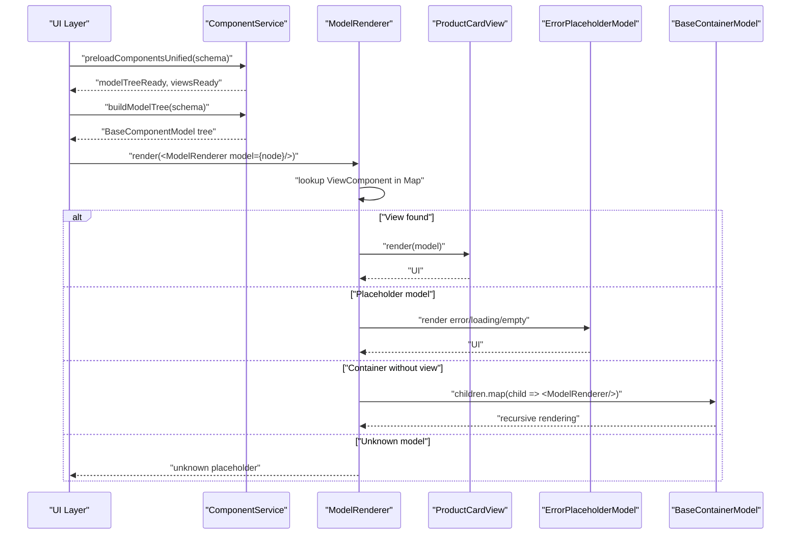
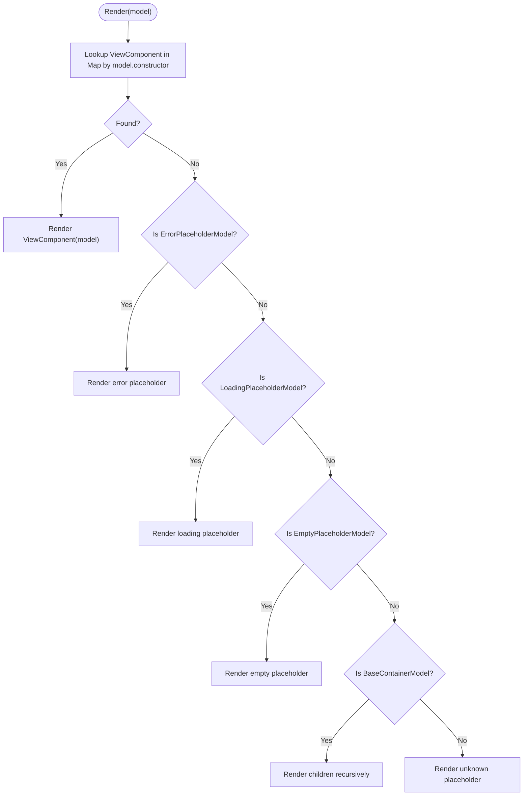
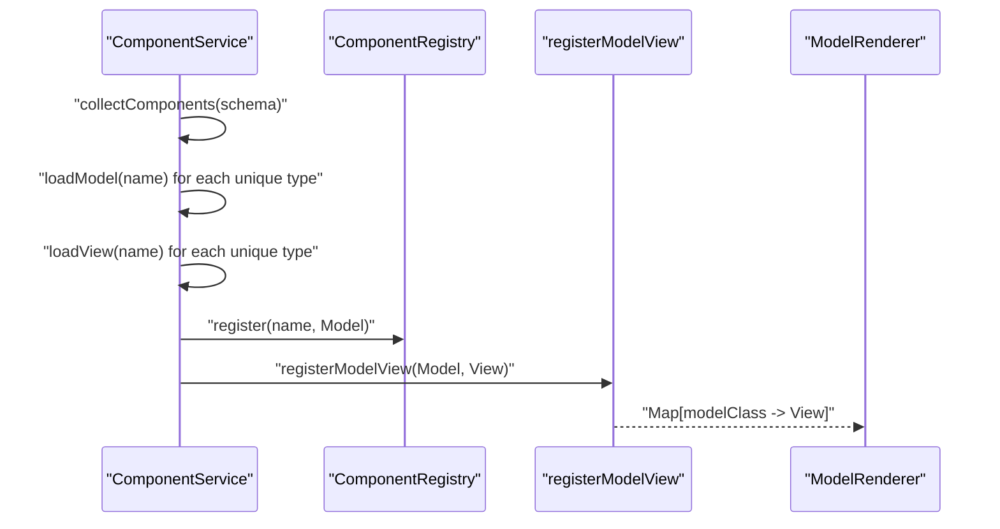
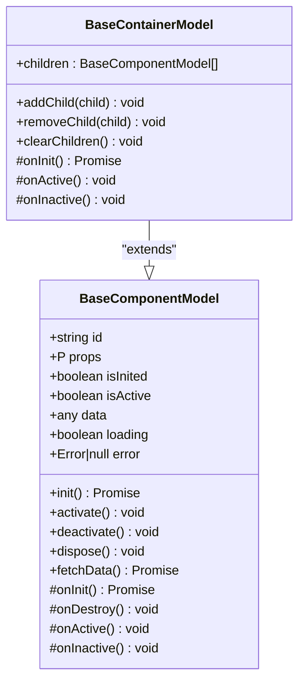
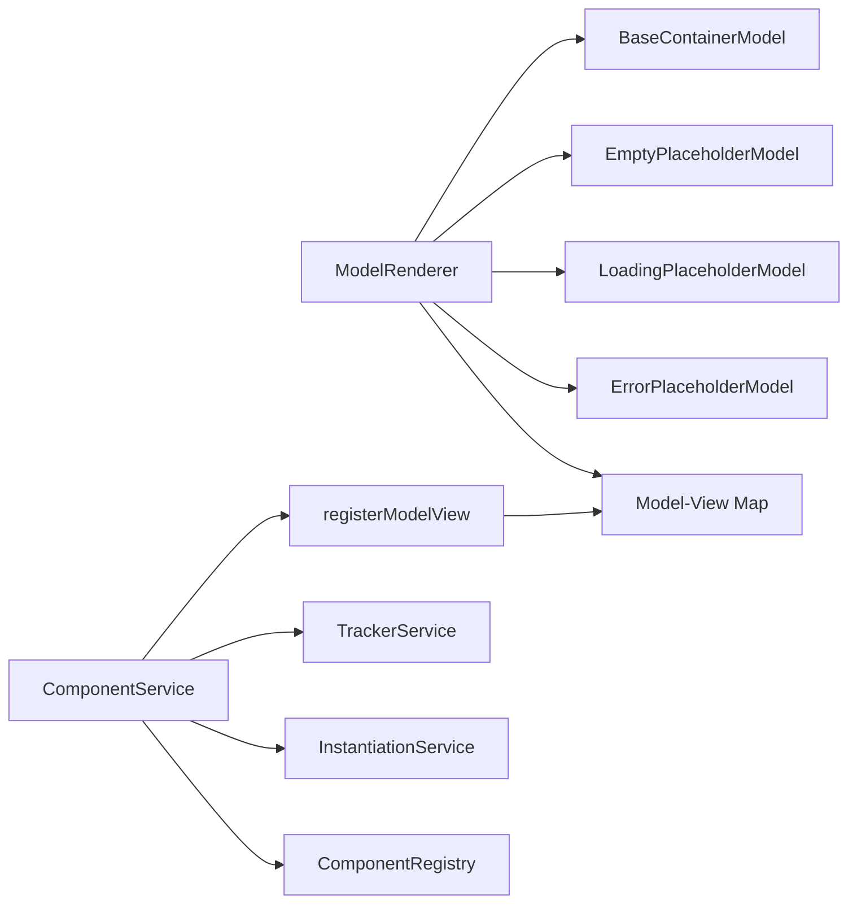

# ModelRenderer

<cite>
**Referenced Files in This Document**
- [model-renderer.tsx](file://packages/h5-builder/src/components/model-renderer.tsx)
- [component.service.ts](file://packages/h5-builder/src/services/component.service.ts)
- [model.ts](file://packages/h5-builder/src/bedrock/model.ts)
- [index.ts](file://packages/h5-builder/src/placeholder/index.ts)
- [product-card.view.tsx](file://packages/h5-builder/src/components/product-card/product-card.view.tsx)
- [tabs-container.view.tsx](file://packages/h5-builder/src/components/tabs-container/tabs-container.view.tsx)
- [tabs-container.model.ts](file://packages/h5-builder/src/components/tabs-container/tabs-container.model.ts)
</cite>

## Table of Contents
1. [Introduction](#introduction)
2. [Project Structure](#project-structure)
3. [Core Components](#core-components)
4. [Architecture Overview](#architecture-overview)
5. [Detailed Component Analysis](#detailed-component-analysis)
6. [Dependency Analysis](#dependency-analysis)
7. [Performance Considerations](#performance-considerations)
8. [Troubleshooting Guide](#troubleshooting-guide)
9. [Conclusion](#conclusion)

## Introduction
ModelRenderer is the central engine responsible for traversing the model tree and rendering corresponding views based on registered Model-View mappings. It acts as the bridge between models (business logic) and views (UI), resolving the correct view component at runtime using an internal Map keyed by model class constructors. It also handles special cases such as placeholder components (Error, Loading, Empty) and container models that may not have explicitly registered views by rendering their children recursively.

## Project Structure
The ModelRenderer lives under the components directory and integrates with the broader H5 Builder framework through:
- A global Map-based registry for Model-View mappings
- Placeholder models for error/loading/empty states
- Container models that own child models
- A component service that builds model trees and registers mappings

**Diagram sources**
- [model-renderer.tsx](file://packages/h5-builder/src/components/model-renderer.tsx#L1-L105)
- [component.service.ts](file://packages/h5-builder/src/services/component.service.ts#L1-L735)
- [model.ts](file://packages/h5-builder/src/bedrock/model.ts#L1-L200)
- [index.ts](file://packages/h5-builder/src/placeholder/index.ts#L1-L30)
- [product-card.view.tsx](file://packages/h5-builder/src/components/product-card/product-card.view.tsx#L1-L81)
- [tabs-container.view.tsx](file://packages/h5-builder/src/components/tabs-container/tabs-container.view.tsx#L1-L85)

**Section sources**
- [model-renderer.tsx](file://packages/h5-builder/src/components/model-renderer.tsx#L1-L105)
- [component.service.ts](file://packages/h5-builder/src/services/component.service.ts#L1-L735)
- [model.ts](file://packages/h5-builder/src/bedrock/model.ts#L1-L200)
- [index.ts](file://packages/h5-builder/src/placeholder/index.ts#L1-L30)

## Core Components
- ModelRenderer: Central renderer that resolves views via a Map keyed by model class constructor and handles placeholders and container fallback rendering.
- ComponentService: Builds model trees from schema, validates schema, and registers Model-View mappings after asynchronous loading.
- BaseComponentModel/BaseContainerModel: Base classes that define lifecycle hooks and container composition.
- Placeholder models: ErrorPlaceholderModel, LoadingPlaceholderModel, EmptyPlaceholderModel for robust error handling and UX.
- Example View components: ProductCardView demonstrates observer-based rendering and state handling.

Key responsibilities:
- Lookup: Map<model class constructor, view component>
- Conditional rendering: Placeholder components and container fallback
- Recursive rendering: Container children traversal
- Integration: Registration via ComponentService and asynchronous loading

**Section sources**
- [model-renderer.tsx](file://packages/h5-builder/src/components/model-renderer.tsx#L1-L105)
- [component.service.ts](file://packages/h5-builder/src/services/component.service.ts#L1-L735)
- [model.ts](file://packages/h5-builder/src/bedrock/model.ts#L1-L200)
- [index.ts](file://packages/h5-builder/src/placeholder/index.ts#L1-L30)
- [product-card.view.tsx](file://packages/h5-builder/src/components/product-card/product-card.view.tsx#L1-L81)

## Architecture Overview
ModelRenderer orchestrates rendering by:
1. Looking up the view component in a Map keyed by model constructor
2. Falling back to placeholder rendering for Error/Loading/Empty models
3. Recursively rendering container children when no explicit view is registered
4. Returning an unknown placeholder for unhandled model types

ComponentService complements this by:
- Building model trees from schema
- Validating schema and throwing or returning placeholders on errors
- Asynchronously loading models and views, then registering Model-View mappings
- Exposing APIs to wait for model tree readiness and view mapping completion

**Diagram sources**
- [component.service.ts](file://packages/h5-builder/src/services/component.service.ts#L628-L735)
- [model-renderer.tsx](file://packages/h5-builder/src/components/model-renderer.tsx#L50-L105)
- [model.ts](file://packages/h5-builder/src/bedrock/model.ts#L157-L200)
- [index.ts](file://packages/h5-builder/src/placeholder/index.ts#L1-L30)

## Detailed Component Analysis

### ModelRenderer: Lookup, Conditional Rendering, and Fallback Strategies
- Lookup logic: Uses a Map keyed by model class constructor to resolve the corresponding view component.
- Conditional rendering paths:
  - ErrorPlaceholderModel: Renders an error UI with message
  - LoadingPlaceholderModel: Renders a loading indicator
  - EmptyPlaceholderModel: Renders an empty-state UI
- Container fallback: If the model is a container and no view is registered, recursively renders children via ModelRenderer
- Unknown model: Renders an unknown placeholder UI

**Diagram sources**
- [model-renderer.tsx](file://packages/h5-builder/src/components/model-renderer.tsx#L50-L105)
- [index.ts](file://packages/h5-builder/src/placeholder/index.ts#L1-L30)
- [model.ts](file://packages/h5-builder/src/bedrock/model.ts#L157-L200)

**Section sources**
- [model-renderer.tsx](file://packages/h5-builder/src/components/model-renderer.tsx#L1-L105)

### ComponentService: Model Tree Building and Model-View Mapping Registration
- Schema validation and model creation
- Recursive building of container children
- Error handling: throws or returns ErrorPlaceholderModel
- Asynchronous loading: collects components, loads models and views concurrently, caches results
- Mapping registration: after loading completes, registers Model-View pairs via registerModelView

**Diagram sources**
- [component.service.ts](file://packages/h5-builder/src/services/component.service.ts#L349-L735)
- [model-renderer.tsx](file://packages/h5-builder/src/components/model-renderer.tsx#L15-L31)

**Section sources**
- [component.service.ts](file://packages/h5-builder/src/services/component.service.ts#L1-L735)

### BaseComponentModel and BaseContainerModel: Lifecycle and Composition
- BaseComponentModel: Defines lifecycle hooks (init, activate, deactivate, dispose), reactive state (loading, error, data), and resource registration
- BaseContainerModel: Extends BaseComponentModel to manage children, with default initialization/activation/deactivation behavior

**Diagram sources**
- [model.ts](file://packages/h5-builder/src/bedrock/model.ts#L1-L200)

**Section sources**
- [model.ts](file://packages/h5-builder/src/bedrock/model.ts#L1-L200)

### Placeholder Models: Error, Loading, Empty
- ErrorPlaceholderModel: Stores originalType and error message; logs on init
- LoadingPlaceholderModel: Minimal lifecycle
- EmptyPlaceholderModel: Minimal lifecycle

These models are rendered directly by ModelRenderer when encountered during traversal.

**Section sources**
- [index.ts](file://packages/h5-builder/src/placeholder/index.ts#L1-L30)
- [model-renderer.tsx](file://packages/h5-builder/src/components/model-renderer.tsx#L61-L84)

### Example Integration: TabsContainerView and ProductCardView
- TabsContainerView conditionally uses VirtualListView when virtual scrolling is enabled or falls back to ModelRenderer for normal rendering
- ProductCardView uses observer to react to observable state changes and renders loading/error/data states

**Section sources**
- [tabs-container.view.tsx](file://packages/h5-builder/src/components/tabs-container/tabs-container.view.tsx#L1-L85)
- [product-card.view.tsx](file://packages/h5-builder/src/components/product-card/product-card.view.tsx#L1-L81)

## Dependency Analysis
- ModelRenderer depends on:
  - A global Map for Model-View mappings
  - Placeholder models for error/loading/empty rendering
  - BaseContainerModel for recursive rendering of children
- ComponentService depends on:
  - ComponentRegistry for type-to-model mapping
  - InstantiationService for creating model instances
  - TrackerService for telemetry
  - Registers Model-View mappings after asynchronous loading

**Diagram sources**
- [model-renderer.tsx](file://packages/h5-builder/src/components/model-renderer.tsx#L1-L105)
- [component.service.ts](file://packages/h5-builder/src/services/component.service.ts#L1-L735)
- [model.ts](file://packages/h5-builder/src/bedrock/model.ts#L1-L200)
- [index.ts](file://packages/h5-builder/src/placeholder/index.ts#L1-L30)

**Section sources**
- [model-renderer.tsx](file://packages/h5-builder/src/components/model-renderer.tsx#L1-L105)
- [component.service.ts](file://packages/h5-builder/src/services/component.service.ts#L1-L735)

## Performance Considerations
- Fine-grained reactivity: Views should be wrapped with observer to minimize re-renders when only observed properties change. This ensures that only the components that depend on observable state re-render.
- Avoid unnecessary re-renders: Keep models observable and pass only the minimal props needed to views. Use memoization where appropriate.
- Container rendering: For large container trees, consider enabling virtual scrolling (as demonstrated in TabsContainerModel) to limit DOM nodes and improve performance.
- Asynchronous loading: Use ComponentService’s unified preloading to batch load models and views, then register mappings once, reducing repeated lookups and improving startup performance.

[No sources needed since this section provides general guidance]

## Troubleshooting Guide
Common issues and resolutions:
- Missing view mapping:
  - Symptom: Unknown placeholder appears for a model that should have a view
  - Cause: Model class not registered with a view via registerModelView
  - Resolution: Ensure ComponentService.preloadComponentsUnified is called and registerModelView(Model, View) is executed for the component
  - Reference: [registerModelView](file://packages/h5-builder/src/components/model-renderer.tsx#L15-L31), [registerModelViewMappings](file://packages/h5-builder/src/services/component.service.ts#L496-L513)
- Incorrect inheritance resolution:
  - Symptom: Container fallback renders children but expected specialized view does not appear
  - Cause: BaseContainerModel is matched before subclass-specific mapping
  - Resolution: Register subclass mappings before container fallback path is reached; ensure subclass view is registered
  - Reference: [ModelRenderer fallback](file://packages/h5-builder/src/components/model-renderer.tsx#L86-L96), [BaseContainerModel](file://packages/h5-builder/src/bedrock/model.ts#L157-L200)
- Placeholder rendering:
  - Symptom: Error/loading/empty placeholders displayed unexpectedly
  - Causes: Schema validation failures, missing type/id, or child build errors
  - Resolution: Verify schema fields and ensure ComponentService.validateSchema passes; inspect ComponentService error handling paths
  - Reference: [ComponentService buildTree and error handling](file://packages/h5-builder/src/services/component.service.ts#L131-L159), [Placeholder models](file://packages/h5-builder/src/placeholder/index.ts#L1-L30)
- Debugging tips:
  - Use console logs around lookup and fallback paths in ModelRenderer
  - Inspect ComponentRegistry contents and mapping registration via ComponentService
  - Ensure observer wrappers are applied to views to leverage fine-grained reactivity

**Section sources**
- [model-renderer.tsx](file://packages/h5-builder/src/components/model-renderer.tsx#L50-L105)
- [component.service.ts](file://packages/h5-builder/src/services/component.service.ts#L131-L159)
- [index.ts](file://packages/h5-builder/src/placeholder/index.ts#L1-L30)

## Conclusion
ModelRenderer is the core rendering engine that bridges models and views, leveraging a Map-based lookup strategy and robust fallback mechanisms for placeholders and containers. ComponentService complements this by building model trees, validating schemas, and registering Model-View mappings after asynchronous loading. Together, they provide a scalable, resilient rendering pipeline with strong performance characteristics through observer-based reactivity and container optimizations like virtual scrolling.