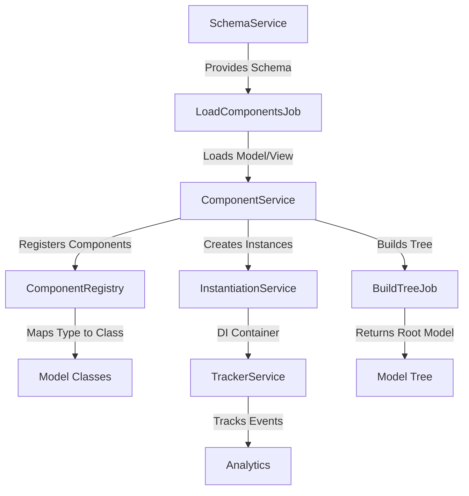
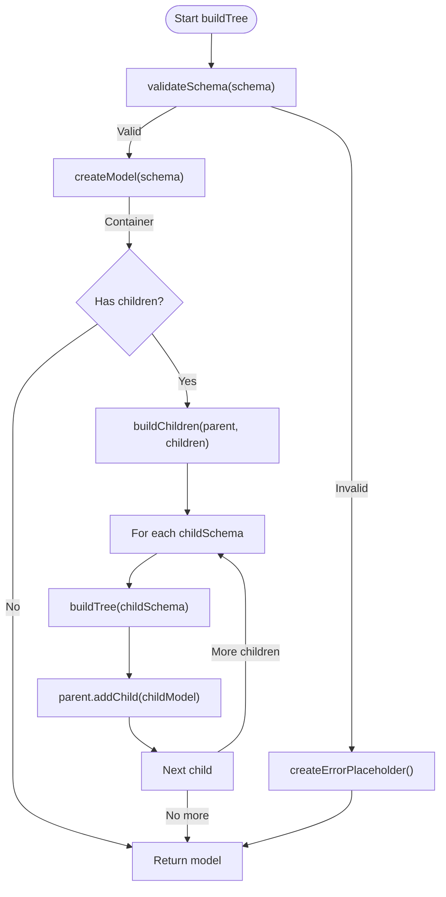
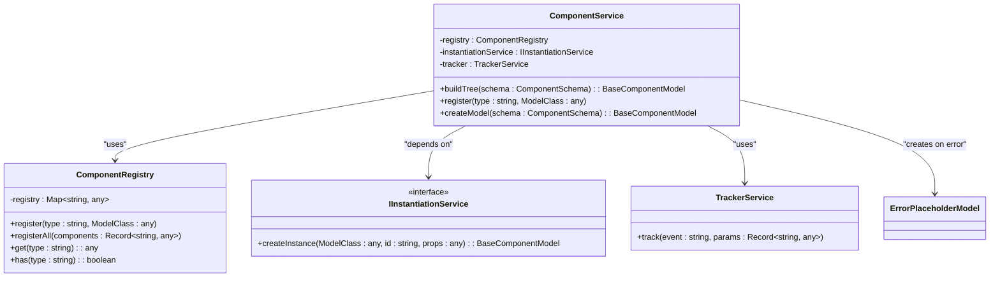
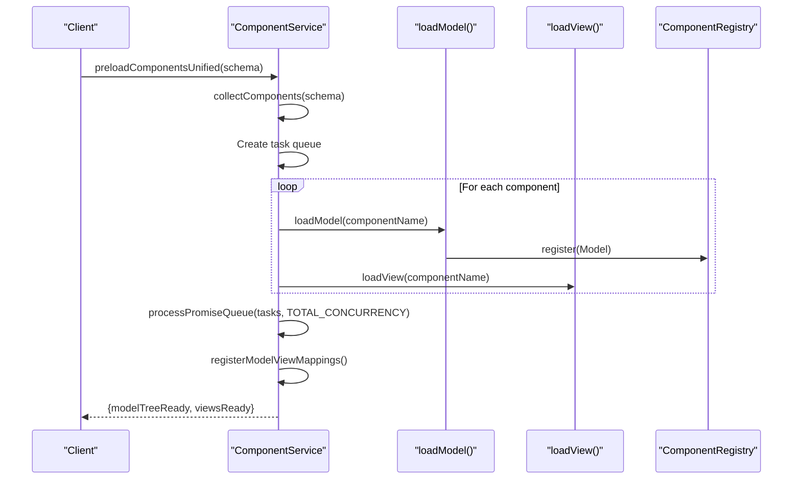
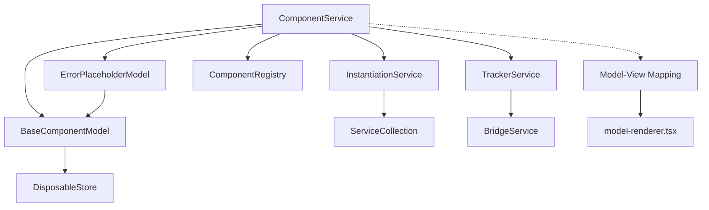

# Component Loader

<cite>
**Referenced Files in This Document**   
- [component.service.ts](file://packages/h5-builder/src/services/component.service.ts)
- [build-tree-job.ts](file://packages/h5-builder/src/jobs/build-tree-job.ts)
- [schema.service.ts](file://packages/h5-builder/src/services/schema.service.ts)
- [tracker.service.ts](file://packages/h5-builder/src/services/tracker.service.ts)
- [model-renderer.tsx](file://packages/h5-builder/src/components/model-renderer.tsx)
- [model.ts](file://packages/h5-builder/src/bedrock/model.ts)
- [placeholder/index.ts](file://packages/h5-builder/src/placeholder/index.ts)
- [load-components-job.ts](file://packages/h5-builder/src/jobs/load-components-job.ts)
</cite>

## Table of Contents
1. [Introduction](#introduction)
2. [Core Components](#core-components)
3. [Architecture Overview](#architecture-overview)
4. [Detailed Component Analysis](#detailed-component-analysis)
5. [Dependency Analysis](#dependency-analysis)
6. [Performance Considerations](#performance-considerations)
7. [Troubleshooting Guide](#troubleshooting-guide)
8. [Conclusion](#conclusion)

## Introduction
The Component Loader subsystem within the Flow Layer is responsible for transforming component schemas into fully initialized model trees. It handles recursive tree construction, schema validation, error handling, and integration with dependency injection and tracking systems. The system supports both synchronous and asynchronous component loading, with mechanisms for lazy loading, concurrency control, and graceful error recovery through placeholder components.

## Core Components

The Component Loader subsystem is primarily implemented through the `ComponentService` class, which orchestrates the transformation of component schemas into model trees. It integrates with the Dependency Injection system via `instantiationService` and tracks component lifecycle events through `TrackerService`. The system uses a registry pattern to map component types to their corresponding model classes and supports both synchronous and asynchronous component loading.

**Section sources**
- [component.service.ts](file://packages/h5-builder/src/services/component.service.ts#L100-L734)
- [build-tree-job.ts](file://packages/h5-builder/src/jobs/build-tree-job.ts#L12-L58)

## Architecture Overview

The Component Loader follows a job-based architecture where component loading and model tree construction are handled in distinct phases. The system first loads component resources asynchronously, then constructs the model tree synchronously once all dependencies are available.



**Diagram sources **
- [component.service.ts](file://packages/h5-builder/src/services/component.service.ts#L100-L734)
- [build-tree-job.ts](file://packages/h5-builder/src/jobs/build-tree-job.ts#L12-L58)
- [load-components-job.ts](file://packages/h5-builder/src/jobs/load-components-job.ts#L11-L60)

## Detailed Component Analysis

### Component Building Process

The Component Loader transforms component schemas into model trees through a recursive process that validates schemas, creates model instances, and establishes parent-child relationships.

#### Building the Model Tree


**Diagram sources **
- [component.service.ts](file://packages/h5-builder/src/services/component.service.ts#L135-L208)

**Section sources**
- [component.service.ts](file://packages/h5-builder/src/services/component.service.ts#L135-L208)

### Registry and Dependency Injection

The Component Loader uses an internal registry to map component types to model classes and integrates with the Dependency Injection system for instance creation.



**Diagram sources **
- [component.service.ts](file://packages/h5-builder/src/services/component.service.ts#L52-L94)
- [component.service.ts](file://packages/h5-builder/src/services/component.service.ts#L100-L114)

**Section sources**
- [component.service.ts](file://packages/h5-builder/src/services/component.service.ts#L52-L94)
- [component.service.ts](file://packages/h5-builder/src/services/component.service.ts#L100-L114)

### Asynchronous Loading and Preloading

The Component Loader supports asynchronous component loading through the `preloadComponentsUnified` method, which manages concurrent loading of model and view modules with configurable concurrency limits.



**Diagram sources **
- [component.service.ts](file://packages/h5-builder/src/services/component.service.ts#L632-L696)

**Section sources**
- [component.service.ts](file://packages/h5-builder/src/services/component.service.ts#L259-L696)

### Error Handling and Placeholder Components

The Component Loader implements robust error handling that gracefully degrades by inserting placeholder components when errors occur during model creation or schema validation.

```mermaid
flowchart TD
A[buildTree(schema)] --> B{validateSchema()}
B --> |Success| C[createModel()]
B --> |Failure| D[createErrorPlaceholder()]
C --> |Success| E{Has children?}
C --> |Failure| D
E --> |Yes| F[buildChildren()]
F --> G{Child build success?}
G --> |Yes| H[addChild()]
G --> |No| I[createErrorPlaceholder()]
I --> H
H --> J[Next child]
J --> |More| F
J --> |Done| K[Return model]
D --> K
```

**Diagram sources **
- [component.service.ts](file://packages/h5-builder/src/services/component.service.ts#L135-L208)
- [placeholder/index.ts](file://packages/h5-builder/src/placeholder/index.ts#L6-L11)

**Section sources**
- [component.service.ts](file://packages/h5-builder/src/services/component.service.ts#L135-L234)
- [placeholder/index.ts](file://packages/h5-builder/src/placeholder/index.ts#L6-L11)

## Dependency Analysis

The Component Loader subsystem has well-defined dependencies on several core services and utilities within the application architecture.



**Diagram sources **
- [component.service.ts](file://packages/h5-builder/src/services/component.service.ts#L111-L114)
- [model-renderer.tsx](file://packages/h5-builder/src/components/model-renderer.tsx#L10-L20)

**Section sources**
- [component.service.ts](file://packages/h5-builder/src/services/component.service.ts#L111-L114)
- [model-renderer.tsx](file://packages/h5-builder/src/components/model-renderer.tsx#L10-L20)

## Performance Considerations

The Component Loader implements several performance optimizations to ensure efficient component loading and tree construction:

1. **Concurrent Loading**: Uses `TOTAL_CONCURRENCY` limit (6) to control parallel loading of model and view modules
2. **Caching**: Maintains caches for loaded models and views to prevent redundant loading
3. **Batched Operations**: Processes component loading in batches with `processPromiseQueue`
4. **Lazy Registration**: Registers model-view mappings only after all resources are loaded
5. **Memory Management**: Uses `DisposableStore` for proper resource cleanup

The system balances performance and resource usage by allowing configuration of concurrency limits and supporting delayed loading through the `delayRange` metadata property.

**Section sources**
- [component.service.ts](file://packages/h5-builder/src/services/component.service.ts#L279-L281)
- [component.service.ts](file://packages/h5-builder/src/services/component.service.ts#L266-L270)

## Troubleshooting Guide

Common issues with the Component Loader and their solutions:

### Schema Validation Failures
- **Symptoms**: `Unknown component type` or `missing type/id field` errors
- **Causes**: Invalid schema structure or unregistered component types
- **Solutions**: 
  - Ensure all component types are registered before building the tree
  - Validate schema structure matches `ComponentSchema` interface
  - Use `getRegistryInfo()` to verify registered components

### Circular Dependencies
- **Symptoms**: Infinite recursion during tree building
- **Causes**: Component schemas that reference each other as children
- **Solutions**:
  - Restructure component hierarchy to eliminate cycles
  - Use conditional containers to break circular references
  - Implement depth limits in recursive functions

### Race Conditions During Parallel Loading
- **Symptoms**: Inconsistent model tree state or missing view mappings
- **Causes**: Concurrent modification of shared state
- **Solutions**:
  - Use `preloadComponentsUnified` which ensures atomic loading
  - Rely on the `_loadingResult` cache to prevent multiple concurrent loads
  - Wait for `getModelTreeReady()` before building the tree

### Best Practices
1. Always register components before calling `preloadComponentsUnified`
2. Use `buildModelTree` only after `getModelTreeReady` resolves
3. Handle errors gracefully by checking for `ErrorPlaceholderModel` instances
4. Monitor loading performance using the tracking events
5. Test with various schema complexities to ensure stability

**Section sources**
- [component.service.ts](file://packages/h5-builder/src/services/component.service.ts#L138-L226)
- [component.service.ts](file://packages/h5-builder/src/services/component.service.ts#L632-L696)
- [component.service.ts](file://packages/h5-builder/src/services/component.service.ts#L702-L717)

## Conclusion
The Component Loader subsystem provides a robust mechanism for transforming component schemas into fully initialized model trees. It combines recursive tree construction with comprehensive error handling, asynchronous loading capabilities, and tight integration with the dependency injection and tracking systems. The implementation demonstrates thoughtful design patterns including registry management, concurrent processing with controlled concurrency, and graceful error recovery through placeholder components. By following the documented best practices and understanding the common pitfalls, developers can effectively leverage this subsystem to build complex, dynamic user interfaces with reliable component loading behavior.