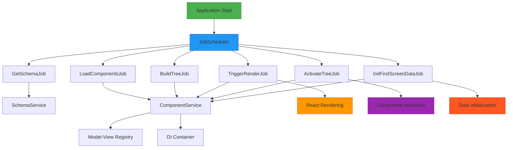
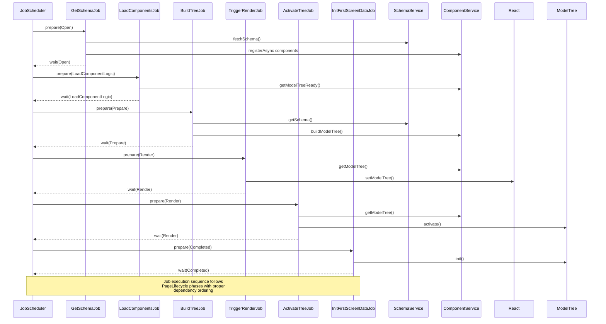
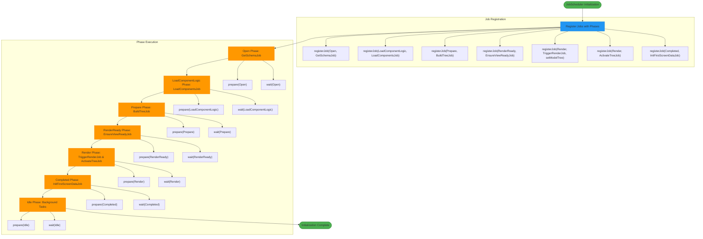
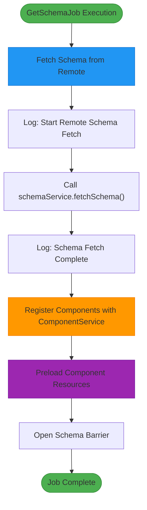
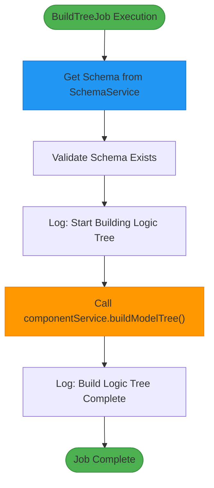
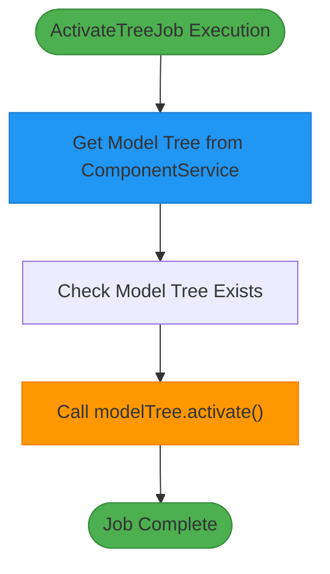
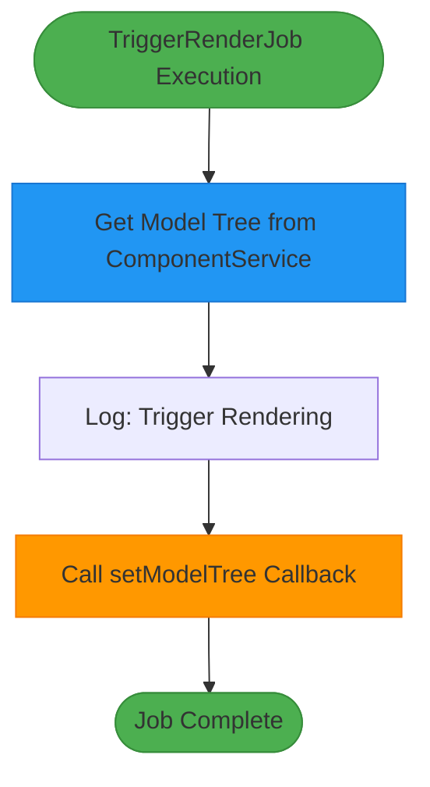
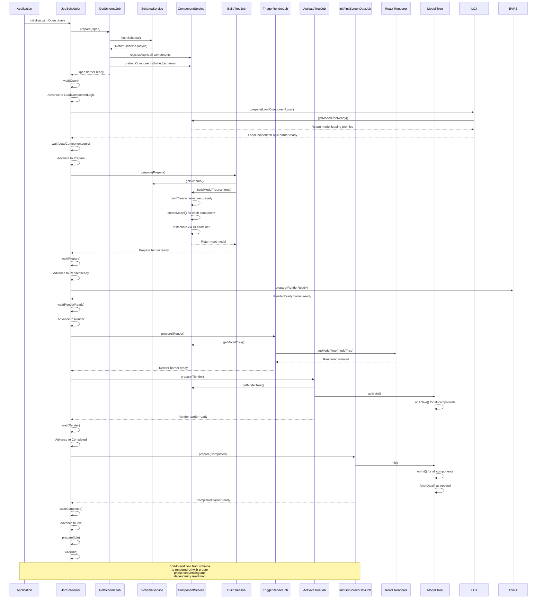

# Flow Layer

<cite>
**Referenced Files in This Document**   
- [get-schema-job.ts](file://packages/h5-builder/src/jobs/get-schema-job.ts)
- [build-tree-job.ts](file://packages/h5-builder/src/jobs/build-tree-job.ts)
- [activate-tree-job.ts](file://packages/h5-builder/src/jobs/activate-tree-job.ts)
- [trigger-render-job.ts](file://packages/h5-builder/src/jobs/trigger-render-job.ts)
- [component.service.ts](file://packages/h5-builder/src/services/component.service.ts)
- [job-scheduler.ts](file://packages/h5-builder/src/bedrock/launch/job-scheduler.ts)
- [lifecycle.ts](file://packages/h5-builder/src/jobs/lifecycle.ts)
- [schema.service.ts](file://packages/h5-builder/src/services/schema.service.ts)
- [model.ts](file://packages/h5-builder/src/bedrock/model.ts)
- [abstract-job.ts](file://packages/h5-builder/src/bedrock/launch/abstract-job.ts)
- [load-components-job.ts](file://packages/h5-builder/src/jobs/load-components-job.ts)
- [init-first-screen-data-job.ts](file://packages/h5-builder/src/jobs/init-first-screen-data-job.ts)
- [service-identifiers.ts](file://packages/h5-builder/src/services/service-identifiers.ts)
- [demo-progressive.tsx](file://packages/h5-builder/src/demo-progressive.tsx)
</cite>

## Table of Contents
1. [Introduction](#introduction)
2. [Architecture Overview](#architecture-overview)
3. [Job Execution Sequence](#job-execution-sequence)
4. [ComponentLoader and Model Tree Construction](#componentloader-and-model-tree-construction)
5. [JobScheduler and Lifecycle Management](#jobscheduler-and-lifecycle-management)
6. [Core Job Types](#core-job-types)
7. [Dependency Resolution and Coordination](#dependency-resolution-and-coordination)
8. [Flow from Schema to Rendering](#flow-from-schema-to-rendering)
9. [Conclusion](#conclusion)

## Introduction
The Flow Layer of the H5 Builder Framework orchestrates the application initialization and rendering process through a job-based system. This layer coordinates between the Kernel Layer's dependency injection (DI) system and the Infrastructure Layer's services to transform component schemas into rendered UI. The core components include the ComponentLoader, which manages component lifecycle and model tree construction, and the JobScheduler, which sequences operations such as schema loading, model building, and rendering. This document details how these components work together to implement the startup sequence through various job types including GetSchemaJob, BuildTreeJob, ActivateTreeJob, and TriggerRenderJob.

## Architecture Overview
The Flow Layer implements a phased initialization process that transforms component schemas into rendered UI through a series of coordinated jobs. The architecture follows a clear separation of concerns between job definition, scheduling, and execution, with well-defined interfaces for dependency injection and service coordination.



**Diagram sources**
- [job-scheduler.ts](file://packages/h5-builder/src/bedrock/launch/job-scheduler.ts)
- [get-schema-job.ts](file://packages/h5-builder/src/jobs/get-schema-job.ts)
- [build-tree-job.ts](file://packages/h5-builder/src/jobs/build-tree-job.ts)
- [trigger-render-job.ts](file://packages/h5-builder/src/jobs/trigger-render-job.ts)
- [activate-tree-job.ts](file://packages/h5-builder/src/jobs/activate-tree-job.ts)
- [init-first-screen-data-job.ts](file://packages/h5-builder/src/jobs/init-first-screen-data-job.ts)
- [component.service.ts](file://packages/h5-builder/src/services/component.service.ts)

**Section sources**
- [job-scheduler.ts](file://packages/h5-builder/src/bedrock/launch/job-scheduler.ts)
- [demo-progressive.tsx](file://packages/h5-builder/src/demo-progressive.tsx)

## Job Execution Sequence
The Flow Layer executes jobs in a specific sequence defined by the PageLifecycle enum, ensuring proper dependency resolution and initialization order. The sequence begins with schema acquisition and progresses through component loading, model tree construction, rendering, and post-render activation.



**Diagram sources**
- [demo-progressive.tsx](file://packages/h5-builder/src/demo-progressive.tsx)
- [lifecycle.ts](file://packages/h5-builder/src/jobs/lifecycle.ts)
- [get-schema-job.ts](file://packages/h5-builder/src/jobs/get-schema-job.ts)
- [load-components-job.ts](file://packages/h5-builder/src/jobs/load-components-job.ts)
- [build-tree-job.ts](file://packages/h5-builder/src/jobs/build-tree-job.ts)
- [trigger-render-job.ts](file://packages/h5-builder/src/jobs/trigger-render-job.ts)
- [activate-tree-job.ts](file://packages/h5-builder/src/jobs/activate-tree-job.ts)
- [init-first-screen-data-job.ts](file://packages/h5-builder/src/jobs/init-first-screen-data-job.ts)

**Section sources**
- [demo-progressive.tsx](file://packages/h5-builder/src/demo-progressive.tsx)
- [lifecycle.ts](file://packages/h5-builder/src/jobs/lifecycle.ts)

## ComponentLoader and Model Tree Construction
The ComponentLoader, implemented as ComponentService, manages the component lifecycle and model tree construction. It handles component registration, dependency resolution, and tree building from schemas. The loader supports both synchronous and asynchronous component registration with configurable loading priorities and dependencies.

```mermaid
classDiagram
class ComponentService {
+_modelTree : BaseComponentModel | null
+_loadingResult : {modelTreeReady, viewsReady} | null
+registry : ComponentRegistry
+modelLoaders : Map~string, () => Promise~any~~
+viewLoaders : Map~string, () => Promise~any~~
+metadata : Map~string, ComponentMetadata~
+register(type : string, ModelClass : any) : void
+registerAsync(componentName : string, config : {model?, view?, loader?}, metadata? : ComponentMetadata) : void
+buildModelTree(schema : ComponentSchema) : BaseComponentModel
+getModelTree() : BaseComponentModel | null
+preloadComponentsUnified(schema : ComponentSchema) : {modelTreeReady : Promise~void~, viewsReady : Promise~void~}
}
class ComponentRegistry {
-registry : Map~string, any~
+register(type : string, ModelClass : any) : void
+get(type : string) : any | undefined
+has(type : string) : boolean
}
class BaseComponentModel {
+id : string
+props : P
+isInited : boolean
+isActive : boolean
+data : any
+loading : boolean
+error : Error | null
+_disposables : DisposableStore
+init() : Promise~void~
+activate() : void
+deactivate() : void
+dispose() : void
+onInit() : Promise~void~
+onDestroy() : void
+onActive() : void
+onInactive() : void
}
class BaseContainerModel {
+children : C[]
+addChild(child : C) : void
+removeChild(child : C) : void
+clearChildren() : void
+onInit() : Promise~void~
+onActive() : void
+onInactive() : void
}
ComponentService --> ComponentRegistry : "uses"
ComponentService --> BaseComponentModel : "creates"
BaseContainerModel --|> BaseComponentModel : "extends"
ComponentService --> BaseContainerModel : "creates containers"
note right of ComponentService
Manages component lifecycle and model tree construction
Handles both sync and async component registration
Supports dependency resolution and loading priorities
end
note right of BaseContainerModel
Specialized model for container components
Automatically manages lifecycle of child models
Provides default implementations for common patterns
end
```

**Diagram sources**
- [component.service.ts](file://packages/h5-builder/src/services/component.service.ts)
- [model.ts](file://packages/h5-builder/src/bedrock/model.ts)

**Section sources**
- [component.service.ts](file://packages/h5-builder/src/services/component.service.ts)
- [model.ts](file://packages/h5-builder/src/bedrock/model.ts)

## JobScheduler and Lifecycle Management
The JobScheduler coordinates the execution of jobs across different lifecycle phases, ensuring proper sequencing and dependency resolution. It uses a phase-based approach where jobs are prepared and executed in specific order, with barriers to handle asynchronous operations and ensure proper timing.



**Diagram sources**
- [job-scheduler.ts](file://packages/h5-builder/src/bedrock/launch/job-scheduler.ts)
- [demo-progressive.tsx](file://packages/h5-builder/src/demo-progressive.tsx)
- [lifecycle.ts](file://packages/h5-builder/src/jobs/lifecycle.ts)

**Section sources**
- [job-scheduler.ts](file://packages/h5-builder/src/bedrock/launch/job-scheduler.ts)
- [demo-progressive.tsx](file://packages/h5-builder/src/demo-progressive.tsx)

## Core Job Types
The Flow Layer implements several core job types that handle specific aspects of the initialization and rendering process. Each job is designed to execute at a specific lifecycle phase and coordinate with other components through dependency injection.

### GetSchemaJob
The GetSchemaJob is responsible for retrieving the component schema from a remote source and registering components with the ComponentService. It executes during the Open phase and sets up the foundation for subsequent operations.



**Diagram sources**
- [get-schema-job.ts](file://packages/h5-builder/src/jobs/get-schema-job.ts)

**Section sources**
- [get-schema-job.ts](file://packages/h5-builder/src/jobs/get-schema-job.ts)

### BuildTreeJob
The BuildTreeJob constructs the model tree from the component schema during the Prepare phase. It uses the ComponentService to build the tree structure by recursively creating model instances from the schema.



**Diagram sources**
- [build-tree-job.ts](file://packages/h5-builder/src/jobs/build-tree-job.ts)

**Section sources**
- [build-tree-job.ts](file://packages/h5-builder/src/jobs/build-tree-job.ts)

### ActivateTreeJob
The ActivateTreeJob activates the component tree after rendering is complete. It executes during the Render phase and triggers activation of all components, which may include starting timers, reporting analytics, or other post-render operations.



**Diagram sources**
- [activate-tree-job.ts](file://packages/h5-builder/src/jobs/activate-tree-job.ts)

**Section sources**
- [activate-tree-job.ts](file://packages/h5-builder/src/jobs/activate-tree-job.ts)

### TriggerRenderJob
The TriggerRenderJob is responsible for initiating the rendering process by setting the model tree in the React component state. It receives a callback function through dependency injection to trigger the actual rendering.



**Diagram sources**
- [trigger-render-job.ts](file://packages/h5-builder/src/jobs/trigger-render-job.ts)

**Section sources**
- [trigger-render-job.ts](file://packages/h5-builder/src/jobs/trigger-render-job.ts)

## Dependency Resolution and Coordination
The Flow Layer coordinates between the Kernel Layer's DI system and the Infrastructure Layer's services to resolve dependencies and ensure proper component initialization. This coordination is achieved through service identifiers and dependency injection patterns.

```mermaid
classDiagram
class JobScheduler {
-_jobPools : Map~string, AbstractJob~
-_unconstructedJobs : Map~K, JobDescriptor~AbstractJob~T, K~, any~[]~
-_instantiationService : IInstantiationService
+registerJob(phase : K, ctor : new (...args : any[]) => AbstractJob~T, K~, ...args : any[]) : void
+prepare(phase : K) : boolean
+wait(phase : K) : Promise~void~
+advanceToPhase(phase : K) : void
}
class AbstractJob {
-_name : string
-_store : Map~K, Barrier[]~
+name : string
+shouldWait(phase : K) : boolean
+wait(phase : K) : Promise~void~
+prepare(phase : K) : void
+_setBarrier(phase : K, barrier : Barrier) : void
+_executePhase(phase : K) : void
}
class IInstantiationService {
+createInstance(ctor : any, ...args : any[]) : any
}
class ComponentService {
-instantiationService : IInstantiationService
-tracker : TrackerService
+createModel(schema : ComponentSchema) : BaseComponentModel
+buildTree(schema : ComponentSchema) : BaseComponentModel
}
class SchemaService {
-_schema : ComponentSchema | null
+fetchSchema() : Promise~ComponentSchema~
+getSchema() : ComponentSchema | null
}
JobScheduler --> IInstantiationService : "dependency"
AbstractJob <|-- GetSchemaJob : "extends"
AbstractJob <|-- BuildTreeJob : "extends"
AbstractJob <|-- ActivateTreeJob : "extends"
AbstractJob <|-- TriggerRenderJob : "extends"
GetSchemaJob --> SchemaService : "dependency"
GetSchemaJob --> ComponentService : "dependency"
BuildTreeJob --> ComponentService : "dependency"
BuildTreeJob --> SchemaService : "dependency"
ActivateTreeJob --> ComponentService : "dependency"
TriggerRenderJob --> ComponentService : "dependency"
note right of JobScheduler
Uses DI container to instantiate jobs<br/>with their dependencies
end
note right of AbstractJob
Base class for all jobs<br/>provides barrier-based<br/>synchronization
end
note right of ComponentService
Uses DI to create model instances<br/>with their dependencies
end
```

**Diagram sources**
- [job-scheduler.ts](file://packages/h5-builder/src/bedrock/launch/job-scheduler.ts)
- [abstract-job.ts](file://packages/h5-builder/src/bedrock/launch/abstract-job.ts)
- [component.service.ts](file://packages/h5-builder/src/services/component.service.ts)
- [schema.service.ts](file://packages/h5-builder/src/services/schema.service.ts)
- [service-identifiers.ts](file://packages/h5-builder/src/services/service-identifiers.ts)

**Section sources**
- [job-scheduler.ts](file://packages/h5-builder/src/bedrock/launch/job-scheduler.ts)
- [abstract-job.ts](file://packages/h5-builder/src/bedrock/launch/abstract-job.ts)
- [component.service.ts](file://packages/h5-builder/src/services/component.service.ts)
- [schema.service.ts](file://packages/h5-builder/src/services/schema.service.ts)
- [service-identifiers.ts](file://packages/h5-builder/src/services/service-identifiers.ts)

## Flow from Schema to Rendering
The complete flow from schema definition to final rendering involves multiple coordinated steps across different components and lifecycle phases. This section details the end-to-end process.



**Diagram sources**
- [demo-progressive.tsx](file://packages/h5-builder/src/demo-progressive.tsx)
- [get-schema-job.ts](file://packages/h5-builder/src/jobs/get-schema-job.ts)
- [load-components-job.ts](file://packages/h5-builder/src/jobs/load-components-job.ts)
- [build-tree-job.ts](file://packages/h5-builder/src/jobs/build-tree-job.ts)
- [ensure-view-ready.ts](file://packages/h5-builder/src/jobs/ensure-view-ready.ts)
- [trigger-render-job.ts](file://packages/h5-builder/src/jobs/trigger-render-job.ts)
- [activate-tree-job.ts](file://packages/h5-builder/src/jobs/activate-tree-job.ts)
- [init-first-screen-data-job.ts](file://packages/h5-builder/src/jobs/init-first-screen-data-job.ts)
- [component.service.ts](file://packages/h5-builder/src/services/component.service.ts)
- [schema.service.ts](file://packages/h5-builder/src/services/schema.service.ts)

**Section sources**
- [demo-progressive.tsx](file://packages/h5-builder/src/demo-progressive.tsx)
- [get-schema-job.ts](file://packages/h5-builder/src/jobs/get-schema-job.ts)
- [build-tree-job.ts](file://packages/h5-builder/src/jobs/build-tree-job.ts)
- [trigger-render-job.ts](file://packages/h5-builder/src/jobs/trigger-render-job.ts)
- [activate-tree-job.ts](file://packages/h5-builder/src/jobs/activate-tree-job.ts)

## Conclusion
The Flow Layer of the H5 Builder Framework provides a robust and flexible system for orchestrating application initialization and rendering through a job-based architecture. By leveraging the JobScheduler and a series of specialized jobs, the framework ensures proper sequencing of operations from schema acquisition to final rendering. The ComponentLoader (ComponentService) plays a crucial role in managing component lifecycle and model tree construction, while the dependency injection system enables clean coordination between the Kernel Layer and Infrastructure Layer services. This architecture supports both synchronous and asynchronous operations, handles dependencies through configurable priorities, and provides a clear separation of concerns that facilitates maintainability and extensibility. The end result is a system that can efficiently transform component schemas into rendered UI while maintaining performance and responsiveness.