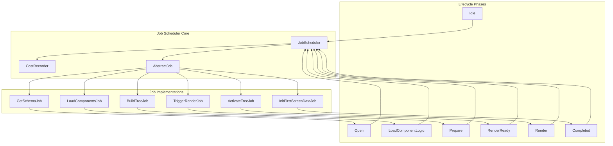
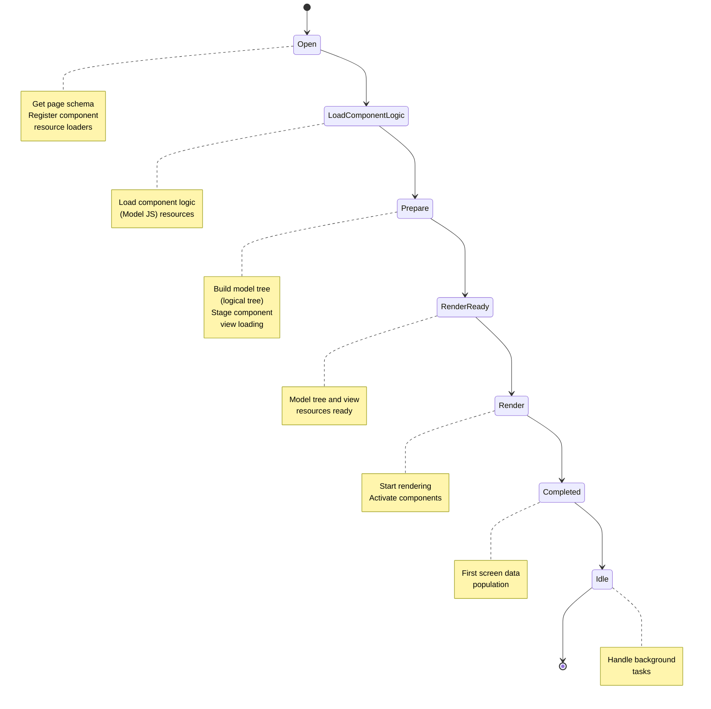
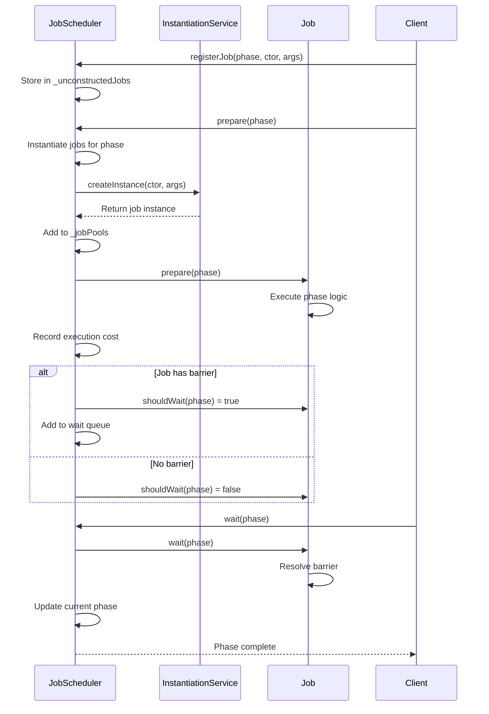

# Job Scheduler

<cite>
**Referenced Files in This Document**   
- [job-scheduler.ts](file://packages/h5-builder/src/bedrock/launch/job-scheduler.ts)
- [cost-recorder.ts](file://packages/h5-builder/src/bedrock/launch/cost-recorder.ts)
- [abstract-job.ts](file://packages/h5-builder/src/bedrock/launch/abstract-job.ts)
- [lifecycle.ts](file://packages/h5-builder/src/jobs/lifecycle.ts)
- [build-tree-job.ts](file://packages/h5-builder/src/jobs/build-tree-job.ts)
- [activate-tree-job.ts](file://packages/h5-builder/src/jobs/activate-tree-job.ts)
- [init-first-screen-data-job.ts](file://packages/h5-builder/src/jobs/init-first-screen-data-job.ts)
- [load-components-job.ts](file://packages/h5-builder/src/jobs/load-components-job.ts)
- [barrier.ts](file://packages/h5-builder/src/bedrock/async/barrier.ts)
- [demo-progressive.tsx](file://packages/h5-builder/src/demo-progressive.tsx)
- [job-scheduler.test.ts](file://packages/h5-builder/src/bedrock/launch/job-scheduler.test.ts)
</cite>

## Table of Contents
1. [Introduction](#introduction)
2. [Architecture Overview](#architecture-overview)
3. [Core Components](#core-components)
4. [Job Lifecycle and Phase Management](#job-lifecycle-and-phase-management)
5. [Job Registration and Execution Flow](#job-registration-and-execution-flow)
6. [Performance Monitoring with CostRecorder](#performance-monitoring-with-costrecorder)
7. [Dependency Management and Barrier Mechanism](#dependency-management-and-barrier-mechanism)
8. [Common Issues and Troubleshooting](#common-issues-and-troubleshooting)
9. [Optimization Strategies](#optimization-strategies)
10. [Conclusion](#conclusion)

## Introduction
The Job Scheduler in the Flow Layer of the H5 Builder Framework orchestrates the execution of asynchronous jobs across different lifecycle phases using a priority-based scheduling system. It manages the sequential execution of critical operations during page initialization, ensuring proper ordering of tasks such as schema retrieval, component loading, model tree construction, and rendering. The scheduler implements a phase-based execution model where jobs are registered for specific lifecycle phases and executed in a controlled manner. This documentation details the internal mechanics of job registration, phase-based instantiation, execution control, and performance monitoring, providing insights into how the framework ensures reliable and efficient page initialization.

## Architecture Overview



**Diagram sources**
- [job-scheduler.ts](file://packages/h5-builder/src/bedrock/launch/job-scheduler.ts)
- [lifecycle.ts](file://packages/h5-builder/src/jobs/lifecycle.ts)
- [abstract-job.ts](file://packages/h5-builder/src/bedrock/launch/abstract-job.ts)

## Core Components

The Job Scheduler system consists of several core components that work together to manage the execution of asynchronous jobs. The JobScheduler class serves as the central orchestrator, managing job registration, phase transitions, and execution control. It maintains two primary data structures: the _jobPools map for storing instantiated jobs and the _unconstructedJobs map for tracking jobs that will be instantiated at specific phases. The AbstractJob base class provides the foundation for all job implementations, defining the common interface and behavior for job execution. The CostRecorder component tracks performance metrics for each job and phase, enabling detailed performance analysis. The Barrier mechanism allows jobs to signal completion of asynchronous operations and coordinate dependencies between jobs.

**Section sources**
- [job-scheduler.ts](file://packages/h5-builder/src/bedrock/launch/job-scheduler.ts)
- [abstract-job.ts](file://packages/h5-builder/src/bedrock/launch/abstract-job.ts)
- [cost-recorder.ts](file://packages/h5-builder/src/bedrock/launch/cost-recorder.ts)

## Job Lifecycle and Phase Management



**Diagram sources**
- [lifecycle.ts](file://packages/h5-builder/src/jobs/lifecycle.ts)
- [job-scheduler.ts](file://packages/h5-builder/src/bedrock/launch/job-scheduler.ts)

## Job Registration and Execution Flow



**Diagram sources**
- [job-scheduler.ts](file://packages/h5-builder/src/bedrock/launch/job-scheduler.ts)
- [abstract-job.ts](file://packages/h5-builder/src/bedrock/launch/abstract-job.ts)
- [demo-progressive.tsx](file://packages/h5-builder/src/demo-progressive.tsx)

## Performance Monitoring with CostRecorder

```mermaid
classDiagram
class CostRecorder {
-_jobCost : Record~string, Trace~
+record(jobName : string, lifecycle : string|number, cost : number)
+toString() : string
}
class JobScheduler {
-_costRecorder : CostRecorder
+getCost() : string
}
class AbstractJob {
+name : string
}
JobScheduler --> CostRecorder : "uses"
CostRecorder <-- AbstractJob : "provides data"
note right of CostRecorder
Tracks execution time for
each job in each phase
Stores data in _jobCost map
Provides JSON output via toString()
end note
```

**Diagram sources**
- [cost-recorder.ts](file://packages/h5-builder/src/bedrock/launch/cost-recorder.ts)
- [job-scheduler.ts](file://packages/h5-builder/src/bedrock/launch/job-scheduler.ts)

## Dependency Management and Barrier Mechanism

```mermaid
flowchart TD
A[Job Execution] --> B{Should Wait?}
B --> |No| C[Complete Immediately]
B --> |Yes| D[Create Barrier]
D --> E[Add to Job Store]
E --> F[Return Promise]
F --> G[Client Calls wait()]
G --> H[Wait for All Barriers]
H --> I[Promise Resolves]
I --> J[Open Barrier]
J --> K[Clean Up Store]
K --> L[Phase Complete]
classDef highlight fill:#f9f,stroke:#333;
class D,E,F,G,H,I,J,K highlight;
```

**Diagram sources**
- [abstract-job.ts](file://packages/h5-builder/src/bedrock/launch/abstract-job.ts)
- [barrier.ts](file://packages/h5-builder/src/bedrock/async/barrier.ts)
- [job-scheduler.ts](file://packages/h5-builder/src/bedrock/launch/job-scheduler.ts)

## Common Issues and Troubleshooting

### Job Duplication
The Job Scheduler prevents job duplication through assertion checks in the addJob method. When attempting to add a job with a name that already exists in the _jobPools map, the lvAssert function throws an error with the message "cant duplicate add job." This ensures that each job is unique within the scheduler's context.

### Phase Mismatches
Phase mismatches occur when jobs are registered for phases that don't align with their execution logic. The scheduler detects jobs that should wait in phases where advancement is expected without waiting, throwing an assertion error with details about the job name and phase. This prevents improper phase transitions that could lead to race conditions or incomplete operations.

### Performance Bottlenecks
Performance bottlenecks can be identified using the CostRecorder component, which tracks execution time for each job in each phase. By analyzing the output of getCost(), developers can pinpoint jobs with excessive execution times and optimize their implementation. Common bottlenecks include synchronous operations in asynchronous contexts and inefficient resource loading patterns.

**Section sources**
- [job-scheduler.ts](file://packages/h5-builder/src/bedrock/launch/job-scheduler.ts)
- [abstract-job.ts](file://packages/h5-builder/src/bedrock/launch/abstract-job.ts)
- [cost-recorder.ts](file://packages/h5-builder/src/bedrock/launch/cost-recorder.ts)

## Optimization Strategies

### Lazy Job Instantiation
The Job Scheduler supports lazy instantiation through the registerJob method, which stores job constructors and arguments until the specified phase. This reduces memory usage and initialization time by deferring object creation until needed. Jobs are only instantiated when prepare is called for their registered phase, optimizing resource utilization.

### Concurrent Execution
Jobs within the same phase that don't have barriers can execute concurrently, maximizing throughput. The scheduler processes all jobs in a phase during prepare, allowing independent operations to proceed in parallel. This is particularly effective for I/O-bound operations such as resource loading and API calls.

### Barrier Optimization
The Barrier mechanism should be used judiciously to avoid unnecessary synchronization. Jobs should only set barriers when they have genuine asynchronous dependencies that affect phase progression. Unnecessary barriers can create artificial bottlenecks and delay phase transitions.

### Performance Monitoring Integration
Integrating the CostRecorder output into development workflows enables data-driven optimization. By regularly analyzing performance metrics, teams can identify trends, measure the impact of changes, and prioritize optimization efforts based on actual execution data.

**Section sources**
- [job-scheduler.ts](file://packages/h5-builder/src/bedrock/launch/job-scheduler.ts)
- [abstract-job.ts](file://packages/h5-builder/src/bedrock/launch/abstract-job.ts)
- [cost-recorder.ts](file://packages/h5-builder/src/bedrock/launch/cost-recorder.ts)

## Conclusion
The Job Scheduler in the H5 Builder Framework provides a robust and flexible system for managing the execution of asynchronous jobs across different lifecycle phases. Its phase-based architecture ensures proper ordering of operations during page initialization, while the barrier mechanism enables coordination between dependent jobs. The integration of performance monitoring through CostRecorder provides valuable insights for optimization and troubleshooting. By following the patterns and best practices documented here, developers can effectively leverage the Job Scheduler to build reliable and high-performance applications. The combination of job registration, phase management, and execution control creates a powerful foundation for complex initialization sequences in modern web applications.