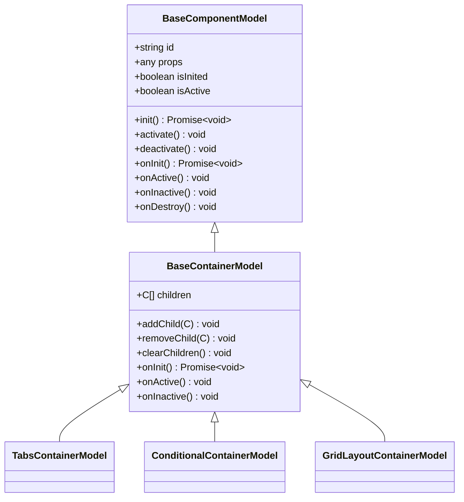
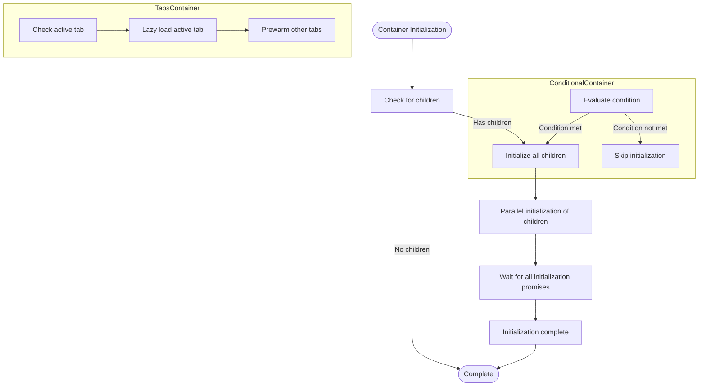
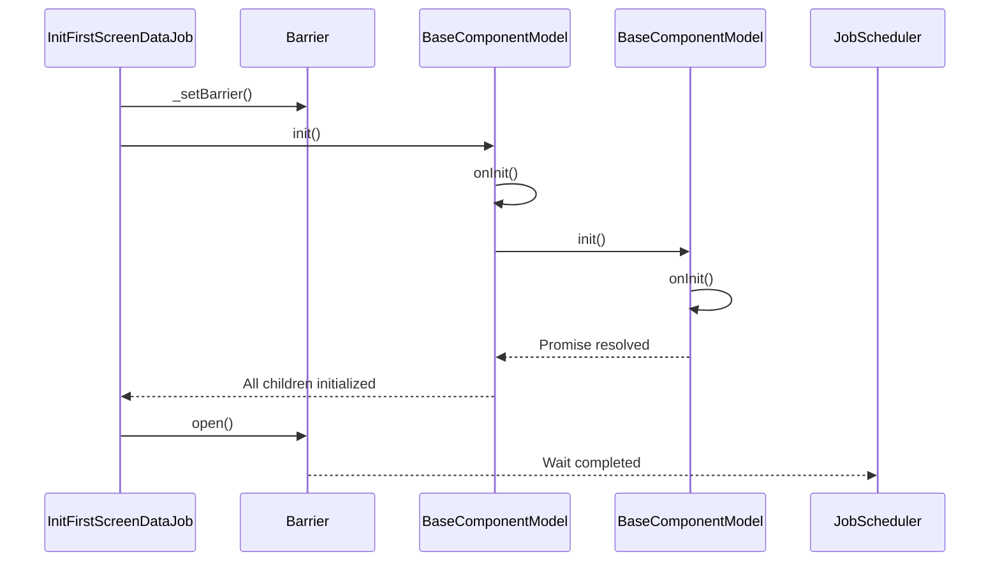
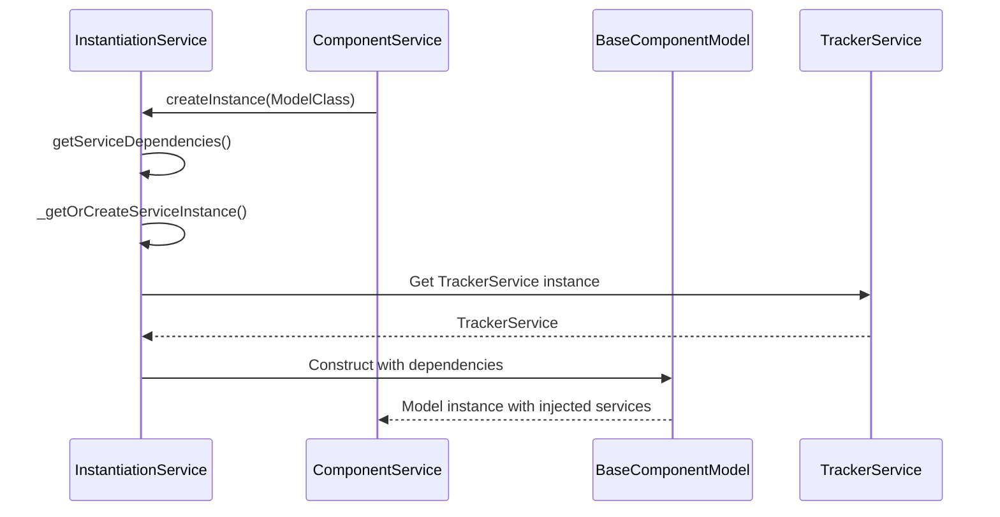

# Tree Activation

<cite>
**Referenced Files in This Document**   
- [activate-tree-job.ts](file://packages/h5-builder/src/jobs/activate-tree-job.ts)
- [trigger-render-job.ts](file://packages/h5-builder/src/jobs/trigger-render-job.ts)
- [lifecycle.ts](file://packages/h5-builder/src/jobs/lifecycle.ts)
- [model.ts](file://packages/h5-builder/src/bedrock/model.ts)
- [component.service.ts](file://packages/h5-builder/src/services/component.service.ts)
- [tracker.service.ts](file://packages/h5-builder/src/services/tracker.service.ts)
- [model-renderer.tsx](file://packages/h5-builder/src/components/model-renderer.tsx)
- [job-scheduler.ts](file://packages/h5-builder/src/bedrock/launch/job-scheduler.ts)
- [instantiation-service.ts](file://packages/h5-builder/src/bedrock/di/instantiation-service.ts)
- [build-tree-job.ts](file://packages/h5-builder/src/jobs/build-tree-job.ts)
- [init-first-screen-data-job.ts](file://packages/h5-builder/src/jobs/init-first-screen-data-job.ts)
- [tabs-container.model.ts](file://packages/h5-builder/src/components/tabs-container/tabs-container.model.ts)
- [conditional-container.model.ts](file://packages/h5-builder/src/components/conditional-container/conditional-container.model.ts)
- [grid-layout-container.model.ts](file://packages/h5-builder/src/components/grid-layout-container/grid-layout-container.model.ts)
</cite>

## Table of Contents
1. [Introduction](#introduction)
2. [Activation Flow Overview](#activation-flow-overview)
3. [Core Components](#core-components)
4. [Lifecycle Method Implementation](#lifecycle-method-implementation)
5. [Container Model Initialization](#container-model-initialization)
6. [Asynchronous Initialization Coordination](#asynchronous-initialization-coordination)
7. [Activation State Management](#activation-state-management)
8. [Dependency Injection Integration](#dependency-injection-integration)
9. [Performance Monitoring with TrackerService](#performance-monitoring-with-trackerservice)
10. [Common Issues and Debugging Strategies](#common-issues-and-debugging-strategies)
11. [Best Practices](#best-practices)

## Introduction

The Tree Activation process in the Flow Layer is a critical phase in the component lifecycle management system. It ensures that all components in the model tree are properly initialized and activated in the correct order before user interaction. This document explains the implementation of the ActivateTreeJob, which traverses the constructed model tree and invokes lifecycle methods (onInit, onActive) on each model. The activation process precedes rendering and works in conjunction with the ModelRenderer to produce the final UI. The system integrates with the DI system for service injection and the TrackerService for performance monitoring, providing a robust foundation for component management.

## Activation Flow Overview

The activation flow follows a well-defined sequence of operations that begins with schema retrieval and ends with component activation. The process is orchestrated through a series of jobs that execute in a specific order based on the PageLifecycle phases. The activation process ensures that components are initialized and activated only after their dependencies are ready, preventing race conditions and incomplete initialization.

```mermaid
sequenceDiagram
participant JobScheduler as JobScheduler
participant BuildTreeJob as BuildTreeJob
participant TriggerRenderJob as TriggerRenderJob
participant ActivateTreeJob as ActivateTreeJob
participant ModelRenderer as ModelRenderer
JobScheduler->>BuildTreeJob : executePhase(Prepare)
BuildTreeJob->>ComponentService : buildModelTree(schema)
ComponentService->>ComponentService : collectComponents()
ComponentService->>ComponentService : preloadComponentsUnified()
ComponentService->>ComponentService : registerModelViewMappings()
BuildTreeJob-->>JobScheduler : Model tree constructed
JobScheduler->>TriggerRenderJob : executePhase(Render)
TriggerRenderJob->>ComponentService : getModelTree()
TriggerRenderJob->>ModelRenderer : setModelTree()
ModelRenderer->>ModelRenderer : render components
JobScheduler->>ActivateTreeJob : executePhase(Render)
ActivateTreeJob->>ComponentService : getModelTree()
ActivateTreeJob->>BaseComponentModel : activate()
BaseComponentModel->>BaseComponentModel : onActive()
activate loop through all models
BaseComponentModel->>BaseComponentModel : traverse children
end
```

**Diagram sources**
- [job-scheduler.ts](file://packages/h5-builder/src/bedrock/launch/job-scheduler.ts)
- [build-tree-job.ts](file://packages/h5-builder/src/jobs/build-tree-job.ts)
- [trigger-render-job.ts](file://packages/h5-builder/src/jobs/trigger-render-job.ts)
- [activate-tree-job.ts](file://packages/h5-builder/src/jobs/activate-tree-job.ts)
- [model-renderer.tsx](file://packages/h5-builder/src/components/model-renderer.tsx)

**Section sources**
- [lifecycle.ts](file://packages/h5-builder/src/jobs/lifecycle.ts)
- [job-scheduler.ts](file://packages/h5-builder/src/bedrock/launch/job-scheduler.ts)

## Core Components

The Tree Activation process relies on several core components that work together to manage the component lifecycle. The ActivateTreeJob is responsible for traversing the model tree and invoking activation methods, while the ComponentService manages the model tree construction and lifecycle. The ModelRenderer integrates with this flow to render the components after activation. The TrackerService provides performance monitoring capabilities, and the DI system handles service injection during activation.

**Section sources**
- [activate-tree-job.ts](file://packages/h5-builder/src/jobs/activate-tree-job.ts)
- [component.service.ts](file://packages/h5-builder/src/services/component.service.ts)
- [model-renderer.tsx](file://packages/h5-builder/src/components/model-renderer.tsx)
- [tracker.service.ts](file://packages/h5-builder/src/services/tracker.service.ts)
- [instantiation-service.ts](file://packages/h5-builder/src/bedrock/di/instantiation-service.ts)

## Lifecycle Method Implementation

The lifecycle methods are implemented through a well-defined inheritance hierarchy that ensures consistent behavior across all components. The BaseComponentModel class provides the foundation for lifecycle management, with abstract methods that must be implemented by derived classes. The activation process follows a specific sequence: initialization (onInit) occurs first, followed by activation (onActive) when the component becomes active.



**Diagram sources**
- [model.ts](file://packages/h5-builder/src/bedrock/model.ts)
- [tabs-container.model.ts](file://packages/h5-builder/src/components/tabs-container/tabs-container.model.ts)
- [conditional-container.model.ts](file://packages/h5-builder/src/components/conditional-container/conditional-container.model.ts)
- [grid-layout-container.model.ts](file://packages/h5-builder/src/components/grid-layout-container/grid-layout-container.model.ts)

**Section sources**
- [model.ts](file://packages/h5-builder/src/bedrock/model.ts)

## Container Model Initialization

Container models play a crucial role in the initialization process by managing the lifecycle of their child components. The BaseContainerModel provides default implementations for initializing, activating, and deactivating child components. Container models like TabsContainerModel and ConditionalContainerModel extend this behavior with specialized initialization logic that accounts for their specific use cases.

For example, the TabsContainerModel implements lazy loading by only initializing the currently active tab, while the ConditionalContainerModel evaluates conditions before initializing its children. This approach optimizes performance by avoiding unnecessary initialization of components that may not be needed.



**Diagram sources**
- [model.ts](file://packages/h5-builder/src/bedrock/model.ts)
- [tabs-container.model.ts](file://packages/h5-builder/src/components/tabs-container/tabs-container.model.ts)
- [conditional-container.model.ts](file://packages/h5-builder/src/components/conditional-container/conditional-container.model.ts)

**Section sources**
- [tabs-container.model.ts](file://packages/h5-builder/src/components/tabs-container/tabs-container.model.ts)
- [conditional-container.model.ts](file://packages/h5-builder/src/components/conditional-container/conditional-container.model.ts)
- [grid-layout-container.model.ts](file://packages/h5-builder/src/components/grid-layout-container/grid-layout-container.model.ts)

## Asynchronous Initialization Coordination

The system handles asynchronous initialization through a combination of Promise-based coordination and lifecycle barriers. The InitFirstScreenDataJob uses a Barrier to coordinate the completion of data initialization, ensuring that the activation process only proceeds when all necessary data is available. The ComponentService manages concurrent loading of model and view resources with configurable concurrency limits, preventing resource exhaustion.

The activation process itself is designed to handle asynchronous operations correctly, with container models awaiting the initialization of their children before completing their own initialization. This ensures that parent components are not activated until their children are fully initialized, maintaining the integrity of the component hierarchy.



**Diagram sources**
- [init-first-screen-data-job.ts](file://packages/h5-builder/src/jobs/init-first-screen-data-job.ts)
- [model.ts](file://packages/h5-builder/src/bedrock/model.ts)
- [barrier.ts](file://packages/h5-builder/src/bedrock/async/barrier.ts)

**Section sources**
- [init-first-screen-data-job.ts](file://packages/h5-builder/src/jobs/init-first-screen-data-job.ts)
- [model.ts](file://packages/h5-builder/src/bedrock/model.ts)

## Activation State Management

Activation state is managed through a combination of instance properties and lifecycle methods. Each model maintains its activation state in the isActive property, which is updated when the activate() and deactivate() methods are called. The activation process ensures that components are only activated when they are visible and ready for interaction, conserving resources by deactivating components that are not currently in use.

The state management system prevents redundant activation by checking the current state before invoking lifecycle methods. This avoids unnecessary work and potential side effects from multiple activation calls. Container models coordinate the activation of their children, ensuring that the entire subtree is activated or deactivated in a consistent manner.

**Section sources**
- [model.ts](file://packages/h5-builder/src/bedrock/model.ts)

## Dependency Injection Integration

The Tree Activation process integrates with the DI system to provide services to components during activation. The InstantiationService handles the creation of component instances and automatically injects required services based on constructor parameters. This allows components to declare their dependencies without having to manage service retrieval themselves.

The DI system uses a hierarchical approach, with child containers able to override services from their parent containers. This enables specialized behavior in specific parts of the component tree while maintaining consistency across the application. Service injection occurs during the model creation phase, ensuring that all dependencies are available before initialization begins.



**Diagram sources**
- [instantiation-service.ts](file://packages/h5-builder/src/bedrock/di/instantiation-service.ts)
- [component.service.ts](file://packages/h5-builder/src/services/component.service.ts)
- [model.ts](file://packages/h5-builder/src/bedrock/model.ts)

**Section sources**
- [instantiation-service.ts](file://packages/h5-builder/src/bedrock/di/instantiation-service.ts)
- [component.service.ts](file://packages/h5-builder/src/services/component.service.ts)

## Performance Monitoring with TrackerService

The TrackerService integrates with the activation process to provide performance monitoring and analytics capabilities. It collects various metrics throughout the component lifecycle, including initialization times, activation events, and error occurrences. The service supports both immediate and batched event reporting, with configurable batching strategies to optimize network usage.

During activation, components can use the TrackerService to report key events such as component creation, initialization completion, and user interactions. The service also provides debug mode functionality that displays events in the UI, making it easier to trace the activation flow during development.

**Section sources**
- [tracker.service.ts](file://packages/h5-builder/src/services/tracker.service.ts)
- [component.service.ts](file://packages/h5-builder/src/services/component.service.ts)

## Common Issues and Debugging Strategies

Several common issues can arise during tree activation, including incomplete initialization, race conditions in async setup, and memory leaks from improper disposal. Incomplete initialization typically occurs when promises are not properly awaited, causing parent components to proceed before their children are ready. This can be debugged by ensuring that all async operations are properly awaited and that lifecycle barriers are correctly used.

Race conditions in async setup often result from multiple components attempting to modify shared state simultaneously. These can be mitigated by using proper synchronization mechanisms and ensuring that state modifications are atomic. Memory leaks from improper disposal occur when components fail to clean up event listeners or other resources. The DisposableStore system helps prevent this by providing a centralized mechanism for resource cleanup.

Debugging strategies include using the TrackerService's debug mode to visualize the activation flow, adding console logs to lifecycle methods to trace execution order, and using the job scheduler's cost recorder to identify performance bottlenecks.

**Section sources**
- [model.ts](file://packages/h5-builder/src/bedrock/model.ts)
- [dispose-store.ts](file://packages/h5-builder/src/bedrock/dispose/disposable-store.ts)
- [tracker.service.ts](file://packages/h5-builder/src/services/tracker.service.ts)

## Best Practices

To ensure robust tree activation, several best practices should be followed. First, always await async operations in lifecycle methods to prevent race conditions and incomplete initialization. Second, use the DisposableStore to manage resources that need cleanup, ensuring that all event listeners and timers are properly disposed of. Third, leverage the container model's default behavior for initializing and activating children, only overriding it when necessary for specialized behavior.

When implementing custom container models, follow the pattern of the TabsContainerModel by implementing lazy loading and prewarming strategies to optimize performance. Use the TrackerService to monitor key metrics and identify potential issues early. Finally, design components to be resilient to activation and deactivation cycles, ensuring that they can be activated and deactivated multiple times without side effects.

**Section sources**
- [model.ts](file://packages/h5-builder/src/bedrock/model.ts)
- [tabs-container.model.ts](file://packages/h5-builder/src/components/tabs-container/tabs-container.model.ts)
- [tracker.service.ts](file://packages/h5-builder/src/services/tracker.service.ts)