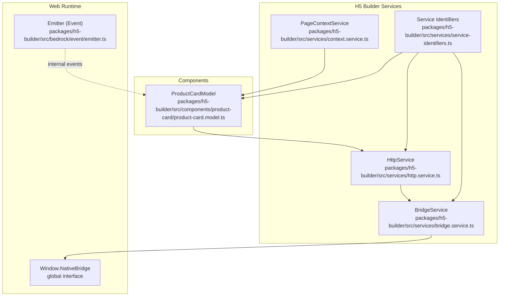
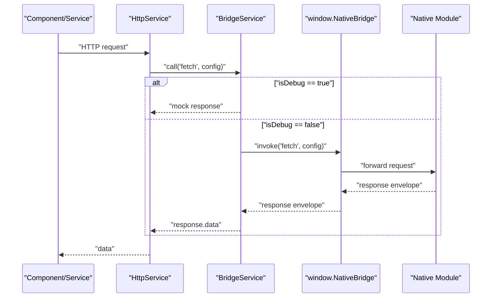
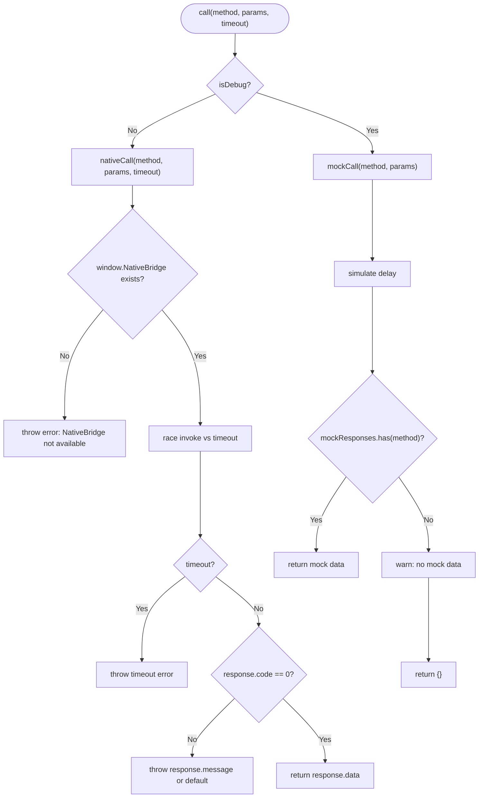
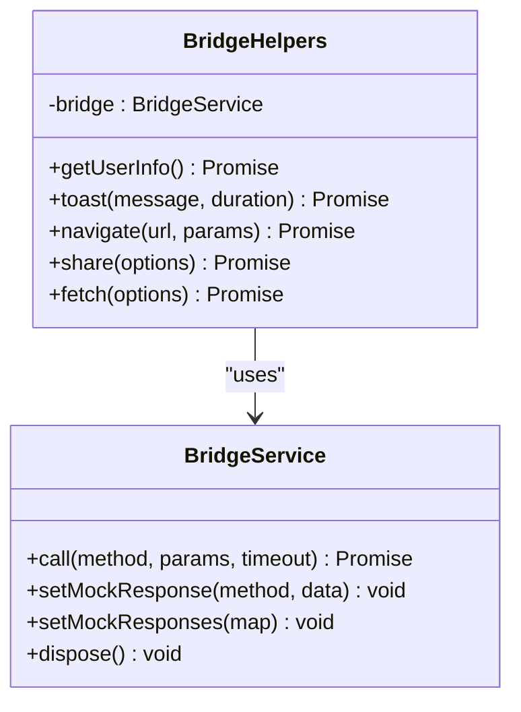
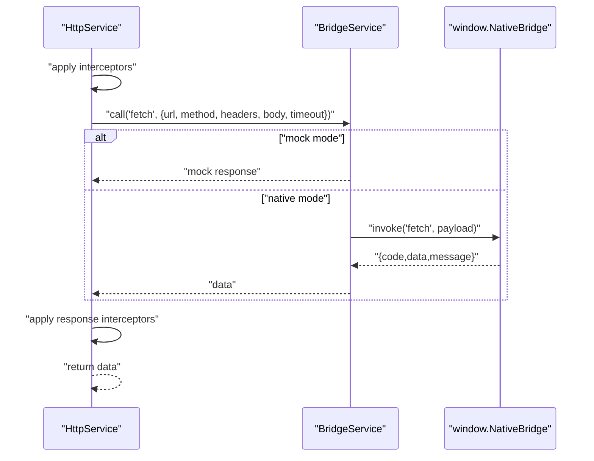
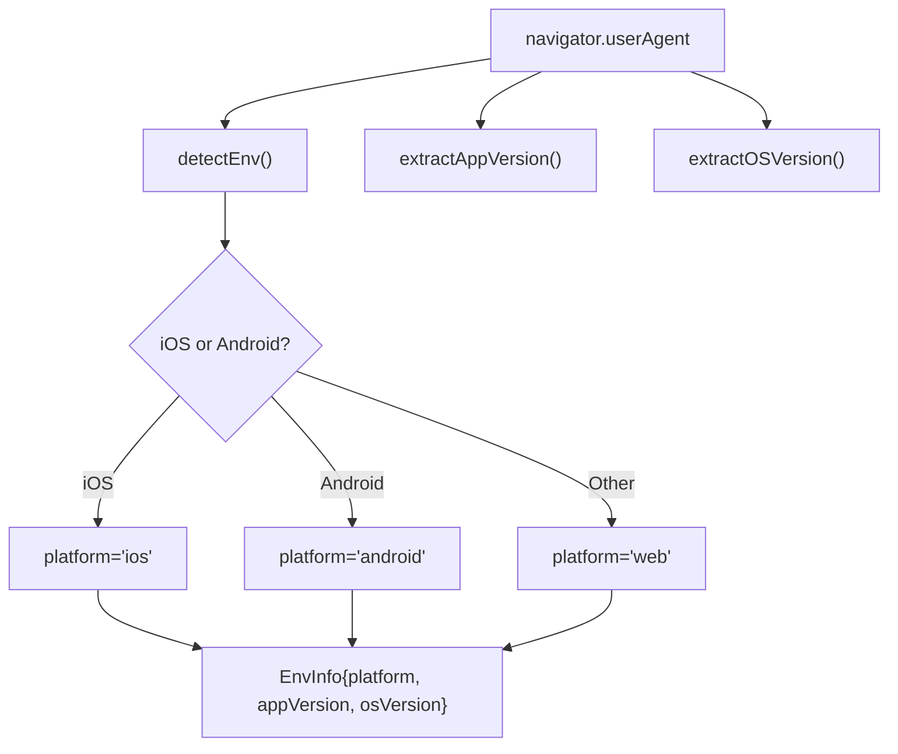
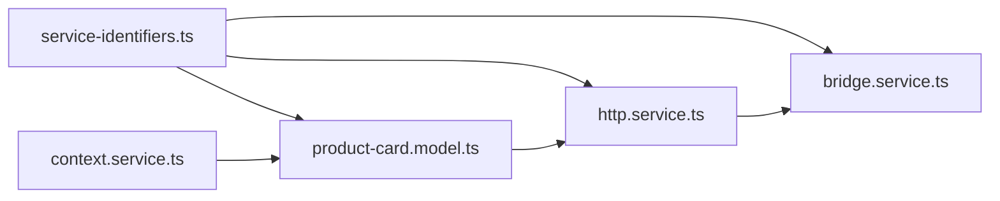

# Bridge Service

<cite>
**Referenced Files in This Document**
- [bridge.service.ts](file://packages/h5-builder/src/services/bridge.service.ts)
- [bridge.service.test.ts](file://packages/h5-builder/src/__tests__/bridge.service.test.ts)
- [http.service.ts](file://packages/h5-builder/src/services/http.service.ts)
- [service-identifiers.ts](file://packages/h5-builder/src/services/service-identifiers.ts)
- [context.service.ts](file://packages/h5-builder/src/services/context.service.ts)
- [emitter.ts](file://packages/h5-builder/src/bedrock/event/emitter.ts)
- [product-card.model.ts](file://packages/h5-builder/src/components/product-card/product-card.model.ts)
- [api_reference.md](file://packages/h5-builder/docs/api_reference.md)
- [faq.md](file://packages/h5-builder/docs/faq.md)
</cite>

## Table of Contents
1. [Introduction](#introduction)
2. [Project Structure](#project-structure)
3. [Core Components](#core-components)
4. [Architecture Overview](#architecture-overview)
5. [Detailed Component Analysis](#detailed-component-analysis)
6. [Dependency Analysis](#dependency-analysis)
7. [Performance Considerations](#performance-considerations)
8. [Troubleshooting Guide](#troubleshooting-guide)
9. [Conclusion](#conclusion)
10. [Appendices](#appendices)

## Introduction
This document explains the BridgeService, which enables the H5 web application to communicate with native mobile environments. It covers the message passing pattern, platform detection logic, and how the service exposes native capabilities (e.g., user info, navigation, sharing, network requests) through a unified interface. It also documents the message serialization format, error propagation, security considerations, debugging techniques, and cross-platform compatibility.

## Project Structure
The BridgeService resides in the H5 builder package under services. It integrates with other services (e.g., HttpService) and is consumed by components via dependency injection. Platform detection is handled by the PageContextService.

**Diagram sources**
- [bridge.service.ts](file://packages/h5-builder/src/services/bridge.service.ts#L1-L227)
- [http.service.ts](file://packages/h5-builder/src/services/http.service.ts#L1-L200)
- [context.service.ts](file://packages/h5-builder/src/services/context.service.ts#L1-L187)
- [service-identifiers.ts](file://packages/h5-builder/src/services/service-identifiers.ts#L1-L20)
- [emitter.ts](file://packages/h5-builder/src/bedrock/event/emitter.ts#L1-L163)
- [product-card.model.ts](file://packages/h5-builder/src/components/product-card/product-card.model.ts#L1-L133)

**Section sources**
- [bridge.service.ts](file://packages/h5-builder/src/services/bridge.service.ts#L1-L227)
- [http.service.ts](file://packages/h5-builder/src/services/http.service.ts#L1-L200)
- [context.service.ts](file://packages/h5-builder/src/services/context.service.ts#L1-L187)
- [service-identifiers.ts](file://packages/h5-builder/src/services/service-identifiers.ts#L1-L20)
- [emitter.ts](file://packages/h5-builder/src/bedrock/event/emitter.ts#L1-L163)
- [product-card.model.ts](file://packages/h5-builder/src/components/product-card/product-card.model.ts#L1-L133)

## Core Components
- BridgeService: Provides a unified call method to invoke native features via window.NativeBridge or a mock implementation. It handles timeouts, error propagation, and mock responses for development.
- BridgeHelpers: Encapsulates commonly used native methods (user info, toast, navigation, share, fetch) to simplify invocation from higher-level services or components.
- HttpService: Uses BridgeService to perform network requests with interceptors and error handling.
- PageContextService: Detects platform and environment information (iOS, Android, Web) and exposes it to components.
- Emitter: Internal event emitter used by other parts of the framework; not directly part of the bridge but relevant to event-driven patterns.

Key responsibilities:
- Message passing: BridgeService serializes method names and parameters and expects a standardized response envelope.
- Platform detection: PageContextService detects runtime platform and OS version from user agent.
- Exposure of native features: BridgeHelpers exposes convenient wrappers for common native actions.

**Section sources**
- [bridge.service.ts](file://packages/h5-builder/src/services/bridge.service.ts#L1-L227)
- [http.service.ts](file://packages/h5-builder/src/services/http.service.ts#L1-L200)
- [context.service.ts](file://packages/h5-builder/src/services/context.service.ts#L1-L187)
- [emitter.ts](file://packages/h5-builder/src/bedrock/event/emitter.ts#L1-L163)

## Architecture Overview
The BridgeService sits between web components and the native environment. Components and services depend on the BridgeService abstraction. On mobile, window.NativeBridge is expected to be present; otherwise, the service operates in mock mode for browser testing.

**Diagram sources**
- [bridge.service.ts](file://packages/h5-builder/src/services/bridge.service.ts#L55-L118)
- [http.service.ts](file://packages/h5-builder/src/services/http.service.ts#L147-L193)

**Section sources**
- [bridge.service.ts](file://packages/h5-builder/src/services/bridge.service.ts#L55-L118)
- [http.service.ts](file://packages/h5-builder/src/services/http.service.ts#L147-L193)

## Detailed Component Analysis

### BridgeService
Responsibilities:
- Unified invocation: call(method, params, timeout) routes to either nativeCall or mockCall depending on isDebug.
- Native mode: races window.NativeBridge.invoke against a timeout and validates response.code.
- Mock mode: returns preconfigured mock responses or empty object with warning.
- Lifecycle: implements IDisposable to clear mock responses.

Message format:
- Request: { method: string, params: BridgeCallParams }
- Response envelope: { code: number, data: any, message?: string }

Error propagation:
- Throws on missing NativeBridge in native mode.
- Throws on response.code != 0 with message from native.
- Logs failures and rethrows.

Timeout handling:
- Enforces a configurable timeout; rejects with a timeout error.

Mock configuration:
- setMockResponse and setMockResponses enable deterministic testing in browser.

**Diagram sources**
- [bridge.service.ts](file://packages/h5-builder/src/services/bridge.service.ts#L55-L118)

**Section sources**
- [bridge.service.ts](file://packages/h5-builder/src/services/bridge.service.ts#L55-L118)
- [bridge.service.test.ts](file://packages/h5-builder/src/__tests__/bridge.service.test.ts#L1-L131)

### BridgeHelpers
Purpose:
- Provide convenience wrappers around BridgeService.call for common native actions:
  - getUserInfo
  - toast
  - navigate
  - share
  - fetch (used by HttpService)

Usage pattern:
- Constructed with a BridgeService instance.
- Methods return promises and delegate to bridge.call with appropriate parameters.

**Diagram sources**
- [bridge.service.ts](file://packages/h5-builder/src/services/bridge.service.ts#L171-L227)

**Section sources**
- [bridge.service.ts](file://packages/h5-builder/src/services/bridge.service.ts#L171-L227)

### HttpService Integration
HttpService depends on BridgeService to perform network requests. It:
- Adds baseURL and Authorization interceptors when configured.
- Serializes request parameters and bodies.
- Calls BridgeService.call('fetch', ...) and applies response interceptors.

**Diagram sources**
- [http.service.ts](file://packages/h5-builder/src/services/http.service.ts#L147-L193)
- [bridge.service.ts](file://packages/h5-builder/src/services/bridge.service.ts#L55-L118)

**Section sources**
- [http.service.ts](file://packages/h5-builder/src/services/http.service.ts#L147-L193)
- [bridge.service.ts](file://packages/h5-builder/src/services/bridge.service.ts#L55-L118)

### Platform Detection Logic
PageContextService detects platform and OS version from the user agent and exposes environment information to components. This allows components to adapt behavior based on runtime platform.

**Diagram sources**
- [context.service.ts](file://packages/h5-builder/src/services/context.service.ts#L139-L186)

**Section sources**
- [context.service.ts](file://packages/h5-builder/src/services/context.service.ts#L139-L186)

### Security Considerations
- Origin isolation: The service assumes window.NativeBridge is only available in trusted native contexts. In browser, it falls back to mock mode to prevent accidental native calls.
- Input sanitization: BridgeService does not mutate payloads; pass sanitized parameters from higher-level services.
- Error containment: Native errors are propagated as-is; wrap calls in try/catch at call sites to avoid unhandled rejections.
- Token handling: HttpService adds Authorization header when configured; ensure tokens are managed securely and not logged.

[No sources needed since this section provides general guidance]

## Dependency Analysis
BridgeService is consumed by HttpService and indirectly by components via DI. Service identifiers decouple consumers from concrete implementations.

**Diagram sources**
- [service-identifiers.ts](file://packages/h5-builder/src/services/service-identifiers.ts#L1-L20)
- [http.service.ts](file://packages/h5-builder/src/services/http.service.ts#L1-L200)
- [bridge.service.ts](file://packages/h5-builder/src/services/bridge.service.ts#L1-L227)
- [context.service.ts](file://packages/h5-builder/src/services/context.service.ts#L1-L187)
- [product-card.model.ts](file://packages/h5-builder/src/components/product-card/product-card.model.ts#L1-L133)

**Section sources**
- [service-identifiers.ts](file://packages/h5-builder/src/services/service-identifiers.ts#L1-L20)
- [http.service.ts](file://packages/h5-builder/src/services/http.service.ts#L1-L200)
- [bridge.service.ts](file://packages/h5-builder/src/services/bridge.service.ts#L1-L227)
- [context.service.ts](file://packages/h5-builder/src/services/context.service.ts#L1-L187)
- [product-card.model.ts](file://packages/h5-builder/src/components/product-card/product-card.model.ts#L1-L133)

## Performance Considerations
- Timeout tuning: Adjust call timeout based on expected native latency.
- Mock overhead: Mock mode introduces minimal delay; keep mock data small for fast iteration.
- Interceptors: HttpService interceptors add overhead; minimize expensive transformations.
- Concurrency: Avoid excessive concurrent native calls; batch or throttle where appropriate.

[No sources needed since this section provides general guidance]

## Troubleshooting Guide
Common issues and resolutions:
- NativeBridge not available:
  - Symptom: Error indicating NativeBridge is missing.
  - Cause: Running in browser without native bridge.
  - Resolution: Enable mock mode by constructing BridgeService with debug flag or provide a mock window.NativeBridge in tests.
- Response code != 0:
  - Symptom: Error thrown with message from native.
  - Cause: Native module failure.
  - Resolution: Inspect native logs and fix the underlying issue; ensure response envelope conforms to { code, data, message }.
- Timeout:
  - Symptom: Timeout error during call.
  - Cause: Native module slow or blocked.
  - Resolution: Increase timeout or optimize native implementation.
- Missing mock data:
  - Symptom: Warning about no mock data for method.
  - Resolution: Configure mock responses via setMockResponse or setMockResponses.

Debugging tips:
- Enable debug mode to force mock behavior in browser.
- Use tests to verify BridgeService behavior and error handling.
- Inspect interceptors in HttpService to confirm request payload composition.

**Section sources**
- [bridge.service.ts](file://packages/h5-builder/src/services/bridge.service.ts#L55-L118)
- [bridge.service.test.ts](file://packages/h5-builder/src/__tests__/bridge.service.test.ts#L1-L131)
- [http.service.ts](file://packages/h5-builder/src/services/http.service.ts#L147-L193)
- [faq.md](file://packages/h5-builder/docs/faq.md#L341-L350)

## Conclusion
The BridgeService provides a clean abstraction for invoking native functionality from the H5 web application. It supports both native and mock modes, enforces a standardized response envelope, and integrates seamlessly with higher-level services like HttpService. With platform detection and robust error handling, it enables reliable cross-platform development while maintaining strong separation between web and native concerns.

[No sources needed since this section summarizes without analyzing specific files]

## Appendices

### How Components Invoke Native Features via Dependency Injection
- Register BridgeService in the DI container and inject it into components or services.
- Use BridgeHelpers for common actions or call BridgeService.call directly with method names and parameters.
- Wrap invocations in try/catch to handle errors gracefully.

Example references:
- DI registration and usage patterns are demonstrated in tests and component models.

**Section sources**
- [service-identifiers.ts](file://packages/h5-builder/src/services/service-identifiers.ts#L1-L20)
- [product-card.model.ts](file://packages/h5-builder/src/components/product-card/product-card.model.ts#L1-L133)
- [api_reference.md](file://packages/h5-builder/docs/api_reference.md#L1-L90)

### Message Serialization and Response Envelope
- Request payload: { method: string, params: BridgeCallParams }
- Response envelope: { code: number, data: any, message?: string }
- Error propagation: Non-zero code triggers an error with message.

**Section sources**
- [bridge.service.ts](file://packages/h5-builder/src/services/bridge.service.ts#L1-L227)

### Exposing Native Functionalities Through a Unified Interface
- getUserInfo, toast, navigate, share, fetch are exposed via BridgeHelpers.
- HttpService uses fetch to implement HTTP requests with interceptors.

**Section sources**
- [bridge.service.ts](file://packages/h5-builder/src/services/bridge.service.ts#L171-L227)
- [http.service.ts](file://packages/h5-builder/src/services/http.service.ts#L147-L193)

### Platform Detection Across Mobile Platforms
- PageContextService detects iOS, Android, or Web and extracts app and OS versions from user agent.

**Section sources**
- [context.service.ts](file://packages/h5-builder/src/services/context.service.ts#L139-L186)