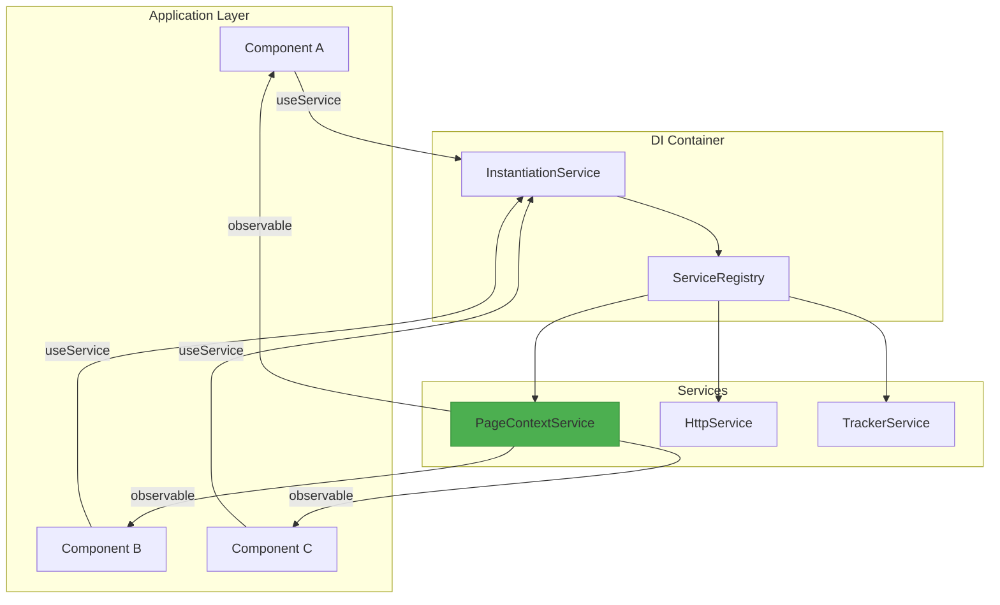
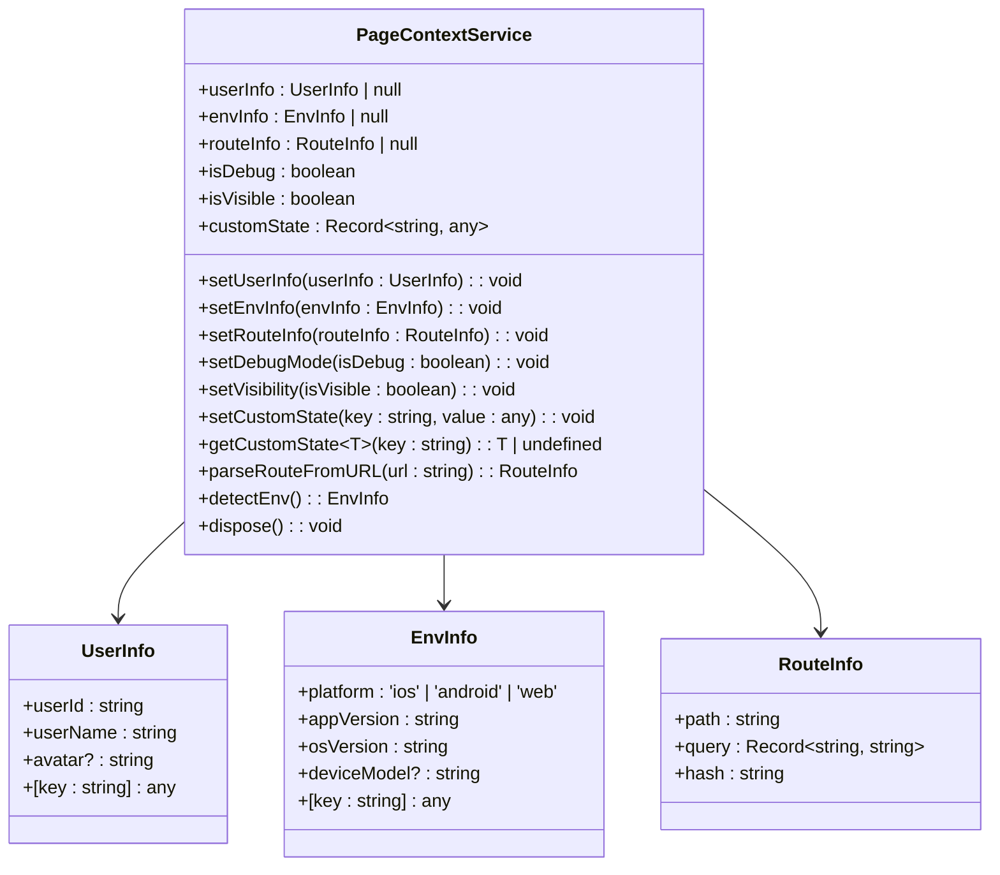
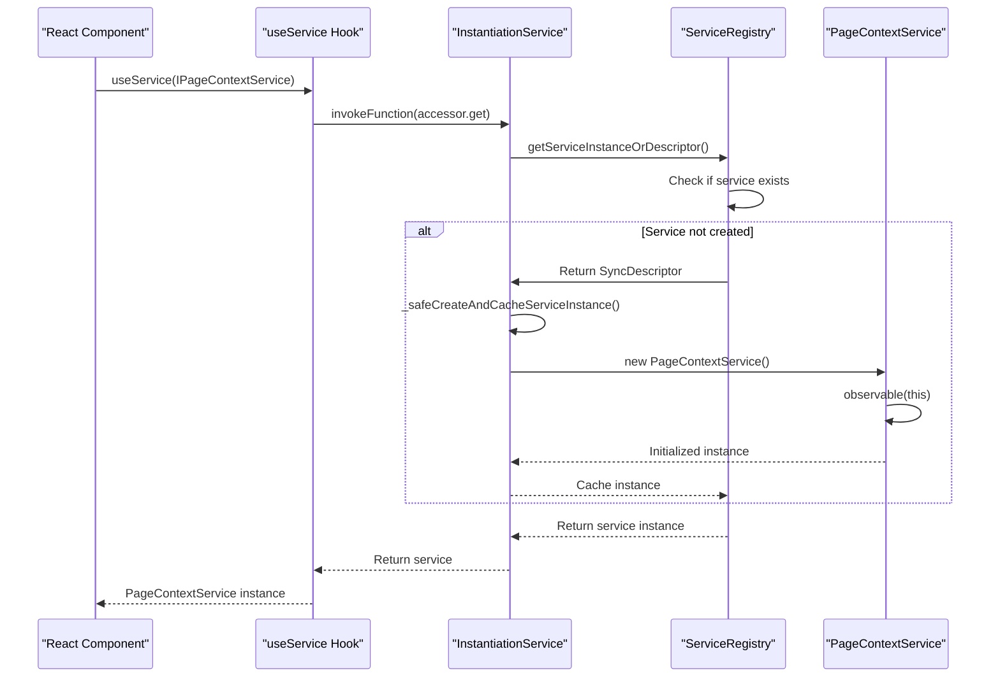
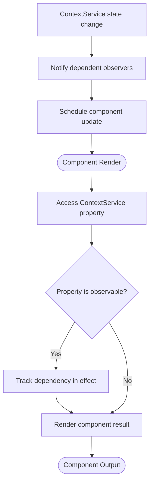
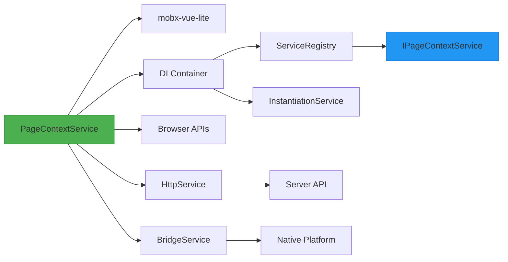

# Context Service

<cite>
**Referenced Files in This Document**   
- [context.service.ts](file://packages/h5-builder/src/services/context.service.ts)
- [service-identifiers.ts](file://packages/h5-builder/src/services/service-identifiers.ts)
- [instantiation-service.ts](file://packages/h5-builder/src/bedrock/di/instantiation-service.ts)
- [context.web.tsx](file://packages/h5-builder/src/bedrock/di/context.web.tsx)
- [demo-progressive.tsx](file://packages/h5-builder/src/demo-progressive.tsx)
- [useObserver.ts](file://packages/mobx-vue-lite/src/useObserver.ts)
</cite>

## Table of Contents
1. [Introduction](#introduction)
2. [Core Components](#core-components)
3. [Architecture Overview](#architecture-overview)
4. [Detailed Component Analysis](#detailed-component-analysis)
5. [Dependency Analysis](#dependency-analysis)
6. [Performance Considerations](#performance-considerations)
7. [Troubleshooting Guide](#troubleshooting-guide)
8. [Conclusion](#conclusion)

## Introduction
The ContextService in the H5 Builder Framework serves as the central state management system for global application state and runtime configuration. It provides a unified mechanism for storing and accessing user session data, device information, feature flags, and environment settings across all components in the application. The service is designed to be reactive, leveraging mobx-vue-lite observables to enable automatic updates when state changes occur. Through integration with the Dependency Injection (DI) container, the ContextService ensures consistent access patterns and lifecycle management while supporting both immediate and lazy instantiation strategies. This documentation details the implementation, usage patterns, initialization sequence, and performance characteristics of the ContextService.

## Core Components
The ContextService implementation consists of several key components that work together to provide a robust state management solution. The core is the PageContextService class which manages user information, environment details, routing state, and custom application state. This service is registered with the DI container using a service identifier (IPageContextService) and is made available throughout the application via dependency injection. The service leverages mobx-vue-lite's observable system to make all state properties reactive, enabling components to automatically respond to state changes. The initialization process involves registering the service with the ServiceRegistry and creating an InstantiationService instance that manages the service lifecycle.

**Section sources**
- [context.service.ts](file://packages/h5-builder/src/services/context.service.ts#L38-L187)
- [service-identifiers.ts](file://packages/h5-builder/src/services/service-identifiers.ts#L17)
- [demo-progressive.tsx](file://packages/h5-builder/src/demo-progressive.tsx#L196)

## Architecture Overview
The ContextService architecture follows a dependency injection pattern where services are registered with a central registry and made available through a service container. The DI system creates a hierarchical structure of instantiation services that manage service lifecycles and dependencies. When components need access to the ContextService, they use the @Inject pattern or the useService hook to retrieve the service instance from the container. The reactive nature of the service is achieved through mobx-vue-lite's observable system, which tracks property access and automatically triggers re-renders when observed properties change. This architecture enables loose coupling between components while providing a centralized state management solution.

**Diagram sources**
- [context.service.ts](file://packages/h5-builder/src/services/context.service.ts#L38-L187)
- [instantiation-service.ts](file://packages/h5-builder/src/bedrock/di/instantiation-service.ts#L61-L468)
- [context.web.tsx](file://packages/h5-builder/src/bedrock/di/context.web.tsx#L16-L41)

## Detailed Component Analysis

### PageContextService Implementation
The PageContextService class implements the IDisposable interface and provides methods for managing various aspects of application state including user information, environment details, routing data, and custom state. The service uses mobx-vue-lite's observable function in its constructor to make all properties reactive, enabling automatic dependency tracking and updates. Key state properties include userInfo, envInfo, routeInfo, isDebug, isVisible, and customState. The service provides setter methods for each state property that update the internal state and trigger reactive updates to dependent components.

#### Class Diagram

**Diagram sources**
- [context.service.ts](file://packages/h5-builder/src/services/context.service.ts#L38-L187)

**Section sources**
- [context.service.ts](file://packages/h5-builder/src/services/context.service.ts#L38-L187)

### Dependency Injection Integration
The ContextService integrates with the DI container through service identifiers and the InstantiationService. Service identifiers are created using the createDecorator function and provide type-safe references to services within the container. The IPageContextService identifier allows components to request the ContextService instance without direct imports, promoting loose coupling. The DI container manages service instantiation, dependency resolution, and lifecycle management, ensuring that services are created only when needed and properly disposed of when no longer required.

#### Sequence Diagram

**Diagram sources**
- [service-identifiers.ts](file://packages/h5-builder/src/services/service-identifiers.ts#L17)
- [instantiation-service.ts](file://packages/h5-builder/src/bedrock/di/instantiation-service.ts#L118-L148)
- [context.web.tsx](file://packages/h5-builder/src/bedrock/di/context.web.tsx#L29-L41)

### Reactive State Management
The ContextService leverages mobx-vue-lite's reactivity system to provide automatic updates when state changes. The observable function wraps the entire service instance, making all properties tracked for changes. When components access these properties, they establish a dependency relationship that triggers re-renders when the observed values change. The useObserver hook and Observer component from mobx-vue-lite enable functional components to participate in this reactivity system by tracking observable access during rendering and scheduling updates when dependencies change.

#### Flowchart

**Diagram sources**
- [context.service.ts](file://packages/h5-builder/src/services/context.service.ts#L60)
- [useObserver.ts](file://packages/mobx-vue-lite/src/useObserver.ts#L19-L58)

## Dependency Analysis
The ContextService has dependencies on several core framework components. It depends on mobx-vue-lite for reactivity, the DI system for instantiation and lifecycle management, and the browser's built-in APIs for environment detection. The service is registered with the ServiceRegistry which manages its instantiation descriptor and ownership. Through the DI container, the ContextService can access other services like HttpService for server synchronization and BridgeService for native platform communication. The dependency graph shows a clear hierarchy with the ContextService at the center of application state management, providing state to components while depending on infrastructure services for initialization and persistence.

**Diagram sources**
- [context.service.ts](file://packages/h5-builder/src/services/context.service.ts#L1)
- [instantiation-service.ts](file://packages/h5-builder/src/bedrock/di/instantiation-service.ts#L61)
- [service-identifiers.ts](file://packages/h5-builder/src/services/service-identifiers.ts#L17)

**Section sources**
- [context.service.ts](file://packages/h5-builder/src/services/context.service.ts#L1-L187)
- [instantiation-service.ts](file://packages/h5-builder/src/bedrock/di/instantiation-service.ts#L61-L468)
- [service-identifiers.ts](file://packages/h5-builder/src/services/service-identifiers.ts#L1-L20)

## Performance Considerations
The ContextService implementation includes several performance optimizations. The use of mobx-vue-lite's fine-grained reactivity ensures that only components depending on specific state properties are updated when those properties change, minimizing unnecessary re-renders. The DI container supports lazy instantiation through the IdleValue wrapper, allowing services to be created only when first accessed. The service avoids deep reactivity by using a flat structure for custom state, preventing performance issues associated with deeply nested observable objects. Memory leak prevention is achieved through proper disposal of reactive effects and integration with the DI container's disposal mechanism. For high-frequency updates, the service can be extended with debouncing or throttling mechanisms to prevent excessive re-renders.

## Troubleshooting Guide
Common issues with the ContextService typically involve initialization race conditions, missing service registration, or memory leaks from un disposed observers. To address race conditions during startup, ensure the service is registered before any components attempt to access it through the DI container. Verify that the InstantiationContext provider wraps all components that use the service. For memory leak prevention, ensure that components properly clean up when unmounted by using the built-in disposal mechanisms in mobx-vue-lite. When debugging state update issues, verify that properties are being accessed within reactive contexts (useObserver, Observer component) and that state modifications occur through the service's setter methods rather than direct property assignment.

**Section sources**
- [context.service.ts](file://packages/h5-builder/src/services/context.service.ts#L133-L136)
- [useObserver.ts](file://packages/mobx-vue-lite/src/useObserver.ts#L48-L55)
- [instantiation-service.ts](file://packages/h5-builder/src/bedrock/di/instantiation-service.ts#L178-L213)

## Conclusion
The ContextService in the H5 Builder Framework provides a comprehensive solution for managing global application state and runtime configuration. By combining dependency injection with reactive programming principles, it offers a powerful yet flexible approach to state management that scales well across complex applications. The service's design emphasizes loose coupling, testability, and performance through its integration with the DI container and mobx-vue-lite's reactivity system. With proper initialization and usage patterns, the ContextService enables developers to build responsive, maintainable applications with centralized state management that automatically propagates changes to all dependent components.