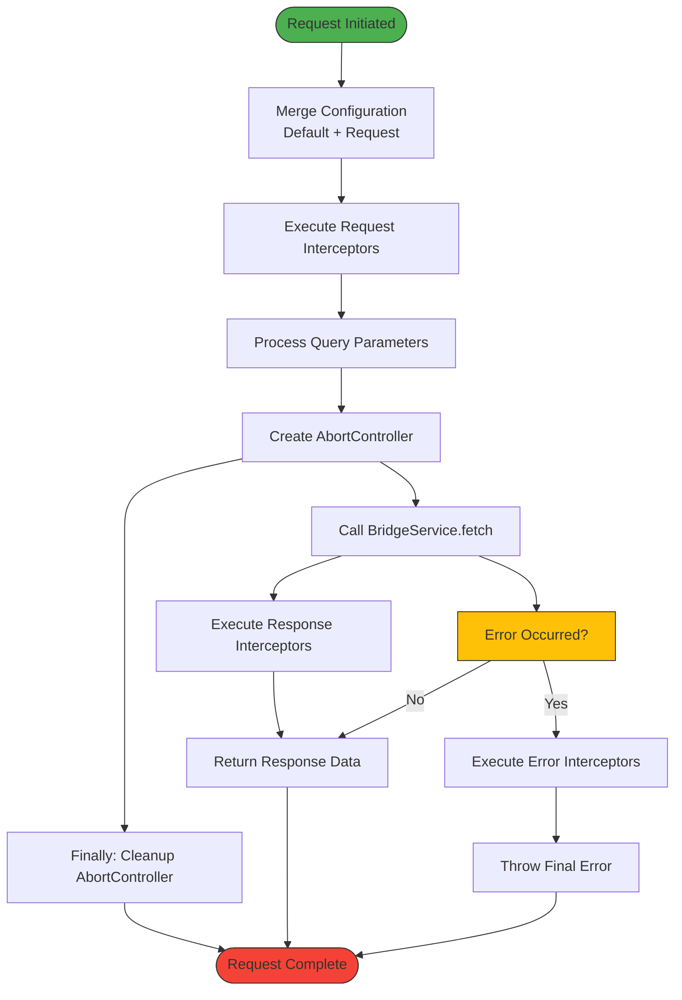
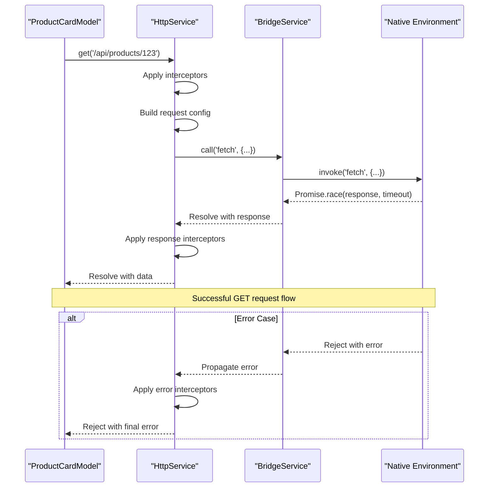

# HTTP Service

<cite>
**Referenced Files in This Document**   
- [http.service.ts](file://packages/h5-builder/src/services/http.service.ts)
- [service-identifiers.ts](file://packages/h5-builder/src/services/service-identifiers.ts)
- [bridge.service.ts](file://packages/h5-builder/src/services/bridge.service.ts)
- [product-card.model.ts](file://packages/h5-builder/src/components/product-card/product-card.model.ts)
- [http.service.test.ts](file://packages/h5-builder/src/__tests__/http.service.test.ts)
</cite>

## Table of Contents
1. [Introduction](#introduction)
2. [Architecture Overview](#architecture-overview)
3. [Core Components](#core-components)
4. [Request Lifecycle and Interception](#request-lifecycle-and-interception)
5. [Error Handling and Retry Mechanisms](#error-handling-and-retry-mechanisms)
6. [Integration with DI System](#integration-with-di-system)
7. [Configuration and Authentication](#configuration-and-authentication)
8. [Performance Considerations](#performance-considerations)
9. [Usage Examples](#usage-examples)
10. [Troubleshooting Guide](#troubleshooting-guide)

## Introduction
The HttpService in the H5 Builder Framework provides a robust solution for handling API communication with external backend systems using HTTP/HTTPS protocols. Built on top of the JSBridge infrastructure, it offers a comprehensive set of features including request/response interception, error handling, timeout management, and request cancellation. The service is designed to work seamlessly within the framework's dependency injection system, allowing components to easily access HTTP functionality through dependency injection. This documentation details the implementation, usage patterns, and best practices for working with the HttpService.

## Architecture Overview

```mermaid
graph TB
subgraph "Application Layer"
A[Component Models]
end
subgraph "Infrastructure Layer"
B[HttpService]
C[BridgeService]
end
subgraph "Native Environment"
D[NativeBridge]
end
A --> |@Inject(HttpService)| B
B --> |call fetch| C
C --> |invoke| D
style A fill:#f9f,stroke:#333
style B fill:#bbf,stroke:#333
style C fill:#bbf,stroke:#333
style D fill:#f96,stroke:#333
```

**Diagram sources**
- [http.service.ts](file://packages/h5-builder/src/services/http.service.ts#L56-L272)
- [bridge.service.ts](file://packages/h5-builder/src/services/bridge.service.ts#L39-L169)

**Section sources**
- [http.service.ts](file://packages/h5-builder/src/services/http.service.ts#L1-L281)
- [bridge.service.ts](file://packages/h5-builder/src/services/bridge.service.ts#L1-L227)

## Core Components

The HttpService implementation consists of several key components that work together to provide a complete HTTP client solution. At its core, the service leverages the BridgeService to communicate with native platform capabilities through JSBridge, enabling HTTP requests from hybrid applications. The service implements the IDisposable interface, ensuring proper cleanup of resources and active requests when the service is no longer needed.

The architecture follows a layered approach where the HttpService handles high-level HTTP operations, while delegating the actual network communication to the BridgeService. This separation of concerns allows for better testability and flexibility in different execution environments. The service maintains collections of request, response, and error interceptors that can modify or react to HTTP operations at various stages of their lifecycle.

**Section sources**
- [http.service.ts](file://packages/h5-builder/src/services/http.service.ts#L56-L272)
- [bridge.service.ts](file://packages/h5-builder/src/services/bridge.service.ts#L39-L169)

## Request Lifecycle and Interception



**Diagram sources**
- [http.service.ts](file://packages/h5-builder/src/services/http.service.ts#L147-L202)

The HttpService implements a comprehensive request lifecycle that includes multiple interception points. When a request is initiated, the service first merges the request configuration with default settings, including the base Content-Type header and 10-second timeout. Request interceptors are then executed in sequence, allowing modification of the request configuration before it is sent.

Query parameters are processed and appended to the URL, and an AbortController is created to enable request cancellation. The actual network request is made through the BridgeService's fetch method, which communicates with the native environment. Upon receiving a response, response interceptors are executed to process the response data before it is returned to the caller. If an error occurs at any point, error interceptors handle the error before it is rethrown.

## Error Handling and Retry Mechanisms

The HttpService implements a robust error handling system through its interceptor pattern. Error interceptors are functions that receive the error object and can either return the original error or a modified version. This allows for centralized error handling logic, such as logging, error transformation, or even automatic retry logic.

When a request fails, whether due to network issues, timeout, or server errors, the error is caught in the request method's catch block. The error is then passed through all registered error interceptors in sequence, with each interceptor having the opportunity to handle or modify the error. This chain-of-responsibility pattern enables flexible error handling strategies without coupling error handling logic to specific components.

The service does not implement automatic retry mechanisms by default, but the interceptor system makes it easy to add retry logic by registering an error interceptor that checks for transient errors and retries the request a specified number of times with exponential backoff.

**Section sources**
- [http.service.ts](file://packages/h5-builder/src/services/http.service.ts#L194-L202)
- [http.service.test.ts](file://packages/h5-builder/src/__tests__/http.service.test.ts#L165-L176)

## Integration with DI System

```mermaid
classDiagram
class HttpService {
+_serviceBrand : undefined
-disposables : DisposableStore
-requestInterceptors : RequestInterceptor[]
-responseInterceptors : ResponseInterceptor[]
-errorInterceptors : ErrorInterceptor[]
-pendingRequests : Set~AbortController~
-defaultConfig : Partial~HttpRequestConfig~
+addRequestInterceptor(interceptor) : () => void
+addResponseInterceptor(interceptor) : () => void
+addErrorInterceptor(interceptor) : () => void
+request~T~(config) : Promise~T~
+get~T~(url, config) : Promise~T~
+post~T~(url, data, config) : Promise~T~
+put~T~(url, data, config) : Promise~T~
+delete~T~(url, config) : Promise~T~
+cancelAll() : void
+dispose() : void
}
class BridgeService {
+_serviceBrand : undefined
-isDebug : boolean
-mockResponses : Map~string, any~
+call~T~(method, params, timeout) : Promise~T~
+setMockResponse(method, data) : void
+setMockResponses(responses) : void
+dispose() : void
}
class IHttpService {
<<interface>>
}
class IBridgeService {
<<interface>>
}
HttpService --> IBridgeService : "depends on"
HttpService ..> IHttpService : "implements"
BridgeService ..> IBridgeService : "implements"
HttpService --> BridgeService : "uses"
note right of HttpService
Uses dependency injection
with service identifiers
rather than direct imports
end note
```

**Diagram sources**
- [http.service.ts](file://packages/h5-builder/src/services/http.service.ts#L56-L272)
- [service-identifiers.ts](file://packages/h5-builder/src/services/service-identifiers.ts#L14-L16)
- [bridge.service.ts](file://packages/h5-builder/src/services/bridge.service.ts#L39-L169)

The HttpService integrates with the framework's dependency injection (DI) system through service identifiers rather than direct class references. This approach provides better flexibility and testability, as services can be easily mocked or replaced without modifying the consuming components. The service is registered with the identifier `IHttpService` created using the `createDecorator` function from the DI system.

Components that need to make HTTP requests can declare their dependency on the HttpService using the `@IHttpService` decorator in their constructor parameters. The DI container then automatically resolves and injects the appropriate service instance when creating the component. This inversion of control pattern makes components more modular and easier to test, as dependencies can be easily substituted with mock implementations during testing.

**Section sources**
- [http.service.ts](file://packages/h5-builder/src/services/http.service.ts#L73-L103)
- [service-identifiers.ts](file://packages/h5-builder/src/services/service-identifiers.ts#L14-L19)

## Configuration and Authentication

The HttpService supports configuration through constructor options that enable common patterns like base URL prefixing and authentication header injection. When creating an HttpService instance, options can be provided to set a base URL that will be automatically prepended to all relative request URLs, and a bearer token that will be added to the Authorization header of all requests.

These configuration options are implemented as request interceptors that modify the request configuration before the request is sent. The base URL interceptor checks if the request URL starts with "http" and, if not, prepends the configured base URL. The token interceptor adds an Authorization header with the Bearer scheme using the provided token. These interceptors are added during service construction and can be removed or replaced as needed.

The service also handles Cross-Origin Resource Sharing (CORS) indirectly through the native environment's JSBridge implementation, which typically runs in a context that doesn't have the same-origin restrictions as web browsers.

**Section sources**
- [http.service.ts](file://packages/h5-builder/src/services/http.service.ts#L77-L96)
- [http.service.test.ts](file://packages/h5-builder/src/__tests__/http.service.test.ts#L200-L249)

## Performance Considerations

The HttpService implements several performance optimizations to ensure efficient network communication. The default configuration includes a 10-second timeout for all requests, preventing hanging requests from consuming resources indefinitely. The service also tracks all pending requests using a Set of AbortController instances, allowing for bulk cancellation of requests when needed.

While the current implementation does not include built-in caching, request batching, or payload compression, these features can be implemented through the interceptor system. Response interceptors could be used to implement caching strategies by storing responses and returning cached data for subsequent requests to the same URL. Request interceptors could batch multiple requests into a single payload, and both request and response interceptors could handle payload compression and decompression.

The service's integration with the DI system also contributes to performance by ensuring that only a single instance of the HttpService is created and shared across the application, reducing memory overhead and enabling potential optimizations like connection reuse.

**Section sources**
- [http.service.ts](file://packages/h5-builder/src/services/http.service.ts#L64-L71)
- [http.service.ts](file://packages/h5-builder/src/services/http.service.ts#L62-L63)

## Usage Examples



**Diagram sources**
- [product-card.model.ts](file://packages/h5-builder/src/components/product-card/product-card.model.ts#L36-L37)
- [http.service.ts](file://packages/h5-builder/src/services/http.service.ts#L208-L213)

Components use the HttpService by declaring it as a dependency in their constructor using the `@IHttpService` decorator. Once injected, components can use the service's methods to perform HTTP operations. The service provides convenience methods for common HTTP verbs including GET, POST, PUT, and DELETE, as well as a generic request method for more complex scenarios.

For example, a ProductCardModel might use the HttpService to fetch product data in its onInit lifecycle method. The component would call the get method with the appropriate URL, and handle the returned promise to update its internal state. The service handles all aspects of the HTTP request, including configuration merging, interceptor execution, and error handling, allowing the component to focus on its business logic.

**Section sources**
- [product-card.model.ts](file://packages/h5-builder/src/components/product-card/product-card.model.ts#L36-L37)
- [http.service.ts](file://packages/h5-builder/src/services/http.service.ts#L208-L249)

## Troubleshooting Guide

Common issues with the HttpService typically fall into three categories: network errors, timeout failures, and malformed responses. Network errors occur when the device has no connectivity or the server is unreachable. These can be identified by error messages indicating connection failures or DNS resolution issues. To troubleshoot, verify network connectivity and check that the server URL is correct and accessible.

Timeout failures happen when a request takes longer than the configured timeout period (10 seconds by default). This can be caused by slow network conditions, server performance issues, or large response payloads. To address timeout issues, consider increasing the timeout for specific requests using the timeout configuration option, or optimize the server-side performance.

Malformed responses occur when the server returns data that cannot be properly parsed or does not match the expected format. The HttpService returns the raw response data, so components should implement proper error handling and validation of the received data. Using TypeScript interfaces to define expected response structures can help catch these issues during development.

When debugging issues, the error interceptor system can be used to log detailed information about failed requests, including the request configuration, response status, and error details. The service's integration with the DI system also makes it easy to replace the HttpService with a mock implementation for testing specific scenarios.

**Section sources**
- [http.service.ts](file://packages/h5-builder/src/services/http.service.ts#L194-L202)
- [http.service.test.ts](file://packages/h5-builder/src/__tests__/http.service.test.ts#L165-L176)
- [bridge.service.ts](file://packages/h5-builder/src/services/bridge.service.ts#L97-L100)