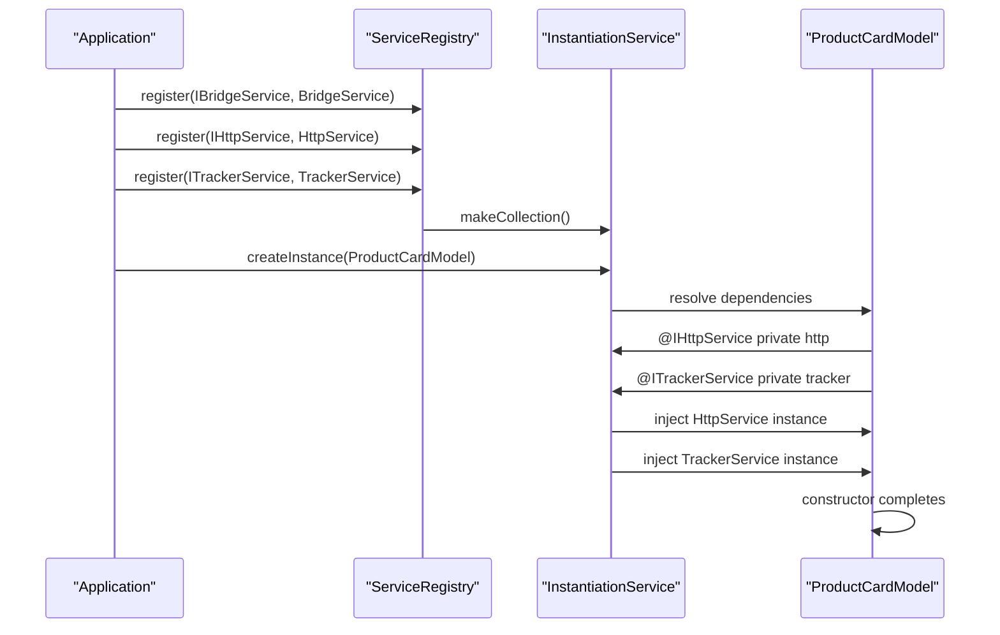
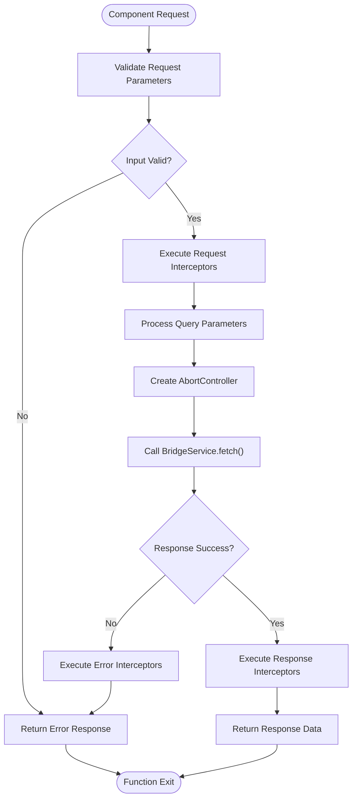
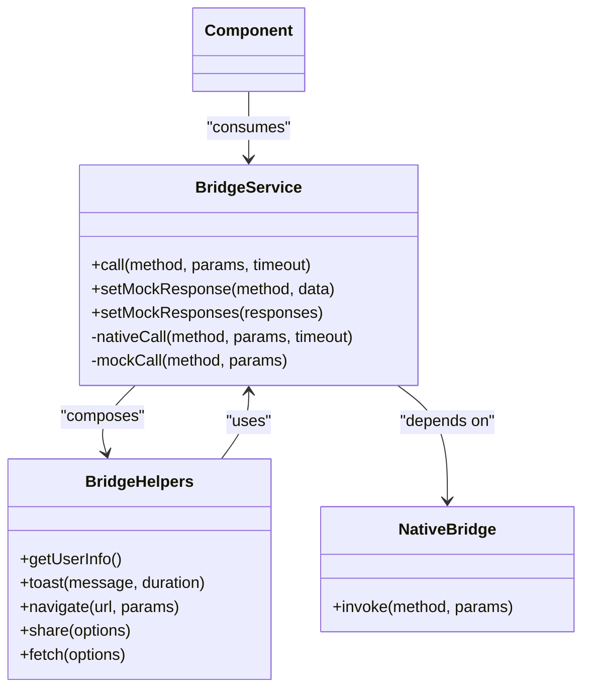
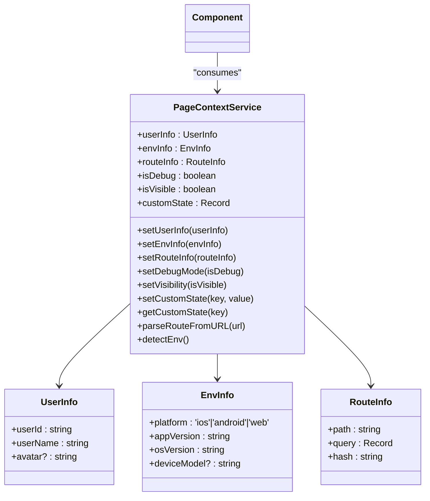

# Infrastructure Layer

<cite>
**Referenced Files in This Document**   
- [http.service.ts](file://packages/h5-builder/src/services/http.service.ts)
- [bridge.service.ts](file://packages/h5-builder/src/services/bridge.service.ts)
- [tracker.service.ts](file://packages/h5-builder/src/services/tracker.service.ts)
- [context.service.ts](file://packages/h5-builder/src/services/context.service.ts)
- [service-identifiers.ts](file://packages/h5-builder/src/services/service-identifiers.ts)
- [instantiation-service.ts](file://packages/h5-builder/src/bedrock/di/instantiation-service.ts)
- [product-card.model.ts](file://packages/h5-builder/src/components/product-card/product-card.model.ts)
- [demo-progressive.tsx](file://packages/h5-builder/src/demo-progressive.tsx)
</cite>

## Table of Contents
1. [Introduction](#introduction)
2. [Core Infrastructure Services](#core-infrastructure-services)
3. [Dependency Injection System](#dependency-injection-system)
4. [Service Registration and Consumption](#service-registration-and-consumption)
5. [HttpService for API Communication](#httpservice-for-api-communication)
6. [BridgeService for Native Integration](#bridgeservice-for-native-integration)
7. [TrackerService for Analytics](#trackerservice-for-analytics)
8. [ContextService for Global State](#contextservice-for-global-state)
9. [Error Handling and Security](#error-handling-and-security)
10. [Performance Considerations](#performance-considerations)
11. [Usage Examples](#usage-examples)

## Introduction
The Infrastructure Layer of the H5 Builder Framework provides essential cross-cutting services that enable communication with external systems and manage the runtime environment. This layer consists of four core services: HttpService for API communication, BridgeService for native app integration, TrackerService for analytics and monitoring, and ContextService for global application state management. These services are designed to be consumed through a robust dependency injection system, ensuring loose coupling and testability across the application. The infrastructure services abstract away platform-specific details, providing a consistent interface for components to interact with external systems while handling concerns like error management, security, and performance optimization.

## Core Infrastructure Services

The H5 Builder Framework's Infrastructure Layer comprises four primary services that handle cross-cutting concerns and external system communication. Each service is designed with specific responsibilities and follows consistent patterns for initialization, configuration, and lifecycle management. These services are implemented as classes that implement the IDisposable interface, ensuring proper cleanup of resources when no longer needed. The services are stateful and maintain their own internal state, including configuration options, pending operations, and cached data. They are designed to be long-lived instances that persist for the duration of the application lifecycle, providing consistent behavior across different components and modules.

**Section sources**
- [http.service.ts](file://packages/h5-builder/src/services/http.service.ts#L56-L272)
- [bridge.service.ts](file://packages/h5-builder/src/services/bridge.service.ts#L39-L168)
- [tracker.service.ts](file://packages/h5-builder/src/services/tracker.service.ts#L34-L227)
- [context.service.ts](file://packages/h5-builder/src/services/context.service.ts#L38-L136)

## Dependency Injection System

```mermaid
classDiagram
class IInstantiationService {
+createInstance(ctor, ...args)
+invokeFunction(fn, ...args)
+createChild(services)
}
class ServiceCollection {
+set(id, instanceOrDescriptor)
+get(id)
}
class SyncDescriptor {
+ctor
+staticArguments
+supportsDelayedInstantiation
}
class ServiceIdentifier {
+name : string
}
IInstantiationService --> ServiceCollection : "uses"
IInstantiationService --> SyncDescriptor : "creates"
ServiceCollection --> ServiceIdentifier : "keys"
ServiceCollection --> "Service Instance" : "values"
```

**Diagram sources**
- [instantiation-service.ts](file://packages/h5-builder/src/bedrock/di/instantiation-service.ts#L61-L467)
- [service-identifiers.ts](file://packages/h5-builder/src/services/service-identifiers.ts#L1-L20)

The H5 Builder Framework employs a sophisticated dependency injection (DI) system that manages the lifecycle and dependencies of infrastructure services. The core of this system is the IInstantiationService interface, which provides methods for creating instances and invoking functions with dependency resolution. The DI container uses service identifiers (created via createDecorator) instead of class references, enabling better type safety and avoiding issues with minification. Services can be registered with static arguments through SyncDescriptor, allowing for configuration during registration. The system supports both eager and lazy instantiation, with lazy services created only when first accessed. The DI container also supports hierarchical composition through the createChild method, enabling scoped service instances for different parts of the application.

**Section sources**
- [instantiation-service.ts](file://packages/h5-builder/src/bedrock/di/instantiation-service.ts#L61-L467)
- [service-identifiers.ts](file://packages/h5-builder/src/services/service-identifiers.ts#L1-L20)

## Service Registration and Consumption



**Diagram sources**
- [demo-progressive.tsx](file://packages/h5-builder/src/demo-progressive.tsx#L194-L206)
- [product-card.model.ts](file://packages/h5-builder/src/components/product-card/product-card.model.ts#L36-L38)

Infrastructure services are registered with the DI container during application initialization using service identifiers and configuration options. The registration process involves creating a ServiceRegistry and registering each service with its corresponding identifier and constructor descriptor. Services can be configured at registration time with options such as baseURL for HttpService or debug mode for TrackerService. Components consume these services through constructor injection, using the @ symbol followed by the service identifier to declare dependencies. The DI container automatically resolves these dependencies when creating component instances, injecting the appropriate service instances. This pattern ensures that components are decoupled from service creation and configuration, promoting testability and maintainability.

**Section sources**
- [demo-progressive.tsx](file://packages/h5-builder/src/demo-progressive.tsx#L194-L206)
- [product-card.model.ts](file://packages/h5-builder/src/components/product-card/product-card.model.ts#L36-L38)

## HttpService for API Communication



**Diagram sources**
- [http.service.ts](file://packages/h5-builder/src/services/http.service.ts#L147-L202)

The HttpService provides a comprehensive solution for API communication within the H5 Builder Framework. It acts as a wrapper around the BridgeService's fetch functionality, adding features like request/response interception, error handling, and configuration management. The service supports standard HTTP methods (GET, POST, PUT, DELETE) through dedicated methods that abstract away the underlying implementation details. It includes a sophisticated interceptor system that allows for cross-cutting concerns like authentication token injection, request logging, and response transformation. The service handles query parameters by automatically converting them to URL query strings and manages request timeouts to prevent hanging operations. All HTTP requests are cancellable through the AbortController API, and the service tracks pending requests to enable bulk cancellation when needed.

**Section sources**
- [http.service.ts](file://packages/h5-builder/src/services/http.service.ts#L56-L272)

## BridgeService for Native Integration



**Diagram sources**
- [bridge.service.ts](file://packages/h5-builder/src/services/bridge.service.ts#L39-L168)

The BridgeService facilitates communication between the H5 application and native app functionality through a JSBridge interface. It provides a unified API for calling native methods such as getUserInfo, toast, navigate, and share, abstracting away the platform-specific implementation details. The service includes a mock mode for debugging and testing in browser environments, where native functionality is not available. In mock mode, it simulates native calls with predefined responses and introduces artificial delays to mimic network latency. The service handles method invocation with timeout protection, ensuring that calls do not hang indefinitely. It also includes error handling and logging to aid in debugging integration issues. The BridgeService is designed to be resilient, gracefully handling cases where the native bridge is not available or specific methods are not implemented.

**Section sources**
- [bridge.service.ts](file://packages/h5-builder/src/services/bridge.service.ts#L39-L168)

## TrackerService for Analytics

```mermaid
flowchart TD
Start([track(event, params)]) --> DebugMode{"Debug Mode?"}
DebugMode --> |Yes| DebugTrack["Execute debugTrack()"]
DebugMode --> |No| Enqueue["Add to queue"]
Enqueue --> QueueFull{"Queue >= maxBatchSize?"}
QueueFull --> |Yes| Flush["Immediate flush()"]
QueueFull --> |No| Schedule["Schedule flush()"]
Schedule --> TimerActive{"Timer Running?"}
TimerActive --> |No| StartTimer["Start flushTimer"]
DebugTrack --> Toast["Show Toast"]
DebugTrack --> SyncCall["Call trackSync()"]
Flush --> HasEvents{"Queue has events?"}
HasEvents --> |Yes| SendBatch["Call trackBatch()"]
HasEvents --> |No| Exit
SendBatch --> Success{"Success?"}
Success --> |Yes| UpdateStorage["Update localStorage"]
Success --> |No| Requeue["Re-add to queue"]
Requeue --> UpdateStorage
UpdateStorage --> ClearSent["Remove sent events"]
ClearSent --> Exit([Exit])
```

**Diagram sources**
- [tracker.service.ts](file://packages/h5-builder/src/services/tracker.service.ts#L71-L144)

The TrackerService provides a robust analytics and monitoring solution for the H5 Builder Framework. It implements a queuing system that batches events for efficient transmission, reducing the number of individual network calls. The service supports both immediate (debug mode) and batched (production mode) event reporting, with configurable batch sizes and flush intervals. In debug mode, events are reported synchronously with visual feedback through toast notifications, aiding in development and testing. The service includes persistence capabilities, storing unsent events in localStorage to prevent data loss during page navigation or crashes. It automatically flushes the queue before page unload and can restore events from storage on subsequent visits. The TrackerService also provides helper methods for common event types like page views, component exposures, and clicks, standardizing event naming and parameter structure across the application.

**Section sources**
- [tracker.service.ts](file://packages/h5-builder/src/services/tracker.service.ts#L34-L227)

## ContextService for Global State



**Diagram sources**
- [context.service.ts](file://packages/h5-builder/src/services/context.service.ts#L38-L136)

The ContextService (PageContextService) manages global application state that needs to be shared across components and services. It provides a centralized location for storing and accessing user information, environment details, routing information, and application state flags. The service uses MobX for reactivity, making the entire context object observable so that components can automatically update when state changes. It includes utility methods for parsing URL parameters into structured route information and detecting the current environment (platform, app version, OS version) from the user agent string. The service maintains state flags like isDebug and isVisible to track the application's current mode and visibility status. It also provides a customState dictionary for storing arbitrary application-specific state that needs to be globally accessible.

**Section sources**
- [context.service.ts](file://packages/h5-builder/src/services/context.service.ts#L38-L136)

## Error Handling and Security

The infrastructure services implement comprehensive error handling and security measures to ensure reliable and secure operation. The HttpService includes a configurable interceptor system that can add authentication tokens to requests and handle authentication failures. It logs all failed requests to the console for debugging purposes while preventing sensitive error details from being exposed to the user interface. The BridgeService validates the availability of the native bridge before making calls and handles timeouts gracefully to prevent application hangs. The TrackerService includes error recovery mechanisms, re-queuing events that fail to send and persisting them to localStorage for later transmission. All services implement the IDisposable interface, ensuring that resources like timers and event listeners are properly cleaned up when services are destroyed. The DI system provides additional security by preventing circular dependencies and validating service registrations at startup.

**Section sources**
- [http.service.ts](file://packages/h5-builder/src/services/http.service.ts#L99-L102)
- [bridge.service.ts](file://packages/h5-builder/src/services/bridge.service.ts#L75-L99)
- [tracker.service.ts](file://packages/h5-builder/src/services/tracker.service.ts#L160-L169)
- [instantiation-service.ts](file://packages/h5-builder/src/bedrock/di/instantiation-service.ts#L297-L304)

## Performance Considerations

The infrastructure services are designed with performance optimization as a primary concern. The HttpService minimizes network overhead by supporting request cancellation and timeout mechanisms, preventing unnecessary resource consumption. The TrackerService reduces network traffic through event batching and intelligent flush scheduling, while also minimizing memory usage by limiting queue size. The BridgeService optimizes native communication by using efficient data serialization and minimizing the number of bridge calls through batched operations when possible. The DI system contributes to performance by supporting lazy instantiation of services, ensuring that resources are only allocated when actually needed. The ContextService uses MobX's efficient change detection to minimize unnecessary re-renders when global state changes. All services are designed to be lightweight and have minimal initialization overhead, contributing to faster application startup times.

**Section sources**
- [http.service.ts](file://packages/h5-builder/src/services/http.service.ts#L64-L71)
- [tracker.service.ts](file://packages/h5-builder/src/services/tracker.service.ts#L45-L49)
- [instantiation-service.ts](file://packages/h5-builder/src/bedrock/di/instantiation-service.ts#L435-L439)

## Usage Examples

The infrastructure services are consumed by components through dependency injection, as demonstrated in the ProductCardModel example. Components declare their service dependencies in the constructor using service identifiers and the @ syntax, allowing the DI container to automatically inject the appropriate instances. The ProductCardModel uses HttpService to fetch product data and TrackerService to report user interactions like component exposure and clicks. Services can also be used directly in React components through the useService hook, which retrieves service instances from the current instantiation context. Configuration of services occurs at registration time, with options like baseURL for HttpService or debug mode for TrackerService passed through the SyncDescriptor. This pattern allows for environment-specific configuration without changing component code.

**Section sources**
- [product-card.model.ts](file://packages/h5-builder/src/components/product-card/product-card.model.ts#L36-L38)
- [demo-progressive.tsx](file://packages/h5-builder/src/demo-progressive.tsx#L198-L202)
- [context.web.tsx](file://packages/h5-builder/src/bedrock/di/context.web.tsx#L29-L40)