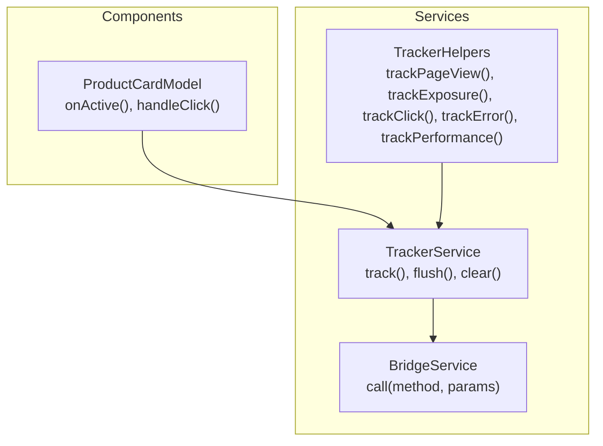
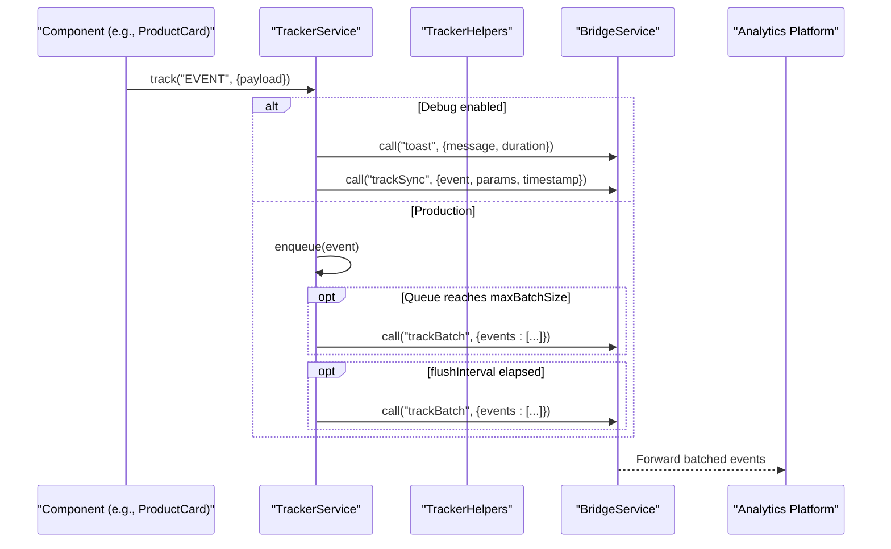
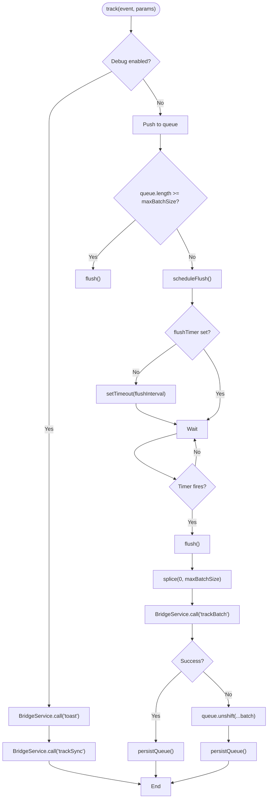
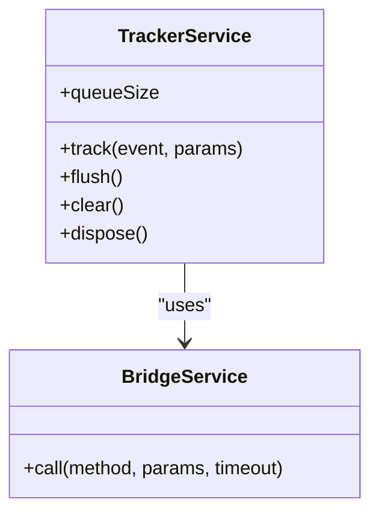
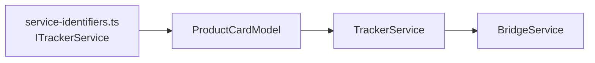

# Tracker Service

<cite>
**Referenced Files in This Document**
- [tracker.service.ts](file://packages/h5-builder/src/services/tracker.service.ts)
- [tracker.service.test.ts](file://packages/h5-builder/src/__tests__/tracker.service.test.ts)
- [bridge.service.ts](file://packages/h5-builder/src/services/bridge.service.ts)
- [service-identifiers.ts](file://packages/h5-builder/src/services/service-identifiers.ts)
- [product-card.model.ts](file://packages/h5-builder/src/components/product-card/product-card.model.ts)
- [api_reference.md](file://packages/h5-builder/docs/api_reference.md)
- [debounce.ts](file://packages/h5-builder/src/bedrock/function/debounce.ts)
- [throttle.ts](file://packages/h5-builder/src/bedrock/function/throttle.ts)
</cite>

## Table of Contents
1. [Introduction](#introduction)
2. [Project Structure](#project-structure)
3. [Core Components](#core-components)
4. [Architecture Overview](#architecture-overview)
5. [Detailed Component Analysis](#detailed-component-analysis)
6. [Dependency Analysis](#dependency-analysis)
7. [Performance Considerations](#performance-considerations)
8. [Troubleshooting Guide](#troubleshooting-guide)
9. [Conclusion](#conclusion)
10. [Appendices](#appendices)

## Introduction
This document describes the TrackerService used for analytics and user behavior tracking in the H5 Builder Framework. It covers how page views, component interactions, and custom events are captured with structured payloads, how the service integrates with third-party analytics platforms via the BridgeService, how event queuing enables offline resilience, and how batching and persistence mitigate event flooding. It also provides guidance on payload optimization, sampling strategies, and troubleshooting missed or incorrectly propagated events.

## Project Structure
The TrackerService resides under the services module and is integrated with the DI system. Components obtain a TrackerService instance via dependency injection and emit events during lifecycle and interaction hooks. Tests validate batching, persistence, error handling, and disposal behavior. The BridgeService abstracts platform integrations and supports a mock mode for development.

**Diagram sources**
- [tracker.service.ts](file://packages/h5-builder/src/services/tracker.service.ts#L1-L289)
- [bridge.service.ts](file://packages/h5-builder/src/services/bridge.service.ts#L1-L227)
- [product-card.model.ts](file://packages/h5-builder/src/components/product-card/product-card.model.ts#L1-L133)

**Section sources**
- [tracker.service.ts](file://packages/h5-builder/src/services/tracker.service.ts#L1-L289)
- [bridge.service.ts](file://packages/h5-builder/src/services/bridge.service.ts#L1-L227)
- [service-identifiers.ts](file://packages/h5-builder/src/services/service-identifiers.ts#L1-L20)
- [product-card.model.ts](file://packages/h5-builder/src/components/product-card/product-card.model.ts#L1-L133)

## Core Components
- TrackerService: Centralized event capture and delivery pipeline with batching, scheduling, persistence, and disposal.
- TrackerHelpers: Convenience wrappers for common event categories (page view, exposure, click, error, performance).
- BridgeService: Abstraction over native/analytics bridge calls, with mock support for local development.
- DI Identifiers: Service identifiers enabling constructor injection of TrackerService.

Key responsibilities:
- Enqueue events in production mode and schedule flushes.
- Batch-send events to the analytics platform via BridgeService.
- Persist queue to localStorage for offline resilience.
- Provide helpers for common event patterns.
- Dispose timers and flush remaining events on shutdown.

**Section sources**
- [tracker.service.ts](file://packages/h5-builder/src/services/tracker.service.ts#L1-L289)
- [tracker.service.test.ts](file://packages/h5-builder/src/__tests__/tracker.service.test.ts#L1-L225)
- [service-identifiers.ts](file://packages/h5-builder/src/services/service-identifiers.ts#L1-L20)

## Architecture Overview
The TrackerService orchestrates event capture and delivery:

**Diagram sources**
- [tracker.service.ts](file://packages/h5-builder/src/services/tracker.service.ts#L71-L171)
- [bridge.service.ts](file://packages/h5-builder/src/services/bridge.service.ts#L55-L118)

## Detailed Component Analysis

### TrackerService
Responsibilities:
- Event capture: track(event, params) creates a TrackEvent with timestamp and enqueues it in production mode.
- Debug mode: Immediately shows a toast and sends synchronously via trackSync.
- Batching and scheduling: Maintains a queue and schedules flushes based on maxBatchSize and flushInterval.
- Persistence: Optionally persists queue to localStorage and restores on startup.
- Error handling: On flush failure, re-enqueues batch and updates persistence.
- Disposal: Clears flush timers and flushes remaining events.

Implementation highlights:
- Configurable defaults for debug, maxBatchSize, flushInterval, enablePersistence, storageKey.
- Single flush timer guard to avoid overlapping timers.
- Beforeunload flush to minimize lost events on navigation.

**Diagram sources**
- [tracker.service.ts](file://packages/h5-builder/src/services/tracker.service.ts#L71-L171)

**Section sources**
- [tracker.service.ts](file://packages/h5-builder/src/services/tracker.service.ts#L1-L289)
- [tracker.service.test.ts](file://packages/h5-builder/src/__tests__/tracker.service.test.ts#L1-L225)

### TrackerHelpers
Convenience wrappers around TrackerService to emit standardized events:
- trackPageView(pageName, params?)
- trackExposure(componentType, componentId, params?)
- trackClick(componentType, componentId, params?)
- trackError(error, context?)
- trackPerformance(metric, value, params?)

These helpers ensure consistent event names and payload shapes for common patterns.

**Section sources**
- [tracker.service.ts](file://packages/h5-builder/src/services/tracker.service.ts#L230-L289)
- [tracker.service.test.ts](file://packages/h5-builder/src/__tests__/tracker.service.test.ts#L186-L224)

### BridgeService Integration
- The TrackerService delegates to BridgeService.call("trackBatch", ...) to deliver batches.
- In debug mode, it uses "toast" and "trackSync".
- BridgeService supports a mock mode for browser testing and provides timeouts and error handling.

**Diagram sources**
- [tracker.service.ts](file://packages/h5-builder/src/services/tracker.service.ts#L71-L171)
- [bridge.service.ts](file://packages/h5-builder/src/services/bridge.service.ts#L55-L118)

**Section sources**
- [bridge.service.ts](file://packages/h5-builder/src/services/bridge.service.ts#L1-L227)
- [tracker.service.ts](file://packages/h5-builder/src/services/tracker.service.ts#L71-L171)

### Component Usage Example
The ProductCard component demonstrates real-world usage:
- Exposure: Emits PRODUCT_EXPOSURE when activated.
- Interaction: Emits PRODUCT_CLICK on user action.
- Load: Emits PRODUCT_LOADED after data fetch completes.

These calls demonstrate how components integrate with TrackerService via DI and pass contextual metadata (e.g., productId, productName).

**Section sources**
- [product-card.model.ts](file://packages/h5-builder/src/components/product-card/product-card.model.ts#L49-L116)

## Dependency Analysis
- DI Identifiers: ITrackerService is exported and used in component constructors to inject TrackerService.
- Component dependency: ProductCardModel receives TrackerService via constructor injection.
- Service contract: TrackerService implements IDisposable, ensuring proper cleanup.

**Diagram sources**
- [service-identifiers.ts](file://packages/h5-builder/src/services/service-identifiers.ts#L1-L20)
- [product-card.model.ts](file://packages/h5-builder/src/components/product-card/product-card.model.ts#L1-L40)
- [tracker.service.ts](file://packages/h5-builder/src/services/tracker.service.ts#L1-L66)

**Section sources**
- [service-identifiers.ts](file://packages/h5-builder/src/services/service-identifiers.ts#L1-L20)
- [product-card.model.ts](file://packages/h5-builder/src/components/product-card/product-card.model.ts#L1-L40)
- [tracker.service.ts](file://packages/h5-builder/src/services/tracker.service.ts#L1-L66)

## Performance Considerations
- Batching: Tune maxBatchSize to balance latency and throughput. Larger batches reduce network overhead but increase per-event latency.
- Scheduling: Adjust flushInterval to align with platform rate limits and device power constraints.
- Debounce and throttle: While the TrackerService does not internally debounce events, components can use debounce/throttle utilities to prevent excessive rapid-fire events. The framework provides debounce and throttle utilities that can be applied to handlers before invoking tracker.track().
- Persistence: enablePersistence reduces data loss on offline scenarios but adds IO overhead. Consider storage quotas and clearing stale queues periodically.
- Payload size: Keep params minimal and avoid large binary blobs. Use identifiers instead of full objects where possible.
- Sampling: Implement client-side sampling strategies (e.g., probabilistic sampling) before calling tracker.track() to reduce volume under high traffic.

[No sources needed since this section provides general guidance]

## Troubleshooting Guide
Common issues and resolutions:

- Missed events on navigation
  - Symptom: Events disappear after navigating away.
  - Cause: No flush on beforeunload.
  - Resolution: Ensure TrackerService is constructed and dispose() is called on unmount to flush remaining events.

- Duplicate or overlapping flush timers
  - Symptom: Unexpected multiple flushes or timer leaks.
  - Cause: Multiple timers scheduled concurrently.
  - Resolution: The service guards against multiple timers; verify no external code schedules timers independently.

- Offline scenarios
  - Symptom: Events not sent when offline.
  - Cause: Network errors during flush.
  - Resolution: Enable persistence to store queue in localStorage; verify restoreQueue on startup and retry logic.

- Incorrect context propagation
  - Symptom: Missing productId or pageName in events.
  - Cause: Missing or empty contextual data in params.
  - Resolution: Ensure components pass meaningful context (e.g., model.state) to tracker.track().

- Initialization failures
  - Symptom: BridgeService unavailable or timeouts.
  - Cause: NativeBridge missing or slow platform.
  - Resolution: Use BridgeService mock mode for local testing; verify timeouts and error messages.

- Debug mode not sending
  - Symptom: Debug mode shows toast but no analytics.
  - Cause: trackSync not implemented on platform.
  - Resolution: Confirm platform supports trackSync and that toast succeeds.

**Section sources**
- [tracker.service.ts](file://packages/h5-builder/src/services/tracker.service.ts#L141-L171)
- [tracker.service.test.ts](file://packages/h5-builder/src/__tests__/tracker.service.test.ts#L136-L155)
- [bridge.service.ts](file://packages/h5-builder/src/services/bridge.service.ts#L55-L118)

## Conclusion
The TrackerService provides a robust, configurable foundation for analytics in the H5 Builder Framework. It balances responsiveness with reliability through batching, scheduling, and persistence. Components integrate seamlessly via DI, emitting structured events enriched with contextual metadata. With careful tuning of batching and scheduling parameters, and optional debounce/throttle usage, the system can handle high-frequency interactions while minimizing bandwidth and preserving user privacy.

[No sources needed since this section summarizes without analyzing specific files]

## Appendices

### API Reference Highlights
- Configuration options: debug, maxBatchSize, flushInterval, enablePersistence, storageKey.
- Methods: track(event, params), flush(), clear(), queueSize accessor.
- Helpers: trackPageView, trackExposure, trackClick, trackError, trackPerformance.

**Section sources**
- [api_reference.md](file://packages/h5-builder/docs/api_reference.md#L411-L455)

### Debounce and Throttle Utilities
- Debounce: Coalesces rapid calls into a single invocation after the wait period.
- Throttle: Limits invocation frequency with optional leading/trailing behavior and maxWait.

These utilities can be applied to event handlers to prevent flooding before calling tracker.track().

**Section sources**
- [debounce.ts](file://packages/h5-builder/src/bedrock/function/debounce.ts#L1-L274)
- [throttle.ts](file://packages/h5-builder/src/bedrock/function/throttle.ts#L1-L26)