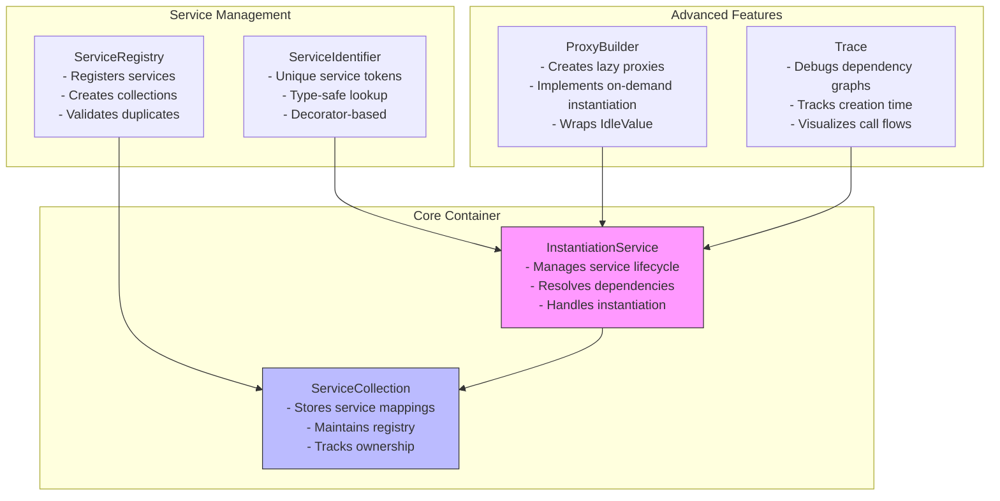
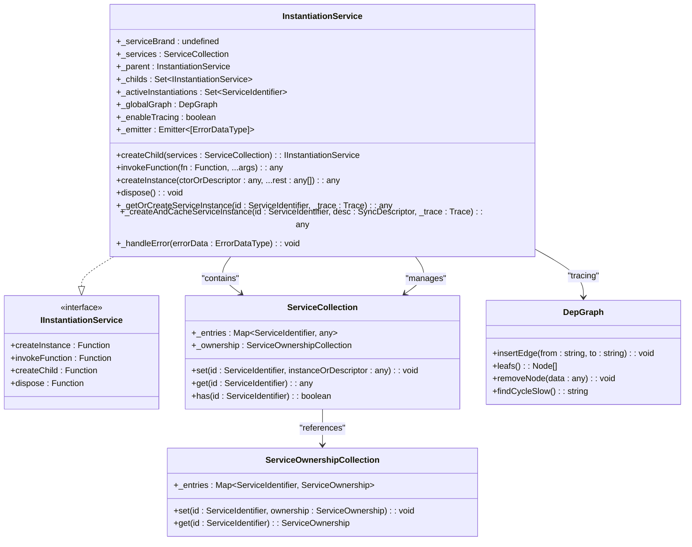
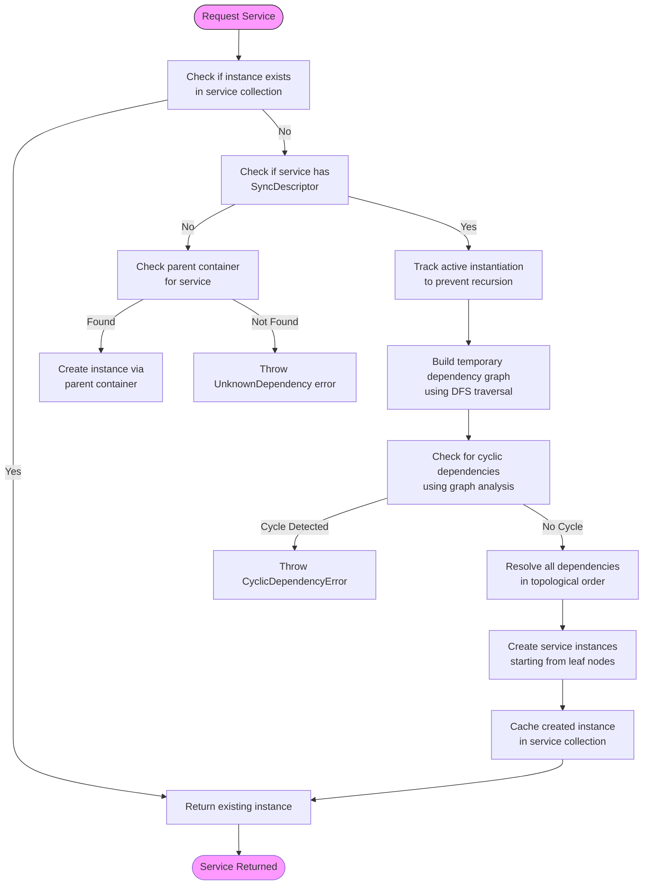
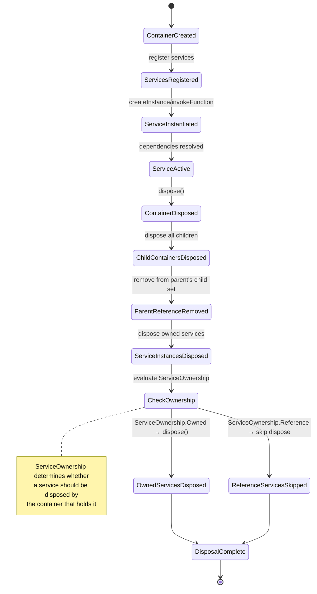
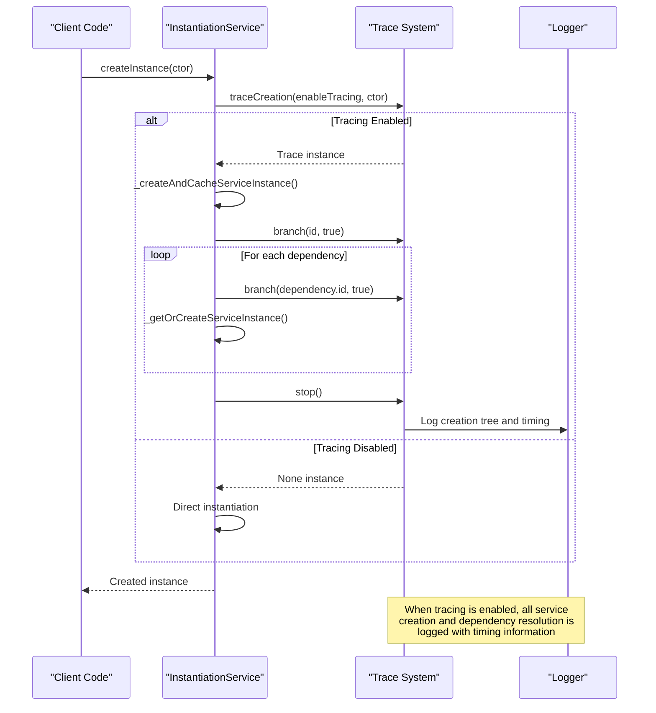
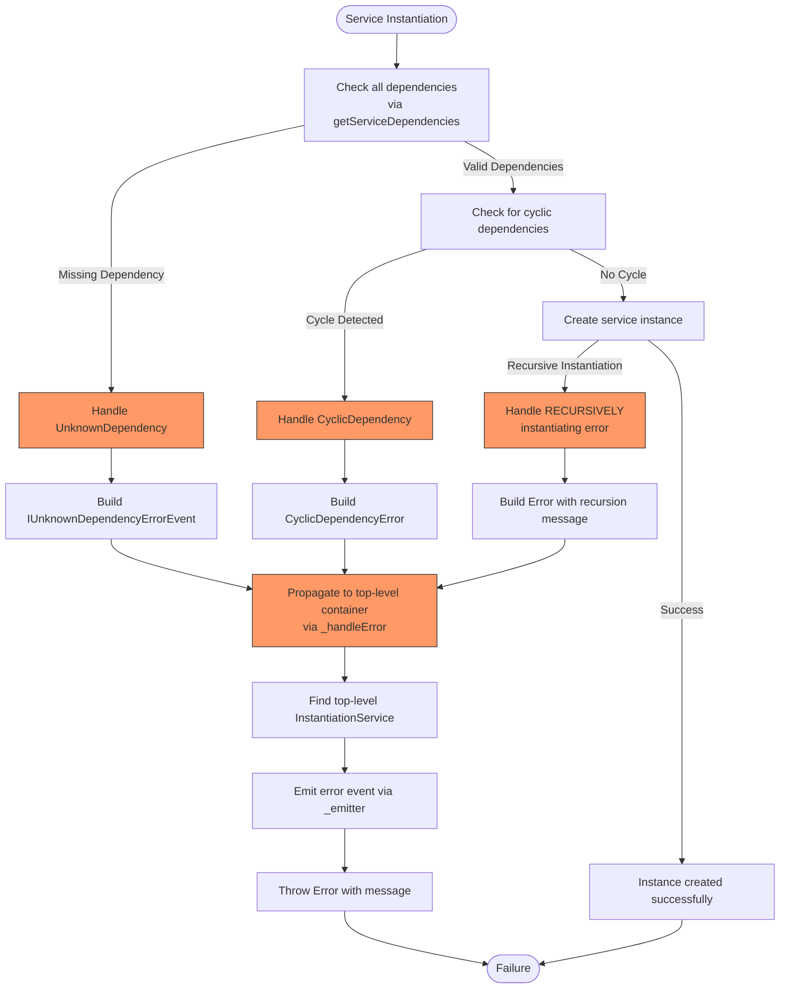
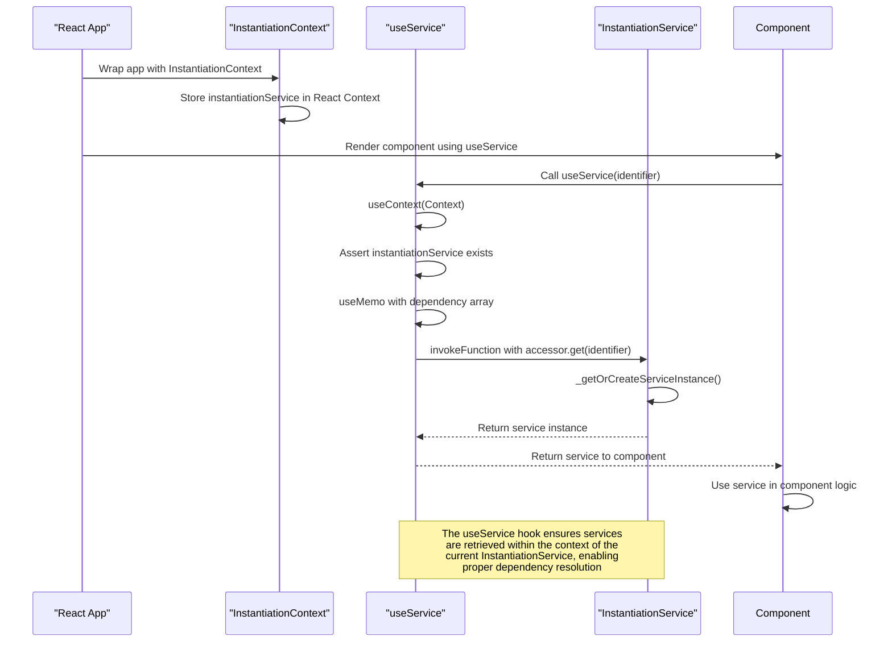

# Dependency Injection

<cite>
**Referenced Files in This Document**   
- [instantiation-service.ts](file://packages/h5-builder/src/bedrock/di/instantiation-service.ts)
- [service-collection.ts](file://packages/h5-builder/src/bedrock/di/service-collection.ts)
- [service-registry.ts](file://packages/h5-builder/src/bedrock/di/service-registry.ts)
- [proxy-builder.ts](file://packages/h5-builder/src/bedrock/di/proxy-builder.ts)
- [trace.ts](file://packages/h5-builder/src/bedrock/di/trace.ts)
- [base.ts](file://packages/h5-builder/src/bedrock/di/base.ts)
- [descriptor.ts](file://packages/h5-builder/src/bedrock/di/descriptor.ts)
- [instantiation-service.interface.ts](file://packages/h5-builder/src/bedrock/di/instantiation-service.interface.ts)
- [service-ownership-collection.ts](file://packages/h5-builder/src/bedrock/di/service-ownership-collection.ts)
- [idle-value.ts](file://packages/h5-builder/src/bedrock/di/idle-value.ts)
- [lazy-service.ts](file://packages/h5-builder/src/bedrock/di/lazy/lazy-service.ts)
- [context.web.tsx](file://packages/h5-builder/src/bedrock/di/context.web.tsx)
- [service-identifiers.ts](file://packages/h5-builder/src/services/service-identifiers.ts)
</cite>

## Table of Contents
1. [Introduction](#introduction)
2. [Core Components](#core-components)
3. [Architecture Overview](#architecture-overview)
4. [Detailed Component Analysis](#detailed-component-analysis)
5. [Dependency Resolution Process](#dependency-resolution-process)
6. [Service Lifecycle Management](#service-lifecycle-management)
7. [Proxy Builder and Lazy Instantiation](#proxy-builder-and-lazy-instantiation)
8. [Tracing and Debugging](#tracing-and-debugging)
9. [Error Handling Mechanisms](#error-handling-mechanisms)
10. [Child Injector Creation](#child-injector-creation)
11. [Integration with React Components](#integration-with-react-components)
12. [Conclusion](#conclusion)

## Introduction
The Dependency Injection system in the Kernel Layer provides a comprehensive service container solution for managing service registration, resolution, and lifecycle. At its core is the InstantiationService, which serves as the primary container for dependency injection operations. The system enables services to declare their dependencies through @Inject decorators, allowing for automatic resolution and instantiation. This documentation details the architecture and implementation of this DI system, focusing on the InstantiationService as the central component that orchestrates service management across the application.

## Core Components
The Dependency Injection system consists of several key components that work together to provide a robust service container. The InstantiationService acts as the core container that manages service registration, resolution, and lifecycle. It works in conjunction with the ServiceCollection which maintains the registry of available services and their implementations. The ServiceIdentifier system provides unique tokens for service lookup, while the @Inject decorator enables dependency declaration in constructors. The proxy builder implementation facilitates lazy instantiation, and the tracing system provides debugging capabilities for dependency graphs.

**Section sources**
- [instantiation-service.ts](file://packages/h5-builder/src/bedrock/di/instantiation-service.ts#L61-L467)
- [service-collection.ts](file://packages/h5-builder/src/bedrock/di/service-collection.ts#L14-L47)
- [base.ts](file://packages/h5-builder/src/bedrock/di/base.ts#L9-L74)

## Architecture Overview
The Dependency Injection system follows a hierarchical container architecture where each InstantiationService can have parent and child relationships, enabling service inheritance and isolation. The core components interact through well-defined interfaces and patterns to provide a flexible and extensible dependency management solution.



**Diagram sources**
- [instantiation-service.ts](file://packages/h5-builder/src/bedrock/di/instantiation-service.ts#L61-L467)
- [service-collection.ts](file://packages/h5-builder/src/bedrock/di/service-collection.ts#L14-L47)
- [service-registry.ts](file://packages/h5-builder/src/bedrock/di/service-registry.ts#L16-L100)
- [proxy-builder.ts](file://packages/h5-builder/src/bedrock/di/proxy-builder.ts#L8-L39)
- [trace.ts](file://packages/h5-builder/src/bedrock/di/trace.ts#L10-L86)

## Detailed Component Analysis

### InstantiationService Analysis
The InstantiationService is the central component of the Dependency Injection system, serving as the core container that manages service registration, resolution, and lifecycle. It implements the IInstantiationService interface and provides methods for creating instances, invoking functions with service access, and creating child containers.



**Diagram sources**
- [instantiation-service.ts](file://packages/h5-builder/src/bedrock/di/instantiation-service.ts#L61-L467)
- [service-collection.ts](file://packages/h5-builder/src/bedrock/di/service-collection.ts#L14-L47)
- [service-ownership-collection.ts](file://packages/h5-builder/src/bedrock/di/service-ownership-collection.ts#L14-L39)

### Service Registry and Collection Analysis
The service registry and collection system provides the foundation for service registration and lookup in the Dependency Injection system. The ServiceRegistry acts as a factory for creating ServiceCollection instances, which are used by the InstantiationService to manage service mappings.

```mermaid
classDiagram
class ServiceRegistry {
+_registry : [ServiceIdentifier, SyncDescriptor | BrandedService][]
+_serviceOwnership : ServiceOwnershipCollection
+_ids : Set~string~
+_checkDuplicate : boolean
+register(id : ServiceIdentifier, ctorOrDescriptor : any, supportsDelayedInstantiation? : boolean | InstantiationType) : void
+registerInstance(id : ServiceIdentifier, instance : T, options? : { ownership : ServiceOwnership }) : void
+makeCollection() : ServiceCollection
}
class ServiceCollection {
+_entries : Map~ServiceIdentifier, any~
+_ownership : ServiceOwnershipCollection
+set(id : ServiceIdentifier, instanceOrDescriptor : any) : void
+get(id : ServiceIdentifier) : any
+has(id : ServiceIdentifier) : boolean
}
class SyncDescriptor {
+ctor : new (...args : any[]) => T
+staticArguments : any[]
+supportsDelayedInstantiation : boolean
}
class ServiceIdentifier {
<<interface>>
(...args : any[]) : void
type : T
}
ServiceRegistry --> ServiceCollection : "creates"
ServiceRegistry --> SyncDescriptor : "uses"
ServiceCollection --> SyncDescriptor : "stores"
ServiceCollection --> ServiceIdentifier : "keys"
class ServiceOwnership {
<<enumeration>>
Owned
Reference
}
ServiceRegistry --> ServiceOwnershipCollection : "contains"
ServiceCollection --> ServiceOwnershipCollection : "references"
```

**Diagram sources**
- [service-registry.ts](file://packages/h5-builder/src/bedrock/di/service-registry.ts#L16-L100)
- [service-collection.ts](file://packages/h5-builder/src/bedrock/di/service-collection.ts#L14-L47)
- [descriptor.ts](file://packages/h5-builder/src/bedrock/di/descriptor.ts#L8-L32)
- [base.ts](file://packages/h5-builder/src/bedrock/di/base.ts#L9-L74)
- [service-ownership-collection.ts](file://packages/h5-builder/src/bedrock/di/service-ownership-collection.ts#L3-L39)

## Dependency Resolution Process
The dependency resolution process in the Dependency Injection system follows a systematic approach to instantiate services and their dependencies. When a service is requested, the system first checks if it already exists in the container. If not, it analyzes the service's constructor to identify its dependencies, which are then resolved recursively.



**Diagram sources**
- [instantiation-service.ts](file://packages/h5-builder/src/bedrock/di/instantiation-service.ts#L278-L396)
- [base.ts](file://packages/h5-builder/src/bedrock/di/base.ts#L27-L66)
- [descriptor.ts](file://packages/h5-builder/src/bedrock/di/descriptor.ts#L8-L32)

**Section sources**
- [instantiation-service.ts](file://packages/h5-builder/src/bedrock/di/instantiation-service.ts#L278-L396)
- [base.ts](file://packages/h5-builder/src/bedrock/di/base.ts#L27-L66)

## Service Lifecycle Management
The Dependency Injection system implements comprehensive service lifecycle management through the InstantiationService's dispose mechanism and service ownership tracking. Services can be owned by the container or referenced from parent containers, with appropriate disposal behavior based on ownership.



**Diagram sources**
- [instantiation-service.ts](file://packages/h5-builder/src/bedrock/di/instantiation-service.ts#L178-L213)
- [service-ownership-collection.ts](file://packages/h5-builder/src/bedrock/di/service-ownership-collection.ts#L3-L39)

**Section sources**
- [instantiation-service.ts](file://packages/h5-builder/src/bedrock/di/instantiation-service.ts#L178-L213)
- [service-ownership-collection.ts](file://packages/h5-builder/src/bedrock/di/service-ownership-collection.ts#L3-L39)

## Proxy Builder and Lazy Instantiation
The proxy builder implementation enables lazy service instantiation through the use of JavaScript proxies and the IdleValue container. This allows services to be instantiated only when their methods or properties are actually accessed, improving startup performance.

```mermaid
classDiagram
class ProxyBuilder {
+makeProxy(valueWrapper : IdleValue, ctor : any) : T
}
class IdleValue {
+_executor : () => void
+_handle : IDisposable
+_didRun : boolean
+_value : T
+value : T
+isInitialized : boolean
+onExecutor : Event~[]~
+dispose() : void
}
class Proxy {
+get(target, key) : any
+set(target, p, value) : boolean
}
ProxyBuilder --> IdleValue : "wraps"
ProxyBuilder --> Proxy : "creates"
IdleValue --> lvSchedulerCallback : "scheduled execution"
class InstantiationService {
+_createServiceInstance(id : ServiceIdentifier, ctor : any, args : any[], supportsDelayedInstantiation : boolean, _trace : Trace) : T
}
InstantiationService --> ProxyBuilder : "uses for delayed instantiation"
note right of ProxyBuilder
When supportsDelayedInstantiation is true,
makeProxy wraps the IdleValue to create
a proxy that delays instantiation until
first property access
end note
note right of IdleValue
Uses lvSchedulerCallback with IdlePriority
to schedule execution when the browser
is idle, preventing blocking of main thread
end note
```

**Diagram sources**
- [proxy-builder.ts](file://packages/h5-builder/src/bedrock/di/proxy-builder.ts#L8-L39)
- [idle-value.ts](file://packages/h5-builder/src/bedrock/di/idle-value.ts#L8-L64)
- [instantiation-service.ts](file://packages/h5-builder/src/bedrock/di/instantiation-service.ts#L423-L440)

**Section sources**
- [proxy-builder.ts](file://packages/h5-builder/src/bedrock/di/proxy-builder.ts#L8-L39)
- [idle-value.ts](file://packages/h5-builder/src/bedrock/di/idle-value.ts#L8-L64)

## Tracing and Debugging
The Dependency Injection system includes a comprehensive tracing mechanism that enables debugging of dependency graphs and performance analysis of service instantiation. The Trace class provides detailed insights into the creation and invocation of services.



**Diagram sources**
- [trace.ts](file://packages/h5-builder/src/bedrock/di/trace.ts#L10-L86)
- [instantiation-service.ts](file://packages/h5-builder/src/bedrock/di/instantiation-service.ts#L122-L147)
- [instantiation-service.ts](file://packages/h5-builder/src/bedrock/di/instantiation-service.ts#L164-L174)

**Section sources**
- [trace.ts](file://packages/h5-builder/src/bedrock/di/trace.ts#L10-L86)
- [instantiation-service.ts](file://packages/h5-builder/src/bedrock/di/instantiation-service.ts#L122-L147)

## Error Handling Mechanisms
The Dependency Injection system implements robust error handling mechanisms to manage various failure scenarios during service instantiation and resolution. Errors are propagated to the top-level container for centralized handling.



**Diagram sources**
- [instantiation-service.ts](file://packages/h5-builder/src/bedrock/di/instantiation-service.ts#L24-L467)
- [base.ts](file://packages/h5-builder/src/bedrock/di/base.ts#L27-L45)
- [instantiation-service.test.ts](file://packages/h5-builder/src/bedrock/di/instantiation-service.test.ts#L62-L162)

**Section sources**
- [instantiation-service.ts](file://packages/h5-builder/src/bedrock/di/instantiation-service.ts#L24-L467)
- [base.ts](file://packages/h5-builder/src/bedrock/di/base.ts#L27-L45)

## Child Injector Creation
The Dependency Injection system supports hierarchical containers through child injector creation, allowing for service inheritance and isolation. Child containers inherit services from their parent while being able to override or add new services.

```mermaid
classDiagram
class InstantiationService {
+_parent : InstantiationService
+_childs : Set~IInstantiationService~
+createChild(services : ServiceCollection) : IInstantiationService
+dispose() : void
}
class ServiceCollection {
+_entries : Map~ServiceIdentifier, any~
}
InstantiationService "1" --> "1" ServiceCollection : "owns"
InstantiationService "1" --> "0..*" InstantiationService : "parent"
InstantiationService "1" --> "0..*" InstantiationService : "children"
class ParentContainer {
+services : ServiceCollection
+createChild() : ChildContainer
}
class ChildContainer {
+services : ServiceCollection
+_parent : ParentContainer
}
ParentContainer --> ChildContainer : "creates"
ChildContainer --> ParentContainer : "inherits from"
note right of InstantiationService
When a service is not found in the current<br/>container, the system checks the parent<br/>container recursively. Child containers are<br/>disposed when the parent is disposed.
end note
note right of ServiceCollection
Each container has its own ServiceCollection.<br/>Child containers can override services from<br/>parent containers by registering new<br/>implementations with the same identifiers.
end note
```

**Diagram sources**
- [instantiation-service.ts](file://packages/h5-builder/src/bedrock/di/instantiation-service.ts#L68-L70)
- [instantiation-service.ts](file://packages/h5-builder/src/bedrock/di/instantiation-service.ts#L112-L114)
- [instantiation-service.ts](file://packages/h5-builder/src/bedrock/di/instantiation-service.ts#L178-L186)

**Section sources**
- [instantiation-service.ts](file://packages/h5-builder/src/bedrock/di/instantiation-service.ts#L68-L70)
- [instantiation-service.ts](file://packages/h5-builder/src/bedrock/di/instantiation-service.ts#L112-L114)

## Integration with React Components
The Dependency Injection system provides seamless integration with React components through the InstantiationContext and useService hook, enabling dependency injection in the component tree.



**Diagram sources**
- [context.web.tsx](file://packages/h5-builder/src/bedrock/di/context.web.tsx#L1-L41)
- [instantiation-service.ts](file://packages/h5-builder/src/bedrock/di/instantiation-service.ts#L118-L148)

**Section sources**
- [context.web.tsx](file://packages/h5-builder/src/bedrock/di/context.web.tsx#L1-L41)

## Conclusion
The Dependency Injection system in the Kernel Layer provides a comprehensive and robust solution for service management and dependency resolution. The InstantiationService serves as the core container that manages service registration, resolution, and lifecycle through a sophisticated system of service collections, descriptors, and identifiers. The system handles complex scenarios such as circular dependencies through active instantiation tracking and provides advanced features like lazy instantiation via proxy builders. With comprehensive tracing capabilities and error handling mechanisms, the system offers excellent debuggability and reliability. The hierarchical container architecture with child injector creation enables flexible service scoping and inheritance, while the integration with React components through context and hooks provides seamless usage in the UI layer. This architecture demonstrates a well-designed dependency injection system that balances performance, flexibility, and maintainability.