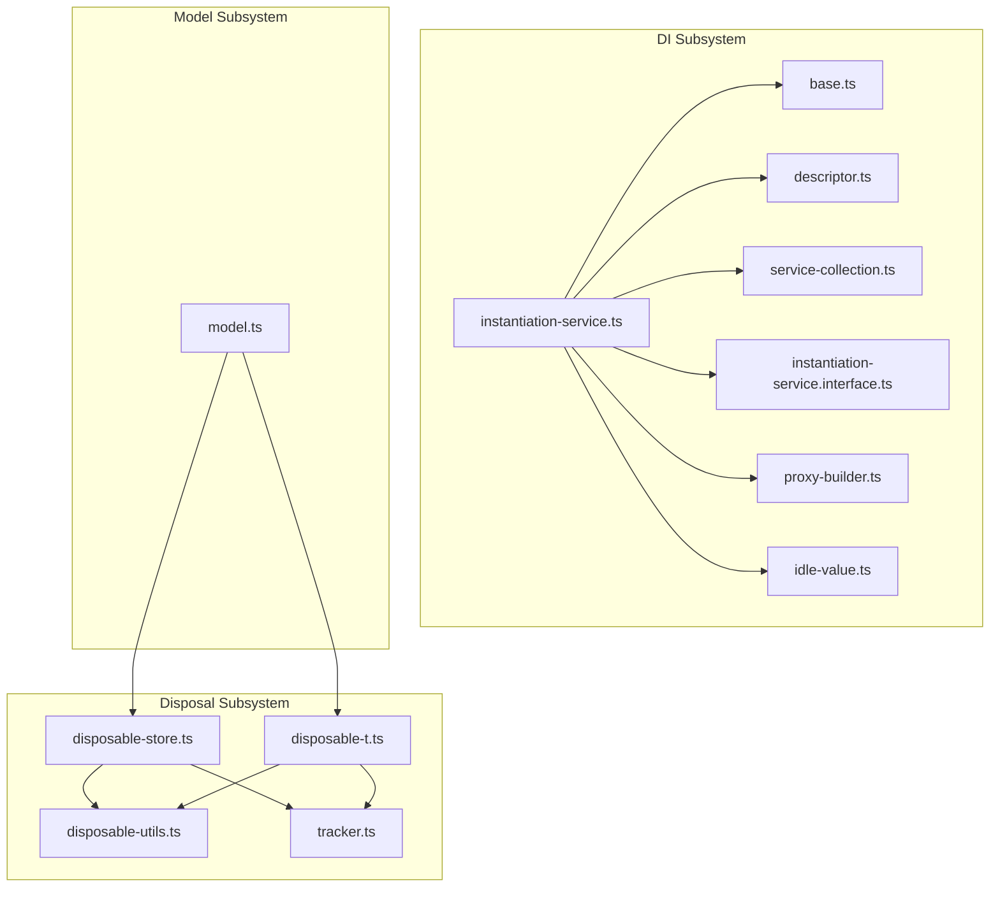
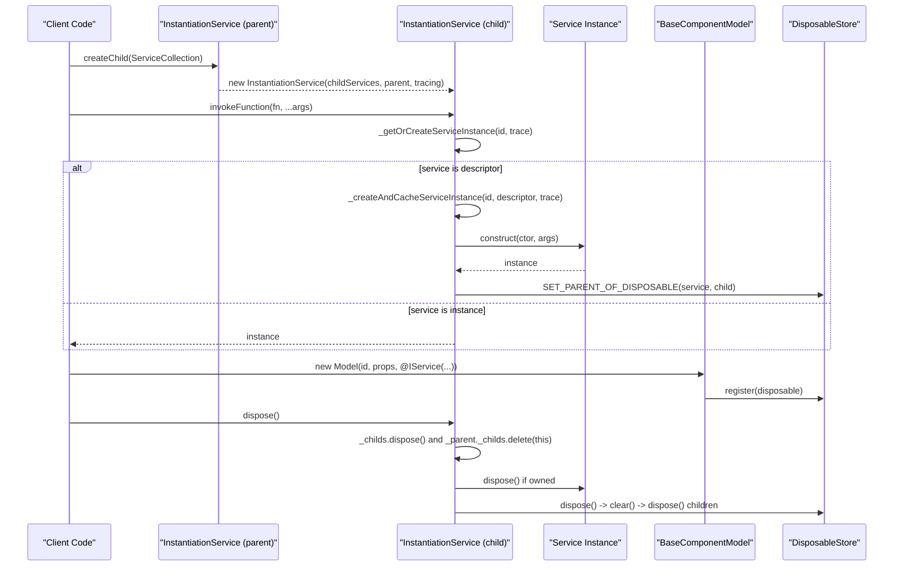
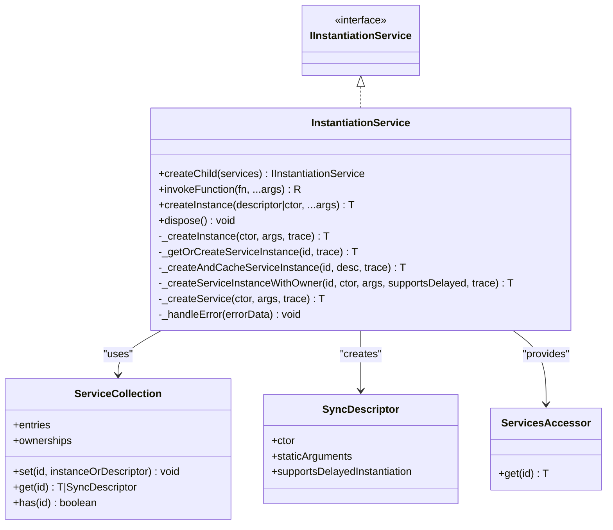
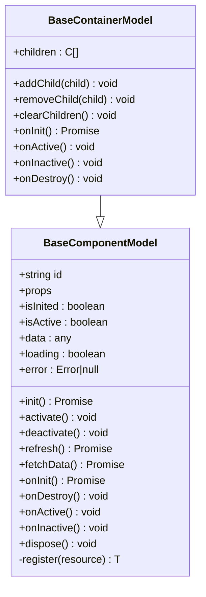
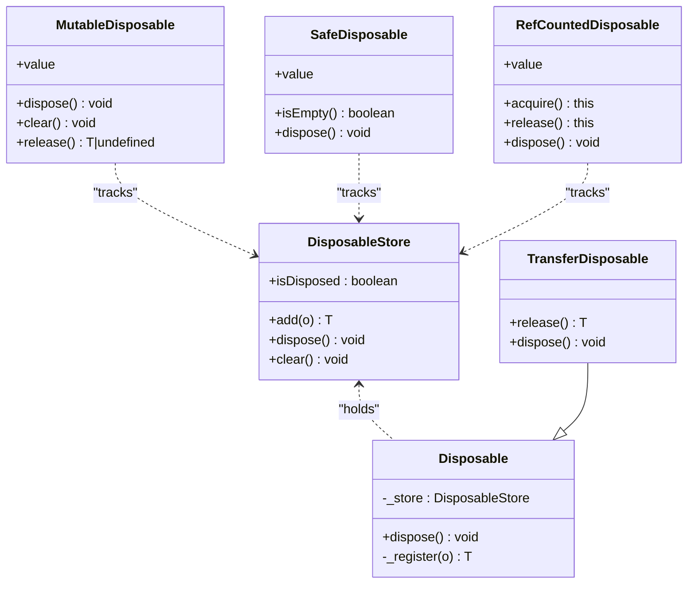
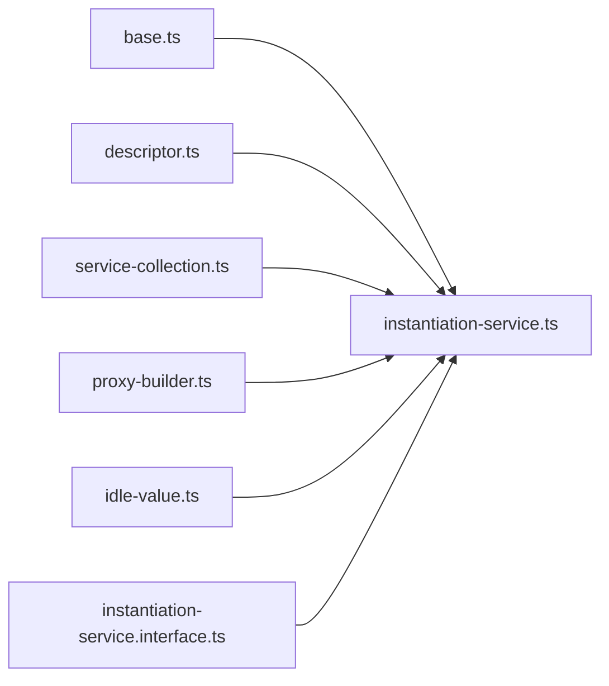

# Kernel Layer

<cite>
**Referenced Files in This Document**
- [instantiation-service.ts](file://packages/h5-builder/src/bedrock/di/instantiation-service.ts)
- [base.ts](file://packages/h5-builder/src/bedrock/di/base.ts)
- [descriptor.ts](file://packages/h5-builder/src/bedrock/di/descriptor.ts)
- [service-collection.ts](file://packages/h5-builder/src/bedrock/di/service-collection.ts)
- [instantiation-service.interface.ts](file://packages/h5-builder/src/bedrock/di/instantiation-service.interface.ts)
- [proxy-builder.ts](file://packages/h5-builder/src/bedrock/di/proxy-builder.ts)
- [idle-value.ts](file://packages/h5-builder/src/bedrock/di/idle-value.ts)
- [model.ts](file://packages/h5-builder/src/bedrock/model.ts)
- [disposable-store.ts](file://packages/h5-builder/src/bedrock/dispose/disposable-store.ts)
- [disposable-t.ts](file://packages/h5-builder/src/bedrock/dispose/disposable-t.ts)
- [disposable-utils.ts](file://packages/h5-builder/src/bedrock/dispose/disposable-utils.ts)
- [tracker.ts](file://packages/h5-builder/src/bedrock/dispose/tracker.ts)
- [product-card.model.ts](file://packages/h5-builder/src/components/product-card/product-card.model.ts)
- [service-identifiers.ts](file://packages/h5-builder/src/services/service-identifiers.ts)
</cite>

## Table of Contents
1. [Introduction](#introduction)
2. [Project Structure](#project-structure)
3. [Core Components](#core-components)
4. [Architecture Overview](#architecture-overview)
5. [Detailed Component Analysis](#detailed-component-analysis)
6. [Dependency Analysis](#dependency-analysis)
7. [Performance Considerations](#performance-considerations)
8. [Troubleshooting Guide](#troubleshooting-guide)
9. [Conclusion](#conclusion)

## Introduction
This document describes the Kernel Layer of the H5 Builder Framework. It serves as the foundational layer that provides:
- Core abstractions for dependency injection via the InstantiationService
- Model management with reactive state and lifecycle hooks
- Resource disposal and memory leak prevention via DisposableStore and related utilities

The Kernel Layer ensures predictable initialization, robust error handling, and clean resource management across the framework’s components and services.

## Project Structure
The Kernel Layer spans two primary subsystems:
- Dependency Injection (DI) subsystem under bedrock/di
- Model and disposal subsystem under bedrock/model and bedrock/dispose

**Diagram sources**
- [instantiation-service.ts](file://packages/h5-builder/src/bedrock/di/instantiation-service.ts#L1-L468)
- [base.ts](file://packages/h5-builder/src/bedrock/di/base.ts#L1-L74)
- [descriptor.ts](file://packages/h5-builder/src/bedrock/di/descriptor.ts#L1-L32)
- [service-collection.ts](file://packages/h5-builder/src/bedrock/di/service-collection.ts#L1-L47)
- [instantiation-service.interface.ts](file://packages/h5-builder/src/bedrock/di/instantiation-service.interface.ts#L1-L47)
- [proxy-builder.ts](file://packages/h5-builder/src/bedrock/di/proxy-builder.ts#L1-L39)
- [idle-value.ts](file://packages/h5-builder/src/bedrock/di/idle-value.ts#L1-L64)
- [model.ts](file://packages/h5-builder/src/bedrock/model.ts#L1-L243)
- [disposable-store.ts](file://packages/h5-builder/src/bedrock/dispose/disposable-store.ts#L1-L84)
- [disposable-t.ts](file://packages/h5-builder/src/bedrock/dispose/disposable-t.ts#L1-L239)
- [disposable-utils.ts](file://packages/h5-builder/src/bedrock/dispose/disposable-utils.ts#L1-L29)
- [tracker.ts](file://packages/h5-builder/src/bedrock/dispose/tracker.ts#L1-L106)

**Section sources**
- [instantiation-service.ts](file://packages/h5-builder/src/bedrock/di/instantiation-service.ts#L1-L120)
- [model.ts](file://packages/h5-builder/src/bedrock/model.ts#L1-L60)
- [disposable-store.ts](file://packages/h5-builder/src/bedrock/dispose/disposable-store.ts#L1-L40)

## Core Components
- InstantiationService: Central DI container enabling service registration, resolution, and lifecycle management with support for child injectors and error propagation.
- BaseComponentModel and BaseContainerModel: Model base classes implementing Model-View separation with reactive state via mobx-vue-lite and lifecycle hooks.
- DisposableStore and Disposable family: Automated resource cleanup and memory leak prevention with parent-child tracking and safe disposal patterns.

**Section sources**
- [instantiation-service.ts](file://packages/h5-builder/src/bedrock/di/instantiation-service.ts#L111-L214)
- [model.ts](file://packages/h5-builder/src/bedrock/model.ts#L1-L155)
- [disposable-store.ts](file://packages/h5-builder/src/bedrock/dispose/disposable-store.ts#L1-L84)

## Architecture Overview
The Kernel Layer orchestrates DI, models, and disposal as follows:
- DI resolves services via decorators and descriptors, supports delayed instantiation, and propagates errors to the top-level container.
- Models encapsulate reactive state and lifecycle hooks; containers coordinate child models.
- DisposableStore and related utilities ensure automatic cleanup and leak detection.

**Diagram sources**
- [instantiation-service.ts](file://packages/h5-builder/src/bedrock/di/instantiation-service.ts#L111-L214)
- [proxy-builder.ts](file://packages/h5-builder/src/bedrock/di/proxy-builder.ts#L1-L39)
- [disposable-store.ts](file://packages/h5-builder/src/bedrock/dispose/disposable-store.ts#L1-L84)
- [model.ts](file://packages/h5-builder/src/bedrock/model.ts#L1-L155)

## Detailed Component Analysis

### Dependency Injection: InstantiationService
The DI system centers around InstantiationService, which:
- Registers services via ServiceCollection and descriptors
- Resolves services through decorators and dependency metadata
- Supports child injectors with inheritance and error propagation
- Implements delayed instantiation via IdleValue and proxies
- Enforces cycle detection and recursive instantiation guards
- Emits errors to the top-level container and throws standardized errors

Key capabilities:
- Service registration and resolution
- Child injector creation and inheritance
- Delayed instantiation with IdleValue and proxy wrapping
- Error handling and tracing
- Lifecycle disposal of owned services

**Diagram sources**
- [instantiation-service.ts](file://packages/h5-builder/src/bedrock/di/instantiation-service.ts#L111-L214)
- [service-collection.ts](file://packages/h5-builder/src/bedrock/di/service-collection.ts#L1-L47)
- [descriptor.ts](file://packages/h5-builder/src/bedrock/di/descriptor.ts#L1-L32)
- [instantiation-service.interface.ts](file://packages/h5-builder/src/bedrock/di/instantiation-service.interface.ts#L1-L47)

**Section sources**
- [instantiation-service.ts](file://packages/h5-builder/src/bedrock/di/instantiation-service.ts#L111-L214)
- [base.ts](file://packages/h5-builder/src/bedrock/di/base.ts#L1-L74)
- [descriptor.ts](file://packages/h5-builder/src/bedrock/di/descriptor.ts#L1-L32)
- [service-collection.ts](file://packages/h5-builder/src/bedrock/di/service-collection.ts#L1-L47)
- [instantiation-service.interface.ts](file://packages/h5-builder/src/bedrock/di/instantiation-service.interface.ts#L1-L47)
- [proxy-builder.ts](file://packages/h5-builder/src/bedrock/di/proxy-builder.ts#L1-L39)
- [idle-value.ts](file://packages/h5-builder/src/bedrock/di/idle-value.ts#L1-L64)

### Decorators and Service Identifiers
- ServiceIdentifier is created via createDecorator and attached to constructor parameters via DI_TARGET/DI_DEPENDENCIES metadata.
- getServiceDependencies reads dependency metadata from constructors.
- Service identifiers are declared in service-identifiers.ts and used with @decorator in constructors.

Practical usage example:
- A component model constructor receives services via @IServiceIdentifier parameters, enabling DI resolution.

**Section sources**
- [base.ts](file://packages/h5-builder/src/bedrock/di/base.ts#L1-L74)
- [service-identifiers.ts](file://packages/h5-builder/src/services/service-identifiers.ts#L1-L20)
- [product-card.model.ts](file://packages/h5-builder/src/components/product-card/product-card.model.ts#L1-L60)

### Model Management: BaseComponentModel and BaseContainerModel
These classes implement the Model-View separation pattern with reactive state management:
- Reactive state: isInited, isActive, data, loading, error
- Lifecycle hooks: onInit, onActive, onInactive, onDestroy
- Data fetching and refresh with loading/error state management
- Container model coordination: addChild/removeChild/clearChildren and default container lifecycle delegation

**Diagram sources**
- [model.ts](file://packages/h5-builder/src/bedrock/model.ts#L1-L243)

**Section sources**
- [model.ts](file://packages/h5-builder/src/bedrock/model.ts#L1-L155)
- [model.ts](file://packages/h5-builder/src/bedrock/model.ts#L156-L243)

### Resource Disposal: DisposableStore and Utilities
DisposableStore centralizes resource cleanup with:
- LIFO disposal order for deterministic teardown
- Aggregated error reporting via AggregateError
- Parent-child tracking to ensure nested disposables are managed
- Safety checks against duplicate disposal and self-registration

Related utilities:
- Disposable base class integrates DisposableStore and parent assignment
- MutableDisposable, SafeDisposable, RefCountedDisposable, TransferDisposable provide specialized disposal patterns
- Tracker utilities enable leak detection and logging

**Diagram sources**
- [disposable-store.ts](file://packages/h5-builder/src/bedrock/dispose/disposable-store.ts#L1-L84)
- [disposable-t.ts](file://packages/h5-builder/src/bedrock/dispose/disposable-t.ts#L1-L239)
- [tracker.ts](file://packages/h5-builder/src/bedrock/dispose/tracker.ts#L1-L106)

**Section sources**
- [disposable-store.ts](file://packages/h5-builder/src/bedrock/dispose/disposable-store.ts#L1-L84)
- [disposable-t.ts](file://packages/h5-builder/src/bedrock/dispose/disposable-t.ts#L1-L120)
- [disposable-utils.ts](file://packages/h5-builder/src/bedrock/dispose/disposable-utils.ts#L1-L29)
- [tracker.ts](file://packages/h5-builder/src/bedrock/dispose/tracker.ts#L1-L106)

### Example: Component Using @Inject Decorators
A component model demonstrates dependency resolution via decorators:
- Constructor parameters decorated with service identifiers receive injected services
- The model uses reactive state and lifecycle hooks to manage data and events

**Section sources**
- [product-card.model.ts](file://packages/h5-builder/src/components/product-card/product-card.model.ts#L1-L60)
- [service-identifiers.ts](file://packages/h5-builder/src/services/service-identifiers.ts#L1-L20)
- [base.ts](file://packages/h5-builder/src/bedrock/di/base.ts#L1-L74)

### Example: Model State and Lifecycle Hooks
The model base classes provide:
- Reactive state fields (data, loading, error)
- Lifecycle orchestration (init, activate/deactivate, destroy)
- Data refresh with error handling

**Section sources**
- [model.ts](file://packages/h5-builder/src/bedrock/model.ts#L1-L155)

### Example: Disposable Resources Registration and Cleanup
Components and services can register resources with the model’s DisposableStore:
- Register functions or IDisposable objects
- Automatic cleanup on model dispose
- Parent-child tracking ensures nested resources are released deterministically

**Section sources**
- [model.ts](file://packages/h5-builder/src/bedrock/model.ts#L1-L120)
- [disposable-store.ts](file://packages/h5-builder/src/bedrock/dispose/disposable-store.ts#L1-L84)

## Dependency Analysis
The DI subsystem composes several cohesive modules:
- base.ts defines decorators and dependency metadata
- descriptor.ts provides SyncDescriptor for service construction
- service-collection.ts manages service entries and ownership
- instantiation-service.ts orchestrates creation, caching, and disposal
- proxy-builder.ts and idle-value.ts enable delayed instantiation

**Diagram sources**
- [base.ts](file://packages/h5-builder/src/bedrock/di/base.ts#L1-L74)
- [descriptor.ts](file://packages/h5-builder/src/bedrock/di/descriptor.ts#L1-L32)
- [service-collection.ts](file://packages/h5-builder/src/bedrock/di/service-collection.ts#L1-L47)
- [instantiation-service.ts](file://packages/h5-builder/src/bedrock/di/instantiation-service.ts#L1-L120)
- [proxy-builder.ts](file://packages/h5-builder/src/bedrock/di/proxy-builder.ts#L1-L39)
- [idle-value.ts](file://packages/h5-builder/src/bedrock/di/idle-value.ts#L1-L64)
- [instantiation-service.interface.ts](file://packages/h5-builder/src/bedrock/di/instantiation-service.interface.ts#L1-L47)

**Section sources**
- [instantiation-service.ts](file://packages/h5-builder/src/bedrock/di/instantiation-service.ts#L1-L120)
- [base.ts](file://packages/h5-builder/src/bedrock/di/base.ts#L1-L74)
- [descriptor.ts](file://packages/h5-builder/src/bedrock/di/descriptor.ts#L1-L32)
- [service-collection.ts](file://packages/h5-builder/src/bedrock/di/service-collection.ts#L1-L47)
- [proxy-builder.ts](file://packages/h5-builder/src/bedrock/di/proxy-builder.ts#L1-L39)
- [idle-value.ts](file://packages/h5-builder/src/bedrock/di/idle-value.ts#L1-L64)
- [instantiation-service.interface.ts](file://packages/h5-builder/src/bedrock/di/instantiation-service.interface.ts#L1-L47)

## Performance Considerations
- Delayed instantiation: IdleValue defers expensive service creation until first access, reducing initial load overhead.
- Proxy-based lazy services: makeProxy binds property access lazily, avoiding unnecessary work until properties are accessed.
- Tracing and diagnostics: Optional tracing can help identify slow or problematic service creation paths.
- Disposal ordering: LIFO disposal in DisposableStore ensures timely cleanup of dependent resources.

[No sources needed since this section provides general guidance]

## Troubleshooting Guide
Common issues and resolutions:
- Unknown dependency errors: Thrown when a service dependency is not registered; the error bubbles to the top-level container and is also thrown locally.
- Cyclic dependency detection: The DI system detects cycles and throws a CyclicDependencyError with diagnostic information.
- Recursive instantiation guard: Prevents infinite recursion during service creation.
- Duplicate disposal warnings: Attempting to add a disposable to a disposed store logs a warning; ensure disposal order is correct.
- Leak detection: Tracker utilities log potential leaks and mark disposables to aid debugging.

**Section sources**
- [instantiation-service.ts](file://packages/h5-builder/src/bedrock/di/instantiation-service.ts#L21-L60)
- [instantiation-service.ts](file://packages/h5-builder/src/bedrock/di/instantiation-service.ts#L288-L396)
- [disposable-store.ts](file://packages/h5-builder/src/bedrock/dispose/disposable-store.ts#L20-L40)
- [tracker.ts](file://packages/h5-builder/src/bedrock/dispose/tracker.ts#L1-L106)

## Conclusion
The Kernel Layer establishes a robust foundation for the H5 Builder Framework:
- The DI system provides flexible, traceable, and safe service management with child injectors and error handling.
- Models offer reactive state and lifecycle hooks, enabling declarative component behavior.
- The disposal subsystem prevents memory leaks and ensures deterministic cleanup through DisposableStore and related utilities.

Together, these components deliver a scalable, maintainable, and predictable architecture for building interactive H5 experiences.