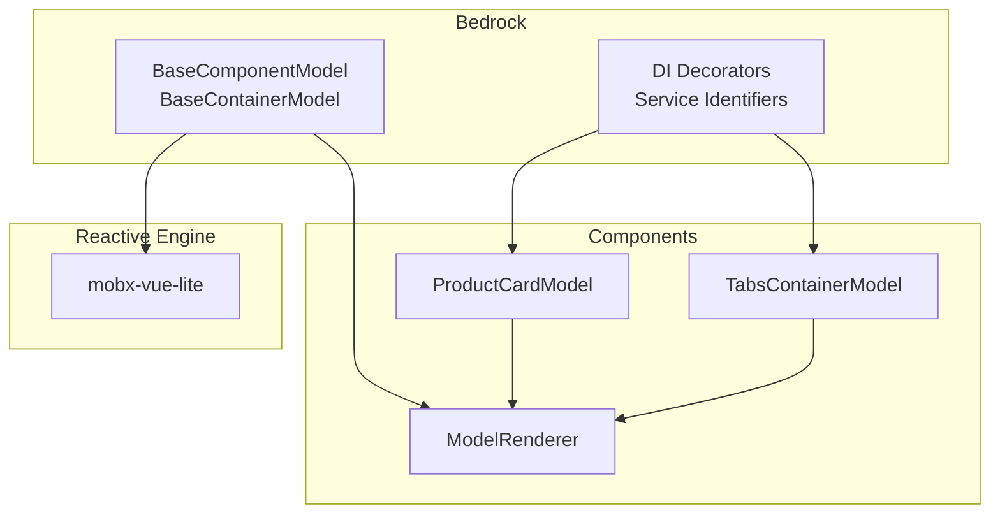
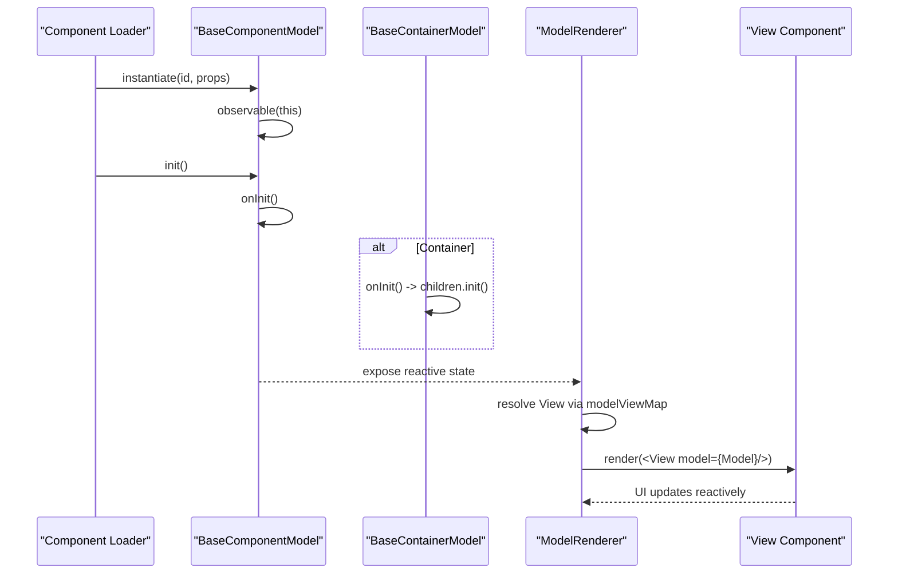
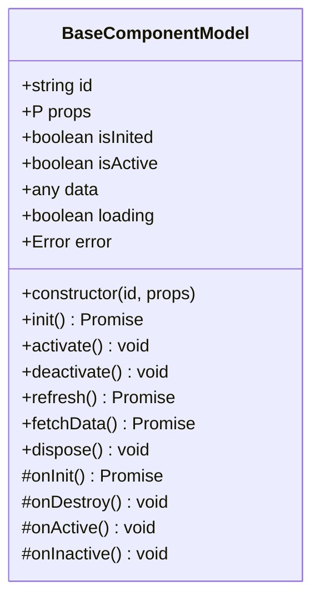
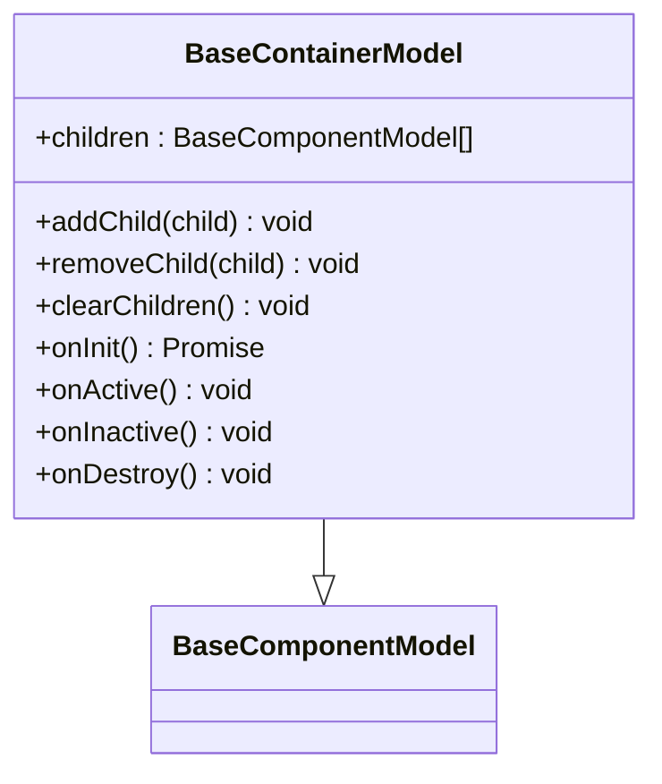
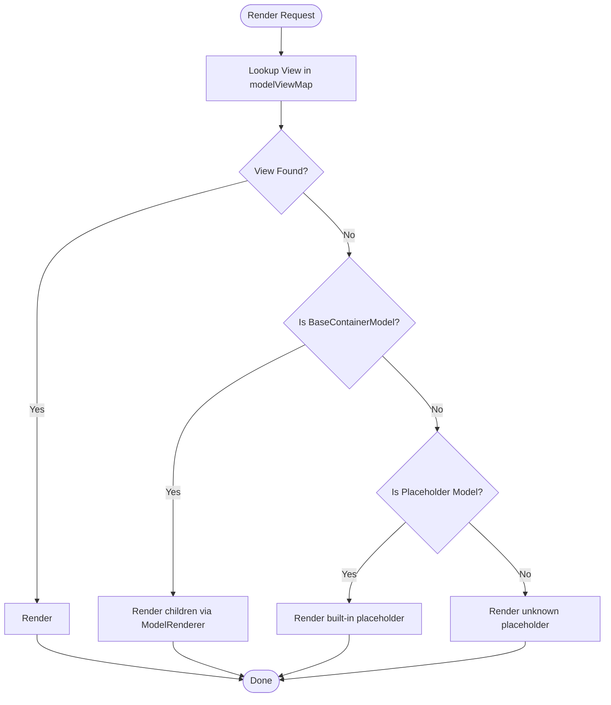
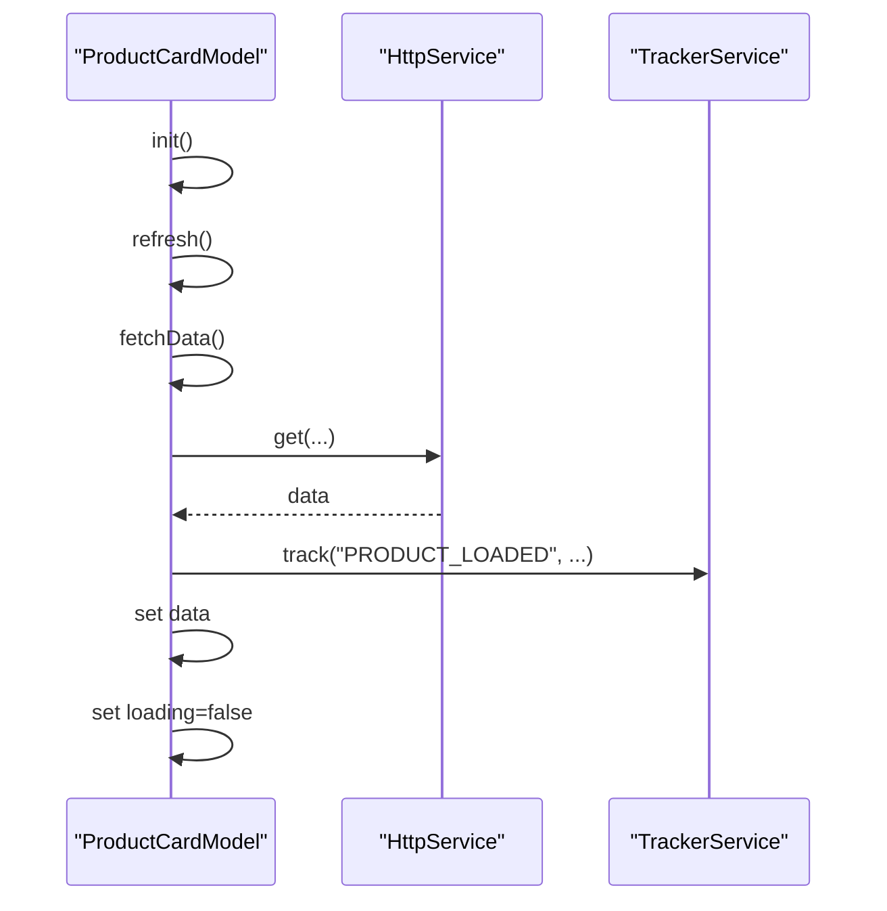
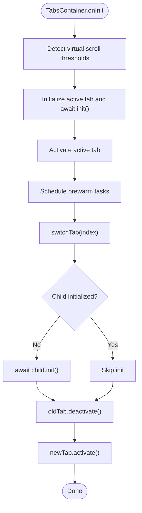
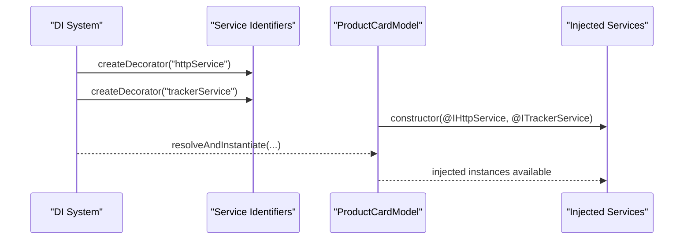
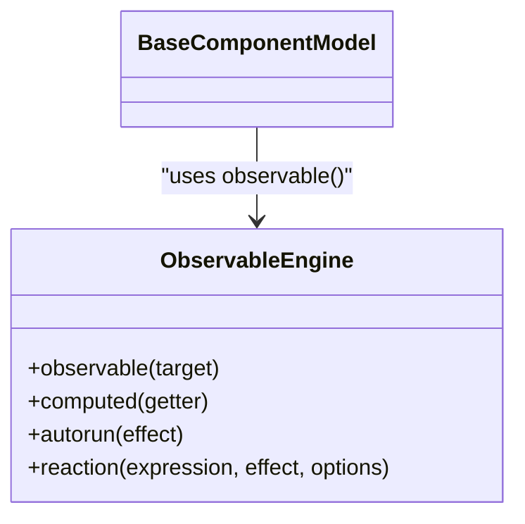
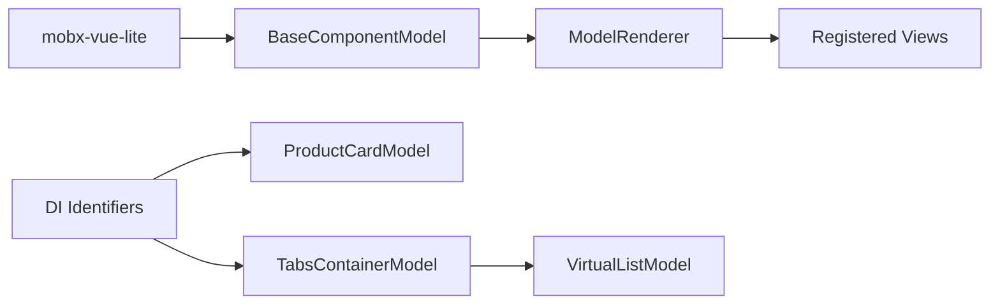

# Model System

<cite>
**Referenced Files in This Document**
- [model.ts](file://packages/h5-builder/src/bedrock/model.ts)
- [model-renderer.tsx](file://packages/h5-builder/src/components/model-renderer.tsx)
- [component_development_guide.md](file://packages/h5-builder/docs/component_development_guide.md)
- [product-card.model.ts](file://packages/h5-builder/src/components/product-card/product-card.model.ts)
- [tabs-container.model.ts](file://packages/h5-builder/src/components/tabs-container/tabs-container.model.ts)
- [lifecycle.ts](file://packages/h5-builder/src/jobs/lifecycle.ts)
- [base.ts](file://packages/h5-builder/src/bedrock/di/base.ts)
- [service-identifiers.ts](file://packages/h5-builder/src/services/service-identifiers.ts)
- [index.ts](file://packages/mobx-vue-lite/src/index.ts)
- [mobx.ts](file://packages/mobx-vue-lite/src/mobx.ts)
- [index.ts](file://packages/h5-builder/src/components/product-card/index.ts)
- [index.ts](file://packages/h5-builder/src/components/tabs-container/index.ts)
</cite>

## Table of Contents
1. [Introduction](#introduction)
2. [Project Structure](#project-structure)
3. [Core Components](#core-components)
4. [Architecture Overview](#architecture-overview)
5. [Detailed Component Analysis](#detailed-component-analysis)
6. [Dependency Analysis](#dependency-analysis)
7. [Performance Considerations](#performance-considerations)
8. [Troubleshooting Guide](#troubleshooting-guide)
9. [Conclusion](#conclusion)
10. [Appendices](#appendices)

## Introduction
This document explains the Model System used in the H5 Builder framework. It focuses on the BaseComponentModel and BaseContainerModel classes that implement the Model-View separation pattern. It documents lifecycle methods (init/onInit, activate/onActive, etc.), how they coordinate with the rendering system, and how models relate to views through the ModelRenderer component. It also covers dependency injection, reactive state management with mobx-vue-lite, and best practices for building robust, maintainable components.

## Project Structure
The Model System spans several areas:
- Core model abstractions live under the bedrock module.
- Renderer and mapping logic for models to views resides in the components folder.
- Example models demonstrate real-world usage patterns.
- The DI system enables dependency injection with service identifiers.
- The reactive engine is provided by mobx-vue-lite.

**Diagram sources**
- [model.ts](file://packages/h5-builder/src/bedrock/model.ts#L1-L243)
- [model-renderer.tsx](file://packages/h5-builder/src/components/model-renderer.tsx#L1-L105)
- [product-card.model.ts](file://packages/h5-builder/src/components/product-card/product-card.model.ts#L1-L133)
- [tabs-container.model.ts](file://packages/h5-builder/src/components/tabs-container/tabs-container.model.ts#L1-L273)
- [base.ts](file://packages/h5-builder/src/bedrock/di/base.ts#L1-L74)
- [service-identifiers.ts](file://packages/h5-builder/src/services/service-identifiers.ts#L1-L20)
- [mobx.ts](file://packages/mobx-vue-lite/src/mobx.ts#L1-L65)

**Section sources**
- [model.ts](file://packages/h5-builder/src/bedrock/model.ts#L1-L243)
- [model-renderer.tsx](file://packages/h5-builder/src/components/model-renderer.tsx#L1-L105)
- [product-card.model.ts](file://packages/h5-builder/src/components/product-card/product-card.model.ts#L1-L133)
- [tabs-container.model.ts](file://packages/h5-builder/src/components/tabs-container/tabs-container.model.ts#L1-L273)
- [base.ts](file://packages/h5-builder/src/bedrock/di/base.ts#L1-L74)
- [service-identifiers.ts](file://packages/h5-builder/src/services/service-identifiers.ts#L1-L20)
- [mobx.ts](file://packages/mobx-vue-lite/src/mobx.ts#L1-L65)

## Core Components
- BaseComponentModel: The foundational class for all component models. It provides lifecycle hooks, reactive state, and resource cleanup.
- BaseContainerModel: Extends BaseComponentModel to manage child models, delegating lifecycle operations to children by default.

Key responsibilities:
- Lifecycle orchestration: init, activate, deactivate, dispose.
- Reactive state: loading, error, data, and custom properties.
- Resource registration and automatic cleanup.
- Data fetching abstraction via refresh and fetchData.

**Section sources**
- [model.ts](file://packages/h5-builder/src/bedrock/model.ts#L10-L155)
- [model.ts](file://packages/h5-builder/src/bedrock/model.ts#L157-L243)

## Architecture Overview
The Model-View separation is enforced by:
- Models encapsulate business logic and state.
- Views are pure UI components that receive a model via props and render based on its reactive state.
- ModelRenderer maps a model instance to a registered view component, or renders placeholders for special model types.

**Diagram sources**
- [model.ts](file://packages/h5-builder/src/bedrock/model.ts#L10-L155)
- [model.ts](file://packages/h5-builder/src/bedrock/model.ts#L157-L243)
- [model-renderer.tsx](file://packages/h5-builder/src/components/model-renderer.tsx#L1-L105)

## Detailed Component Analysis

### BaseComponentModel
Responsibilities:
- Reactive state: isInited, isActive, data, loading, error.
- Lifecycle: init, activate, deactivate, dispose.
- Data fetching: refresh and fetchData.
- Resource management: register and automatic disposal.

Lifecycle flow:
- init ensures onInit runs once and sets isInited.
- activate/deactivate toggle isActive and call onActive/onInactive.
- dispose triggers onDestroy and cleans up registered resources.

**Diagram sources**
- [model.ts](file://packages/h5-builder/src/bedrock/model.ts#L10-L155)

**Section sources**
- [model.ts](file://packages/h5-builder/src/bedrock/model.ts#L10-L155)

### BaseContainerModel
Responsibilities:
- Manages a collection of child models.
- Default delegation of lifecycle to children: onInit initializes all children in parallel, onActive activates all, onInactive deactivates all.
- Provides addChild/removeChild/clearChildren helpers.
- Automatic disposal of children via register.

**Diagram sources**
- [model.ts](file://packages/h5-builder/src/bedrock/model.ts#L157-L243)

**Section sources**
- [model.ts](file://packages/h5-builder/src/bedrock/model.ts#L157-L243)

### ModelRenderer and Model-View Mapping
ModelRenderer:
- Maintains a registry of ModelClass to ViewComponent mappings.
- Renders the mapped view when available.
- Handles placeholder models (error/loading/empty).
- Recursively renders container children when no view is registered.

**Diagram sources**
- [model-renderer.tsx](file://packages/h5-builder/src/components/model-renderer.tsx#L1-L105)

**Section sources**
- [model-renderer.tsx](file://packages/h5-builder/src/components/model-renderer.tsx#L1-L105)

### Example: ProductCardModel
- Demonstrates reactive state (loading, error, data), dependency injection via service identifiers, and lifecycle hooks.
- Implements refresh and fetchData to update reactive state.
- Uses onActive for analytics exposure tracking.

**Diagram sources**
- [product-card.model.ts](file://packages/h5-builder/src/components/product-card/product-card.model.ts#L1-L133)

**Section sources**
- [product-card.model.ts](file://packages/h5-builder/src/components/product-card/product-card.model.ts#L1-L133)

### Example: TabsContainerModel
- Extends BaseContainerModel to implement custom lifecycle behavior.
- Initializes only the active tab on first load and lazily initializes others.
- Pre-warms neighboring tabs and applies virtual scrolling optimization when thresholds are met.

**Diagram sources**
- [tabs-container.model.ts](file://packages/h5-builder/src/components/tabs-container/tabs-container.model.ts#L1-L273)

**Section sources**
- [tabs-container.model.ts](file://packages/h5-builder/src/components/tabs-container/tabs-container.model.ts#L1-L273)

### Dependency Injection and Service Identifiers
- Service identifiers are created via decorators and stored globally.
- Models can declare dependencies using these identifiers in their constructors.
- The DI system records constructor dependencies and resolves instances accordingly.

**Diagram sources**
- [base.ts](file://packages/h5-builder/src/bedrock/di/base.ts#L1-L74)
- [service-identifiers.ts](file://packages/h5-builder/src/services/service-identifiers.ts#L1-L20)
- [product-card.model.ts](file://packages/h5-builder/src/components/product-card/product-card.model.ts#L1-L133)

**Section sources**
- [base.ts](file://packages/h5-builder/src/bedrock/di/base.ts#L1-L74)
- [service-identifiers.ts](file://packages/h5-builder/src/services/service-identifiers.ts#L1-L20)
- [product-card.model.ts](file://packages/h5-builder/src/components/product-card/product-card.model.ts#L1-L133)

### Reactive State Management with mobx-vue-lite
- BaseComponentModel wraps itself with observable to make all properties reactive.
- mobx-vue-lite provides observable, computed, autorun, and related APIs.
- Views observe model state and re-render only when observed properties change.

**Diagram sources**
- [model.ts](file://packages/h5-builder/src/bedrock/model.ts#L1-L26)
- [mobx.ts](file://packages/mobx-vue-lite/src/mobx.ts#L1-L65)

**Section sources**
- [model.ts](file://packages/h5-builder/src/bedrock/model.ts#L1-L26)
- [mobx.ts](file://packages/mobx-vue-lite/src/mobx.ts#L1-L65)

## Dependency Analysis
- Models depend on mobx-vue-lite for reactivity.
- Models depend on injected services via DI identifiers.
- ModelRenderer depends on model-view mappings and container children.
- TabsContainerModel depends on VirtualListModel for performance optimization.

**Diagram sources**
- [model.ts](file://packages/h5-builder/src/bedrock/model.ts#L1-L243)
- [model-renderer.tsx](file://packages/h5-builder/src/components/model-renderer.tsx#L1-L105)
- [service-identifiers.ts](file://packages/h5-builder/src/services/service-identifiers.ts#L1-L20)
- [tabs-container.model.ts](file://packages/h5-builder/src/components/tabs-container/tabs-container.model.ts#L1-L273)

**Section sources**
- [model.ts](file://packages/h5-builder/src/bedrock/model.ts#L1-L243)
- [model-renderer.tsx](file://packages/h5-builder/src/components/model-renderer.tsx#L1-L105)
- [service-identifiers.ts](file://packages/h5-builder/src/services/service-identifiers.ts#L1-L20)
- [tabs-container.model.ts](file://packages/h5-builder/src/components/tabs-container/tabs-container.model.ts#L1-L273)

## Performance Considerations
- Prefer lazy initialization and activation for heavy containers (e.g., TabsContainer).
- Use refresh and fetchData to centralize data loading and error handling.
- Register timers and subscriptions so they are automatically cleaned up on dispose.
- For large lists inside containers, enable virtual scrolling when thresholds are exceeded.

[No sources needed since this section provides general guidance]

## Troubleshooting Guide
Common issues and resolutions:
- State not updating: Ensure reactive properties are declared directly on the model class.
- Memory leaks: Always register cleanup functions for timers and subscriptions.
- Lifecycle order: Initialize parent models before children; ensure awaited promises are properly chained.
- DI failures: Verify service identifiers and that services are registered before resolving models.

**Section sources**
- [component_development_guide.md](file://packages/h5-builder/docs/component_development_guide.md#L453-L496)
- [model.ts](file://packages/h5-builder/src/bedrock/model.ts#L10-L155)
- [tabs-container.model.ts](file://packages/h5-builder/src/components/tabs-container/tabs-container.model.ts#L1-L273)

## Conclusion
The Model System cleanly separates business logic from UI rendering. BaseComponentModel and BaseContainerModel provide a robust foundation for lifecycle management, reactive state, and resource cleanup. ModelRenderer bridges models to views, while DI and service identifiers enable clean dependency management. Following the patterns shown in the examples and the development guide leads to scalable, maintainable components.

[No sources needed since this section summarizes without analyzing specific files]

## Appendices

### Lifecycle Reference
- init: Ensures onInit runs once and sets isInited.
- onInit: Override to perform initialization tasks (e.g., data loading).
- activate/deactivate: Toggle isActive and call onActive/onInactive.
- refresh/fetchData: Centralized data fetching with loading/error state.
- dispose: Calls onDestroy and disposes registered resources.

**Section sources**
- [model.ts](file://packages/h5-builder/src/bedrock/model.ts#L60-L155)

### Rendering Pipeline
- ModelRenderer resolves a view for a given model.
- If no view is registered, it falls back to placeholder rendering or recursive rendering for containers.
- Container children are rendered by iterating over model.children.

**Section sources**
- [model-renderer.tsx](file://packages/h5-builder/src/components/model-renderer.tsx#L1-L105)

### Example Registration Patterns
- Register model-view pairs for custom components.
- Register default mappings for built-in models.

**Section sources**
- [model-renderer.tsx](file://packages/h5-builder/src/components/model-renderer.tsx#L1-L105)

### Page Lifecycle Integration
- The page lifecycle defines stages from open to idle, guiding progressive rendering and resource scheduling.

**Section sources**
- [lifecycle.ts](file://packages/h5-builder/src/jobs/lifecycle.ts#L1-L18)