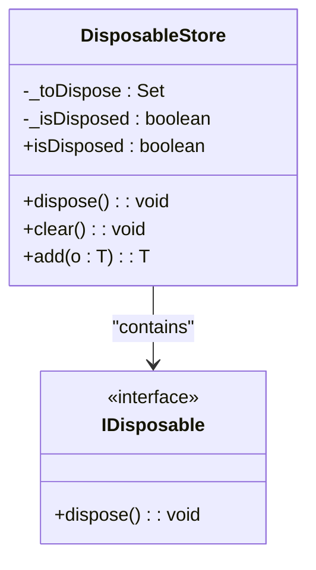
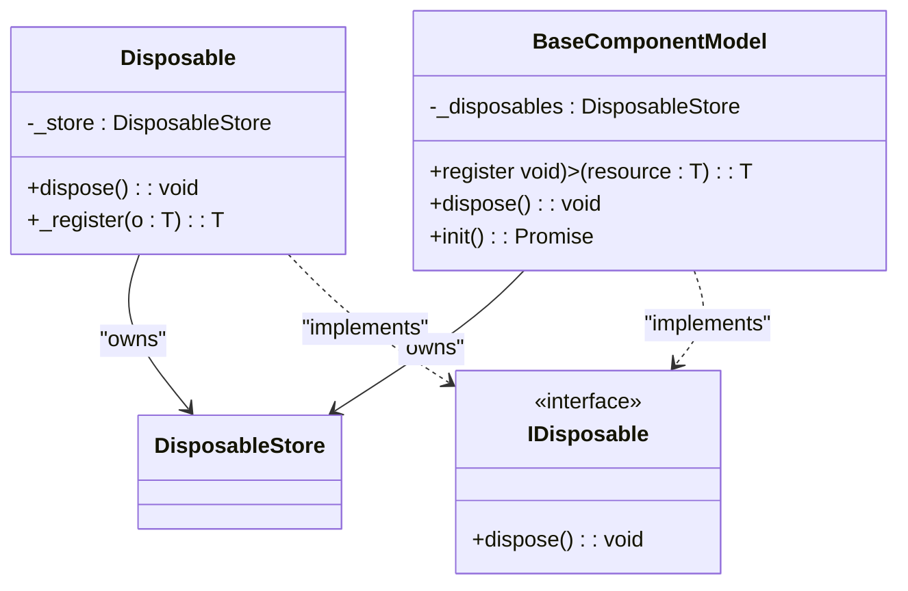
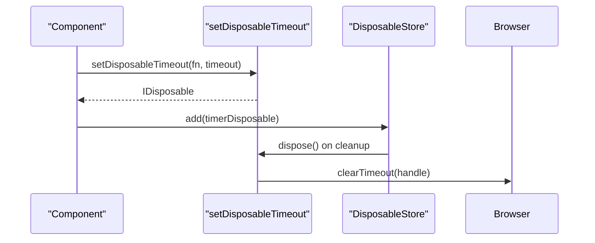
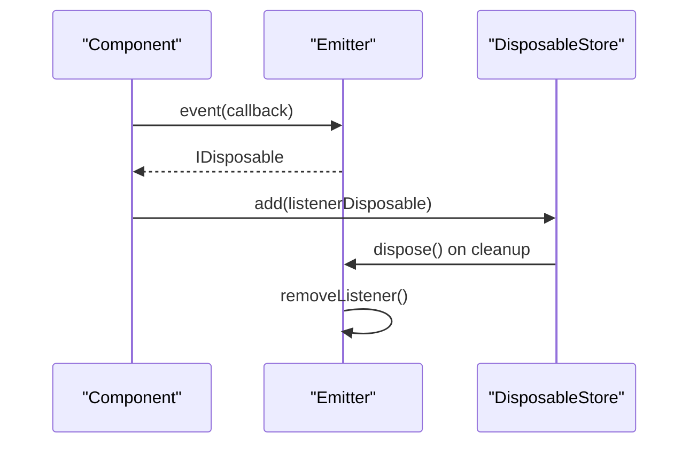
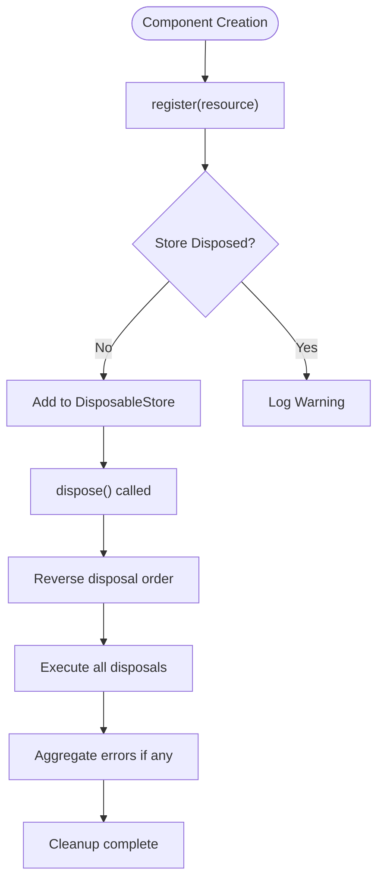
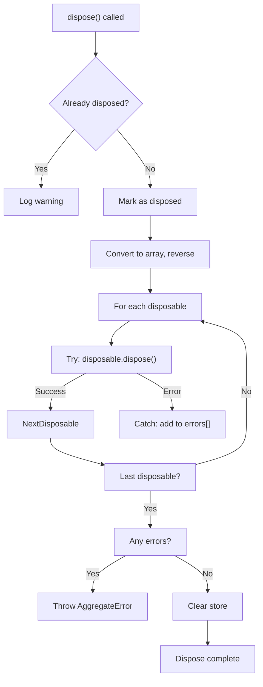
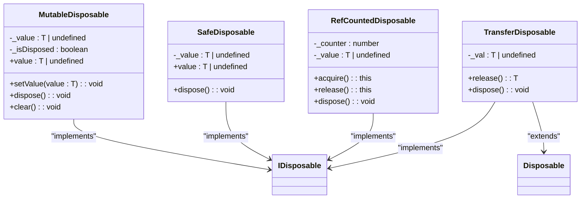

# Resource Management

<cite>
**Referenced Files in This Document**   
- [disposable-store.ts](file://packages/h5-builder/src/bedrock/dispose/disposable-store.ts)
- [disposable-t.ts](file://packages/h5-builder/src/bedrock/dispose/disposable-t.ts)
- [dispose-base.ts](file://packages/h5-builder/src/bedrock/dispose/dispose-base.ts)
- [disposable-utils.ts](file://packages/h5-builder/src/bedrock/dispose/disposable-utils.ts)
- [timer.ts](file://packages/h5-builder/src/bedrock/dispose/timer.ts)
- [tracker.ts](file://packages/h5-builder/src/bedrock/dispose/tracker.ts)
- [emitter.ts](file://packages/h5-builder/src/bedrock/event/emitter.ts)
- [model.ts](file://packages/h5-builder/src/bedrock/model.ts)
</cite>

## Table of Contents
1. [Introduction](#introduction)
2. [DisposableStore Mechanism](#disposablestore-mechanism)
3. [IDisposable Interface and Lifecycle Integration](#idisposable-interface-and-lifecycle-integration)
4. [Resource Cleanup Examples](#resource-cleanup-examples)
5. [Error Handling During Disposal](#error-handling-during-disposal)
6. [Common Issues and Best Practices](#common-issues-and-best-practices)
7. [Performance Considerations](#performance-considerations)
8. [Debugging Tips](#debugging-tips)
9. [Conclusion](#conclusion)

## Introduction
The Resource Management system in MobX provides a robust mechanism for automated resource cleanup and memory leak prevention. This documentation explains the DisposableStore mechanism, IDisposable interface integration, and best practices for managing resources in the application. The system ensures proper disposal of timers, event listeners, subscriptions, and other disposable resources through a structured lifecycle management approach.

## DisposableStore Mechanism

The DisposableStore class provides automated resource cleanup through LIFO (Last-In, First-Out) disposal order, ensuring proper cleanup sequencing and memory leak prevention. The store maintains a collection of IDisposable objects and manages their lifecycle through the dispose() method.

**Diagram sources**
- [disposable-store.ts](file://packages/h5-builder/src/bedrock/dispose/disposable-store.ts#L6-L83)

**Section sources**
- [disposable-store.ts](file://packages/h5-builder/src/bedrock/dispose/disposable-store.ts#L6-L83)

## IDisposable Interface and Lifecycle Integration

The IDisposable interface defines the contract for disposable resources, requiring a dispose() method implementation. The Disposable base class provides automatic integration with DisposableStore through the _register method, simplifying lifecycle management for derived classes.

**Diagram sources**
- [disposable-t.ts](file://packages/h5-builder/src/bedrock/dispose/disposable-t.ts#L13-L35)
- [model.ts](file://packages/h5-builder/src/bedrock/model.ts#L10-L58)

**Section sources**
- [disposable-t.ts](file://packages/h5-builder/src/bedrock/dispose/disposable-t.ts#L13-L35)
- [dispose-base.ts](file://packages/h5-builder/src/bedrock/dispose/dispose-base.ts#L4-L6)
- [model.ts](file://packages/h5-builder/src/bedrock/model.ts#L10-L58)

## Resource Cleanup Examples

### Timer Cleanup
The system provides disposable timer functions that automatically clean up setTimeout and setInterval resources when disposed.

**Diagram sources**
- [timer.ts](file://packages/h5-builder/src/bedrock/dispose/timer.ts#L4-L9)
- [disposable-store.ts](file://packages/h5-builder/src/bedrock/dispose/disposable-store.ts#L60-L82)

### Event Listener Removal
Event emitters return disposable objects that remove listeners when disposed, preventing memory leaks from orphaned event handlers.

**Diagram sources**
- [emitter.ts](file://packages/h5-builder/src/bedrock/event/emitter.ts#L78-L122)
- [disposable-store.ts](file://packages/h5-builder/src/bedrock/dispose/disposable-store.ts#L60-L82)

### Subscription Disposal
The register method in BaseComponentModel allows for easy management of subscriptions and other disposable resources throughout the component lifecycle.

**Diagram sources**
- [model.ts](file://packages/h5-builder/src/bedrock/model.ts#L37-L43)
- [disposable-store.ts](file://packages/h5-builder/src/bedrock/dispose/disposable-store.ts#L37-L57)

**Section sources**
- [timer.ts](file://packages/h5-builder/src/bedrock/dispose/timer.ts#L4-L16)
- [emitter.ts](file://packages/h5-builder/src/bedrock/event/emitter.ts#L78-L122)
- [model.ts](file://packages/h5-builder/src/bedrock/model.ts#L37-L43)

## Error Handling During Disposal

The system implements robust error handling during disposal operations, using AggregateError to report multiple failures and a warning system for edge cases.

**Diagram sources**
- [disposable-store.ts](file://packages/h5-builder/src/bedrock/dispose/disposable-store.ts#L44-L57)
- [tracker.ts](file://packages/h5-builder/src/bedrock/dispose/tracker.ts#L87-L105)

**Section sources**
- [disposable-store.ts](file://packages/h5-builder/src/bedrock/dispose/disposable-store.ts#L20-L58)
- [tracker.ts](file://packages/h5-builder/src/bedrock/dispose/tracker.ts#L87-L105)

## Common Issues and Best Practices

### Preventing Resource Leaks in Async Operations
When dealing with asynchronous operations, ensure that disposables are properly registered before any await statements to prevent leaks if the component is disposed during the async operation.

### Proper Disposal Ordering
The LIFO (Last-In, First-Out) disposal order ensures that resources are cleaned up in the reverse order of creation, which is critical for maintaining proper dependencies between resources.

### Avoiding Double Disposal
The system includes protection against double disposal through the _isDisposed flag and warning system, but components should still check disposal status before performing cleanup operations.

**Diagram sources**
- [disposable-t.ts](file://packages/h5-builder/src/bedrock/dispose/disposable-t.ts#L55-L238)

**Section sources**
- [disposable-t.ts](file://packages/h5-builder/src/bedrock/dispose/disposable-t.ts#L55-L238)
- [disposable-store.ts](file://packages/h5-builder/src/bedrock/dispose/disposable-store.ts#L70-L76)

## Performance Considerations

### Batch Disposal Operations
For components with many disposable resources, consider the performance implications of batch disposal. The system processes disposables in reverse order, which may impact performance with large collections.

### Memory Overhead
Each DisposableStore instance maintains a Set of disposables, which has memory overhead. For components with few resources, consider using direct disposal patterns instead of a store.

### Initialization Cost
The tracking system adds a small overhead to disposable creation for debugging and leak detection purposes. This can be disabled in production if necessary.

**Section sources**
- [disposable-store.ts](file://packages/h5-builder/src/bedrock/dispose/disposable-store.ts#L9-L10)
- [tracker.ts](file://packages/h5-builder/src/bedrock/dispose/tracker.ts#L78-L84)

## Debugging Tips

### Tracking Leaked Disposables
The system includes a tracking mechanism that can identify potentially leaked disposables by analyzing stack traces after a delay.

### Warning System
Warnings are logged when attempting to dispose an already-disposed store or when adding disposables to a disposed store, helping identify lifecycle management issues.

### Debugging Tools
Use the provided utility functions like makeSafeDisposable and ignoreDispose to manage edge cases and debug resource management issues.

**Section sources**
- [tracker.ts](file://packages/h5-builder/src/bedrock/dispose/tracker.ts#L15-L72)
- [disposable-utils.ts](file://packages/h5-builder/src/bedrock/dispose/disposable-utils.ts#L1-L29)

## Conclusion
The Resource Management system in MobX provides a comprehensive solution for automated resource cleanup and memory leak prevention. By leveraging the DisposableStore mechanism with LIFO disposal order, the IDisposable interface, and integration with the model lifecycle, developers can ensure proper resource management throughout the application. The system's error handling, warning mechanisms, and debugging tools help identify and resolve common issues related to resource leaks and improper disposal patterns.