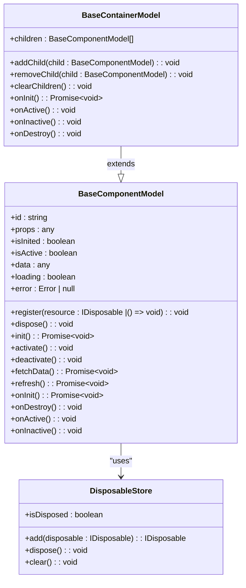
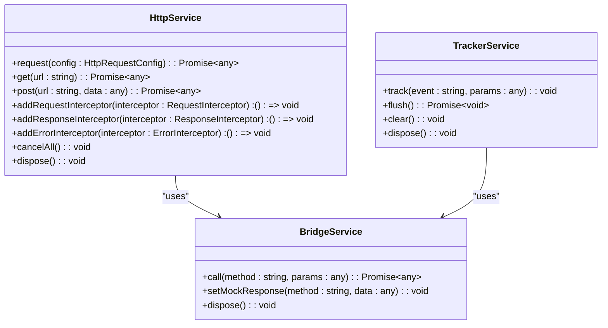
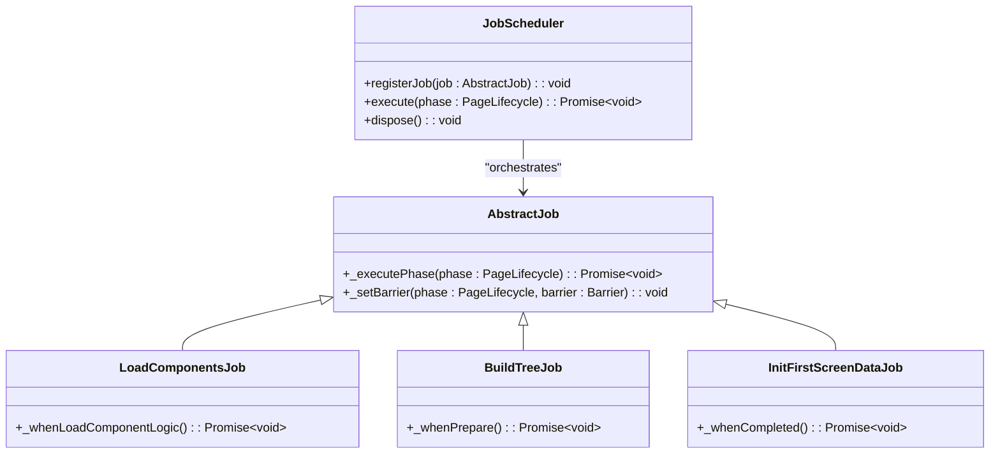
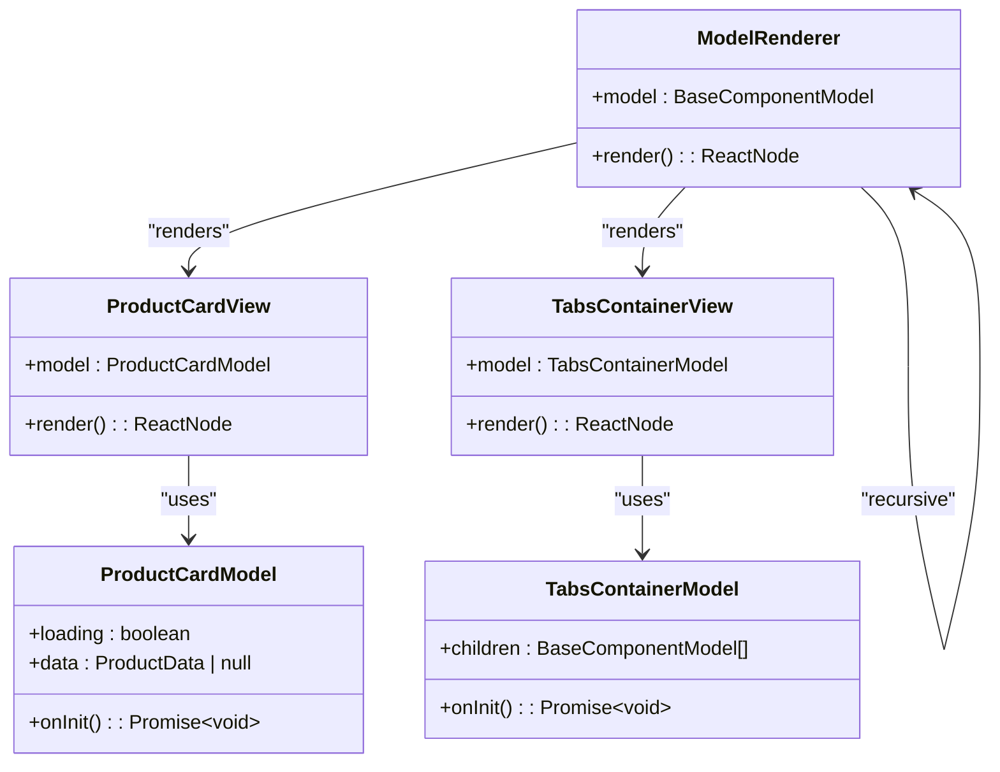
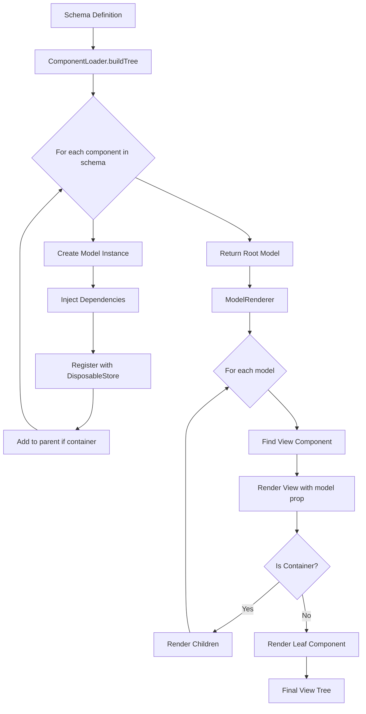
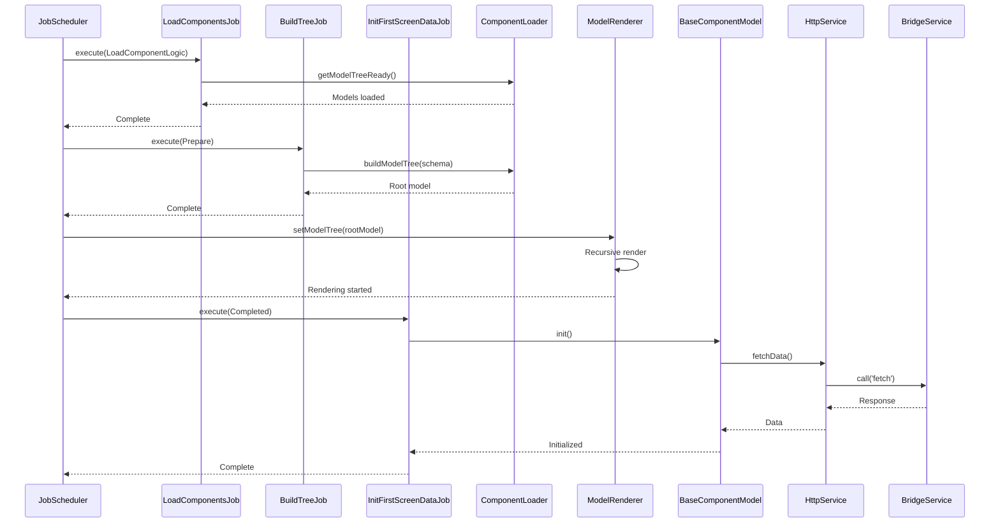
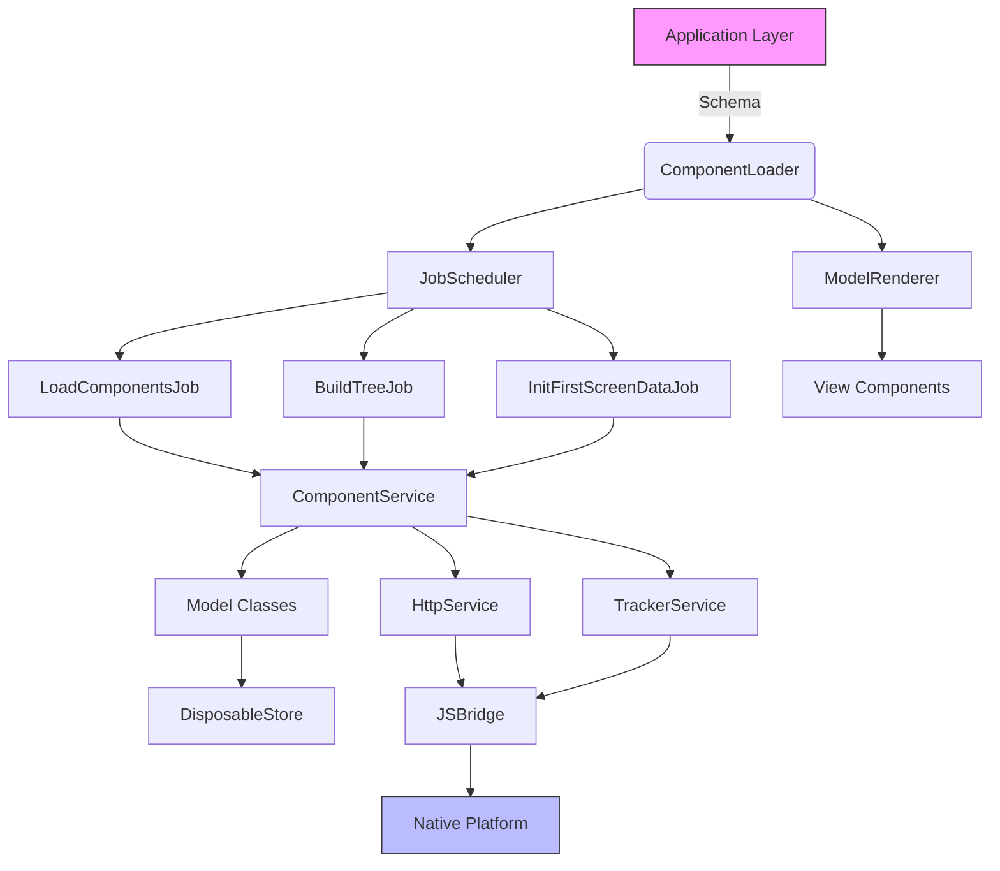

# Architecture Overview

<cite>
**Referenced Files in This Document**   
- [README.md](file://packages/h5-builder/README.md)
- [model.ts](file://packages/h5-builder/src/bedrock/model.ts)
- [model-renderer.tsx](file://packages/h5-builder/src/components/model-renderer.tsx)
- [bridge.service.ts](file://packages/h5-builder/src/services/bridge.service.ts)
- [http.service.ts](file://packages/h5-builder/src/services/http.service.ts)
- [tracker.service.ts](file://packages/h5-builder/src/services/tracker.service.ts)
- [disposable-store.ts](file://packages/h5-builder/src/bedrock/dispose/disposable-store.ts)
- [job-scheduler.ts](file://packages/h5-builder/src/bedrock/launch/job-scheduler.ts)
- [build-tree-job.ts](file://packages/h5-builder/src/jobs/build-tree-job.ts)
- [load-components-job.ts](file://packages/h5-builder/src/jobs/load-components-job.ts)
- [init-first-screen-data-job.ts](file://packages/h5-builder/src/jobs/init-first-screen-data-job.ts)
</cite>

## Table of Contents
1. [Introduction](#introduction)
2. [Layered Architecture](#layered-architecture)
3. [Data Flow and Component Interactions](#data-flow-and-component-interactions)
4. [Job Flow Stages](#job-flow-stages)
5. [System Context Diagram](#system-context-diagram)
6. [Technology Stack and Design Decisions](#technology-stack-and-design-decisions)
7. [Conclusion](#conclusion)

## Introduction

The H5 Builder Framework is a structured, scalable solution for building H5 e-commerce pages with a clear separation of concerns through a layered architecture. The framework enables developers to define UI structures via schemas, which are then transformed into a Model Tree and ultimately rendered as a View Tree. This document provides a comprehensive overview of the framework's architecture, focusing on its four-layer design: Kernel Layer, Infrastructure Layer, Flow Layer, and Components/View Layer. It details the data flow from schema definition to rendering, explains component interactions, and outlines the job flow stages from initialization to completion.

**Section sources**
- [README.md](file://packages/h5-builder/README.md#L1-L232)

## Layered Architecture

The H5 Builder Framework is organized into four distinct architectural layers, each responsible for a specific set of concerns. This layered design promotes modularity, maintainability, and testability.

### Kernel Layer (DI, Model, Disposable)

The Kernel Layer forms the foundation of the framework, providing core utilities for dependency injection, model management, and resource disposal.

- **Dependency Injection (DI)**: The framework uses a decorator-based DI container that supports hierarchical containers. Services are injected into components using the `@Inject` decorator, enabling loose coupling and easier testing.
- **Model Base Classes**: The `BaseComponentModel` and `BaseContainerModel` classes provide a standardized structure for business logic, including lifecycle management and state tracking.
- **Disposable Pattern**: The framework implements an automated resource cleanup mechanism through the `DisposableStore` class, which prevents memory leaks by ensuring all registered resources are properly disposed.

**Diagram sources**
- [model.ts](file://packages/h5-builder/src/bedrock/model.ts#L10-L243)
- [disposable-store.ts](file://packages/h5-builder/src/bedrock/dispose/disposable-store.ts#L6-L84)

**Section sources**
- [model.ts](file://packages/h5-builder/src/bedrock/model.ts#L1-L243)
- [disposable-store.ts](file://packages/h5-builder/src/bedrock/dispose/disposable-store.ts#L1-L84)

### Infrastructure Layer (Bridge, HTTP, Tracker)

The Infrastructure Layer provides essential services that enable communication with external systems and manage cross-cutting concerns.

- **Bridge Service**: The `BridgeService` abstracts native platform communication through a JSBridge interface, supporting both real native calls and mock responses for browser debugging.
- **HTTP Service**: The `HttpService` wraps network requests via the bridge, offering features like request/response interceptors, timeout handling, and automatic JSON parsing.
- **Tracker Service**: The `TrackerService` manages analytics and event tracking with support for batching, persistence, and debug mode.

**Diagram sources**
- [bridge.service.ts](file://packages/h5-builder/src/services/bridge.service.ts#L39-L227)
- [http.service.ts](file://packages/h5-builder/src/services/http.service.ts#L56-L281)
- [tracker.service.ts](file://packages/h5-builder/src/services/tracker.service.ts#L34-L290)

**Section sources**
- [bridge.service.ts](file://packages/h5-builder/src/services/bridge.service.ts#L1-L227)
- [http.service.ts](file://packages/h5-builder/src/services/http.service.ts#L1-L281)
- [tracker.service.ts](file://packages/h5-builder/src/services/tracker.service.ts#L1-L290)

### Flow Layer (JobScheduler, ComponentLoader)

The Flow Layer orchestrates the application lifecycle through a job-based execution model.

- **JobScheduler**: Coordinates the execution of jobs across different lifecycle phases (Open, LoadComponentLogic, Prepare, RenderReady, Render, Completed, Idle).
- **ComponentLoader**: Manages the creation and registration of component models and views, building the model tree from schema definitions.

**Diagram sources**
- [job-scheduler.ts](file://packages/h5-builder/src/bedrock/launch/job-scheduler.ts#L1-L100)
- [load-components-job.ts](file://packages/h5-builder/src/jobs/load-components-job.ts#L1-L61)
- [build-tree-job.ts](file://packages/h5-builder/src/jobs/build-tree-job.ts#L1-L59)
- [init-first-screen-data-job.ts](file://packages/h5-builder/src/jobs/init-first-screen-data-job.ts#L1-L67)

**Section sources**
- [job-scheduler.ts](file://packages/h5-builder/src/bedrock/launch/job-scheduler.ts#L1-L100)
- [load-components-job.ts](file://packages/h5-builder/src/jobs/load-components-job.ts#L1-L61)
- [build-tree-job.ts](file://packages/h5-builder/src/jobs/build-tree-job.ts#L1-L59)
- [init-first-screen-data-job.ts](file://packages/h5-builder/src/jobs/init-first-screen-data-job.ts#L1-L67)

### Components/View Layer

The Components/View Layer implements the presentation logic and UI rendering.

- **Model-View Separation**: Business logic is encapsulated in models, while views handle rendering using React components.
- **ModelRenderer**: A central component that recursively renders models by looking up their associated views in a registry.

**Diagram sources**
- [model-renderer.tsx](file://packages/h5-builder/src/components/model-renderer.tsx#L50-L105)
- [product-card.model.ts](file://packages/h5-builder/src/components/product-card/product-card.model.ts#L1-L50)
- [product-card.view.tsx](file://packages/h5-builder/src/components/product-card/product-card.view.tsx#L1-L50)
- [tabs-container.model.ts](file://packages/h5-builder/src/components/tabs-container/tabs-container.model.ts#L1-L50)
- [tabs-container.view.tsx](file://packages/h5-builder/src/components/tabs-container/tabs-container.view.tsx#L1-L50)

**Section sources**
- [model-renderer.tsx](file://packages/h5-builder/src/components/model-renderer.tsx#L1-L105)

## Data Flow and Component Interactions

The framework follows a unidirectional data flow from schema definition to view rendering.

### Injector and ComponentLoader Interaction

The `Injector` provides services to the `ComponentLoader`, which uses them to instantiate models. The loader maintains a registry of model-view pairs and constructs the model tree based on the schema.

### Model Tree Construction

When the `ComponentLoader` receives a schema, it recursively creates model instances for each component type specified in the schema. Each model is initialized with its props and injected services.

### View Tree Rendering

The `ModelRenderer` component recursively renders the model tree by:
1. Looking up the view component associated with each model's constructor
2. Passing the model as a prop to the view
3. Recursively rendering child models for container components

**Diagram sources**
- [build-tree-job.ts](file://packages/h5-builder/src/jobs/build-tree-job.ts#L46-L58)
- [model-renderer.tsx](file://packages/h5-builder/src/components/model-renderer.tsx#L50-L105)

**Section sources**
- [build-tree-job.ts](file://packages/h5-builder/src/jobs/build-tree-job.ts#L1-L59)
- [model-renderer.tsx](file://packages/h5-builder/src/components/model-renderer.tsx#L1-L105)

## Job Flow Stages

The framework executes in a series of well-defined job stages, each corresponding to a phase in the page lifecycle.

**Diagram sources**
- [load-components-job.ts](file://packages/h5-builder/src/jobs/load-components-job.ts#L49-L58)
- [build-tree-job.ts](file://packages/h5-builder/src/jobs/build-tree-job.ts#L46-L58)
- [init-first-screen-data-job.ts](file://packages/h5-builder/src/jobs/init-first-screen-data-job.ts#L48-L63)

**Section sources**
- [load-components-job.ts](file://packages/h5-builder/src/jobs/load-components-job.ts#L1-L61)
- [build-tree-job.ts](file://packages/h5-builder/src/jobs/build-tree-job.ts#L1-L59)
- [init-first-screen-data-job.ts](file://packages/h5-builder/src/jobs/init-first-screen-data-job.ts#L1-L67)

## System Context Diagram

**Diagram sources**
- [README.md](file://packages/h5-builder/README.md#L158-L184)
- [component-loader.test.ts](file://packages/h5-builder/src/__tests__/component-loader.test.ts#L1-L100)

**Section sources**
- [README.md](file://packages/h5-builder/README.md#L1-L232)

## Technology Stack and Design Decisions

The H5 Builder Framework makes several key technology choices that impact performance and maintainability:

- **MobX-Vue-Lite**: Provides transparent reactivity without the need for explicit state management boilerplate, improving developer productivity.
- **Dependency Injection**: Enables loose coupling between components and services, making the codebase more testable and modular.
- **Disposable Pattern**: Prevents memory leaks by ensuring all resources are properly cleaned up, crucial for long-running applications.
- **Job-Based Execution**: Allows for fine-grained control over the initialization process, enabling optimizations like lazy loading and idle-time processing.
- **Model-View Separation**: Enforces a clean separation between business logic and presentation, improving code organization and maintainability.

These decisions collectively result in a framework that is both performant and maintainable, with clear boundaries between concerns and robust mechanisms for resource management and error handling.

**Section sources**
- [README.md](file://packages/h5-builder/README.md#L7-L41)
- [model.ts](file://packages/h5-builder/src/bedrock/model.ts#L1-L243)
- [http.service.ts](file://packages/h5-builder/src/services/http.service.ts#L1-L281)

## Conclusion

The H5 Builder Framework presents a well-architected solution for building complex H5 e-commerce applications. Its layered design, clear data flow, and thoughtful technology choices create a foundation that is both powerful and maintainable. The framework's emphasis on separation of concerns, automated resource management, and structured initialization process addresses common challenges in mobile web development, resulting in a robust and scalable architecture.