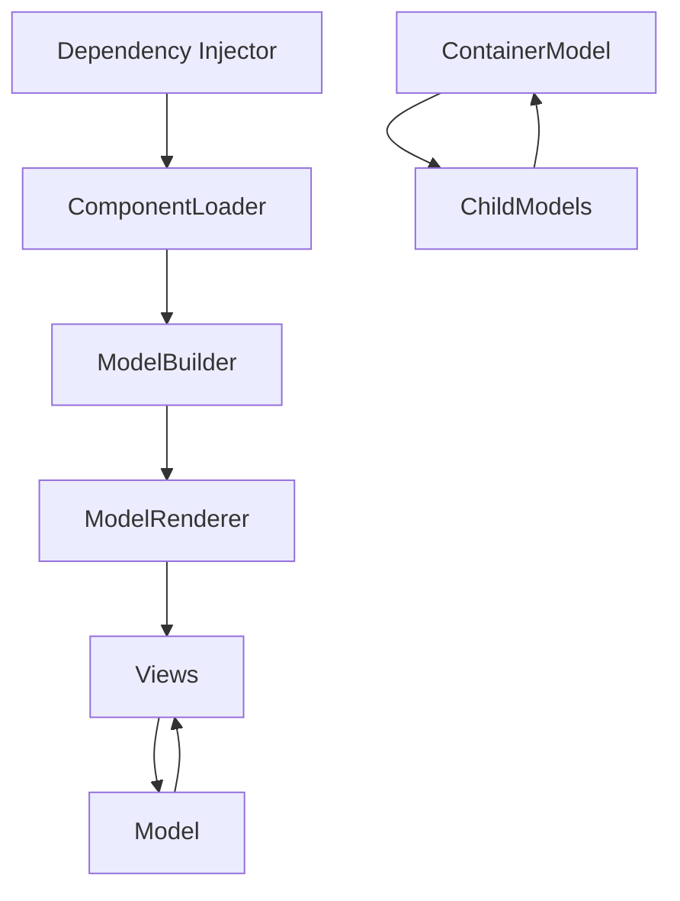
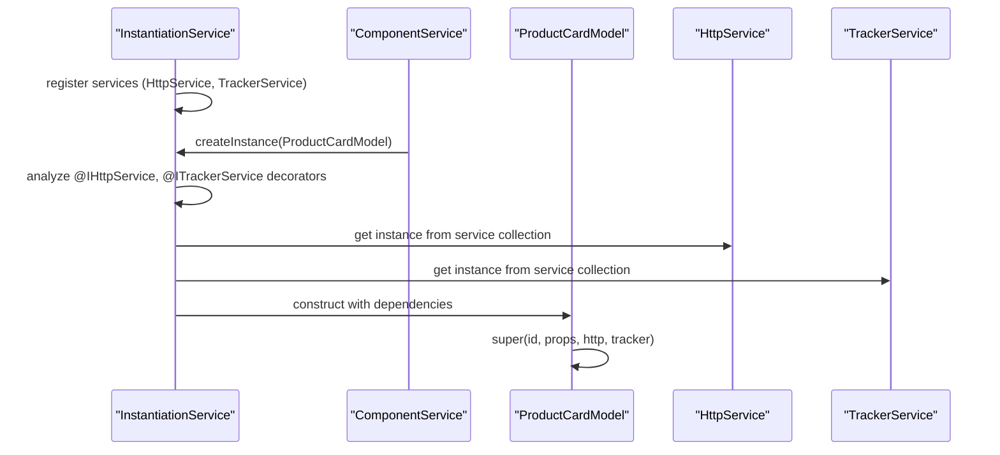
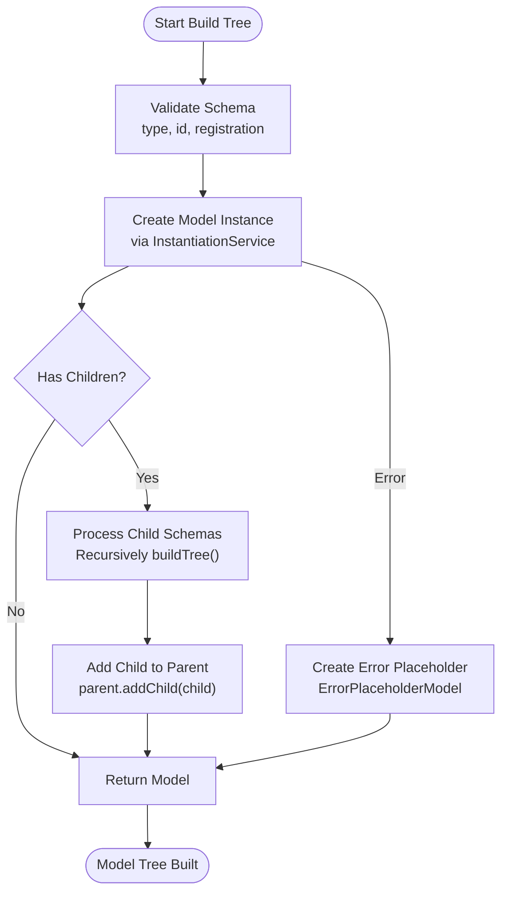
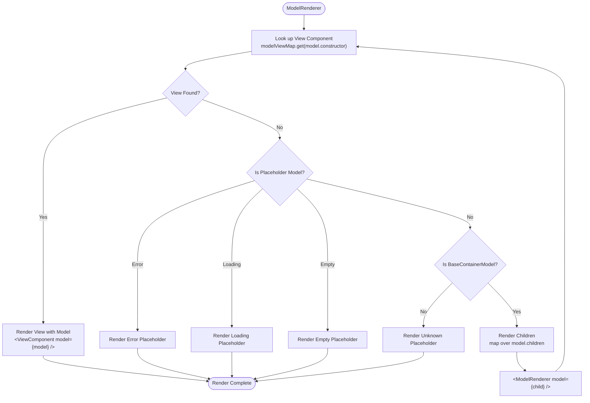
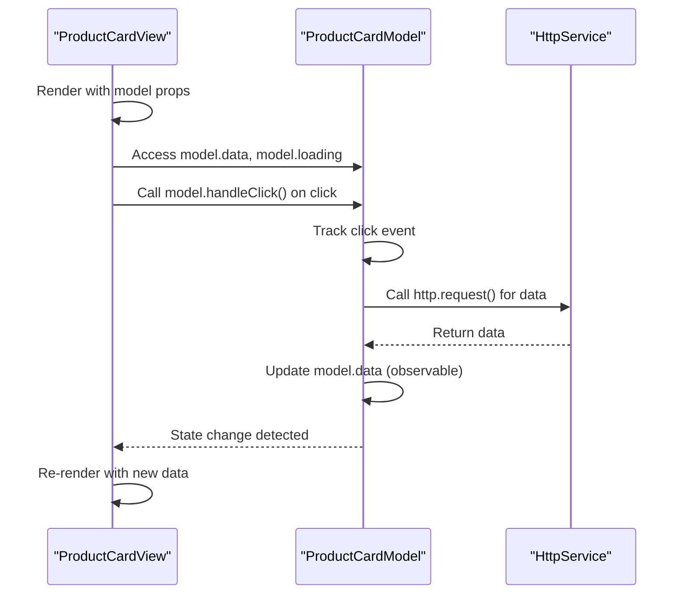
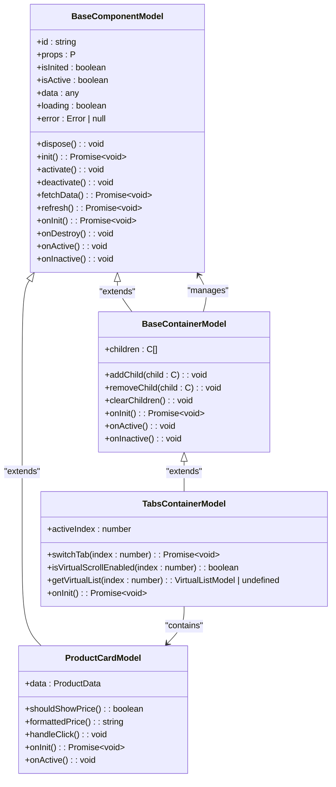
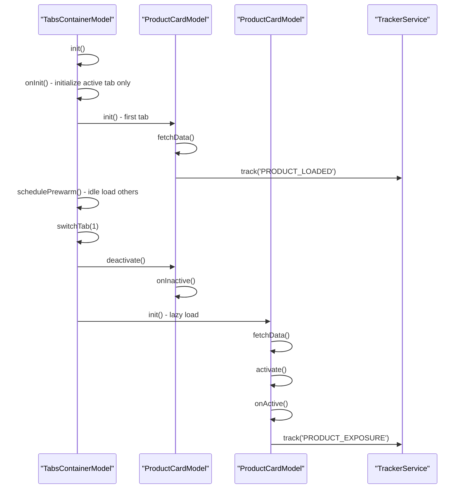
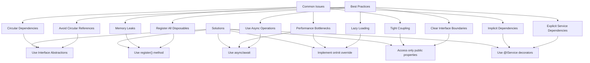

# Component Interaction Patterns

<cite>
**Referenced Files in This Document**   
- [model.ts](file://packages/h5-builder/src/bedrock/model.ts)
- [model-renderer.tsx](file://packages/h5-builder/src/components/model-renderer.tsx)
- [component.service.ts](file://packages/h5-builder/src/services/component.service.ts)
- [instantiation-service.ts](file://packages/h5-builder/src/bedrock/di/instantiation-service.ts)
- [context.web.tsx](file://packages/h5-builder/src/bedrock/di/context.web.tsx)
- [product-card.model.ts](file://packages/h5-builder/src/components/product-card/product-card.model.ts)
- [tabs-container.model.ts](file://packages/h5-builder/src/components/tabs-container/tabs-container.model.ts)
- [product-card.view.tsx](file://packages/h5-builder/src/components/product-card/product-card.view.tsx)
- [tabs-container.view.tsx](file://packages/h5-builder/src/components/tabs-container/tabs-container.view.tsx)
- [http.service.ts](file://packages/h5-builder/src/services/http.service.ts)
- [tracker.service.ts](file://packages/h5-builder/src/services/tracker.service.ts)
- [build-tree-job.ts](file://packages/h5-builder/src/jobs/build-tree-job.ts)
</cite>

## Table of Contents
1. [Introduction](#introduction)
2. [Core Architecture Overview](#core-architecture-overview)
3. [Dependency Injection and Service Provision](#dependency-injection-and-service-provision)
4. [Component Loading and Model Construction](#component-loading-and-model-construction)
5. [Model-View Rendering Pipeline](#model-view-rendering-pipeline)
6. [Model-View Communication Pattern](#model-view-communication-pattern)
7. [Container Component Relationships](#container-component-relationships)
8. [Event Propagation and Lifecycle Management](#event-propagation-and-lifecycle-management)
9. [Common Issues and Best Practices](#common-issues-and-best-practices)
10. [Conclusion](#conclusion)

## Introduction

The H5 Builder Framework implements a sophisticated component interaction architecture based on dependency injection, model-view separation, and hierarchical component relationships. This documentation details the core interaction patterns that enable the framework's dynamic component loading, service injection, and rendering capabilities. The system follows a clear separation of concerns where Models handle business logic and state management, Views handle presentation, and various services coordinate the interaction between them. The framework leverages TypeScript decorators, dependency injection, and MobX for reactive state management to create a maintainable and scalable component architecture.

## Core Architecture Overview

The H5 Builder Framework follows a layered architecture where component interaction flows through well-defined patterns. At the core is the dependency injection system that provides services to components, a component loader that resolves component types and builds Models from schema, and a model renderer that recursively renders Models into Views. The architecture enables dynamic component loading, service injection, and hierarchical component relationships while maintaining clean separation of concerns.

**Diagram sources**
- [model.ts](file://packages/h5-builder/src/bedrock/model.ts)
- [model-renderer.tsx](file://packages/h5-builder/src/components/model-renderer.tsx)
- [component.service.ts](file://packages/h5-builder/src/services/component.service.ts)
- [instantiation-service.ts](file://packages/h5-builder/src/bedrock/di/instantiation-service.ts)

## Dependency Injection and Service Provision

The framework implements a comprehensive dependency injection (DI) system that enables services to be provided to components in a decoupled manner. The Injector, implemented through the `InstantiationService`, is responsible for creating instances of components and injecting required services based on type annotations.

The DI system uses TypeScript decorators (`@IHttpService`, `@ITrackerService`) to declare service dependencies in component constructors. When a component is instantiated, the Injector analyzes these decorators and automatically provides the appropriate service instances. This pattern eliminates the need for components to directly instantiate or locate their dependencies, promoting loose coupling and easier testing.

The `InstantiationService` maintains a service collection and resolves dependencies recursively, ensuring that all required services are available when a component is created. The service resolution follows a hierarchical pattern where child containers can access services from parent containers, but not vice versa, preventing circular dependencies and maintaining proper encapsulation.

**Diagram sources**
- [instantiation-service.ts](file://packages/h5-builder/src/bedrock/di/instantiation-service.ts)
- [product-card.model.ts](file://packages/h5-builder/src/components/product-card/product-card.model.ts)
- [http.service.ts](file://packages/h5-builder/src/services/http.service.ts)
- [tracker.service.ts](file://packages/h5-builder/src/services/tracker.service.ts)

**Section sources**
- [instantiation-service.ts](file://packages/h5-builder/src/bedrock/di/instantiation-service.ts)
- [context.web.tsx](file://packages/h5-builder/src/bedrock/di/context.web.tsx)

## Component Loading and Model Construction

The ComponentLoader, implemented as `ComponentService`, is responsible for resolving component types from schema definitions and constructing Model instances. The process begins with a component schema that defines the component type, ID, props, and optional children. The ComponentLoader uses the DI system to instantiate the appropriate Model class based on the schema type.

The model construction process follows a recursive pattern where the ComponentLoader first creates the parent Model instance and then processes any child schemas. For container components, the loader establishes parent-child relationships by adding child Models to the parent's children collection. This hierarchical construction creates a tree structure of Models that mirrors the component hierarchy defined in the schema.

The `buildTree` method in `ComponentService` orchestrates this process, validating the schema, creating the Model instance through the Injector, and recursively building child Models when present. Error handling is integrated throughout the process, with the loader capable of creating error placeholder components when model creation fails, ensuring that a single component failure doesn't prevent the entire tree from rendering.

**Diagram sources**
- [component.service.ts](file://packages/h5-builder/src/services/component.service.ts)
- [model.ts](file://packages/h5-builder/src/bedrock/model.ts)
- [build-tree-job.ts](file://packages/h5-builder/src/jobs/build-tree-job.ts)

**Section sources**
- [component.service.ts](file://packages/h5-builder/src/services/component.service.ts)
- [model.ts](file://packages/h5-builder/src/bedrock/model.ts)

## Model-View Rendering Pipeline

The ModelRenderer implements a recursive rendering pipeline that transforms Models into their corresponding Views. The process begins with a registry that maps Model classes to their associated View components. When a Model is passed to the ModelRenderer, it looks up the corresponding View component in the registry and renders it with the Model as a prop.

The rendering process is hierarchical and recursive. Container components that extend `BaseContainerModel` automatically render their child Models by passing each child to a nested ModelRenderer instance. This recursive pattern enables the framework to render complex component hierarchies from a single root Model.

The ModelRenderer includes specialized handling for different component states, rendering loading, error, and empty placeholders when appropriate. For container components that don't have a registered View, the renderer provides a default rendering that iterates through the children, ensuring that all components in the hierarchy are rendered even if specific Views aren't registered.

**Diagram sources**
- [model-renderer.tsx](file://packages/h5-builder/src/components/model-renderer.tsx)
- [model.ts](file://packages/h5-builder/src/bedrock/model.ts)

**Section sources**
- [model-renderer.tsx](file://packages/h5-builder/src/components/model-renderer.tsx)

## Model-View Communication Pattern

The framework implements a unidirectional data flow pattern where Views receive Models as props and invoke Model methods to handle user interactions. This pattern ensures a clean separation of concerns, with Models managing state and business logic while Views handle presentation and user interface concerns.

Views are implemented as React functional components wrapped with the `observer` higher-order component from mobx-vue-lite, making them automatically responsive to changes in the Model's observable properties. When the Model's state changes, the View re-renders to reflect the new state without requiring explicit re-rendering commands.

User interactions in the View trigger methods on the Model rather than directly modifying state. For example, a button click in the View calls a method on the Model, which then updates its internal state. This approach centralizes business logic in the Model, making it easier to test and maintain. The View simply reacts to state changes and delegates actions to the Model.

Computed properties in the Model can be accessed directly by the View, providing a clean API for derived state without exposing the underlying implementation details.

**Diagram sources**
- [product-card.view.tsx](file://packages/h5-builder/src/components/product-card/product-card.view.tsx)
- [product-card.model.ts](file://packages/h5-builder/src/components/product-card/product-card.model.ts)

**Section sources**
- [product-card.view.tsx](file://packages/h5-builder/src/components/product-card/product-card.view.tsx)
- [product-card.model.ts](file://packages/h5-builder/src/components/product-card/product-card.model.ts)

## Container Component Relationships

Container components in the framework extend `BaseContainerModel` and manage relationships with their child Models. The base container class provides default implementations for lifecycle methods that automatically initialize, activate, and deactivate all child components, establishing a hierarchical lifecycle management system.

Parent-child relationships are established through the `addChild` method, which not only adds the child to the parent's children array but also registers the child for automatic disposal. This ensures that when a parent container is destroyed, all its child Models are properly cleaned up, preventing memory leaks.

Container components can override the default lifecycle behavior to implement custom patterns such as lazy loading. For example, the `TabsContainerModel` overrides the `onInit` method to only initialize the currently active tab, deferring initialization of other tabs until they are activated. This optimization improves performance by avoiding unnecessary work for inactive components.

The framework also supports more complex relationships through features like virtual scrolling, where a container can wrap its children in a virtual list Model to optimize rendering performance for large lists of items.

**Diagram sources**
- [model.ts](file://packages/h5-builder/src/bedrock/model.ts)
- [tabs-container.model.ts](file://packages/h5-builder/src/components/tabs-container/tabs-container.model.ts)
- [product-card.model.ts](file://packages/h5-builder/src/components/product-card/product-card.model.ts)

**Section sources**
- [model.ts](file://packages/h5-builder/src/bedrock/model.ts)
- [tabs-container.model.ts](file://packages/h5-builder/src/components/tabs-container/tabs-container.model.ts)

## Event Propagation and Lifecycle Management

The framework implements a comprehensive lifecycle management system that coordinates the initialization, activation, deactivation, and destruction of components. Lifecycle events propagate hierarchically from parent to child components, ensuring that components are properly initialized and cleaned up in the correct order.

The lifecycle sequence begins with `init()`, which calls the `onInit` hook after ensuring the component hasn't already been initialized. For container components, this triggers initialization of all child components. The `activate()` and `deactivate()` methods manage the active state of components, with container components automatically propagating these calls to their children.

Event propagation follows the component hierarchy, with child components able to communicate with their parents through method calls on the parent Model. Services like `TrackerService` provide a centralized event system for cross-component communication, allowing components to emit events that can be handled by other parts of the application.

Error boundaries are implemented at multiple levels, with individual components capable of handling their own errors and the ModelRenderer providing fallback rendering for components that fail to load or render.

**Diagram sources**
- [tabs-container.model.ts](file://packages/h5-builder/src/components/tabs-container/tabs-container.model.ts)
- [product-card.model.ts](file://packages/h5-builder/src/components/product-card/product-card.model.ts)
- [tracker.service.ts](file://packages/h5-builder/src/services/tracker.service.ts)

**Section sources**
- [tabs-container.model.ts](file://packages/h5-builder/src/components/tabs-container/tabs-container.model.ts)
- [product-card.model.ts](file://packages/h5-builder/src/components/product-card/product-card.model.ts)

## Common Issues and Best Practices

Several common issues can arise in component interactions within the H5 Builder Framework, along with corresponding best practices to maintain clean separation of concerns and optimal performance.

One common issue is circular dependencies between components or services, which can prevent proper initialization. The framework's dependency injection system includes cycle detection, but developers should design their components to avoid circular references by using appropriate abstraction layers and service interfaces.

Memory leaks can occur if components don't properly clean up resources. The framework addresses this through the `DisposableStore` in `BaseComponentModel`, but developers must ensure all resources (timers, event listeners, subscriptions) are registered with the `register` method to be automatically cleaned up during disposal.

Performance issues can arise from unnecessary re-renders or synchronous blocking operations in lifecycle methods. Best practices include using asynchronous operations for data loading, implementing lazy loading for non-critical components, and using computed properties for derived state to minimize re-computation.

Another common issue is tight coupling between Models and Views, which reduces reusability. The framework encourages loose coupling by having Views only access Model properties and methods through a well-defined interface, rather than directly manipulating internal state.

Service dependencies should be declared explicitly through constructor parameters with appropriate decorators, rather than being accessed globally or through indirect references. This makes dependencies clear and facilitates testing with mock services.

**Diagram sources**
- [model.ts](file://packages/h5-builder/src/bedrock/model.ts)
- [component.service.ts](file://packages/h5-builder/src/services/component.service.ts)
- [instantiation-service.ts](file://packages/h5-builder/src/bedrock/di/instantiation-service.ts)

**Section sources**
- [model.ts](file://packages/h5-builder/src/bedrock/model.ts)
- [component.service.ts](file://packages/h5-builder/src/services/component.service.ts)

## Conclusion

The H5 Builder Framework implements a robust component interaction architecture that effectively separates concerns while enabling rich, dynamic user interfaces. The dependency injection system provides services to components in a decoupled manner, the ComponentLoader resolves component types and builds hierarchical Model trees from schema definitions, and the ModelRenderer recursively renders Models into Views.

The Model-View communication pattern ensures that business logic remains centralized in Models while Views handle presentation, with clear interfaces between the two. Container components manage parent-child relationships and can override default behaviors to implement optimizations like lazy loading and virtual scrolling.

By following the framework's patterns and best practices, developers can create maintainable, performant components that are easy to test and reuse. The architecture supports both simple components and complex container hierarchies, providing a scalable foundation for building sophisticated H5 applications.