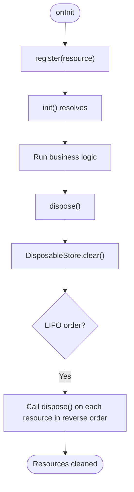

# Component Lifecycle Hooks and State Management

<cite>
**Referenced Files in This Document**
- [model.ts](file://packages/h5-builder/src/bedrock/model.ts)
- [activate-tree-job.ts](file://packages/h5-builder/src/jobs/activate-tree-job.ts)
- [trigger-render-job.ts](file://packages/h5-builder/src/jobs/trigger-render-job.ts)
- [lifecycle.ts](file://packages/h5-builder/src/jobs/lifecycle.ts)
- [component.service.ts](file://packages/h5-builder/src/services/component.service.ts)
- [disposable-store.ts](file://packages/h5-builder/src/bedrock/dispose/disposable-store.ts)
- [disposable-utils.ts](file://packages/h5-builder/src/bedrock/dispose/disposable-utils.ts)
- [disposable-t.ts](file://packages/h5-builder/src/bedrock/dispose/disposable-t.ts)
- [abstract-job.ts](file://packages/h5-builder/src/bedrock/launch/abstract-job.ts)
- [tabs-container.model.ts](file://packages/h5-builder/src/components/tabs-container/tabs-container.model.ts)
- [simple-list.model.ts](file://packages/h5-builder/src/components/simple-list/simple-list.model.ts)
- [model.test.ts](file://packages/h5-builder/src/__tests__/model.test.ts)
</cite>

## Table of Contents
1. [Introduction](#introduction)
2. [Project Structure](#project-structure)
3. [Core Components](#core-components)
4. [Architecture Overview](#architecture-overview)
5. [Detailed Component Analysis](#detailed-component-analysis)
6. [Dependency Analysis](#dependency-analysis)
7. [Performance Considerations](#performance-considerations)
8. [Troubleshooting Guide](#troubleshooting-guide)
9. [Conclusion](#conclusion)

## Introduction
This document explains the component lifecycle hooks and state management in the project, focusing on:
- Initialization and activation semantics
- How lifecycle hooks are invoked across a model tree
- How rendering coordination works with jobs
- Resource management patterns using disposable stores
- Best practices to avoid memory leaks and ensure robust state transitions

We use the TestModel from the test suite as a concrete example to illustrate lifecycle behavior and demonstrate how containers orchestrate child lifecycles.

## Project Structure
The lifecycle system spans several modules:
- Model base classes define lifecycle hooks and state flags
- Jobs coordinate rendering and activation phases
- Services construct model trees from component schemas
- Disposable utilities manage resource cleanup

**Diagram sources**
- [model.ts](file://packages/h5-builder/src/bedrock/model.ts#L1-L155)
- [activate-tree-job.ts](file://packages/h5-builder/src/jobs/activate-tree-job.ts#L1-L56)
- [trigger-render-job.ts](file://packages/h5-builder/src/jobs/trigger-render-job.ts#L1-L44)
- [abstract-job.ts](file://packages/h5-builder/src/bedrock/launch/abstract-job.ts#L1-L46)
- [component.service.ts](file://packages/h5-builder/src/services/component.service.ts#L130-L209)
- [disposable-store.ts](file://packages/h5-builder/src/bedrock/dispose/disposable-store.ts#L1-L84)
- [disposable-utils.ts](file://packages/h5-builder/src/bedrock/dispose/disposable-utils.ts#L1-L29)
- [disposable-t.ts](file://packages/h5-builder/src/bedrock/dispose/disposable-t.ts#L1-L36)

**Section sources**
- [model.ts](file://packages/h5-builder/src/bedrock/model.ts#L1-L155)
- [activate-tree-job.ts](file://packages/h5-builder/src/jobs/activate-tree-job.ts#L1-L56)
- [trigger-render-job.ts](file://packages/h5-builder/src/jobs/trigger-render-job.ts#L1-L44)
- [abstract-job.ts](file://packages/h5-builder/src/bedrock/launch/abstract-job.ts#L1-L46)
- [component.service.ts](file://packages/h5-builder/src/services/component.service.ts#L130-L209)
- [disposable-store.ts](file://packages/h5-builder/src/bedrock/dispose/disposable-store.ts#L1-L84)

## Core Components
- BaseComponentModel defines lifecycle flags and hooks:
  - init() ensures onInit runs once
  - activate()/deactivate() toggle isActive and call onActive()/onInactive()
  - dispose() invokes onDestroy and cleans up registered resources
- BaseContainerModel extends lifecycle behavior to children:
  - onInit initializes all children
  - onActive activates all children
  - onInactive deactivates all children
- DisposableStore manages resource registration and LIFO disposal
- Jobs coordinate lifecycle phases and rendering:
  - ActivateTreeJob triggers activation after render
  - TriggerRenderJob renders the model tree at the right phase

**Section sources**
- [model.ts](file://packages/h5-builder/src/bedrock/model.ts#L60-L155)
- [disposable-store.ts](file://packages/h5-builder/src/bedrock/dispose/disposable-store.ts#L1-L84)
- [activate-tree-job.ts](file://packages/h5-builder/src/jobs/activate-tree-job.ts#L1-L56)
- [trigger-render-job.ts](file://packages/h5-builder/src/jobs/trigger-render-job.ts#L1-L44)

## Architecture Overview
The lifecycle orchestrates through a page lifecycle model and jobs:
- PageLifecycle enumerates stages
- Jobs execute per phase
- ComponentService builds the model tree
- ActivateTreeJob activates the model tree after render
- TriggerRenderJob triggers external rendering with the model tree

**Diagram sources**
- [lifecycle.ts](file://packages/h5-builder/src/jobs/lifecycle.ts#L1-L18)
- [trigger-render-job.ts](file://packages/h5-builder/src/jobs/trigger-render-job.ts#L1-L44)
- [activate-tree-job.ts](file://packages/h5-builder/src/jobs/activate-tree-job.ts#L1-L56)
- [component.service.ts](file://packages/h5-builder/src/services/component.service.ts#L720-L734)
- [abstract-job.ts](file://packages/h5-builder/src/bedrock/launch/abstract-job.ts#L1-L46)

## Detailed Component Analysis

### Lifecycle Semantics: init vs activate
- Initialization (init/onInit):
  - One-time setup: network requests, subscriptions, timers
  - Guarded against re-entry
  - Sets isInited flag
- Activation (activate/onActive):
  - Surface-level resume: resume timers, re-subscribe, start analytics
  - Guarded against re-entry
  - Sets isActive flag
- Deactivation (deactivate/onInactive):
  - Surface-level pause: pause timers, cancel subscriptions
  - Guarded against repeated deactivation
- Destruction (dispose/onDestroy):
  - Final cleanup: call onDestroy and dispose all registered resources
  - Prevents double-disposal

These semantics are demonstrated by TestModel in the test suite, which verifies:
- init only runs once and updates state accordingly
- activate toggles isActive and triggers onActive
- deactivate toggles isActive and triggers onInactive
- dispose triggers onDestroy and prevents double-disposal

**Section sources**
- [model.ts](file://packages/h5-builder/src/bedrock/model.ts#L60-L155)
- [model.test.ts](file://packages/h5-builder/src/__tests__/model.test.ts#L51-L111)

### Container Lifecycle Orchestration
BaseContainerModel automates lifecycle across children:
- onInit: initializes all children concurrently
- onActive: activates all children
- onInactive: deactivates all children
- onDestroy: defers to parent behavior; children are already registered for cleanup

This pattern ensures consistent lifecycle propagation across the model tree.

**Section sources**
- [model.ts](file://packages/h5-builder/src/bedrock/model.ts#L168-L242)
- [model.test.ts](file://packages/h5-builder/src/__tests__/model.test.ts#L180-L230)

### ActivateTreeJob: Triggering onActive Across the Tree
ActivateTreeJob listens to the Render phase and activates the entire model tree:
- Retrieves the model tree from ComponentService
- Calls activate() on the root, which cascades to all children via BaseContainerModel’s default behavior

**Diagram sources**
- [activate-tree-job.ts](file://packages/h5-builder/src/jobs/activate-tree-job.ts#L1-L56)
- [model.ts](file://packages/h5-builder/src/bedrock/model.ts#L211-L235)
- [component.service.ts](file://packages/h5-builder/src/services/component.service.ts#L720-L734)

**Section sources**
- [activate-tree-job.ts](file://packages/h5-builder/src/jobs/activate-tree-job.ts#L1-L56)
- [model.ts](file://packages/h5-builder/src/bedrock/model.ts#L211-L235)

### TriggerRenderJob: Rendering Coordination
TriggerRenderJob coordinates rendering at the Render phase:
- Retrieves the model tree from ComponentService
- Invokes a provided callback to set the model tree for rendering

**Diagram sources**
- [trigger-render-job.ts](file://packages/h5-builder/src/jobs/trigger-render-job.ts#L1-L44)
- [component.service.ts](file://packages/h5-builder/src/services/component.service.ts#L720-L734)

**Section sources**
- [trigger-render-job.ts](file://packages/h5-builder/src/jobs/trigger-render-job.ts#L1-L44)

### Resource Management Pattern with DisposableStore
- Register resources during onInit using register():
  - Accepts IDisposable or a cleanup function
  - Ensures LIFO disposal order
- Dispose cleans up all registered resources and prevents double-disposal
- Utility helpers:
  - makeSafeDisposable, makeEmptyDisposable, ignoreDispose, isDisposable, makeTransferDisposable

**Diagram sources**
- [model.ts](file://packages/h5-builder/src/bedrock/model.ts#L28-L58)
- [disposable-store.ts](file://packages/h5-builder/src/bedrock/dispose/disposable-store.ts#L1-L84)
- [disposable-utils.ts](file://packages/h5-builder/src/bedrock/dispose/disposable-utils.ts#L1-L29)
- [disposable-t.ts](file://packages/h5-builder/src/bedrock/dispose/disposable-t.ts#L1-L36)

**Section sources**
- [model.ts](file://packages/h5-builder/src/bedrock/model.ts#L28-L58)
- [disposable-store.ts](file://packages/h5-builder/src/bedrock/dispose/disposable-store.ts#L1-L84)
- [disposable-utils.ts](file://packages/h5-builder/src/bedrock/dispose/disposable-utils.ts#L1-L29)
- [disposable-t.ts](file://packages/h5-builder/src/bedrock/dispose/disposable-t.ts#L1-L36)

### Practical Example: TestModel Behavior
TestModel demonstrates:
- One-time initialization guarded by isInited
- Activation toggling isActive and invoking onActive
- Deactivation toggling isActive and invoking onInactive
- Proper disposal and prevention of double-disposal
- Resource registration and LIFO cleanup ordering

**Diagram sources**
- [model.test.ts](file://packages/h5-builder/src/__tests__/model.test.ts#L51-L111)
- [model.ts](file://packages/h5-builder/src/bedrock/model.ts#L60-L155)
- [disposable-store.ts](file://packages/h5-builder/src/bedrock/dispose/disposable-store.ts#L1-L84)

**Section sources**
- [model.test.ts](file://packages/h5-builder/src/__tests__/model.test.ts#L51-L111)

### Advanced Example: TabsContainer with Custom Lifecycle
TabsContainer overrides container lifecycle to implement:
- Lazy initialization of the active tab
- Conditional activation of the new tab
- Pre-warming of neighboring and other tabs with delays
- Optional virtual scrolling integration

**Diagram sources**
- [tabs-container.model.ts](file://packages/h5-builder/src/components/tabs-container/tabs-container.model.ts#L169-L204)

**Section sources**
- [tabs-container.model.ts](file://packages/h5-builder/src/components/tabs-container/tabs-container.model.ts#L58-L96)
- [tabs-container.model.ts](file://packages/h5-builder/src/components/tabs-container/tabs-container.model.ts#L169-L204)

### Simple Container Example
SimpleListModel inherits default container behavior:
- Automatic initialization, activation, and deactivation of children
- Minimal boilerplate required

**Section sources**
- [simple-list.model.ts](file://packages/h5-builder/src/components/simple-list/simple-list.model.ts#L1-L16)

## Dependency Analysis
Key relationships:
- BaseComponentModel depends on DisposableStore for resource management
- BaseContainerModel extends BaseComponentModel and orchestrates children
- Jobs depend on ComponentService to access the model tree
- Jobs are scheduled by AbstractJob and executed per phase

**Diagram sources**
- [model.ts](file://packages/h5-builder/src/bedrock/model.ts#L1-L242)
- [disposable-store.ts](file://packages/h5-builder/src/bedrock/dispose/disposable-store.ts#L1-L84)
- [component.service.ts](file://packages/h5-builder/src/services/component.service.ts#L130-L209)
- [activate-tree-job.ts](file://packages/h5-builder/src/jobs/activate-tree-job.ts#L1-L56)
- [trigger-render-job.ts](file://packages/h5-builder/src/jobs/trigger-render-job.ts#L1-L44)

**Section sources**
- [model.ts](file://packages/h5-builder/src/bedrock/model.ts#L1-L242)
- [disposable-store.ts](file://packages/h5-builder/src/bedrock/dispose/disposable-store.ts#L1-L84)
- [component.service.ts](file://packages/h5-builder/src/services/component.service.ts#L130-L209)
- [activate-tree-job.ts](file://packages/h5-builder/src/jobs/activate-tree-job.ts#L1-L56)
- [trigger-render-job.ts](file://packages/h5-builder/src/jobs/trigger-render-job.ts#L1-L44)

## Performance Considerations
- Prefer asynchronous initialization and activation to avoid blocking the main thread
- Use BaseContainerModel’s default parallelization for children initialization
- Avoid heavy work in onActive; defer to idle or lazy activation
- Use virtual scrolling or pre-warming strategies for large lists (see TabsContainer)
- Keep resource registration minimal and deterministic to reduce disposal overhead

[No sources needed since this section provides general guidance]

## Troubleshooting Guide
Common lifecycle-related issues and remedies:
- Premature disposal
  - Symptom: Resources already disposed, warnings logged
  - Cause: Calling dispose() multiple times or disposing a model whose store is already disposed
  - Fix: Ensure dispose() is called once and guard downstream logic
  - Evidence: Double-disposal warning behavior in DisposableStore and BaseComponentModel
- Missed activation events
  - Symptom: Timers not resuming, subscriptions not re-established
  - Cause: Not calling activate() after navigation or not overriding onActive appropriately
  - Fix: Ensure activate() is invoked and onActive resumes timers/subscriptions
- Memory leaks
  - Symptom: Timers keep ticking after disposal
  - Cause: Not registering cleanup functions or missing dispose() calls
  - Fix: Register all resources in onInit via register(), rely on LIFO disposal
- Incorrect lifecycle sequencing
  - Symptom: Activation before render or vice versa
  - Cause: Misordered job preparation
  - Fix: Use TriggerRenderJob to render first, then ActivateTreeJob to activate

**Section sources**
- [disposable-store.ts](file://packages/h5-builder/src/bedrock/dispose/disposable-store.ts#L1-L84)
- [model.ts](file://packages/h5-builder/src/bedrock/model.ts#L45-L58)
- [model.test.ts](file://packages/h5-builder/src/__tests__/model.test.ts#L96-L111)
- [trigger-render-job.ts](file://packages/h5-builder/src/jobs/trigger-render-job.ts#L1-L44)
- [activate-tree-job.ts](file://packages/h5-builder/src/jobs/activate-tree-job.ts#L1-L56)

## Conclusion
The lifecycle system provides a robust, predictable pattern for initializing, activating, and cleaning up component models:
- Use init/onInit for one-time setup and onActive/onInactive for surface-level resume/pause
- Rely on BaseContainerModel to propagate lifecycle across children
- Coordinate rendering and activation via jobs and ComponentService
- Manage resources with DisposableStore to ensure safe, LIFO cleanup
- Apply best practices to avoid leaks and ensure correct sequencing

[No sources needed since this section summarizes without analyzing specific files]