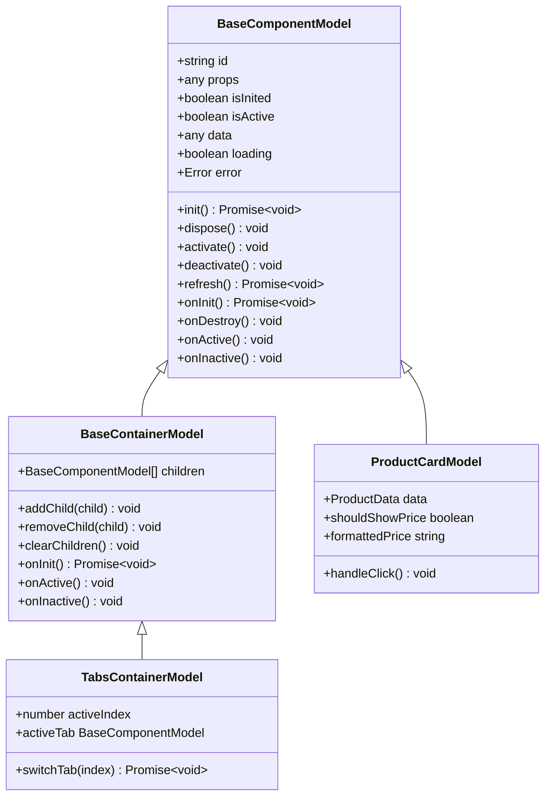
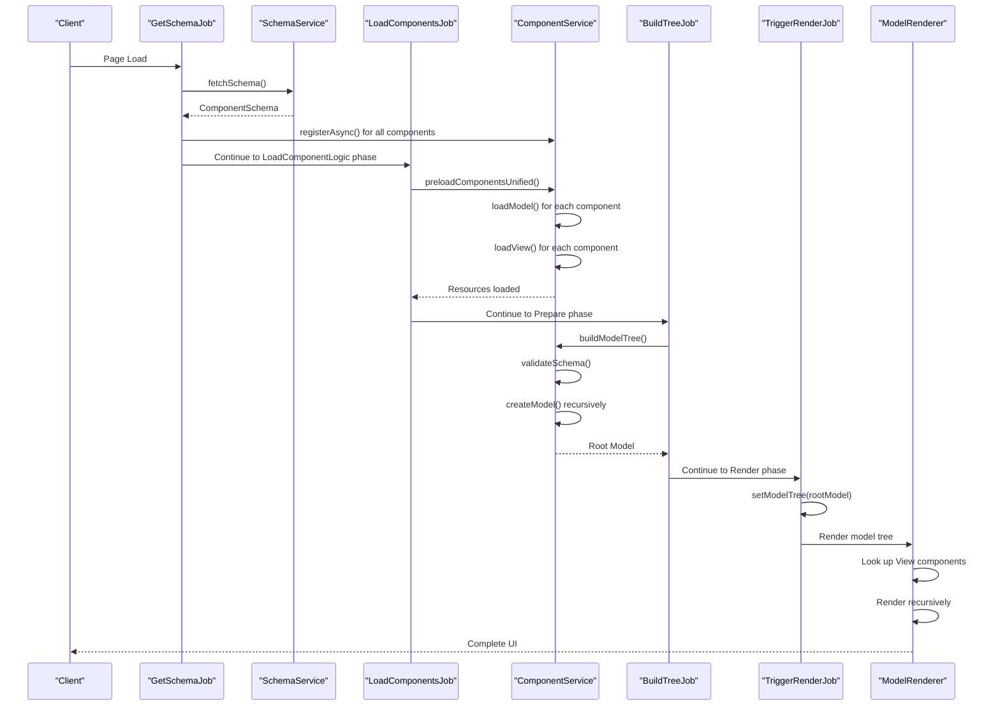
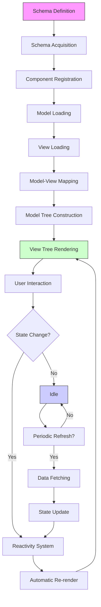

# Data Flow and Component Lifecycle

<cite>
**Referenced Files in This Document**   
- [model.ts](file://packages/h5-builder/src/bedrock/model.ts)
- [model-renderer.tsx](file://packages/h5-builder/src/components/model-renderer.tsx)
- [lifecycle.ts](file://packages/h5-builder/src/jobs/lifecycle.ts)
- [schema.service.ts](file://packages/h5-builder/src/services/schema.service.ts)
- [component.service.ts](file://packages/h5-builder/src/services/component.service.ts)
- [build-tree-job.ts](file://packages/h5-builder/src/jobs/build-tree-job.ts)
- [trigger-render-job.ts](file://packages/h5-builder/src/jobs/trigger-render-job.ts)
- [product-card.model.ts](file://packages/h5-builder/src/components/product-card/product-card.model.ts)
- [tabs-container.model.ts](file://packages/h5-builder/src/components/tabs-container/tabs-container.model.ts)
- [placeholder/index.ts](file://packages/h5-builder/src/placeholder/index.ts)
- [get-schema-job.ts](file://packages/h5-builder/src/jobs/get-schema-job.ts)
- [load-components-job.ts](file://packages/h5-builder/src/jobs/load-components-job.ts)
- [http.service.ts](file://packages/h5-builder/src/services/http.service.ts)
- [tracker.service.ts](file://packages/h5-builder/src/services/tracker.service.ts)
- [mobx.ts](file://packages/mobx-vue-lite/src/mobx.ts)
</cite>

## Table of Contents
1. [Introduction](#introduction)
2. [Data Flow Overview](#data-flow-overview)
3. [Schema Definition and Acquisition](#schema-definition-and-acquisition)
4. [Component Loading and Registration](#component-loading-and-registration)
5. [Model Tree Construction](#model-tree-construction)
6. [View Tree Rendering](#view-tree-rendering)
7. [Component Lifecycle Management](#component-lifecycle-management)
8. [Reactivity System Integration](#reactivity-system-integration)
9. [Error Handling and Recovery](#error-handling-and-recovery)
10. [Troubleshooting Guide](#troubleshooting-guide)
11. [Architecture Diagrams](#architecture-diagrams)

## Introduction
The H5 Builder Framework implements a sophisticated end-to-end data flow system that transforms declarative schema definitions into interactive UI components through a well-defined sequence of operations. This documentation details the complete journey from schema acquisition through model tree construction to view rendering, with emphasis on the recursive nature of model construction, container model management, component lifecycle semantics, and reactivity integration. The framework leverages mobx-vue-lite's reactivity system to ensure efficient updates and employs a job-based lifecycle management system to coordinate asynchronous operations.

## Data Flow Overview
The H5 Builder Framework follows a structured data flow that begins with schema acquisition and culminates in rendered UI components. The process is orchestrated through a series of jobs that correspond to specific lifecycle phases, ensuring proper sequencing of operations. The data flow can be summarized in the following stages:

1. **Schema Acquisition**: The framework retrieves the component schema from a remote source or mock data
2. **Component Loading**: Model and View resources are asynchronously loaded based on the schema requirements
3. **Model Tree Construction**: The schema is transformed into a hierarchical model tree with proper parent-child relationships
4. **View Tree Rendering**: The model tree is rendered into a view tree using React components
5. **Lifecycle Management**: Components are initialized, activated, deactivated, and disposed according to their visibility and usage
6. **Reactivity Integration**: State changes trigger automatic re-renders through the mobx-vue-lite reactivity system

This flow ensures that components are only loaded and initialized when needed, optimizing performance and resource utilization.

**Section sources**
- [lifecycle.ts](file://packages/h5-builder/src/jobs/lifecycle.ts)
- [get-schema-job.ts](file://packages/h5-builder/src/jobs/get-schema-job.ts)
- [load-components-job.ts](file://packages/h5-builder/src/jobs/load-components-job.ts)
- [build-tree-job.ts](file://packages/h5-builder/src/jobs/build-tree-job.ts)
- [trigger-render-job.ts](file://packages/h5-builder/src/jobs/trigger-render-job.ts)

## Schema Definition and Acquisition
The data flow begins with the definition and acquisition of the component schema, which serves as the blueprint for the entire UI structure. The schema is defined as a hierarchical structure that specifies component types, IDs, properties, and child relationships.

The schema acquisition process is managed by the `GetSchemaJob`, which executes during the `Open` lifecycle phase. This job retrieves the schema from a remote source through the `SchemaService`, which provides a `fetchSchema` method that returns a Promise containing the component schema. The schema follows the `ComponentSchema` interface, which includes:

- **type**: The component type used to identify the corresponding Model class
- **id**: A unique identifier for the component instance
- **props**: Configuration properties passed to the component
- **children**: Optional array of child component schemas for container components
- **meta**: Optional metadata for loading priority, dependencies, and other configuration

Once acquired, the schema is used to register component loaders and initiate the resource loading process. The framework supports both synchronous and asynchronous schema acquisition, allowing for flexibility in different deployment scenarios.

**Section sources**
- [schema.service.ts](file://packages/h5-builder/src/services/schema.service.ts)
- [component.service.ts](file://packages/h5-builder/src/services/component.service.ts#L31-L46)
- [get-schema-job.ts](file://packages/h5-builder/src/jobs/get-schema-job.ts)

## Component Loading and Registration
After schema acquisition, the framework proceeds with loading and registering the necessary component resources. This process is managed by the `ComponentService`, which maintains a registry of available components and handles their asynchronous loading.

Components are registered with the `ComponentService` using the `registerAsync` method, which accepts configuration for both Model and View resources. The registration includes metadata that specifies loading priority, dependencies, and delay ranges for simulation purposes. The framework supports three loading strategies:

1. **Separate Model and View loading**: Individual loaders for Model and View resources
2. **Unified loader**: A single loader that returns both Model and View
3. **Batch registration**: Multiple components can be registered simultaneously

The loading process employs concurrent control with configurable limits for Model and View loading, ensuring that resource loading does not overwhelm the system. The `preloadComponentsUnified` method implements a unified queue strategy that processes Model and View loading tasks together with a total concurrency limit, optimizing resource utilization.

During loading, the framework maintains caches for both Model and View resources to prevent redundant loading. The `loadModel` and `loadView` methods handle the actual loading operations, including error handling and fallback mechanisms.

**Section sources**
- [component.service.ts](file://packages/h5-builder/src/services/component.service.ts#L258-L718)
- [get-schema-job.ts](file://packages/h5-builder/src/jobs/get-schema-job.ts#L69-L112)

## Model Tree Construction
The model tree construction phase transforms the acquired schema into a hierarchical structure of component models. This process is orchestrated by the `BuildTreeJob`, which executes during the `Prepare` lifecycle phase after component resources have been loaded.

The construction process is recursive and follows these steps:

1. **Schema validation**: The schema is validated to ensure it contains required fields and references registered component types
2. **Model creation**: For each schema entry, the corresponding Model class is instantiated using the dependency injection system
3. **Child construction**: If the component is a container with children, the process is repeated recursively for each child schema
4. **Parent-child relationship establishment**: Child models are added to their parent container models using the `addChild` method

Container models extend `BaseContainerModel` and provide default implementations for initializing, activating, and deactivating their child models. The `BaseContainerModel` class manages an array of child models and automatically handles their lifecycle events, ensuring proper initialization and cleanup.

The construction process is designed to be fault-tolerant. If an error occurs during model creation, the framework creates an `ErrorPlaceholderModel` to maintain the structural integrity of the model tree while providing visual feedback about the failure.

**Section sources**
- [model.ts](file://packages/h5-builder/src/bedrock/model.ts)
- [component.service.ts](file://packages/h5-builder/src/services/component.service.ts#L135-L243)
- [build-tree-job.ts](file://packages/h5-builder/src/jobs/build-tree-job.ts)

## View Tree Rendering
The final stage of the data flow is view tree rendering, which transforms the constructed model tree into a visible UI. This process is managed by the `ModelRenderer` component, which serves as the bridge between models and views.

The `ModelRenderer` uses a mapping system to associate Model classes with their corresponding View components. This mapping is established during the component loading phase and stored in a `modelViewMap`. When rendering a model, the `ModelRenderer` looks up the corresponding View component and renders it with the model as a prop.

For container models, the `ModelRenderer` recursively renders all child models, creating a complete view tree. If a model type is not registered with a specific view, the renderer falls back to a default container rendering that displays all children.

The rendering process is triggered by the `TriggerRenderJob` during the `Render` lifecycle phase. This job sets the model tree on the root component, causing React to re-render the entire view tree. The framework supports both immediate rendering and progressive rendering strategies, allowing for flexibility in performance optimization.

**Section sources**
- [model-renderer.tsx](file://packages/h5-builder/src/components/model-renderer.tsx)
- [trigger-render-job.ts](file://packages/h5-builder/src/jobs/trigger-render-job.ts)

## Component Lifecycle Management
The H5 Builder Framework implements a comprehensive component lifecycle management system that ensures proper initialization, activation, and cleanup of components. The lifecycle is defined by the `BaseComponentModel` class, which provides both state flags and lifecycle hooks.

### Lifecycle States
Components can exist in several states:
- **isInited**: Indicates whether the component has been initialized
- **isActive**: Indicates whether the component is currently active (visible)

### Lifecycle Methods
The framework provides several lifecycle methods that control component behavior:

- **init()**: The main initialization method that ensures `onInit` is called only once
- **dispose()**: Cleans up the component and calls the `onDestroy` hook
- **activate()**: Activates the component and calls the `onActive` hook
- **deactivate()**: Deactivates the component and calls the `onInactive` hook

### Lifecycle Hooks
Components can override the following abstract hooks to implement custom behavior:

- **onInit()**: Called during initialization, typically used for data loading and event subscription
- **onDestroy()**: Called during disposal, used for cleanup operations
- **onActive()**: Called when the component becomes active, useful for resuming operations
- **onInactive()**: Called when the component becomes inactive, useful for pausing operations

Container models extend this lifecycle management by automatically propagating activation and deactivation events to their children. This ensures that child components are properly initialized and cleaned up based on their parent's state.

**Section sources**
- [model.ts](file://packages/h5-builder/src/bedrock/model.ts)
- [tabs-container.model.ts](file://packages/h5-builder/src/components/tabs-container/tabs-container.model.ts)

## Reactivity System Integration
The H5 Builder Framework integrates with mobx-vue-lite to provide a powerful reactivity system that automatically updates the UI in response to state changes. This integration is achieved through several mechanisms:

### Observable State
The `BaseComponentModel` constructor wraps the entire model instance with `observable`, making all its properties reactive. This includes:
- State flags (`isInited`, `isActive`)
- Data properties (`data`, `loading`, `error`)
- Computed properties defined with getters

### Automatic Re-renders
When reactive properties change, mobx-vue-lite automatically triggers re-renders of the corresponding components. This ensures that the UI stays in sync with the underlying model state without requiring manual refresh calls.

### Computed Properties
Components can define computed properties using getter methods. These properties are automatically cached and only re-evaluated when their dependencies change. For example, the `ProductCardModel` defines `shouldShowPrice` and `formattedPrice` as computed properties that respond to changes in props and data.

### Action Coordination
The framework uses mobx-vue-lite's reactivity system to coordinate actions across the component hierarchy. When a parent container model changes its state, all dependent child models and views are automatically updated, maintaining consistency throughout the application.

**Section sources**
- [model.ts](file://packages/h5-builder/src/bedrock/model.ts#L23-L25)
- [mobx.ts](file://packages/mobx-vue-lite/src/mobx.ts)
- [product-card.model.ts](file://packages/h5-builder/src/components/product-card/product-card.model.ts#L121-L131)

## Error Handling and Recovery
The H5 Builder Framework implements a comprehensive error handling system that ensures graceful degradation when issues occur during the data flow process.

### Schema Validation Errors
During model tree construction, the framework validates each schema entry to ensure it contains required fields and references registered component types. If validation fails, an error is thrown and caught by the construction process.

### Component Loading Errors
If a component fails to load (either Model or View), the framework creates appropriate placeholder components:
- **ErrorPlaceholderModel**: Used when a component fails to load, displaying error information
- **LoadingPlaceholderModel**: Used during loading states
- **EmptyPlaceholderModel**: Used when no content is available

These placeholders maintain the structural integrity of the model tree while providing visual feedback about the error state.

### Data Fetching Errors
Components handle data fetching errors through the `refresh` method, which sets the `loading` flag to true, attempts to fetch data, and catches any errors. The error is stored in the `error` property and can be displayed in the view.

### Error Propagation
Errors are logged to the console and can be tracked using the `TrackerService`. The framework ensures that errors in one component do not prevent other components from functioning, providing isolation and fault tolerance.

**Section sources**
- [component.service.ts](file://packages/h5-builder/src/services/component.service.ts#L155-L158)
- [model.ts](file://packages/h5-builder/src/bedrock/model.ts#L110-L121)
- [placeholder/index.ts](file://packages/h5-builder/src/placeholder/index.ts)

## Troubleshooting Guide
This section provides guidance for diagnosing and resolving common issues in the H5 Builder Framework data flow.

### Schema-Related Issues
**Symptom**: "Unknown component type" error during model construction
**Solution**: Ensure the component is properly registered with the `ComponentService` before attempting to build the model tree. Check that the type in the schema matches the registered type exactly.

**Symptom**: Missing required fields in schema
**Solution**: Verify that each schema entry includes the required `type` and `id` fields. Use the schema validation tools to identify missing properties.

### Component Loading Issues
**Symptom**: Components fail to load or appear as placeholders
**Solution**: Check the network tab for failed resource loading. Verify that the Model and View loaders are correctly configured in the `registerAsync` call. Ensure that the import paths are correct.

**Symptom**: Loading delays are longer than expected
**Solution**: Review the `delayRange` metadata in the component registration. For production environments, ensure that delay ranges are set to reasonable values or removed entirely.

### Rendering Issues
**Symptom**: Components render as "Unknown component type" messages
**Solution**: Verify that the Model-View mapping is properly established. Check that both the Model and View have been successfully loaded and that the `registerModelView` call was executed.

**Symptom**: Container components do not display children
**Solution**: Ensure that the container model extends `BaseContainerModel` and that children are properly added using the `addChild` method. Verify that the children schemas are correctly defined in the parent schema.

### Lifecycle Issues
**Symptom**: onInit is called multiple times
**Solution**: The `init` method includes protection against multiple initialization. Ensure that you are calling `init()` rather than `onInit()` directly.

**Symptom**: Memory leaks or resource cleanup issues
**Solution**: Use the `register` method to add disposable resources to the model's `DisposableStore`. This ensures that all registered resources are automatically cleaned up during disposal.

### Reactivity Issues
**Symptom**: UI does not update when model state changes
**Solution**: Verify that the model is properly wrapped with `observable`. Check that the properties being modified are defined on the model instance and not on a subclass prototype.

**Symptom**: Excessive re-renders
**Solution**: Review computed properties to ensure they only depend on necessary observables. Consider using `reaction` or `autorun` for complex reactivity patterns instead of relying solely on component re-renders.

**Section sources**
- [model.ts](file://packages/h5-builder/src/bedrock/model.ts)
- [component.service.ts](file://packages/h5-builder/src/services/component.service.ts)
- [model-renderer.tsx](file://packages/h5-builder/src/components/model-renderer.tsx)

## Architecture Diagrams

**Diagram sources**
- [model.ts](file://packages/h5-builder/src/bedrock/model.ts)
- [product-card.model.ts](file://packages/h5-builder/src/components/product-card/product-card.model.ts)
- [tabs-container.model.ts](file://packages/h5-builder/src/components/tabs-container/tabs-container.model.ts)

**Diagram sources**
- [get-schema-job.ts](file://packages/h5-builder/src/jobs/get-schema-job.ts)
- [load-components-job.ts](file://packages/h5-builder/src/jobs/load-components-job.ts)
- [build-tree-job.ts](file://packages/h5-builder/src/jobs/build-tree-job.ts)
- [trigger-render-job.ts](file://packages/h5-builder/src/jobs/trigger-render-job.ts)
- [model-renderer.tsx](file://packages/h5-builder/src/components/model-renderer.tsx)

**Diagram sources**
- [lifecycle.ts](file://packages/h5-builder/src/jobs/lifecycle.ts)
- [component.service.ts](file://packages/h5-builder/src/services/component.service.ts)
- [model-renderer.tsx](file://packages/h5-builder/src/components/model-renderer.tsx)