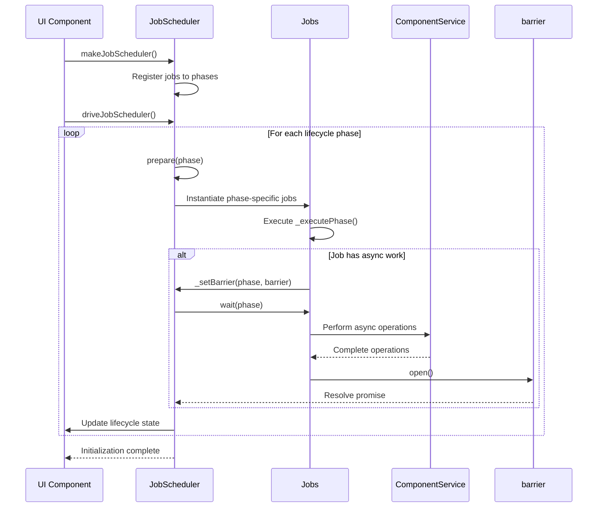

# Lifecycle Phases and Job Execution

<cite>
**Referenced Files in This Document**   
- [lifecycle.ts](file://packages/h5-builder/src/jobs/lifecycle.ts)
- [get-schema-job.ts](file://packages/h5-builder/src/jobs/get-schema-job.ts)
- [build-tree-job.ts](file://packages/h5-builder/src/jobs/build-tree-job.ts)
- [init-first-screen-data-job.ts](file://packages/h5-builder/src/jobs/init-first-screen-data-job.ts)
- [demo-progressive.tsx](file://packages/h5-builder/src/demo-progressive.tsx)
- [job-scheduler.ts](file://packages/h5-builder/src/bedrock/launch/job-scheduler.ts)
- [abstract-job.ts](file://packages/h5-builder/src/bedrock/launch/abstract-job.ts)
- [barrier.ts](file://packages/h5-builder/src/bedrock/async/barrier.ts)
- [load-components-job.ts](file://packages/h5-builder/src/jobs/load-components-job.ts)
- [ensure-view-ready.ts](file://packages/h5-builder/src/jobs/ensure-view-ready.ts)
- [trigger-render-job.ts](file://packages/h5-builder/src/jobs/trigger-render-job.ts)
- [activate-tree-job.ts](file://packages/h5-builder/src/jobs/activate-tree-job.ts)
- [component.service.ts](file://packages/h5-builder/src/services/component.service.ts)
</cite>

## Table of Contents
1. [PageLifecycle Enum Overview](#pagelifecycle-enum-overview)
2. [Job Registration and Scheduling](#job-registration-and-scheduling)
3. [Execution Sequence and Phase Progression](#execution-sequence-and-phase-progression)
4. [Barrier Synchronization Mechanism](#barrier-synchronization-mechanism)
5. [Error Handling Strategies](#error-handling-strategies)
6. [Component Service Integration](#component-service-integration)
7. [Lifecycle Phase Details](#lifecycle-phase-details)
8. [Job Execution Flow Diagram](#job-execution-flow-diagram)

## PageLifecycle Enum Overview

The PageLifecycle enum defines the sequential phases of page initialization and rendering in the application. Each phase represents a distinct stage in the application's startup process, from initial schema retrieval to idle state. The lifecycle phases are designed to support a progressive rendering approach, allowing for optimal resource loading and user experience.

The enum values include:
- Open: Initial phase for schema retrieval and component registration
- LoadComponentLogic: Phase for loading component model logic
- Prepare: Phase for building the model tree and preparing components
- RenderReady: Phase indicating all resources are ready for rendering
- Render: Phase for triggering actual rendering
- Completed: Phase for post-render data initialization
- Idle: Final phase for background tasks

**Section sources**
- [lifecycle.ts](file://packages/h5-builder/src/jobs/lifecycle.ts#L1-L17)

## Job Registration and Scheduling

The JobScheduler orchestrates the execution of various jobs across different lifecycle phases. Jobs are registered to specific phases using the registerJob method, which associates a job class with a particular lifecycle phase. The scheduler manages the instantiation and execution of these jobs in the correct sequence.

Key jobs registered in the system include:
- GetSchemaJob: Registered to Open phase for schema retrieval
- LoadComponentsJob: Registered to LoadComponentLogic phase for component loading
- BuildTreeJob: Registered to Prepare phase for model tree construction
- EnsureViewReadyJob: Registered to RenderReady phase for view preparation
- TriggerRenderJob and ActivateTreeJob: Registered to Render phase for rendering and activation
- InitFirstScreenDataJob: Registered to Completed phase for data initialization

**Section sources**
- [demo-progressive.tsx](file://packages/h5-builder/src/demo-progressive.tsx#L76-L84)
- [job-scheduler.ts](file://packages/h5-builder/src/bedrock/launch/job-scheduler.ts#L36-L46)

## Execution Sequence and Phase Progression

The execution sequence follows a strict progression through the lifecycle phases, controlled by the prepare() and wait() methods of the JobScheduler. The prepare() method initializes jobs for a specific phase, while the wait() method ensures all asynchronous operations in that phase are completed before proceeding.

The sequence begins with the Open phase and progresses through each subsequent phase in order. Each phase's execution follows this pattern:
1. Call prepare(phase) to instantiate and initialize jobs for the phase
2. Update UI to reflect current lifecycle phase
3. Call wait(phase) to await completion of all asynchronous operations
4. Proceed to the next phase only after all jobs in the current phase have completed

This pattern ensures proper sequencing and dependency management between phases.

```mermaid
flowchart TD
A[Start] --> B[prepare(Open)]
B --> C[wait(Open)]
C --> D[prepare(LoadComponentLogic)]
D --> E[wait(LoadComponentLogic)]
E --> F[prepare(Prepare)]
F --> G[wait(Prepare)]
G --> H[prepare(RenderReady)]
H --> I[wait(RenderReady)]
I --> J[prepare(Render)]
J --> K[wait(Render)]
K --> L[prepare(Completed)]
L --> M[wait(Completed)]
M --> N[prepare(Idle)]
N --> O[wait(Idle)]
O --> P[End]
```

**Diagram sources **
- [demo-progressive.tsx](file://packages/h5-builder/src/demo-progressive.tsx#L108-L177)

**Section sources**
- [demo-progressive.tsx](file://packages/h5-builder/src/demo-progressive.tsx#L108-L177)

## Barrier Synchronization Mechanism

The system employs a barrier synchronization mechanism to coordinate asynchronous operations across lifecycle phases. The Barrier class implements a synchronization primitive that starts in a closed state and can be opened permanently, allowing dependent operations to proceed.

Each job can create barriers for specific phases using the _setBarrier method. When a job has asynchronous work that must complete before the phase can progress, it creates a barrier and opens it upon completion. The JobScheduler's wait method collects all barriers for the current phase and waits for them to be opened using Promise.all.

The barrier mechanism provides:
- Non-blocking initialization: Jobs can set up asynchronous operations without blocking phase progression
- Completion signaling: Jobs signal completion by opening their barriers
- Error propagation: Barrier rejections are propagated through the promise chain
- Resource cleanup: Barriers are automatically cleared after use to prevent memory leaks

**Section sources**
- [abstract-job.ts](file://packages/h5-builder/src/bedrock/launch/abstract-job.ts#L36-L42)
- [barrier.ts](file://packages/h5-builder/src/bedrock/async/barrier.ts#L1-L41)
- [job-scheduler.ts](file://packages/h5-builder/src/bedrock/launch/job-scheduler.ts#L103-L119)

## Error Handling Strategies

The system implements comprehensive error handling strategies to ensure robust operation during job execution. Errors are handled at multiple levels:

For job-level errors:
- Jobs wrap their execution in try-catch blocks
- Errors are logged with descriptive messages
- Failed operations do not block the entire initialization process
- Placeholder components are used when critical resources fail to load

For barrier-level errors:
- Barrier rejections are propagated through the promise chain
- Errors in one job do not prevent other jobs from completing
- The system continues to the next phase even if some non-critical jobs fail

For application-level errors:
- The useLaunch hook catches initialization errors
- A panic state is set to display error UI
- Users can refresh to retry initialization
- Performance metrics are still collected even in error scenarios

**Section sources**
- [get-schema-job.ts](file://packages/h5-builder/src/jobs/get-schema-job.ts#L50-L52)
- [init-first-screen-data-job.ts](file://packages/h5-builder/src/jobs/init-first-screen-data-job.ts#L53-L56)
- [demo-progressive.tsx](file://packages/h5-builder/src/demo-progressive.tsx#L229-L232)

## Component Service Integration

The ComponentService plays a central role in the lifecycle management system, providing key functionality for component registration, loading, and tree construction. It integrates with the job scheduling system through several critical methods:

- registerAsync: Registers components with their model and view loaders, including priority and delay configuration
- preloadComponentsUnified: Preloads all component resources using a unified queue strategy
- buildModelTree: Constructs the model tree from the schema during the Prepare phase
- getModelTreeReady: Returns a promise that resolves when all model resources are loaded
- getViewsReady: Returns a promise that resolves when all view resources are loaded
- getModelTree: Retrieves the constructed model tree for rendering

The service implements sophisticated loading strategies including priority-based loading, dependency management, and concurrent loading with configurable limits.

**Section sources**
- [component.service.ts](file://packages/h5-builder/src/services/component.service.ts#L286-L317)
- [get-schema-job.ts](file://packages/h5-builder/src/jobs/get-schema-job.ts#L64)
- [load-components-job.ts](file://packages/h5-builder/src/jobs/load-components-job.ts#L54)

## Lifecycle Phase Details

### Open Phase
The Open phase initiates the page lifecycle by retrieving the page schema and registering component loaders. The GetSchemaJob executes in this phase, performing:
- Remote schema retrieval via SchemaService
- Registration of all component loaders with their respective priorities and delay ranges
- Preloading of component resources

This phase sets the foundation for subsequent operations by establishing the component registry.

**Section sources**
- [get-schema-job.ts](file://packages/h5-builder/src/jobs/get-schema-job.ts#L28-L30)
- [lifecycle.ts](file://packages/h5-builder/src/jobs/lifecycle.ts#L3)

### LoadComponentLogic Phase
The LoadComponentLogic phase focuses on loading component model logic. The LoadComponentsJob executes here, using the ComponentService to:
- Load all component model resources concurrently
- Apply priority-based loading strategies
- Respect configured delay ranges for staggered loading
- Ensure all model resources are available before proceeding

This phase ensures that all component logic is ready before model tree construction.

**Section sources**
- [load-components-job.ts](file://packages/h5-builder/src/jobs/load-components-job.ts#L27-L29)
- [lifecycle.ts](file://packages/h5-builder/src/jobs/lifecycle.ts#L5)

### Prepare Phase
The Prepare phase constructs the model tree from the schema. The BuildTreeJob executes in this phase, performing:
- Retrieval of the schema from SchemaService
- Validation of the schema structure
- Recursive construction of the model tree using registered component models
- Establishment of parent-child relationships between models

This phase creates the logical structure of the page that will be rendered.

**Section sources**
- [build-tree-job.ts](file://packages/h5-builder/src/jobs/build-tree-job.ts#L32-L34)
- [lifecycle.ts](file://packages/h5-builder/src/jobs/lifecycle.ts#L7)

### RenderReady Phase
The RenderReady phase ensures all view resources are loaded and ready. The EnsureViewReadyJob executes here, using ComponentService to:
- Wait for all view resources to be loaded
- Complete any remaining view preparation tasks
- Signal readiness for rendering

This phase guarantees that all visual components are available before rendering begins.

**Section sources**
- [ensure-view-ready.ts](file://packages/h5-builder/src/jobs/ensure-view-ready.ts#L34-L36)
- [lifecycle.ts](file://packages/h5-builder/src/jobs/lifecycle.ts#L9)

### Render Phase
The Render phase triggers the actual rendering of the page. Two jobs execute in this phase:
- TriggerRenderJob: Sets the model tree in the React state, initiating the rendering process
- ActivateTreeJob: Activates the component tree, starting timers and reporting analytics

This phase makes the page visible to the user and activates interactive elements.

**Section sources**
- [trigger-render-job.ts](file://packages/h5-builder/src/jobs/trigger-render-job.ts#L27-L29)
- [activate-tree-job.ts](file://packages/h5-builder/src/jobs/activate-tree-job.ts#L37-L39)
- [lifecycle.ts](file://packages/h5-builder/src/jobs/lifecycle.ts#L11)

### Completed Phase
The Completed phase handles post-render data initialization. The InitFirstScreenDataJob executes here, performing:
- Retrieval of the root model from ComponentService
- Initialization of first-screen data through the model's init method
- Background data fetching for enhanced user experience

This phase populates the rendered components with actual data.

**Section sources**
- [init-first-screen-data-job.ts](file://packages/h5-builder/src/jobs/init-first-screen-data-job.ts#L37-L39)
- [lifecycle.ts](file://packages/h5-builder/src/jobs/lifecycle.ts#L14)

### Idle Phase
The Idle phase handles background tasks and cleanup. No specific jobs are registered to this phase in the current implementation, but it serves as:
- A marker for completion of the main initialization sequence
- A potential hook for future background tasks
- A state for monitoring and performance reporting

This phase indicates that the page is fully operational.

**Section sources**
- [lifecycle.ts](file://packages/h5-builder/src/jobs/lifecycle.ts#L16)

## Job Execution Flow Diagram



**Diagram sources **
- [demo-progressive.tsx](file://packages/h5-builder/src/demo-progressive.tsx#L66-L86)
- [job-scheduler.ts](file://packages/h5-builder/src/bedrock/launch/job-scheduler.ts#L65-L82)
- [abstract-job.ts](file://packages/h5-builder/src/bedrock/launch/abstract-job.ts#L32-L34)

**Section sources**
- [demo-progressive.tsx](file://packages/h5-builder/src/demo-progressive.tsx#L66-L86)
- [job-scheduler.ts](file://packages/h5-builder/src/bedrock/launch/job-scheduler.ts#L65-L82)
- [abstract-job.ts](file://packages/h5-builder/src/bedrock/launch/abstract-job.ts#L32-L34)