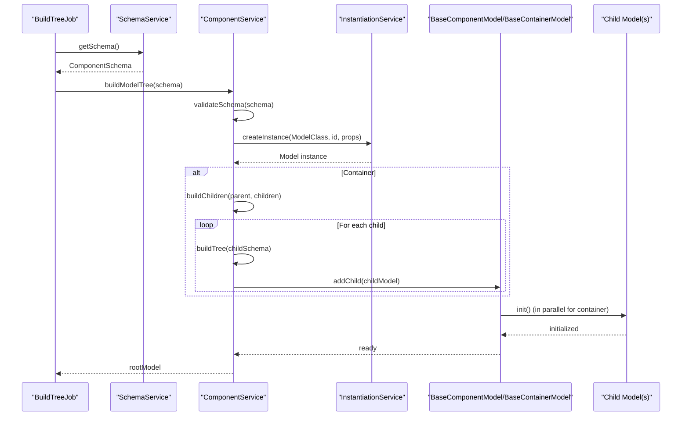
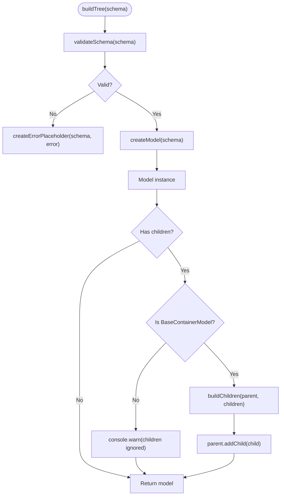
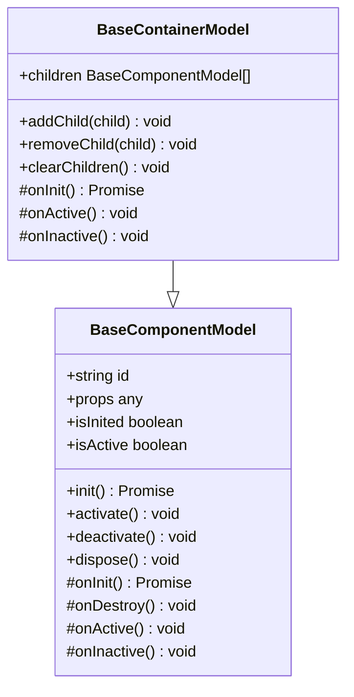
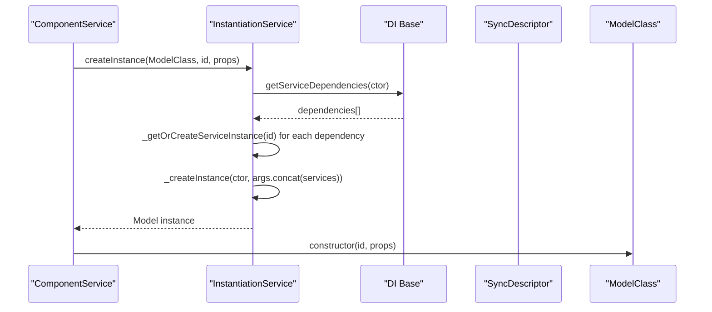
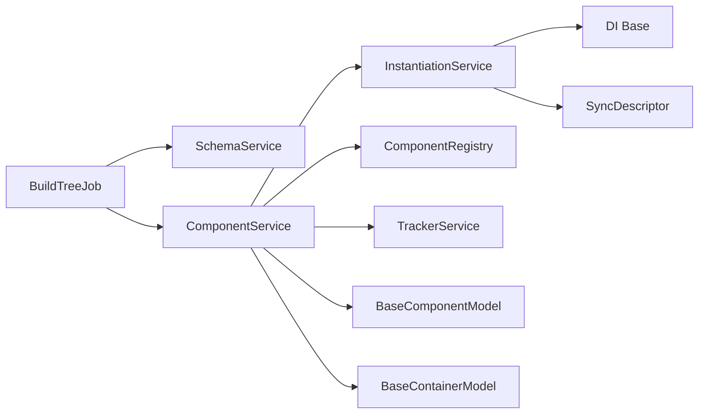

# Model Tree Construction Process

<cite>
**Referenced Files in This Document**
- [build-tree-job.ts](file://packages/h5-builder/src/jobs/build-tree-job.ts)
- [component.service.ts](file://packages/h5-builder/src/services/component.service.ts)
- [model.ts](file://packages/h5-builder/src/bedrock/model.ts)
- [instantiation-service.ts](file://packages/h5-builder/src/bedrock/di/instantiation-service.ts)
- [descriptor.ts](file://packages/h5-builder/src/bedrock/di/descriptor.ts)
- [base.ts](file://packages/h5-builder/src/bedrock/di/base.ts)
- [service-identifiers.ts](file://packages/h5-builder/src/services/service-identifiers.ts)
- [schema.service.ts](file://packages/h5-builder/src/services/schema.service.ts)
- [model.test.ts](file://packages/h5-builder/src/__tests__/model.test.ts)
- [grid-layout-container.model.ts](file://packages/h5-builder/src/components/grid-layout-container/grid-layout-container.model.ts)
- [simple-list.model.ts](file://packages/h5-builder/src/components/simple-list/simple-list.model.ts)
- [index.ts](file://packages/h5-builder/src/placeholder/index.ts)
</cite>

## Table of Contents
1. [Introduction](#introduction)
2. [Project Structure](#project-structure)
3. [Core Components](#core-components)
4. [Architecture Overview](#architecture-overview)
5. [Detailed Component Analysis](#detailed-component-analysis)
6. [Dependency Analysis](#dependency-analysis)
7. [Performance Considerations](#performance-considerations)
8. [Troubleshooting Guide](#troubleshooting-guide)
9. [Conclusion](#conclusion)

## Introduction
This document explains how the model tree is constructed in the system. It focuses on how BuildTreeJob orchestrates the process, how ComponentService transforms a ComponentSchema into a hierarchical tree of BaseComponentModel instances, and how BaseContainerModel manages child models through addChild() and initializes them via onInit(). It also covers DI-driven instantiation, passing props from schema to model constructors, handling schema validation errors, avoiding circular dependencies, and optimizing performance for large model trees.

## Project Structure
The model tree construction spans several layers:
- Jobs orchestrate page lifecycle phases and delegate to services.
- Services encapsulate business logic, including schema validation, model creation, and asynchronous loading.
- Models define the base classes and lifecycle hooks for components and containers.
- DI provides dependency injection and cycles detection during instantiation.
- Tests demonstrate parent-child relationships and lifecycle behavior.

```mermaid
graph TB
subgraph "Jobs"
BTJ["BuildTreeJob<br/>build-tree-job.ts"]
end
subgraph "Services"
CS["ComponentService<br/>component.service.ts"]
SS["SchemaService<br/>schema.service.ts"]
SI["Service Identifiers<br/>service-identifiers.ts"]
end
subgraph "Models"
BCM["BaseComponentModel<br/>bedrock/model.ts"]
BCT["BaseContainerModel<br/>bedrock/model.ts"]
GLCM["GridLayoutContainerModel<br/>components/grid-layout-container/grid-layout-container.model.ts"]
SL["SimpleListModel<br/>components/simple-list/simple-list.model.ts"]
EP["ErrorPlaceholderModel<br/>placeholder/index.ts"]
end
subgraph "DI"
IS["InstantiationService<br/>bedrock/di/instantiation-service.ts"]
SD["SyncDescriptor<br/>bedrock/di/descriptor.ts"]
DI["DI Base<br/>bedrock/di/base.ts"]
end
BTJ --> SS
BTJ --> CS
CS --> IS
CS --> BCM
CS --> BCT
CS --> EP
GLCM --> BCT
SL --> BCT
IS --> DI
IS --> SD
CS --> SI
```

**Diagram sources**
- [build-tree-job.ts](file://packages/h5-builder/src/jobs/build-tree-job.ts#L1-L59)
- [component.service.ts](file://packages/h5-builder/src/services/component.service.ts#L1-L735)
- [model.ts](file://packages/h5-builder/src/bedrock/model.ts#L1-L243)
- [instantiation-service.ts](file://packages/h5-builder/src/bedrock/di/instantiation-service.ts#L1-L468)
- [descriptor.ts](file://packages/h5-builder/src/bedrock/di/descriptor.ts#L1-L32)
- [base.ts](file://packages/h5-builder/src/bedrock/di/base.ts#L1-L74)
- [service-identifiers.ts](file://packages/h5-builder/src/services/service-identifiers.ts#L1-L20)
- [schema.service.ts](file://packages/h5-builder/src/services/schema.service.ts#L1-L38)
- [grid-layout-container.model.ts](file://packages/h5-builder/src/components/grid-layout-container/grid-layout-container.model.ts#L1-L44)
- [simple-list.model.ts](file://packages/h5-builder/src/components/simple-list/simple-list.model.ts#L1-L15)
- [index.ts](file://packages/h5-builder/src/placeholder/index.ts#L1-L29)

**Section sources**
- [build-tree-job.ts](file://packages/h5-builder/src/jobs/build-tree-job.ts#L1-L59)
- [component.service.ts](file://packages/h5-builder/src/services/component.service.ts#L1-L735)
- [model.ts](file://packages/h5-builder/src/bedrock/model.ts#L1-L243)
- [instantiation-service.ts](file://packages/h5-builder/src/bedrock/di/instantiation-service.ts#L1-L468)
- [descriptor.ts](file://packages/h5-builder/src/bedrock/di/descriptor.ts#L1-L32)
- [base.ts](file://packages/h5-builder/src/bedrock/di/base.ts#L1-L74)
- [service-identifiers.ts](file://packages/h5-builder/src/services/service-identifiers.ts#L1-L20)
- [schema.service.ts](file://packages/h5-builder/src/services/schema.service.ts#L1-L38)
- [grid-layout-container.model.ts](file://packages/h5-builder/src/components/grid-layout-container/grid-layout-container.model.ts#L1-L44)
- [simple-list.model.ts](file://packages/h5-builder/src/components/simple-list/simple-list.model.ts#L1-L15)
- [index.ts](file://packages/h5-builder/src/placeholder/index.ts#L1-L29)

## Core Components
- BuildTreeJob: Orchestrates the Prepare lifecycle phase to build the model tree by retrieving the schema and delegating to ComponentService.
- ComponentService: Validates schema, resolves model classes, creates instances via DI, builds children recursively, and handles errors by returning placeholders.
- BaseComponentModel: Provides lifecycle hooks (init, activate, deactivate, dispose), reactive state, and resource registration.
- BaseContainerModel: Manages children, initializes them in parallel by default, and activates/deactivates them automatically.
- DI System: InstantiationService constructs instances, injects services, detects cycles, and reports errors.
- Placeholder Models: ErrorPlaceholderModel and others represent failures gracefully.

**Section sources**
- [build-tree-job.ts](file://packages/h5-builder/src/jobs/build-tree-job.ts#L1-L59)
- [component.service.ts](file://packages/h5-builder/src/services/component.service.ts#L130-L244)
- [model.ts](file://packages/h5-builder/src/bedrock/model.ts#L1-L243)
- [instantiation-service.ts](file://packages/h5-builder/src/bedrock/di/instantiation-service.ts#L1-L468)
- [index.ts](file://packages/h5-builder/src/placeholder/index.ts#L1-L29)

## Architecture Overview
The model tree construction follows a clear pipeline:
1. BuildTreeJob retrieves the schema from SchemaService and calls ComponentService.buildModelTree().
2. ComponentService validates the schema and creates the root model via DI.
3. If the root model is a container, ComponentService recursively builds children and adds them via addChild().
4. BaseContainerModel.onInit() initializes all children in parallel by default.
5. Errors during schema validation or child building are handled by returning ErrorPlaceholderModel.



**Diagram sources**
- [build-tree-job.ts](file://packages/h5-builder/src/jobs/build-tree-job.ts#L46-L58)
- [component.service.ts](file://packages/h5-builder/src/services/component.service.ts#L135-L209)
- [model.ts](file://packages/h5-builder/src/bedrock/model.ts#L168-L242)
- [instantiation-service.ts](file://packages/h5-builder/src/bedrock/di/instantiation-service.ts#L150-L176)

## Detailed Component Analysis

### BuildTreeJob Orchestration
- Retrieves schema from SchemaService during the Prepare lifecycle phase.
- Calls ComponentService.buildModelTree(schema) to construct the root model.
- Uses console timing around the build operation.

**Section sources**
- [build-tree-job.ts](file://packages/h5-builder/src/jobs/build-tree-job.ts#L46-L58)
- [schema.service.ts](file://packages/h5-builder/src/services/schema.service.ts#L17-L32)

### ComponentService: Schema Validation and Model Creation
- Validates schema presence of type, id, and registered component type.
- Resolves ModelClass from ComponentRegistry and creates instances via DI with id and props.
- Recursively builds children for container models and adds them via addChild().
- Wraps errors into ErrorPlaceholderModel and continues building siblings.



**Diagram sources**
- [component.service.ts](file://packages/h5-builder/src/services/component.service.ts#L135-L209)
- [component.service.ts](file://packages/h5-builder/src/services/component.service.ts#L211-L244)

**Section sources**
- [component.service.ts](file://packages/h5-builder/src/services/component.service.ts#L135-L209)
- [component.service.ts](file://packages/h5-builder/src/services/component.service.ts#L211-L244)

### BaseContainerModel: Child Management and Initialization
- addChild(child) registers child and ensures disposal when parent is disposed.
- onInit() initializes all children in parallel using Promise.all.
- onActive()/onInactive() activate/deactivate all children.



**Diagram sources**
- [model.ts](file://packages/h5-builder/src/bedrock/model.ts#L1-L243)

**Section sources**
- [model.ts](file://packages/h5-builder/src/bedrock/model.ts#L168-L242)

### DI and Service Injection
- Service identifiers are created via decorators and injected into constructors using @I*.
- InstantiationService resolves dependencies, constructs instances, and prevents cycles.
- SyncDescriptor describes constructors with optional static arguments and delayed instantiation support.



**Diagram sources**
- [component.service.ts](file://packages/h5-builder/src/services/component.service.ts#L164-L185)
- [instantiation-service.ts](file://packages/h5-builder/src/bedrock/di/instantiation-service.ts#L150-L176)
- [base.ts](file://packages/h5-builder/src/bedrock/di/base.ts#L25-L39)
- [descriptor.ts](file://packages/h5-builder/src/bedrock/di/descriptor.ts#L8-L21)
- [service-identifiers.ts](file://packages/h5-builder/src/services/service-identifiers.ts#L1-L20)

**Section sources**
- [instantiation-service.ts](file://packages/h5-builder/src/bedrock/di/instantiation-service.ts#L216-L254)
- [descriptor.ts](file://packages/h5-builder/src/bedrock/di/descriptor.ts#L8-L21)
- [base.ts](file://packages/h5-builder/src/bedrock/di/base.ts#L25-L39)
- [service-identifiers.ts](file://packages/h5-builder/src/services/service-identifiers.ts#L1-L20)

### Props Passing from Schema to Model Constructors
- ComponentService passes schema.id and schema.props to the model constructor via DI.
- Tests demonstrate that props are available inside onInit() and can be mutated safely.

**Section sources**
- [component.service.ts](file://packages/h5-builder/src/services/component.service.ts#L164-L185)
- [model.test.ts](file://packages/h5-builder/src/__tests__/model.test.ts#L12-L29)

### Parent-Child Relationships Example: TestContainerModel
- The test suite shows a container model adding children during initialization and verifying disposal and removal behaviors.
- This mirrors the pattern used by BaseContainerModel, which initializes children in parallel by default.

**Section sources**
- [model.test.ts](file://packages/h5-builder/src/__tests__/model.test.ts#L31-L42)
- [model.test.ts](file://packages/h5-builder/src/__tests__/model.test.ts#L180-L231)
- [model.ts](file://packages/h5-builder/src/bedrock/model.ts#L199-L209)

### Example Container Models
- GridLayoutContainerModel demonstrates a container that explicitly initializes and activates children in custom lifecycle methods.
- SimpleListModel shows a minimal container relying on BaseContainerModel defaults.

**Section sources**
- [grid-layout-container.model.ts](file://packages/h5-builder/src/components/grid-layout-container/grid-layout-container.model.ts#L1-L44)
- [simple-list.model.ts](file://packages/h5-builder/src/components/simple-list/simple-list.model.ts#L1-L15)

## Dependency Analysis
- BuildTreeJob depends on SchemaService and ComponentService.
- ComponentService depends on DI (InstantiationService), Registry, and TrackerService.
- Models depend on BaseComponentModel/BaseContainerModel and MobX observability.
- DI depends on descriptors and base DI utilities.



**Diagram sources**
- [build-tree-job.ts](file://packages/h5-builder/src/jobs/build-tree-job.ts#L1-L59)
- [component.service.ts](file://packages/h5-builder/src/services/component.service.ts#L1-L735)
- [instantiation-service.ts](file://packages/h5-builder/src/bedrock/di/instantiation-service.ts#L1-L468)
- [descriptor.ts](file://packages/h5-builder/src/bedrock/di/descriptor.ts#L1-L32)
- [base.ts](file://packages/h5-builder/src/bedrock/di/base.ts#L1-L74)
- [model.ts](file://packages/h5-builder/src/bedrock/model.ts#L1-L243)

**Section sources**
- [build-tree-job.ts](file://packages/h5-builder/src/jobs/build-tree-job.ts#L1-L59)
- [component.service.ts](file://packages/h5-builder/src/services/component.service.ts#L1-L735)
- [instantiation-service.ts](file://packages/h5-builder/src/bedrock/di/instantiation-service.ts#L1-L468)
- [descriptor.ts](file://packages/h5-builder/src/bedrock/di/descriptor.ts#L1-L32)
- [base.ts](file://packages/h5-builder/src/bedrock/di/base.ts#L1-L74)
- [model.ts](file://packages/h5-builder/src/bedrock/model.ts#L1-L243)

## Performance Considerations
- Parallel initialization: BaseContainerModel.onInit() initializes children in parallel using Promise.all. This reduces total initialization time for large trees.
- Asynchronous loading: ComponentService supports preloading models/views with concurrency controls and unified queues to minimize blocking.
- Lazy loading: Async registration allows delaying component loading until needed, reducing initial payload.
- Caching: Model and view caches prevent repeated loads and improve subsequent renders.
- Avoid deep nesting: Excessive nesting increases memory and initialization overhead; consider flattening where appropriate.
- Minimize heavy work in onInit: Offload expensive operations to background tasks or defer until activation.

[No sources needed since this section provides general guidance]

## Troubleshooting Guide
Common issues and resolutions:
- Schema validation errors:
  - Missing type or id: ComponentService throws and returns ErrorPlaceholderModel. Ensure schema includes type and id and that the type is registered.
- Unknown component type:
  - ComponentService throws and returns ErrorPlaceholderModel. Register the model type before building the tree.
- Child build errors:
  - ComponentService catches errors per child and inserts ErrorPlaceholderModel, allowing the rest of the tree to render.
- Circular dependencies:
  - InstantiationService detects cycles and throws errors. Review service dependencies and DI decorators to eliminate cycles.
- Large model trees:
  - Use parallel initialization and asynchronous loading. Consider lazy loading and caching strategies.

**Section sources**
- [component.service.ts](file://packages/h5-builder/src/services/component.service.ts#L211-L244)
- [component.service.ts](file://packages/h5-builder/src/services/component.service.ts#L135-L209)
- [instantiation-service.ts](file://packages/h5-builder/src/bedrock/di/instantiation-service.ts#L291-L374)
- [index.ts](file://packages/h5-builder/src/placeholder/index.ts#L1-L29)

## Conclusion
The model tree construction process is a robust pipeline that validates schemas, resolves and instantiates models via DI, and recursively builds hierarchical trees. Containers manage children efficiently with parallel initialization and lifecycle hooks. The system gracefully handles errors by substituting placeholders and provides strong safeguards against circular dependencies. For large trees, leveraging parallelization, asynchronous loading, and caching yields significant performance improvements.