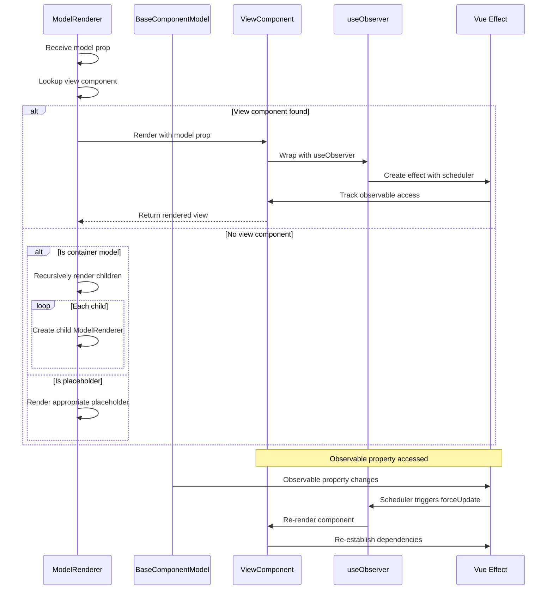

# View Rendering and Reactivity System

<cite>
**Referenced Files in This Document**   
- [model-renderer.tsx](file://packages/h5-builder/src/components/model-renderer.tsx)
- [useObserver.ts](file://packages/mobx-vue-lite/src/useObserver.ts)
- [observer.ts](file://packages/mobx-vue-lite/src/observer.ts)
- [mobx.ts](file://packages/mobx-vue-lite/src/mobx.ts)
- [product-card.model.ts](file://packages/h5-builder/src/components/product-card/product-card.model.ts)
- [product-card.view.tsx](file://packages/h5-builder/src/components/product-card/product-card.view.tsx)
- [tabs-container.model.ts](file://packages/h5-builder/src/components/tabs-container/tabs-container.model.ts)
- [tabs-container.view.tsx](file://packages/h5-builder/src/components/tabs-container/tabs-container.view.tsx)
- [virtual-list.model.ts](file://packages/h5-builder/src/components/virtual-list/virtual-list.model.ts)
- [virtual-list.view.tsx](file://packages/h5-builder/src/components/virtual-list/virtual-list.view.tsx)
- [model.ts](file://packages/h5-builder/src/bedrock/model.ts)
- [useLocalObservable.ts](file://packages/mobx-vue-lite/src/useLocalObservable.ts)
- [staticRendering.ts](file://packages/mobx-vue-lite/src/staticRendering.ts)
</cite>

## Table of Contents
1. [Introduction](#introduction)
2. [Model-View Mapping Mechanism](#model-view-mapping-mechanism)
3. [Reactivity System Integration](#reactivity-system-integration)
4. [Rendering Process Flow](#rendering-process-flow)
5. [Component Lifecycle and State Management](#component-lifecycle-and-state-management)
6. [Virtualization and Performance Optimization](#virtualization-and-performance-optimization)
7. [Reactivity Pitfalls and Debugging](#reactivity-pitfalls-and-debugging)
8. [Conclusion](#conclusion)

## Introduction
This document provides comprehensive documentation for the view rendering mechanism powered by mobx-vue-lite's reactivity system. The system enables efficient, reactive UI updates by establishing a clear separation between model state and view components. The ModelRenderer component recursively traverses the model tree and maps each BaseComponentModel to its corresponding React component view. The mobx-vue-lite library integrates Vue's reactivity system (@vue/reactivity) with React rendering, allowing components to automatically re-render when model properties change. This documentation details the integration architecture, rendering process, reactivity mechanisms, and best practices for debugging common issues.

## Model-View Mapping Mechanism

The view rendering system implements a model-view mapping pattern that decouples business logic from UI presentation. The ModelRenderer component serves as the central dispatcher that resolves model instances to their corresponding view components through a registration system.

The model-view mapping is established through a Map-based registry that associates model constructors with their corresponding view components. This registry is populated during application initialization through the registerModelView and registerModelViews functions. The ModelRenderer performs a lookup using the model's constructor to find the appropriate view component, enabling type-safe component resolution.

Container components that inherit from BaseContainerModel receive special handling in the ModelRenderer. When a container model is encountered without a registered view component, the renderer automatically traverses its children and renders them recursively. This enables a flexible component hierarchy where container components can either have custom view implementations or rely on default recursive rendering behavior.

**Diagram sources**
- [model-renderer.tsx](file://packages/h5-builder/src/components/model-renderer.tsx#L50-L105)

**Section sources**
- [model-renderer.tsx](file://packages/h5-builder/src/components/model-renderer.tsx#L1-L105)

## Reactivity System Integration

The reactivity system is powered by mobx-vue-lite, which bridges Vue's reactivity system (@vue/reactivity) with React's rendering model. The core integration is achieved through the useObserver hook, which establishes reactive dependencies between model state and view rendering.

The useObserver hook leverages Vue's effect system to track observable access during component rendering. When a component accesses observable properties from its model, the effect system automatically establishes a dependency relationship. When those observables change, the scheduler triggers a re-render through React's useReducer hook. This creates a seamless reactivity chain where model state changes automatically propagate to the UI.

The observer higher-order component (HOC) wraps React function components with the useObserver hook, providing a convenient API for creating reactive components. It also applies React.memo for performance optimization and copies static properties from the original component to preserve functionality like defaultProps and propTypes. This integration allows developers to create reactive components without directly managing subscription lifecycles.

**Diagram sources**
- [useObserver.ts](file://packages/mobx-vue-lite/src/useObserver.ts#L19-L58)
- [observer.ts](file://packages/mobx-vue-lite/src/observer.ts#L16-L51)
- [model.ts](file://packages/h5-builder/src/bedrock/model.ts#L10-L243)

**Section sources**
- [useObserver.ts](file://packages/mobx-vue-lite/src/useObserver.ts#L1-L58)
- [observer.ts](file://packages/mobx-vue-lite/src/observer.ts#L1-L51)
- [mobx.ts](file://packages/mobx-vue-lite/src/mobx.ts#L1-L65)

## Rendering Process Flow

The rendering process begins with the ModelRenderer receiving a BaseComponentModel instance as a prop. The component first attempts to resolve the appropriate view component by looking up the model's constructor in the modelViewMap registry. If a matching view component is found, it is rendered with the model as a prop. If no view component is registered, the renderer applies fallback strategies based on the model type.

For container components, the ModelRenderer recursively processes each child model, creating a tree of ModelRenderer instances that traverse the entire model hierarchy. This recursive traversal ensures that all components in the model tree are properly rendered according to their type-specific view components. The recursion terminates at leaf nodes, which are rendered using their registered view components or appropriate placeholders.

The reactivity system establishes dependency tracking during the initial render. When a view component accesses observable properties from its model (such as data, loading, or error states), the useObserver hook records these dependencies. Subsequent changes to these observables trigger the effect scheduler, which initiates a re-render of the dependent component. This process ensures that only components affected by state changes are updated, optimizing rendering performance.

**Diagram sources**
- [model-renderer.tsx](file://packages/h5-builder/src/components/model-renderer.tsx#L50-L105)
- [product-card.view.tsx](file://packages/h5-builder/src/components/product-card/product-card.view.tsx#L22-L81)
- [useObserver.ts](file://packages/mobx-vue-lite/src/useObserver.ts#L19-L58)

**Section sources**
- [model-renderer.tsx](file://packages/h5-builder/src/components/model-renderer.tsx#L1-L105)
- [product-card.view.tsx](file://packages/h5-builder/src/components/product-card/product-card.view.tsx#L1-L81)

## Component Lifecycle and State Management

Components in this system follow a well-defined lifecycle managed through the BaseComponentModel class. The lifecycle begins with construction, where the model is initialized with an ID and props. During construction, the model is wrapped with Vue's reactive system, making all its properties observable. This reactivity enables automatic dependency tracking when view components access model state.

The initialization phase is triggered by the async init() method, which ensures onInit is called only once. The onInit lifecycle hook is where components typically set up data loading, event subscriptions, and other initialization logic. For container components, the default onInit implementation initializes all child components in parallel using Promise.all, ensuring efficient startup performance.

State management is centralized within the model layer, with view components serving as pure presentational components. Models expose observable properties like data, loading, and error that represent the component's state. They also provide computed properties that derive values from the base state, such as the ProductCardModel's shouldShowPrice and formattedPrice properties. These computed properties are themselves reactive and automatically update when their dependencies change.

**Diagram sources**
- [model.ts](file://packages/h5-builder/src/bedrock/model.ts#L10-L243)
- [product-card.model.ts](file://packages/h5-builder/src/components/product-card/product-card.model.ts#L29-L133)

**Section sources**
- [model.ts](file://packages/h5-builder/src/bedrock/model.ts#L10-L243)
- [product-card.model.ts](file://packages/h5-builder/src/components/product-card/product-card.model.ts#L1-L133)

## Virtualization and Performance Optimization

The system implements sophisticated virtualization strategies to optimize rendering performance for large lists and complex component hierarchies. The VirtualListModel and VirtualListView components work together to render only the items currently visible in the viewport, significantly reducing the number of DOM nodes and React components that need to be managed.

The virtualization system supports both fixed-height and dynamic-height modes. In fixed-height mode, the system can efficiently calculate item positions without measuring each element. In dynamic-height mode, the system uses a height cache and offset cache to store measured dimensions, avoiding expensive re-measurement when possible. The VirtualListItem component uses ResizeObserver and requestAnimationFrame to accurately measure and report its height to the model, enabling precise scrolling calculations.

Container components like TabsContainerModel implement additional optimization strategies such as lazy loading and idle-time prewarming. The TabsContainer only initializes the currently active tab during startup, deferring initialization of other tabs until they are accessed. It also schedules prewarming of adjacent tabs after a short delay, creating a responsive user experience while minimizing initial load time. This combination of virtualization and lazy loading ensures optimal performance even with complex, data-intensive interfaces.

**Diagram sources**
- [virtual-list.model.ts](file://packages/h5-builder/src/components/virtual-list/virtual-list.model.ts#L1-L217)
- [virtual-list.view.tsx](file://packages/h5-builder/src/components/virtual-list/virtual-list.view.tsx#L1-L129)
- [tabs-container.model.ts](file://packages/h5-builder/src/components/tabs-container/tabs-container.model.ts#L29-L273)

**Section sources**
- [virtual-list.model.ts](file://packages/h5-builder/src/components/virtual-list/virtual-list.model.ts#L1-L217)
- [tabs-container.model.ts](file://packages/h5-builder/src/components/tabs-container/tabs-container.model.ts#L1-L273)

## Reactivity Pitfalls and Debugging

Several common reactivity pitfalls can occur in this system, primarily related to dependency tracking and component rendering. One common issue is stale closures, where a component fails to re-render because it's not properly tracking observable dependencies. This typically occurs when observable values are destructured or stored in local variables before being used in the render function. To avoid this, components should access observable properties directly within the useObserver function.

Another potential issue is excessive re-renders caused by unnecessary observable access. When a component reads observables that don't affect its rendering, it creates unnecessary dependencies that can trigger re-renders. Developers should ensure that only observables that directly impact the component's output are accessed within the render function. The console logging in components like ProductCardView can help identify when components are re-rendering and why.

Debugging reactivity issues can be facilitated by several strategies. First, ensuring that all model classes properly extend BaseComponentModel and use the observable constructor ensures consistent reactivity. Second, using the displayName property on view components helps identify components in React DevTools. Third, monitoring the console output from components can reveal the timing and frequency of re-renders. Finally, verifying that the useObserver hook is properly applied to all components that access observable state ensures consistent reactivity behavior.

**Diagram sources**
- [useObserver.ts](file://packages/mobx-vue-lite/src/useObserver.ts#L19-L58)
- [product-card.view.tsx](file://packages/h5-builder/src/components/product-card/product-card.view.tsx#L22-L81)
- [staticRendering.ts](file://packages/mobx-vue-lite/src/staticRendering.ts#L1-L31)

**Section sources**
- [useObserver.ts](file://packages/mobx-vue-lite/src/useObserver.ts#L1-L58)
- [product-card.view.tsx](file://packages/h5-builder/src/components/product-card/product-card.view.tsx#L1-L81)

## Conclusion
The view rendering mechanism powered by mobx-vue-lite provides a robust, reactive system for building dynamic user interfaces. By separating model state from view components and leveraging Vue's reactivity system with React rendering, the architecture enables efficient, automatic UI updates in response to state changes. The ModelRenderer component serves as a flexible dispatcher that recursively traverses the model tree, resolving each BaseComponentModel to its corresponding view component. The reactivity system, centered around the useObserver hook, establishes dependency tracking that ensures components re-render only when their observed state changes. This combination of model-view separation, recursive rendering, and fine-grained reactivity creates a powerful foundation for building complex, high-performance applications. Proper understanding of the lifecycle, state management, and potential reactivity pitfalls is essential for effective development with this system.