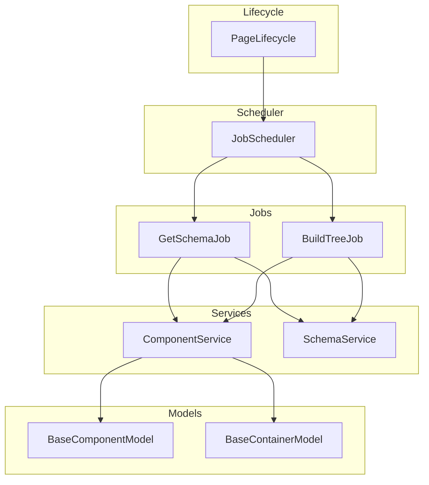
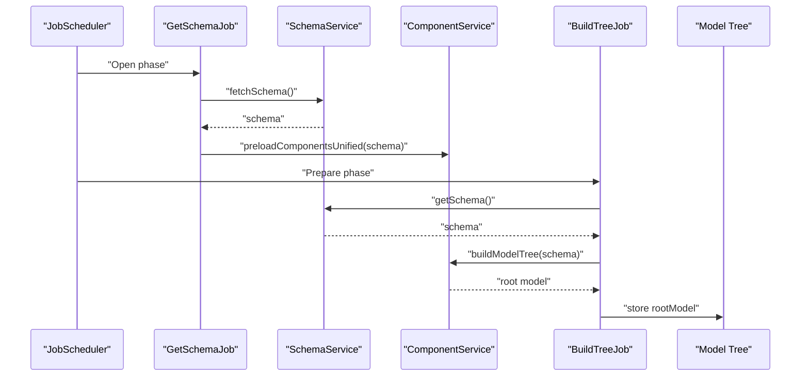
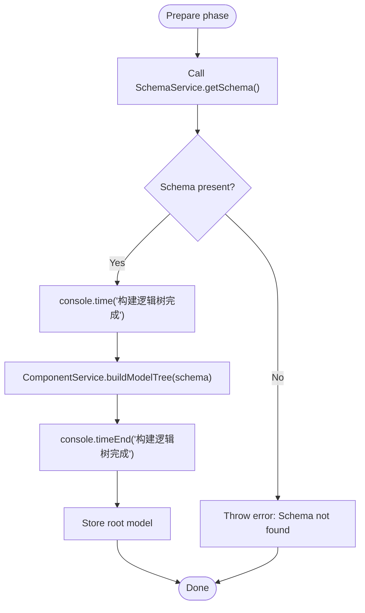
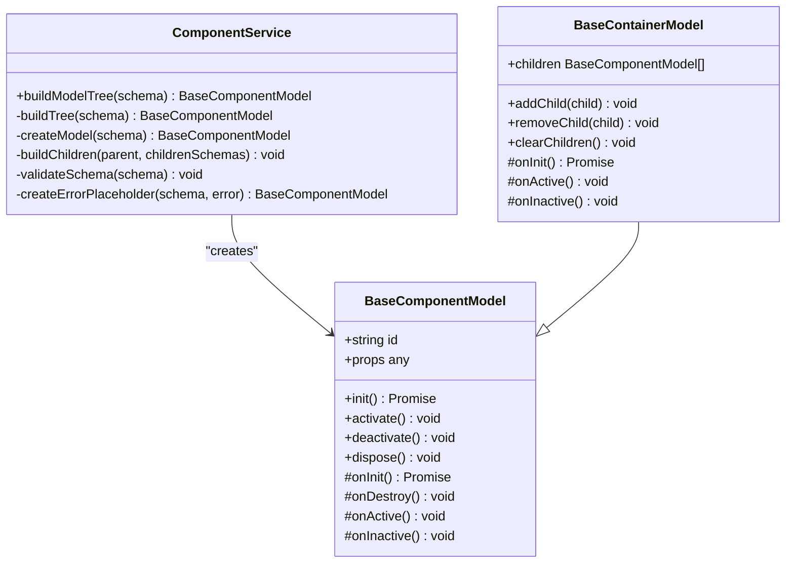
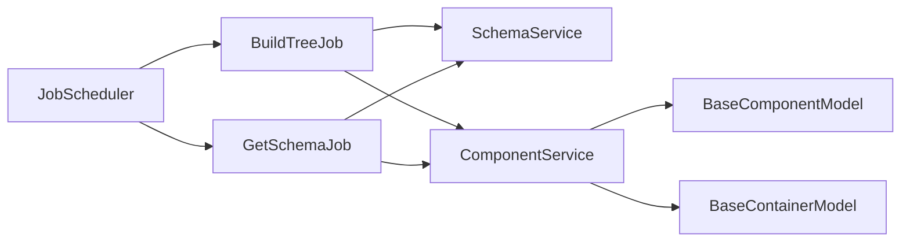

# Build Tree Job

<cite>
**Referenced Files in This Document**
- [build-tree-job.ts](file://packages/h5-builder/src/jobs/build-tree-job.ts)
- [component.service.ts](file://packages/h5-builder/src/services/component.service.ts)
- [schema.service.ts](file://packages/h5-builder/src/services/schema.service.ts)
- [get-schema-job.ts](file://packages/h5-builder/src/jobs/get-schema-job.ts)
- [job-scheduler.ts](file://packages/h5-builder/src/bedrock/launch/job-scheduler.ts)
- [lifecycle.ts](file://packages/h5-builder/src/jobs/lifecycle.ts)
- [service-identifiers.ts](file://packages/h5-builder/src/services/service-identifiers.ts)
- [model.ts](file://packages/h5-builder/src/bedrock/model.ts)
- [demo-data.ts](file://packages/h5-builder/src/mock/demo-data.ts)
- [product-card.model.ts](file://packages/h5-builder/src/components/product-card/product-card.model.ts)
- [grid-layout-container.model.ts](file://packages/h5-builder/src/components/grid-layout-container/grid-layout-container.model.ts)
</cite>

## Table of Contents
1. [Introduction](#introduction)
2. [Project Structure](#project-structure)
3. [Core Components](#core-components)
4. [Architecture Overview](#architecture-overview)
5. [Detailed Component Analysis](#detailed-component-analysis)
6. [Dependency Analysis](#dependency-analysis)
7. [Performance Considerations](#performance-considerations)
8. [Troubleshooting Guide](#troubleshooting-guide)
9. [Conclusion](#conclusion)

## Introduction
This document explains the BuildTreeJob component and its role in the Prepare phase of the page lifecycle. BuildTreeJob constructs the model tree from the acquired schema by delegating to ComponentService.buildModelTree(), which transforms the declarative ComponentSchema into a runtime hierarchy of BaseComponentModel instances. It relies on SchemaService for schema retrieval, validates the presence of the schema, and measures construction time. The job integrates with the job scheduler and depends on the successful completion of GetSchemaJob, which fetches the schema and preloads component resources.

## Project Structure
The BuildTreeJob resides in the jobs module and collaborates with services and models across the codebase. The lifecycle defines the phases during which jobs execute, and the job scheduler coordinates job registration, preparation, and advancement across phases.

**Diagram sources**
- [build-tree-job.ts](file://packages/h5-builder/src/jobs/build-tree-job.ts#L1-L59)
- [component.service.ts](file://packages/h5-builder/src/services/component.service.ts#L130-L170)
- [schema.service.ts](file://packages/h5-builder/src/services/schema.service.ts#L1-L38)
- [get-schema-job.ts](file://packages/h5-builder/src/jobs/get-schema-job.ts#L1-L119)
- [job-scheduler.ts](file://packages/h5-builder/src/bedrock/launch/job-scheduler.ts#L1-L123)
- [lifecycle.ts](file://packages/h5-builder/src/jobs/lifecycle.ts#L1-L18)
- [model.ts](file://packages/h5-builder/src/bedrock/model.ts#L10-L243)

**Section sources**
- [build-tree-job.ts](file://packages/h5-builder/src/jobs/build-tree-job.ts#L1-L59)
- [job-scheduler.ts](file://packages/h5-builder/src/bedrock/launch/job-scheduler.ts#L1-L123)
- [lifecycle.ts](file://packages/h5-builder/src/jobs/lifecycle.ts#L1-L18)

## Core Components
- BuildTreeJob: Executes in the Prepare phase and builds the model tree from the schema via ComponentService.buildModelTree().
- ComponentService: Validates schema, resolves component types, instantiates models, and constructs the model tree. It also handles asynchronous component loading and error fallbacks.
- SchemaService: Provides the schema object and simulates fetching it asynchronously.
- GetSchemaJob: Fetches the schema, registers component loaders, and triggers component preloading before BuildTreeJob runs.
- JobScheduler: Coordinates job registration and execution across lifecycle phases.
- BaseComponentModel and BaseContainerModel: Foundation classes for all component models and containers.

**Section sources**
- [build-tree-job.ts](file://packages/h5-builder/src/jobs/build-tree-job.ts#L1-L59)
- [component.service.ts](file://packages/h5-builder/src/services/component.service.ts#L130-L170)
- [schema.service.ts](file://packages/h5-builder/src/services/schema.service.ts#L1-L38)
- [get-schema-job.ts](file://packages/h5-builder/src/jobs/get-schema-job.ts#L1-L119)
- [job-scheduler.ts](file://packages/h5-builder/src/bedrock/launch/job-scheduler.ts#L1-L123)
- [model.ts](file://packages/h5-builder/src/bedrock/model.ts#L10-L243)

## Architecture Overview
BuildTreeJob participates in the Prepare phase of the page lifecycle. It expects the schema to be present (acquired by GetSchemaJob) and delegates model tree construction to ComponentService. The job records timing around the build operation and throws an error if the schema is missing. ComponentService performs validation, type resolution, and recursive model building, returning a root model representing the entire tree.

**Diagram sources**
- [get-schema-job.ts](file://packages/h5-builder/src/jobs/get-schema-job.ts#L48-L66)
- [schema.service.ts](file://packages/h5-builder/src/services/schema.service.ts#L23-L32)
- [component.service.ts](file://packages/h5-builder/src/services/component.service.ts#L722-L734)
- [build-tree-job.ts](file://packages/h5-builder/src/jobs/build-tree-job.ts#L46-L57)

## Detailed Component Analysis

### BuildTreeJob
- Role: Runs in the Prepare phase to construct the model tree from the schema.
- Dependencies: Requires SchemaService for schema retrieval and ComponentService for model tree construction.
- Execution flow:
  - On Prepare, retrieves schema via SchemaService.getSchema().
  - Throws an error if schema is missing.
  - Logs timing markers and calls ComponentService.buildModelTree(schema).
  - Stores the resulting root model for later use.
- Timing measurement: Uses console.time/console.timeEnd around the build operation to measure construction duration.

**Diagram sources**
- [build-tree-job.ts](file://packages/h5-builder/src/jobs/build-tree-job.ts#L46-L57)

**Section sources**
- [build-tree-job.ts](file://packages/h5-builder/src/jobs/build-tree-job.ts#L1-L59)

### ComponentService.buildModelTree
- Purpose: Synchronously build a model tree from a ComponentSchema.
- Validation: Ensures schema has required fields and a registered component type.
- Instantiation: Resolves the model class from the registry and creates an instance with id and props.
- Children handling: If the model is a container and children exist, recursively builds child models and attaches them.
- Error handling: Catches errors during validation, instantiation, or child building, and returns an error placeholder model to keep the tree intact.

**Diagram sources**
- [component.service.ts](file://packages/h5-builder/src/services/component.service.ts#L130-L170)
- [component.service.ts](file://packages/h5-builder/src/services/component.service.ts#L186-L209)
- [component.service.ts](file://packages/h5-builder/src/services/component.service.ts#L211-L243)
- [model.ts](file://packages/h5-builder/src/bedrock/model.ts#L10-L243)

**Section sources**
- [component.service.ts](file://packages/h5-builder/src/services/component.service.ts#L130-L170)
- [component.service.ts](file://packages/h5-builder/src/services/component.service.ts#L186-L209)
- [component.service.ts](file://packages/h5-builder/src/services/component.service.ts#L211-L243)
- [model.ts](file://packages/h5-builder/src/bedrock/model.ts#L10-L243)

### SchemaService
- Provides the schema object and simulates asynchronous fetching.
- Exposes getSchema() to retrieve the schema synchronously after it has been fetched.

**Section sources**
- [schema.service.ts](file://packages/h5-builder/src/services/schema.service.ts#L1-L38)

### GetSchemaJob and Preloading
- Fetches the schema and registers component loaders with ComponentService.
- Triggers component preloading (both model and view) to ensure models are ready before Prepare phase.
- Opens a barrier to signal readiness to downstream jobs.

**Section sources**
- [get-schema-job.ts](file://packages/h5-builder/src/jobs/get-schema-job.ts#L48-L66)

### Lifecycle and Job Scheduler
- PageLifecycle enumerates phases: Open, LoadComponentLogic, Prepare, RenderReady, Render, Completed, Idle.
- JobScheduler registers jobs per phase, prepares them, advances phases, and waits for jobs that should wait.

**Section sources**
- [lifecycle.ts](file://packages/h5-builder/src/jobs/lifecycle.ts#L1-L18)
- [job-scheduler.ts](file://packages/h5-builder/src/bedrock/launch/job-scheduler.ts#L1-L123)

## Dependency Analysis
- BuildTreeJob depends on:
  - SchemaService.getSchema() for retrieving the schema.
  - ComponentService.buildModelTree(schema) for constructing the model tree.
- ComponentService depends on:
  - ComponentRegistry for type-to-model mapping.
  - IInstantiationService for creating model instances.
  - TrackerService for telemetry.
- GetSchemaJob must complete before BuildTreeJob executes in Prepare phase.
- JobScheduler orchestrates the order of job execution across phases.

**Diagram sources**
- [build-tree-job.ts](file://packages/h5-builder/src/jobs/build-tree-job.ts#L1-L59)
- [component.service.ts](file://packages/h5-builder/src/services/component.service.ts#L130-L170)
- [get-schema-job.ts](file://packages/h5-builder/src/jobs/get-schema-job.ts#L1-L119)
- [job-scheduler.ts](file://packages/h5-builder/src/bedrock/launch/job-scheduler.ts#L1-L123)
- [model.ts](file://packages/h5-builder/src/bedrock/model.ts#L10-L243)

**Section sources**
- [build-tree-job.ts](file://packages/h5-builder/src/jobs/build-tree-job.ts#L1-L59)
- [component.service.ts](file://packages/h5-builder/src/services/component.service.ts#L130-L170)
- [get-schema-job.ts](file://packages/h5-builder/src/jobs/get-schema-job.ts#L1-L119)
- [job-scheduler.ts](file://packages/h5-builder/src/bedrock/launch/job-scheduler.ts#L1-L123)
- [model.ts](file://packages/h5-builder/src/bedrock/model.ts#L10-L243)

## Performance Considerations
- Large schema trees:
  - ComponentService.buildModelTree() is synchronous and suitable when all models are preloaded. Ensure GetSchemaJob completes preloading before Prepare to avoid blocking.
  - For extremely large trees, consider:
    - Lazy initialization of child models to defer heavy work until activation.
    - Breaking the tree into chunks and initializing subtrees progressively.
- Asynchronous component loading:
  - ComponentService.preloadComponentsUnified() uses unified concurrency controls and caches loaded models/views. Tune priorities and delay ranges to balance responsiveness and throughput.
- Timing measurement:
  - BuildTreeJob logs timing around model tree construction. Use this to profile hotspots and optimize heavy components.
- Concurrency:
  - ComponentService uses separate concurrency limits for model and view loading. Adjust these limits based on device capabilities and network conditions.

[No sources needed since this section provides general guidance]

## Troubleshooting Guide
Common issues and resolutions:
- Missing schema:
  - Symptom: BuildTreeJob throws an error indicating schema not found.
  - Cause: SchemaService.getSchema() returns null because GetSchemaJob did not complete or fetchSchema() failed.
  - Resolution: Ensure GetSchemaJob finishes in Open phase and that fetchSchema() resolves successfully. Verify that preloadComponentsUnified() is invoked with the schema.
  - Evidence: BuildTreeJob checks schema presence and throws an error if absent.
- Unknown component type:
  - Symptom: ComponentService throws an error for unknown component type during validation.
  - Cause: Component type in schema is not registered in ComponentRegistry.
  - Resolution: Register the component type via ComponentService.register() or registerAsync() before Prepare phase.
  - Evidence: ComponentService.validateSchema() checks for type and registry presence.
- Malformed schema:
  - Symptom: Validation errors thrown during build.
  - Cause: Missing type or id fields in schema.
  - Resolution: Ensure each component schema includes type and id. Add meta and children as needed.
  - Evidence: ComponentService.validateSchema() enforces required fields.
- Circular dependencies:
  - Symptom: Unexpected behavior or infinite recursion during tree construction.
  - Cause: Schema defines cycles (e.g., a component indirectly references itself).
  - Resolution: Restructure schema to eliminate cycles. Prefer acyclic component hierarchies.
  - Evidence: ComponentService.buildTree() recursively builds children; cycles can cause infinite loops.
- Child model mismatch:
  - Symptom: Warning that a component has children but is not a container model.
  - Cause: Non-container model receives children in schema.
  - Resolution: Use container models (BaseContainerModel) for nodes with children.
  - Evidence: ComponentService warns when children exist but model is not a container.
- Asynchronous loading failures:
  - Symptom: Empty models or silent failures for some components.
  - Cause: Model or view loader fails; ComponentService falls back to empty placeholders.
  - Resolution: Inspect loader functions and retry strategies. Monitor tracker events for failures.
  - Evidence: ComponentService.loadModel/loadView handle errors and register empty models/views.

Concrete examples from the codebase:
- BuildTreeJob timing markers and error handling:
  - See timing logs and error throwing in Prepare phase.
  - Reference: [build-tree-job.ts](file://packages/h5-builder/src/jobs/build-tree-job.ts#L46-L57)
- ComponentService validation and error placeholder:
  - See validateSchema() and createErrorPlaceholder() behavior.
  - Reference: [component.service.ts](file://packages/h5-builder/src/services/component.service.ts#L211-L243)
- ComponentService child building and container handling:
  - See buildTree() and buildChildren() logic.
  - Reference: [component.service.ts](file://packages/h5-builder/src/services/component.service.ts#L130-L209)
- GetSchemaJob preloading and barrier opening:
  - See fetchSchema(), registerAsync(), and preloadComponentsUnified() invocation.
  - Reference: [get-schema-job.ts](file://packages/h5-builder/src/jobs/get-schema-job.ts#L48-L66)

**Section sources**
- [build-tree-job.ts](file://packages/h5-builder/src/jobs/build-tree-job.ts#L46-L57)
- [component.service.ts](file://packages/h5-builder/src/services/component.service.ts#L130-L209)
- [component.service.ts](file://packages/h5-builder/src/services/component.service.ts#L211-L243)
- [get-schema-job.ts](file://packages/h5-builder/src/jobs/get-schema-job.ts#L48-L66)

## Conclusion
BuildTreeJob is a critical component in the Prepare phase that transforms a validated schema into a robust model tree using ComponentService. Its reliance on SchemaService ensures schema availability, while ComponentService’s validation and error handling guarantee resilience against malformed schemas and missing types. Proper sequencing via GetSchemaJob and JobScheduler guarantees that component resources are preloaded before model construction begins. By leveraging timing logs, error placeholders, and asynchronous loading strategies, teams can build scalable and maintainable model trees even for large, deeply nested schemas.