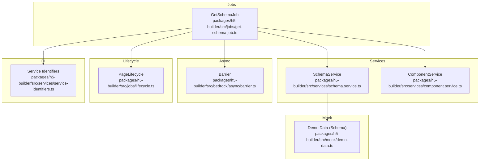
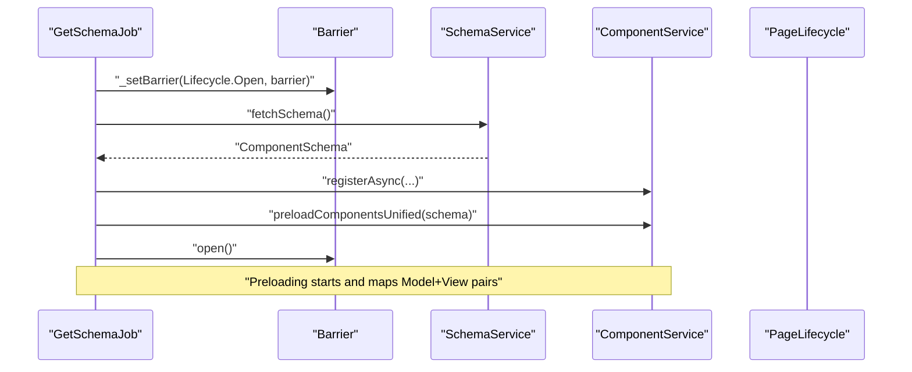
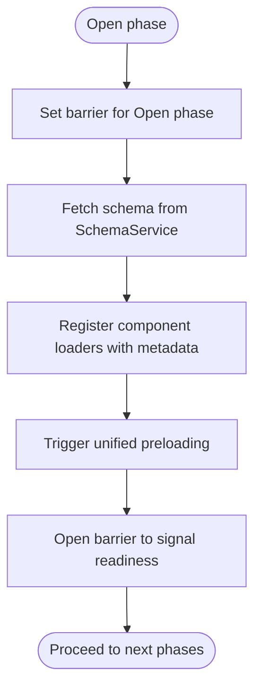
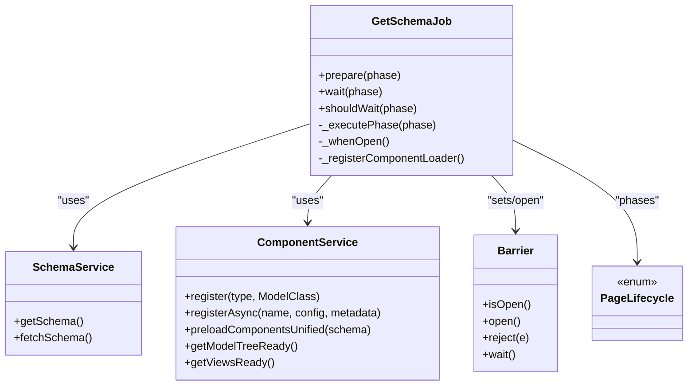

# Get Schema Job

<cite>
**Referenced Files in This Document**
- [get-schema-job.ts](file://packages/h5-builder/src/jobs/get-schema-job.ts)
- [schema.service.ts](file://packages/h5-builder/src/services/schema.service.ts)
- [component.service.ts](file://packages/h5-builder/src/services/component.service.ts)
- [barrier.ts](file://packages/h5-builder/src/bedrock/async/barrier.ts)
- [abstract-job.ts](file://packages/h5-builder/src/bedrock/launch/abstract-job.ts)
- [lifecycle.ts](file://packages/h5-builder/src/jobs/lifecycle.ts)
- [service-identifiers.ts](file://packages/h5-builder/src/services/service-identifiers.ts)
- [demo-data.ts](file://packages/h5-builder/src/mock/demo-data.ts)
- [product-card.model.ts](file://packages/h5-builder/src/components/product-card/product-card.model.ts)
- [text-card.model.ts](file://packages/h5-builder/src/components/text-card/text-card.model.ts)
- [tabs-container.model.ts](file://packages/h5-builder/src/components/tabs-container/tabs-container.model.ts)
</cite>

## Table of Contents
1. [Introduction](#introduction)
2. [Project Structure](#project-structure)
3. [Core Components](#core-components)
4. [Architecture Overview](#architecture-overview)
5. [Detailed Component Analysis](#detailed-component-analysis)
6. [Dependency Analysis](#dependency-analysis)
7. [Performance Considerations](#performance-considerations)
8. [Troubleshooting Guide](#troubleshooting-guide)
9. [Conclusion](#conclusion)

## Introduction
This document explains the GetSchemaJob component, detailing how it initiates during the Open phase, fetches the page schema via SchemaService, registers component loaders with priority-based preloading, and coordinates with ComponentService for asynchronous component registration. It also covers the use of Barrier for phase synchronization and how the job integrates with the broader lifecycle and DI system. Concrete examples from the codebase illustrate registration patterns for ProductCard, TextCard, TabsContainer, and other components, including their priority and delay configurations. Finally, it addresses error handling during schema acquisition and common issues such as schema fetch failures and race conditions, with practical solutions.

## Project Structure
The GetSchemaJob lives in the jobs module and collaborates with services and models across the codebase. The key files involved are:
- Jobs: GetSchemaJob orchestrates schema fetching and component loader registration.
- Services: SchemaService provides the schema; ComponentService manages component registration, async loading, and unified preloading.
- Async Utilities: Barrier synchronizes phases.
- Lifecycle: Defines the page lifecycle phases.
- DI Identifiers: Provide typed service injection.
- Mock Data: Supplies the schema used by SchemaService.

**Diagram sources**
- [get-schema-job.ts](file://packages/h5-builder/src/jobs/get-schema-job.ts#L1-L119)
- [schema.service.ts](file://packages/h5-builder/src/services/schema.service.ts#L1-L38)
- [component.service.ts](file://packages/h5-builder/src/services/component.service.ts#L1-L735)
- [barrier.ts](file://packages/h5-builder/src/bedrock/async/barrier.ts#L1-L59)
- [lifecycle.ts](file://packages/h5-builder/src/jobs/lifecycle.ts#L1-L18)
- [service-identifiers.ts](file://packages/h5-builder/src/services/service-identifiers.ts#L1-L20)
- [demo-data.ts](file://packages/h5-builder/src/mock/demo-data.ts#L1-L334)

**Section sources**
- [get-schema-job.ts](file://packages/h5-builder/src/jobs/get-schema-job.ts#L1-L119)
- [schema.service.ts](file://packages/h5-builder/src/services/schema.service.ts#L1-L38)
- [component.service.ts](file://packages/h5-builder/src/services/component.service.ts#L1-L735)
- [barrier.ts](file://packages/h5-builder/src/bedrock/async/barrier.ts#L1-L59)
- [lifecycle.ts](file://packages/h5-builder/src/jobs/lifecycle.ts#L1-L18)
- [service-identifiers.ts](file://packages/h5-builder/src/services/service-identifiers.ts#L1-L20)
- [demo-data.ts](file://packages/h5-builder/src/mock/demo-data.ts#L1-L334)

## Core Components
- GetSchemaJob: Implements the Open phase to fetch schema, register component loaders, and coordinate preloading. It uses a Barrier to signal completion of schema acquisition and subsequent preloading.
- SchemaService: Provides the schema asynchronously; in this codebase, it returns a mock schema after a short delay.
- ComponentService: Manages component registration, async loader registration, and unified preloading of models and views with configurable priorities and delays. It also handles error recovery by registering empty placeholders when loads fail.
- Barrier: A synchronization primitive used to coordinate phase completion across jobs.
- AbstractJob: Base class that provides phase lifecycle hooks and barrier management.
- PageLifecycle: Enumerates lifecycle phases used by jobs.
- Service Identifiers: Typed decorators for DI injection of services.
- Demo Data: Supplies the schema used by SchemaService.

**Section sources**
- [get-schema-job.ts](file://packages/h5-builder/src/jobs/get-schema-job.ts#L1-L119)
- [schema.service.ts](file://packages/h5-builder/src/services/schema.service.ts#L1-L38)
- [component.service.ts](file://packages/h5-builder/src/services/component.service.ts#L1-L735)
- [barrier.ts](file://packages/h5-builder/src/bedrock/async/barrier.ts#L1-L59)
- [abstract-job.ts](file://packages/h5-builder/src/bedrock/launch/abstract-job.ts#L1-L46)
- [lifecycle.ts](file://packages/h5-builder/src/jobs/lifecycle.ts#L1-L18)
- [service-identifiers.ts](file://packages/h5-builder/src/services/service-identifiers.ts#L1-L20)
- [demo-data.ts](file://packages/h5-builder/src/mock/demo-data.ts#L1-L334)

## Architecture Overview
The GetSchemaJob participates in the page lifecycle and coordinates with SchemaService and ComponentService. During the Open phase, it:
- Waits for the Open phase barrier to be set.
- Fetches the schema from SchemaService.
- Registers component loaders with ComponentService, specifying priority and delay ranges.
- Triggers unified preloading of models and views based on the fetched schema.
- Opens the barrier to signal readiness for downstream phases.

**Diagram sources**
- [get-schema-job.ts](file://packages/h5-builder/src/jobs/get-schema-job.ts#L25-L118)
- [barrier.ts](file://packages/h5-builder/src/bedrock/async/barrier.ts#L1-L59)
- [schema.service.ts](file://packages/h5-builder/src/services/schema.service.ts#L23-L32)
- [component.service.ts](file://packages/h5-builder/src/services/component.service.ts#L286-L317)
- [component.service.ts](file://packages/h5-builder/src/services/component.service.ts#L628-L718)
- [lifecycle.ts](file://packages/h5-builder/src/jobs/lifecycle.ts#L1-L18)

## Detailed Component Analysis

### GetSchemaJob Implementation Details
- Phase handling: Overrides the internal phase execution to handle the Open phase, where schema fetching and loader registration occur.
- Barrier usage: Sets a barrier for the Open phase and opens it after schema acquisition and preloading.
- Schema acquisition: Calls SchemaService.fetchSchema() and logs timing around the operation.
- Loader registration: Registers multiple components with distinct metadata including priority and delay ranges.
- Unified preloading: Invokes ComponentService.preloadComponentsUnified(schema) to start model and view preloading concurrently.

Concrete registration examples and their metadata:
- ProductCard: high priority, delay range approximately 200–800 ms.
- TextCard: normal priority, delay range approximately 2200–3000 ms.
- TabsContainer: critical priority, delay range approximately 100–500 ms.
- ProductList: high priority, delay range approximately 150–600 ms.
- ExperimentContainer: normal priority, with dependencies on TextCard and ProductCard, delay range approximately 400–1200 ms.
- TimeBasedContainer: high priority, delay range approximately 300–900 ms.
- GridLayoutContainer: normal priority, delay range approximately 250–800 ms.
- ConditionalContainer: normal priority, delay range approximately 300–1000 ms.

These registrations demonstrate how priority and delay ranges influence resource loading order and timing.

**Section sources**
- [get-schema-job.ts](file://packages/h5-builder/src/jobs/get-schema-job.ts#L25-L118)
- [component.service.ts](file://packages/h5-builder/src/services/component.service.ts#L286-L317)
- [component.service.ts](file://packages/h5-builder/src/services/component.service.ts#L628-L718)

### SchemaService Behavior
- Provides a mock schema after a short delay.
- Exposes getSchema() and fetchSchema() methods.
- Stores the last fetched schema internally for potential reuse.

Integration with GetSchemaJob:
- GetSchemaJob calls fetchSchema() during Open phase and uses the returned schema to drive component registration and preloading.

**Section sources**
- [schema.service.ts](file://packages/h5-builder/src/services/schema.service.ts#L1-L38)
- [demo-data.ts](file://packages/h5-builder/src/mock/demo-data.ts#L1-L334)

### ComponentService Registration and Preloading
- Component registration:
  - Synchronous register(type, ModelClass) and batch registerAll(components).
  - Asynchronous registerAsync(componentName, config, metadata) stores loaders and metadata.
- Metadata fields:
  - priority: critical, high, normal, low.
  - dependencies: array of component names that must load first.
  - delayRange: [minDelay, maxDelay] to simulate randomized delays.
  - preload and lazy flags.
- Unified preloading:
  - preloadComponentsUnified(schema) collects unique component types from the schema, builds queues for models and views, and executes them with concurrency limits.
  - Uses separate queues for models and views, then registers Model-View mappings after all resources are ready.
- Error handling:
  - On model load failure, registers an empty model placeholder and tracks errors.
  - On view load failure, caches an empty view and tracks errors.
- Concurrency controls:
  - Model concurrency, view concurrency, and total unified concurrency are configured to balance throughput and responsiveness.

Registration patterns shown in GetSchemaJob:
- ProductCard, TextCard, TabsContainer, ProductList, ExperimentContainer, TimeBasedContainer, GridLayoutContainer, ConditionalContainer are registered with metadata including priority and delay ranges.

**Section sources**
- [component.service.ts](file://packages/h5-builder/src/services/component.service.ts#L1-L256)
- [component.service.ts](file://packages/h5-builder/src/services/component.service.ts#L258-L735)

### Barrier and Phase Synchronization
- Barrier provides isOpen(), open(), reject(), and wait().
- AbstractJob maintains a map of barriers per phase and resolves them when jobs finish preparing for that phase.
- GetSchemaJob sets a barrier for the Open phase and opens it after schema acquisition and preloading completes.

**Diagram sources**
- [get-schema-job.ts](file://packages/h5-builder/src/jobs/get-schema-job.ts#L48-L118)
- [barrier.ts](file://packages/h5-builder/src/bedrock/async/barrier.ts#L1-L59)
- [abstract-job.ts](file://packages/h5-builder/src/bedrock/launch/abstract-job.ts#L1-L46)

**Section sources**
- [barrier.ts](file://packages/h5-builder/src/bedrock/async/barrier.ts#L1-L59)
- [abstract-job.ts](file://packages/h5-builder/src/bedrock/launch/abstract-job.ts#L1-L46)
- [get-schema-job.ts](file://packages/h5-builder/src/jobs/get-schema-job.ts#L48-L118)

### Relationship with Other Components
- DI Integration: GetSchemaJob receives SchemaService and ComponentService via typed identifiers, enabling clean separation and testability.
- Lifecycle Integration: The job participates in PageLifecycle, ensuring schema acquisition and preloading align with the overall page progression.
- Component Models: The registered components (e.g., ProductCardModel, TextCardModel, TabsContainerModel) are referenced by type in the schema and loaded asynchronously by ComponentService.

**Section sources**
- [service-identifiers.ts](file://packages/h5-builder/src/services/service-identifiers.ts#L1-L20)
- [lifecycle.ts](file://packages/h5-builder/src/jobs/lifecycle.ts#L1-L18)
- [product-card.model.ts](file://packages/h5-builder/src/components/product-card/product-card.model.ts#L1-L133)
- [text-card.model.ts](file://packages/h5-builder/src/components/text-card/text-card.model.ts#L1-L21)
- [tabs-container.model.ts](file://packages/h5-builder/src/components/tabs-container/tabs-container.model.ts#L1-L273)

## Dependency Analysis
The following diagram shows how GetSchemaJob depends on SchemaService, ComponentService, Barrier, and the lifecycle:

**Diagram sources**
- [get-schema-job.ts](file://packages/h5-builder/src/jobs/get-schema-job.ts#L1-L119)
- [schema.service.ts](file://packages/h5-builder/src/services/schema.service.ts#L1-L38)
- [component.service.ts](file://packages/h5-builder/src/services/component.service.ts#L1-L735)
- [barrier.ts](file://packages/h5-builder/src/bedrock/async/barrier.ts#L1-L59)
- [lifecycle.ts](file://packages/h5-builder/src/jobs/lifecycle.ts#L1-L18)

**Section sources**
- [get-schema-job.ts](file://packages/h5-builder/src/jobs/get-schema-job.ts#L1-L119)
- [schema.service.ts](file://packages/h5-builder/src/services/schema.service.ts#L1-L38)
- [component.service.ts](file://packages/h5-builder/src/services/component.service.ts#L1-L735)
- [barrier.ts](file://packages/h5-builder/src/bedrock/async/barrier.ts#L1-L59)
- [lifecycle.ts](file://packages/h5-builder/src/jobs/lifecycle.ts#L1-L18)

## Performance Considerations
- Unified preloading: ComponentService’s unified queue ensures models and views are loaded concurrently while respecting configured concurrency limits, reducing total loading time.
- Priority and delay: Using priority and delay ranges allows prioritizing critical components and staggering less important ones to improve perceived performance.
- Caching: ComponentService caches loaded models and views to avoid redundant network requests.
- Error resilience: On load failure, empty placeholders are registered to prevent blocking other components, maintaining overall responsiveness.

[No sources needed since this section provides general guidance]

## Troubleshooting Guide
Common issues and solutions:
- Schema fetch failures:
  - Symptom: SchemaService fails to resolve fetchSchema().
  - Solution: Wrap schema acquisition in robust error handling and retry logic if applicable. Ensure the barrier is opened even on failure to unblock downstream phases.
- Race conditions:
  - Symptom: Subsequent phases start before schema acquisition completes.
  - Solution: Use the barrier mechanism to synchronize; ensure _setBarrier is called before any async work and open() is invoked after completion.
- Component load failures:
  - Symptom: Some components fail to load models or views.
  - Solution: ComponentService already registers empty placeholders and tracks errors; verify metadata (priority, delayRange, dependencies) and ensure dependencies are registered before dependents.
- Incorrect component types:
  - Symptom: Unknown component type errors when building the model tree.
  - Solution: Ensure all component loaders are registered before preloadComponentsUnified(schema) is called and that the schema types match registered component names.

**Section sources**
- [schema.service.ts](file://packages/h5-builder/src/services/schema.service.ts#L23-L32)
- [component.service.ts](file://packages/h5-builder/src/services/component.service.ts#L370-L471)
- [component.service.ts](file://packages/h5-builder/src/services/component.service.ts#L472-L514)
- [component.service.ts](file://packages/h5-builder/src/services/component.service.ts#L628-L718)

## Conclusion
GetSchemaJob orchestrates schema acquisition and component loader registration during the Open phase, coordinating with SchemaService and ComponentService. It leverages Barrier for precise phase synchronization and uses ComponentService’s unified preloading to efficiently load models and views with configurable priorities and delays. The system demonstrates robust error handling and provides mechanisms to address common issues such as schema fetch failures and race conditions. Together, these components form a cohesive pipeline for progressive rendering and efficient resource loading.