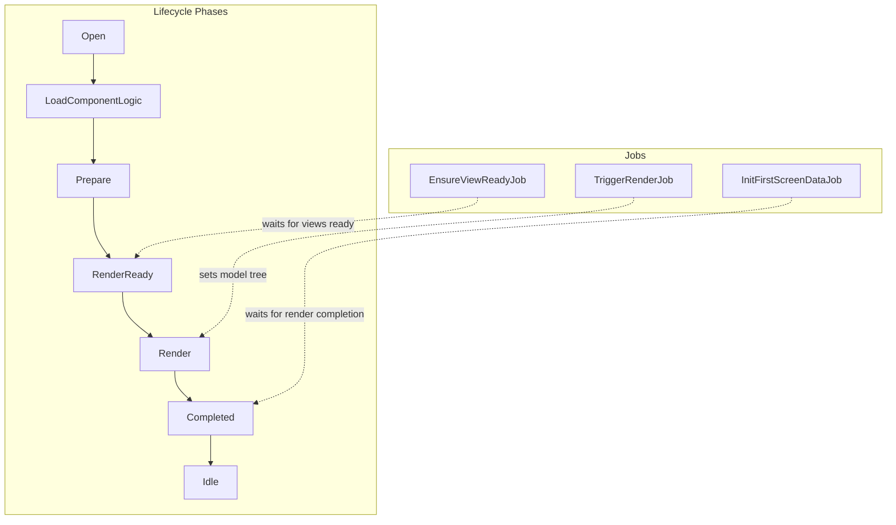
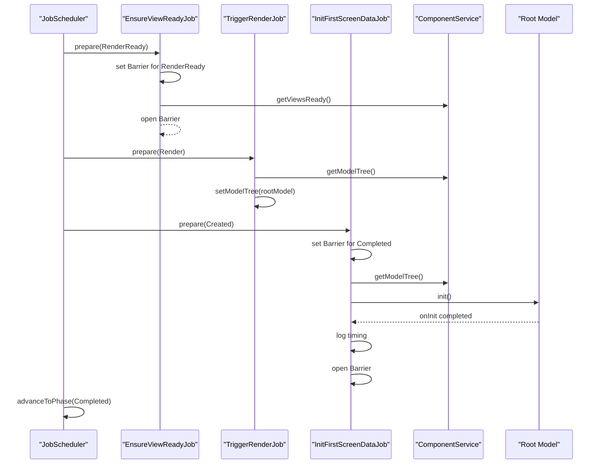
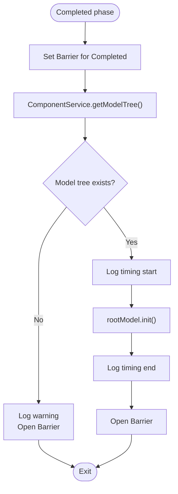
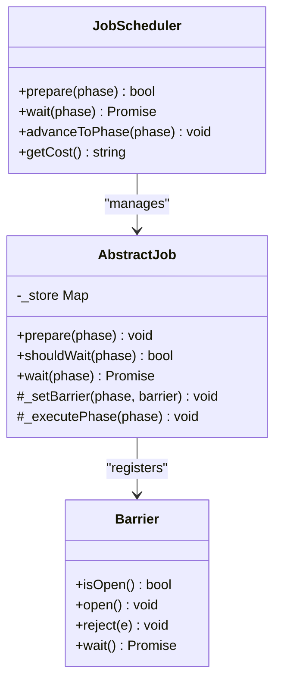
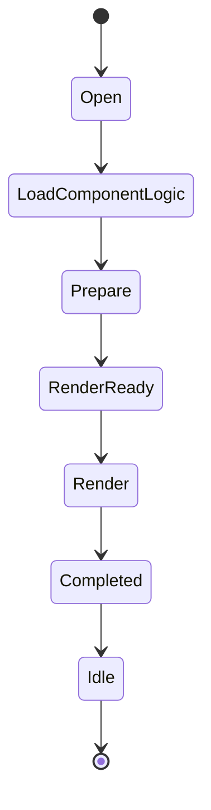
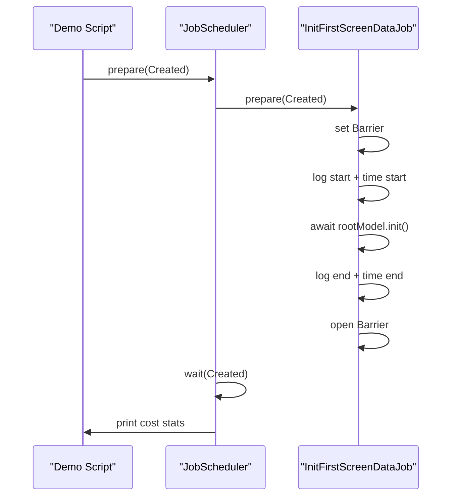
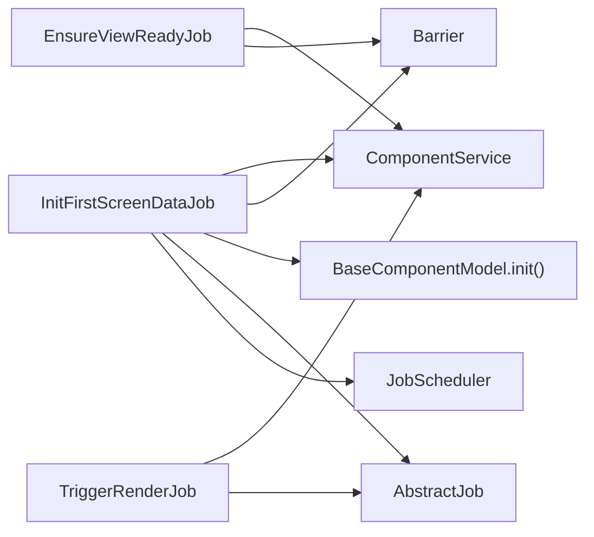

# Initialize First Screen Data Job

<cite>
**Referenced Files in This Document**
- [init-first-screen-data-job.ts](file://packages/h5-builder/src/jobs/init-first-screen-data-job.ts)
- [lifecycle.ts](file://packages/h5-builder/src/jobs/lifecycle.ts)
- [abstract-job.ts](file://packages/h5-builder/src/bedrock/launch/abstract-job.ts)
- [barrier.ts](file://packages/h5-builder/src/bedrock/async/barrier.ts)
- [job-scheduler.ts](file://packages/h5-builder/src/bedrock/launch/job-scheduler.ts)
- [ensure-view-ready.ts](file://packages/h5-builder/src/jobs/ensure-view-ready.ts)
- [trigger-render-job.ts](file://packages/h5-builder/src/jobs/trigger-render-job.ts)
- [component.service.ts](file://packages/h5-builder/src/services/component.service.ts)
- [model.ts](file://packages/h5-builder/src/bedrock/model.ts)
- [demo-progressive.tsx](file://packages/h5-builder/src/demo-progressive.tsx)
</cite>

## Table of Contents
1. [Introduction](#introduction)
2. [Project Structure](#project-structure)
3. [Core Components](#core-components)
4. [Architecture Overview](#architecture-overview)
5. [Detailed Component Analysis](#detailed-component-analysis)
6. [Dependency Analysis](#dependency-analysis)
7. [Performance Considerations](#performance-considerations)
8. [Troubleshooting Guide](#troubleshooting-guide)
9. [Conclusion](#conclusion)

## Introduction
This document explains the InitFirstScreenDataJob component, which runs during the Completed phase to initialize data for the first screen. Its primary responsibility is to ensure that rendering completes before initiating asynchronous data fetching by coordinating with a Barrier. It retrieves the root model from the ComponentService and calls its init method, which triggers onInit and subsequent data loading. The job also handles the case where the model tree is not yet available, logs timing metrics, and signals completion via a Barrier so downstream phases can proceed.

## Project Structure
The job participates in a staged lifecycle orchestrated by the JobScheduler. The Completed phase is where rendering is considered finished, and data initialization occurs asynchronously without blocking the UI.

**Diagram sources**
- [lifecycle.ts](file://packages/h5-builder/src/jobs/lifecycle.ts#L1-L18)
- [ensure-view-ready.ts](file://packages/h5-builder/src/jobs/ensure-view-ready.ts#L1-L53)
- [trigger-render-job.ts](file://packages/h5-builder/src/jobs/trigger-render-job.ts#L1-L44)
- [init-first-screen-data-job.ts](file://packages/h5-builder/src/jobs/init-first-screen-data-job.ts#L1-L66)

**Section sources**
- [lifecycle.ts](file://packages/h5-builder/src/jobs/lifecycle.ts#L1-L18)

## Core Components
- InitFirstScreenDataJob: Executes during Completed phase, sets a Barrier, checks for a root model, logs timing, calls rootModel.init(), and opens the Barrier upon completion.
- AbstractJob: Provides the base job contract, Barrier registration, and wait semantics.
- Barrier: A synchronization primitive used to coordinate readiness across jobs.
- JobScheduler: Manages job registration, preparation, waiting, and phase advancement.
- ComponentService: Builds and exposes the model tree; provides modelTreeReady and viewsReady for preloading.
- BaseComponentModel: Defines the init lifecycle and onInit hook that subclasses implement to fetch data.

**Section sources**
- [init-first-screen-data-job.ts](file://packages/h5-builder/src/jobs/init-first-screen-data-job.ts#L1-L66)
- [abstract-job.ts](file://packages/h5-builder/src/bedrock/launch/abstract-job.ts#L1-L46)
- [barrier.ts](file://packages/h5-builder/src/bedrock/async/barrier.ts#L1-L59)
- [job-scheduler.ts](file://packages/h5-builder/src/bedrock/launch/job-scheduler.ts#L1-L123)
- [component.service.ts](file://packages/h5-builder/src/services/component.service.ts#L700-L735)
- [model.ts](file://packages/h5-builder/src/bedrock/model.ts#L60-L121)

## Architecture Overview
The Completed phase is the designated time to initialize first-screen data after rendering is complete. The job ensures that:
- Rendering has finished by waiting on a Barrier set earlier in the pipeline.
- The model tree exists; otherwise it logs a warning and proceeds.
- Data fetching is performed via rootModel.init(), which invokes onInit and any subclass-specific data loading logic.
- Timing is measured around the data initialization call.
- The Barrier is opened to signal completion to the scheduler.

**Diagram sources**
- [ensure-view-ready.ts](file://packages/h5-builder/src/jobs/ensure-view-ready.ts#L1-L53)
- [trigger-render-job.ts](file://packages/h5-builder/src/jobs/trigger-render-job.ts#L1-L44)
- [init-first-screen-data-job.ts](file://packages/h5-builder/src/jobs/init-first-screen-data-job.ts#L1-L66)
- [component.service.ts](file://packages/h5-builder/src/services/component.service.ts#L720-L735)
- [model.ts](file://packages/h5-builder/src/bedrock/model.ts#L60-L121)

## Detailed Component Analysis

### InitFirstScreenDataJob
- Role: Runs in the Completed phase to initialize first-screen data after rendering is complete.
- Synchronization: Uses a Barrier to ensure the Completed phase does not advance until data initialization finishes.
- Model tree retrieval: Calls ComponentService.getModelTree() to obtain the root model.
- Error handling: If the model tree is missing, logs a warning and immediately opens the Barrier to unblock downstream phases.
- Asynchronous data fetching: Invokes rootModel.init(), which executes onInit and any subclass-defined data loading.
- Timing: Logs start/end markers and measures elapsed time around the init call.
- Completion: Opens the Barrier to signal readiness to the scheduler.

**Diagram sources**
- [init-first-screen-data-job.ts](file://packages/h5-builder/src/jobs/init-first-screen-data-job.ts#L48-L66)
- [component.service.ts](file://packages/h5-builder/src/services/component.service.ts#L720-L735)
- [model.ts](file://packages/h5-builder/src/bedrock/model.ts#L60-L121)

**Section sources**
- [init-first-screen-data-job.ts](file://packages/h5-builder/src/jobs/init-first-screen-data-job.ts#L1-L66)

### Barrier and Job Coordination
- Barrier: A simple synchronization primitive with isOpen, open, reject, and wait methods. It resolves a Promise when open is called.
- AbstractJob: Stores barriers per phase and exposes prepare, shouldWait, and wait. After waiting, it clears barriers to allow reuse.
- JobScheduler: Records per-job costs per phase, prepares jobs for a phase, waits for all barriers to open, and advances to the next phase.

**Diagram sources**
- [barrier.ts](file://packages/h5-builder/src/bedrock/async/barrier.ts#L1-L59)
- [abstract-job.ts](file://packages/h5-builder/src/bedrock/launch/abstract-job.ts#L1-L46)
- [job-scheduler.ts](file://packages/h5-builder/src/bedrock/launch/job-scheduler.ts#L1-L123)

**Section sources**
- [barrier.ts](file://packages/h5-builder/src/bedrock/async/barrier.ts#L1-L59)
- [abstract-job.ts](file://packages/h5-builder/src/bedrock/launch/abstract-job.ts#L1-L46)
- [job-scheduler.ts](file://packages/h5-builder/src/bedrock/launch/job-scheduler.ts#L1-L123)

### Lifecycle and Phase Transitions
- The lifecycle defines the stages: Open, LoadComponentLogic, Prepare, RenderReady, Render, Completed, Idle.
- EnsureViewReadyJob sets a Barrier during RenderReady and waits for views to be ready.
- TriggerRenderJob sets the model tree during Render.
- InitFirstScreenDataJob sets a Barrier during Completed and waits for render completion before initializing data.

**Diagram sources**
- [lifecycle.ts](file://packages/h5-builder/src/jobs/lifecycle.ts#L1-L18)
- [ensure-view-ready.ts](file://packages/h5-builder/src/jobs/ensure-view-ready.ts#L1-L53)
- [trigger-render-job.ts](file://packages/h5-builder/src/jobs/trigger-render-job.ts#L1-L44)
- [init-first-screen-data-job.ts](file://packages/h5-builder/src/jobs/init-first-screen-data-job.ts#L1-L66)

**Section sources**
- [lifecycle.ts](file://packages/h5-builder/src/jobs/lifecycle.ts#L1-L18)
- [ensure-view-ready.ts](file://packages/h5-builder/src/jobs/ensure-view-ready.ts#L1-L53)
- [trigger-render-job.ts](file://packages/h5-builder/src/jobs/trigger-render-job.ts#L1-L44)
- [init-first-screen-data-job.ts](file://packages/h5-builder/src/jobs/init-first-screen-data-job.ts#L1-L66)

### Data Initialization Sequence and Timing Measurement
- The job logs a start marker, starts timing, calls rootModel.init(), logs a completion marker, stops timing, and opens the Barrier.
- The demo script demonstrates measuring the duration of the Completed phase and printing performance statistics.

**Diagram sources**
- [init-first-screen-data-job.ts](file://packages/h5-builder/src/jobs/init-first-screen-data-job.ts#L48-L66)
- [demo-progressive.tsx](file://packages/h5-builder/src/demo-progressive.tsx#L159-L185)

**Section sources**
- [init-first-screen-data-job.ts](file://packages/h5-builder/src/jobs/init-first-screen-data-job.ts#L48-L66)
- [demo-progressive.tsx](file://packages/h5-builder/src/demo-progressive.tsx#L159-L185)

### Separation of Rendering and Data Loading
- Rendering is triggered by TriggerRenderJob during Render, which sets the model tree.
- Data initialization happens during Completed, after the Barrier indicates render completion.
- This separation prevents data fetching from blocking the initial render, improving perceived performance.

**Section sources**
- [trigger-render-job.ts](file://packages/h5-builder/src/jobs/trigger-render-job.ts#L1-L44)
- [init-first-screen-data-job.ts](file://packages/h5-builder/src/jobs/init-first-screen-data-job.ts#L1-L66)

## Dependency Analysis
- InitFirstScreenDataJob depends on:
  - ComponentService for retrieving the model tree.
  - BaseComponentModel.init to perform data initialization.
  - Barrier and AbstractJob for synchronization and lifecycle coordination.
  - JobScheduler for phase orchestration and timing.
- EnsureViewReadyJob coordinates resource readiness for RenderReady.
- TriggerRenderJob coordinates setting the model tree for rendering.

**Diagram sources**
- [init-first-screen-data-job.ts](file://packages/h5-builder/src/jobs/init-first-screen-data-job.ts#L1-L66)
- [ensure-view-ready.ts](file://packages/h5-builder/src/jobs/ensure-view-ready.ts#L1-L53)
- [trigger-render-job.ts](file://packages/h5-builder/src/jobs/trigger-render-job.ts#L1-L44)
- [component.service.ts](file://packages/h5-builder/src/services/component.service.ts#L700-L735)
- [model.ts](file://packages/h5-builder/src/bedrock/model.ts#L60-L121)
- [abstract-job.ts](file://packages/h5-builder/src/bedrock/launch/abstract-job.ts#L1-L46)
- [barrier.ts](file://packages/h5-builder/src/bedrock/async/barrier.ts#L1-L59)
- [job-scheduler.ts](file://packages/h5-builder/src/bedrock/launch/job-scheduler.ts#L1-L123)

**Section sources**
- [init-first-screen-data-job.ts](file://packages/h5-builder/src/jobs/init-first-screen-data-job.ts#L1-L66)
- [ensure-view-ready.ts](file://packages/h5-builder/src/jobs/ensure-view-ready.ts#L1-L53)
- [trigger-render-job.ts](file://packages/h5-builder/src/jobs/trigger-render-job.ts#L1-L44)
- [component.service.ts](file://packages/h5-builder/src/services/component.service.ts#L700-L735)
- [model.ts](file://packages/h5-builder/src/bedrock/model.ts#L60-L121)
- [abstract-job.ts](file://packages/h5-builder/src/bedrock/launch/abstract-job.ts#L1-L46)
- [barrier.ts](file://packages/h5-builder/src/bedrock/async/barrier.ts#L1-L59)
- [job-scheduler.ts](file://packages/h5-builder/src/bedrock/launch/job-scheduler.ts#L1-L123)

## Performance Considerations
- Prefetching and Preloading: ComponentService supports unified preloading of models and views with concurrency control and caching. This reduces latency during Completed phase by ensuring resources are ready.
- Concurrency Control: ComponentService uses Promise-based queues with concurrency limits to balance throughput and responsiveness.
- Caching: ComponentService caches loaded models and views to avoid repeated network requests.
- Timing Measurement: The job logs timing around init, and the demo prints overall phase durations, enabling targeted optimization.

Practical tips:
- Use ComponentService.preloadComponentsUnified early in the lifecycle to warm up model and view resources.
- Configure component metadata (priority, delayRange) to stagger loads and reduce contention.
- Monitor JobScheduler.getCost to identify slow jobs and optimize their onInit logic.

**Section sources**
- [component.service.ts](file://packages/h5-builder/src/services/component.service.ts#L626-L735)
- [init-first-screen-data-job.ts](file://packages/h5-builder/src/jobs/init-first-screen-data-job.ts#L48-L66)
- [demo-progressive.tsx](file://packages/h5-builder/src/demo-progressive.tsx#L159-L185)

## Troubleshooting Guide
Common issues and resolutions:
- Missing model tree during Completed:
  - Symptom: Warning logged and job exits early.
  - Cause: ComponentService.getModelTree() returned null.
  - Resolution: Ensure EnsureViewReadyJob and TriggerRenderJob have completed and that ComponentService.buildModelTree was called prior to Completed.
  - Evidence: The job explicitly checks for rootModel existence and opens the Barrier if absent.
  
- Data loading errors:
  - Symptom: Exceptions thrown inside onInit or fetchData.
  - Cause: Network failures, invalid data, or exceptions in subclass logic.
  - Resolution: Implement robust error handling in onInit and refresh; surface errors via the model’s error state; consider retry/backoff strategies.
  - Evidence: BaseComponentModel.refresh catches errors and sets error state.

- Timeout handling:
  - Symptom: Long-running init delays phase transitions.
  - Resolution: Introduce timeouts around long-running operations; consider breaking large init tasks into smaller chunks; leverage ComponentService’s concurrency controls to avoid overload.

- Race conditions with user interactions:
  - Symptom: UI responds before data is ready, leading to empty states.
  - Resolution: Keep data initialization asynchronous and separate from rendering; ensure the Barrier remains open until init completes; avoid triggering user actions until data is ready.

- Barrier lifecycle:
  - Symptom: Jobs stuck waiting or phase advancement blocked.
  - Resolution: Verify AbstractJob.clearing of barriers after wait; ensure each job opens its Barrier exactly once; confirm JobScheduler.advanceToPhase is called only after all shouldWait returns false.

**Section sources**
- [init-first-screen-data-job.ts](file://packages/h5-builder/src/jobs/init-first-screen-data-job.ts#L48-L66)
- [model.ts](file://packages/h5-builder/src/bedrock/model.ts#L100-L121)
- [abstract-job.ts](file://packages/h5-builder/src/bedrock/launch/abstract-job.ts#L19-L30)
- [job-scheduler.ts](file://packages/h5-builder/src/bedrock/launch/job-scheduler.ts#L93-L121)

## Conclusion
InitFirstScreenDataJob plays a crucial role in separating rendering from data loading during the Completed phase. By coordinating with a Barrier, checking for a valid model tree, and invoking rootModel.init, it ensures that data initialization occurs after render completion while maintaining precise timing and readiness signaling. Combined with ComponentService’s preloading, caching, and concurrency controls, this approach improves perceived performance and reliability. Proper error handling, timeout strategies, and careful Barrier management are essential for robust operation.